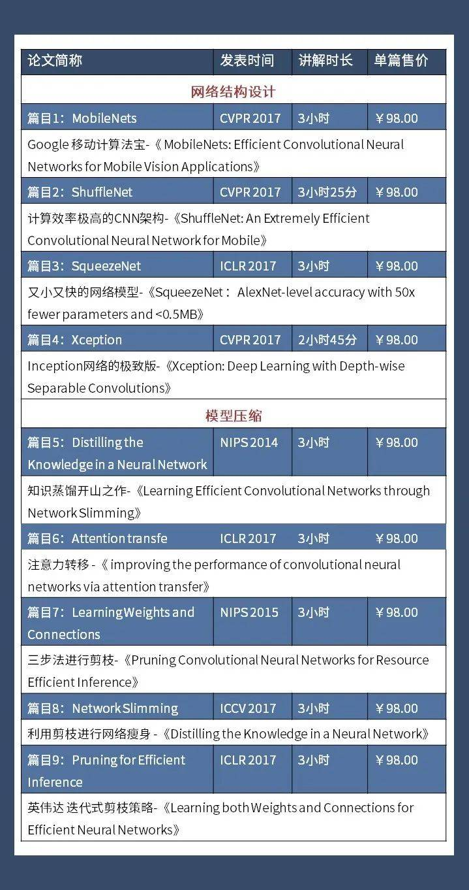
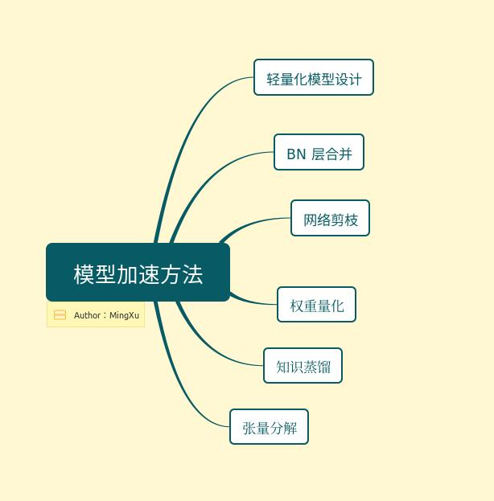
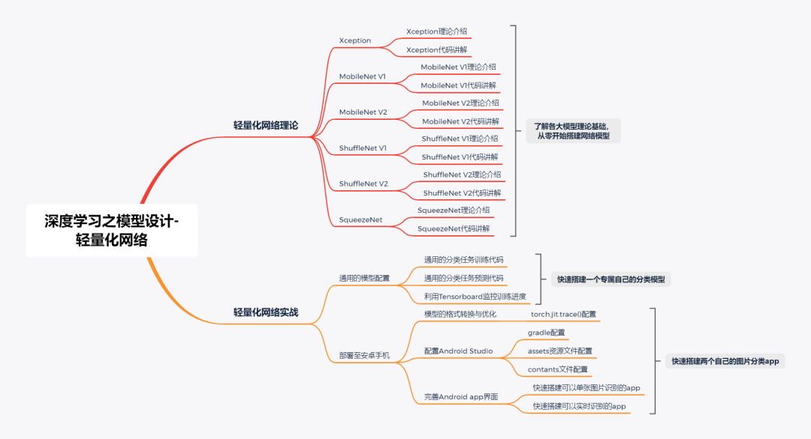
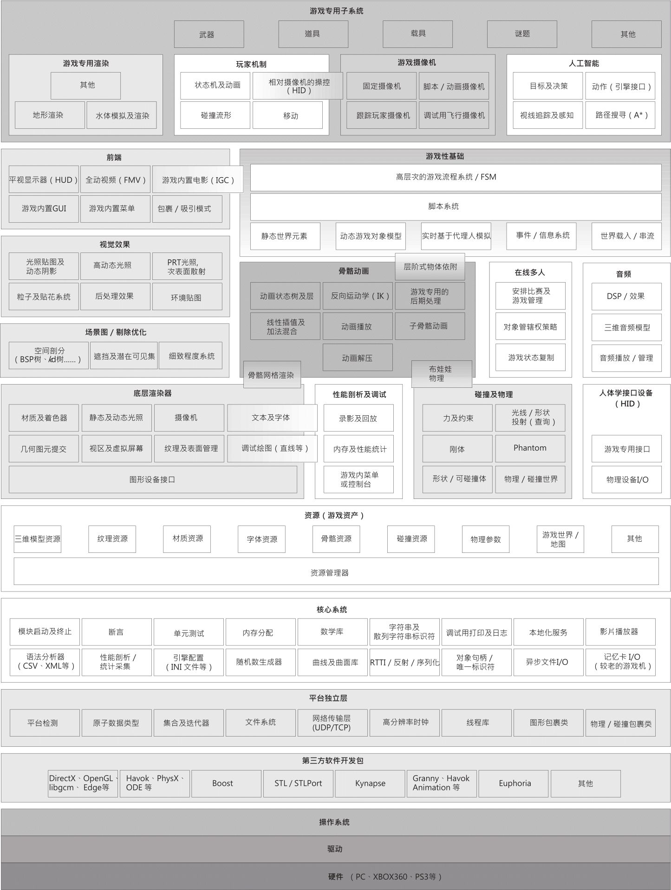

# TIME

- [x] 2021/03/09    第2周星期二_软件架构理论与实践 A3302 开课

- [x] 2021/03/11    第2周星期四_软件测试与质量控制 A3306 开课

- [x] 2021/03/16    第3周星期二_软件级软件开发技术 A3206 开课

- [x] 2021/03/19    第3周星期五_Pattern Classfication A3303 开课

- [x] 2021/03/25    全国大学英语六级报名

- [ ] 2021/03/28    Vicarious发表Science论文：概率生成模型超越神经网络 RCN/Flow-based/Graph

- [ ] 2021/03/28    阅读GraphAF

- [ ] 2021/04/05    确定点云上采样模型

- [ ] 2021/04/08    沟通心理学网课开始开课

- [ ] 2021/04/10    绘制模型架构图

- [ ] 2021/04/20    第8周星期二_企业级软件开发技术 结课

- [ ] 2021/04/25    深度学习工程师 阅读完结

- [ ] 2021/04/27    第9周星期二_软件架构理论与实践 结课

- [ ] 2021/04/29    第9周星期四_软件测试与质量控制 结课

- [ ] 2021/04/30    可以跑通程序，获得基本结果，即结果可看，不要求sota

- [ ] 2021/05/03    第10周星期一_工程伦理 A1205 开课

- [ ] 2021/05/04    第10周星期二_智能信息融合 A1406 开课

- [ ] 2021/05/05    有论文的中文稿（摘要，介绍，相关工作，方法，实验，总结）

- [ ] 2021/05/07    CUDA C 编程权威指南 阅读完结

  之后开始考虑PCL，OpenCV，Eigen，TensorRT，深度学习基础知识（线性代数、概率论、随机过程、微积分、优化算法、多视角几何等)

- [ ] 2021/05/14    完成TensorFlow2的学习，并将代码转化为TensorFlow2语法

- [ ] 2021/05/28    第13周星期五_Pattern Classfication 结课

- [ ] 2021/06/08    第15周星期二_智能信息融合 结课

- [ ] 2021/06/12    全国大学英语六级笔试

- [ ] 2021/06/14    第16周星期一_沟通心理学 A1201 开课

- [ ] 2021/06/21    第17周星期一_工程伦理 结课

- [ ] 2021/06/21    第17周星期一_沟通心理学 结课

- [ ] 2021/06/28    第18周星期一 教学周结束/考试周开始

- [ ] 2021/07/11    第19周星期日 2020-2021第二学期结束

- [ ] 2021/08/30    第1周星期一  2021-2022第一学期开始
- [ ] 2021/09/09    AAAI  2021 投稿截至日期
- [ ] 2021/10/31    ICRA  2022 投稿截止日期
- [ ] 2021/11/16    CVPR 2022 投稿截至日期
- [ ] 2021/11/17 - 2021/11/30  深度学习模型设计
- [ ] 2021/12/01 - 2021/12/31 30天自制操作系统
- [ ] 2022/03/01    IROS  2022 投稿截至日期

## **职业技能**

**T3**

- 熟悉常用LIDAR点云算法，如点云**拼接**/**配准**，物体**识别**/**分割**等；
- 对深度学习领域具备算法研究与开发经验，有实际场景落地经历，特别是IOT/移动端**落地**实践经历者优先；具有在Nvidia、Xilinx或TDAx平台上模型**部署**经验
- 了解深度学习框架的**底层实现机制**(计算图/算子/硬件平台)，有相关开发经验者优先
- 熟悉**compiler**工具/推理引擎，如TVM, MNN, TFLite等优先考虑；
- 熟练掌握与运用目前较为主流的**目标检测、语义分割、实体分割**等算法
- 熟悉深度学习模型**训练**、**部署**、网络量化、网络加速及模型性能**优化**（剪枝、压缩、轻量化应用）流程及相关算法；
- 具备强壮的深度学习**基础知识**储备（线性代数、概率论、随机过程、微积分、优化算法、多视角几何等)/了解三维几何及坐标转换相关的机器人领域知识及一般算法的原理；

**T2**

- 使用C++ 11开发过大型项目，代码符合谷歌/阿里**规范**；熟悉STL，boost等常用的c++**库**
- 有并行计算/CUDA编程的实践经验；熟练掌握C++**多线程编程**及调试技巧；泛型编程；openCL；pThread和OpenMP
- 深入理解Linux**操作系统**，了解系统内核和文件系统
- 具备Linux**系统软件开发**经验，了解系统软件开发的相关概念(内存/线程/IPC等)与方法
- 熟悉常用的**设计模式**
- 能够熟练使用Shell/Python进行**脚本开发**；

**T1**

- 参加过**Kaggle**比赛获得过前10%；
- 有**模型压缩与平台移植**相关经验者优先
- 数据库**相关经验、**Qt**开发经验、**Web可视化**开发经验

**T0**

openGL，渲染器，Games101/102/201/202

## **会议与期刊**

图形学会议

~~ACM MM~~/ ~~SIGGRAPH~~

人工智能会议

**AAAI2021**/~~NIPS2021~~/~~ACL2021~~/**CVPR2022**/~~ICCV2021~~/~~ICML2021~~/~~IJCAI2021~~/~~ECCV2020~~/**ICRA2022**/**IROS 2022**

图形学期刊

TOG/ TIP/ TVCG

人工智能期刊

AI/TPAMI/IJCV/JMLR

---

# Daily

当前 BPU （Brain Processing Unit）最大进程数为：5，按优先级排序

- LeetCode
- CUDA C编程权威指南
- 深度学习工程师
- 深度学习原理与实践
- 深度学习全栈

Brain Queue

## To be a Scientist

pointcloud

https://github.com/NUAAXQ/awesome-point-cloud-analysis-2021

https://github.com/zhulf0804/3D-PointCloud

Super Resolution

https://github.com/ChaofWang/Awesome-Super-Resolution

flow-based

https://github.com/janosh/awesome-normalizing-flows

https://github.com/matthewvowels1/Awesome-VAEs

https://github.com/zhoubolei/awesome-generative-modeling

------

## 深度学习工程师

吴恩达 Andrew Ng

deeplearning.ai

https://www.coursera.org/learn/neural-networks-deep-learning?action=enroll

https://study.163.com/my#/smarts

https://www.bilibili.com/video/av66524657

**note**

https://blog.csdn.net/red_stone1/article/details/78348753

https://www.zhihu.com/column/DeepLearningNotebook

http://www.ai-start.com/dl2017/

**课后作业**

https://github.com/bugstop/coursera-deep-learning-solutions

https://blog.csdn.net/u013733326/article/details/79827273

https://www.heywhale.com/mw/project/5e20243e2823a10036b542da

**神经网络和深度学习**

- [x] 2021/3/22    第一周 深度学习概论 1.1-1.6
- [x] 2021/3/23    第二周 神经网络基础 2.1-2.6 + 2.18
- [x] 2021/3/24    第二周 神经网络基础 2.7-2.10
- [x] 2021/3/25    第二周 神经网络基础 2.11-2.17
- [x] 2021/3/26    第三周 浅层神经网络 3.1-3.5
- [x] 2021/3/27    第三周 浅层神经网络 3.6-3.11
- [x] 2021/3/28    第四周 深层神经网络 4.1-4.8
- [x] 2021/3/29    人工智能行业大师访谈 1-3

**改善深层神经网络：超参数调试、正则化以及优化**

- [x] 2021/3/30    第一周 深度学习的实用层面 1.1-1.5
- [x] 2021/3/31    第一周 深度学习的实用层面 1.6-1.10
- [x] 2021/4/01    第一周 深度学习的实用层面 1.11-1.14
- [x] 2021/4/02    第二周 优化算法 2.1-2.5
- [x] 2021/4/03    第二周 优化算法 2.6-2.10
- [x] 2021/4/04    第三周 超参数调试、BN和程序框架 3.1-3.5
- [x] 2021/4/05    第三周 超参数调试、BN和程序框架 3.6-3.11
- [x] 2021/4/06    人工智能行业大师访谈 1-2

**结构化机器学习项目**

- [x] 2021/4/07    第一周 ML 策略（1）1.1-1.5
- [x] 2021/4/08    第一周 ML 策略（1）1.6-1.12
- [x] 2021/4/09    第二周 ML 策略（2）2.1-2.5
- [x] 2021/4/10    第二周 ML 策略（2）2.6-2.10
- [x] 2021/4/11    人工智能行业大师访谈 1-2

**卷积神经网络**

- [x] 2021/4/12    第一周 卷积神经网络 1.1-1.5
- [x] 2021/4/13    第一周 卷积神经网络 1.6-1.11
- [ ] 2021/4/14    第二周 深度卷积网络：实例探究 2.1-2.7
- [ ] 2021/4/15    第二周 深度卷积网络：实例探究 2.8-2.14
- [ ] 2021/4/16    第三周 目标检测 3.1-3.5
- [ ] 2021/4/17    第三周 目标检测 3.6-3.10
- [ ] 2021/4/18    第四周 特殊应用：人脸识别和神经风格转换 4.1-4.5
- [ ] 2021/4/19    第四周 特殊应用：人脸识别和神经风格转换 4.6-4.11

**序列模型**

- [ ] 2021/4/20    第一周 循环序列模型 1.1-1.5
- [ ] 2021/4/21    第一周 循环序列模型 1.6-1.12
- [ ] 2021/4/22    第二周 自然语言处理与词嵌入 2.1-2.5
- [ ] 2021/4/23    第二周 自然语言处理与词嵌入 2.6-2.10
- [ ] 2021/4/24    第三周 序列模型和注意力机制 3.1-3.5
- [ ] 2021/4/25    第三周 序列模型和注意力机制 3.6-3.11

----

## LeetCode 每日一题/专题

https://leetcode-cn.com/u/duanyaqi/

**「代码随想录」二叉树专题精讲（v1.1）**

- [x] 2021/03/23    树左下角的值、路经总和 
- [x] 2021/03/24    构造二叉树登场、构造一个最大的二叉树、小结
- [x] 2021/03/25    合并两个二叉树、二叉搜索树中的搜索
- [x] 2021/03/26    验证二叉搜索树、二叉搜索树的最小绝对差
- [x] 2021/03/27    二叉搜索树中的众数、二叉树的最近公共祖先、小结
- [x] 2021/03/28    二叉搜索树的最近公共祖先、二叉搜索树中的插入操作
- [x] 2021/03/29    删除二叉搜索树中的节点、修剪二叉搜索树
- [x] 2021/03/30    构造一颗二叉搜索树、把二叉搜索树转换为累加树
- [x] 2021/03/31    二叉树总结篇

https://mp.weixin.qq.com/mp/appmsgalbum?__biz=MzUxNjY5NTYxNA==&action=getalbum&album_id=1573382655889489922&scene=173&from_msgid=2247484132&from_itemidx=1&count=3#wechat_redirect

**链表**

- [x] 2021/03/31    关于链表，你该了解这些、听说用虚拟头节点会方便很多
- [x] 2021/04/01   一道题目考察了常见的五个操作、听说过两天反转链表又写不出来了？
- [x] 2021/04/02    环找到了，那入口呢、链表总结篇

https://mp.weixin.qq.com/s/weyitJcVHBgFtSc19cbPdw

**双指针法**

- [x] 2021/04/04   数组：就移除个元素很难么、字符串：这道题目，使用库函数一行代码搞定
- [x] 2021/04/05    字符串：花式反转还不够、链表：听说过两天反转链表又写不出来了
- [x] 2021/04/06    链表：环找到了，那入口呢、哈希表：解决了两数之和，那么能解决三数之和么

- [x] 2021/04/07    双指针法：一样的道理，能解决四数之和、双指针法：总结篇！

https://mp.weixin.qq.com/mp/appmsgalbum?__biz=MzUxNjY5NTYxNA==&action=getalbum&album_id=1577943906476998657&scene=173&from_msgid=2247484494&from_itemidx=1&count=3&nolastread=1#wechat_redirect

**栈与队列**

- [x] 2021/04/08    来看看栈和队列不为人知的一面、我用栈来实现队列怎么样
- [x] 2021/04/09    用队列实现栈还有点别扭、系统中处处都是栈的应用
- [x] 2021/04/10    匹配问题都是栈的强项、有没有想过计算机是如何处理表达式的
- [x] 2021/04/11    滑动窗口里求最大值引出一个重要数据结构、求前 K 个高频元素和队列有啥关系
- [x] 2021/04/12    总结篇

https://mp.weixin.qq.com/s/weyitJcVHBgFtSc19cbPdw

**哈希表**

- [x] 2021/04/13    关于哈希表，你该了解这些、可以拿数组当哈希表来用，但哈希值不要太大
- [x] 2021/04/14    哈希值太大了，还是得用set、用set来判断快乐数

- [ ] 2021/04/15    map等候多时了、其实需要哈希的地方都能找到map的身影
- [ ] 2021/04/16    这道题目我做过、解决了两数之和，那么能解决三数之和么
- [ ] 2021/04/17    一样的道理，能解决四数之和、总结篇！（每逢总结必经典）

**字符串**

- [ ] 2021/04/18    这道题目，使用库函数一行代码搞定、简单的反转还不够
- [ ] 2021/04/19    替换空格、花式反转还不够、反转个字符串还有这个用处
- [ ] 2021/04/20    视频来了带你学透KMP算法（理论篇&代码篇）
- [ ] 2021/04/21    都来看看KMP的看家本领、KMP算法还能干这个、总结篇

**回溯算法**

- [ ] 2021/04/22    
- [ ] 2021/04/23    

- [ ] 2021/04/24    
- [ ] 2021/04/25    
- [ ] 2021/04/26    
- [ ] 2021/04/27   
- [ ] 2021/04/28  

- [ ] 2021/04/29
- [ ] 2021/04/30

------

## 每日一Blog

每天阅读并总结一篇技术博客，并做日记

- [ ] 2021/04/05    http://www.tensorinfinity.com/paper_32.html
- [ ] 2021/04/06    http://www.tensorinfinity.com/paper_44.html
- [ ] 2021/04/07    http://www.tensorinfinity.com/paper_58.html
- [ ] 2021/04/08    http://www.tensorinfinity.com/paper_56.html
- [ ] 2021/04/09    http://www.tensorinfinity.com/paper_92.html
- [ ] 2021/04/10    http://www.tensorinfinity.com/paper_96.html

----

## 概率图模型

https://www.bilibili.com/video/BV1v7411u7Ss

http://antkillerfarm.github.io/ml/2018/01/07/Machine_Learning_30.html

**第 1 章：概率图模型简介**

- [ ] 2021/03/31    1.1. 概率图模型简介

**第 2 章：概率图模型的表示**

- [ ] 2021/04/01    2.1. 概率轮与图论基础知识
- [ ] 2021/04/02    2.2. 贝叶斯网络
- [ ] 2021/04/03    2.3. 马尔科夫随机场
- [ ] 2021/04/04    2.4. 因子图

**第 3 章：概率图模型的精确推理**

- [ ] 2021/04/05    3.1. 推理问题分类&变量消元法
- [ ] 2021/04/06    3.2. 团树传播算法
- [ ] 2021/04/07    3.3. 信念传播算法（BP算法）
- [ ] 2021/04/08    3.4. 二值图切法

**第 4 章：概率图模型的近似推理**

- [ ] 2021/04/09    4.1. BP算法的能量最小化解释
- [ ] 2021/04/10    4.2. 基于图切法的近似推理算法

**第 5 章：概率图模型的学习**

- [ ] 2021/04/11    5.1. 参数学习
- [ ] 2021/04/12    5.2. 结构学习

**第 6 章：概率图模型的应用**

- [ ] 2021/04/13    6.2. 概率图模型在计算机视觉中的应用
- [ ] 2021/04/14    6.3. 概率图模型在医学图像中的应用
- [ ] 2021/04/15    6.1. 概率图模型在自然语言处理中的应用

---

## 生成模型

VAE

http://antkillerfarm.github.io/gan%20&%20vae/2019/05/05/VAE_3.html

------

## CUDA C 编程权威指南 

每日一节，共46天 = 6 星期 4 天 

2021/03/22  -  2021/05/07

https://blog.csdn.net/god_weiyang/article/details/113156246

https://face2ai.com/categories/CUDA/

http://antkillerfarm.github.io/ai/2021/02/08/NVIDIA.html#cuda%E5%AE%9E%E6%88%98

**第1章　基于CUDA的异构并行计算**

- [x] 1.1　并行计算		2021/3/22

- [x] 1.2　异构计算        2021/3/23

  1.3　用GPU输出Hello　World

  1.4　使用CUDA　C编程难吗

  1.5　总结

  1.6　习题

**第2章　CUDA编程模型**

- [x] 2.1　CUDA编程模型概述		2021/3/24

- [x] 2.2　给核函数计时                  2021/3/25

- [x] 2.3　组织并行线程                  2021/3/26

- [ ] 2.4　设备管理                          2021/3/27

  2.5　总结

  2.6　习题

**第3章　CUDA执行模型**

- [ ] 3.1　CUDA执行模型概述		2021/3/28

- [ ] 3.2　理解线程束执行的本质   2021/3/29

- [ ] 3.3　并行性的表现                   2021/3/30

- [ ] 3.4　避免分支分化                   2021/3/31

- [ ] 3.5　展开循环                           2021/4/01

- [ ] 3.6　动态并行                           2021/4/02

  3.7　总结

  3.8　习题

**第4章　全局内存**

- [ ] 4.1　CUDA内存模型概述		2021/4/03

- [ ] 4.2　内存管理                          2021/4/04

- [ ] 4.3　内存访问模式                  2021/4/05

- [ ] 4.4　核函数可达到的带宽       2021/4/06

- [ ] 4.5　使用统一内存的矩阵加法2021/4/07

  4.6　总结

  4.7　习题

**第5章　共享内存和常量内存**

- [ ] 5.1　CUDA共享内存概述        2021/4/08

- [ ] 5.2　共享内存的数据布局       2021/4/09

- [ ] 5.3　减少全局内存访问           2021/4/10

- [ ] 5.4　合并的全局内存访问       2021/4/11

- [ ] 5.5　常量内存                          2021/4/12

- [ ] 5.6　线程束洗牌指令               2021/4/13

  5.7　总结

  5.8　习题

**第6章　流和并发**

- [ ] 6.1　流和事件概述                   2021/4/14

- [ ] 6.2　并发内核执行                   2021/4/15

- [ ] 6.3　重叠内核执行和数据传输  2021/4/16

- [ ] 6.4　重叠GPU和CPU执行        2021/4/17

- [ ] 6.5　流回调                               2021/4/18

  6.6　总结

  6.7　习题

**第7章　调整指令级原语**

- [ ] 7.1　CUDA指令概述                 2021/4/19

- [ ] 7.2　程序优化指令                    2021/4/20

  7.3　总结

  7.4　习题

**第8章　GPU加速库和OpenACC**

- [ ] 8.1　CUDA库概述                     2021/4/21

- [ ] 8.2　cuSPARSE库                      2021/4/22

- [ ] 8.3　cuBLAS库                          2021/4/23

- [ ] 8.4　cuFFT库                             2021/4/24

- [ ] 8.5　cuRAND库                         2021/4/25

- [ ] 8.6　CUDA　6.0中函数库的介绍 2021/4/26

- [ ] 8.7　CUDA函数库的性能研究   2021/4/27

- [ ] 8.8　OpenACC的使用               2021/4/28

  8.9　总结

  8.10　习题

**第9章　多GPU编程**

- [ ] 9.1　从一个GPU到多GPU         2021/4/29

- [ ] 9.2　多GPU间细分计算             2021/4/30

- [ ] 9.3　多GPU上的点对点通信      2021/5/01

- [ ] 9.4　多GPU上的有限差分         2021/5/02

- [ ] 9.5　跨GPU集群扩展应用程序  2021/5/03

  9.6　总结

  9.7　习题

**第10章　程序实现的注意事项**

- [ ] 10.1　CUDA　C的开发过程       2021/5/04

- [ ] 10.2　配置文件驱动优化            2021/5/05

- [ ] 10.3　CUDA调试                         2021/5/06

- [ ] 10.4　将C程序移植到CUDA　C的案例研究 2021/5/07

  10.5　总结
  10.6　习题

附录　推荐阅读                                  2021/5/08

------

## English

天翼链接
https://cloud.189.cn/t/J77ramVn63ua
访问码：bwi8

------

## Music

guitar

------

## 全栈深度学习训练营

https://fullstackdeeplearning.com/spring2021/

https://www.bilibili.com/video/BV1BT4y1P7u6

**Week 1: Fundamentals**

- [x] 2021/3/24  Lecture 1: DL Fundamentals
- [ ] Notebook: Coding a neural net from scratch
- [x] 2021/3/25  Lab 1: Setup and Introduction
- [ ] How the backpropagation algorithm works

**Week 2: CNNs**

- [ ] 2021/3/26  Lecture 2A: CNNs
- [ ] 2021/3/27  Lecture 2B: Computer Vision Applications
- [ ] 2021/3/28  Lab 2: CNNs
- [ ] A brief introduction to Neural Style Transfer
- [ ] Improving the way neural networks learn

**Week 3: RNNs**

- [ ] 2021/3/29  Lecture 3: RNNs
- [ ] 2021/3/30  Lab 3: RNNs
- [ ] The Unreasonable Effectiveness of Recurrent Neural Networks
- [ ] Attention Craving RNNS: Building Up To Transformer Networks

**Week 4: Transformers**

- [ ] 2021/3/31  Lecture 4: Transfer Learning and Transformers
- [ ] 2021/4/01  Lab 4: Transformers
- [ ] Transformers from Scratch

**Week 5: ML Projects**

- [ ] 2021/4/02  Lecture 5: Setting up ML Projects
- [ ] 2021/4/03  Lab 5: Experiment Management
- [ ] Rules of Machine Learning

**Week 6: Infra & Tooling**

- [ ] 2021/4/04  Lecture 6: Infrastructure & Tooling 
- [ ] 2021/4/05  Lab 6: Data Labeling
- [ ] Machine Learning: The High-Interest Credit Card of Technical Debt

**Week 7: Troubleshooting**

- [ ] 2021/4/06  Lecture 7: Troubleshooting DNNs
- [ ] Why is machine learning hard?

**Week 8: Troubleshooting**

- [ ] 2021/4/07  Lecture 8: Data Management
- [ ] Emerging architectures for modern data infrastructure

---

## 深度学习原理与实践

https://tianchi.aliyun.com/course/279/4134

- [ ] 2021/3/23  第1课：人工智能简介

- [ ] 2021/3/24  第2课：深度学习崛起背景

- [ ] 2021/3/25  第3课：深度学习典型应用与研究方向之语音处理

- [ ] 2021/3/26  第3课：深度学习典型应用与研究方向之计算机视觉

- [ ] 2021/3/27  第3课：深度学习典型应用与研究方向之自然语言处理

- [ ] 2021/3/28  第3课：深度学习典型应用与研究方向之推荐系统

- [ ] 2021/3/29  第4课：神经网络（上）

- [ ] 2021/3/30  第4课：神经网络（下）

- [ ] 2021/3/31  第5课：卷积神经网络（上）

- [ ] 2021/4/01  第5课：卷积神经网络（下）

- [ ] 2021/4/02  第6课：深度学习优化之激活函数与参数初始化

- [ ] 2021/4/03  第6课：深度学习优化之标准化与池化

- [ ] 2021/4/04  第6课：深度学习优化之泛化与正则化

- [ ] 2021/4/05  第6课：深度学习优化之最优化

- [ ] 2021/4/06  第6课：深度学习优化之优化目标与评估指标

- [ ] 2021/4/07  第6课：深度学习优化之数据增强

- [ ] 2021/4/08  第7课：深度学习框架之Pytorch快速入门与实践

- [ ] 2021/4/09  第7课：深度学习框架之Caffe快速入门与实践

- [ ] 2021/4/10  第7课：深度学习框架之Tensorflow快速入门与实践

- [ ] 2021/4/11  实践课1：从零完成人脸表情分类任务

- [ ] 2021/4/12  第8课：循环神经网络之RNN及其改进

- [ ] 2021/4/13  第9课：图神经网络基础

- [ ] 2021/4/14  第10课：模型设计之网络宽度和深度设计

- [ ] 2021/4/15  第10课：模型设计之残差网络

- [ ] 2021/4/16  第10课：模型设计之分组网络

- [ ] 2021/4/17  第10课：模型设计之卷积核设计

- [ ] 2021/4/18  第10讲：模型设计之注意力机制

------

## 深度学习模型设计-轻量化网络

https://www.sohu.com/a/402029810_787107

https://www.pianshen.com/article/58321244808/

1. 轻量化设计: 从模型设计时采用一些轻量化的思想，例如采用深度可分离卷积、分组卷积等轻量卷积方式、减少卷积过程的计算量，此外采用全局池化来取代全连接层、利用 1 x 1 卷积实现特征的通道降维，也可以降低模型的计算量，这两点在众多网络中得到应用。
   2 .BN 层合并: 在训练检测模型时，BN 层可以有效的加速收敛，并在一定程度上防止模型过拟合，但在前向测试时，BN 层的存在也增加了多余的计算量。由于测试时 BN 层的参数已经固定，因此可以在测试时将 BN层的计算合并到卷积层，从而减少计算量，实现模型加速。
2. 网络剪枝: 在卷积网络成千上万的权重中，存在着大量接近 0 的参数，这些属于冗余的参数，去掉后模型也可以基本达到相同的表达能力，因此众多众多研究者从此为出发点，搜索网络中的冗余卷积核、将网络稀疏化，称之为网络裁剪。具体讲，网络剪枝有训练中稀疏与训练后剪枝两种。
3. 权重量化:是指将网络模型中高精度的参数量化为低精度的参数，从而加速计算的方法。高精度的模型参数拥有更大的动态变化范围，能够表达更丰富的参数空间，因此训练中通常使用 32 位浮点数 (单精度) 作为网络参数模型。训练完后成为了减小模型大小，通常将 32 未浮点数量化为 16 位浮点数的半精度，甚至 int8的整型，0 与 1 的 二值类型。
4. 张量分解: 由原始网络参数中存在大量冗余，除了剪枝的方法外，我们还可以利用 SVD 分解和 PQ 分解，将原始张量分解为低秩的若干张量，以减少卷积的计算，提升前向速度。
5. 知识蒸馏:大的模型拥有更强的拟合能力和泛化能力，而小的模型拟合能力较弱，且容易造成过拟合，使用大模型指导小模型训练保留大模型的有效信息，实现知识蒸馏。

https://www.zhihu.com/column/c_1258728952266768384  

- [ ] 深度学习模型加速与压缩常用方法 2021/11/17
  - [ ] 深度学习模型加速与压缩常用方法（一）总体介绍
  - [ ] 深度学习模型加速与压缩常用方法（二）轻量化网络结构设计
  - [ ] 深度学习模型加速与压缩常用方法（三）剪枝

https://mp.weixin.qq.com/s/ZNN4umY7n9jsA0Zwa6WH1A

- [ ] 深度学习模型设计-轻量化网络  2021/11/28
  - [ ] 轻量化网络理论
  - [ ] 轻量化网络实战

---

## 自制操作系统

30天自制操作系统

https://www.zhihu.com/question/20402534

https://www.zhihu.com/column/c_1193254878150045696

https://book.douban.com/subject/11530329/

https://www.zhihu.com/question/26557127/answer/33206700

https://www.zhihu.com/question/20207347

https://legacy.gitbook.com/book/samypesse/how-to-create-an-operating-system/details

https://www.zhihu.com/search?q=%E8%87%AA%E5%88%B6%E6%93%8D%E4%BD%9C%E7%B3%BB%E7%BB%9F&type=content

- [ ] 2021/12/01
- [ ] 2021/12/02
- [ ] 2021/12/03
- [ ] 2021/12/04
- [ ] 2021/12/05
- [ ] 2021/12/06
- [ ] 2021/12/07
- [ ] 2021/12/08
- [ ] 2021/12/09
- [ ] 2021/12/10
- [ ] 2021/12/11
- [ ] 2021/12/12
- [ ] 2021/12/13
- [ ] 2021/12/14
- [ ] 2021/12/15
- [ ] 2021/12/16
- [ ] 2021/12/17
- [ ] 2021/12/18
- [ ] 2021/12/19
- [ ] 2021/12/20
- [ ] 2021/12/21
- [ ] 2021/12/22
- [ ] 2021/12/23
- [ ] 2021/12/24
- [ ] 2021/12/25
- [ ] 2021/12/26
- [ ] 2021/12/27
- [ ] 2021/12/28
- [ ] 2021/12/29
- [ ] 2021/12/30
- [ ] 2021/12/31

## 自制游戏引擎

