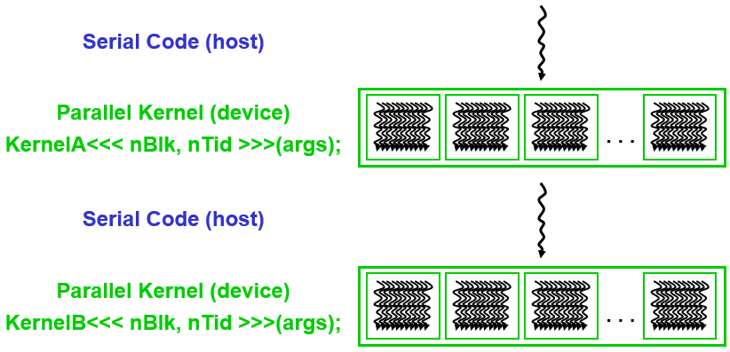
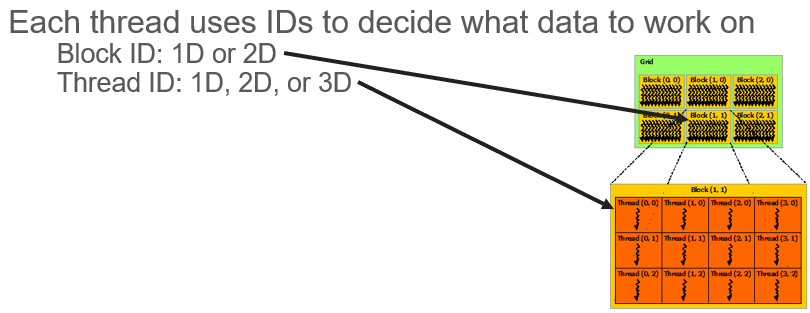
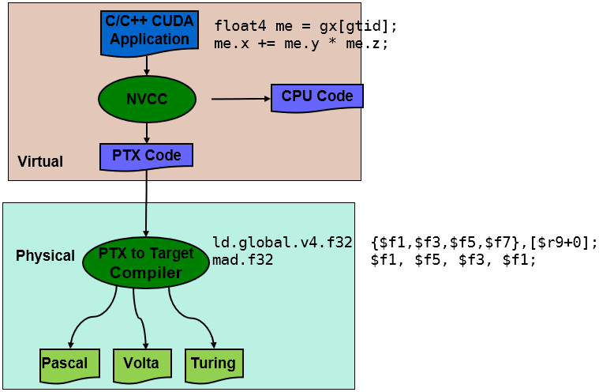

# CUDA

**用 CUDA 编程模型编写软件接近硬件上浮点控制性能的峰值**

CS/EE217 GPU Architecture and Programming

https://www.cs.ucr.edu/~nael/217-f19/sched.html

http://teaching.danielwong.org/csee217/fall20

https://www.danielwong.org/teaching/


## 序章

### Instroduction to CUDA Programming Model


#### **GPGPU**

General Purpose computation using GPU and graphics API in applications other than 3D graphics

用图形加速器来做通用计算


**应用**

- 数据并行算法

SIMT(Single Instruction Multiple Threads) 单指令多线程

- 矩阵计算，卷积运算，图型处理，科学计算


#### **CUDA**

Compute Unified Device Architecture 统一计算设备架构

General purpose programming model 通用编程模型

​	- User kicks off batches of threads on the GPU 用户在GPU上启动批量线程

​	- GPU = dedicated super-threaded, massively data parallel co-processor 专用超线程大规模数据并行协作处理器

Targeted software stack目标软件堆栈

​	- Compute oriented drivers, language, and tools 面向计算的驱动程序、语言和工具


**并行计算**

图灵架构提供 13+TFLOPS

并行性：在一个GPU上同时可以运行最大的线程数目

SIMT 应用数据并行（data parallelism）和线程并行（thread parallelism）


**CUDA-C**

host+device 应用（一般串行部分代码在CPU，并行部分代码在GPU）

集成 host+device 程序 

host: 串行或适度并行部分

device: 高度并行部分

 


**CUDA Devices and Threads** 设备和线程

- GPU 是一种计算的设备 
  - 是 CPU 或 host 的协处理器 
  - 拥有自己的DRAM(设备内存)‏ 
  - 并行运行许多线程 
  - 通常是GPU，但也可以是其它类型的并行处理设备 

- GPU 和 CPU 线程的区别 
  - GPU线程非常轻量级 
    - 极少的创建与销毁开销 
  - GPU需要1000个线程来充分发挥效率 
    - 多核 CPU 只需要几个(例如AMD epyc-7002系列有8-64核)


**Concept of Thread, Block, Grid**



```c++
// code snaps(no optimization)

// Kernel definition
__global__ void MatAdd(float A[N][N], float B[N][N],
                       float C[N][N])
{
    int i = threadIdx.x;
    int j = threadIdx.y;
    C[i][j] = A[i][j] + B[i][j];
}

int main()
{
    ...
    // Kernel invocation with one block of N * N * 1 threads
    int numBlocks = 1;
    dim3 threadsPerBlock(N, N);
    MatAdd<<<numBlocks, threadsPerBlock>>>(A, B, C);
    ...
}
```


#### **CUDA程序编译**



C/C++ CUDA Application 代码里边有 CPU 和 GPU 的代码。

用 GCC 来编译 CPU Code 翻译成 x86/arm 的汇编机器码

用 NVCC 来编译 GPU Code 翻译成中间层 PTX Code（Parallel Thread eXecution并行线程执行）

PTX 具体到目标架构，sm60系列Pascal 架构/ sm70系列Volta 架构/ sm75系列Turing 架构

‏然后融合在一起，最后变成二进制执行。


#### 补充

SIMT/SIMD/SISD

> 如果你指挥一个人一次搬一块砖，这就是SISD(Single Instruction Single Data，单指令单数据)。你是发任务的，也就是指令；搬砖的人是干活的，一个人就是一个线程(Thread)；一块砖就是一组数据。
>
> 如果有一个人力气大又聪明，会把八块砖放到一个箱子里面，然后一次把整个箱子八块砖搬到指定位置。现在你指挥这个人搬砖，指挥一次就能把八块砖搬到指定位置。这就是SIMD(Single Instruction Multi Data，单指令多数据)。
>
> 如果你指挥八个人搬砖，这八个人有点特殊，是监狱的犯人，用铁镣锁在一起的，你每次指挥都只能让他们把砖搬到同一个位置。每人搬一块，所以你指挥一次也能把八块砖搬到指定位置。这就是SIMT(Single Instruction Multi Thread)
>
> 
>
> 一组8块砖，只有2组。规定每组都只能由一个人搬，那么SIMD只要指挥2次就能搬完，而SIMT就必须指挥8次了，而且这8次有6个人一直在白跑。
>
> 一组10块砖，一共8组。规定每一组不能和其它组的砖一起搬，那么SIMT则是10次搬完，而SIMD一组砖要搬2次，共需要搬16次。


>在NVIDIA的GPU中，SIMT有2个关键优势：
>
>1、单地址，多地址
>
>SIMD的地址由于使用了寄存器，通常需要是连续的，而CUDA可以通过如下的查找表进行内存的随机访问，但需要注意CUDA全局内存的访问比较慢，并且可能出现bank conflict
>
>```c++
>__global__ void apply(int* a, int* b, int* lut) {
>    int i = blockIdx.x * blockDim.x + threadIdx.x;
>    a[i] = lut[b[i]]; //indirect memory access
>}
>```
>
>2、单指令，多流程
>
>SIMD不支持分支流程，SIMT可以使用多流程，如下为找出向量中非零元素的索引的CUDA程序，不同线程会在if (vec[i])处根据不同逻辑发散。但值得注意的是CUDA一次只能执行一个逻辑分支，其他逻辑分支会发散，对于大量分支发散的程序，程序会运行得很慢。
>
>```c++
>__global__ void find(int* vec, int len, int* ind, int* nfound, int nthreads) {
>    int tid = blockIdx.x * blockDim.x + threadIdx.x;
>    int last = 0;
>    int* myind = ind + tid * len;
>    for (int i = tid; i < len; i += nthreads) {
>        if (vec[i]) { //flow divergence
>            myind[last] = i;
>            last++;
>        }
>    }
>    nfound[tid] = last;
>}
>```
>
>


SIMD指令和SIMT指令有什么区别？

https://www.zhihu.com/question/273989958

从现代GPU编程角度看SIMD与SIMT

https://zhuanlan.zhihu.com/p/113360369


---

## 第1章 CUDA C编程及GPU基本知识

### 第0节 CUDA C编程及GPU基本知识


---

### 第1节 GPU基本架构及特点


### 第2节 CUDA C编程基本知识


### 第3节 并行计算向量相加


### 第4节 作业练习


---


## 第2章 CUDA C编程：矩阵乘法


---

## 第3章 CUDA C编程：并行前缀树


---

