# 深度学习工程师

由 deeplearning.ai 出品，网易引进的正版授权中文版深度学习工程师微专业课程，让你在了解丰富的人工智能应用案例的同时，学会在实践中搭建出最先进的神经网络模型，训练出属于你自己的 AI。


deeplearning.ai

https://www.coursera.org/learn/neural-networks-deep-learning?action=enroll

https://study.163.com/my#/smarts

https://www.bilibili.com/video/av66524657


**note**

https://blog.csdn.net/red_stone1/article/details/78403416

https://www.zhihu.com/column/DeepLearningNotebook

http://www.ai-start.com/dl2017/


**课后作业**

https://blog.csdn.net/u013733326/article/details/79827273

https://www.heywhale.com/mw/project/5e20243e2823a10036b542da


## Question

- [ ] 改善深层神经网络-[1.11 权重初始化](#winit)，有这个概念，但没在主流模型的代码中见过。
- [ ] 改善深层神经网络-[3.7 测试时的 Batch Norm](#BN-test)，指数加权平均过程很模糊 
- [ ] 改善深层神经网络-[3.9 训练一个 Softmax 分类器](#dadz)，激活函数对 z 求导，https://www.cnblogs.com/lizhiqing/p/10684795.html


---

## 改善深层神经网络：超参数调试、正则化以及优化

### 第一周 深度学习的实用层面

---

#### 1.1 训练 / 开发 / 测试集

层数、隐藏单元、学习率、激活函数

这些参数都是需要大迭代更新学习的。


一组数据 = 训练集+ 验证集\交叉验证集 + 测试集    普通量级 70 + 0 + 30     60 + 20 +20  数据量级越大 后两者占比越小 百万级别 98 + 1 + 1


**训练集** 加入训练

作用：估计模型，用于训练模型以及确定模型权重

学习样本数据集，通过匹配一些参数来建立一个分类器。建立一种分类的方式，主要是用来训练模型的。

**验证集** 加入训练

作用：确定网络结构或者控制模型复杂程度的参数，

对学习出来的模型，调整分类器的参数，如在神经网络中选择隐藏单元数。验证集还用来确定网络结构或者控制模型复杂程度的参数。

**测试集 ** 不加入训练

作用：检验最终选择最优的模型的性能如何，泛化能力

主要是测试训练好的模型的分辨能力（识别率等）


**不要**在训练集和测试集**分布不同**的情况下训练网络，要确保训练集和测试集使用**同一分布**

**测试集**的目的是让最终所选定的神经网络系统做出**无偏估计**。如果不需要做无偏估计，就不需要测试集。（但比较bug的一点是，这时的验证集又可以被看做是测试集）


---

#### 1.2 偏差 / 方差

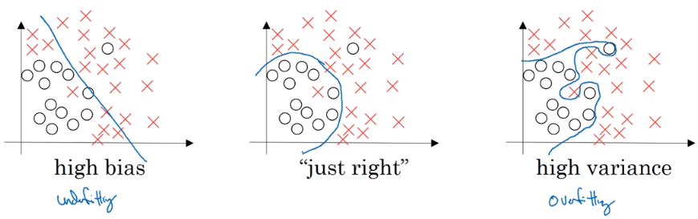

高偏差 欠拟合

高方差 过拟合


如果人的误差为 0%

| 训练集误差 |   1%   |  15%   |      15%      |     0.5%      |
| :--------: | :----: | :----: | :-----------: | :-----------: |
| 验证集误差 |  11%   |  16%   |      30%      |      1%       |
|            | 高方差 | 高偏差 | 高偏差+高方差 | 低偏差+低方差 |


太线性 高偏差

太非线性 高方差


方差度量随机变量和其数学期望（即均值）之间的偏离程度

方差越大，数据的波动越大，数据分布比较分散

方差越小，数据的波动越小，数据分布比较集中


---

#### 1.3 机器学习基础

检查偏差，评估训练集性能，如果偏差高（训练集误差大），甚至无法拟合训练集，需要更换一个新的网络（更多层，更多隐藏单元，加大训练时间）

 一旦偏差降到可接受范围，就需要检查方差，评估验证集性能，如果方差高（验证集误差大），正则化/更换网络架构/需要采用更多的数据来训练。

直到找到一个低偏差、低方差的网络。

bias variance trade off 权衡


---

#### 1.4 正则化

**正则化**：多任务学习、增加噪声，集成学习，早停止，稀疏表示，dropout，正切传播，参数绑定，权值共享，范数惩罚，数据增强


如果网络过拟合，即存在高方差的问题。**正则化**可以处理！ 

**L1范数**

向量参数 w 的 L1 范数如下: 
$$
\begin{equation}
\|w\|_{1} =\sum_{i=1}^{n_{y}}|w|
\end{equation}
$$
如果用L1正则化，w最终会是稀疏的。

**L2范数**

向量参数 w 的 L2 范数，用到了欧几里得法线
$$
\begin{equation}\|\omega\|_{2}^{2}=\sum_{j=1}^{n_{x}} \omega_{j}^{2}=\omega^{\top} \omega\end{equation}
$$
如果用L2正则化，w的值会比较小，避免过拟合

**实例**

普通的 logistics 回归任务 $\min _{w, b} J(w, b)$
$$
\begin{equation}J(\omega, b)=\frac{1}{m} \sum_{i=1}^{m} \mathcal{L}\left(\hat{y}^{(i)}, y^{(i)}\right)+\frac{\lambda}{2 m}\|\omega\|_{2}^{2}\end{equation}
$$
其中 w 和 b 是logistics 的两个参数，$w\in \mathbb{R^{nx}}$， $b\in\mathbb{R}$ 

不加 b 的L2范数是因为，w 通常为高维，可以独立表达高偏差问题，b 对模型影响不大，加上也可以。其中 $\lambda$ 是一个需要调整的超参数
$$
J\left(\omega^{[1)}, b^{[1]}, \ldots, \omega^{[L]}, b^{[L]}\right)=\sum_{i=1}^{m} L\left(\hat{y}^{(i)} ,y^{(i)}\right)+\frac{\lambda}{2 m} \sum_{l=1}^{L}\left\|\omega^{[l] }\right\|^{2}_{F}
$$
其中
$$
\| \omega^{[l]}||^{2}=\sum_{i=1}^{n^{[l-1]}} \sum_{j=1}^{n^{[l]}}\left(\omega_{i j}^{[l]}\right)^{2}_{F}
$$
矩阵范式，被定义为矩阵中所有元素的平方求和，其中 w 的 size 为 $(n^{[l]},n^{[l-1]})$ 

被称为 frobenius 范数/F范数    弗罗贝尼乌斯


参数更新公式为
$$
\begin{split}
w^{[l]}&=w^{[l]}-\alpha(backward)
\end{split}
$$


如果加上这个正则项，就相当于对梯度 $dW^{[l]}$ 加上了 $\frac{\lambda}{m}w^{[l]}$
$$
\begin{split}
w^{[l]}&=w^{[l]}-\alpha\left[backward+\frac{\lambda}{m} w^{[l]}\right]\\
&=w^{[l]}-\frac{\alpha\lambda}{m}w^{[l]}-\alpha(backward)
\end{split}
$$
w 的系数是 $(1-\frac{\alpha\lambda}{m})$   **权重衰减**，不论w是什么值，都打算让他变得更小


---

#### 1.5 为什么正则化可以减少过拟合？

$$
J\left(\omega^{[1)}, b^{[1]}, \ldots, \omega^{[L]}, b^{[L]}\right)=\sum_{i=1}^{m} L\left(\hat{y}^{(i)} ,y^{(i)}\right)+\frac{\lambda}{2 m} \sum_{l=1}^{L}\left\|\omega^{[l] }\right\|^{2}_{F}
$$

如果将 $\lambda$ 设置足够大，则 w 足够小，许多隐藏单元减少产生的影响，即减少非线性。（考虑极端，如果其他隐藏单元都不产生影响，只有一个有影响，那就是变成线性回归了）

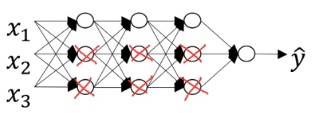


---

#### 1.6 Dropout 正则化

随机失活，设定节点保留和消除的概率

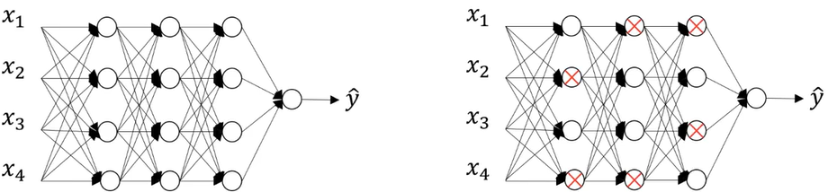


**inverted dropout 反向随机失活**

根据阈值，生成一个 bool 类型矩阵，与参数 w 矩阵相乘，得到随机失活后的参数矩阵 w。 

```python
d = np.random.rand(a.shape[0], a.shape[1]) < keep_prob
a = np.multiply(a, d)
a = a / keep_prob
```

下一层的计算如下
$$
z = w * a + b
$$
假设`keep_prob = 0.8` ，那么有 20% 的数变成了 0，`a` 的期望变成了原来的 80%， `z` 的期望也变成了原来的80%。

为了不影响 `z` 的期望值，需要给 `a` 除以 0.8 ，修正弥补。


**训练测试**

不同的训练样本，失活的隐藏单元也不同。每次训练数据的梯度不同，则随机对不同隐藏单元归零。每个 epoch 将不同的隐藏单元归零。  

**测试阶段不使用 dropout 函数。也不用除以 `keep_prob`**


---

#### 1.7 理解 Dropout

使用正则化就像是采用一个较小的神经网络。

不愿意吧权重全部放在其中一个特征（输入），因为有可能失活被删除。

实施dropout会减小权重，类似L2正则，预防过拟合。但L2对不同参数的衰减程度不同，

可以针对不同层设置不同的 `keep_prob`


除非算法过拟合（数据不够），否则一般不用dropout

dropout 缺点是损失函数不确定了 。

先关闭 drop 确定损失函数单调递减之后再打开 dropout


---

#### 1.8 其他正则化方法

**数据增强**

扩增数据，即加大数据量


水平**翻转**图片，训练集可以大一倍。还处于同一分布。

或**裁剪**图片，但要确保猫还在图片中。


特殊的数据还可以随意轻微的**旋转**或**扭曲**。


**early stopping**

绘制训练误差和验证误差。验证集误差通常是先变小后变大。在最小值就可以提前停止训练了。

训练神经网络之前，w 很小，在迭代过程中 w 会越来越大。


但是提前停止训练，不能独立的处理代价函数 J 和验证集误差。了解即可，不建议用。

**解决办法就是给J加上正则化项，并不使用early stopping**，这会使超参数搜索空间更容易分解，更容易搜索。缺点就是需要调整正则化参数 $\lambda$


---

#### 1.9 归一化输入

normalizing 

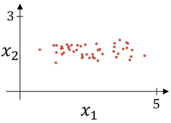

**第一步 零均值化**

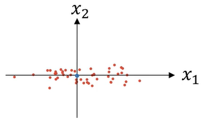
$$
\begin{equation}
  \mu=\frac{1}{m} \sum_{i=1}^{m} x^{(i)} \\
 x = x -\mu
\end{equation}
$$
相当于移动数据集。


**第二步 归一化方差**

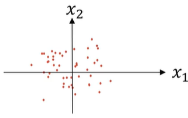
$$
\begin{equation}
 \sigma^{2}=\frac{1}{m} \sum_{i=1}^{M} x^{(i)} * * 2 \\
 x = x / \sigma
\end{equation}
$$
`**2` 表示每个元素都平方 element-wise

$\sigma^2$ 是一个向量，它的每个特征都有方差，因为均值已经为 0，所以 x 的平方直接就是方差。


**注意**

也应该用**从训练集计算得到的参数**处理**测试集**。


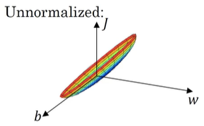

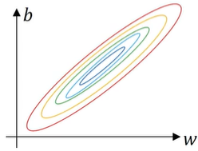

比较狭长。梯度下降可能拐来拐去，才能到最优值。

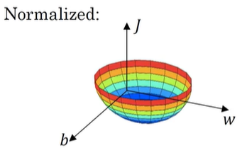

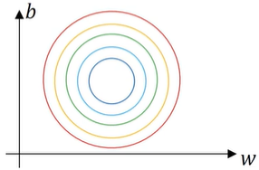

比较均匀。梯度下降法直接指向最小值，能用较大步长。


---

#### 1.10 梯度消失与梯度爆炸

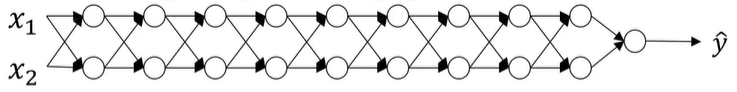

参数比1大，随层数 L 指数增长。参数比1小，随层数 L 指数递减


---

####  1.11 神经网络的权重初始化<span id="winit"></span>

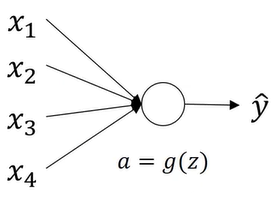

其中有n个特征
$$
\begin{equation}
 z=\omega_{1} x_{1}+\omega_{2} x_{2}+\cdots \cdot + \omega_{n} x_{n} 
\end{equation}
$$
因为 z 是求和，所以 n 越大，z 越大

合理的方法是设置
$$
W=\frac{1}{n}W
$$
即令其**方差**为 $\frac{1}{n}$，即上一层的特征数量的平方根

```python
w[l] = np.random.randn(n[l],n[l-1]) * np.sqrt(1/n[l-1]) 
```

如果是 `ReLu` 函数，令其**方差**为 $\frac{2}{n}$，

```python
w[l] = np.random.randn(n[l],n[l-1])  * np.sqrt(2/n[l-1]) 
```

如果是 `Tanh` 函数，令其**方差**为 $\frac{1}{n}$。Xavier 初始化

 

> x ~ N(μ, σ²)                  kx ~ N(kμ, k²σ²)
>
> 整个大型前馈神经网络无非就是一个超级大映射，将原始样本**稳定的**映射成它的类别。也就是将样本空间映射到类别空间。
>
> 
>
> 如果样本空间与类别空间的**分布差异**很**大**，比如说**类别空间特别稠密**，**样本空间特别稀疏辽阔**，那么在类别空间得到的用于反向传播的误差丢给样本空间后简直变得微不足道，也就是会导致模型的训练非常缓慢。同样，如果**类别空间特别稀疏**，**样本空间特别稠密**，那么在类别空间算出来的误差丢给样本空间后简直是爆炸般的存在，即导致模型发散震荡，无法收敛。
>
> 因此，我们要让样本空间与类别空间的分布差异（密度差别）不要太大，**也就是要让它们的方差尽可能相等**。


---

#### 1.12 梯度的数值逼近

在反向传播时，有一步梯度检验。对计算数值做逼近

双边误差，更逼近导数，误差量级更小，结果更准确。
$$
\begin{equation}
 f^{\prime}(\theta)=\lim _{\varepsilon \rightarrow 0} \frac{f(\theta+\varepsilon)-f(\theta-\varepsilon)}{2 \varepsilon} 
\end{equation}
$$
逼近误差为 $O(\epsilon^2)$


---

#### 1.13 梯度检验

计算梯度的数值逼近 $d\theta_{approx}$ 和数值解 $d\theta$，比较二者差距。使用欧几里得范数
$$
\begin{equation}
\frac{\left\|d\theta_{approx}-d \theta\right\|_{2}}{\left\|d\theta_{approx}\right\|_{2} +
\left\|d \theta\right\|_{2} }
\end{equation}
$$
误差平方和然后在求平方根，得到欧氏距离。分母预方向量太大或太小。分母为两个参数向量的模之和。

三角形两边之和大于第三边，确保上式落在 $[0, 1]$ 之间。

如果值小于 $1e-7$ 或更小即通过验证。

如果大于 $1e-5$ ，就需要检查有没有其中一项的误差，即两者差值特别大。


---

#### 1.14 关于梯度检验实现的注记

1. 不要在训练中使用梯度检验，只用于debug
2. 如果梯度检验失败。检查每一项逼近解 $d\theta_{approx}$ 和数值解 $d\theta$ 的插值，寻找哪一项误差最大。如果发现某层的 $d\theta^{[l]}$ 特别大，但是 $dw^{[l]}$ 的各项非常接近，那么一定是在计算参数 $b$ 的导数 $db^{[l]}$ 存在bug。同理，如果发现某层的 $d\theta^{[l]}$ 特别大，但是 $db^{[l]}$ 的各项非常接近，那么一定是在计算参数 $w$ 的导数 $dw^{[l]}$ 存在bug。
3. 注意正则化项，要包含进去
4. 不能与dropout共同使用
5. 如果碰到当 $w$ 和 $b$ 接近0时，检验正确；但是训练过程， $w$ 和 $b$ 逐渐变大，检验不通过。可以在一开始做一下梯度检验，训练一段时间后再进行一次梯度检验确保正确。


----

### 第二周 优化算法

#### 2.1 Mini-batch 梯度下降法

特征 X 的 size 为 $[x_n, m]$，标签 Y 的 size 为 $[1,m]$.

如果样本数 m 巨大如 5000000个，训练速度很慢。因为每次迭代都要对所有样本进行进行求和运算和矩阵运算。如果先让梯度下降法处理一部分，算法速度会很快。

可以把训练集**分割**为小一点的子训练集 如1000个一组。子集被称为 **mini-batch**。如下共有 5000 个 mini-batch。

![[公式]](assets/equation.svg)


![[公式]](assets/equation-1617340169208.svg)


一个 mini-batch 的特征 X 的 size 为 $[x_n, 1000]$，标签 Y 的 size 为 $[1, 1000]$.

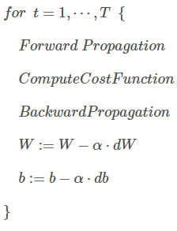

把所有训练集完整的遍历完为 1 个 epoch。采用 mini-batch 方法 1 个 epoch 梯度下降 5000 次，否则 1 个 epoch 只下降一次。


---

#### 2.2 理解 mini-batch 梯度下降法


mini-batch 梯度不是每次都在下降的。但如果数据足够均匀，右图噪声就越小。

如果mini-batch size =  m （样本数 ），称为batch 梯度下降，只有一个子集就是其本身

如果mini-batch size =  1  ，称为随机梯度下降，每个样本都是一个 mini-batch

随机梯度永远不会收敛，在最小值附近波动


蓝色的线代表 Batch gradient descent，紫色的线代表 Stachastic gradient descent。Batch gradient descent会比较**平稳**地接近全局最小值，但是因为使用了所有m个样本，每次前进的**速度**有些慢。Stachastic gradient descent每次前进**速度**很快，但是路线曲折，有较大的**振荡**，最终会在最小值附近来回波动，难以真正达到最小值处。而且在数值处理上就**不能**使用**向量化**的方法来提高运算速度。

因此要设置一个合适的 mini-batch size


一般来说，如果总体样本数量 $m$ 不太大时，例如 $m≤2000$，建议直接使用Batch gradient descent。

如果总体样本数量 $m$ 很大时，建议将样本分成许多mini-batches。推荐常用的mini-batch size为 64,128,256,512。这些都是2的幂。之所以这样设置的原因是计算机存储数据一般是2的幂，这样设置可以提高运算速度。

---

#### 2.3 指数加权平均

$$
\begin{equation}
 V_{t}=\beta V_{t-1}+(1-\beta) \theta_{t} 
\end{equation}
$$

- **large β:** 适应的慢，相对平滑
- **small β:** 噪声更大，不平滑

如果参数设置为 0.9，即第 $t$ 天与第 $t-1$ 天的气温迭代关系为：
$$
\begin{equation}
 \begin{aligned} V_{t} &=0.9 V_{t-1}+0.1 \theta_{t} \\ &=0.9^{t} V_{0}+0.9^{t-1} \cdot 0.1 \theta_{1}+0.9^{t-2} \cdot 0.1 \theta_{2}+\cdots+0.9 \cdot 0.1 \theta_{t-1}+0.1 \theta_{t} \end{aligned} 
\end{equation}
$$
$β$ 值决定了指数加权平均的天数，近似表示为：
$$
\frac{1}{1-\beta}
$$


指数加权移动平均值

指数加权平均数 


---

#### 2.4 理解指数加权平均

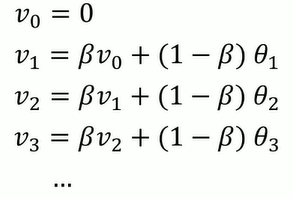
$$
\begin{equation}
 \begin{aligned} V_{t}=& \beta V_{t-1}+(1-\beta) \theta_{t} \\=&(1-\beta) \theta_{t}+(1-\beta) \cdot \beta \cdot \theta_{t-1}+(1-\beta) \cdot \beta^{2} \cdot \theta_{t-2}+\cdots \\ &+(1-\beta) \cdot \beta^{t-1} \cdot \theta_{1}+\beta^{t} \cdot V_{0} \end{aligned} 
\end{equation}
$$


观察上面这个式子，$ \theta_{t}, \theta_{t-1}, \theta_{t-2}, \cdots, \theta_{1} $ 是原始数据值，$ (1-\beta),(1-\beta) \beta,(1-\beta) \beta^{2}, \cdots,(1-\beta) \beta^{t-1} $ 是类似指数曲线，从右向左，呈指数下降的。$V_t$ 的值就是这两个子式的点乘，将原始数据值与衰减指数点乘，相当于做了指数衰减，离得越近，影响越大，离得越远，影响越小，衰减越厉害。


实践中，经常vθ初始化为0

```python
vθ = 0
repeat:
    get next θt
    vθ = β * vθ + (1-β) * θt
```


---

#### 2.5 指数加权平均的偏差修正

上文中提到当 $β=0.98$ 时，指数加权平均结果如下图绿色曲线所示。但是实际上，真实曲线如紫色曲线所示。


我们注意到，紫色曲线与绿色曲线的区别是，紫色曲线开始的时候相对较低一些。这是因为开始时我们设置 $V_0=0$，所以初始值会相对小一些，直到后面受前面的影响渐渐变小，趋于正常。

修正这种问题的方法是进行偏移校正（bias correction），即在每次计算完 $V_t$ 后，对 $V_t$ 进行下式处理：

$$
\begin{equation}
 \frac{V_{t}}{1-\beta^{t}} 
\end{equation}
$$
在刚开始的时候，$t$ 比较小，$(1−β^t)<1$，这样就将 $V_t$ 修正得更大一些，效果是把紫色曲线开始部分向上提升一些，与绿色曲线接近重合。随着 $t$ 增大，$(1−β^t)≈1$ ，$V_t$ 基本不变，紫色曲线与绿色曲线依然重合。这样就实现了简单的偏移校正，得到我们希望的绿色曲线。

机器学习中，偏移校正并不是必须的。因为，在迭代一次次数后（$t$ 较大），$V_t$ 受初始值影响微乎其微，紫色曲线与绿色曲线基本重合。所以，一般可以**忽略初始迭代过程**，等到一定迭代之后再取值，这样就不需要进行偏移校正了。


---

#### 2.6 动量梯度下降法

> momentum：基本的想法是计算梯度的指数加权平均数，并利用该梯度更新你的权重

梯度下降法，要很多计算步骤，慢慢摆动到最小值。摆动减慢了梯度下降的速度，无法使用较大的学习率。

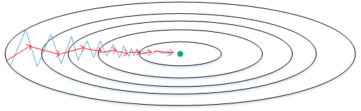

希望纵向学习率低一点，减少摆动。横向学习率高一点，快速靠近最小值。采用
$$
\begin{equation}
 v_{d W}=\beta v_{d W} +(1-\beta) d W =\beta v_{d W} +W
\end{equation}
$$
即旧的惯性加新的方向。指数加权平均，减少纵轴波动，相当于取平均且平均为 0，正负数相互抵消。而所有的微分都指向横轴方向。momentum项 $v_{dW}$ 提供速度，微分项 $dW$ 提供加速度。$\beta$ 相当于提供摩擦力，不让无限加速下去。


有两个超参数 $\alpha,\beta$，$\beta$ 常用 0.9 是很棒的鲁棒数。一般不适用偏差干扰项。且有时 $1-\beta$ 项会去掉，一般不去比较好，因为会影响 $\alpha$ 的值。


---

#### 2.7 RMSprop

 root mean square prop 均方根，因为你将微分进行平方，然后最后使用平方根。
$$
\begin{equation}
 S_{W}=\beta S_{d W}+(1-\beta) d W^{2} \\
 S_{b}=\beta S_{d b}+(1-\beta) d b^{2} \\
 W:=W-\alpha \frac{d W}{\sqrt{S_{W}}}, b:=b-\alpha \frac{d b}{\sqrt{S_{b}}} 
\end{equation}
$$
从下图中可以看出，梯度下降（蓝色折线）在垂直方向（b）上**振荡较大**，在水平方向（W）上振荡较小，表示在b方向上**梯度较大**，即 $db$ 较大，而在 W 方向上梯度较小，即 $dW$ 较小。因此，上述表达式中 $S_b$ 较**大**，而 $S_W$ 较小。在更新 W 和 b 的表达式中，变化值 $ \frac{d W}{\sqrt{S W}} $ 较大，而 $ \frac{d b}{\sqrt{S_{b}}} $ 较**小**。也就使得 W 变化得多一些，b 变化得**少**一些。

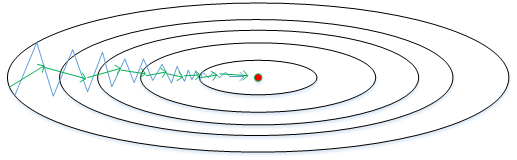


即加快了W方向的速度，减小了b方向的速度，减小振荡，实现快速梯度下降算法，其梯度下降过程如绿色折线所示。总得来说，就是如果哪个方向振荡大，就减小该方向的更新速度，从而减小振荡。

避免 RMSprop 算法中分母为零，通常可以在分母增加一个极小的常数 $ε$ ：
$$
\begin{equation}
 W:=W-\alpha \frac{d W}{\sqrt{S_{W}}+\varepsilon}, b:=b-\alpha \frac{d b}{\sqrt{S_{b}}+\varepsilon} 
\end{equation}
$$
其中，$ε=10^{−8}$，或者其它较小值。


---

#### 2.8 Adam 优化算法

aidamu

2015年 ICLR 提出的 A method for Stochastic Optimization, that the name is derived from adaptive moment estimation

Stochastic Optimization 随机优化

derived from 来源于

adaptive moment estimation 自适应矩估计


Init:  $V_{dW}=0, S_{dW},\space\space V_{db}=0, S_{db}=0$
On iteration t:
    Compute $dW,\space\space db$
    $ V_{d W}=\beta_{1} V_{d W}+\left(1-\beta_{1}\right) d W,\space\space V_{d b}=\beta_{1} V_{d b}+\left(1-\beta_{1}\right) d b $
    $ S_{d W}=\beta_{2} S_{d W}+\left(1-\beta_{2}\right) d W^{2},\space\space S_{d b}=\beta_{2} S_{d b}+\left(1-\beta_{2}\right) d b^{2} $
    Compute bias corrected 偏差修正
    $ V_{d W}^{\text {corrected }}=\frac{V_{d W}}{1-\beta_{1}^{t}},\space\space V_{d b}^{\text {corrected }}=\frac{V_{d b}}{1-\beta_{1}^{t}} $
    $ S_{d W}^{\text {corrected }}=\frac{S_{d W}}{1-\beta_{2}^{t}},\space\space S_{d b}^{\text {corrected }}=\frac{S_{d b}}{1-\beta_{2}^{t}} $
    $ W:=W-\alpha \frac{V_{d W}^{\text {corrected }}}{\sqrt{S_{d W}^{\text {Corrected }}}},\space\space b:=b-\alpha \frac{V_{d b}^{\text {corrected }}}{\sqrt{S_{d b}^{\text {corrected }}}} $


计算**Momentum**指数加权平均数，用**RMSprop**进行更新。其中 $dW^2$ $db^2$ 是对整个积分进行平方（element-wise）。偏差修正时的 t 表示迭代次数。

Adam算法包含了几个超参数，分别是：$α,β_1,β_2,ε$。其中，$β_1$ 通常设置为0.9，$β_2$ 通常设置为0.999，$ε$ 通常设置为 $10^{−8}$。一般只需要对 $β_1$ 和 $β_2$ 进行调试。

实际应用中，Adam算法结合了动量梯度下降和RMSprop各自的优点，使得神经网络训练速度大大提高。


adaptive moment estimation 自适应矩估计

$β_1$ 用来计算微分 $dW$，叫做第一矩

$β_2$ 用来计算平方数的指数加权平均数 $dW^2$ ，叫做第二矩。


论文中的算法


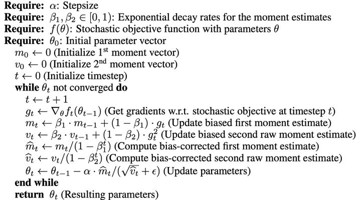


---

#### 2.9 学习率衰减

learning rate decay

加快深度学习训练速度的一个办法，随时间慢慢减小学习率。

如果学习率 $\alpha$ 是固定的值，且batch较小，算法不会收敛，只会在最优解附近不断徘徊。 

下图中，蓝色折线表示使用恒定的学习因子 $α$，由于每次训练 $α$ 相同，步进长度不变，在接近最优值处的振荡也大，在最优值附近较大范围内振荡，与最优值距离就比较远。绿色折线表示使用不断减小的 $α$，随着训练次数增加，$α$ 逐渐减小，步进长度减小，使得能够在最优值处较小范围内微弱振荡，不断逼近最优值。相比较恒定的 $α$ 来说，learning rate decay 更接近最优值。


1 epoch = 1 pass through datasets

遍历一次数据集


$$
\begin{equation}
 \alpha=\frac{1}{1+\underbrace{\text { decay-rate }}_{\text {hyperparameter }} \times \text { epoch }} \cdot \alpha_{0} 
\end{equation}
$$
指数下降
$$
\begin{equation}
 \alpha=\lambda^{\text {epoch-number }} \cdot \alpha_{0}, \quad \lambda<1 \sim 0.95 
\end{equation}
$$
对数下降
$$
\begin{equation}
 \alpha=\frac{\overbrace{\gamma_{c o n s t}}^{\text {hyperparameter }}}{\sqrt{\text { epoch-number }}} \cdot \alpha_{0} \quad  or  \quad=\frac{\gamma_{\text {const }}}{\sqrt{t}} \cdot \alpha_{0} 
\end{equation}
$$
离散阶梯
$$
\begin{equation}
 \alpha=f_{\text {discrete staircase }} 
\end{equation}
$$

---

#### 2.10 局部最优的问题

**只要选择合理的强大的神经网络，一般不太可能陷入局部最优**

平稳段是一块区域导数长期为0，会降低学习速度。


如果都是凸函数，就很好求解。

马鞍面，一凸一凹组成的，交点为鞍点。


---

### 第三周 超参数调试、Batch 正则化和程序框架

#### 3.1 调试处理

T3 学习率 最重要

T2 动量梯度下降因子 隐藏单元 mini-batch size 

T1 网络层数，学习率衰减因子 

T0 Adam算法参数


参数较少时，可以全部试一遍

参数较多时，随机采样。**coarse to fine** 由粗糙到精细的搜索。即采样后，也许你会发现效果最好的某个点，也许这个点周围的其他一些点效果也很好，那在接下来要做的是放大这块小区域，然后在其中更密集得取值或随机取值，聚集更多的资源。


---

#### 3.2 为超参数选择合适的范围

参数在不同的数量级，对变化的敏感程度不一样，取**对数** log10，就是在数量级上均匀取值（分布），能快速确定数量级大小

$α \in[ 10^a ~ 10^b]$

```python
r = np.random.uniform(a, b)
alpha = 10 ** r
```

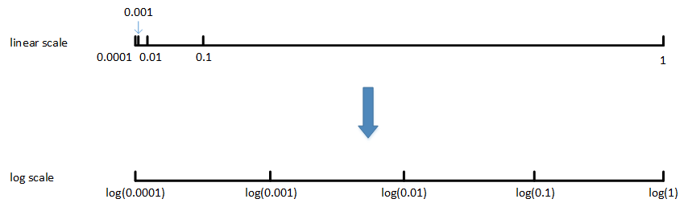


$β \in[0.9 ~ 0.999] → [1-10^{b} ~ 1-10^{a}]$

```python
r = np.random.uniform(a, b)
beta = 1 - 10 ** r
```


---

#### 3.3 超参数训练的实践：Pandas VS Caviar

**pandas**

照看一个模型，通常是有庞大的数据组，但没有许多计算资源或足够的CPU和GPU的前提下，基本而言，你只可以一次负担起试验一个模型或一小批模型。

比如，第0天，你将随机参数初始化，然后开始试验，然后你逐渐观察自己的模型评价曲线，在第1天内逐渐减少，那这一天末的时候，试着增加一点学习速率，看看它会怎样，也许结果证明它做得更好。两天后，它依旧做得不错，也许我现在可以填充下Momentum或减少变量。第三天，发现你的学习率太大了，所以你可能又回归之前的模型。

每天花时间照看此模型，即使是它在许多天或许多星期的试验过程中。所以这是一个人们照料一个模型的方法，观察它的表现，耐心地调试学习率。


**caviar**

同时试验多种模型，你设置了一些超参数，尽管让它自己运行，或者是一天甚至多天，然后会获得多条模型评价曲线。最后快速选择工作效果最好的那个。


---

#### 3.4 归一化网络的激活函数

对当前层的每个样本计算出的隐藏单元值进行归一化，共有m个样本(= mini batch_size)

已知第 l 层的隐藏单元值为：$ z^{[l](i)}=z^{(1)}, z^{(2)}, \ldots, z^{(m)} $

归一化：
$$
\begin{equation}
 \begin{aligned} 
 \mu &=\frac{1}{m} \sum_{i=1}^{m} z^{(i)} \\ 
 \sigma^{2} &=\frac{1}{m} \sum_{i=1}^{m}\left(z^{(i)}-\mu\right)^{2} \\ 
 z_{\text {norm }}^{(i)} &=\frac{z^{(i)}-\mu}{\sqrt{\sigma^{2}+\varepsilon}}
 \end{aligned} 
\end{equation}
$$
其中 $\varepsilon$ 防止分母为0，取值 $10^{-8}$。这样该隐藏层的所有输入 $z^{(i)}$ 均值为0，方差为1。

但是，大部分情况下并不希望所有的  $z^{(i)}$ 均值都为 0，方差都为 1，也不太合理。通常需要对  $z^{(i)}$  进行进一步处理：
$$
\tilde{z}^{(i)} =\gamma z_{\text {norm }}^{(i)}+\beta
$$
其中 $\gamma,\beta$ 是需要学习的参数，可以通过梯度下降等算法求得。这里， $\gamma,\beta$ 的作用是让 $ \tilde{z}^{(i)} $ 的均值和方差为任意值，只需调整其值就可以了。特别的如果：
$$
\begin{equation}
 \gamma=\sqrt{\sigma^{2}+\varepsilon}, \beta=u 
\end{equation}
$$
则有 $ \tilde{z}^{(i)} = z^{(i)} $。通过Batch Normalization，对隐藏层的各个$z^{[l](i)}$ 进行归一化处理，且下一层的输入为 $ \tilde{z}^{[l](i)} $ ，而不是 $ z^{[l](i)} $


输入的标准化处理 Normalizing inputs 和隐藏层的标准化处理 Batch Normalization 是**有区别的**。Normalizing inputs 使所有输入的均值为0，方差为1。而 Batch Normalization 可使各隐藏层输入的均值和方差为任意值。


实际上，从激活函数的角度来说，如果各隐藏层的输入**均值**在靠近 **0** 的区域即处于激活函数的**线性**区域，这样不利于训练好的非线性神经网络，得到的模型效果也不会太好。这也解释了为什么需要用  $\gamma,\beta$  来对 $z^{[l](i)}$ 作进一步处理。


---

#### 3.5 将 Batch Norm 拟合进神经网络

batch norm 在激活函数前进行

全连接网络中共有 N * L * 2 个 BN 参数，L 表示层数，N 表示一层里隐藏单元数目。


![[公式]](assets/equation-1617519745354.svg)

如果使用 BN，那么 bias 即 $b$ 可以去除掉，因为要先将 $z^{[L]}$ 减去均值，而 bias 会被均值减法抵消掉。其实 $\beta$ 就把 $b$ 包括进去了，二者都在调整这一特征的平均的水平
$$
\begin{equation}
 \begin{aligned} 
 z^{[l]}&=W^{[l]} a^{[l-1]} \\
 z_{norm}^{[l]} &= \frac{z^{[l]}-\mu}{\sqrt{\sigma^{2}+\varepsilon}} \\
 \tilde{z}^{[l]}&=\gamma^{[l]} z_{\text {norm }}^{[l]}+\beta^{[l]} 
 \end{aligned}
\end{equation}
$$
Parameters: $ W^{[1]} \in \mathbb{R}^{n[l] \times n^{[l-1]}}, \quad \gamma^{[l]} \in \mathbb{R}^{n^{[l]} \times 1}, \quad \beta^{[l]} \in \mathbb{R}^{n^{[l]} \times 1} $


for t = 1, 2, ..., num_mini_batches
	forward prop on $X^{\{t\}}$
	in each hidden layer, use BN to replace $z^{[l]}$ with $ \tilde{z}^{[l]}$
	back prop to compute $dW^{[l]}, dγ^{[l]}, dβ^{[l]}$
	update parameters
$$
\begin{equation}
 W^{[l]}:=W^{[l]}-\alpha d W^{[l]} \\
 \gamma^{[l]}:=\gamma^{[l]}-\alpha d\gamma^{[l]} \\
 \beta^{[l]}:=\beta^{[l]}- \alpha d\beta^{[l]} 
\end{equation}
$$
works with Momentum / RMSProp / Adam


---

#### 3.6 Batch Norm 为什么奏效？

> covariate shift：两组数据分布不一致，但条件分布一致


BN 减少了隐藏值分布变化的数量。哪怕前一层参数变换，BN后的均值和方差都一样（分布很相同）。

限制了前层的**参数更新**会**影响**数值**分布**的程度。

Batch Norm 减少了各层 $W^{[l]}$、$B^{[l]}$ 之间的**耦合性**，让各层更加**独立**，实现自我训练学习的效果。

对于特别多层的网络，后面的累积**分布差异**跟原数据分布完全不一样。每换一个batch，分布又可能往另一种方式差异化。BN 解决了这个问题。

简单的说就是让各层之间相对**独立**，不会因为前面层的变动导致后面层巨大变化。

像是把一个工序相互影响很大的工厂变成流水线，当前一层只需要考虑上一层的结果和当前层的处理。上一层的结果（分布）也比较稳定，当前层做起来就比较轻松。


BN 一次只能针对一个 mini-batch，每个mini-batch都有一个均值和方差，而不是用整个数据集计算。因此会产生 noise，迫使后边网络，不过分依赖于任何一个隐藏单元，slight 正则化效果。


----

#### 3.7 测试时的 Batch Norm<span id ="BN-test"></span>

BN 将你的数据以mini-batch的形式逐一处理，但在测试时，你可能需要对每个样本逐一处理

为了将你的神经网络运用于测试，就需要单独估算 $\mu$ 和 $\sigma^2$.

可以把所有训练集放入最终的神经网络模型中，然后直接计算每层的参数。

也可以用指数加权平均。


---

#### 3.8 Softmax 回归

传统logistic回归为 神经网络输出层只有一个神经元，表示预测输出 $\hat{y}$ 是正类的概率$ P(y=1 \mid x)$，$\hat{y}>0.5 $ 则判断为正类，$\hat{y}<0.5 $ 则判断为负类。

Softmax 处理多分类任务。神经网络中输出层就有C个神经元，即 $n^{[L]} = C$。每个神经元的输出依次对应属于该类的概率 $ P(y=C \mid x)$


最后一层输出    
$$
\begin{equation}
 z^{[L]}=W^{[L]} a^{[L-1]}+b^{[L]} 
\end{equation}
$$
通过Softmax激活函数
$$
\begin{equation}
 t=e^{z^{[L]}}, \quad t \in \mathbb{R}^{4 \times 1} \\ a^{[L]}=\frac{e^{z^{[L]}}}{\sum_{i=1}^{4} t_{i}}, \quad a_{i}^{[L]}=\frac{t_{i}}{\sum_{i=1}^{4} t_{i}} \\ \operatorname{softmax}: a_{(c, 1)}^{[L]}=g^{[L]}\left(z_{\{c, 1\rangle}^{[L]}\right) 
\end{equation}
$$
其中 C 表示分类数量，例子中 C = 4，a 表示对应所属类的概率，维度与 z 相同。且
$$
\begin{equation}
 \sum_{i=1}^{C} a_{i}^{[L]}=1 
\end{equation}
$$
Softmax 回归是 logistic 回归的一般形式。Softmax回归 = 分C类的广义逻辑回归


---

#### 3.9 训练一个 Softmax 分类器<span id ="dadz"></span>

让 $\hat{y}2$ 尽可能大，除了第二项其余项都为零
$$
\begin{equation}
 y=\left[\begin{array}{l}0 \\ 1 \\ 0 \\ 0\end{array}\right] \quad a^{[L]}=\hat{y}=\left[\begin{array}{c}0.3 \\ 0.2 \\ 0.1 \\ 0.4\end{array}\right] \quad C=4 \\
 L(\hat{y}, y)=-\sum^{4} y_{j} \log \hat{y}_{j}=-\log \hat{y}_{2} \Rightarrow \hat{y}_{2} \uparrow 
\end{equation}
$$
cost函数为
$$
\begin{equation}
 J\left(W^{[1]}, b^{[1]}, \ldots, W^{[L]}, b^{[L]}\right)=\frac{1}{m} \sum_{i=1}^{m} L\left(\hat{y}^{(i)}, y^{(i)}\right) 
\end{equation}
$$
损失函数为
$$
\begin{equation}
 L(\hat{y}, y)=-\sum_{j=1}^{4} y_{j} \log \hat{y}_{j} 
\end{equation}
$$
其中
$$
da = \frac{\part L}{\part a}=-\frac{y}{\hat{y}}=-\frac{1}{\hat{y}}
$$
因为 y 的值只有 0/1，0 项消掉了，只剩 1 项。

激活函数
$$
\begin{equation}
 t=e^{z^{[L]}}, \quad t \in \mathbb{R}^{C \times 1} \\ a^{[L]}=\frac{e^{z^{[L]}}}{\sum_{i=1}^{C} t_{i}}, \quad a_{i}^{[L]}=\frac{t_{i}}{\sum_{i=1}^{C} t_{i}} \\ \operatorname{softmax}: a_{(c, 1)}^{[L]}=g^{[L]}\left(z_{\{c, 1\rangle}^{[L]}\right) 
\end{equation}
$$
其中
$$
\frac{\part a}{\part z} =  \frac{\partial}{\partial z} \cdot\left(\frac{e^{z_{i}}}{\sum_{i=1}^{C} e^{z_{i}}}\right) \\
= a\cdot(1-a)
$$
得
$$
dz=\frac{\part L}{\part z} \\
= \frac{\part L}{\part a}\frac{\part a}{\part z} \\
=-\frac{1}{\hat{y}}*a(1-a)\\
=-\frac{1}{\hat{y}}*\hat{y}(1-\hat{y})\\
=\hat{y}-1\\
=\hat{y}-y
$$
其中 a = $\hat{y}$ ，$y=1$


----

#### 3.10 深度学习框架

易于编程，运行速度快，开源


----

#### 3.11 TensorFlow

例如cost function是参数w的函数：
$$
\begin{equation}
 J=w^{2}-10 w+25 
\end{equation}
$$

```python
import numpy as np
import tensorflow as tf

coefficients = np.array([[1.], [-10.], [25.]])

w = tf.Variable(0,dtype=tf.float32)  # 定义参数w 初始化为0 
x = tf.placeholder(tf.float32, [3,1]) # training data size为 3x1 稍后为x提供数值    现在x变成了控制这个二次函数系数的数据
cost = x[0][0]*w**2 + x[1][0]*w + x[2][0]


# cost = tf.add(tf.add(w**2, tf.multiply(10., w)), 25) # 定义cost fucition
cost = w**2 - 10*w + 25 # 重载了加减运算


train = tf.train.GradientDescentOptimizer(0.01).minimize(cost) # 优化器为梯度下降 学习率0.01 指定最小化函数为cost

init = tf.global_variables_initalizer() # 初始化
session = tf.Sessions() # 开启一个tf session 
session.run(init) # 初始化全局变量 给w赋初值
session.run(w) # 评估变量w

session.run(train) # 开始优化 1步
session.run(train, feed_dict = {x:coefficients}) # 开始优化 并给x赋值

for i in range(1000): # 优化1000步
    session.run(train)
    session.run(train, feed_dict = {x:coefficients}) # 开始优化 并给x赋值
    
```


**TensorFlow** 中的 **placeholder** 是一个你之后会赋值的变量，这种方式便于把训练数据加入损失方程，把数据加入损失方程用的是这个句法，当你运行训练迭代，用 `feed_dict` 来让 `x=coefficients`。

如果你在做 **mini-batch** 梯度下降，在每次迭代时，你需要插入不同的 **mini-batch**，那么每次迭代，你就用 `feed_dict` 来喂入训练集的不同子集，把不同的 **mini-batch** 喂入损失函数需要数据的地方。


```python
session = tf.Sessions() # 开启一个tf session 
session.run(init) # 初始化全局变量 给w赋初值
session.run(w) # 评估变量w

# 可以替换为

with tf.Session()  as session:
	session.run(init)
    print(session.run(w))
```

**Python**中的**with**命令更方便清理，以防在执行这个内循环时出现错误或例外


TensorFlow的最大优点就是采用数据流图（data flow graphs）来进行数值运算。图中的节点（Nodes）表示**数学操作**，图中的线（edges）则表示在节点间相互联系的**多维数据数组**，即张量（tensor）。而且它灵活的架构让你可以在多种平台上展开计算，例如台式计算机中的一个或多个CPU（或GPU），服务器，移动设备等等。


---

## 第四周【人工智能行业大师访谈】

#### 4.1. 吴恩达采访 Yoshua Bengio

花书作者

self attention


but i dont think that we need that everything be formalized mathematically but be formalized logically, not the sense that i can convice somebody that this should be work, whether this make sense. This is the most important aspect. And then math allows us to make that stronger and tighter. 

不认为一切事物都要数学化， 而是要逻辑化，并不是我可以让别人相信这样有用，可行。 然后再通过数学来强化和精练。


大多数人只停留在粗浅了解的程度，一旦出现问题，使用者很难解决，也不知道原因。所以大家要亲自实践，即便效率不高，只要知道是怎么回事就好，很有帮助，尽量亲自动手。 所以不要用那种几行代码就可以解决一切，却不知道其中原理的编程框架。尽量从基本原理入手获取知识。多阅读，多看别人的代码，多自己写代码。

 

不要畏惧数学，发展直觉认识，一旦在直觉经验层面得心应手，数学问题会变得更容易理解。 


---

#### 4.2. 吴恩达采访 林元庆

 国家深度学习实验室


---


