# 深度学习工程师

由 deeplearning.ai 出品，网易引进的正版授权中文版深度学习工程师微专业课程，让你在了解丰富的人工智能应用案例的同时，学会在实践中搭建出最先进的神经网络模型，训练出属于你自己的 AI。

deeplearning.ai

https://www.coursera.org/learn/neural-networks-deep-learning?action=enroll

https://study.163.com/my#/smarts

https://www.bilibili.com/video/av66644404

**note**

https://redstonewill.blog.csdn.net/article/details/78519599

https://redstonewill.blog.csdn.net/article/details/78600255

https://www.zhihu.com/column/DeepLearningNotebook

http://www.ai-start.com/dl2017/

**课后作业**

https://blog.csdn.net/u013733326/article/details/79827273

https://www.heywhale.com/mw/project/5e20243e2823a10036b542da

## Question

- [ ] 改善深层神经网络-[1.11 权重初始化](#winit)，

------

## 结构化机器学习项目

### 第一周 机器学习（ML）策略（1）

#### 1.1 为什么是 ML 策略

改善模型性能的方法：

- 收集更多的数据
- 收集多样的训练集
- 用梯度下降训练更久
- 试用更好的优化方法adam等
- 尝试更大/更小的网络
- 尝试 dropout
- 尝试添加 L2 正则化项
- 改变网络的架构

---

#### 1.2 正交化

orthogonalization

正交意味着互成 90 度，即每一个维度只控制其所能控制的变量，不会影响以另一维度为自变量的因变量。

1. 系统在训练集上表现的不错（训练更大的网络，切换更好的优化算法）
2. 紧接着希望在验证集上表现的不错（正则化，更大的数据集）
3. 然后在测试集上表现得不错（更大的验证集）
4. 最后在真实世界里表现良好（改变验证集或 cost 函数）

而这些调节方法（旋钮）只会对应一个“功能”，是正交的。

一般不用 early stopping。因为同时影响两个测试和验证，不具有独立性、正交性。

---

#### 1.3 单一数字评估指标

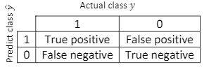

precision 查准率：在模型识别出的所有猫里，有多少确实是猫

recall 查全率（召回率）：对于所有的猫，模型识别出了多少只

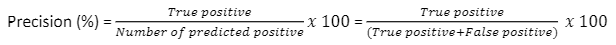

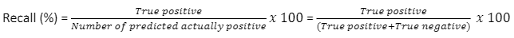

F1 score 为查准率和查全率的平均值，即单实数评估指标。
$$
\begin{equation}
 F_{1}=\frac{2}{\frac{1}{P}+\frac{1}{R}} =
 \frac{2 \cdot P \cdot R}{P+R} 
\end{equation}
$$
harmonic mean of P and R，调和平均

除了F1 Score之外，我们还可以使用平均值作为单实数评价指标来对模型进行评估。

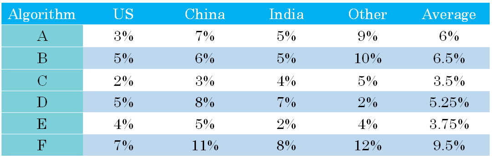

验证集 +单一数字评估指标加速迭代过程

---

#### 1.4 满足和优化指标

Satisficing and Optimizing metrics

如果你要考虑 N 个指标，有时候选择其中 1 个指标做为优化指标是合理的。所以你想尽量优化那个指标；然后剩下 N-1 个指标都是满足指标，意味着只要它们达到一定阈值，例如运行时间快于100毫秒，但只要达到一定的阈值，你不在乎它超过那个门槛之后的表现，但它们必须达到这个门槛。

**N metric:** 1 <u>optimizing</u>, N-1 <u>satisficing</u>

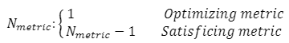

e.g. **maximize accuracy** subject to **running time < 100 ms**

---

#### 1.5 训练 / 验证 / 测试集划分

让验证集和测试集服从相同的分布 ← 随机地混排到验证/测试中 

选择一个验证集和测试集，以反映您期望在未来获得的数据，并考虑做好这些数据的重要性

----

#### 1.6 验证集/测试集的大小

当样本数量不多（小于一万）的时候，通常将Train/dev/test sets的比例设为60%/20%/20%，在没有dev sets的情况下，Train/test sets的比例设为70%/30%。

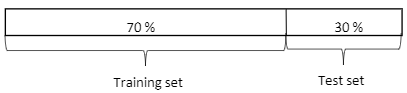

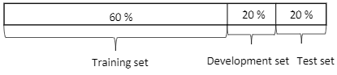

当样本数量很大（百万级别）的时候，通常将相应的比例设为98%/1%/1%或者99%/1%。

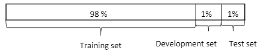

对于dev sets数量的设置，应该遵循的准则是通过dev sets能够检测不同算法或模型的**区别**，以便选择出更好的模型。

对于test sets数量的设置，应该遵循的准则是通过test sets能够反映出模型在**实际中的表现**。

实际应用中，可能只有train/dev sets，而没有test sets。这种情况也是允许的，只要算法模型没有对dev sets**过拟合**。但是，条件允许的话，最好是有test sets，实现无偏估计。

---

#### 1.7 什么时候该改变验证/ 测试集和指标

Metric + Dev: prefers A *(misprediction)*
You / Users: prefers B

当评估指标，无法正确衡量算法之间的优劣排序时，就需要指标了。比如加权重项，分类错误的惩罚权重加大10倍。

![[公式]](assets/equation-1617850769804.svg)

1. **Place the target:** 定义衡量指标以评估分类器
2. **Shoot at target:** 单度考虑如何在此指标上做得好，并不断动态修改调整。

如果在metric + dev / test set上效果好，但在实际应用上效果不好相对应，则更改metric and/or dev / test set。需要动态改变评价标准的情况是 dev/test sets 与实际应用的样本分布不一致。

---

#### 1.8 Why human-level performance

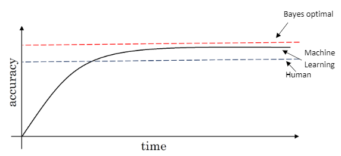

横坐标是训练时间，纵坐标是准确性。机器学习模型经过训练会不断接近human-level performance甚至超过它。但是，超过human-level performance之后，准确性会上升得比较缓慢，最终不断接近理想的最优情况，我们称之为bayes optimal error。理论上任何模型都不能超过它，bayes optimal error代表了最佳表现。

实际上，human-level performance在某些方面有不俗的表现。例如图像识别、语音识别等领域，人类是很擅长的。所以，让机器学习模型性能不断接近 human-level performance 非常必要也做出很多努力：

- Get labeled data from humans. 从人类获取带标签的数据
- Gain insight from manual 手动 error analysis: Why did a person get this right?
- Better analysis of bias/variance.偏差/方差

---

#### 1.9 可避免偏差

第一个例子中，这 8 - 1 = 7% 衡量了可避免偏差大小，而10 - 8 = 2%衡量了方差大小。所以在左边这个例子里，专注减少可避免偏差可能潜力更大。

第二个例子可避免偏差可能在 8 - 7.5 = 0.5% 左右，或者 0.5% 是可避免偏差的指标。而这个10 - 8 = 2%是方差的指标，所以要减少这个 2% 比减少这个 0.5% 空间要大得多。

如果算法在训练集上的表现和人类水平的表现有很大差距的话，说明算法对训练集的拟合并不好。所以从减少偏差和方差的角度看，在这种情况下，我会把重点放在减少偏差上。你需要做的是，比如说训练更大的神经网络，或者跑久一点梯度下降，就试试能不能在训练集上做得更好。如果算法与人类水平还比较接近，就可以注重减少方差，将验证集的 performance 接近于训练集。

我们希望提高训练集的 performance，直到接近 bayes optimal error，但实际上也不希望做到比 bayes optimal error 更好，因为理论上是不可能超过 bayes optimal error 的，除非过拟合。

把 training error 与 human-level error 之间的差值称为**bias**，也称作 avoidable bias；把 dev error 与 training error 之间的差值称为**variance**。根据 bias 和 variance 值的相对大小，可以知道算法模型是否发生了欠拟合或者过拟合。

>  其中 human-level error 近似于 bayes optimal error

---

#### 1.10 理解人的表现

**human-level error** as a proxy for **Bayes error**

不同人群的错误率不同。一般来说，将表现最好的那一组，即Team of experienced doctors作为human-level performance

training error 到 bayes optimal error 的差距，告诉你 avoidable bias 问题有多大，avoidable bias 问题有多严重，而 training error 与  dev error 之间的差值告诉你方差上的问题有多大，你的算法是否能够从训练集泛化推广到开发集。

---

#### 1.11 Surpassing human- level performance

对于自然感知类问题，例如视觉、听觉等，机器学习的表现不及人类。但是在很多其它方面，机器学习模型的表现已经超过人类了，通常输入为结构化数据：

- **Online advertising**
- **Product recommendations**
- **Logistics(predicting transit time)**
- **Loan approvals**

机器学习模型超过human-level performance是比较困难的。但是只要提供足够多的样本数据，训练复杂的神经网络，模型预测准确性会大大提高，很有可能接近甚至超过human-level performance。当算法模型的表现超过human-level performance时，很难再通过人的直觉来解决如何继续提高算法模型性能的问题。

---

#### 1.12 改善模型表现

想要让一个监督学习算法达到**应用**，基本上希望或者假设你可以完成两件事情。首先，你的算法对训练集的拟合很好，这可以看成是你能做到**可避免偏差很低**。还有第二件事你可以做好的是，在训练集中做得很好，然后推广到开发集和测试集也很好，这就是说**方差不大**。解决方法如下：

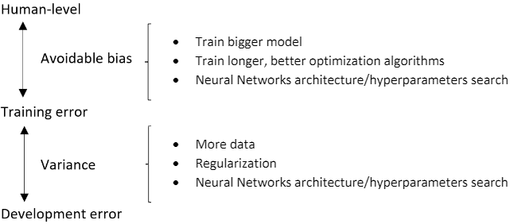

---

### 第二周 机器学习（ML）策略（2）

#### 2.1 进行误差分析

建立一个表格，表格的第一列对应你要评估的想法，比如狗的问题，猫科动物的问题，模糊图像的问题。扫过每一列，最后统计各列有多少百分比图像打了勾。

通常来说，**比例越大**，影响越大，越应该花费时间和精力着重解决这一问题。这种 error analysis 让我们改进模型更加有针对性，从而提高效率。有人手时，可以不同小组处理不同问题。

---

#### 2.2 清楚标注错误的数据

深度学习算法对训练集的**随机误差**很健壮，但对**系统性的错误**就没那么健壮了。即可以有个别错误。 

**针对验证集，则看整体验证集的错误率**

​	Overall dev set error: 10%

​	Errors due incorrect labels: 0.6%

​	Errors due to other causes: 9.4%

上面数据表明 Errors due incorrect labels 所占的比例仅为 0.6%，占 dev set error 的6%，而其它类型错误占 dev set error 的 94%。因此，这种情况下，可以忽略incorrectly labeled data，而去修复其他原因，造成的结果。

**如果优化DL算法后，出现下面这种情况：**

Overall dev set error: 2%

Errors due incorrect labels: 0.6%

Errors due to other causes: 1.4%

上面数据表明 Errors due incorrect labels 所占的比例依然为0.6%，但是却占 dev set error的 30%，而其它类型错误占 dev set error 的70%。因此，这种情况下，incorrectly labeled data 不可忽略，需要手动修正。

我们知道，**dev set 的主要作用是在不同算法之间进行比较，选择错误率最小的算法模型**。但是，如果有 incorrectly labeled data 的存在，当不同算法**错误率比较接近**的时候，我们无法仅仅根据 Overall dev set error 准确指出哪个算法模型更好，**必须修正** incorrectly labeled data。

关于修正 incorrect dev/test set data，有几条建议：

- 对验证和测试集应用相同的过程，以确保它们继续服从同一分布。
- 考虑研究算法正确和错误的示例
- 训练和验证/测试数据现在可能服从略有不同的分布

---

#### 2.3 快速搭建你的第一个系统，并进行迭代

- **快速**设置验证/测试集和指标，错了可以改

- **快速**构建初始系统，并找到训练集，训练看效果，理解算法表现，及在验证集测试集上的评估指标上的表现。快速和粗糙的实现（**quick and dirty implementation**），
- 使用偏差/方差分析和错误分析来**优先**确定后续步骤

---

#### 2.4 使用来自不同分布的数据，进行训练和测试Training and testing on different distributions

以猫类识别为例，train set 来自于网络下载（webpages），图片比较清晰；dev/test set 来自用户手机拍摄（mobile app），图片比较模糊。假如 train set 的大小为200000，而 dev/test set 的大小为10000，显然 train set 要远远大于 dev/test set。

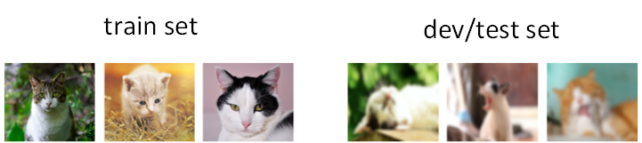

虽然 dev/test set 质量不高，但是**模型最终主要应用在对这些模糊的照片的处理上**。面对train set 与 dev/test set 分布不同的情况，有两种解决方法。

× **第一种方法**是将train set和dev/test set**完全混合**，然后在**随机选择**一部分作为train set，另一部分作为dev/test set。例如，混合210000例样本，然后随机选择205000例样本作为train set，2500例作为dev set，2500例作为test set。这种做法的优点是实现train set和dev/test set**分布一致**，**缺点**是dev/test set中webpages图片所占的**比重**比mobile app图片大得多。例如dev set包含2500例样本，大约有2381例来自webpages，只有119例来自mobile app。这样，dev set的算法模型对比验证，仍然主要由webpages决定，实际应用的mobile app图片所占比重很小，**达不到验证效果**。因此，这种方法并不是很好。

√ **第二种方法**是将原来的train set和一部分dev/test set组合当成train set，剩下的dev/test set分别作为dev set和test set。例如，200000例webpages图片和5000例mobile app图片组合成train set，剩下的2500例mobile app图片作为dev set，2500例mobile app图片作为test set。其关键在于dev/test set全部来自于mobile app。这样**保证了验证集最接近实际应用场合**。这种方法较为常用，而且性能表现比较好。

---

#### 2.5 数据分布不匹配时，偏差与方差的分析Bias and Variance with mismatched data distributions

**随机打散训练集**，然后**分出一部分训练集**作为**训练-验证集**（training-dev），这是一个新的数据子集。就像验证集和测试集来自同一分布，训练集、训练-验证集也来自同一分布。但不同的地方是，现在只在**训练集**训练你的神经网络，**不会让神经网络在训练-验证集上跑后向传播**。

有一个样本，训练集误差是1%，训练-验证集误差是9%，验证集误差是10%，和以前一样。算法**存在方差**问题，因为训练-验证集的错误率是在和训练集来自**同一分布**的数据中测得的。

有一个样本，训练集误差为1%，训练-验证误差为1.5%，验证集误差为10%。算法**方差问题很小**，转到验证集时，错误率就大大上升了，所以这是**数据不匹配**的问题。因为你的学习算法没有直接在训练-验证集或者验证集训练过，但是这**两个数据集来自不同的分布**。

有一个样本，训练集误差是10%，训练-验证误差是11%，验证集误差为12%，人类水平对贝叶斯错误率的估计大概是0%。则算法**存在偏差问题**。存在**可避免偏差**问题。

有一个样本，训练集误差是10%，训练-验证误差为11%，验证集误差为20%，有两个问题。第一，**可避免偏差**相当**高**，因为你在训练集上都没有做得很好，而人类能做到接近0%错误率，但你的算法在训练集上错误率为10%。这里方差似乎很小，但存在**数据不匹配问题**。

---

#### 2.6 定位数据不匹配

---

#### 2.7 迁移学习

---

#### 2.8 多任务学习

---

#### 2.9 什么是端到端的深度学习





#### 2.10 是否要使用端到端的深度学习







### 第三周 人工智能行业大师访谈

#### 3.1. 吴恩达采访 Andrej Karpathy



#### 3.2. 采访 Ruslan Salakhutdinov

