# 深度学习工程师

由 deeplearning.ai 出品，网易引进的正版授权中文版深度学习工程师微专业课程，让你在了解丰富的人工智能应用案例的同时，学会在实践中搭建出最先进的神经网络模型，训练出属于你自己的 AI。

**CNN可视化**

https://poloclub.github.io/cnn-explainer/

deeplearning.ai

https://www.coursera.org/learn/neural-networks-deep-learning?action=enroll

https://study.163.com/my#/smarts

https://www.bilibili.com/video/av66646276

**note**

https://redstonewill.blog.csdn.net/article/details/78651063

https://www.zhihu.com/column/DeepLearningNotebook

http://www.ai-start.com/dl2017/

**课后作业**

https://blog.csdn.net/u013733326/article/details/79827273

https://www.heywhale.com/mw/project/5e20243e2823a10036b542da

## Question

- [ ] 改善深层神经网络-[1.11 权重初始化](#winit)，

## 卷积神经网络

### 第一周 卷积神经网络

#### 1.1 计算机视觉

首先，计算机视觉的高速发展标志着新型应用产生的可能，这是几年前，人们所不敢想象的。通过学习使用这些工具，你也许能够创造出新的产品和应用。

其次，即使到头来你未能在计算机视觉上有所建树，也可以将**所学的知识应用到其他算法和结构**。

一张 64x64x3 的图片，神经网络输入层的维度为12288。一张 1000x1000x3 的图片，神经网络输入层的维度将达到 3M，使得网络权重 W 非常庞大。这样会造成两个后果，

- 一是神经网络结构复杂，数据量相对不够，容易出现过拟合；
- 二是所需内存、计算量较大。

解决这一问题的方法就是使用卷积神经网络（CNN）。

---

#### 1.2 边缘检测示例

神经网络由浅层到深层，分别可以检测出图片的边缘特征 、局部特征（例如眼睛、鼻子等）、整体面部轮廓。

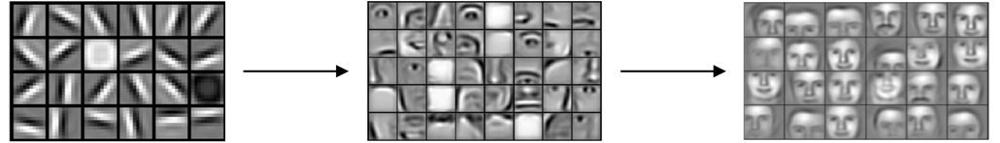

最常检测的图片边缘有两类：一是垂直边缘（vertical edges），二是水平边缘（horizontal edges）。

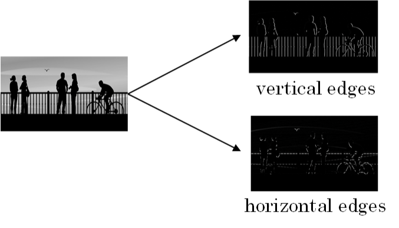

图片的边缘检测可以通过与相应**滤波器**进行卷积来实现。以垂直边缘检测为例，原始图片尺寸为6x6，滤波器filter尺寸为3x3，卷积后的图片尺寸为4x4，得到结果如下：

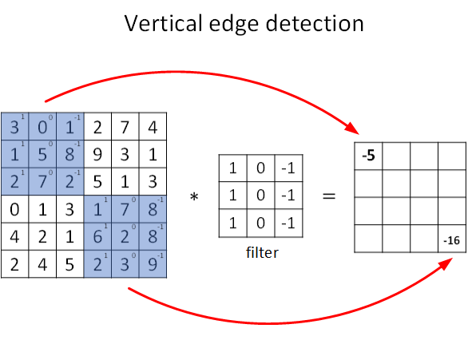

卷积过程动态示意图

---

#### 1.3 更多边缘检测内容

还有很多其他的滤波器（检测算子）

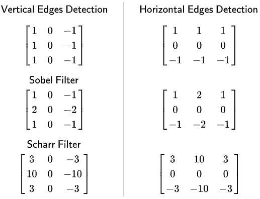

随着深度学习的发展，我们学习的其中一件事就是当你真正想去检测出复杂图像的边缘，你不一定要去使用那些研究者们所选择的这九个数字，但你可以从中获益匪浅。把这矩阵中的9个数字当成9个参数，并且在之后你可以学习使用**反向传播**算法，其目标就是去**理解这9个参数**。

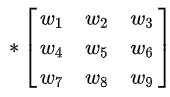

将这9个数字当成参数的思想，已经成为计算机视觉中最为有效的思想之一。

---

#### 1.4 Padding

**本小节步长全部为1**

valid convolution : no padding

输入 * 卷积核 → 输出维度   （n, n） * （f, f） →  （n - f + 1, n - f + 1）

same convolution: padding   一搬填充为0

输入 * 卷积核 → 输出维度   （n + 2p, n + 2p） * （f, f） →  （n  + 2p - f + 1, n  + 2p - f + 1）

如果希望输出维度和原始输入维度一样，则计算得
$$
p = \frac{f-1}{2}
$$
这里也诠释了为什么卷积核一般为奇数尺寸。并且奇数有中心像素点，便于索引滤波器的位置。

odd number 奇数

even number 偶数

---

#### 1.5 卷积步长

给定 padding : p 、strider: s

则有输入 * 卷积核 → 输出维度   （n, n） * （f, f） →  （$\frac{n+2p-f}{s}+1$, $\frac{n+2p-f}{s}+1$）

如果商不为整，向下取整 `floor`，有一部分超出范围就不进行计算。

 

相关系数（cross-correlations）与卷积（convolutions）之间是有区别的。真正的卷积运算（数学/信号处理）会先将filter绕其中心旋转180度，然后再将旋转后的filter在原始图片上进行滑动计算。filter旋转如下所示：

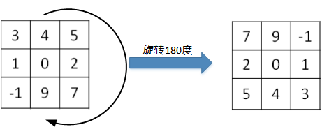

而在深度学习领域，默认不需要反转，直接求积。严格意义来讲我们**平时使用的方法不叫卷积而叫互相关**。

之所以可以这么等效，是因为**滤波器算子一般是水平或垂直对称的**，180度旋转影响不大；而且最终滤波器算子需要通过CNN网络梯度下降算法计算得到，**旋转部分可以看作是包含在CNN模型算法**中。总的来说，忽略旋转运算可以大大提高CNN网络运算速度，而且不影响模型性能。

---

#### 1.6 三维卷积

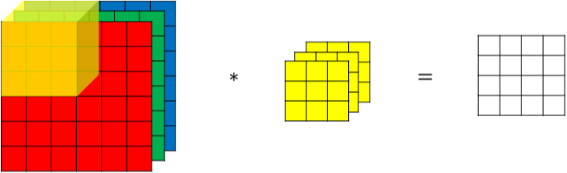

对于3通道的RGB图片，其对应的滤波器算子同样也是3通道的。例如一个图片是6 x 6 x 3，分别表示图片的高度（height）、宽度（weight）和通道（channel）。

过程是将每个单通道（R，G，B）与对应的filter进行卷积运算求和，然后再将**3通道的和相加**，得到输出图片的一个像素值。

**不同通道的滤波算子可以不相同**。例如**R**通道filter实现**垂直**边缘检测，**G和B**通道**不进行**边缘检测，全部置零，或者将R，G，B三通道filter全部设置为水平边缘检测。

为了进行多个卷积运算，实现更多边缘检测，可以增加更多的滤波器组。例如设置第一个滤波器组实现垂直边缘检测，第二个滤波器组实现水平边缘检测。这样，不同滤波器组卷积得到不同的输出，个数由滤波器组决定。

则有输入 * 卷积核 → 输出维度   
$$
（n, n, n_c） * n_k（f, f, n_c） →  （\frac{n+2p-f}{s}+1, \frac{n+2p-f}{s}+1, n_k）
$$
$n$ 为图片尺寸大小，也可用 h 和 w 表示高和宽，例中为 6 ；

$f$ 为卷积核尺寸大小，例中为 3 ；

$n_c$ 为图片通道数目，例中为2；

$n_k$ 为滤波器组个数，例中为2；

padding : p 为填充数，例中为0，无填充；

strider: s 为步长，例中为1。则有：
$$
（6, 6, 3） * 2（3, 3, 3） →  （4, 4, 2）
$$

---

#### 1.7 单层卷积网络

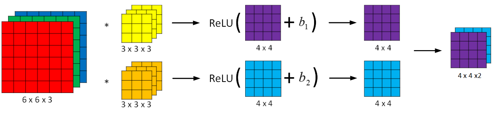

相比之前的卷积过程，CNN 的单层结构多了激活函数 ReLU 和偏移量b。整个过程与标准的神经网络单层结构非常类似：
$$
Z^{[l]}=W^{[l]} A^{[l-1]}+b\\
A^{[l]}=g^{[l]}\left(Z^{[l]}\right)
$$
输出 = 非线性激活函数（线性函数+偏差），例中 W 为卷积核，A 为输入图像，b 为偏置，g为 `relu` 。相当于有两个个待学习的参数：**卷积核，偏差**

总结CNN单层结构的所有标记符号，设层数为 $l$。

**filter size:** $f^{[l]}$   				 滤波器尺寸

**padding:** $p^{[l]}$      				 填充

**stride:** $s^{[l]}$          				  步长

**number of filters:** $n_{c}^{[l]}$  	滤波器个数

**input:** $n_{H}^{[l-1]} \times n_{\omega}^{[l-1]} \times n_{c}^{[l-1]} $     输入维度，l-1层

**output:**  $n_{H}^{[l]} \times n_{\omega}^{[l]} \times n_{c}^{[l]}$             输出维度，l层

其中  
$$
\left.\begin{array}{l}
n_{H}^{[l]}=\left[\frac{n_{H}^{[l-1]}+2 p^{[l]}-f^{[l]}}{s^{[l]}}+1\right. \\
n_{W}^{[l]}=\left\lfloor\frac{n_{W}^{[l-1]}+2 p^{[l]}-f^{[l]}}{s^{[l]}}+1\right.
\end{array}\right]
$$

**filter:** $f^{[l]} \times f^{[l]} \times n_{c}^{[l-1] }$               			滤波器维度，最后一维与输入channel相同

**weights:** $f^{[l]} \times f^{[l]} \times n_{c}^{[l-1]} \times n_{c}^{[l]}$ 		  权重维度 = 滤波器维度 * 滤波器个数 

**bias:** $1 \times 1 \times 1 \times n_{c}^{[l]}$								偏置维度，只与滤波器个数有关

**activations:** $n_{H}^{[l]} \times n_{W}^{[l]} \times n_{c}^{[l]}$                  激活函数维度，与输出维度完全相同

如果**mini-batch**有m个样本，进行向量化运算，相应的输出维度为 $m \times n_{H}^{[l]} \times n_{\omega}^{[l]} \times n_{c}^{[l]}$

假设你有10个过滤器，神经网络的一层是3×3×3，那么，这一层有多少个参数呢？

我们来计算一下，每一层都是一个3×3×3的矩阵，因此每个过滤器有27个参数，也就是27个数。然后加上一个偏差，用参数表示，现在参数增加到28个现在我们有10个过滤器，加在一起是28×10，也就是280个参数。

---

#### 1.8 简单卷积网络示例

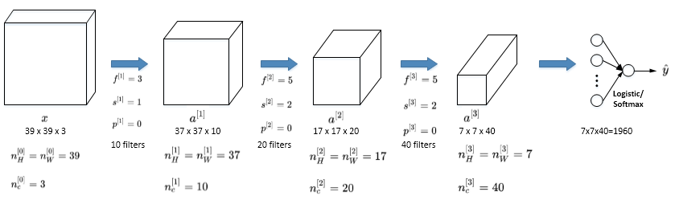

CNN模型各层结构如上图所示。需要注意的是，$a^{[3]}$ 的维度是 `7 x 7 x 40`，将 $a^{[3]}$ 排列成 1 列，维度为 `1960 x 1`，然后连接最后一级输出层。输出层可以是一个神经元，即二元分类（logistic）；也可以是多个神经元，即多元分类（softmax）。最后得到预测输出 $\hat y$ 。值得一提的是，随着CNN层数增加，$n_H^{[l]}$  和 $n_W^{[l]}$ 一般逐渐减小，而$n_c^{[l]}$ 一般逐渐增大。

CNN有三种类型的layer：

- Convolution层（CONV）
- Pooling层（POOL）
- Fully connected层（FC）

---

#### 1.9 池化层

缩减模型大小，提高计算速度，提高所提取特征的鲁棒性。

**最大池化**

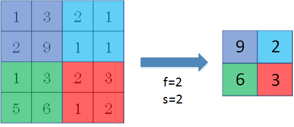

这就像是应用了一个规模为2的过滤器，因为我们选用的是2×2区域，步幅是2，这些就是最大池化的超参数。

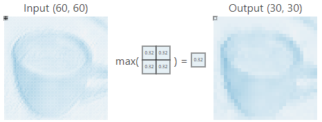

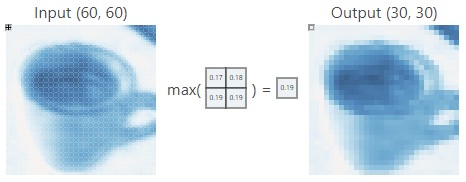

**数字大意味着可能探测到了某些特定的特征**，左上象限具有的特征可能是一个垂直边缘，一只眼睛。显然左上象限中存在这个特征，这个特征可能是一只猫眼探测器。必须承认，使用最大池化的主要原因是此方法在很多实验中效果都很好。计算卷积层输出大小的公式同样适用于最大池化，即 $\frac{n+2p-f}{s}+1$

**平均池化**

选取的不是每个过滤器的最大值，而是平均值。

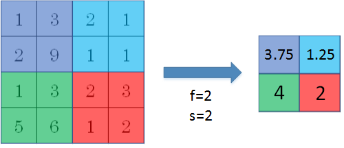

目前来说，最大池化比平均池化更常用。但也有例外，就是深度很深的神经网络，可以用平均池化来分解规模为7×7×1000的网络的表示层，在整个空间内求平均值，得到1×1×1000。

**参数**

池化的超级参数包括过滤器大小 $f$ 和步幅 $s$ ,常用的参数值为 $f=2, s=2$，效果相当于高度和宽度缩减一半。很少用到超参数 padding。最常用的 padding 值是0，输入为$n_{H} \times n_{W} \times n_{c}$，输出为$ \lfloor\frac{n_{H}-f}{s}+1\rfloor \times\lfloor\frac{n_{\mathrm{w}}-f}{s}+ 1\rfloor \times n_{c}$。

输入与输出**通道数相同**，因为我们对每个通道都做了池化。需要注意的一点是，池化过程中**没有需要学习的参数**。执行反向传播时，反向传播没有参数适用于最大池化。这些设置过的超参数，可能是手动设置的，也可能是通过交叉验证设置的。

---

#### 1.10 卷积神经网络示例

计算网络层数，通常是带有权重和参数的才算一层，想池化层和激活层就不算单独的一层。

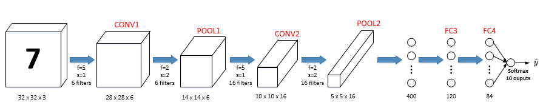

图中，`CON` 层后面紧接一个 `POOL` 层，`CONV1` 和 `POOL1` 构成第一层，`CONV2` 和 `POOL2` 构成第二层。特别注意的是 `FC3` 和 `FC4` 为全连接层 `FC`，它跟标准的神经网络结构一致。最后的输出层（softmax）由10个神经元构成。

随着神经网络深度的加深，**高度和宽度都会减小**，从 32×32 到 28×28，到 14×14，到 10×10，再到 5×5；**而通道数量会增加**，从 3 到 6 到 16 不断增加，然后得到一个全连接层。

接下来我们讲讲神经网络的**激活值形状**，**激活值大小**和**参数数量**。有几点要注意，第一，池化层没有参数；第二，**卷积层的参数相对较少**，第三，**全连接层参数较多**，其实许多参数都存在于神经网络的全连接层。观察可发现，**随着神经网络的加深，激活值size会逐渐变小，如果激活值size下降太快，也会影响神经网络性能**。

整个网络各层的尺寸和参数如下表格所示：

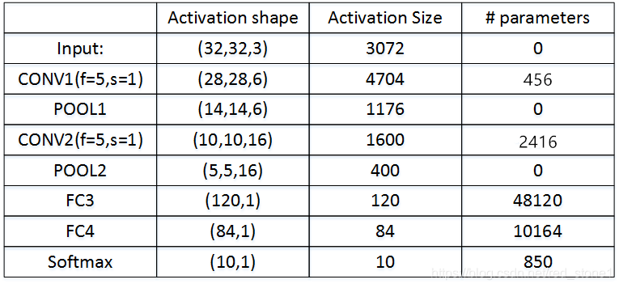

`CONV1` 参数$ = 6 \times （5\times5\times3+1）$

`CONV2` 参数$ = 16 \times （5\times5\times6+1）$

`FC2` 参数$ = （400\times120）+120$

`FC3` 参数$ = （120\times84）+84$

`softmax` 参数$ = （84\times10）+10$

上边的conv算法是每个通道滤波器做的事情不一样，如果每个通道滤波器一致，则参数量要除以通道数。

常规做法是，**尽量不要自己设置超参数**，而是**查看文献中别人采用了哪些超参数**，**选一个在别人任务中效果很好的架构**，那么它也有可能适用于你自己的应用程序。

----

#### 1.11 为什么使用卷积？

与全连接层相比，卷积层的两个主要优势在于

**参数共享**：一个特征检测器（例如垂直边缘检测）对图片A的某块区域有用，同时也可能作用在图片A的其它区域。即不用对图像不同区域使用不同的滤波器，所有区域只使用一个滤波器处理即可。（如果不参数共享，滤波器滑一次变一次，参数过多）

**稀疏连接**：因为滤波器算子尺寸限制，每一层的每个输出只与输入**部分区域**内有关。而且其它像素值都不会对输出产生任影响。

**平移不变性**：神经网络的卷积结构使得即使移动几个像素，这张图片依然具有非常相似的特征，应该属于同样的输出标记。

除此之外，由于 CNN 参数数目较小，所需的训练样本就相对较少，从而一定程度上不容易发生过拟合现象。而且，CNN比较擅长捕捉区域位置偏移。也就是说CNN进行物体检测时，不太受物体所处图片位置的影响，增加检测的准确性和系统的健壮性。

-----

### 第二周 深度卷积网络：实例探究

#### 2.1 为什么要进行实例探究？

---

#### 2.2 经典网络

---

#### 2.3 残差网络

---

#### 2.4 残差网络为什么有用？

---

#### 2.5 网络中的网络以及 1×1 卷积

---

#### 2.6 谷歌 Inception 网络简介

---

#### 2.7 Inception 网络

---

#### 2.8 使用开源的实现方案

---

#### 2.9 迁移学习

---

#### 2.10 数据扩充

---

#### 2.11 计算机视觉现状

---