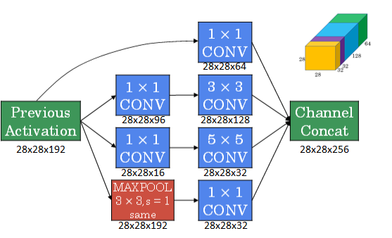
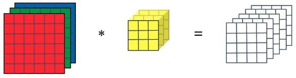
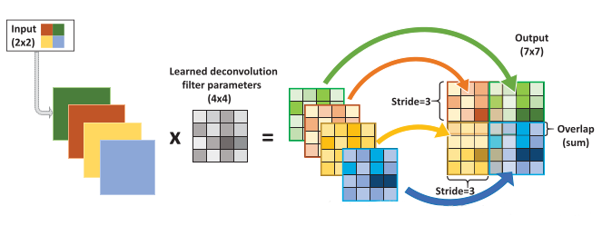
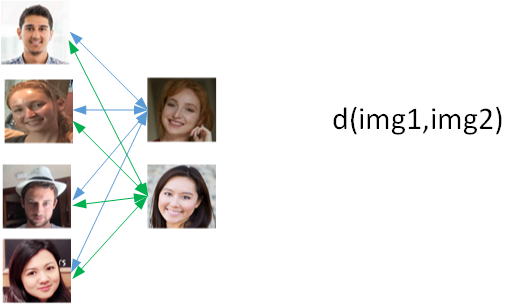
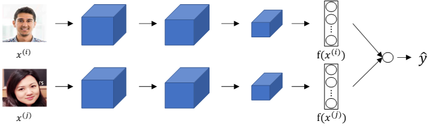
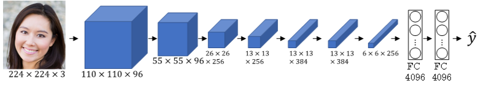

# 深度学习工程师

由 deeplearning.ai 出品，网易引进的正版授权中文版深度学习工程师微专业课程，让你在了解丰富的人工智能应用案例的同时，学会在实践中搭建出最先进的神经网络模型，训练出属于你自己的 AI。

**CNN可视化**

https://poloclub.github.io/cnn-explainer/

deeplearning.ai

https://www.coursera.org/learn/neural-networks-deep-learning?action=enroll

https://study.163.com/my#/smarts

https://www.bilibili.com/video/av66646276

**note**

https://redstonewill.blog.csdn.net/article/details/79055467

http://www.ai-start.com/dl2017/

https://www.zhihu.com/column/DeepLearningNotebook

**课后作业**

https://blog.csdn.net/u013733326/article/details/79827273

https://www.heywhale.com/mw/project/5e20243e2823a10036b542da

## Question

- [ ] 改善深层神经网络-[4.7 CNN可视化解释](#4.7)，

## 卷积神经网络

### 第一周 卷积神经网络

#### 1.1 计算机视觉

首先，计算机视觉的高速发展标志着新型应用产生的可能，这是几年前，人们所不敢想象的。通过学习使用这些工具，你也许能够创造出新的产品和应用。

其次，即使到头来你未能在计算机视觉上有所建树，也可以将**所学的知识应用到其他算法和结构**。

一张 64x64x3 的图片，神经网络输入层的维度为12288。一张 1000x1000x3 的图片，神经网络输入层的维度将达到 3M，使得网络权重 W 非常庞大。这样会造成两个后果，

- 一是神经网络结构复杂，数据量相对不够，容易出现过拟合；
- 二是所需内存、计算量较大。

解决这一问题的方法就是使用卷积神经网络（CNN）。

---

#### 1.2 边缘检测示例

神经网络由浅层到深层，分别可以检测出图片的边缘特征 、局部特征（例如眼睛、鼻子等）、整体面部轮廓。

最常检测的图片边缘有两类：一是垂直边缘（vertical edges），二是水平边缘（horizontal edges）。

图片的边缘检测可以通过与相应**滤波器**进行卷积来实现。以垂直边缘检测为例，原始图片尺寸为6x6，滤波器filter尺寸为3x3，卷积后的图片尺寸为4x4，得到结果如下：

卷积过程动态示意图

---

#### 1.3 更多边缘检测内容

还有很多其他的滤波器（检测算子）

随着深度学习的发展，我们学习的其中一件事就是当你真正想去检测出复杂图像的边缘，你不一定要去使用那些研究者们所选择的这九个数字，但你可以从中获益匪浅。把这矩阵中的9个数字当成9个参数，并且在之后你可以学习使用**反向传播**算法，其目标就是去**理解这9个参数**。

将这9个数字当成参数的思想，已经成为计算机视觉中最为有效的思想之一。

---

#### 1.4 Padding

**本小节步长全部为1**

valid convolution : no padding

输入 * 卷积核 → 输出维度   （n, n） * （f, f） →  （n - f + 1, n - f + 1）

same convolution: padding   一搬填充为0

输入 * 卷积核 → 输出维度   （n + 2p, n + 2p） * （f, f） →  （n  + 2p - f + 1, n  + 2p - f + 1）

如果希望输出维度和原始输入维度一样，则计算得
$$
p = \frac{f-1}{2}
$$
这里也诠释了为什么卷积核一般为奇数尺寸。并且奇数有中心像素点，便于索引滤波器的位置。

odd number 奇数

even number 偶数

---

#### 1.5 卷积步长

给定 padding : p 、strider: s

则有输入 * 卷积核 → 输出维度   （n, n） * （f, f） →  （$\frac{n+2p-f}{s}+1$, $\frac{n+2p-f}{s}+1$）

如果商不为整，向下取整 `floor`，有一部分超出范围就不进行计算。

 

相关系数（cross-correlations）与卷积（convolutions）之间是有区别的。真正的卷积运算（数学/信号处理）会先将filter绕其中心旋转180度，然后再将旋转后的filter在原始图片上进行滑动计算。filter旋转如下所示：

而在深度学习领域，默认不需要反转，直接求积。严格意义来讲我们**平时使用的方法不叫卷积而叫互相关**。

之所以可以这么等效，是因为**滤波器算子一般是水平或垂直对称的**，180度旋转影响不大；而且最终滤波器算子需要通过CNN网络梯度下降算法计算得到，**旋转部分可以看作是包含在CNN模型算法**中。总的来说，忽略旋转运算可以大大提高CNN网络运算速度，而且不影响模型性能。

---

#### 1.6 三维卷积

对于3通道的RGB图片，其对应的滤波器算子同样也是3通道的。例如一个图片是6 x 6 x 3，分别表示图片的高度（height）、宽度（weight）和通道（channel）。

过程是将每个单通道（R，G，B）与对应的filter进行卷积运算求和，然后再将**3通道的和相加**，得到输出图片的一个像素值。

**不同通道的滤波算子可以不相同**。例如**R**通道filter实现**垂直**边缘检测，**G和B**通道**不进行**边缘检测，全部置零，或者将R，G，B三通道filter全部设置为水平边缘检测。

为了进行多个卷积运算，实现更多边缘检测，可以增加更多的滤波器组。例如设置第一个滤波器组实现垂直边缘检测，第二个滤波器组实现水平边缘检测。这样，不同滤波器组卷积得到不同的输出，个数由滤波器组决定。

则有输入 * 卷积核 → 输出维度   
$$
（n, n, n_c） * n_k（f, f, n_c） →  （\frac{n+2p-f}{s}+1, \frac{n+2p-f}{s}+1, n_k）
$$
$n$ 为图片尺寸大小，也可用 h 和 w 表示高和宽，例中为 6 ；

$f$ 为卷积核尺寸大小，例中为 3 ；

$n_c$ 为图片通道数目，例中为2；

$n_k$ 为滤波器组个数，例中为2；

padding : p 为填充数，例中为0，无填充；

strider: s 为步长，例中为1。则有：
$$
（6, 6, 3） * 2（3, 3, 3） →  （4, 4, 2）
$$

---

#### 1.7 单层卷积网络

相比之前的卷积过程，CNN 的单层结构多了激活函数 ReLU 和偏移量b。整个过程与标准的神经网络单层结构非常类似：
$$
Z^{[l]}=W^{[l]} A^{[l-1]}+b\\
A^{[l]}=g^{[l]}\left(Z^{[l]}\right)
$$
输出 = 非线性激活函数（线性函数+偏差），例中 W 为卷积核，A 为输入图像，b 为偏置，g为 `relu` 。相当于有两个个待学习的参数：**卷积核，偏差**

总结CNN单层结构的所有标记符号，设层数为 $l$。

**filter size:** $f^{[l]}$   				 滤波器尺寸

**padding:** $p^{[l]}$      				 填充

**stride:** $s^{[l]}$          				  步长

**number of filters:** $n_{c}^{[l]}$  	滤波器个数

**input:** $n_{H}^{[l-1]} \times n_{\omega}^{[l-1]} \times n_{c}^{[l-1]} $     输入维度，l-1层

**output:**  $n_{H}^{[l]} \times n_{\omega}^{[l]} \times n_{c}^{[l]}$             输出维度，l层

其中  
$$
\left.\begin{array}{l}
n_{H}^{[l]}=\left[\frac{n_{H}^{[l-1]}+2 p^{[l]}-f^{[l]}}{s^{[l]}}+1\right. \\
n_{W}^{[l]}=\left\lfloor\frac{n_{W}^{[l-1]}+2 p^{[l]}-f^{[l]}}{s^{[l]}}+1\right.
\end{array}\right]
$$

**filter:** $f^{[l]} \times f^{[l]} \times n_{c}^{[l-1] }$               			滤波器维度，最后一维与输入channel相同

**weights:** $f^{[l]} \times f^{[l]} \times n_{c}^{[l-1]} \times n_{c}^{[l]}$ 		  权重维度 = 滤波器维度 * 滤波器个数 

**bias:** $1 \times 1 \times 1 \times n_{c}^{[l]}$								偏置维度，只与滤波器个数有关

**activations:** $n_{H}^{[l]} \times n_{W}^{[l]} \times n_{c}^{[l]}$                  激活函数维度，与输出维度完全相同

如果**mini-batch**有m个样本，进行向量化运算，相应的输出维度为 $m \times n_{H}^{[l]} \times n_{\omega}^{[l]} \times n_{c}^{[l]}$

假设你有10个过滤器，神经网络的一层是3×3×3，那么，这一层有多少个参数呢？

我们来计算一下，每一层都是一个3×3×3的矩阵，因此每个过滤器有27个参数，也就是27个数。然后加上一个偏差，用参数表示，现在参数增加到28个现在我们有10个过滤器，加在一起是28×10，也就是280个参数。

---

#### 1.8 简单卷积网络示例

CNN模型各层结构如上图所示。需要注意的是，$a^{[3]}$ 的维度是 `7 x 7 x 40`，将 $a^{[3]}$ 排列成 1 列，维度为 `1960 x 1`，然后连接最后一级输出层。输出层可以是一个神经元，即二元分类（logistic）；也可以是多个神经元，即多元分类（softmax）。最后得到预测输出 $\hat y$ 。值得一提的是，随着CNN层数增加，$n_H^{[l]}$  和 $n_W^{[l]}$ 一般逐渐减小，而$n_c^{[l]}$ 一般逐渐增大。

CNN有三种类型的layer：

- Convolution层（CONV）
- Pooling层（POOL）
- Fully connected层（FC）

---

#### 1.9 池化层

缩减模型大小，提高计算速度，提高所提取特征的鲁棒性。

**最大池化**

这就像是应用了一个规模为2的过滤器，因为我们选用的是2×2区域，步幅是2，这些就是最大池化的超参数。

**数字大意味着可能探测到了某些特定的特征**，左上象限具有的特征可能是一个垂直边缘，一只眼睛。显然左上象限中存在这个特征，这个特征可能是一只猫眼探测器。必须承认，使用最大池化的主要原因是此方法在很多实验中效果都很好。计算卷积层输出大小的公式同样适用于最大池化，即 $\frac{n+2p-f}{s}+1$

**平均池化**

选取的不是每个过滤器的最大值，而是平均值。

目前来说，最大池化比平均池化更常用。但也有例外，就是深度很深的神经网络，可以用平均池化来分解规模为7×7×1000的网络的表示层，在整个空间内求平均值，得到1×1×1000。

**参数**

池化的超级参数包括过滤器大小 $f$ 和步幅 $s$ ,常用的参数值为 $f=2, s=2$，效果相当于高度和宽度缩减一半。很少用到超参数 padding。最常用的 padding 值是0，输入为$n_{H} \times n_{W} \times n_{c}$，输出为$ \lfloor\frac{n_{H}-f}{s}+1\rfloor \times\lfloor\frac{n_{\mathrm{w}}-f}{s}+ 1\rfloor \times n_{c}$。

输入与输出**通道数相同**，因为我们对每个通道都做了池化。需要注意的一点是，池化过程中**没有需要学习的参数**。执行反向传播时，反向传播没有参数适用于最大池化。这些设置过的超参数，可能是手动设置的，也可能是通过交叉验证设置的。

---

#### 1.10 卷积神经网络示例

计算网络层数，通常是带有权重和参数的才算一层，想池化层和激活层就不算单独的一层。

图中，`CON` 层后面紧接一个 `POOL` 层，`CONV1` 和 `POOL1` 构成第一层，`CONV2` 和 `POOL2` 构成第二层。特别注意的是 `FC3` 和 `FC4` 为全连接层 `FC`，它跟标准的神经网络结构一致。最后的输出层（softmax）由10个神经元构成。

随着神经网络深度的加深，**高度和宽度都会减小**，从 32×32 到 28×28，到 14×14，到 10×10，再到 5×5；**而通道数量会增加**，从 3 到 6 到 16 不断增加，然后得到一个全连接层。

接下来我们讲讲神经网络的**激活值形状**，**激活值大小**和**参数数量**。有几点要注意，第一，池化层没有参数；第二，**卷积层的参数相对较少**，第三，**全连接层参数较多**，其实许多参数都存在于神经网络的全连接层。观察可发现，**随着神经网络的加深，激活值size会逐渐变小，如果激活值size下降太快，也会影响神经网络性能**。

整个网络各层的尺寸和参数如下表格所示：

`CONV1` 参数$ = 6 \times （5\times5\times3+1）$

`CONV2` 参数$ = 16 \times （5\times5\times6+1）$

`FC2` 参数$ = （400\times120）+120$

`FC3` 参数$ = （120\times84）+84$

`softmax` 参数$ = （84\times10）+10$

上边的conv算法是每个通道滤波器做的事情不一样，如果每个通道滤波器一致，则参数量要除以通道数。

常规做法是，**尽量不要自己设置超参数**，而是**查看文献中别人采用了哪些超参数**，**选一个在别人任务中效果很好的架构**，那么它也有可能适用于你自己的应用程序。

----

#### 1.11 为什么使用卷积？

与全连接层相比，卷积层的两个主要优势在于

**参数共享**：一个特征检测器（例如垂直边缘检测）对图片A的某块区域有用，同时也可能作用在图片A的其它区域。即不用对图像不同区域使用不同的滤波器，所有区域只使用一个滤波器处理即可。（如果不参数共享，滤波器滑一次变一次，参数过多）

**稀疏连接**：因为滤波器算子尺寸限制，每一层的每个输出只与输入**部分区域**内有关。而且其它像素值都不会对输出产生任影响。

**平移不变性**：神经网络的卷积结构使得即使移动几个像素，这张图片依然具有非常相似的特征，应该属于同样的输出标记。

除此之外，由于 CNN 参数数目较小，所需的训练样本就相对较少，从而一定程度上不容易发生过拟合现象。而且，CNN比较擅长捕捉区域位置偏移。也就是说CNN进行物体检测时，不太受物体所处图片位置的影响，增加检测的准确性和系统的健壮性。

---

#### 1.12 interview yann-lecun

lenet

Conditional Random Field 条件随机场

给开源社区做贡献

-----

### 第二周 深度卷积网络：实例探究

#### 2.1 为什么要进行实例探究？

典型的CNN模型包括：

- **LeNet-5**-1998 LeCun
- **AlexNet**-2012年ImageNet竞赛冠军获得者Hinton和他的学生Alex Krizhevsky设计
- **VGG**-2014年ILSVRC竞赛的第二名，第一名是GoogLeNet。

除了这些性能良好的CNN模型之外，Residual Network（ResNet）的特点是可以构建很深很深的神经网络（目前最深的好像有152层）。Inception Neural Network。

---

#### 2.2 经典网络

**LeNet-5**

5 层，6W 个参数，平均池化，sigmoid 和 tanh 函数，直接输出类别

> Gradient-Based Learning Applied to Document Recognition

**AlexNet**

60M 个参数，最大池化，relu 函数，局部响应归一化层 Local Response Normalization，softmax 输出各类别概率

> ImageNet Classification with Deep Convolutional Neural Networks

**VGG-16**

16 层，138M 个参数，只用 3x3 same 卷积，最大池化，专注于构建卷积层的简单网络，简化了神经网络架构

随着网络的加深，**图像缩小的比例和通道数增加的比例是有规律的**。很吸引人。

> very deep convolutional networks for large-scale image recognition
>
> Visual Geometry Group Network - 视觉几何群网络

---

#### 2.3 残差网络

Residual Networks (ResNets)

非常深的网络会出现梯度消失和梯度爆炸问题

skip connection / short cut

> Deep Residual Learning for Image Recognition

**残差块**

上图中红色部分就是skip connection，直接建立 $a[l]$ 与 $a[l+2]$ 之间的隔层联系。相应的表达式如下：
$$
\begin{equation}
z^{[l+1]}=W^{[l+1]} a^{[l]}+b^{[l+1]}\\
a^{[l+1]}=g\left(z^{[l+1]}\right)\\
z^{[l+2]}=W^{[l+2]}a^{[l+1]}+b^{[l+2]}\\
a^{[l+2]}=g\left(z^{[l+2]}+a^{[l]}\right)
\end{equation}
$$

$a[l]$ 直接隔层与下一层的线性输出相连，与 $z[l+2]$ 共同通过激活函数（ReLU）输出$a[l+2]$。

由多个 Residual block 组成的神经网络就是 Residual Network。实验表明，这种模型结构对于训练非常深的神经网络，效果很好。Residual Network的结构如下图所示。

另外，为了便于区分，我们把非 Residual Networks 称为 Plain Network。与 Plain Network 相比，Residual Network 能够训练更深层的神经网络，有效避免发生发生梯度消失和梯度爆炸。从下面两张图的对比中可以看出，随着神经网络层数增加，Plain Network 实际性能会变差，training error 甚至会变大。然而，Residual Network 的训练效果却很好，training error 一直呈下降趋势。

---

#### 2.4 残差网络为什么有用？

网络在训练集上表现好，才能在验证集和测试集上表现好。

如上图所示，输入 $x$ 经过很多层神经网络后输出 $a^{[l]}$ ，$a^{[l]}$ 经过一个 Residual block 输出$a^{[l+2]}$。$a^{[l+2]}$ 的表达式为：

$$
\begin{equation}a^{[l+2]}=g\left(z^{[l+2]}+a^{[l]}\right)=g\left(W^{[l+2]} a^{[l+1]}+b^{[l+2]}+a^{[l]}\right)\end{equation}
$$
输入 $x$ 经过Big NN后，若 $W^{[l+2]}≈0$ ，$b^{[l+2]}≈0$，则有：
$$
\begin{equation}a^{[l+2]}=g\left(a^{[l]}\right)=\operatorname{ReL} U\left(a^{[l]}\right)=a^{[l]} \quad when \quad a^{[l]} \geq 0\end{equation}
$$
可以看出，即使发生了梯度消失，$W^{[l+2]}≈0$ ，$b^{[l+2]}≈0$，也能直接建立 $a^{[l+2]}$ 与 $a^{[l]}$ 的线性关系，且 $a^{[l+2]}=a^{[l]}$，这其实就是 Identity function。$a^{[l]}$ 直接连到 $a^{[l+2]}$，从效果来说，**相当于直接忽略了$a^{[l]}$之后的这两层神经层**。

这样，看似很深的神经网络，其实由于许多 Residual blocks 的存在，**弱化削减了某些神经层之间的联系**，实现**隔层线性传递**，而**不是一味追求非线性关系**，模型本身也就能“容忍”更深层的神经网络了。而且从性能上来说，这两层额外的 Residual blocks 也不会降低 Big NN的性能。当然，如果 Residual blocks **确实能训练得到非线性关系**，那么也**会忽略 short cut**，跟 Plain Network 起到同样的效果。

有一点需要注意的是，ResNet中使用了**same卷积**，使得$a^{[l]}$ 和 $a^{[l+2]}$ 的**维度相同**；但如果 Residual blocks 中 $a^{[l]}$ 和 $a^{[l+2]}$ 的**维度不同**，通常可以引入矩阵$W_s$，与 $a^{[l]}$ 相乘，使得 $W_s*a^{[l]}$ 的维度与 $a^{[l+2]}$ 一致。参数矩阵 $W_s$ 有来两种方法得到：一种是将 $W_s$ **作为学习参数**，通过模型训练得到；另一种是固定 $W_s$ 值（类似单位矩阵），不需要训练，$W_s$ 与 $a^{[l]}$ 的乘积仅仅使得 $a^{[l]}$ **截断或者补零**。这两种方法都可行。

**ResNet 结构**

上图为普通的网络，输入image，多个卷积层，最后输出一个Softmax。只需要添加 skip connection，就转换为 ResNet，如下图：

ResNets 同类型层之间，例如 CONV layers(实线)，大多使用 Same 类型，保持维度相同。如果是不同类型层之间的连接，例如 CONV layer 与 POOL layer 之间(虚线)，如果维度不同，则引入矩阵 $W_s$。

> $W^{[l+2]}$, $b^{[l+2]}$ 就相当于一个开关，只要让这两个参数 w 和 b 为 0，就可以达到增加网络深度却不影响网络性能的目的。而**是否把这两个参数置为 0 就要看反向传播**，网络最终能够知道到底要不要skip。
>
> 
>
> 何凯明说过其实 AlexNet 是解决太深导致梯度消失，因为随着层数的增加计算出的梯度  会慢慢变小，可以映射到激活值会慢慢变小，之后他就想加一个 skip connection就可以保证无论中间多少层，最终两端激活值大体上不改变。
>
> 
>
> 当网络不断加深时，就算是选用学习恒等函数的参数都很困难，所以很多层最后的表现不但没有更好，反而更糟。
>
> 
>
> 这保证了深度的增加不会给模型带来负面影响，**至少不会比 Plain Network 差**。**残差块很容易学习恒等映射**

---

#### 2.5 Network in network 以及 1×1 卷积

池化层可以压缩高度和宽度。1x1卷积可以压缩通道数。

1x1卷积，处理多通道的数据。即不同通道的数据加权求和，然后通过非线性函数。

对于单个 filter，1x1 的维度，意味着卷积操作等同于乘积操作。对于多个filters，1x1 Convolutions 的作用实际上**类似全连接层**的神经网络结构。效果等同于 Plain Network 中 $a^{[l]}$ 到 $a^{[l+1]}$ 的过程。

1x1 Convolutions 可以用来缩减输入图片的通道数目:

> Network in network, lin, 2013.

---

#### 2.6 Inception network motivation

创始，开端

构建卷积层时，你要决定过滤器的大小究竟是1×1，3×3 还是 5×5，或者要不要添加池化层。而Inception网络的作用就是**代替你来决定**，虽然网络架构因此变得更加复杂，但网络表现却非常好。**代替人工来确定**卷积层中的过滤器类型，或者确定是否需要创建卷积层或池化层。

Inception Network 在单层网络上可以使用多个**不同尺寸**的filters，进行**same convolutions**，把各filter下得到的输出**拼接**起来。除此之外，还可以将CONV layer与POOL layer**混合**，同时实现各种效果。但是要注意使用**same pool**。

Inception Network在提升性能的同时，会带来计算量大的问题。例如：

对于输出中的每个数字来说，都需要执行 `5×5×192` 次乘法运算，所以乘法运算的总次数为每个输出值所需要执行的乘法运算次数 `5×5×192` 乘以输出值个数 `28×28×32`，把这些数相乘结果等于 120 M。如果输出为 `28x28`，则使用一个 `5x5x192` 的卷积核，对原始输入做乘积计算即可，要做 `28x28` 次。

为此，我们可以引入1x1 Convolutions来减少其计算量，结构如下：

通常我们把该1x1 Convolution称为“瓶颈层”（bottleneck layer）。引入bottleneck layer之后，总共需要的计算量为：`1x1X192 x 28x28x16` 和 `5x5x16 x 28x28x32` 相加为12.4 M。多引入了1x1 Convolution层，总共的计算量减少了近90%。由此可见，1x1 Convolutions 还可以有效减少 CONV layer 的计算量。

那么仅仅大幅**缩小表示层规模**会不会**影响神经网络的性能**？事实证明，只要**合理构建瓶颈层**，你既可以显著缩小表示层规模，又不会降低网络性能，从而节省了计算。这就是**Inception**模块的主要思想。

> Going deeper with convolutions. Szegedy et al. 2014.

---

#### 2.7 Inception 网络

盗梦空间

引入1x1 Convolution 后的 **Inception module** 如下图所示：

**多个** Inception modules **组成** Inception Network，效果如下图所示：

**个别的module中间添加了最大池化层来修改高和宽的维度**，上述 Inception Network 除了由许多 Inception modules 组成之外，值得一提的是网络中间隐藏层也可以作为输出层Softmax，有利于防止发生过拟合。

---

#### 2.8 MobileNet

可以在低计算环境下能够构建和部署正常工作的新网络。

**正常卷积**

计算代价 =  滤波器参数   x   输出像素size   x   滤波器个数

   2160     =   3 x 3 x 3      x          4 x 4          x        5  

**深度可分离卷积** Depthwise-separable convolutions 

Depthwise convolution

​          $n_{out} \times n_{out}\times n_{c}$                             $3 \times 3\times n_{c}$                               $n_{out} \times n_{out} \times n_{c}$

输出的 channel 与输入 channel 和滤波器的 channel 一样，滤波器的每个 channel，对应输出的每个 channel，即**每个输入的 channel 只与滤波器的一个 channel 计算**。

计算代价 =  滤波器参数   x   输出像素size   x   滤波器个数

​     432     =        3 x 3       x          4 x 4          x        3  

Pointwise convolution

   $n_{out} \times n_{out}\times n_{c}$                          $n^{\prime} \times  1 \times 1\times n_{c}$                            $n_{out} \times n_{out} \times n^{\prime}$

$n^{\prime}$ 为滤波器的个数

计算代价 =  滤波器参数   x   输出像素size   x   滤波器个数

​     240     =    1 x 1 x 3     x          4 x 4          x        5  

深度可分离卷积与正常卷积的成本比率为：
$$
\frac{1}{n^{\prime}}+\frac{1}{f^2}
$$
$n^{\prime}$ 为滤波器的个数，一般很大为64，128，256，512等

$f$ 为卷积核的尺寸，一般为 3

上例子中结果为 $\frac{1}{n^{\prime}}+\frac{1}{f^2}=\frac{1}{5}+\frac{1}{9}=\frac{432+240}{2160}$

**常规卷积**

**深度可分离卷积**

- 逐通道卷积

**无法扩展** Feature map。而且这种运算对输入层的每个通道独立进行卷积运算，没有有效的利用**不同通道在相同空间位置**上的feature信息。

- 逐点卷积

将上一步的map在**深度方向上进行加权组合**，利用**不同通道在相同空间位置**上的feature信息，生成新的Feature map。

因此，在参数量相同的前提下，采用Separable Convolution的神经网络层数可以做的更深。

> MobileNets: Efficient Convolutional Neural Networks for Mobile Vision Applications. Howard et al. 2017.

---

#### 2.9 MobileNet 架构

13 个 mobile block（浅蓝色虚线块）

- 通过扩展操作 ，增加了 bottleneck中的表示形式，允许网络学习更丰富的功能。（**解决了v1中无法扩大通道的问题**） 
- 通过depthwise和projection可以把输出的尺寸减小，减少存储这些值所需的内存量，以便传递到下一个块。
- 残差连接

17 个 new mobile block（红色实线瓶颈块）

n x n x 3 → n x n x 18 → n x n x 18 → n x n x 3

expansion： 18个 1x1x3    一般为**原始通道的6倍**作为下一层的通道数

depthwise：18个 3x3x18   用padding保持原始尺寸大小

pointwise/projection：3个 1x1x18

如果做分类就最后池化层，全连接层，softmax 输出概率

> MobileNetV2: Inverted Residuals and Linear Bottlenecks. Sandler et al. 2019

刚好与resnet的block相反

---

#### 2.10 EfficientNet

MobileNet V1 和 V2 提供了一种实现神经网络的方法，在计算上更有效。但是有没有办法调整 MobileNet 或其他架构到特定的设备。也许正在针对不同品牌的手机，不同数量的计算资源，或不同的边缘设备实施计算机视觉算法。

如果有更多的计算资源，则希望神经网络大，以便获得更高的准确性；如果在计算上受到更多限制，也许想要一个运行速度更快的神经网络，以一点点准确性为代价。如何为特定设备**自动放大或缩小**神经网络？

EfficientNet，为您提供了一种方法。假设您有一个基准神经网络架构，输入的图像具有一定的分辨率 resolution，而您的新网络具有一定的深度 depth，并且各层具有一定的宽度 width。

三个变量

- 可以按比例放大或缩小图片，可以使用高分辨率图像。新的图像分辨率为 r。蓝色发光表示高分辨率的图像。

- 可以改变神经网络的深度 d，使该网络更深。

- 可以更改这些层的宽度 w，使层更宽。

问题是，给定特定的计算资源，r，d 和 w 之间的**最佳权衡**是什么，以获得**最佳性能**在您的计算资源之内？分辨率提高10％，深度增加50％，和宽度增加20％？

如果想针对特定设备调整神经网络架构，EfficientNet 可以解决这一问题。

使用MobileNet，已经学会了如何构建计算效率更高的层，而使用EfficientNet，还可以找到一种方法，可以扩大或缩小这些神经网络

> EfficientNet: Rethinking Model Scaling for Convolutional Neural Networks. Tan and Le, 2019.

---

#### 2.11 使用开源的实现方案

网络通常都需要很长的时间来训练，而或许有人已经使用多个**GPU**，通过庞大的数据集**预先训练**了这些网络，这样一来你就可以使用这些网络进行**迁移学习**

---

#### 2.12 迁移学习

你可以下载花费了别人好几周甚至几个月而做出来的开源的**权重参数**，把它当作一个**很好的初始化**用在你自己的神经网络上。用迁移学习把公共的数据集的知识迁移到你自己的问题上

假如说你要建立一个猫咪检测器，用来检测你自己的宠物猫。假如你的两只猫叫 Tigger 和 Misty，还有一种情况是，两者都不是。所以你现在有一个**三分类问题**。现在你可能没有Tigger 或者 Misty 的大量的图片，所以你的**训练集会很小**，你该怎么办呢？

建议你从网上下载一些神经网络开源的实现，把权重下载下来。有许多训练好的网络，你都可以下载。举个例子，**ImageNet**数据集，它有1000个不同的类别，因此这个网络会有一个**Softmax**单元，它可以输出1000个可能类别之一。

你可以去掉这个Softmax层，创建你**自己的**Softmax单元，用来输出 Tigger、Misty 和neither 三个类别。建议把**所有的层看作是冻结的**，**冻结**网络中所有层的**参数**，**只需要训练和你的Softmax层有关的参数**。这个**Softmax**层有三种可能的输出，Tigger**、**Misty或者都不是。

大多数深度学习框架也许会有`trainableParameter=0` 这样的参数，对于这些前面的层，你可能会设置这个参数。有时也会有`freeze=1` 这样的参数。在这个例子中，你**只需要训练softmax层的权重，把前面这些层的权重都冻结**。

另一个技巧，由于前面的层都冻结了，相当于一个**固定的函数**。取输入图像，然后把它映射到这层（**softmax**的前一层）的激活函数。所以这个能加速训练的技巧就是，如果我们先计算这一层，计算特征或者激活值，然后把它们存到硬盘里。对你的计算有用的一步就是对你的训练集中所有样本的这一层的激活值进行**预计算**，然后存储到硬盘里，然后在此之上训练**softmax**分类器。

因此如果你的任务只有一个很小的数据集，你可以这样做。要有一个**更大的训练集**怎么办呢？也许你有大量的 Tigger 和 Misty 的照片，还有两者都不是的，这种情况，你应该**冻结更少的层**。取后面几层的权重，用作**初始化**，然后从这里开始梯度下降。或者你可以**直接去掉**这几层，换成你自己的隐藏单元和你自己的**softmax**输出层但是有一个规律，

如果你有越来越多的数据，你需要冻结的层数越少，你能够训练的层数就越多。

最后，如果你有大量数据，你应该做的就是用开源的网络和它的权重，把所有的权重当作**初始化**，然后**训练整个网络**。再次注意，如果这是一个1000节点的**softmax**，而你只有三个输出，你需要你自己的**softmax**输出层来输出你要的标签。

如果你有越多的标定的数据，或者越多的**Tigger**、**Misty**或者两者都不是的图片，你可以训练**更多的层**。极端情况下，你可以用下载的权重只作为初始化，用它们来代替随机初始化，接着你可以用梯度下降训练，更新网络所有层的所有权重。

这就是卷积网络训练中的迁移学习，事实上，网上的公开数据集非常庞大，并且你下载的其他人已经训练好几周的权重，已经从数据中学习了很多了，你会发现，**对于很多计算机视觉的应用，如果你下载其他人的开源的权重，并用作你问题的初始化，你会做的更好**。总之，迁移学习是非常值得你考虑的，除非你有一个极其大的数据集和非常大的计算量预算来从头训练你的网络。

---

#### 2.13 数据增强

提高性能

无论是使用迁移学习用别人的预训练模型开始，或者从源代码开始训练模型，数据扩充会有帮助。

常用的Data Augmentation方法是对已有的样本集进行Mirroring和Random Cropping。垂直镜像对称，随机裁剪。

旋转，剪切（**shearing**：此处并非裁剪的含义，图像仅水平或垂直坐标发生变化）图像，扭曲变形等等。这些方法并没有坏处，太复杂所以使用很少。

另一种Data Augmentation的方法是color shifting。color shifting就是对图片的RGB通道数值进行随意增加或者减少，改变图片**色调**。对**R**、**G** 和 **B** 的值是根据某种概率分布来决定的

针对性地对图片的RGB通道进行PCA color augmentation，也就是对图片颜色进行主成分分析，**对主要的通道颜色进行增加或减少**，可以采用**高斯扰动**。这样也能增加有效的样本数量。可以查阅AlexNet的相关论文。**算法对照片的颜色更改更具鲁棒性。**

---

#### 2.14 计算机视觉现状

**Benchmark** 基准测试，**Benchmark**是一个评价方式，在整个计算机领域有着长期的应用。Benchmark在计算机领域应用最成功的就是性能测试，主要测试负载的执行时间、传输速度、吞吐量、资源占用率等。

> Wiki ：“As computer architecture advanced, it became more difficult to compare the performance of various computer systems simply by looking at their specifications.Therefore, tests were developed that allowed comparison of different architectures.”

- 集成

  可以独立训练几个神经网络，并平均它们的输出。比如说随机初始化三个、五个或者七个神经网络，然后训练所有这些网络，然后平均它们的输出。

- **Multi-crop at test time**

  将数据扩充应用到你的测试图像。**10-crop**

  

- 灵活使用开源代码：

  Use **archittectures of networks** published in the literature

  Use open source **implementations** if possible

  Use **pretrained models** and **fine-tune** on your dataset

  

---

### 第三周 目标检测

#### 3.1 目标定位

boudingbox 参数表示bx, by, bh, bw

输出的label可表示为：
$$
\left [  
\begin{matrix}
Pc \\
bx \\
by \\
bh \\
bw \\
c1 \\
c2 \\
c3
\end{matrix}  
\right ]
$$
Pc=1，表示有目标，即 $y_1=1$：
$$
L(\hat y,y)=(\hat y_1-y_1)^2+(\hat y_2-y_2)^2+\cdots+(\hat y_8-y_8)^2
$$
Pc=0，表示无目标，其余7个参数没有意义，即 $y_1=0$：
$$
L(\hat y,y)=(\hat y_1-y_1)^2
$$
当然，除了使用平方误差之外，还可以逻辑回归损失函数，类标签 $c_1,c_2,c_3$ 也可以通过softmax输出。平方误差已经能够取得比较好的效果。

---

#### 3.2 特征点检测

landmark

人脸识别/骨架提取/姿态提取。输出特征点坐标。**训练集标签里也要有特征点的准确位置**。

---

#### 3.3 目标检测

滑动窗口法。首先在训练样本集上搜集相应的各种目标图片和非目标图片。注意**训练集图片尺寸较小，尽量仅包含相应目标**，如下图所示：

然后，使用这些训练集构建CNN模型，使得模型有较高的识别率。

最后，在测试图片上，选择**大小适宜的窗口**、**合适的步进长度**，进行从左到右、从上倒下的滑动。每个窗口区域都送入之前构建好的 CNN 模型进行识别判断。若判断有目标，则此窗口即为目标区域；若判断没有目标，则此窗口为非目标区域。

滑动窗口：窗口大，精度低，计算成本低；窗口小，精度高，计算成本高。

---

#### 3.4 卷积的滑动窗口实现

Convolutional implementation of sliding windows

滑动窗算法可以使用卷积方式实现，以提高运行速度，节约重复运算成本。滑动窗口算法卷积实现的第一步就是**将全连接层转变成为卷积层**，如下图所示：

全连接层转变成卷积层的操作很简单，只需要使用与上层尺寸一致的滤波算子进行卷积运算即可。最终得到的输出层维度是1 x 1 x 4，代表4类输出值。

单个窗口区域卷积网络结构建立完毕之后，对于待检测图片，即可使用该网络参数和结构进行运算。例如16 x 16 x 3的图片，**步进长度为2**（因为用到了一次 2*2 的 max pool，所以滑动窗口的步长也是 2），CNN网络得到的输出层为2 x 2 x 4。其中，2 x 2表示共有4个窗口结果。对于更复杂的28 x 28 x3的图片，CNN网络得到的输出层为8 x 8 x 4，共64个窗口结果。

滑动窗算法需要反复进行CNN正向计算，例如16 x 16 x 3的图片需进行4次，28 x 28 x3的图片需进行64次。而利用卷积操作代替滑动窗算法，则不管原始图片有多大，只需要进行一次CNN正向计算，因为其中**共享了很多重复计算部分**，这大大节约了运算成本。**窗口步进长度与选择的MAX POOL大小有关**。如果需要步进长度为4，只需设置MAX POOL为4 x 4即可。

> OverFeat: Integrated recognition, localization and detection using convolutional networks. Sermanet et al, 2014.

---

#### 3.5 Bounding Box 预测

相当于小节 3.5 = 3.1+ 3.4

上一小节，提高了速度，但是不能输出最精准的bounding box。YOLO（You Only Look Once）算法可以解决这类问题，生成更加准确的目标区域（如上图红色窗口）。

YOLO算法首先将原始图片分割成n x n网格，每个网格代表一块区域。为简化说明，下图中将图片分成3 x 3网格。

然后，利用上一节卷积形式实现滑动窗口算法的思想，对该原始图片构建CNN网络，得到的输出层维度为 3 x 3 x 8。其中，3 x 3 对应9个网格，每个网格的输出包含8个元素：
$$
y=\left [
\begin{matrix}
Pc \\
bx \\
by \\
bh \\
bw \\
c1 \\
c2 \\
c3
\end{matrix}
\right ]
$$
如果目标中心坐标 $(b_x,b_y)$ 不在当前网格内，则当前网格 $P_c=0$；相反，则当前网格 $P_c=1$（即只看中心坐标是否在当前网格内）。判断有目标的网格中，$b_x,b_y,b_h,b_w$ 限定了目标区域。值得注意的是，当前网格左上角坐标设定为 $(0, 0)$，右下角坐标设定为 $(1, 1)$，$(b_x,b_y)$ 范围限定在 $[0,1]$ 之间，但是 $b_h,b_w$ 可以大于1。因为目标可能超出该网格，横跨多个区域。目标占几个网格没有关系，目标中心坐标必然在一个网格之内。

划分的网格可以更密一些。网格越小，则多个目标的中心坐标被划分到一个网格内的概率就越小，这恰恰是我们希望看到的。

> You Only Look Once: Unified real-time object detection. Redmon et al, 2015.

---

#### 3.6 交并比

**Intersection over union**

判断目标检测算法性能IoU，计算两个边界框合并集之比，一般大于0.5 即可通过。

IOU衡量了两个边界框重叠的相对大小，判断两个边界框是否相似。

如上图所示，红色方框为真实目标区域，蓝色方框为检测目标区域。两块区域的交集为绿色部分，并集为紫色部分。蓝色方框与红色方框的接近程度可以用 IoU 比值来定义：
$$
IoU = \frac{I}{U}
$$
IoU 可以表示任意两块区域的接近程度。IoU 值介于 0～1 之间，且越接近 1 表示两块区域越接近。

---

#### 3.7 非极大值抑制

Non-max suppression：解决一个物体，多次被检测。输出概率最大的结果。 

YOLO算法中，可能会出现多个网格都检测出到同一目标的情况，例如几个相邻网格都判断出同一目标的中心坐标在其内。

上图中，三个绿色网格和三个红色网格分别检测的都是同一目标。那如何判断哪个网格最为准确呢？方法是使用非最大值抑制算法。

图示中每个网格的 $P_c$ 值可以求出，$P_c$ 值反映了该网格包含目标中心坐标的可信度。首先选取  $P_c$  最大值对应的网格和区域，然后计算该区域与所有其它区域的IoU，剔除掉IoU大于阈值（例如0.5）的所有网格及区域。这样就能保证同一目标只有一个网格与之对应，且该网格Pc最大，最可信。接着，再从剩下的网格中选取 $P_c$ 最大的网格，重复上一步的操作。最后，就能使得每个目标都仅由一个网格和区域对应。如下图所示：

总结一下非最大值抑制算法的流程：

- **1. 剔除Pc值小于某阈值（例如0.6）的所有网格；**
- **2. 选取Pc值最大的网格，利用网格中的bounding box信息计算IoU，摒弃与该网格交叠较大的网格；**
- **3. 对剩下的网格，重复步骤2。**

删掉其余框有两个条件：Pc较低并且IoU相对高

上边的例子Pc是概率表示仅表示目标是车的概率，如果尝试同时检测三个对象，比如说行人、汽车、摩托，那么输出向量就会有三个额外的分量。事实证明，正确的做法是独立进行三次非极大值抑制，对每个输出类别都做一次

---

#### 3.8 Anchor Boxes

每个格子只能检测出一个目标。对于多个目标重叠的情况，应使用不同形状的Anchor Boxes。

如下图所示，同一网格出现了两个目标：人和车。为了同时检测两个目标，我们可以设置两个Anchor Boxes，Anchor box 1检测人，Anchor box 2检测车。也就是说，每个网格多加了一层输出。原来的输出维度是 3 x 3 x 8，现在是3 x 3 x 2 x 8（也可以写成3 x 3 x 16的形式）。这里的2表示有两个Anchor Boxes，用来在一个网格中同时检测多个目标。每个Anchor box都有一个Pc值，若两个Pc值均大于某阈值，则检测到了两个目标。

现在**每个对象都和之前一样分配到同一个格子中**，即对象中心所在的格子。同时也需要**分配到和目标形状 IoU 最高的 Anchor Box**。例如有两个 Anchor Box 而单元格中只剩一个对象，则选取IoU高的，另一个的输出 $P_c$ 则为0。与第一个box的IoU高，则把信息填在向量前半部分：
$$
y=\left [
\begin{matrix}
P_c \quad
b_x \quad
b_y \quad
b_h \quad
b_w \quad
c_1 \quad
c_2 \quad
c_3 \quad
P_c \quad
b_x \quad
b_y \quad
b_h \quad
b_w \quad
c_1 \quad
c_2 \quad
c_3
\end{matrix}
\right ]^T
$$
使用YOLO算法时，只需对每个Anchor box使用上一节的非最大值抑制即可。Anchor Boxes之间并行实现。

目前anchor box的选择主要有三种方式：

- 人为经验选取
- k-means聚类
- 作为超参数进行学习

**为什么不直接将bounding box参数加入loss进行训练？**

首先注意 yolo v1 就是这样做的，即 anchor-free，直接预测具体的boundng box参数。至于yolo v2/v3使用anchor-box的原因如下：

- 误差对大的box和小的box有一样的权重，但是对于大的box和小的box是不能按一样的速度进行更新的，较小的误差对于大的box就没有对小的box那么重要。

- **降低学习难度。**anchor给出了目标宽高的初始值，需要回归的是目标真实**宽高**与初始宽高的**偏移量**，而不使用anchor的做法需要回归宽高的**绝对量**。

---

#### 3.9 YOLO 算法

输入图片，通过网络预测，得到一个张量。得到所有 $p_c$ 不为 0 的bounding box。如下图：

通过非极大值抑制。

- **1. 剔除Pc值小于某阈值（例如0.6）的所有网格；**（下图左→下图中）
- **2. 选取Pc值最大的网格，利用网格中的bounding box信息计算IoU，摒弃与该网格交叠较大的网格；**（下图中→下图右，就是把概率最大的邻居bounding box删除掉）
- **3. 对剩下的网格，重复步骤2。**

---

#### 3.10 R-CNN

之前的算法在显然没有任何目标的区域仍进行计算。因此提出 Region proposals 候选区域。具体做法是先对原始图片进行**分割**算法处理，然后对分割后的图片中的块进行目标检测。

R-CNN（Regions with Convolutional Neural Network Features）。Region Proposals 共有三种方法：

- R-CNN:  求候选区域，然后运行分类网络。输入区域-输出标签和bounding box（anchor-free）。
- Fast R-CNN: 利用卷积实现滑动窗算法，类似3.4小节。
- Faster R-CNN: 利用**卷积**对图片进行**分割**（segmentation）RPN，进一步提高运行速度。

比较而言，Faster R-CNN的运行速度还是比YOLO慢一些。首先得到候选区域，然后再分类。

候选区域/框 + 深度学习分类：通过提取候选区域，并对相应区域进行以深度学习方法为主的分类的方案：

R-CNN（Selective Search + CNN + SVM）

Fast R-CNN（Selective Search + CNN + ROI）

Faster R-CNN（RPN + CNN + ROI）

基于深度学习的回归方法：YOLO/SSD/DenseBox 等方法

> Selective Search > 根据颜色，边缘，纹理找可能存在的目标候选框。
>
> ROI Pooling > 将proposal抠出来的过程，然后resize到统一的大小。
>
> RPN > Region Proposal Network
>
> SPPNet > 空间金字塔池化实现任意大小图像输入。

> Rich feature hierarchies for accurate object detection and semantic segmentation. Girshik et al, 2013.
>
> Spatial Pyramid Pooling in Deep Convolutional Networks for Visual Recognition. Kaiming He.

---

#### 3.11 语义分割U-Net

语义分割，目的是绘制在检测到的物体周围绘制详细的轮廓，以便您确切地知道哪个像素属于目标，哪些像素不属于目标。

什么是语义分割？

如果您想让学习算法找出这张图片中的每个像素是什么，那么您可以使用语义分割算法其目标是输出最右图。

通过语义分割，算法尝试标记道路的每个像素，都以深绿色表示。自动驾驶团队使用它来准确找出哪些像素可以安全行驶。

让我们看看其他一些应用程序。在左图的胸部 X 光检查图像中，使用不同的颜色分割出肺部，心脏和锁骨。右图脑MRI扫描自动分割出肿瘤。

为了简单起见，让我们使用以下示例从某些背景中细分出一辆汽车。在此图像中 1 代表汽车，2 代表建筑物，3 代表道路。

传统分类问题

转变为语义分割问题

语义分割的一个关键步骤是将**越来越小**的图像尺寸**逐渐放大**回完整的输入图像尺寸。

随着深度增加，变小的 size 将变大，而增大的通道数将减少，最终得到了猫的分割图。

---

#### 3.12 转置卷积

transpose convolution

从信息论的角度看，卷积是**不可逆的**。所以这里说的并不是从 output 矩阵和 kernel 矩阵计算出原始的 input 矩阵。而是计算出一个**保持了位置性关系**的矩阵。

重叠的部分相加。转置卷积，它所进行的操作本质上就是先对输入进行 padding，然后再进行卷积得到输出。

input 为 2x2，filter 为 3x3，result 为 5x5。padding = 1，stride = 2

转换为矩阵的形式是由卷积的结果得到的，矩阵形式本身是不能直接获得的。要注意这个因果关系，转换为矩阵形式是为了便于理解，以及推导转置卷积。

kernel_size = 2, stride = 1, padding = 0

kernel_size = 2, stride = 1, padding = 1

与上一张图的主要不同之处在于转置卷积将卷积结果的最外层去掉，这是因为padding=1，也正符合与卷积相反的操作。也就是说，padding越大，转置卷积就会去掉越多的外层，输出就会越小。

kernel_size = 3, stride = 1, padding = 1

kernel_size = 2, stride = 2, padding = 1

> 直接理解转置卷积（Transposed convolution）的各种情况 https://www.cnblogs.com/qizhou/p/13895967.html

---

#### 3.13 U-Net架构直觉

正卷积用于网络的前半部分，对图像进行压缩。图片尺寸变小，深度很大，丢失了很多空间信息。后半部分使用转置卷积放大到原始输入图像的 size（低分辨率和高水平的特征信息）。因此通过skip-connection使神经网络获取（高分辨率和低水平的特征信息)

---

#### 3.14 U-Net架构

输入为 h x w x 3，conv 增加 channel，maxpool 减小size。trans conv 增加 size，减少 channel （浅蓝色为转置卷积输出）。注意每次转置卷积后，与 skip-connection 拼接后**要过几次正向卷积**。输出为 h x w x nc（nc为分类数目）。采用argmax，将每个像素分类为其中一个类别。

**损失函数**用了 pixel-wise softmax，就是每个像素对应的输出单独做 softmax，也就是做了 h * w 个 softmax。其中，x 可以看作是某一个像素点， $l(x)$ 表示 x 这个点对应的类别 label，$p_k(x)$ 表示在 x 这个点的输出在类别 k 的 softmax 的值，$p_{l(x)}(x)$ 代表点 x 在对应的 label 给出的那个类别的输出的值。

> Ｕ-Net: Convolutional Networks for Biomedical Image Segmentation. Ronneberger et al, 2015.

---

### 第四周 特殊应用：人脸识别和神经风格转换

#### 4.1 什么是人脸识别？

介绍一下人脸验证（face verification）和人脸识别（face recognition）的区别。

- 人脸验证：输入一张人脸图片，验证输出与模板是否为同一人，即一对一问题。
- 人脸识别：输入一张人脸图片，验证输出是否为 K 个模板中的某一个，即一对多问题。

一般地，人脸识别比人脸验证更难一些。因为假设人脸验证系统的错误率是1%，那么在人脸识别中，输出分别与K 个模板都进行比较，则相应的错误率就会增加，约 K %。模板个数越多，错误率越大一些。

---

#### 4.2 One-Shot 学习

One-shot learning 就是说数据库中每个人的训练样本只包含一张照片，然后训练一个 CNN 模型来进行人脸识别。若数据库有 K 个人，则CNN模型输出 softmax 层就是 K 维的。但是 One-shot learning 的性能并不好，其包含了两个缺点：

每个人只有一张图片，训练样本少，构建的 CNN 网络不够健壮。

若数据库增加另一个人，输出层 softmax 的维度就要发生变化，相当于要重新构建 CNN 网络，使模型计算量大大增加，不够灵活。

为了解决 One-shot learning 的问题，我们先来介绍相似函数（similarity function）。相似函数表示两张图片的相似程度，用 $d(img1,img2)$ 来表示。若 $d(img1,img2)$ 较小，则表示两张图片相似；若 $d(img1,img2)$ 较大，则表示两张图片不是同一个人。相似函数可以在人脸验证中使用：

- $d(img1,img2)\leq \tau$ : 一样
- $d(img1,img2)> \tau$ : 不一样

对于人脸识别问题，则只需计算测试图片与数据库中 K 个目标的相似函数，取其中  $d(img1,img2)$  最小的目标为匹配对象。若所有的  $d(img1,img2)$  都很大，则表示数据库没有这个人。

---

#### 4.3 Siamese 网络

若一张图片经过一般的 CNN 网络（包括 CONV 层、POOL 层、FC 层），最终得到全连接层 FC，该 FC 层可以看成是原始图片的编码 encoding，表征了原始图片的关键特征。这个网络结构我们称之为 Siamese network。也就是说每张图片经过 Siamese network 后，由 FC 层每个神经元来表征。

建立Siamese network后，两张图片 $x^{(1)}$ 和 $x^{(2)}$ 的相似度函数可由各自FC层 $f(x^{(1)})$ 与 $f(x^{(2)})$ 之差的范数来表示：

$$
d(x^{(1)},x^{(2)})=||f(x^{(1)})-f(x^{(2)})||^2
$$
值得一提的是，不同图片的 CNN 网络所有结构和参数都是一样的。我们的目标就是利用梯度下降算法，不断调整网络参数，使得属于同一人的图片之间 $d(x^{(1)},x^{(2)})$ 很小，而不同人的图片之间 $d(x^{(1)},x^{(2)})$ 很大。

若 $x^{(i)},x^{(j)}$ 是同一个人，则 $||f(x^{(i)})-f(x^{(j)})||^2$ 较小

若 $x^{(i)},x^{(j)}$ 不是同一个人，则 $||f(x^{(i)})-f(x^{(j)})||^2$ 较大

> DeepFace closing the gap to human level performance. Taigman et al, 2014.

---

#### 4.4 Triplet 损失

margin  软间隔

Triplet Loss 需要每个样本包含三张图片：靶目标（Anchor）、正例（Positive）、反例（Negative），这就是triplet 名称的由来。顾名思义，靶目标和正例是同一人，靶目标和反例不是同一人。Anchor 和 Positive 组成一类样本，Anchor 和 Negative 组成另外一类样本。

我们希望上一小节构建的CNN网络输出编码 $f(A)$ 接近  $f(P)$ ，即 $||f(A)-f(P)||^2$ 尽可能小，而 $||f(A)-f(N)||^2$ 尽可能大，数学上满足：
$$
||f(A)-f(P)||^2\leq ||f(A)-F(N)||^2\\
||f(A)-f(P)||^2-||f(A)-F(N)||^2\leq 0
$$
根据上面的不等式，如果所有的图片都是零向量，即 $f(A)=0,f(P)=0,f(N)=0$，那么上述不等式也满足。但是这对我们进行人脸识别没有任何作用，是不希望看到的。我们希望得到 $||f(A)-f(P)||^2$ 远小于$||f(A)-f(N)||^2$ 。所以，我们添加一个超参数 $α$，且 $α>0$，对上述不等式做出如下修改：
$$
||f(A)-f(P)||^2-||f(A)-F(N)||^2\leq -\alpha\\
||f(A)-f(P)||^2-||f(A)-F(N)||^2+\alpha \leq 0
$$
这里的 $α$ 也被称为边界 margin，类似与支持向量机中的 margin。接下来，我们根据A，P，N三张图片，就可以定义Loss function为：
$$
L(A,P,N)=max(||f(A)-f(P)||^2-||f(A)-F(N)||^2+\alpha,\ 0)
$$
相应地，对于m组训练样本，cost function为：
$$
J=\sum_{i=1}^mL(A^{(i)},P^{(i)},N^{(i)})
$$
关于训练样本，必须保证同一人包含多张照片，否则无法使用这种方法。例如 10k 张照片包含 1k 个不同的人脸，则平均一个人包含 10 张照片。这个训练样本是满足要求的。然后，就可以使用梯度下降算法，不断训练优化 CNN 网络参数，让 $J$ 不断减小接近0。

同一组训练样本，A，P，N 的选择尽可能不要使用随机选取方法。因为随机选择的 A 与 P 一般比较接近，A 与 N 相差也较大，毕竟是两个不同人脸。这样的话，也许模型不需要经过复杂训练就能实现这种明显识别，但是抓不住关键区别。所以，最好的做法是人为选择 **A 与 P 相差较大**（例如换发型，留胡须等），**A 与 N 相差较小**（例如发型一致，肤色一致等）。这种人为地**增加难度和混淆度**会让模型本身去寻找学习不同人脸之间关键的差异，“尽力”让 $d(A,P)$ 更小，让 $d(A,N)$ 更大，即**让模型性能更好**。

> FaceNet: A unified embedding for face recognition and clustering. Schroff et al, 2015.

---

#### 4.5 面部验证与二分类

除了构造 triplet loss 来解决人脸识别问题之外，还可以使用二分类结构。做法是将两个 siamese 网络组合在一起，将各自的编码层输出经过一个逻辑输出单元，该神经元使用 sigmoid 函数，输出 1 则表示识别为同一人，输出 0 则表示识别为不同人。结构如下：

每组训练样本包含两张图片，每个 siamese 网络结构和参数完全相同。这样就把人脸识别问题转化成了一个二分类问题。引入逻辑输出层参数 w 和 b，输出 $\hat{y}$ 表达式为：

$$
\hat y=\sigma(\sum_{k=1}^Kw_k|f(x^{(i)})_k-f(x^{(j)})_k|+b)
$$
其中参数 $w_k$ 和 $b$ 都是通过梯度下降算法迭代训练得到。$\hat{y}$ 的另外一种表达式为：
$$
\hat y=\sigma(\sum_{k=1}^Kw_k\frac{(f(x^{(i)})_k-f(x^{(j)})_k)^2}{f(x^{(i)})_k+f(x^{(j)})_k}+b)
$$
上式被称为 $χ$ 方公式，也叫 $χ$ 方相似度。

在训练好网络之后，进行人脸识别的常规方法是测试图片与模板分别进行网络计算，编码层输出比较，计算逻辑输出单元。

为了**减少计算量**，可以使用**预计算**的方式在训练时就将数据库每个模板的**编码层输出** $f(x)$ **保存**下来。因为编码层输出 $f(x)$ 比原始图片数据量少很多，所以无须保存模板图片，只要保存每个模板的 $f(x)$ 即可，节约存储空间。而且，测试过程中，无须计算模板的 siamese 网络，只要计算测试图片的 siamese 网络，得到的 $f(x^{(i)})$ 直接与存储的模板 $f(x^{(j)})$ 进行下一步的逻辑输出单元计算即可，计算时间减小了接近一半。这种方法也可以应用在上一节的 triplet loss 网络中。

---

#### 4.6 什么是神经风格转换？

它可以实现将一张图片的风格“迁移”到另外一张图片中，生成具有其特色的图片。

一般用 C 表示内容图片，S 表示风格图片，G 表示生成的图片。

---

#### 4.7 深度卷积网络在学什么？

典型的CNN网络如下所示：

首先来看第一层隐藏层，**遍历所有训练样本**，**针对每个卷据核**，都找出让该层**激活函数输出最大的9块图像区域**；得到9 x 9的图像如下所示，其中每个3 x 3区域表示一个运算单元。左上角红框是通过第一个隐藏单元，并激活后输出最大的 9 副图像。第一层一共 9 个隐藏单元，另外 8 个如下。

可以看出，第一层隐藏层一般检测的是原始图像的**边缘和颜色阴影**等简单信息。继续看CNN的更深隐藏层，随着层数的增加，捕捉的区域更大，特征更加复杂，从边缘到纹理再到具体物体。

层1展示了物体边缘、颜色等图像中底层的特征

层2展示了物体的边缘和轮廓，以及与颜色的组合；

层3拥有了更复杂的不变性，展示了相似的纹理，网格；花纹；

层4开始体现类与类之间的差异，其中不同组别的重构特征之间存在重大差异性；狗脸，鸟腿

层5展示了存在重大差异的一类物体；键盘，狗。

本文通过反卷积可视化

从右边卷积的过程开始，首先用卷积核 F 对上一层池化出来的 Pooled Maps 进行卷积，得到 Feature Maps，然后在逐步进行 Relu 归一化 (Rectified Linear) 和最大值池化（Max Pooling）。

而反卷积过程则是从反最大值池化开始（Max unpooling），逐步得到unpooled、rectified unpooled和reconstruction map。

**反卷积神经网络主要组成部分：**

- 反池化：

对于最大值池化来说，它是不可逆的过程，因此作者的技巧就是在池化的时**候记录下每个最大值的位置**。这样的话，在反池化的时候只要把池化过程中最大激活值所在的位置激活，**其它位置的值赋0**。

- 反激活：

对于 Relu 激活函数来，激活值均为非负值。因此对于反向过程，同样需要保证每层的特征值为非负值，因此Reluctant **反激活过程和激活过程相同**。

- 反卷积：

卷积网络就是网络利用学习到的卷积核对上一层的特征进行卷积得到本层的 feature map。而反卷积就是这个过程的逆过程，用本层的 feature map 与**转置后的卷积核**进行卷积，得到上一层的特征。就是转置卷积。

**可视化网络如何提升网络性能？**

作者可视化了原版 AlexNet 各特征层，发现了对于 AlexNet 来说，第一层（图b）的卷积核大部分是高频和低频的特征，而对中频段图像特征整提取得不好。同时，第二层特征的可视化的结果（图d）显示出了由于第一层卷积步长 4 太大导致的 “混叠伪影”(aliasing artifacts)。因此作者对 AlexNet 的改善包括：将第一层的卷积核从 11x11 减小为 7x7（图c)；将卷积步长减小为 2 (图e）。经过作者改善后的模型在第一层和第二层特征中保留了更多的信息，提高了分类性能。

> Visualizing and understanding convolutional networks. Zeiler and Fergus., 2013.

---

#### 4.8 代价函数

神经风格迁移生成图片 $G$ 的cost function由两部分组成：$C$ 与 $G$ 的相似程度和 $S$ 与 $G$ 的相似程度。

$$
J(G)=\alpha \cdot J_{content}(C,G)+\beta \cdot J_{style}(S,G)
$$
其中，$α, β$ 是超参数，用来调整 $J_{content}(C,G)$ 与 $J_{style}(S,G)$ 的相对比重。

神经风格迁移的基本算法流程是：

首先令 $G：100\times 100\times 3$ 为随机像素点，

然后使用梯度下降算法 $G = G - \frac{\part}{\part G}J(G)$，不断修正 $G$ 的所有像素点，使得 $J(G)$ 不断减小，从而使 $G$ 逐渐有 $C$ 的内容和 $G$ 的风格，如下图所示。

> A neural algorithm of artistic style. Gatys et al, 2015. 
>
> Image on slide generated by Justin Johnson.

---

#### 4.9 content 代价函数

我们先来看 $J(G)$ 的第一部分 $J_{content}(C,G)$，它表示内容图片 $C$ 与生成图片 $G$ 之间的相似度。
$$
J(G)=\alpha \cdot J_{content}(C,G)+\beta \cdot J_{style}(S,G)
$$
使用预训练好的的 CNN 网络（AlexNet，VGG等）。$C，S，G$ **共用相同模型和参数**。首先，需要选择合适的层数 $l$ 来计算 $J_{content}(C,G)$。根据小节 4.7 的内容，CNN 的每个隐藏层分别提取原始图片的不同深度特征，由简单到复杂。如果 $l$ 太小，则 $G$ 与 $C$ 在像素上会非常接近，没有迁移效果；如果 $l$ 太深，则 $G$ 上某个区域将直接会出现 $C$ 中的物体。因此，$l$ 既不能太浅也不能太深，一般选择网络中间层。

然后比较 $C$ 和 $G$ 在 $l$ 层的激活函数输出 $a^{[l](C)}$ 与 $a^{[l](G)}$。相应的 $J_{content}(C,G)$ 的表达式为(L2范数)：

$$
J_{content}(C,G)=\frac12||a^{[l](C)}-a^{[l](G)}||^2
$$
 $a^{[l](C)}$ 与 $a^{[l](G)}$越相似，则说明两个图片的内容相似，则 $J_{content}(C,G)$ 越小。

方法就是使用梯度下降算法，不断迭代修正 $G$ 的像素值，使 $J_{content}(C,G)$ 不断减小。

---

#### 4.10 style 损失函数

我们来看 $J(G)$ 的第二部分 $J_{style}(S,G)$，它表示内容图片 $S$ 与生成图片 $G$ 之间的相似度。
$$
J(G)=\alpha \cdot J_{content}(C,G)+\beta \cdot J_{style}(S,G)
$$

gram  矩阵

---

#### 4.11 一维到三维推广

----

