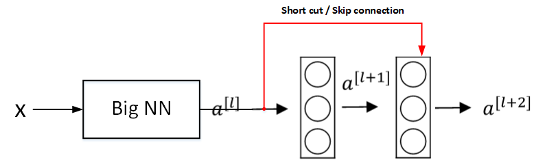
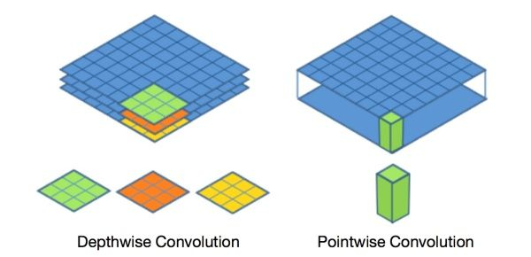

# 深度学习工程师

由 deeplearning.ai 出品，网易引进的正版授权中文版深度学习工程师微专业课程，让你在了解丰富的人工智能应用案例的同时，学会在实践中搭建出最先进的神经网络模型，训练出属于你自己的 AI。

**CNN可视化**

https://poloclub.github.io/cnn-explainer/

deeplearning.ai

https://www.coursera.org/learn/neural-networks-deep-learning?action=enroll

https://study.163.com/my#/smarts

https://www.bilibili.com/video/av66646276

**note**

https://redstonewill.blog.csdn.net/article/details/79028058

https://www.zhihu.com/column/DeepLearningNotebook

http://www.ai-start.com/dl2017/

**课后作业**

https://blog.csdn.net/u013733326/article/details/79827273

https://www.heywhale.com/mw/project/5e20243e2823a10036b542da

## Question

- [ ] 改善深层神经网络-[1.11 权重初始化](#winit)，

## 卷积神经网络

### 第一周 卷积神经网络

#### 1.1 计算机视觉

首先，计算机视觉的高速发展标志着新型应用产生的可能，这是几年前，人们所不敢想象的。通过学习使用这些工具，你也许能够创造出新的产品和应用。

其次，即使到头来你未能在计算机视觉上有所建树，也可以将**所学的知识应用到其他算法和结构**。

一张 64x64x3 的图片，神经网络输入层的维度为12288。一张 1000x1000x3 的图片，神经网络输入层的维度将达到 3M，使得网络权重 W 非常庞大。这样会造成两个后果，

- 一是神经网络结构复杂，数据量相对不够，容易出现过拟合；
- 二是所需内存、计算量较大。

解决这一问题的方法就是使用卷积神经网络（CNN）。

---

#### 1.2 边缘检测示例

神经网络由浅层到深层，分别可以检测出图片的边缘特征 、局部特征（例如眼睛、鼻子等）、整体面部轮廓。

最常检测的图片边缘有两类：一是垂直边缘（vertical edges），二是水平边缘（horizontal edges）。

图片的边缘检测可以通过与相应**滤波器**进行卷积来实现。以垂直边缘检测为例，原始图片尺寸为6x6，滤波器filter尺寸为3x3，卷积后的图片尺寸为4x4，得到结果如下：

卷积过程动态示意图

---

#### 1.3 更多边缘检测内容

还有很多其他的滤波器（检测算子）

随着深度学习的发展，我们学习的其中一件事就是当你真正想去检测出复杂图像的边缘，你不一定要去使用那些研究者们所选择的这九个数字，但你可以从中获益匪浅。把这矩阵中的9个数字当成9个参数，并且在之后你可以学习使用**反向传播**算法，其目标就是去**理解这9个参数**。

将这9个数字当成参数的思想，已经成为计算机视觉中最为有效的思想之一。

---

#### 1.4 Padding

**本小节步长全部为1**

valid convolution : no padding

输入 * 卷积核 → 输出维度   （n, n） * （f, f） →  （n - f + 1, n - f + 1）

same convolution: padding   一搬填充为0

输入 * 卷积核 → 输出维度   （n + 2p, n + 2p） * （f, f） →  （n  + 2p - f + 1, n  + 2p - f + 1）

如果希望输出维度和原始输入维度一样，则计算得
$$
p = \frac{f-1}{2}
$$
这里也诠释了为什么卷积核一般为奇数尺寸。并且奇数有中心像素点，便于索引滤波器的位置。

odd number 奇数

even number 偶数

---

#### 1.5 卷积步长

给定 padding : p 、strider: s

则有输入 * 卷积核 → 输出维度   （n, n） * （f, f） →  （$\frac{n+2p-f}{s}+1$, $\frac{n+2p-f}{s}+1$）

如果商不为整，向下取整 `floor`，有一部分超出范围就不进行计算。

 

相关系数（cross-correlations）与卷积（convolutions）之间是有区别的。真正的卷积运算（数学/信号处理）会先将filter绕其中心旋转180度，然后再将旋转后的filter在原始图片上进行滑动计算。filter旋转如下所示：

而在深度学习领域，默认不需要反转，直接求积。严格意义来讲我们**平时使用的方法不叫卷积而叫互相关**。

之所以可以这么等效，是因为**滤波器算子一般是水平或垂直对称的**，180度旋转影响不大；而且最终滤波器算子需要通过CNN网络梯度下降算法计算得到，**旋转部分可以看作是包含在CNN模型算法**中。总的来说，忽略旋转运算可以大大提高CNN网络运算速度，而且不影响模型性能。

---

#### 1.6 三维卷积

对于3通道的RGB图片，其对应的滤波器算子同样也是3通道的。例如一个图片是6 x 6 x 3，分别表示图片的高度（height）、宽度（weight）和通道（channel）。

过程是将每个单通道（R，G，B）与对应的filter进行卷积运算求和，然后再将**3通道的和相加**，得到输出图片的一个像素值。

**不同通道的滤波算子可以不相同**。例如**R**通道filter实现**垂直**边缘检测，**G和B**通道**不进行**边缘检测，全部置零，或者将R，G，B三通道filter全部设置为水平边缘检测。

为了进行多个卷积运算，实现更多边缘检测，可以增加更多的滤波器组。例如设置第一个滤波器组实现垂直边缘检测，第二个滤波器组实现水平边缘检测。这样，不同滤波器组卷积得到不同的输出，个数由滤波器组决定。

则有输入 * 卷积核 → 输出维度   
$$
（n, n, n_c） * n_k（f, f, n_c） →  （\frac{n+2p-f}{s}+1, \frac{n+2p-f}{s}+1, n_k）
$$
$n$ 为图片尺寸大小，也可用 h 和 w 表示高和宽，例中为 6 ；

$f$ 为卷积核尺寸大小，例中为 3 ；

$n_c$ 为图片通道数目，例中为2；

$n_k$ 为滤波器组个数，例中为2；

padding : p 为填充数，例中为0，无填充；

strider: s 为步长，例中为1。则有：
$$
（6, 6, 3） * 2（3, 3, 3） →  （4, 4, 2）
$$

---

#### 1.7 单层卷积网络

相比之前的卷积过程，CNN 的单层结构多了激活函数 ReLU 和偏移量b。整个过程与标准的神经网络单层结构非常类似：
$$
Z^{[l]}=W^{[l]} A^{[l-1]}+b\\
A^{[l]}=g^{[l]}\left(Z^{[l]}\right)
$$
输出 = 非线性激活函数（线性函数+偏差），例中 W 为卷积核，A 为输入图像，b 为偏置，g为 `relu` 。相当于有两个个待学习的参数：**卷积核，偏差**

总结CNN单层结构的所有标记符号，设层数为 $l$。

**filter size:** $f^{[l]}$   				 滤波器尺寸

**padding:** $p^{[l]}$      				 填充

**stride:** $s^{[l]}$          				  步长

**number of filters:** $n_{c}^{[l]}$  	滤波器个数

**input:** $n_{H}^{[l-1]} \times n_{\omega}^{[l-1]} \times n_{c}^{[l-1]} $     输入维度，l-1层

**output:**  $n_{H}^{[l]} \times n_{\omega}^{[l]} \times n_{c}^{[l]}$             输出维度，l层

其中  
$$
\left.\begin{array}{l}
n_{H}^{[l]}=\left[\frac{n_{H}^{[l-1]}+2 p^{[l]}-f^{[l]}}{s^{[l]}}+1\right. \\
n_{W}^{[l]}=\left\lfloor\frac{n_{W}^{[l-1]}+2 p^{[l]}-f^{[l]}}{s^{[l]}}+1\right.
\end{array}\right]
$$

**filter:** $f^{[l]} \times f^{[l]} \times n_{c}^{[l-1] }$               			滤波器维度，最后一维与输入channel相同

**weights:** $f^{[l]} \times f^{[l]} \times n_{c}^{[l-1]} \times n_{c}^{[l]}$ 		  权重维度 = 滤波器维度 * 滤波器个数 

**bias:** $1 \times 1 \times 1 \times n_{c}^{[l]}$								偏置维度，只与滤波器个数有关

**activations:** $n_{H}^{[l]} \times n_{W}^{[l]} \times n_{c}^{[l]}$                  激活函数维度，与输出维度完全相同

如果**mini-batch**有m个样本，进行向量化运算，相应的输出维度为 $m \times n_{H}^{[l]} \times n_{\omega}^{[l]} \times n_{c}^{[l]}$

假设你有10个过滤器，神经网络的一层是3×3×3，那么，这一层有多少个参数呢？

我们来计算一下，每一层都是一个3×3×3的矩阵，因此每个过滤器有27个参数，也就是27个数。然后加上一个偏差，用参数表示，现在参数增加到28个现在我们有10个过滤器，加在一起是28×10，也就是280个参数。

---

#### 1.8 简单卷积网络示例

CNN模型各层结构如上图所示。需要注意的是，$a^{[3]}$ 的维度是 `7 x 7 x 40`，将 $a^{[3]}$ 排列成 1 列，维度为 `1960 x 1`，然后连接最后一级输出层。输出层可以是一个神经元，即二元分类（logistic）；也可以是多个神经元，即多元分类（softmax）。最后得到预测输出 $\hat y$ 。值得一提的是，随着CNN层数增加，$n_H^{[l]}$  和 $n_W^{[l]}$ 一般逐渐减小，而$n_c^{[l]}$ 一般逐渐增大。

CNN有三种类型的layer：

- Convolution层（CONV）
- Pooling层（POOL）
- Fully connected层（FC）

---

#### 1.9 池化层

缩减模型大小，提高计算速度，提高所提取特征的鲁棒性。

**最大池化**

这就像是应用了一个规模为2的过滤器，因为我们选用的是2×2区域，步幅是2，这些就是最大池化的超参数。

**数字大意味着可能探测到了某些特定的特征**，左上象限具有的特征可能是一个垂直边缘，一只眼睛。显然左上象限中存在这个特征，这个特征可能是一只猫眼探测器。必须承认，使用最大池化的主要原因是此方法在很多实验中效果都很好。计算卷积层输出大小的公式同样适用于最大池化，即 $\frac{n+2p-f}{s}+1$

**平均池化**

选取的不是每个过滤器的最大值，而是平均值。

目前来说，最大池化比平均池化更常用。但也有例外，就是深度很深的神经网络，可以用平均池化来分解规模为7×7×1000的网络的表示层，在整个空间内求平均值，得到1×1×1000。

**参数**

池化的超级参数包括过滤器大小 $f$ 和步幅 $s$ ,常用的参数值为 $f=2, s=2$，效果相当于高度和宽度缩减一半。很少用到超参数 padding。最常用的 padding 值是0，输入为$n_{H} \times n_{W} \times n_{c}$，输出为$ \lfloor\frac{n_{H}-f}{s}+1\rfloor \times\lfloor\frac{n_{\mathrm{w}}-f}{s}+ 1\rfloor \times n_{c}$。

输入与输出**通道数相同**，因为我们对每个通道都做了池化。需要注意的一点是，池化过程中**没有需要学习的参数**。执行反向传播时，反向传播没有参数适用于最大池化。这些设置过的超参数，可能是手动设置的，也可能是通过交叉验证设置的。

---

#### 1.10 卷积神经网络示例

计算网络层数，通常是带有权重和参数的才算一层，想池化层和激活层就不算单独的一层。

图中，`CON` 层后面紧接一个 `POOL` 层，`CONV1` 和 `POOL1` 构成第一层，`CONV2` 和 `POOL2` 构成第二层。特别注意的是 `FC3` 和 `FC4` 为全连接层 `FC`，它跟标准的神经网络结构一致。最后的输出层（softmax）由10个神经元构成。

随着神经网络深度的加深，**高度和宽度都会减小**，从 32×32 到 28×28，到 14×14，到 10×10，再到 5×5；**而通道数量会增加**，从 3 到 6 到 16 不断增加，然后得到一个全连接层。

接下来我们讲讲神经网络的**激活值形状**，**激活值大小**和**参数数量**。有几点要注意，第一，池化层没有参数；第二，**卷积层的参数相对较少**，第三，**全连接层参数较多**，其实许多参数都存在于神经网络的全连接层。观察可发现，**随着神经网络的加深，激活值size会逐渐变小，如果激活值size下降太快，也会影响神经网络性能**。

整个网络各层的尺寸和参数如下表格所示：

`CONV1` 参数$ = 6 \times （5\times5\times3+1）$

`CONV2` 参数$ = 16 \times （5\times5\times6+1）$

`FC2` 参数$ = （400\times120）+120$

`FC3` 参数$ = （120\times84）+84$

`softmax` 参数$ = （84\times10）+10$

上边的conv算法是每个通道滤波器做的事情不一样，如果每个通道滤波器一致，则参数量要除以通道数。

常规做法是，**尽量不要自己设置超参数**，而是**查看文献中别人采用了哪些超参数**，**选一个在别人任务中效果很好的架构**，那么它也有可能适用于你自己的应用程序。

----

#### 1.11 为什么使用卷积？

与全连接层相比，卷积层的两个主要优势在于

**参数共享**：一个特征检测器（例如垂直边缘检测）对图片A的某块区域有用，同时也可能作用在图片A的其它区域。即不用对图像不同区域使用不同的滤波器，所有区域只使用一个滤波器处理即可。（如果不参数共享，滤波器滑一次变一次，参数过多）

**稀疏连接**：因为滤波器算子尺寸限制，每一层的每个输出只与输入**部分区域**内有关。而且其它像素值都不会对输出产生任影响。

**平移不变性**：神经网络的卷积结构使得即使移动几个像素，这张图片依然具有非常相似的特征，应该属于同样的输出标记。

除此之外，由于 CNN 参数数目较小，所需的训练样本就相对较少，从而一定程度上不容易发生过拟合现象。而且，CNN比较擅长捕捉区域位置偏移。也就是说CNN进行物体检测时，不太受物体所处图片位置的影响，增加检测的准确性和系统的健壮性。

---

#### 1.12 interview yann-lecun

lenet

Conditional Random Field 条件随机场

给开源社区做贡献

-----

### 第二周 深度卷积网络：实例探究

#### 2.1 为什么要进行实例探究？

典型的CNN模型包括：

- **LeNet-5**-1998 LeCun
- **AlexNet**-2012年ImageNet竞赛冠军获得者Hinton和他的学生Alex Krizhevsky设计
- **VGG**-2014年ILSVRC竞赛的第二名，第一名是GoogLeNet。

除了这些性能良好的CNN模型之外，Residual Network（ResNet）的特点是可以构建很深很深的神经网络（目前最深的好像有152层）。Inception Neural Network。

---

#### 2.2 经典网络

**LeNet-5**

5 层，6W 个参数，平均池化，sigmoid 和 tanh 函数，直接输出类别

> Gradient-Based Learning Applied to Document Recognition

**AlexNet**

60M 个参数，最大池化，relu 函数，局部响应归一化层 Local Response Normalization，softmax 输出各类别概率

> ImageNet Classification with Deep Convolutional Neural Networks

**VGG-16**

16 层，138M 个参数，只用 3x3 same 卷积，最大池化，专注于构建卷积层的简单网络，简化了神经网络架构

随着网络的加深，**图像缩小的比例和通道数增加的比例是有规律的**。很吸引人。

> very deep convolutional networks for large-scale image recognition
>
> Visual Geometry Group Network - 视觉几何群网络

---

#### 2.3 残差网络

Residual Networks (ResNets)

非常深的网络会出现梯度消失和梯度爆炸问题

skip connection / short cut

> Deep Residual Learning for Image Recognition

**残差块**

上图中红色部分就是skip connection，直接建立 $a[l]$ 与 $a[l+2]$ 之间的隔层联系。相应的表达式如下：
$$
\begin{equation}
z^{[l+1]}=W^{[l+1]} a^{[l]}+b^{[l+1]}\\
a^{[l+1]}=g\left(z^{[l+1]}\right)\\
z^{[l+2]}=W^{[l+2]}a^{[l+1]}+b^{[l+2]}\\
a^{[l+2]}=g\left(z^{[l+2]}+a^{[l]}\right)
\end{equation}
$$

$a[l]$ 直接隔层与下一层的线性输出相连，与 $z[l+2]$ 共同通过激活函数（ReLU）输出$a[l+2]$。

由多个 Residual block 组成的神经网络就是 Residual Network。实验表明，这种模型结构对于训练非常深的神经网络，效果很好。Residual Network的结构如下图所示。

另外，为了便于区分，我们把非 Residual Networks 称为 Plain Network。与 Plain Network 相比，Residual Network 能够训练更深层的神经网络，有效避免发生发生梯度消失和梯度爆炸。从下面两张图的对比中可以看出，随着神经网络层数增加，Plain Network 实际性能会变差，training error 甚至会变大。然而，Residual Network 的训练效果却很好，training error 一直呈下降趋势。

---

#### 2.4 残差网络为什么有用？

网络在训练集上表现好，才能在验证集和测试集上表现好。

如上图所示，输入 $x$ 经过很多层神经网络后输出 $a^{[l]}$ ，$a^{[l]}$ 经过一个 Residual block 输出$a^{[l+2]}$。$a^{[l+2]}$ 的表达式为：

$$
\begin{equation}a^{[l+2]}=g\left(z^{[l+2]}+a^{[l]}\right)=g\left(W^{[l+2]} a^{[l+1]}+b^{[l+2]}+a^{[l]}\right)\end{equation}
$$
输入 $x$ 经过Big NN后，若 $W^{[l+2]}≈0$ ，$b^{[l+2]}≈0$，则有：
$$
\begin{equation}a^{[l+2]}=g\left(a^{[l]}\right)=\operatorname{ReL} U\left(a^{[l]}\right)=a^{[l]} \quad when \quad a^{[l]} \geq 0\end{equation}
$$
可以看出，即使发生了梯度消失，$W^{[l+2]}≈0$ ，$b^{[l+2]}≈0$，也能直接建立 $a^{[l+2]}$ 与 $a^{[l]}$ 的线性关系，且 $a^{[l+2]}=a^{[l]}$，这其实就是 Identity function。$a^{[l]}$ 直接连到 $a^{[l+2]}$，从效果来说，**相当于直接忽略了$a^{[l]}$之后的这两层神经层**。

这样，看似很深的神经网络，其实由于许多 Residual blocks 的存在，**弱化削减了某些神经层之间的联系**，实现**隔层线性传递**，而**不是一味追求非线性关系**，模型本身也就能“容忍”更深层的神经网络了。而且从性能上来说，这两层额外的 Residual blocks 也不会降低 Big NN的性能。当然，如果 Residual blocks **确实能训练得到非线性关系**，那么也**会忽略 short cut**，跟 Plain Network 起到同样的效果。

有一点需要注意的是，ResNet中使用了**same卷积**，使得$a^{[l]}$ 和 $a^{[l+2]}$ 的**维度相同**；但如果 Residual blocks 中 $a^{[l]}$ 和 $a^{[l+2]}$ 的**维度不同**，通常可以引入矩阵$W_s$，与 $a^{[l]}$ 相乘，使得 $W_s*a^{[l]}$ 的维度与 $a^{[l+2]}$ 一致。参数矩阵 $W_s$ 有来两种方法得到：一种是将 $W_s$ **作为学习参数**，通过模型训练得到；另一种是固定 $W_s$ 值（类似单位矩阵），不需要训练，$W_s$ 与 $a^{[l]}$ 的乘积仅仅使得 $a^{[l]}$ **截断或者补零**。这两种方法都可行。

**ResNet 结构**

上图为普通的网络，输入image，多个卷积层，最后输出一个Softmax。只需要添加 skip connection，就转换为 ResNet，如下图：

ResNets 同类型层之间，例如 CONV layers(实线)，大多使用 Same 类型，保持维度相同。如果是不同类型层之间的连接，例如 CONV layer 与 POOL layer 之间(虚线)，如果维度不同，则引入矩阵 $W_s$。

> $W^{[l+2]}$, $b^{[l+2]}$ 就相当于一个开关，只要让这两个参数 w 和 b 为 0，就可以达到增加网络深度却不影响网络性能的目的。而**是否把这两个参数置为 0 就要看反向传播**，网络最终能够知道到底要不要skip。
>
> 
>
> 何凯明说过其实 AlexNet 是解决太深导致梯度消失，因为随着层数的增加计算出的梯度  会慢慢变小，可以映射到激活值会慢慢变小，之后他就想加一个 skip connection就可以保证无论中间多少层，最终两端激活值大体上不改变。
>
> 
>
> 当网络不断加深时，就算是选用学习恒等函数的参数都很困难，所以很多层最后的表现不但没有更好，反而更糟。
>
> 
>
> 这保证了深度的增加不会给模型带来负面影响，**至少不会比 Plain Network 差**。**残差块很容易学习恒等映射**

---

#### 2.5 Network in network 以及 1×1 卷积

池化层可以压缩高度和宽度。1x1卷积可以压缩通道数。

1x1卷积，处理多通道的数据。即不同通道的数据加权求和，然后通过非线性函数。

对于单个 filter，1x1 的维度，意味着卷积操作等同于乘积操作。对于多个filters，1x1 Convolutions 的作用实际上**类似全连接层**的神经网络结构。效果等同于 Plain Network 中 $a^{[l]}$ 到 $a^{[l+1]}$ 的过程。

1x1 Convolutions 可以用来缩减输入图片的通道数目:

> Network in network, lin, 2013.

---

#### 2.6 Inception network motivation

创始，开端

构建卷积层时，你要决定过滤器的大小究竟是1×1，3×3 还是 5×5，或者要不要添加池化层。而Inception网络的作用就是**代替你来决定**，虽然网络架构因此变得更加复杂，但网络表现却非常好。**代替人工来确定**卷积层中的过滤器类型，或者确定是否需要创建卷积层或池化层。

Inception Network 在单层网络上可以使用多个**不同尺寸**的filters，进行**same convolutions**，把各filter下得到的输出**拼接**起来。除此之外，还可以将CONV layer与POOL layer**混合**，同时实现各种效果。但是要注意使用**same pool**。

Inception Network在提升性能的同时，会带来计算量大的问题。例如：

对于输出中的每个数字来说，都需要执行 `5×5×192` 次乘法运算，所以乘法运算的总次数为每个输出值所需要执行的乘法运算次数 `5×5×192` 乘以输出值个数 `28×28×32`，把这些数相乘结果等于 120 M。如果输出为 `28x28`，则使用一个 `5x5x192` 的卷积核，对原始输入做乘积计算即可，要做 `28x28` 次。

为此，我们可以引入1x1 Convolutions来减少其计算量，结构如下：

通常我们把该1x1 Convolution称为“瓶颈层”（bottleneck layer）。引入bottleneck layer之后，总共需要的计算量为：`1x1X192 x 28x28x16` 和 `5x5x16 x 28x28x32` 相加为12.4 M。多引入了1x1 Convolution层，总共的计算量减少了近90%。由此可见，1x1 Convolutions 还可以有效减少 CONV layer 的计算量。

那么仅仅大幅**缩小表示层规模**会不会**影响神经网络的性能**？事实证明，只要**合理构建瓶颈层**，你既可以显著缩小表示层规模，又不会降低网络性能，从而节省了计算。这就是**Inception**模块的主要思想。

> Going deeper with convolutions. Szegedy et al. 2014.

---

#### 2.7 Inception 网络

盗梦空间

引入1x1 Convolution 后的 **Inception module** 如下图所示：

**多个** Inception modules **组成** Inception Network，效果如下图所示：

**个别的module中间添加了最大池化层来修改高和宽的维度**，上述 Inception Network 除了由许多 Inception modules 组成之外，值得一提的是网络中间隐藏层也可以作为输出层Softmax，有利于防止发生过拟合。

---

#### 2.8 MobileNet

可以在低计算环境下能够构建和部署正常工作的新网络。

**正常卷积**

计算代价 =  滤波器参数   x   输出像素size   x   滤波器个数

   2160     =   3 x 3 x 3      x          4 x 4          x        5  

**深度可分离卷积** Depthwise-separable convolutions 

Depthwise convolution

​          $n_{out} \times n_{out}\times n_{c}$                             $3 \times 3\times n_{c}$                               $n_{out} \times n_{out} \times n_{c}$

输出的 channel 与输入 channel 和滤波器的 channel 一样，滤波器的每个 channel，对应输出的每个 channel，即**每个输入的 channel 只与滤波器的一个 channel 计算**。

计算代价 =  滤波器参数   x   输出像素size   x   滤波器个数

​     432     =        3 x 3       x          4 x 4          x        3  

Pointwise convolution

   $n_{out} \times n_{out}\times n_{c}$                          $n^{\prime} \times  1 \times 1\times n_{c}$                            $n_{out} \times n_{out} \times n^{\prime}$

$n^{\prime}$ 为滤波器的个数

计算代价 =  滤波器参数   x   输出像素size   x   滤波器个数

​     240     =    1 x 1 x 3     x          4 x 4          x        5  

深度可分离卷积与正常卷积的成本比率为：
$$
\frac{1}{n^{\prime}}+\frac{1}{f^2}
$$
$n^{\prime}$ 为滤波器的个数，一般很大为64，128，256，512等

$f$ 为卷积核的尺寸，一般为 3

上例子中结果为 $\frac{1}{n^{\prime}}+\frac{1}{f^2}=\frac{1}{5}+\frac{1}{9}=\frac{432+240}{2160}$

**常规卷积**

**深度可分离卷积**

- 逐通道卷积

**无法扩展** Feature map。而且这种运算对输入层的每个通道独立进行卷积运算，没有有效的利用**不同通道在相同空间位置**上的feature信息。

- 逐点卷积

将上一步的map在**深度方向上进行加权组合**，利用**不同通道在相同空间位置**上的feature信息，生成新的Feature map。

因此，在参数量相同的前提下，采用Separable Convolution的神经网络层数可以做的更深。

> MobileNets: Efficient Convolutional Neural Networks for Mobile Vision Applications. Howard et al. 2017.

---

#### 2.9 MobileNet 架构

13 个 mobile block（浅蓝色虚线块）

- 通过扩展操作 ，增加了 bottleneck中的表示形式，允许网络学习更丰富的功能。（**解决了v1中无法扩大通道的问题**） 
- 通过depthwise和projection可以把输出的尺寸减小，减少存储这些值所需的内存量，以便传递到下一个块。
- 残差连接

17 个 new mobile block（红色实线瓶颈块）

n x n x 3 → n x n x 18 → n x n x 18 → n x n x 3

expansion： 18个 1x1x3    一般为**原始通道的6倍**作为下一层的通道数

depthwise：18个 3x3x18   用padding保持原始尺寸大小

pointwise/projection：3个 1x1x18

如果做分类就最后池化层，全连接层，softmax 输出概率

> MobileNetV2: Inverted Residuals and Linear Bottlenecks. Sandler et al. 2019

刚好与resnet的block相反

---

#### 2.10 EfficientNet

MobileNet V1 和 V2 提供了一种实现神经网络的方法，在计算上更有效。但是有没有办法调整 MobileNet 或其他架构到特定的设备。也许正在针对不同品牌的手机，不同数量的计算资源，或不同的边缘设备实施计算机视觉算法。

如果有更多的计算资源，则希望神经网络大，以便获得更高的准确性；如果在计算上受到更多限制，也许想要一个运行速度更快的神经网络，以一点点准确性为代价。如何为特定设备**自动放大或缩小**神经网络？

EfficientNet，为您提供了一种方法。假设您有一个基准神经网络架构，输入的图像具有一定的分辨率 resolution，而您的新网络具有一定的深度 depth，并且各层具有一定的宽度 width。

三个变量

- 可以按比例放大或缩小图片，可以使用高分辨率图像。新的图像分辨率为 r。蓝色发光表示高分辨率的图像。

- 可以改变神经网络的深度 d，使该网络更深。

- 可以更改这些层的宽度 w，使层更宽。

问题是，给定特定的计算资源，r，d 和 w 之间的**最佳权衡**是什么，以获得**最佳性能**在您的计算资源之内？分辨率提高10％，深度增加50％，和宽度增加20％？

如果想针对特定设备调整神经网络架构，EfficientNet 可以解决这一问题。

使用MobileNet，已经学会了如何构建计算效率更高的层，而使用EfficientNet，还可以找到一种方法，可以扩大或缩小这些神经网络

> EfficientNet: Rethinking Model Scaling for Convolutional Neural Networks. Tan and Le, 2019.

---

#### 2.11 使用开源的实现方案

网络通常都需要很长的时间来训练，而或许有人已经使用多个**GPU**，通过庞大的数据集**预先训练**了这些网络，这样一来你就可以使用这些网络进行**迁移学习**

---

#### 2.12 迁移学习

你可以下载花费了别人好几周甚至几个月而做出来的开源的**权重参数**，把它当作一个**很好的初始化**用在你自己的神经网络上。用迁移学习把公共的数据集的知识迁移到你自己的问题上

假如说你要建立一个猫咪检测器，用来检测你自己的宠物猫。假如你的两只猫叫 Tigger 和 Misty，还有一种情况是，两者都不是。所以你现在有一个**三分类问题**。现在你可能没有Tigger 或者 Misty 的大量的图片，所以你的**训练集会很小**，你该怎么办呢？

建议你从网上下载一些神经网络开源的实现，把权重下载下来。有许多训练好的网络，你都可以下载。举个例子，**ImageNet**数据集，它有1000个不同的类别，因此这个网络会有一个**Softmax**单元，它可以输出1000个可能类别之一。

你可以去掉这个Softmax层，创建你**自己的**Softmax单元，用来输出 Tigger、Misty 和neither 三个类别。建议把**所有的层看作是冻结的**，**冻结**网络中所有层的**参数**，**只需要训练和你的Softmax层有关的参数**。这个**Softmax**层有三种可能的输出，Tigger**、**Misty或者都不是。

大多数深度学习框架也许会有`trainableParameter=0` 这样的参数，对于这些前面的层，你可能会设置这个参数。有时也会有`freeze=1` 这样的参数。在这个例子中，你**只需要训练softmax层的权重，把前面这些层的权重都冻结**。

另一个技巧，由于前面的层都冻结了，相当于一个**固定的函数**。取输入图像，然后把它映射到这层（**softmax**的前一层）的激活函数。所以这个能加速训练的技巧就是，如果我们先计算这一层，计算特征或者激活值，然后把它们存到硬盘里。对你的计算有用的一步就是对你的训练集中所有样本的这一层的激活值进行**预计算**，然后存储到硬盘里，然后在此之上训练**softmax**分类器。

因此如果你的任务只有一个很小的数据集，你可以这样做。要有一个**更大的训练集**怎么办呢？也许你有大量的 Tigger 和 Misty 的照片，还有两者都不是的，这种情况，你应该**冻结更少的层**。取后面几层的权重，用作**初始化**，然后从这里开始梯度下降。或者你可以**直接去掉**这几层，换成你自己的隐藏单元和你自己的**softmax**输出层但是有一个规律，

如果你有越来越多的数据，你需要冻结的层数越少，你能够训练的层数就越多。

最后，如果你有大量数据，你应该做的就是用开源的网络和它的权重，把所有的权重当作**初始化**，然后**训练整个网络**。再次注意，如果这是一个1000节点的**softmax**，而你只有三个输出，你需要你自己的**softmax**输出层来输出你要的标签。

如果你有越多的标定的数据，或者越多的**Tigger**、**Misty**或者两者都不是的图片，你可以训练**更多的层**。极端情况下，你可以用下载的权重只作为初始化，用它们来代替随机初始化，接着你可以用梯度下降训练，更新网络所有层的所有权重。

这就是卷积网络训练中的迁移学习，事实上，网上的公开数据集非常庞大，并且你下载的其他人已经训练好几周的权重，已经从数据中学习了很多了，你会发现，**对于很多计算机视觉的应用，如果你下载其他人的开源的权重，并用作你问题的初始化，你会做的更好**。总之，迁移学习是非常值得你考虑的，除非你有一个极其大的数据集和非常大的计算量预算来从头训练你的网络。

---

#### 2.13 数据增强

提高性能

无论是使用迁移学习用别人的预训练模型开始，或者从源代码开始训练模型，数据扩充会有帮助。

常用的Data Augmentation方法是对已有的样本集进行Mirroring和Random Cropping。垂直镜像对称，随机裁剪。

旋转，剪切（**shearing**：此处并非裁剪的含义，图像仅水平或垂直坐标发生变化）图像，扭曲变形等等。这些方法并没有坏处，太复杂所以使用很少。

另一种Data Augmentation的方法是color shifting。color shifting就是对图片的RGB通道数值进行随意增加或者减少，改变图片**色调**。对**R**、**G** 和 **B** 的值是根据某种概率分布来决定的

针对性地对图片的RGB通道进行PCA color augmentation，也就是对图片颜色进行主成分分析，**对主要的通道颜色进行增加或减少**，可以采用**高斯扰动**。这样也能增加有效的样本数量。可以查阅AlexNet的相关论文。**算法对照片的颜色更改更具鲁棒性。**

---

#### 2.14 计算机视觉现状

**Benchmark** 基准测试，**Benchmark**是一个评价方式，在整个计算机领域有着长期的应用。Benchmark在计算机领域应用最成功的就是性能测试，主要测试负载的执行时间、传输速度、吞吐量、资源占用率等。

> Wiki ：“As computer architecture advanced, it became more difficult to compare the performance of various computer systems simply by looking at their specifications.Therefore, tests were developed that allowed comparison of different architectures.”

- 集成

  可以独立训练几个神经网络，并平均它们的输出。比如说随机初始化三个、五个或者七个神经网络，然后训练所有这些网络，然后平均它们的输出。

- **Multi-crop at test time**

  将数据扩充应用到你的测试图像。**10-crop**

  

- 灵活使用开源代码：

  Use **archittectures of networks** published in the literature

  Use open source **implementations** if possible

  Use **pretrained models** and **fine-tune** on your dataset

  

---

### 第三周 目标检测

#### 3.1 目标定位

用边框圈起来

---

#### 3.2 特征点检测





#### 3.3 目标检测





#### 3.4 卷积的滑动窗口实现





#### 3.5 Bounding Box 预测



#### 3.6 交并比





#### 3.7 非极大值抑制





#### 3.8 Anchor Boxes





#### 3.9 YOLO 算法





#### 3.10 （选修）RPN 网络





#### 3.11 语义分割U-Net

#### 3.12 转置卷积

#### 3.13 U-Net架构直觉

#### 3.14 U-Net架构

