# Flow-based generative model

 - Component-by-Component 组件（auto-regressive model自回归模型）   

 -  http://speech.ee.ntu.edu.tw/~tlkagk/courses_ML20.html

   从左上到右下一个pixel一个pixel生成的，最佳的生成的顺序无法找到。生成语音这种有顺序性的数据集效果稍微比较好，生成速度较慢。

   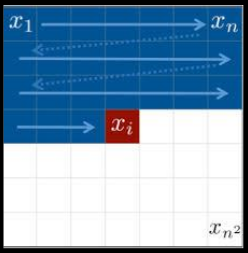

   

 - Variational Autoencoder 变分自解码器

   不是优化log-likelihood，而是去优化log-likelihood的lower bound，不知道下界与我们想要的差多少

   

 - GAN 生成对抗网络

   不稳定的训练过程

   

- flow


## Generator

​	输入一个 z，生成器 $G$ 会输出一个 x。若生成人脸，x是高维向量，向量里的每一个元素是人脸图像的pixel、

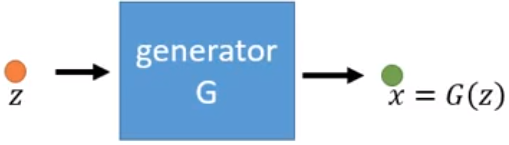

​	通常假设z是从很简单的概率分布（e.g. 高斯分布）采样出来的，每次采样出来一个z，把z输入，$G$ 输出对应的x

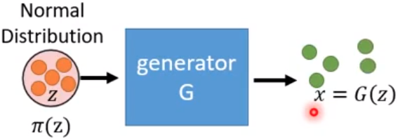

​	x会形成一个非常复杂的概率分布 $p_G(x)$，对我们而言什么样的 $G$ 是好的呢： 生成出来的 $p_G(x)$ 跟真实数据的概率分布 $p_{data}(x)$ 越接近越好。

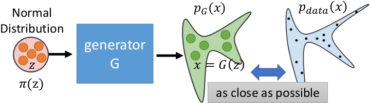

​	即生成器 $G$ 是一个网络。该网络会根据输出结果定义一个概率分布 $p_G$ 。 $p_G$ → $p_{data}$。

​	常见生成器训练是最大化log-likelihood，也就是从 $P_{data}(x)$ 里边取样 m 个data $\left\{x^{1}, x^{2}, \ldots, x^{m}\right\}$
$$
\quad\left\{x^{1}, x^{2}, \ldots, x^{m}\right\} \text { from } P_{\text {data}}(x)
$$
​	从人脸的照片里边随便取样 m 张照片，使生成器从这 m 张照片所产生的 $p_G$ 的likelihood越大越好，也就是说让 $x^i(i=1,2,...,m)$ 从概率分布 $P_G$ 里产生出来的概率越大越好。
$$
\begin{aligned}
G^{*} &=\arg \max _{G} \sum_{i=1}^{m} \log P_{G}\left(x^{i}\right)  \\
& \approx \arg \min _{G} K L\left(P_{\text {data}} \| P_{G}\right)
\end{aligned}
$$
​	最大化log-likelihood，等同于最小化 $P_G$ 和 $P_{data}$ 的 KL散度

​	Flow-based model 直接优化目标函数。


## Math Background

### Jacobian

​	现在有一个函数 $f$ ，其输入是一个二维向量 $z$ ，输出是一个二维向量 $x$
$$
\begin{aligned}
z =\left[\begin{array}{l}
z_{1} \\
z_{2}
\end{array}\right] \quad x=\left[\begin{array}{l}
x_{1} \\
x_{2}
\end{array}\right] 
\end{aligned}
$$

$$
x = f(z)
$$

​	函数 $f$ 的雅克比矩阵 $J_f$ 就是把所有输入和输出都做偏微分；其雅克比矩阵 $J_f$ 的逆 $J_{f^{-1}}$ 如下<span id="jf"></span>


$$
J_{f} =\left[\begin{array}{ll}
\partial x_{1} / \partial z_{1} & \partial x_{1} / \partial z_{2} \\
\partial x_{2} / \partial z_{1} & \partial x_{2} / \partial z_{2}
\end{array}\right]
$$

$$
J_{f^{-1}}=\left[\begin{array}{ll}
\partial z_{1} / \partial x_{1} & \partial z_{1} / \partial x_{2} \\
\partial z_{2} / \partial x_{1} & \partial z_{2} / \partial x_{2}
\end{array}\right]
$$

​	其中 $J_f$ 与 $J_{f^{-1}}$ 相乘结果为单位矩阵 $J_{f} J_{f^{-1}}=I$	

​	假设现有输入输出为<span id="eq1"></span>
$$
\begin{array}{c}
{\left[\begin{array}{c}
z_{1}+z_{2} \\
2 z_{1}
\end{array}\right]=f\left(\left[\begin{array}{c}
z_{1} \\
z_{2}
\end{array}\right]\right)}
\end{array} \tag{1}
$$

​	其 $J_f$ 为 $J_{f} =\left[\begin{array}{ll}1 & 1 \\
2 & 0
\end{array}\right]$

​	**[Eq. 1](#eq1)** 的逆为
$$
\left[\begin{array}{c}
x_{2} / 2 \\
x_{1}-x_{2} / 2
\end{array}\right]=f^{-1}\left(\left[\begin{array}{c}
x_{1} \\
x_{2}
\end{array}\right]\right)
$$
​	其 $J_{f^{-1}}$ 为 $ J_{f^{-1}}=\left[\begin{array}{ll}0 & 1/2 \\1 & -1/2
\end{array}\right]$
$$
J_{f} J_{f^{-1}}= \left(\begin{array}{lll}1 & 0 \\ 0 & 1 \end{array}\right)
$$
​	如果函数 $f$ 可逆，则其雅克比矩阵 $J_f$ 与其逆函数 $f^{-1}$ 的雅克比矩阵 $J_{f^{-1}}$  互逆即<span id="eq2"></span>
$$
J_f^{-1} = J_{f^{-1}} \tag{2}
$$

---

### Determinant

​	方阵的行列式是提供有关矩阵信息的 **scalar** 标量。

- 2X2

$$
\begin{array}{c}
A=\left[\begin{array}{ll}
a & b\\
c & d
\end{array}\right] \\
\operatorname{det}(A)=a d-b c
\end{array}
$$

​	2维中A的Determinant意义是面积


- 3X3

$$
\begin{aligned}
A =&\left[\begin{array}{lll}
a_{1} & a_{2} & a_{3} \\
a_{4} & a_{5} & a_{6} \\
a_{7} & a_{8} & a_{9}
\end{array}\right] \\
\operatorname{det}(A) =& 
a_{1} a_{5} a_{9}+a_{2} a_{6} a_{7}+a_{3} a_{4} a_{8} \\
&-a_{3} a_{5} a_{7}-a_{2} a_{4} a_{9}-a_{1} a_{6} a_{8}
\end{aligned}
$$

​	3维中A的Determinant意义是体积


​	根据**[Eq. 2](#eq2)**推断有以下倒数性质：<span id="eq3"></span>
$$
\color{#FF3030}\begin{array}{l}
\operatorname{det}(\mathrm{A})=1 / \operatorname{det}\left(A^{-1}\right) \\
\operatorname{det}\left(J_{f}\right)=1 / \operatorname{det}\left(J_{f^{-1}}\right)
\end{array} \tag{3}
$$

---

### Change of Variable Theorem

​	假设有分布 $\pi(z)$ ,通过函数 $f$ 生成的 $x$ 也形成了一个分布 $p(x)$


​	Input的z上有$z^{'}$, $x^{'}=f(z^{'})$ , 寻找 $z^{'}，x^{'}$ 的关系，也就是 $\pi(z^{'})$ 和 $p(x^{'})$ 的关系。


​	假设有均匀分布 $\pi(z)$ ，其中$ z \in (0,1)$ ，有$\int \pi(z) d z=1$


​	假设有函数 $f$ 为 
$$
x=f(z)=2z+1
$$
​	则有均匀分布 $p(x)$ ，其中$ x \in (1,3)$ ，也有有$\int p(x) d x=1$


​	底变为原来1的两倍2，则高变为原来1的一半1/2，那么两个分布之间的关系如下式子
$$
p\left(x^{\prime}\right)=\frac{1}{2} \pi\left(z^{\prime}\right)
$$


---

#### 1D Example

​	现有不常规的概率分布 $\pi(z)$ 通过函数变换后变成了另一种概率分布 $p(x)$   


​	通过 $x=f(z)$ ，如何寻找 $z$ 的概率密度/分布 $\pi(z)$ 和 $x$ 的概率密度 $p(x)$ 之间的关系?


​	现在假设把 $z^{\prime}$ 移动到 $z^{\prime} + \Delta{z}$ ，这一范围内的概率密度被拉宽到 $(x^{\prime},x^{\prime}+\Delta{x})$ 的范围：


​	假设 $\Delta{z} \rightarrow 0$ ， $(z^{\prime},z^{\prime}+\Delta{z})$ 范围内的概率密度可以近似看成均匀的，假设 $(x^{\prime},x^{\prime}+\Delta{x})$ 范围内的概率密度也是均匀的


​	也就是蓝色方块面积被拉宽到绿色方块，因此两块面积相同
$$
p\left(x^{\prime}\right) \Delta x=\pi\left(z^{\prime}\right) \Delta z
$$
​	方程两边同时除以 $\Delta{x}$ 得:
$$
p\left(x^{\prime}\right)=\pi\left(z^{\prime}\right) \frac{\Delta z}{\Delta x}
$$
​	$\Delta{z} \rightarrow 0 ,\Delta{x} \rightarrow 0 $进一步可以处理为：
$$
\begin{array}{l}
 \\
p\left(x^{\prime}\right)=\pi\left(z^{\prime}\right)\left|\frac{d z}{d x}\right|
\end{array}
$$
​	即 z 对 x 的微分，如果知道函数 $f$ 的逆，就可以算 z 对 x 的微分。加绝对值的原因如下图:


​	

---

#### 2D Example

​	现在 $z$ 和 $x$ 都是二维向量，同样的有转换函数 $x = f(z)$ ，如何寻找 $z$ 的概率密度 $\pi(z)$ 和 $x$ 的概率密度 $p(x)$ 之间的关系?

​	假设蓝色正方形的分布为 $\pi(z^{\prime})$ ，宽为 $\Delta{z_1}$ 高为 $\Delta{z_2}$，通过 $f$ 后，蓝色正方形变为绿色的菱形 


​	上图中 $\color{#FF3030}\Delta{x_{11}}$ 是 $z_1$ 改变时 $x_1$ 的改变量， $\color{#FF3030}\Delta{x_{21}}$ 是 $z_1$ 改变时 $x_2$ 的改变量

​				 $\color{#FF3030}\Delta{x_{12}}$ 是 $z_2$ 改变时 $x_1$ 的改变量， $\color{#FF3030}\Delta{x_{22}}$ 是 $z_2$ 改变时 $x_2$ 的改变量。

​	蓝色方块面积与 $\pi(z^{\prime})$ 相乘=绿色菱形面积与 $p(x^{\prime})$ 相乘，有下式
$$
p\left(x^{\prime}\right)\left|\operatorname{det}\left[\begin{array}{ll}
\Delta x_{11} & \Delta x_{21} \\
\Delta x_{12} & \Delta x_{22}
\end{array}\right]\right|=\pi\left(z^{\prime}\right) \Delta z_{1} \Delta z_{2}
$$
​	移项:
$$
p\left(x^{\prime}\right)\left|\frac{1}{\Delta z_{1} \Delta z_{2}} \operatorname{det}\left[\begin{array}{cc}
\Delta x_{11} & \Delta x_{21} \\
\Delta x_{12} & \Delta x_{22}
\end{array}\right]\right|=\pi\left(z^{\prime}\right)
$$
​	把 $\frac{1}{\Delta z_{1} \Delta z_{2}}$ 放到 Det 里:
$$
p\left(x^{\prime}\right)\left|\operatorname{det}\left[\begin{array}{cc}
\Delta x_{11} / \Delta z_{1} & \Delta x_{21} / \Delta z_{1} \\
\Delta x_{12} / \Delta z_{2} & \Delta x_{22} / \Delta z_{2}
\end{array}\right]\right|=\pi\left(z^{\prime}\right)
$$
​	其中 $\Delta x_{11} / \Delta z_{1}$ 等价于 $\partial x_{1} / \partial z_{1}$ ； $\Delta x_{21} / \Delta z_{1}$ 等价于 $\partial x_{2} / \partial z_{1}$ 。则有:
$$
p\left(x^{\prime}\right)\left|\operatorname{det}\left[\begin{array}{cc}
\partial x_{1} / \partial z_{1} & \partial x_{2} / \partial z_{1} \\
\partial x_{1} / \partial z_{2} & \partial x_{2} / \partial z_{2}
\end{array}\right]\right|=\pi\left(z^{\prime}\right)
$$
​	把内部矩阵转置，不会改变其行列式:
$$
p\left(x^{\prime}\right)\left|\operatorname{det}\left[\begin{array}{cc}
\partial x_{1} / \partial z_{1} & \partial x_{1} / \partial z_{2} \\
\partial x_{2} / \partial z_{1} & \partial x_{2} / \partial z_{2}
\end{array}\right]\right|=\pi\left(z^{\prime}\right)
$$
​	则转置后的内部矩阵为 [$J_{f}$](#jf) :
$$
\color{#FF3030}p\left(x^{\prime}\right)\left|\operatorname{det}\left(J_{f}\right)\right|=\pi\left(z^{\prime}\right)
$$

$$
p\left(x^{\prime}\right)=\pi\left(z^{\prime}\right)\left|\frac{1}{\operatorname{det}\left(J_{f}\right)}\right|\\
$$

​	利用**[Eq. 3](#eq3)**的性质转换:

$$
\color{#FF3030}p\left(x^{\prime}\right)=\pi\left(z^{\prime}\right)\left|\operatorname{det}\left(J_{f^{-1}}\right)\right|
$$

​	其中 z 是输入（潜在向量），x 是输出，x = f(z)


---

## Formal Explanation

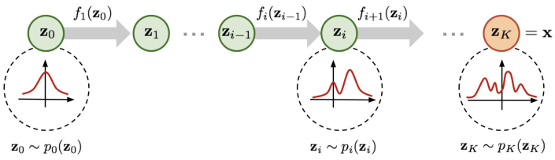

---

### Limitation

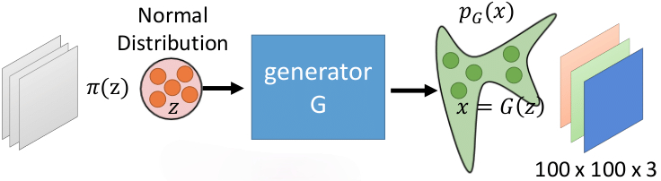	生成器 $G$ 的训练目标是:
$$
G^{*}=\arg \max _{G} \sum_{i=1}^{m} \log p_{G}\left(x^{i}\right)
$$
​	$x^i$ 是真实数据里采样出来的数据，其中	
$$
\begin{array}{c}
p_{G}\left(x^{i}\right)=\pi\left(z^{i}\right)\left|\operatorname{det}\left(J_{G^{-1}}\right)\right| \\
z^{i}=G^{-1}\left(x^{i}\right)
\end{array}
$$
​	两边同时取对数:<span id="eq4"></span>
$$
\log p_{G}\left(x^{i}\right)=\log \pi\left(G^{-1}\left(x^{i}\right)\right)+\log \left|\operatorname{det}\left(J_{G^{-1}}\right)\right| \tag{4}
$$
​	需要知道 $G^{-1}$ ，并且需要计算 $\operatorname{det}\left(J_{G}^{-1}\right)$ ，

​	如果输入为1000维的数据，他的雅克比矩阵size是1000*1000，计算行列式十分困难，因此需要设计架构使易于计算雅克比矩阵，且可计算 $G^{-1}$。

​	假设真实数据是 $100*100*3$ ，则输入数据的维度必须和其完全一致。这是flow-based model的一个问题。

​	

---

### Compose 

​	由于 $G$ 的限制太多，所以效果不好，故使用多个生成器 $G$ 组合起来一起生成。

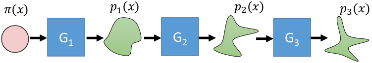

​	则有下式:

$$
\begin{array}{l}
p_{1}\left(x^{i}\right)=\pi\left(z^{i}\right)\left(\left|\operatorname{det}\left(J_{G_{1}^{-1}}\right)\right|\right) \\

p_{2}\left(x^{i}\right)=\pi\left(z^{i}\right)\left(\left|\operatorname{det}\left(J_{G_{1}^{-1}}\right)\right|\right)\left(\left|\operatorname{det}\left(J_{G_{2}^{-1}}\right)\right|\right) \\

\vdots \\

p_{K}\left(x^{i}\right)=\pi\left(z^{i}\right)\left(\left|\operatorname{det}\left(J_{G_{1}^{-1}}\right)\right|\right) \cdots\left(\left|\operatorname{det}\left(J_{G_{K}^{-1}}\right)\right|\right)


\end{array}
$$
​	两边取对数得:
$$
\log p_{K}\left(x^{i}\right)=\log \pi\left(z^{i}\right)+\sum_{h=1}^{K} \log \left|\operatorname{det}\left(J_{G_{K}^{-1}}\right)\right|
$$
​	其中
$$
z^{i}=G_{1}^{-1}\left(\cdots G_{K}^{-1}\left(x^{i}\right)\right)
$$


### Actually train

​	[目标函数](#eq4)里边只有参数 $G^{-1}$
$$
\log p_{G}\left(x^{i}\right)=\log \pi\left(G^{-1}\left(x^{i}\right)\right)+\log \left|\operatorname{det}\left(J_{G^{-1}}\right)\right| \tag{4}
$$
​	因此实际训练过程中，是训练 $G^{-1}$ ，然后用 $G$ 生成。

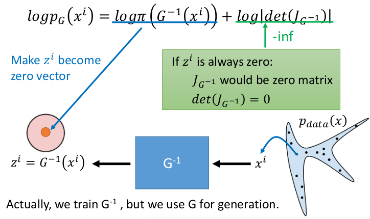

​	训练时，从实际数据中采样一些 $x^i$ ，把 $x^i$ 输入到 $G^{-1}$ 里，然后计算得到 $z^i$ 。要最大化目标函数，则让两个加式分别最大。

​	前项 $\log \pi\left(G^{-1}\left(x^{i}\right)\right)$ ， $\pi()$ 一般采用高斯分布，当输入为 0 时，概率最大，使 $z$ 尽可能为0 

​	后项 $\log \left|\operatorname{det}\left(J_{G^{-1}}\right)\right|$ ，当 $z$ 为 0 时，$J_{G^{-1}}$为全 0 矩阵，且 $\operatorname{det}\left(J_{G^{-1}}\right)=0$ ，后项趋近于 -inf。因此需要让它尽可能不为0。

​	前项让 $z$ 尽可能向原点集中，后项又限制将 $z$ 全部生成为0。


##### log_prob

​	当 $\pi()$ 为高斯正态分布时，log_prob(value)是计算value在定义的正态分布（mean,1）中对应的概率的对数，正太分布概率密度函数是:	
$$
\pi(x)=\frac{1}{\sqrt{2 \pi} \sigma} e^{-\frac{(x-\mu)^{2}}{2 \sigma^{2}}}
$$
​	取对数后
$$
\log (\pi(x))=-\frac{(x-\mu)^{2}}{2 \sigma^{2}}-\log (\sigma)-\log (\sqrt{2 \pi})
$$

##### sample

​	sample()就是直接在定义的正态分布（均值为mean，标准差std是１）上采样

##### rsample()

​	rsample()不是在定义的正态分布上采样，而是先对标准正态分布 $N(0,1)$ 进行采样，然后输出：
$$
\text{mean} + \text{std} \times 采样值
$$


```python
import torch
from torch.distributions import  Normal
mean=torch.Tensor([0,2])
normal=Normal(mean,1)


c=normal.sample()
print("c:",c)
# c: tensor([-1.3362,  3.1730])
    
a=normal.rsample()
print("a:",a)
# a: tensor([ 0.0530,  2.8396])

print("clog_prob:",normal.log_prob(c).exp())
# clog_prob: tensor([ 0.1634,  0.2005])
```


---

###  Coupling Layer

> NICE: NON-LINEAR INDEPENDENT COMPONENTS ESTIMATION
>
> RealNVP:  DENSITY ESTIMATION USING Real NVP

#### Forward

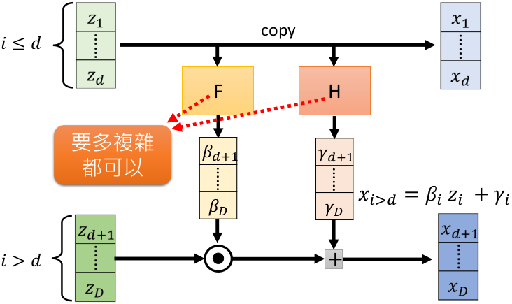

​	input为D维的向量 $z$，output为D维的向量 $x$。将 $z$ 和 $x$ 拆开， $i\leq d$ 维为一组， $i>d$ 维为另一组。

​	$z$ 前半部分 $z_{i\leq d}$ 直接复制到 $x$ 的前半部分 $x_{i\leq d}$。

​	$z$ 后半部分 $z_{i > d}$ 通过某个函数 $F$  转化到 $\beta_{i>d}$ ，在通过某个函数 $H$ 转换到 $\gamma_{i>d}$
$$
x_{i>d}=\beta_{i} z_{i}+\gamma_{i}
$$
​	$F$ 和 $H$ 不需要可逆，要多复杂的函数/网络都可以。总结如下:

<span id="eq5"></span>
$$
\color{#FF3030}\begin{array}{l}
x_{i \leq d}=z_{i} \\
x_{i>d}=\beta_{i} z_{i>d}+\gamma_{i}
\end{array} \tag{5}
$$

---

#### Backward

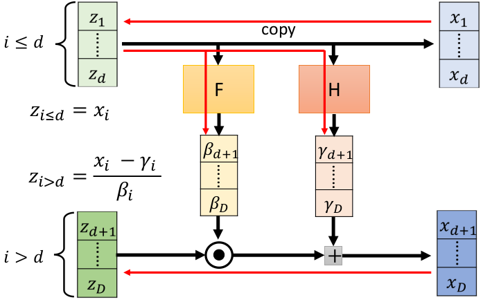

​	那么实际训练时，输入变为 $x$ 时，怎么逆回 $z$ ？

​	$x$ 前半部分 $x_{i\leq d}$ 直接复制到 $z$ 的前半部分 $z_{i\leq d}$。

​	$z_{i\leq d}$ 通过某个函数 $F$  转化到 $\beta_{i}$ ，在通过某个函数 $H$ 转换到 $\gamma_{i}$，带入[式中](#eq5)求解
$$
\color{#FF3030}\begin{array}{l}
z_{i \leq d}=x_{i} \\
z_{i>d}=\frac{x_{i>d}-\gamma_{i}}{\beta_{i}}
\end{array}
$$

​	

---

#### Compute Jacobian and Determinant

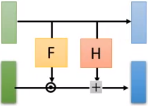

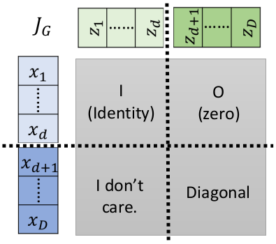


​	输入为 $z$ ，输出为 $x$ ，两者都是分为两个部分。

​	左上角矩阵，是单位矩阵。输入（浅绿）输出（浅蓝）完全相同。 

​	右上角矩阵，是全零矩阵。输入（深绿）不会影响输出（浅蓝）。

​	左下角矩阵，是什么没影响。左上角为单位矩阵，右上角为是全零矩阵。则整个雅克比矩阵 $J_G$ 的行列式等于右下角矩阵的行列式，与左下角矩阵无关。

​	右下角矩阵，是对角矩阵。由 $x_{i>d}=\beta_{i} z_{i>d}+\gamma_{i}$ 可知，输入 $x_{d+1}$ 只与 $z_{d+1}$ 有关，与其它元素无关，所以只有对角线上有元素。

​	因此整个雅克比矩阵的行列式为右下矩阵的对角元素之积，如下式：
$$
\begin{array}{l}
\operatorname{det}\left(J_{G}\right) &=\frac{\partial x_{d+1}}{\partial z_{d+1}} \frac{\partial x_{d+2}}{\partial z_{d+2}} \cdots \frac{\partial x_{D}}{\partial z_{D}} \\
&=\beta_{d+1} \beta_{d+2} \cdots \beta_{D}
\end{array}
$$

---

#### Stacking

​	把这些 coupling layer 叠加起来


​	但是有问题是，前 $d$ 部分是**完全复制**过去的，没有学习。如下图

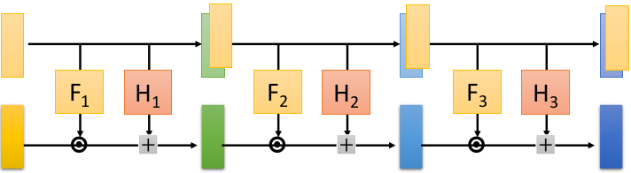

​	因此将其方向转一下，第一个 coupling layer 先复制**前**半部分，第二个 coupling layer 复制**后**半部分，第三个 coupling layer 再复制**前**半部分。如下图

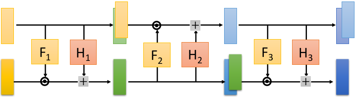


#### Image Generative

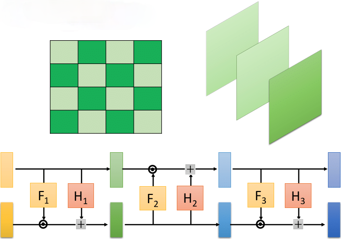

​	怎么把image拆成两部分输入流模型?

- image 里的 index 偶数部分直接复制，奇数部分通过 $x_{i>d}=\beta_{i} z_{i>d}+\gamma_{i}$ 变换

- image 一般都有 rgb 三个channel，选 channel 复制，选其余 channel 通过变换


---

### 1x1 Convolution Layer

> GLOW: Generative Flow with Invertible 1×1 Convolutions

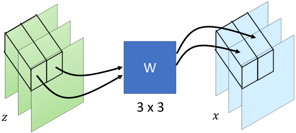

​	输入为 $z$ ，输出为 $x$ 。 $W(3\times3)$ 乘以 3 个 **channel** 的值$(3\times1)$ 得到的结果填充到原来 **channel** 的位置 $(3\times1)$ 。

​	$W$ 是通过学习得到的转换矩阵。若学习到 $W = \begin{array}{|l|l|l|}\hline 0 & 0 & 1 \\\hline 1 & 0 & 0 \\\hline 0 & 1 & 0 \\
\hline
\end{array}$ ，则 $W$ 的功能是 **shuffle channels**，如下式所示:
$$
\begin{array}{|l|}
\hline 3 \\
\hline 1 \\
\hline 2 \\
\hline
\end{array}=\begin{array}{|l|l|l|}
\hline 0 & 0 & 1 \\
\hline 1 & 0 & 0 \\
\hline 0 & 1 & 0 \\
\hline
\end{array}\begin{array}{|l|}
\hline 1 \\
\hline 2 \\
\hline 3 \\
\hline
\end{array}
$$
​	如果 $W$ 是一个可逆的矩阵，则 $x$ 可以通过 $W^{-1}$ 计算 $z$ 。但是可能会学习到一个生成出一个不可逆的矩阵。但是学习到的 $W$ 是可逆矩阵是大概率事件。

​			

---

#### Compute Jacobian and Determinant

​	有式 $x=f(z)=W z\\$ ，即：
$$
\left[\begin{array}{l}
x_{1} \\
x_{2} \\
x_{3}
\end{array}\right]=\left[\begin{array}{lll}
w_{11} & w_{12} & w_{13} \\
w_{21} & w_{22} & w_{23} \\
w_{31} & w_{32} & w_{33}
\end{array}\right]\left[\begin{array}{l}
z_{1} \\
z_{2} \\
z_{3}
\end{array}\right]
$$

​	则其雅克比矩阵计算方式如下式：
$$
\begin{aligned}
&J_{f}=\left[\begin{array}{lll}
\partial x_{1} / \partial z_{1} & \partial x_{1} / \partial z_{2} & \partial x_{1} / \partial z_{3} \\
\partial x_{2} / \partial z_{1} & \partial x_{2} / \partial z_{2} & \partial x_{2} / \partial z_{3} \\
\partial x_{3} / \partial z_{1} & \partial x_{3} / \partial z_{2} & \partial x_{3} / \partial z_{3}
\end{array}\right]=\left[\begin{array}{lll}
w_{11} & w_{12} & w_{13} \\
w_{21} & w_{22} & w_{23} \\
w_{31} & w_{32} & w_{33}
\end{array}\right]=W
\end{aligned}
$$

​	为 $W$

​	全部的输入 z 和全部的输出 x。只有对角线的地方有一个 $W$ 。因为每个输入不会影响其它地方的输出。

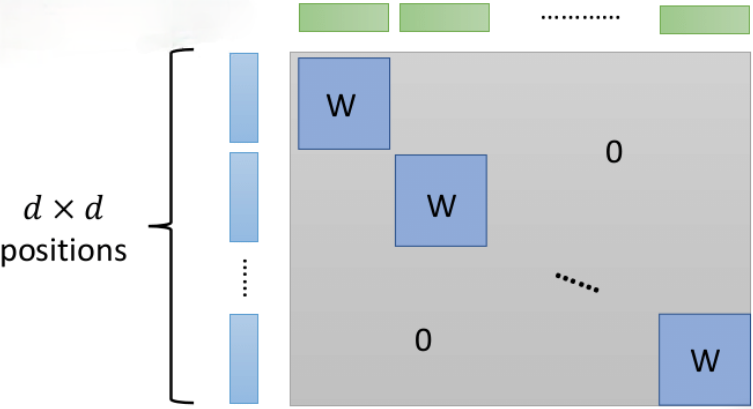

​	则灰色部分矩阵的行列式为：
$$
(\operatorname{det}(W))^{d\times d}
$$
​	如果 $W$ 是 $3\times 3$ 的，则计算 $\operatorname{det}(W)$ 很简易。


---

## Demo of OpenAI


​	将照片通过 $G^{-1}$ 得到  $z$ ，通过将两个 $z$ 平均赋权结合在一起。输入到生成器 $G$


​	收集笑的脸的 $z_{1}$ ，再收集不笑的脸 $z_{2}$ ，相减得到笑的特征 $z_{smile}$ ，将输入图像输入 $G^{-1}$ 输出 $z$ ，给 $z$ 加上 $z_{smile}$ 笑的特征，输入到 $G$.


https://openai.com/blog/glow/


---

# Normalizing Flows - wechat

https://mp.weixin.qq.com/s/oUQuHvy0lYco4HsocqvH3Q

标准化流能做什么？假设我们想生成人脸，但我们并不知道人脸图片在高维空间 $D$ 的分布，我可以用一个简单的分布 $p_z$，从中sample出一个向量 $z$，让它通过标准化流，得到一个新的向量 $x$，让 $x$ 的分布与人脸的分布相近，这样我们就可以生成任意张不同的人脸照片。

再举一个例子，如果我们有一堆冷漠脸的图片，和一堆笑脸的图片，把多张冷漠脸通过逆标准化流，取平均得到一个向量z1，再把多张笑脸通过逆标准化流，取平均得到向量z2，用z2减去z1得到z3，z3应该就是在z空间中，从冷漠脸区域指向笑脸区域的向量，那我们现在把任意一个冷漠脸的人的图片x拿来通过逆标准化流得到z4，令z5 = z3 + z4，再通过标准化流应该就可以得到这个人笑脸样子的图片了！

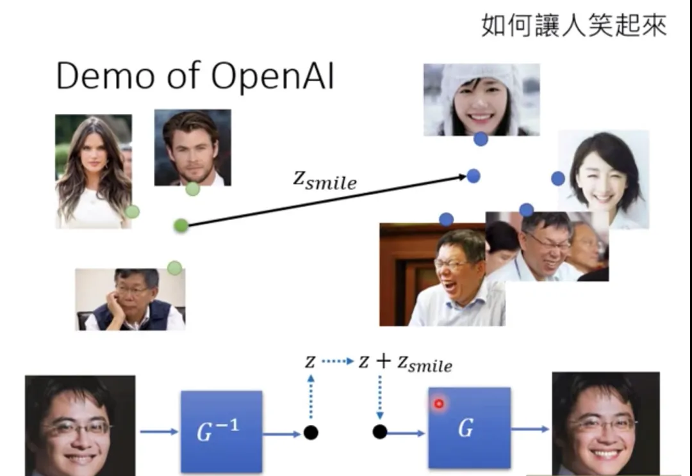


## 1. 前置

### 1.1. 行列式

一个矩阵的行列式的值表示的是该矩阵对空间所做的变换，将原来的空间放大或缩小了多少倍

比如二维空间在原点有一个边长为1的正方形a，对它做变换得到新的正方形b，$b=Wa$，$ W=\left[\begin{array}{ll}2 & 0 \\ 0 & 2\end{array}\right] $，新的正方形边长被放大为原来的2倍，面积为原来的4倍，$det(W)=4$，


三维变为体积，更高维同理


---

### 1.2. 雅可比矩阵

互为逆变换的 $f$ 与 $f^{-1}$，其二者对应的雅可比矩阵也互为逆阵，因此又由行列式的性质可得它们的雅可比行列式互为倒数，即
$$
\begin{equation}
 \left|\operatorname{det} J_{f}\right|=\left|\operatorname{det} J_{f^{-1}}\right|^{-1} 
\end{equation}
$$
变换 $f$ 可以不仅仅是矩阵变换，也可以任意的函数，将 $D$ 维的向量变换为 $D'$ 维的 $x$，$ f: \mathbb{R}^{D} \rightarrow \mathbb{R}^{D} $。


---

### 1.3. 变量变换定理

假设有一变量 $u$ ，服从分布 $u \sim p_u(u)$，有一变换 $T$，$x=T(u)$，$p_u(u)$ 是已知的一种简单分布，变换 $T$ 可逆，且 $T$ 与 $T^{-1}$ 都可微分，现在要求 $p_x(x)$，即随机变量的概率密度函数，因为概率之和相等
$$
\begin{equation}
 \int_{x} p_{x}(\mathbf{x}) d \mathbf{x}=1=\int_{z} p_{z}(\mathbf{z}) d \mathbf{z} 
\end{equation}
$$
假设 $x$ 和 $z$ 都是在整个空间上积分，那么**被积分的部分绝对值必定处处相等**，由于概率 $p$ 必大于等于0，可去掉其两边的绝对值号，即得
$$
\begin{equation}
 \begin{aligned}\left|p_{x}(\mathbf{x}) d \mathbf{x}\right| &=\left|p_{z}(\mathbf{z}) d \mathbf{z}\right| \\ 
 p_{x}(\mathbf{x}) &=p_{z}(\mathbf{z})\left|\frac{d \mathbf{z}}{d \mathbf{x}}\right| \\ 
 p_{x}(\mathbf{x}) &=p_{z}(\mathbf{z})\left|\frac{\partial T^{-1}(\mathbf{x})}{\partial \mathbf{x}}\right| \\ 
 p_{x}(\mathbf{x}) &=p_{z}\left(T^{-1}(\mathbf{x})\right)\left|\operatorname{det} J_{T^{-1}}(\mathbf{x})\right| \end{aligned} 
\end{equation}
$$
两边都是**概率密度**乘以**空间的大小**，得到是一个**标量**，即随机变量落在该空间的概率大小，将变换 $T$ 写入 $ \left|\frac{d \mathbf{z}}{d \mathbf{x}}\right| $，即将其写为 $ \left|\frac{\partial T^{-1}(\mathbf{x})}{\partial \mathbf{x}}\right| $，但 $x$ 为向量而非标量，这里 $ \left|\frac{d z}{d x}\right| $ 要表示的是空间变化的大小关系，我们由雅可比矩阵的定义可知 $ \frac{\partial T^{-1}(\mathbf{x})}{\partial \mathbf{x}}=J_{T^{-1}}(\mathbf{x}) $ ，又由行列式的物理意义，知道 $ J_{T}(\mathbf{z}) $ 的绝对值为 $T$ 将 $z$ 映射到 $x$ 时，空间大小放缩的倍数，即为概率密度放缩的倍数倒数，又因 $ \operatorname{det} J_{T^{-1}}(\mathbf{x})=\operatorname{det} J_{T}(\mathbf{z})^{-1} $，因此可得下式：
$$
\begin{equation}
 p_{x}(\mathbf{x})=p_{z}(\mathbf{z})\left|\operatorname{det} J_{T}(\mathbf{z})\right|^{-1} 
\end{equation}
$$
在论文中解释大意是：

>我们可以认为T在通过expand或contract R^D空间来使得pz变得和px相近。雅可比行列式detT的绝对值量化了原向量z附近的体积由于经过T变换后，体积相对变化的大小，即当z附近一块无穷小的体积dz，经过T后被map到了x附近的一块无穷小的体积dx处，那么detT等于dx除以dz，即映射后的体积是原来的几倍，因为dz中包含的概率等于dx中包含的概率，因此如果dz的体积被放大了，那么dx里的概率密度应该缩小


举个例子，假设随机变量 $z$ 属于 0-1 均匀分布，在取值空间 $C_1=(0, 1)$ 上，$p(z)=1$，有变换 $T$，$T(z)=2z$，令 $x=T(z)$，则 $x$ 必是 $C_2=(0, 2)$ 上的均匀分布，但此时 $p(x)$ 不再是 1 了，否则在(0, 2)上都有 $p(x)=1$ ，积分可得概率之和为2，明显错误，因为变换$T$ 将原空间中 $z$ 可取值的范围放大了一倍，从(0, 1)变为了(0, 2)，即可取值空间从 $C_1$ 变$C_2$ 为，空间放大的倍数为 $ \left|\operatorname{det} J_{T}(\mathbf{z})\right|=2 $，那概率密度缩小的倍数为 $ \left|\operatorname{det} J_{T^{-1}}(\mathbf{x})\right|=\frac{1}{2} $，即相应的 $x$ 概率密度应该缩小一倍，因此
$$
\begin{equation}
 0.5=p_{x}(\mathbf{x})=p_{z}(\mathbf{z}) \cdot\left|\operatorname{det} J_{T^{-1}}(\mathbf{x})\right|=1 \cdot \frac{1}{2} 
\end{equation}
$$


## 2. 标准化流

目标是使用简单的概率分布来建立我们想要的更为复杂更有表达能力的概率分布，使用的方法就是Normalizing Flow，flow的字面意思是一长串的 $T$，即很多的transformation。让简单的概率分布，通过这一系列的transformation，一步一步变成complex、expressive的概率分布，like a fluid flowing through a set of tubes，fluid就是说概率分布像水一样，是可塑的易变形的，我们把它通过一系列tubes，即变换T们，塑造成我们想要的样子——最终的概率分布。


### 2.1. 属性

1. $x$ 与 $u$ 必须维度相同，因为只有维度相同，下面的变换 $T$ 才可能可逆
2. 变换 $T$ 必须可逆，且 $T$ 和 $T$ 的逆必须可导
3. 变换 $T$ 可以由多个符合条件2的变换 $T_i$ 组合而成

$$
\begin{equation}
 \begin{aligned}\left(T_{2} \circ T_{1}\right)^{-1} &=T_{1}^{-1} \circ T_{2}^{-1} \\ \operatorname{det} J_{T_{2} \circ T_{1}}(\mathbf{u}) &=\operatorname{det} J_{T_{2}}\left(T_{1}(\mathbf{u})\right) \cdot \operatorname{det} J_{T_{1}}(\mathbf{u}) \end{aligned} 
\end{equation}
$$

从使用角度来说，一个flow-based model提供了两个操作，一是sampling，即从 $p_u$ 中sample出 $u$ ，经过变换 $T$ 得到 $x$，$ \mathbf{x}=T(\mathbf{u}) $ where $ \mathbf{u} \sim p_{u}(\mathbf{u}) $，另一个是evaluating模型的概率分布，使用公式 $ p_{\mathrm{x}}(\mathbf{x})=p_{\mathrm{u}}\left(T^{-1}(\mathbf{x})\right)\left|\operatorname{det} J_{T^{-1}}(\mathbf{x})\right| $。

两种操作有不同的计算要求，sampling需要能够sample from $p_u$ 以及计算变换 $T$，evaluating需要能够计算T的逆与雅可比行列式，并evaluate $p_u$，因此计算时的效率与难度对应用来说至关重要


### 2.2. 流的非线性变化能力

$p(u)$ 是很简单的一个概率分布，那么可以通过flow，将 $p(u)$ 转换为任意的概率分布 $p(x)$


### 2.3. 


## 3. 构建标准化流

https://mp.weixin.qq.com/s/XtlK3m-EHgFRKrtcwJHZCw


### 3.3. 残差流

$$
\begin{equation}
 \mathbf{z}^{\prime}=\mathbf{z}+g_{\phi}(\mathbf{z}) 
\end{equation}
$$

$g_{\phi}$ 是一个输出 $D$ 维向量的神经网络，我们需要对其加以合适的限制，以让其可逆


#### 3.3.1 Contractive residual flows

构建满足Lipschitz连续条件，且Lipschitz常数小于1的变换F


#### 3.3.2 Residual flows based on the matrix determinant lemma

A为DxD的可逆矩阵，V、W为DxM的矩阵，M<D，有矩阵行列式引理如下
$$
\begin{equation}
 \operatorname{det}\left(\mathbf{A}+\mathbf{V} \mathbf{W}^{\top}\right)=\operatorname{det}\left(\mathbf{I}+\mathbf{W}^{\top} \mathbf{A}^{-1} \mathbf{V}\right) \operatorname{det} \mathbf{A} 
\end{equation}
$$
如果A是对角阵的话计算量从左式的 $ \mathcal{O}\left(D^{3}+D^{2} M\right) $ 降到了 $ \mathcal{O}\left(M^{3}+M^{2} D\right) $


**Planar flow**

Planar flow是一个单层神经网络，只有一个神经元w
$$
\begin{equation}
 \begin{aligned} \mathbf{z}^{\prime} &=\mathbf{z}+\mathbf{v} \sigma\left(\mathbf{w}^{\top} \mathbf{z}+b\right) \\ J_{f_{\phi}}(\mathbf{z}) &=\mathbf{I}+\sigma^{\prime}\left(\mathbf{w}^{\top} \mathbf{z}+b\right) \mathbf{v} \mathbf{w}^{\top} \\ \operatorname{det} J_{f_{\phi}}(\mathbf{z}) &=1+\sigma^{\prime}\left(\mathbf{w}^{\top} \mathbf{z}+b\right) \mathbf{w}^{\top} \mathbf{v} \end{aligned} 
\end{equation}
$$
$\sigma$ 是一个可微的激活函数例如tanh，假设处处大于0，且有上界S，则当 $ \mathbf{w}^{\top} \mathbf{v}>-\frac{1}{S} $ 时，雅可比行列式大于0


**Sylvester flow**

将Planar flow推广到有M个神经元W就是Sylvester flow，$ \mathbf{V} \in \mathbb{R}^{D \times M}, \mathbf{W} \in \mathbb{R}^{D \times M}, \mathbf{b} \in \mathbb{R}^{M} $，S(z)是对角矩阵，元素是 $ \sigma^{\prime}\left(\mathbf{W}^{\top} \mathbf{z}+\mathbf{b}\right) $ 的对角线上的元素
$$
\begin{equation}
 \begin{aligned} \mathbf{z}^{\prime} &=\mathbf{z}+\mathbf{V} \sigma\left(\mathbf{W}^{\top} \mathbf{z}+\mathbf{b}\right) \\ J_{f_{\phi}}(\mathbf{z}) &=\mathbf{I}+\mathbf{V} \mathbf{S}(\mathbf{z}) \mathbf{W}^{\top} \\ \operatorname{det} J_{f_{\phi}}(\mathbf{z}) &=\operatorname{det}\left(\mathbf{I}+\mathbf{S}(\mathbf{z}) \mathbf{W}^{\top} \mathbf{V}\right) \end{aligned} 
\end{equation}
$$


---

# Normalizing Flows - zhihu

https://www.zhihu.com/question/376122890

## 2.标准化流框架

### 2.3 流模型的推导

流模型，是我们为了增加非线性能力，需要多个简单变换的复合来增强产生式模型对于分布的拟合能力，公式如下 $ T=T_{K} \circ \cdots \circ T_{1} $ 。由于简单变换 $T$ 的逆与微分都满足可乘性，即多个变换组合后其可逆性和可微性依然存在而不会由于乘积改变，因此我们可以用标准化流为概率分布建模。新分布由以下二者唯一确定：

1.**基础分布**，就是我们转换前的那个分布，可以是高斯分布；用tensorflow框架可以设为`base_dist()`
2.**双射函数**,它由三部分构成：
①前向映射 $ x=T(u) $ ，用tf实现前向传播 `X = bijector.forward(base_dist.sample())`
②反向映射 $ u=T^{-1}(x) $ ，用tf实现评估函数 `J = new_dist.log_prob(bijector.inverse(x)) + bijector.inverse_log_det_jacobian(x)`，x为样本，要是双射函数在求解log_prob中有可变的参数，我们就可以用一个优化器来学习参数，最终拟合真实数据。
③雅各比矩阵的**逆对数行列式** $ \log \left(\mid \operatorname{det} J\left(T^{-1}(x) \mid\right)\right. $ ，用于评估转换后分布的对数密度。算法通过最大似然估计，把拟合真实数据的分布问题变成拟合变换后的概率的对数密度问题。


## 3.现代流模型I - 有限变换模型

### 3.4 其他流模型-残差流

$$
\begin{equation}
 \mathbf{z}^{\prime}=\mathbf{z}+g_{\phi}(\mathbf{z}) 
\end{equation}
$$

$g_{\phi}$ 是一个输出 $D$ 维向量的神经网络，我们需要对其加以合适的限制，以让其可逆


下面我们讨论两个设计残差流的技术：收缩映射(contractive maps) 和 矩阵求逆引理(matrix determinant lemma)。

收缩映射的代表工作有Behrmann et al. (2019)[12]，Miyato et al., (2018)[13]。收缩映射对$g_\phi$ 限制条件是，如果 $g_\phi$ 对某个距离函数是可收缩的(contractive)，则整个残差变换是可逆的.

形象地说contractive性质如下：找到映射F，套上距离函数后A和B的距离是逐渐拉近的，至少拉近因子L倍。我们称F满足李普希兹连续条件。

那么映射F也满足巴拿赫不动点定理Banach fixed-point theorem：如果 $F$ 是收缩算子,那么 $F$ 有唯一的不动点(存在且唯一)，即 $ z_{*}=F\left(z_{*}\right) $。由此条件可以证出， $g_\phi$  是收缩的，则构造 $ F(z)=z^{\prime}-g_{\phi}(z) $，易知 $F$ 也是收缩的，有 $ z_{*}=z^{\prime}-g_{\phi}(z) $，移项合并后得到 $ z^{\prime}=f_{\phi}\left(z_{*}\right) $ ，那么意味着每个输出 $z^{\prime}$ 的变换的逆变换都具有不动点，因此整个残差变换是可逆的。

逆函数的计算公式也可以由上面推导得出，$ z_{*}=f_{\phi}^{-1}\left(z^{\prime}\right) $ ，其中**求逆的速度由压缩因子L决定**。我们将**L视为获取表达力和计算速度的权衡因子**，如下公式决定收敛速度，L越小，整个迭代到 $z_0$ 的速度越快，但是由于NN的限制，残差流的表达能力也越差。

$ \operatorname{map} F: \mathbb{R}^{D} \rightarrow \mathbb{R}^{D} $ is said to be contractive with respect to a distance function $ \delta $ if there exists a constant $ L<1 $ such that for any two inputs $ \mathrm{Z}_{A} $ and $ \mathrm{Z}_{B} $ we have:
$$
\begin{equation}
 \delta(F(\mathbf{z} A), F(\mathbf{z} B)) \leq L \delta(\mathbf{z} A, \mathbf{z} B), \delta(\mathbf{z} k, \mathbf{z} *) \leq \frac{L^{k}}{1-L} \delta(\mathbf{z} 0, \mathbf{z} 1) 
\end{equation}
$$
同上文所说，构建  $g_\phi$  的整个网络需要加以限制。NN的每一层，要找Lipschitz连续函数，满足压缩的条件。幸运的是，大多非线性变换函数，如sigmoid，tanh，Relu都满足这一条件，而**卷积层和全连接层可以通过除以一个严格大于它们操作范数的方式保证**。代表有，**spectral normalization**。

所以通过收缩映射实现残差流是比较容易的，因为可以满足可逆性，逆运算速度快。但缺点是，直接计算雅克比行列式需要 $O(D^3)$，目前没有明显高效的方法去直接求解。一些工作采用了无偏估计的方式，估计雅克比行列式的对数值。通过泰勒展开的方式，$ \log (1+x)=x-\frac{x^{2}}{2}+\frac{x^{3}}{3}-\cdots $，展开为下式。其中因子 $Tr$ 为哈钦森迹估计器。将复杂度进一步降低到 $O(KD)$。
$$
\begin{equation}
 \log \left|\operatorname{det} J_{f_{\phi}}(\mathbf{z})\right|=\log \left|\operatorname{det}\left(\mathbf{I}+J_{g_{\phi}}(\mathbf{z})\right)\right|=\sum_{k=1}^{\infty} \frac{(-1)^{k+1}}{k} \operatorname{Tr}\left\{J_{g_{\phi}}^{k}(\mathbf{z})\right\} 
\end{equation}
$$

$$
\begin{equation}
 \operatorname{Tr}\left\{J_{g_{\phi}}^{k}(\mathbf{z})\right\} \approx \mathbf{v}^{\top} J_{g_{\phi}}^{k}(\mathbf{z}) \mathbf{v} 
\end{equation}
$$


不同于自回归流，其雅克比矩阵是稀疏的，残差流中的收缩映射技术中雅克比矩阵是稠密的，影响了计算效率的同时却**允许所有的输入影响输出**。因此，**流模型表达能力十分强，可以拟合出较好的结果**。不过也由于评估模型 $p(x)$ 计算的效率低，采样只能迭代进行，很难应用于高维任务中。


## 6.应用

流模型提供最基本的两个应用，概率密度计算与采样。此外还可以用在概率模型的建模，推断，监督学习和强化学习这些领域。

### 6.4 表示学习

流模型不只在建模和推断具有表现，在**构建下游任务中也具有很多应用场景**，常见的做法是构建**产生式模型和预测模型的混合模型**。这里介绍监督学习和强化学习。

残差流类的模型，如 Invertible ResNet，被运用在**分类任务**中。第一篇论文(Gomez et al., 2017[33])作了工程上的改进，通过**不需要存储反向传播的激活函数值来减少模型的内存占用**。第二篇论文（Jacobsen et al. 2018[34]）改进了**模型的可解释性**和深度学习机制的理解：可逆ResNet在ImageNet上可以训练到和标准ResNet一样的准确率，这一成果可能有助于我们理解在何种程度上丢弃怎样的信息，在深度学习领域至关重要。


混合模型的工作有(Nalisnick et al., 2019[35])，没有采用常见的ResNet架构，而是使用了雅克比行列式易求的架构，设计了联合密度。模型的结构在前 $L-1$ 层采用流模型的架构，而在**最后一层采用线性模型对特征** 进行操作。


## 7. 总结

在流模型的发展中，一个里程碑的原理是**概率链规则**及其与**雅克比行列式的体积变换关系**。自回归流建立在这两个支柱之上，前者是其**表达能力的基础**，而后者提供了**有效的实现**。Banachxed point theorem提供了收缩映射残差流的数学基础，在未来流模型的设计中，残差流将遵守**李普希茨连续**的条件以**不会违背不动点定理**。

贯穿本文的是我们始终强调一些关键的实现，能够设计出成功的流模型。也许最重要的是在**前向传播和反向传播中的雅克比行列式计算的限制**。

展望未来，流模型和众多概率模型一样，存在许多障碍阻止其大范围的应用。但流模型不像**其他概率模型采用近似推断策略**，总是允许一些可求得解析解的计算甚至在高维度进行**精确的采样**。这些困难存在于，我们如何在保持精确密度计算和采样计算可处理性的同时**设计更灵活，更具有表达力的转换**？这是当前很多工作研究的对象，更多的理论研究需要拓展。了解流模型对有限样本和有限深度设置的近似能力将有助于从业者选择最适合给定应用的流类。


