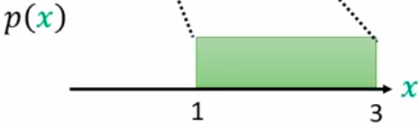
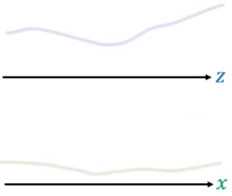
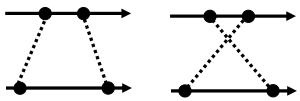
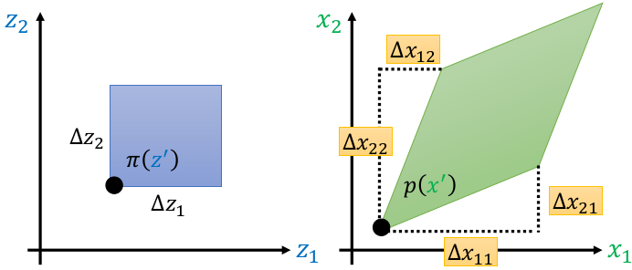
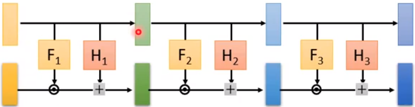
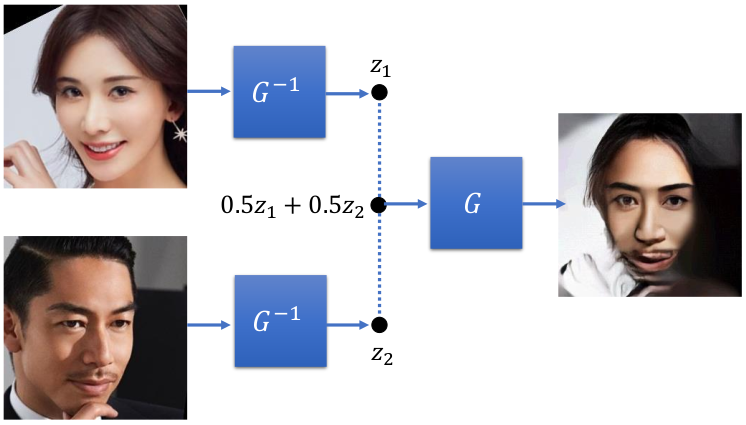

# Flow-based generative model

 - Component-by-Component 组件（auto-regressive model自回归模型）   

 -  http://speech.ee.ntu.edu.tw/~tlkagk/courses_ML20.html

   从左上到右下一个pixel一个pixel生成的，最佳的生成的顺序无法找到。生成语音这种有顺序性的数据集效果稍微比较好，生成速度较慢。

   

   

 - Variational Autoencoder 变分自解码器

   不是优化log-likelihood，而是去优化log-likelihood的lower bound，不知道下界与我们想要的差多少

   

 - GAN 生成对抗网络

   不稳定的训练过程

   

- flow


## Generator

​	输入一个 z，生成器 $G$ 会输出一个 x。若生成人脸，x是高维向量，向量里的每一个元素是人脸图像的pixel、


​	通常假设z是从很简单的概率分布（e.g. 高斯分布）采样出来的，每次采样出来一个z，把z输入，$G$ 输出对应的x


​	x会形成一个非常复杂的概率分布 $p_G(x)$，对我们而言什么样的 $G$ 是好的呢： 生成出来的 $p_G(x)$ 跟真实数据的概率分布 $p_{data}(x)$ 越接近越好。


​	即生成器 $G$ 是一个网络。该网络会根据输出结果定义一个概率分布 $p_G$ 。 $p_G$ → $p_{data}$。

​	常见生成器训练是最大化log-likelihood，也就是从 $P_{data}(x)$ 里边取样 m 个data $\left\{x^{1}, x^{2}, \ldots, x^{m}\right\}$
$$
\quad\left\{x^{1}, x^{2}, \ldots, x^{m}\right\} \text { from } P_{\text {data}}(x)
$$
​	从人脸的照片里边随便取样 m 张照片，使生成器从这 m 张照片所产生的 $p_G$ 的likelihood越大越好，也就是说让 $x^i(i=1,2,...,m)$ 从概率分布 $P_G$ 里产生出来的概率越大越好。
$$
\begin{aligned}
G^{*} &=\arg \max _{G} \sum_{i=1}^{m} \log P_{G}\left(x^{i}\right)  \\
& \approx \arg \min _{G} K L\left(P_{\text {data}} \| P_{G}\right)
\end{aligned}
$$
​	最大化log-likelihood，等同于最小化 $P_G$ 和 $P_{data}$ 的 KL散度

​	Flow-based model 直接优化目标函数。


## Math Background

### Jacobian

​	现在有一个函数 $f$ ，其输入是一个二维向量 $z$ ，输出是一个二维向量 $x$
$$
\begin{aligned}
z =\left[\begin{array}{l}
z_{1} \\
z_{2}
\end{array}\right] \quad x=\left[\begin{array}{l}
x_{1} \\
x_{2}
\end{array}\right] 
\end{aligned}
$$

$$
x = f(z)
$$

​	函数 $f$ 的雅克比矩阵 $J_f$ 就是把所有输入和输出都做偏微分；其雅克比矩阵 $J_f$ 的逆 $J_{f^{-1}}$ 如下<span id="jf"></span>


$$
J_{f} =\left[\begin{array}{ll}
\partial x_{1} / \partial z_{1} & \partial x_{1} / \partial z_{2} \\
\partial x_{2} / \partial z_{1} & \partial x_{2} / \partial z_{2}
\end{array}\right]
$$

$$
J_{f^{-1}}=\left[\begin{array}{ll}
\partial z_{1} / \partial x_{1} & \partial z_{1} / \partial x_{2} \\
\partial z_{2} / \partial x_{1} & \partial z_{2} / \partial x_{2}
\end{array}\right]
$$

​	其中 $J_f$ 与 $J_{f^{-1}}$ 相乘结果为单位矩阵 $J_{f} J_{f^{-1}}=I$	

​	假设现有输入输出为<span id="eq1"></span>
$$
\begin{array}{c}
{\left[\begin{array}{c}
z_{1}+z_{2} \\
2 z_{1}
\end{array}\right]=f\left(\left[\begin{array}{c}
z_{1} \\
z_{2}
\end{array}\right]\right)}
\end{array} \tag{1}
$$

​	其 $J_f$ 为 $J_{f} =\left[\begin{array}{ll}1 & 1 \\
2 & 0
\end{array}\right]$

​	**[Eq. 1](#eq1)** 的逆为
$$
\left[\begin{array}{c}
x_{2} / 2 \\
x_{1}-x_{2} / 2
\end{array}\right]=f^{-1}\left(\left[\begin{array}{c}
x_{1} \\
x_{2}
\end{array}\right]\right)
$$
​	其 $J_{f^{-1}}$ 为 $ J_{f^{-1}}=\left[\begin{array}{ll}0 & 1/2 \\1 & -1/2
\end{array}\right]$
$$
J_{f} J_{f^{-1}}= \left(\begin{array}{lll}1 & 0 \\ 0 & 1 \end{array}\right)
$$
​	如果函数 $f$ 可逆，则其雅克比矩阵 $J_f$ 与其逆函数 $f^{-1}$ 的雅克比矩阵 $J_{f^{-1}}$  互逆即<span id="eq2"></span>
$$
J_f^{-1} = J_{f^{-1}} \tag{2}
$$

---

### Determinant

​	方阵的行列式是提供有关矩阵信息的 **scalar** 标量。

- 2X2

$$
\begin{array}{c}
A=\left[\begin{array}{ll}
a & b\\
c & d
\end{array}\right] \\
\operatorname{det}(A)=a d-b c
\end{array}
$$

​	2维中A的Determinant意义是面积


- 3X3

$$
\begin{aligned}
A =&\left[\begin{array}{lll}
a_{1} & a_{2} & a_{3} \\
a_{4} & a_{5} & a_{6} \\
a_{7} & a_{8} & a_{9}
\end{array}\right] \\
\operatorname{det}(A) =& 
a_{1} a_{5} a_{9}+a_{2} a_{6} a_{7}+a_{3} a_{4} a_{8} \\
&-a_{3} a_{5} a_{7}-a_{2} a_{4} a_{9}-a_{1} a_{6} a_{8}
\end{aligned}
$$

​	3维中A的Determinant意义是体积


​	根据**[Eq. 2](#eq2)**推断有以下倒数性质：<span id="eq3"></span>
$$
\color{#FF3030}\begin{array}{l}
\operatorname{det}(\mathrm{A})=1 / \operatorname{det}\left(A^{-1}\right) \\
\operatorname{det}\left(J_{f}\right)=1 / \operatorname{det}\left(J_{f^{-1}}\right)
\end{array} \tag{3}
$$

---

### Change of Variable Theorem

​	假设有分布 $\pi(z)$ ,通过函数 $f$ 生成的 $x$ 也形成了一个分布 $p(x)$


​	Input的z上有$z^{'}$, $x^{'}=f(z^{'})$ , 寻找 $z^{'}，x^{'}$ 的关系，也就是 $\pi(z^{'})$ 和 $p(x^{'})$ 的关系。


​	假设有均匀分布 $\pi(z)$ ，其中$ z \in (0,1)$ ，有$\int \pi(z) d z=1$


​	假设有函数 $f$ 为 
$$
x=f(z)=2z+1
$$
​	则有均匀分布 $p(x)$ ，其中$ x \in (1,3)$ ，也有有$\int p(x) d x=1$



​	底变为原来1的两倍2，则高变为原来1的一半1/2，那么两个分布之间的关系如下式子
$$
p\left(x^{\prime}\right)=\frac{1}{2} \pi\left(z^{\prime}\right)
$$


---

#### 1D Example

​	现有不常规的概率分布 $\pi(z)$ 通过函数变换后变成了另一种概率分布 $p(x)$   



​	通过 $x=f(z)$ ，如何寻找 $z$ 的概率密度/分布 $\pi(z)$ 和 $x$ 的概率密度 $p(x)$ 之间的关系?


​	现在假设把 $z^{\prime}$ 移动到 $z^{\prime} + \Delta{z}$ ，这一范围内的概率密度被拉宽到 $(x^{\prime},x^{\prime}+\Delta{x})$ 的范围：


​	假设 $\Delta{z} \rightarrow 0$ ， $(z^{\prime},z^{\prime}+\Delta{z})$ 范围内的概率密度可以近似看成均匀的，假设 $(x^{\prime},x^{\prime}+\Delta{x})$ 范围内的概率密度也是均匀的


​	也就是蓝色方块面积被拉宽到绿色方块，因此两块面积相同
$$
p\left(x^{\prime}\right) \Delta x=\pi\left(z^{\prime}\right) \Delta z
$$
​	方程两边同时除以 $\Delta{x}$ 得:
$$
p\left(x^{\prime}\right)=\pi\left(z^{\prime}\right) \frac{\Delta z}{\Delta x}
$$
​	$\Delta{z} \rightarrow 0 ,\Delta{x} \rightarrow 0 $进一步可以处理为：
$$
\begin{array}{l}
 \\
p\left(x^{\prime}\right)=\pi\left(z^{\prime}\right)\left|\frac{d z}{d x}\right|
\end{array}
$$
​	即 z 对 x 的微分，如果知道函数 $f$ 的逆，就可以算 z 对 x 的微分。加绝对值的原因如下图:



​	

---

#### 2D Example

​	现在 $z$ 和 $x$ 都是二维向量，同样的有转换函数 $x = f(z)$ ，如何寻找 $z$ 的概率密度 $\pi(z)$ 和 $x$ 的概率密度 $p(x)$ 之间的关系?

​	假设蓝色正方形的分布为 $\pi(z^{\prime})$ ，宽为 $\Delta{z_1}$ 高为 $\Delta{z_2}$，通过 $f$ 后，蓝色正方形变为绿色的菱形 



​	上图中 $\color{#FF3030}\Delta{x_{11}}$ 是 $z_1$ 改变时 $x_1$ 的改变量， $\color{#FF3030}\Delta{x_{21}}$ 是 $z_1$ 改变时 $x_2$ 的改变量

​				 $\color{#FF3030}\Delta{x_{12}}$ 是 $z_2$ 改变时 $x_1$ 的改变量， $\color{#FF3030}\Delta{x_{22}}$ 是 $z_2$ 改变时 $x_2$ 的改变量。

​	蓝色方块面积与 $\pi(z^{\prime})$ 相乘=绿色菱形面积与 $p(x^{\prime})$ 相乘，有下式
$$
p\left(x^{\prime}\right)\left|\operatorname{det}\left[\begin{array}{ll}
\Delta x_{11} & \Delta x_{21} \\
\Delta x_{12} & \Delta x_{22}
\end{array}\right]\right|=\pi\left(z^{\prime}\right) \Delta z_{1} \Delta z_{2}
$$
​	移项:
$$
p\left(x^{\prime}\right)\left|\frac{1}{\Delta z_{1} \Delta z_{2}} \operatorname{det}\left[\begin{array}{cc}
\Delta x_{11} & \Delta x_{21} \\
\Delta x_{12} & \Delta x_{22}
\end{array}\right]\right|=\pi\left(z^{\prime}\right)
$$
​	把 $\frac{1}{\Delta z_{1} \Delta z_{2}}$ 放到 Det 里:
$$
p\left(x^{\prime}\right)\left|\operatorname{det}\left[\begin{array}{cc}
\Delta x_{11} / \Delta z_{1} & \Delta x_{21} / \Delta z_{1} \\
\Delta x_{12} / \Delta z_{2} & \Delta x_{22} / \Delta z_{2}
\end{array}\right]\right|=\pi\left(z^{\prime}\right)
$$
​	其中 $\Delta x_{11} / \Delta z_{1}$ 等价于 $\partial x_{1} / \partial z_{1}$ ； $\Delta x_{21} / \Delta z_{1}$ 等价于 $\partial x_{2} / \partial z_{1}$ 。则有:
$$
p\left(x^{\prime}\right)\left|\operatorname{det}\left[\begin{array}{cc}
\partial x_{1} / \partial z_{1} & \partial x_{2} / \partial z_{1} \\
\partial x_{1} / \partial z_{2} & \partial x_{2} / \partial z_{2}
\end{array}\right]\right|=\pi\left(z^{\prime}\right)
$$
​	把内部矩阵转置，不会改变其行列式:
$$
p\left(x^{\prime}\right)\left|\operatorname{det}\left[\begin{array}{cc}
\partial x_{1} / \partial z_{1} & \partial x_{1} / \partial z_{2} \\
\partial x_{2} / \partial z_{1} & \partial x_{2} / \partial z_{2}
\end{array}\right]\right|=\pi\left(z^{\prime}\right)
$$
​	则转置后的内部矩阵为 [$J_{f}$](#jf) :
$$
\color{#FF3030}p\left(x^{\prime}\right)\left|\operatorname{det}\left(J_{f}\right)\right|=\pi\left(z^{\prime}\right)
$$

$$
p\left(x^{\prime}\right)=\pi\left(z^{\prime}\right)\left|\frac{1}{\operatorname{det}\left(J_{f}\right)}\right|\\
$$

​	利用**[Eq. 3](#eq3)**的性质转换:

$$
\color{#FF3030}p\left(x^{\prime}\right)=\pi\left(z^{\prime}\right)\left|\operatorname{det}\left(J_{f^{-1}}\right)\right|
$$

​	其中 z 是输入，x 是输出，x = f(z)


---

## Formal Explanation


---

### Limitation

	生成器 $G$ 的训练目标是:
$$
G^{*}=\arg \max _{G} \sum_{i=1}^{m} \log p_{G}\left(x^{i}\right)
$$
​	$x^i$ 是真实数据里采样出来的数据，其中	
$$
\begin{array}{c}
p_{G}\left(x^{i}\right)=\pi\left(z^{i}\right)\left|\operatorname{det}\left(J_{G^{-1}}\right)\right| \\
z^{i}=G^{-1}\left(x^{i}\right)
\end{array}
$$
​	两边同时取对数:<span id="eq4"></span>
$$
\log p_{G}\left(x^{i}\right)=\log \pi\left(G^{-1}\left(x^{i}\right)\right)+\log \left|\operatorname{det}\left(J_{G^{-1}}\right)\right| \tag{4}
$$
​	需要知道 $G^{-1}$ ，并且需要计算 $\operatorname{det}\left(J_{G}^{-1}\right)$ ，

​	如果输入为1000维的数据，他的雅克比矩阵size是1000*1000，计算行列式十分困难，因此需要设计架构使易于计算雅克比矩阵，且可计算 $G^{-1}$。

​	假设真实数据是 $100*100*3$ ，则输入数据的维度必须和其完全一致。这是flow-based model的一个问题。

​	

---

### Compose 

​	由于 $G$ 的限制太多，所以效果不好，故使用多个生成器 $G$ 组合起来一起生成。


​	则有下式:

$$
\begin{array}{l}
p_{1}\left(x^{i}\right)=\pi\left(z^{i}\right)\left(\left|\operatorname{det}\left(J_{G_{1}^{-1}}\right)\right|\right) \\

p_{2}\left(x^{i}\right)=\pi\left(z^{i}\right)\left(\left|\operatorname{det}\left(J_{G_{1}^{-1}}\right)\right|\right)\left(\left|\operatorname{det}\left(J_{G_{2}^{-1}}\right)\right|\right) \\

\vdots \\

p_{K}\left(x^{i}\right)=\pi\left(z^{i}\right)\left(\left|\operatorname{det}\left(J_{G_{1}^{-1}}\right)\right|\right) \cdots\left(\left|\operatorname{det}\left(J_{G_{K}^{-1}}\right)\right|\right)


\end{array}
$$
​	两边取对数得:
$$
\log p_{K}\left(x^{i}\right)=\log \pi\left(z^{i}\right)+\sum_{h=1}^{K} \log \left|\operatorname{det}\left(J_{G_{K}^{-1}}\right)\right|
$$
​	其中
$$
z^{i}=G_{1}^{-1}\left(\cdots G_{K}^{-1}\left(x^{i}\right)\right)
$$


### Actually train

​	[目标函数](#eq4)里边只有参数 $G^{-1}$
$$
\log p_{G}\left(x^{i}\right)=\log \pi\left(G^{-1}\left(x^{i}\right)\right)+\log \left|\operatorname{det}\left(J_{G^{-1}}\right)\right| \tag{4}
$$
​	因此实际训练过程中，是训练 $G^{-1}$ ，然后用 $G$ 生成。


​	训练时，从实际数据中采样一些 $x^i$ ，把 $x^i$ 输入到 $G^{-1}$ 里，然后计算得到 $z^i$ 。要最大化目标函数，则让两个加式分别最大。

​	前项 $\log \pi\left(G^{-1}\left(x^{i}\right)\right)$ ， $\pi()$ 一般采用高斯分布，当输入为 0 时，概率最大，使 $z$ 尽可能为0 

​	后项 $\log \left|\operatorname{det}\left(J_{G^{-1}}\right)\right|$ ，当 $z$ 为 0 时，$J_{G^{-1}}$为全 0 矩阵，且 $\operatorname{det}\left(J_{G^{-1}}\right)=0$ ，后项趋近于 -inf。因此需要让它尽可能不为0。

​	前项让 $z$ 尽可能向原点集中，后项又限制将 $z$ 全部生成为0。


##### log_prob

​	当 $\pi()$ 为高斯正态分布时，log_prob(value)是计算value在定义的正态分布（mean,1）中对应的概率的对数，正太分布概率密度函数是:	
$$
\pi(x)=\frac{1}{\sqrt{2 \pi} \sigma} e^{-\frac{(x-\mu)^{2}}{2 \sigma^{2}}}
$$
​	取对数后
$$
\log (\pi(x))=-\frac{(x-\mu)^{2}}{2 \sigma^{2}}-\log (\sigma)-\log (\sqrt{2 \pi})
$$

##### sample

​	sample()就是直接在定义的正态分布（均值为mean，标准差std是１）上采样

##### rsample()

​	rsample()不是在定义的正太分布上采样，而是先对标准正太分布 $N(0,1)$ 进行采样，然后输出：
$$
\text{mean} + \text{std} \times 采样值
$$


```python
import torch
from torch.distributions import  Normal
mean=torch.Tensor([0,2])
normal=Normal(mean,1)


c=normal.sample()
print("c:",c)
# c: tensor([-1.3362,  3.1730])
    
a=normal.rsample()
print("a:",a)
# a: tensor([ 0.0530,  2.8396])

print("clog_prob:",normal.log_prob(c).exp())
# clog_prob: tensor([ 0.1634,  0.2005])
```


---

###  Coupling Layer

> NICE: NON-LINEAR INDEPENDENT COMPONENTS ESTIMATION
>
> RealNVP:  DENSITY ESTIMATION USING Real NVP

#### Forward


​	input为D维的向量 $z$，output为D维的向量 $x$。将 $z$ 和 $x$ 拆开， $i\leq d$ 维为一组， $i>d$ 维为另一组。

​	$z$ 前半部分 $z_{i\leq d}$ 直接复制到 $x$ 的前半部分 $x_{i\leq d}$。

​	$z$ 后半部分 $z_{i > d}$ 通过某个函数 $F$  转化到 $\beta_{i>d}$ ，在通过某个函数 $H$ 转换到 $\gamma_{i>d}$
$$
x_{i>d}=\beta_{i} z_{i}+\gamma_{i}
$$
​	$F$ 和 $H$ 不需要可逆，要多复杂的函数/网络都可以。总结如下:

<span id="eq5"></span>
$$
\color{#FF3030}\begin{array}{l}
x_{i \leq d}=z_{i} \\
x_{i>d}=\beta_{i} z_{i>d}+\gamma_{i}
\end{array} \tag{5}
$$

---

#### Backward


​	那么实际训练时，输入变为 $x$ 时，怎么逆回 $z$ ？

​	$x$ 前半部分 $x_{i\leq d}$ 直接复制到 $z$ 的前半部分 $z_{i\leq d}$。

​	$z_{i\leq d}$ 通过某个函数 $F$  转化到 $\beta_{i}$ ，在通过某个函数 $H$ 转换到 $\gamma_{i}$，带入[式中](#eq5)求解
$$
\color{#FF3030}\begin{array}{l}
z_{i \leq d}=x_{i} \\
z_{i>d}=\frac{x_{i>d}-\gamma_{i}}{\beta_{i}}
\end{array}
$$

​	

---

#### Compute Jacobian and Determinant


​	输入为 $z$ ，输出为 $x$ ，两者都是分为两个部分。

​	左上角矩阵，是单位矩阵。输入（浅绿）输出（浅蓝）完全相同。 

​	右上角矩阵，是全零矩阵。输入（深绿）不会影响输出（浅蓝）。

​	左下角矩阵，是什么没影响。左上角为单位矩阵，右上角为是全零矩阵。则整个雅克比矩阵 $J_G$ 的行列式等于右下角矩阵的行列式，与左下角矩阵无关。

​	右下角矩阵，是对角矩阵。由 $x_{i>d}=\beta_{i} z_{i>d}+\gamma_{i}$ 可知，输入 $x_{d+1}$ 只与 $z_{d+1}$ 有关，与其它元素无关，所以只有对角线上有元素。

​	因此整个雅克比矩阵的行列式为右下矩阵的对角元素之积，如下式：
$$
\begin{array}{l}
\operatorname{det}\left(J_{G}\right) &=\frac{\partial x_{d+1}}{\partial z_{d+1}} \frac{\partial x_{d+2}}{\partial z_{d+2}} \cdots \frac{\partial x_{D}}{\partial z_{D}} \\
&=\beta_{d+1} \beta_{d+2} \cdots \beta_{D}
\end{array}
$$

---

#### Stacking

​	把这些 coupling layer 叠加起来



​	但是有问题是，前 $d$ 部分是**完全复制**过去的，没有学习。如下图


​	因此将其方向转一下，第一个 coupling layer 先复制**前**半部分，第二个 coupling layer 复制**后**半部分，第三个 coupling layer 再复制**前**半部分。如下图


#### Image Generative


​	怎么把image拆成两部分输入流模型?

- image 里的 index 偶数部分直接复制，奇数部分通过 $x_{i>d}=\beta_{i} z_{i>d}+\gamma_{i}$ 变换

- image 一般都有 rgb 三个channel，选 channel 复制，选其余 channel 通过变换


---

### 1x1 Convolution Layer

> GLOW: Generative Flow with Invertible 1×1 Convolutions


​	输入我 $z$ ，输出为 $x$ 。 $W(3\times3)$ 乘以 3 个 **channel** 的值$(3\times1)$ 得到的结果填充到原来 **channel** 的位置 $(3\times1)$ 。

​	$W$ 是通过学习得到的转换矩阵。若学习到 $W = \begin{array}{|l|l|l|}\hline 0 & 0 & 1 \\\hline 1 & 0 & 0 \\\hline 0 & 1 & 0 \\
\hline
\end{array}$ ，则 $W$ 的功能是 **shuffle channels**，如下式所示:
$$
\begin{array}{|l|}
\hline 3 \\
\hline 1 \\
\hline 2 \\
\hline
\end{array}=\begin{array}{|l|l|l|}
\hline 0 & 0 & 1 \\
\hline 1 & 0 & 0 \\
\hline 0 & 1 & 0 \\
\hline
\end{array}\begin{array}{|l|}
\hline 1 \\
\hline 2 \\
\hline 3 \\
\hline
\end{array}
$$
​	如果 $W$ 是一个可逆的矩阵，则 $x$ 可以通过 $W^{-1}$ 计算 $z$ 。但是可能会学习到一个生成出一个不可逆的矩阵。但是学习到的 $W$ 是可逆矩阵是大概率事件。

​			

---

#### Compute Jacobian and Determinant

​	有式 $x=f(z)=W z\\$ ，即：
$$
\left[\begin{array}{l}
x_{1} \\
x_{2} \\
x_{3}
\end{array}\right]=\left[\begin{array}{lll}
w_{11} & w_{12} & w_{13} \\
w_{21} & w_{22} & w_{23} \\
w_{31} & w_{32} & w_{33}
\end{array}\right]\left[\begin{array}{l}
z_{1} \\
z_{2} \\
z_{3}
\end{array}\right]
$$

​	则其雅克比矩阵计算方式如下式：
$$
\begin{aligned}
&J_{f}=\left[\begin{array}{lll}
\partial x_{1} / \partial z_{1} & \partial x_{1} / \partial z_{2} & \partial x_{1} / \partial z_{3} \\
\partial x_{2} / \partial z_{1} & \partial x_{2} / \partial z_{2} & \partial x_{2} / \partial z_{3} \\
\partial x_{3} / \partial z_{1} & \partial x_{3} / \partial z_{2} & \partial x_{3} / \partial z_{3}
\end{array}\right]=\left[\begin{array}{lll}
w_{11} & w_{12} & w_{13} \\
w_{21} & w_{22} & w_{23} \\
w_{31} & w_{32} & w_{33}
\end{array}\right]=W
\end{aligned}
$$

​	为 $W$

​	全部的输入 z 和全部的输出 x。只有对角线的地方有一个 $W$ 。因为每个输入不会影响其它地方的输出。


​	则灰色部分矩阵的行列式为：
$$
(\operatorname{det}(W))^{d\times d}
$$
​	如果 $W$ 是 $3\times 3$ 的，则计算 $\operatorname{det}(W)$ 很简易。


---

## Demo of OpenAI



​	将照片通过 $G^{-1}$ 得到  $z$ ，通过将两个 $z$ 平均赋权结合在一起。输入到生成器 $G$


​	收集笑的脸的 $z_{1}$ ，再收集不笑的脸 $z_{2}$ ，相减得到笑的特征 $z_{smile}$ ，将输入图像输入 $G^{-1}$ 输出 $z$ ，给 $z$ 加上 $z_{smile}$ 笑的特征，输入到 $G$.


https://openai.com/blog/glow/


