# 概率论

## 深蓝学院-概率论基础知识

概率是面积和体积的泛化

随机变量是一种以变量为名的函数

https://www.bilibili.com/video/BV1tE411b74w

---

### 1. 基本概念和公式

确定现象 太阳东升西落

随机现象 天气预报

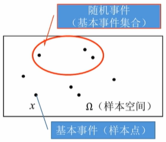

投色子出现1 属于**基本事件**。

多个事件合在一起就是**随机事件**。

所有事件合在一起就是**样本空间**。 样本空间概率为1

概率 $ P\left(x_{i}\right)=p \in[0,1] $，$ \sum_{i=1}^{\infty} P\left(x_{i}\right)=1 $

非负性，规范性。

---

#### 1.1. 随机试验

**随机试验**可以在相同的条件下，重复进行的，结果不是确定的。

例如扔色子

**基本事件** $ P(x=6)=0.17 $

**基本事件的集合** $ P(x>3)=P(x=4)+P(x=5)+P(x=6)=8.63 $

---

#### 1.2. 事件间的运算/关系

**运算**

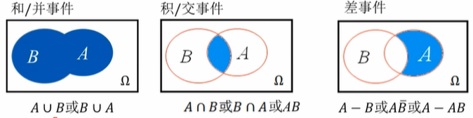
$$
\begin{equation}
 P(A \cup B)=P(A)+P(B)-P(A B) \\
 P(A \cap B)=P(A)-P(A-B)=P(B)-P(B-A)\\
 P(A-B)=P(A)-P(A \cap B) 
\end{equation}
$$

**关系**

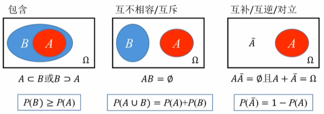

---

#### 1.3. 联合/边缘/条件概率

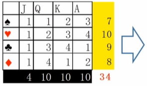

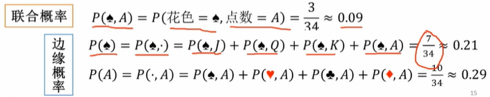

两种情况联合考虑，称为联合概率

在表的边缘，称为边缘概率。

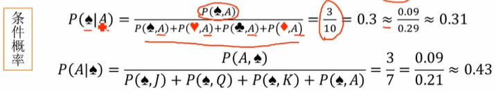

条件概率 = 联合概率 / 联合概率和

---

#### 1.4. 全概率/贝叶斯公式

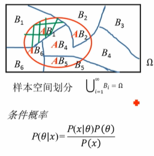

**全概率公式**

当 B 发生，它在 A 范围内的概率
$$
\begin{equation}
 P\left(B_{i}\right)>0: \\ P(A)=P\left(A \mid B_{1}\right) P\left(B_{1}\right)+\cdots+P\left(A \mid B_{n}\right) P\left(B_{n}\right) \\ \quad=\sum_{i=1}^{n} P\left(A \mid B_{i}\right) P\left(B_{i}\right) 
\end{equation}
$$
其中 $P(B_i)$ 称为先验概率，因为是 given $B_i$

**贝叶斯公式**

当 A 发生，它属于哪一块 B 的概率
$$
\begin{equation}
 P(A)>0, P\left(B_{i}\right)>0:\\ P\left(B_{i} \mid A\right)=\frac{P\left(A \mid B_{i}\right) P\left(B_{i}\right)}{\sum_{j=1}^{n} P\left(A \mid B_{j}\right) P\left(B_{j}\right)} 
\end{equation}
$$
分母是全概率，分子是某一个具体的 i 事件 

**贝叶斯公式的应用**

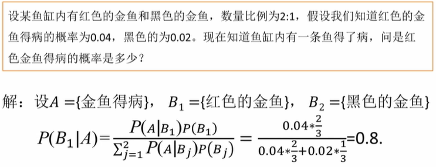

其中 两种金鱼得病的概率是先验概率

**全概率公式的应用**

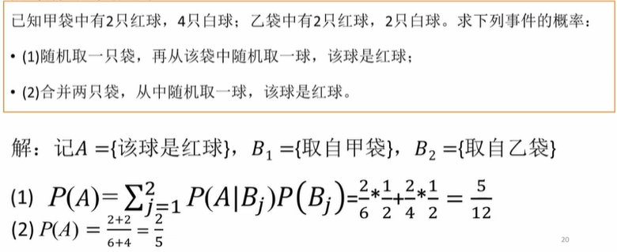

---

#### 1.5. （条件）独立性

**独立性**

若 $ \forall k \in\{1, \cdots, n\}, \quad i_{1}, i_{2}, \cdots, i_{k} $ 是 $ 1,2, \ldots n $ 中某 k 个不同的数
$$
\begin{equation}
 P\left(A_{i_{1}} A_{i_{2}} \ldots A_{i_{k}}\right)=P\left(A_{i_{1}}\right) P\left(A_{i_{2}}\right) \cdots P\left(A_{i_{k}}\right) 
\end{equation}
$$
则 $ A_{1}, A_{2}, \ldots, A_{n} $ 相互独立。

任意的k ，这些事件同时发生的联合概率，等于他们各自概率的乘积，则为这些事件相互独立。

**条件独立性**
$$
\begin{equation}
 P\left(A_{1}, A_{2} \mid A\right)=P\left(A_{1} \mid A\right) P\left(A_{2} \mid A\right) 
\end{equation}
$$
则 $ A_{1}, A_{2} $ 条件独立。

---

#### 1.6. 期望/方差/标准差/协方差

**期望**

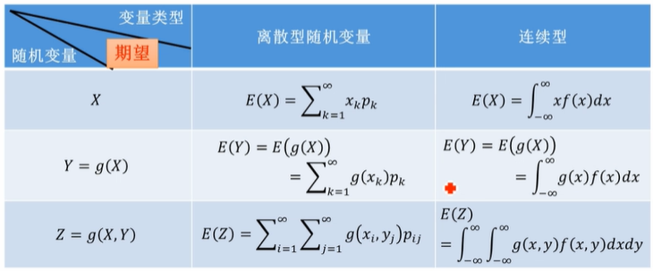

**方差/标准差**

方差表示数据的分散程度，对平均值的偏离程度。
$$
\begin{equation}
 \begin{aligned} D(X) &=\operatorname{Var}(X)=E\left\{\left[X-\left.E(X)]^{2}\right\}\right.\right.\\ &=E\left(X^{2}\right)-[E(X)]^{2} \end{aligned} 
\end{equation}
$$
标注差为方差的正平方根
$$
\begin{equation}
 \sigma=\sqrt{D(X)} 
\end{equation}
$$

**协方差**

表示两个随机变量的相关性，值越大，正相关性越强
$$
\begin{equation}
 \operatorname{Cov}(X, Y)=\sigma_{X Y}=E\{[X-E(X)][Y-E(Y)]\} \\
 =E(X, Y)-E(X) E(Y) 
\end{equation}
$$
特别的 $X = Y$ 时，即为自己的方差
$$
\begin{equation}
\operatorname{Cov}(X, X)=D(X)\\
\operatorname{Cov}(X, Y)=\operatorname{Cov}(Y, X)
\end{equation}
$$

**协方差矩阵**

两组随机变量之间的协方差的值的对称矩阵，对角元素为各个随机变量的方差（自身与自身），非对角元素为不同随机变量之间的协方差（自身与其它）

![[公式]](assets/equation-1617619906731.svg)

一种协方差矩阵是**对角阵**（变量相互**独立**），另一种是协方差矩阵是**非对角阵**（变量有**关联**）。

非相关数据 = 白数据

**相关系数**
$$
\rho_{X Y}=\frac{\sigma_{X Y}}{\sqrt{\sigma_{X X}} \sqrt{\sigma_{Y Y}}}
$$
协方差的值除以每一个随机变量的标准差，其中$|\rho_{X Y}|\leq1$，

正相关 $ \rho_{X X}=1$  ，负相关 $\rho_{X(-X)}=-1 $

希望不相关，这样就会简化很多运算。

---

#### 1.7. 协方差矩阵与二维高斯分布

- 协方差矩阵的对角线元素为 x 和 y 轴的方差
- 反斜对角线上的两个值为协方差，表明 x 和 y 的线性相关程度（正值时：x 增大，y 也随之增大；负值时：x 增大，y 随之减小）

如果高斯随机向量具有对角线的协方差矩阵（所有变量都是不相关的，那么概率密度函数曲面在XOY投影的椭圆曲线的两个轴**平行于坐标轴**。
$$
\begin{equation}
 \left[\begin{array}{cc}50 & 0 \\ 0 & 50\end{array}\right] \quad \quad\quad \left[\begin{array}{cc}10 & 0 \\ 0 & 10\end{array}\right] 
\end{equation}
$$
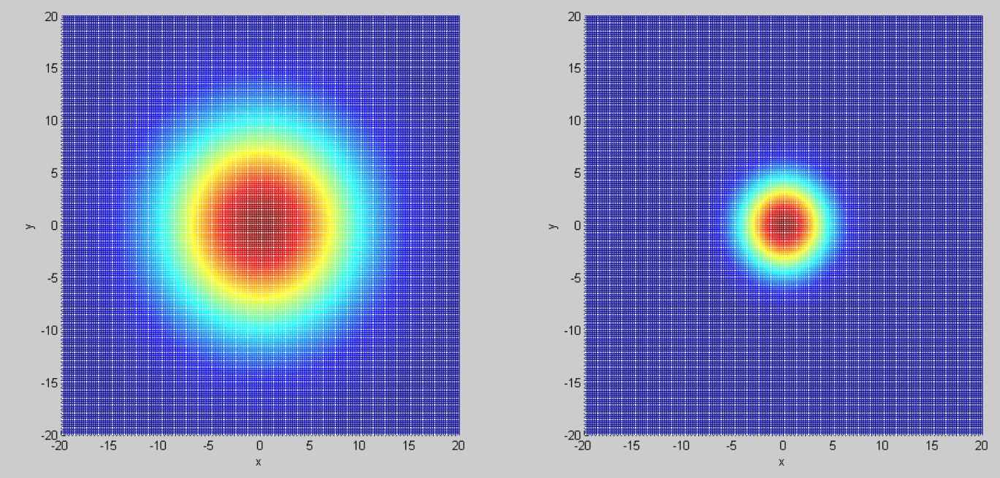

$$
\begin{equation}
 \left[\begin{array}{cc}5 & 0 \\ 0 & 1\end{array}\right] \quad \quad\quad \left[\begin{array}{cc}10 & 0 \\ 0 & 50\end{array}\right] 
\end{equation}
$$
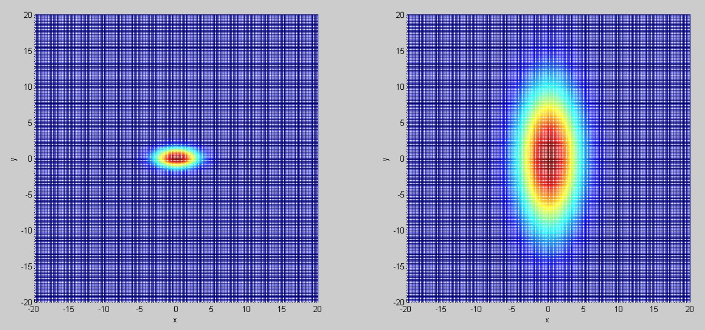

特征值D1和D2的比值越大，数据分布形状就越扁；当比值等于1时，此时样本数据分布为圆形。

如果高斯随机向量的协方差矩阵是非对角阵（一些变量是相关的），那么概率密度函数曲面在XOY投影的椭圆曲线的**两个轴**仍然是相互**垂直**，但与坐标轴并**不平行**。
$$
\begin{equation}
 \left[\begin{array}{cc}50 & -10 \\ -10 & 50\end{array}\right]  \quad \quad\quad \left[\begin{array}{cc}10 & -5 \\ -5 & 10\end{array}\right]
\end{equation}
$$
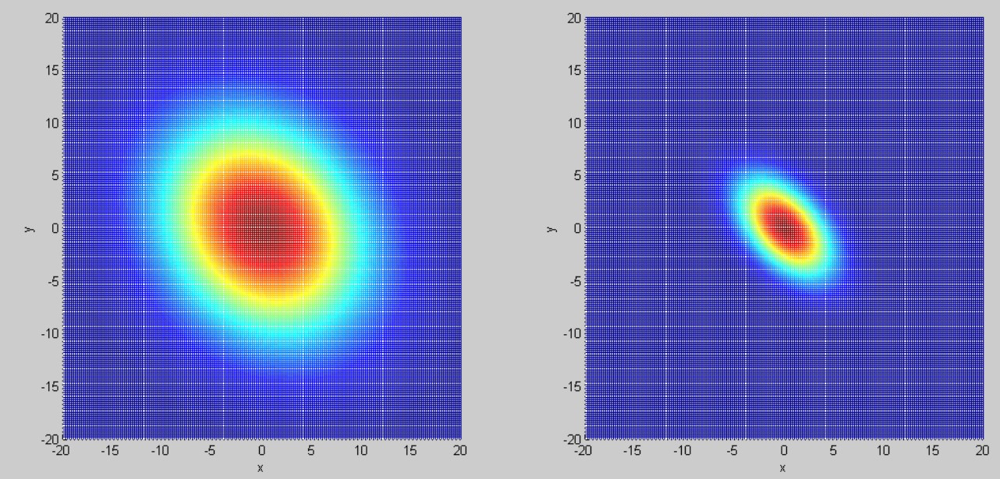

$$
\begin{equation}
 \left[\begin{array}{cc}50 & -30 \\ -30 & 50\end{array}\right] \quad\quad\quad \left[\begin{array}{cc}10 & -8 \\ -8 & 10\end{array}\right] 
\end{equation}
$$
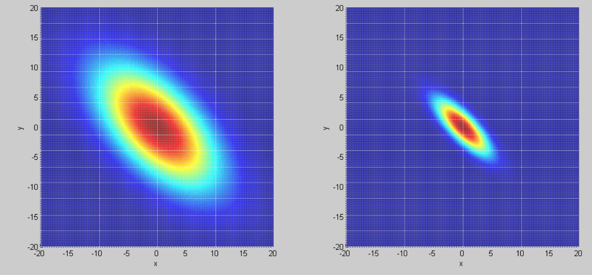

$$
\begin{equation}
 \left[\begin{array}{cc}50 & 10 \\ 10 & 50\end{array}\right] \quad\quad\quad \left[\begin{array}{cc}10 & 5 \\ 5 & 10\end{array}\right] 
\end{equation}
$$
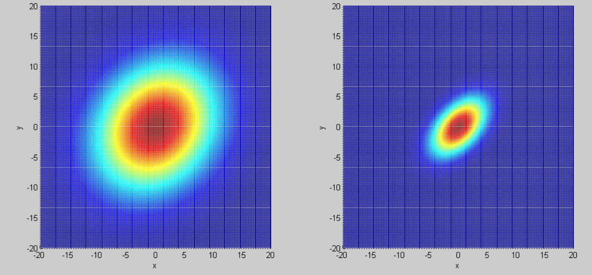

$$
\begin{equation}
 \left[\begin{array}{ll}50 & 30 \\ 30 & 50\end{array}\right] \quad\quad\quad \left[\begin{array}{cc}10 & 8 \\ 8 & 10\end{array}\right] 
\end{equation}
$$
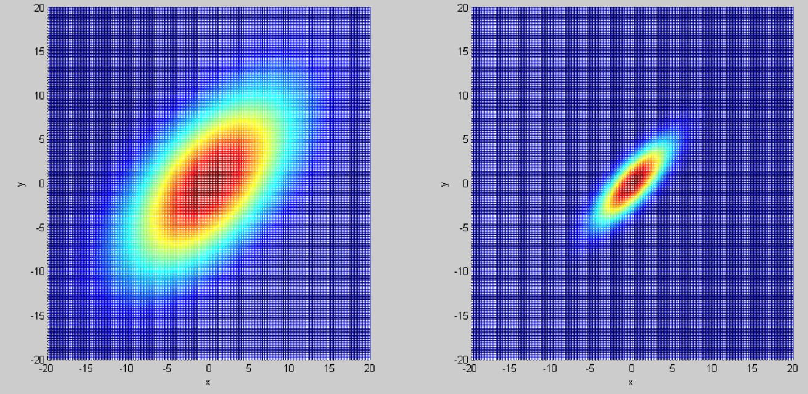

考虑极限情况，正相关就是 k>0 左下指向右上，负相关就是 k<0 右下指向左上

---

### 2. 单变量分布/多变量分布

**单变量分布**

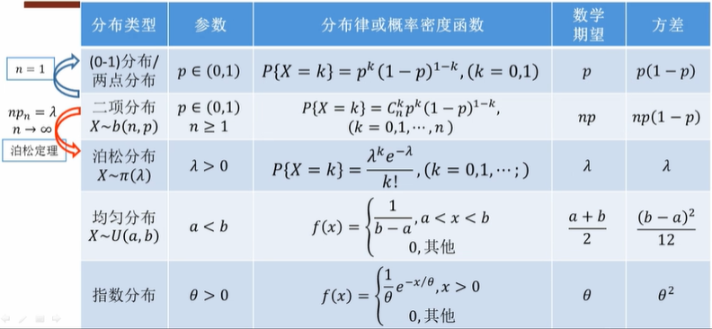

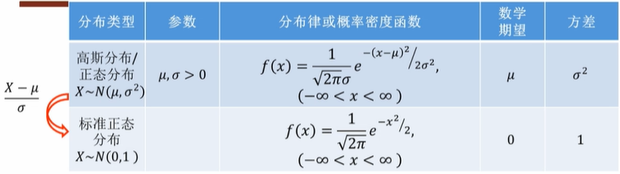

**多变量分布**

- 多项（m项）分布

$$
\begin{equation}
 P\left\{X_{1}=k_{1}, X_{2}=k_{2}, \cdots X_{m}=k_{m}\right\}=\frac{n !}{k_{1} ! k_{2} ! \cdots k_{m} !} p_{1}^{k_{1}} p_{2}^{k_{2}} \cdots p_{m}^{k_{m}} 
\end{equation}
$$

其中 $ \left(k_{1}+k_{2}+\cdots+k_{m}=n\right) $ ，$p_{1}^{k_{1}}$ 表示第一个随机变量发生的概率，$k_1$ 表示发生的次数。前提互相独立。

- m元正态分布

$$
\begin{equation}
 f(x)=\frac{1}{(\sqrt{2 \pi})^{m} \sqrt{\Sigma}} \exp \left\{\frac{-1}{2}(x-\mu)^{T} \Sigma^{-1}(x-\mu)\right\}, x \in \mathbb{R}^{m} 
\end{equation}
$$

---

### 3. 离散型/连续随机变量

**1. 离散型随机变量及分布律**

比如扔色子 $ P\{X=k\}=1 / 6,(k=1,2, \cdots 6) $

**CDF 累积分布函数** $ \underline{F(x)}=P\{\underline{X} \leq \underline{x}\} $
$$
\begin{equation}
 x_{1}<x_{2}: P\left(x_{1}<X \leq x_{2}\right)=F\left(x_{2}\right)-F\left(x_{1}\right) 
\end{equation}
$$

**2. 连续型随机变量与分布函数**

均匀分布 $ X \sim U(a, b) $

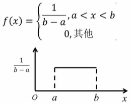
$$
\begin{equation}
 F(x)=\left\{\begin{array}{c}0, x<a \\ \frac{x-a}{b-a}, a \leq x<b \\ 1, x \geq b\end{array}\right\} 
\end{equation}
$$
**PDF 概率密度函数** $ \int_{-\infty}^{x} f(t) d t=F(x) $，如下图

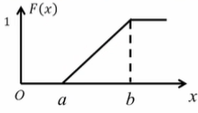

---

### 4. 参数估计与常见分布

#### **4.1. 二元变量分布**

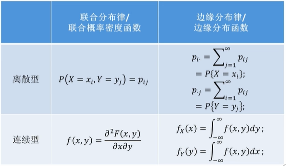

---

#### 4.2. 最大似然估计

Maximum Likelihood Estimation

前提：模型已定，参数未知

基本思想：选择参数的估计值，使观测到的样本出现的概率最大
$$
\begin{equation}
 \underset{\boldsymbol{\theta}}{\operatorname{argmax}} P(X \mid \theta) 
\end{equation}
$$
$X$ 出现的条件概率的最大值对应的 $\theta$ 

##### **MLE步骤**

第一步：构造似然函数

​	离散型：$ L(\boldsymbol{\theta})=\prod_{i=1}^{n} p\left(x_{i} ; \boldsymbol{\theta}\right) $

​	连续性：$ L(\boldsymbol{\theta})=\prod_{i=1}^{n} f\left(x_{i} ; \boldsymbol{\theta}\right) $

​	离散型是概率，连续型是概率密度函数。其中 $x_i$ 表示一个样本（y），每个样本间互相独立。

第二步：取对数

​	$ \ln L(\theta) $

第三步：对数似然函数的极大值点

​	- 求偏导：$ \frac{\partial \ln L(\theta)}{\partial \boldsymbol{\theta}} $

​	- 解方程组：$ \frac{\partial \ln L(\boldsymbol{\theta})}{\partial \boldsymbol{\theta}}=\mathbf{0} $

 

----

#### 4.3. 最大后验估计

Maximum a posteriori estimation

前提：模型一定，参数未知

基本思想：选择参数的估计值，使观测到的样本出现的概率最大

----

### 贝叶斯网络初步

---

### 信息论初步

