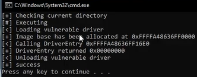
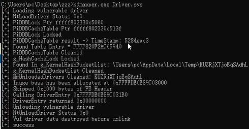

# OCR

https://github.com/thebesttv/PonyOCR

https://github.com/louis845/COMP2012H_Project

https://github.com/IshiKura-a/CPP_PROJECT_2020

https://github.com/itewqq/MathpixCsharp

https://github.com/xingchenzhao/MathFlow


# Pan

http://vip.fulivip.com/lin/GI5LG4?refer=1107


https://github.com/wuhuikai/PointCloudSuperResolution

https://github.com/krrish94/chamferdist

https://github.com/daerduoCarey/PyTorchEMD


cuda

https://github.com/praeclarumjj3/CuML

https://cloud.tencent.com/developer/article/1175256

https://github.com/depctg/udacity-cs344-colab

https://github.com/udacity/cs344


https://github.com/AnTao97/PointCloudDatasets

https://github.com/QingyongHu/SoTA-Point-Cloud


javascirpt可视化

https://github.com/verma/plasio

https://github.com/potree/PotreeConverter

https://github.com/potree/potree

https://github.com/tentone/potree-core

https://github.com/francisengelmann/PyViz3D


# Apex

## kdmapper

[KDMapper ](https://github.com/z175/kdmapper)is a [kernel](https://guidedhacking.com/threads/kernel-mode-drivers-info-for-anticheat-bypass.11325/) driver manual mapper using a vulnerable Intel Driver

- Utilizes an embedded vulnerable Intel driver
- Manually Maps your driver
- Provides a simple command line interface
- You just pass it 1 argument and you're driver is loaded


If you use KDMapper you must **bypass these kernel detections**

- PiDDBCacheTable
- MmUnloadedDrivers
- System thread detection
- System pool detection


This driver (iqvw64e.sys) comes as part of **Intel LAN drivers** and it allows to copy, read and write user/kernel memory, map physical memory and perform virtual to physical address translation.

Your driver must be compiled with /GS- option, and have custom **driver entry point defined**. (Basically the same kind of driver that you would use with drvmap or any other driver manual mapper)

https://github.com/TheCruZ/kdmapper

https://github.com/z175/kdmapper


### 编译

```c++
open .sln
release x64
build solution
you will get the kdmapper.exe in floder x64/Release
```


### 加载

每次重启电脑使用都需要加载  `driver.sys`

```shell
@echo off
cd %~dp0
echo [+] Checking current directory
echo [#] Executing
kdmapper.exe driver.sys
pause
```

加载时确定 origin 和 apex 是关闭的，使用管理员运行。




