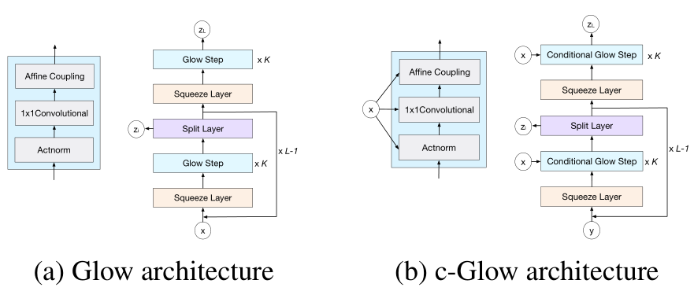

# Condition Flow

only for condition part

## *PUFlow

### 3.2. Normalizing Flows

标准化流是一系列可逆的分布变换。它通常用于通过简单的先验分布对难以处理的复杂分布进行建模。形式上，让 $ z \in \mathbb{R}^{D} $ 是一个具有已知密度分布 $ p_{\vartheta}(z) $ 的潜在变量，即 $ z \sim p_{\vartheta}(z) $ 。

在条件流设置的上下文中，给定观测数据集 $\mathcal{P}$，我们的目标是学习可逆变换 $ f_{\theta}(\cdot) $ 以将从 $\mathcal{P}$ 到易处理密度 $ p_{\vartheta}(z)$ 的映射参数化：
$$
\begin{equation}
 z=f_{\theta}(\mathcal{P} ; \mathcal{C}) 
\end{equation}
$$
其中 $ \mathcal{C}=\psi(\mathcal{P}) $，而 $\psi(\cdot) $ 是从 $\mathcal{P} $ 中提取条件特征的任意函数。在这里，我们将 $ f_{\theta}$ 定义为条件标准化流。请注意，$ f_{\theta}$ 通常由具有参数 $\theta$ 的神经网络参数化，并且是双射变换。也就是说，给定条件特征 $\mathcal{C}$ 和从 $ p_{\vartheta}(\hat{z}) $ 中提取的潜在变量 $ \hat{z} $，反函数 $ g_{\theta}(\cdot)=f_{\theta}^{-1}(\cdot) $ 隐式定义了映射
$$
\begin{equation}
 \hat{\mathcal{X}}=g_{\theta}(\hat{z} ; \mathcal{C}) 
\end{equation}
$$
其中 $\hat{\mathcal{X}}$ 是 $\mathcal{P} $ 的估计

由于单层流模型非线性能力有限，在实践中，流网络 $ f_{\theta}$ 由一系列 $L$ 个可逆层组成。 设 $h^{l}$ 为第 $l$ 个流层的输出，则 $h^{l+1}$ 定义为
$$
\begin{equation}
 h^{l+1}=f_{\theta}^{l}\left(h^{l} ; \mathcal{C}^{l}\right) 
\end{equation}
$$
其中 $f_{\theta}^{l}$ 是第 $l$ 个流层，$h^0=P$ ，$h^L=z$ ，$\mathcal{C}^{l}$ 是第 $l$ 层对应的条件特征。 随着 RealNvp 中变量公式和链式法则的变化，给定输入 $\mathcal{P}$ 的概率密度可以计算为
$$
\begin{equation}
 \log p(\mathcal{P} \mid \mathcal{C}, \theta)=\log p_{\vartheta}\left(f_{\theta}(\mathcal{P} ; \mathcal{C})\right)+\log \left|  \operatorname{det} \frac{\partial f_{\theta}}{\partial \mathcal{P}}(\mathcal{P} ; \mathcal{C})\right|  \\
 =\log p_{\vartheta}\left(f_{\theta}(\mathcal{P} ; \mathcal{C})\right)+\sum_{l=1}^{L} \log \left|\operatorname{det} \frac{\partial f_{\theta}^{l}}{\partial h^{l}}\left(h^{l} ; \mathcal{C}^{l}\right)\right| 
\end{equation}\tag{4}
$$
其中 $ \operatorname{det} \frac{\partial f_{\theta}}{\partial \mathcal{P}}(\mathcal{P} ; \mathcal{C}) $ 项是变换 $f_θ$ 的雅可比行列式，测量由 $f_θ$ 引起的体积变化 [35,NICE]。 

对于每个流层的式 4 的详细实现在第 4.2 节中讨论。

## *Generative Flows with Invertible Attentions

### 2. Related Work

早期的基于流的生成模型（如 [3、26、18、27]）被引入用于对真实数据对数似然的精确推断。 它们通常由一系列可逆变换构建，以将基本分布映射到复杂分布。

近年来，各种无条件生成流模型（如 [19、28、20、22] 不断涌现，以将早期的流模型扩展到具有分离耦合的多尺度架构，从而实现高效推理和采样。 例如，[19] 额外引入了可逆的 1 × 1 卷积来编码无条件设置的数据分布中的非线性。  [29] 引入了更通用的 d × d 可逆卷积来扩大感受野。  [28] 利用流层的残余块（即，一个灵活的变换族），其中只需要 Lipschitz 条件而不是严格的架构约束来强制可逆性。  [20]通过变分反量化、连续混合累积分布函数和自注意力改进耦合层。 自注意力直接应用于耦合层的内在神经功能。 由于仿射耦合层的性质，不需要注意是可逆的。

此外，这种直接注意应用程序仅学习通道方向流维度的两个分裂之一内的依赖关系，因此其感受野受到极大限制。 相比之下，我们引入的注意力是一个独立的流层，它应该是可逆的，并且可以跨不同的流特征图分割学习更一般和更远距离的依赖关系。 换句话说，[20] 对分割内的依赖进行建模，而我们的则学习交叉分割的相关性，因此两者是互补的。 最近，[22] 通过多尺度自回归先验对通道依赖建模。 引入的依赖建模受限于潜在空间，因此它可以补充我们对中间流维度的利用注意力。

另一方面，最近的条件流模型（如 [30-33, 6]）也已被探索，旨在条件图像合成。 例如，[30] 为源和目标开发了两个可逆网络以及一个将潜在空间相互映射的关系网络。 通过这种方式，可以在适当的层次结构级别利用条件信息，因此可以克服始终使用原始图像作为输入的限制。 

类似地，[32] 开发了一个并行序列的可逆映射，其中源流在每一步引导目标流。  

[33]另外引入了条件网络，允许目标域流中的所有操作以源域信息为条件。 

为了更好地运用条件，[6] 利用条件仿射耦合层，该层接受由一个外部神经网络提取的源域特征图作为条件。 为了从源域进行更直接的信息传输，[6] 引入了一个条件仿射注入器，它直接将条件提供给激活图中的所有通道和空间位置。 据我们所知，这些条件生成流模型很少学习长期依赖。

---

## *DUAL-GLOW_Conditional_Flow-Based_Generative_Model_for_Modality_Transfer

### 3. Deriving DUAL-GLOW

在这一节中，我们介绍了用于模态间传递的双GLOWframework。我们首先讨论了给定磁共振图像的正电子发射断层图像的条件分布的推导，然后提供了有效计算其对数似然的策略。然后，我们介绍了可逆流的构造和雅可比矩阵的计算。接下来，我们为我们的DUAL-GLOW框架构建了分层架构，与平面结构相比，这大大降低了计算成本。最后，用附加的鉴别器导出了辅助信息操作的条件结构。

**Log-Likelihood of the conditional Distribution.**

让 MR和PET图像相对应的数据被表示为 为D m和D p。从数据集D m = {x im } n i=1，我们有兴趣生成与数据集D p = {x ip } n i=1中的图像具有相同属性的图像。
在我们的DUAL-GLOW模型中，我们假设存在一个基于流动的可逆函数f p，它将PET图像x p映射到z p = f p (x p)，以及一个基于流动的可逆函数f m，它将MR图像x m映射到z m = f m (x m)。潜在变量z p和z m有助于建立一个条件概率p θ (z p |z m)，由以下公式给出

## *Structured Output Learning with Conditional Generative Flows

传统的结构化预测模型尝试学习条件似然，即 p(y|x)，以捕捉结构化输出 y 和输入特征 x 之间的关系。 对于许多模型，计算似然性是棘手的。 因此，这些模型很难训练，需要使用替代目标或变分推理来近似似然。 在本文中，我们提出了条件发光（c-Glow），一种用于结构化输出学习的条件生成流。  CGlow 受益于基于流的模型准确有效地计算 p(y|x) 的能力。 使用 c-Glow 学习不需要替代目标或在训练期间进行推理。 一旦经过训练，我们就可以直接有效地生成条件样本。 我们开发了一种基于样本的预测方法，可以利用这一优势进行高效有效的推理。 在我们的实验中，我们在五个不同的任务上测试了 c-Glow。  C-Glow 在某些任务中优于最先进的基线，并在其他任务中预测可比较的输出。 结果表明，c-Glow 是通用的，适用于许多不同的结构化预测问题。

### 3.2. Conditional Normalizing Flows

归一化流是可逆函数 f = f 1 ◦f 2 ◦···◦f M 的组合，它将目标代码转换为从简单分布中提取的潜在代码 z。 在条件归一化流（Trippe and Turner 2018）中，我们将每个函数重写为 $ f_{i}=f_{x, \phi_{i}} $，使其由 x 及其参数 φ i 参数化。 因此，随着变量公式的变化，我们可以将条件似然改写为 logp(y|x,θ) = logp Z (z) + M X i=1 log ?  ？  ∂f x,φ i ∂r i−1 ?  ?  , (1) 其中 r i = f φ i (r i−1 )，r 0 = x，并且 r M = z。

在本文中，我们通过使用归一化流来解决结构化输出问题。 也就是说，我们直接使用条件归一化流，即等式 1，来计算条件分布。 因此，可以通过局部优化精确似然来训练模型。 请注意，条件归一化流已用于条件密度估计。  Trippe and Turner (2018) 用它来解决一维回归问题。 我们的方法与他们的不同之处在于我们问题中的标签是高维张量而不是标量。 因此，我们将建立在最近开发的用于（无条件）基于流的高维数据生成模型的方法的基础上。

### 4.1 Conditional Glow

为了将 Glow 修改为条件生成流，我们需要为其三个组件添加条件架构：actnorm 层、1×1 卷积层和仿射耦合层。主要思想是使用神经网络，我们将其称为**条件网络 (CN)**，用于**为每一层生成参数权重**。 详细情况如下。

**Actnorm layers.** 每个激活归一化（actnorm）层使用两个1×c的参数，即一个尺度 s 和一个偏置 b，对激活进行仿射转换。该转换可以写成
$$
\begin{equation}
 u_{i, j}=s \odot v_{i, j}+b 
\end{equation}
$$
其中 $\odot$ 是逐元素点积

**Conditional actnorm**. actnorm 层的参数是两个 1 × c 向量，即尺度 s 和偏置 b。在条件 Glow 中，我们**使用 CN 生成这两个向量**，然后使用它们来仿射转换，即变为
$$
\begin{equation}
 s, b=\mathrm{CN}(x), \quad u_{i, j}=s \odot v_{i, j}+b 
\end{equation}
$$

---

**Invertible 1×1 convolutional layers**. 每个可反转的1x1卷积层都是一个泛化的操作。其函数格式为
$$
\begin{equation}
 u_{i, j}=W v_{i, j} 
\end{equation}
$$
其中 $W$ 是一个 $c×c$ 的权重矩阵。

**Conditional 1×1 convolutional**. 1×1 卷积层使用 $c × c$ 权重矩阵来置换每个空间维度的变量。在条件 Glow 中，我们使用一个条件网络来**生成这个W矩阵**：
$$
\begin{equation}
 W=\mathrm{CN}(x), \quad u_{i, j}=W v_{i, j} 
\end{equation}
$$

---

**Affine layers**. 与NICE和Real-NVP模型一样，Glow也有仿射耦合层来捕捉**空间维度之间的相关性**。它的转换是
$$
\begin{equation}
 \begin{array}{ll}v_{1}, v_{2}=\operatorname{split}(v), & s_{2}, b_{2}=\operatorname{NN}\left(v_{1}\right) \\ u_{2}=s_{2} \odot v_{2}+b_{2}, & u=\operatorname{concat}\left(v_{1}, u_{2}\right)\end{array} 
\end{equation}
$$
其中 NN 是一个神经网络，split()和concat()函数**沿通道维度进行操作**。 $s_2$ 和 $b_2$ 向量的大小与 $v_2$ 相同。

**Conditional affine coupling**. 仿射耦合层将输入变量分成两半，即 $v_1$ 和 $v_2$ 。 它使用 $v_1$ 作为神经网络的输入来生成 $v_2$ 的尺度和偏置参数。为了构建条件仿射耦合层，我们使用 CN 从 $x$ 中提取特征，然后将其**与 $v_1$ 连接以形成 NN 的输入**。
$$
\begin{equation}
 \begin{array}{ll}v_{1}, v_{2}=\operatorname{split}(v), & x_{r}=\mathrm{CN}(x) \\ s_{2}, b_{2}=\mathrm{NN}\left(v_{1}, x_{r}\right), & u_{2}=s_{2} \odot v_{2}+b_{2} \\ u=\operatorname{concat}\left(v_{1}, u_{2}\right) & \end{array} 
\end{equation}
$$
我们仍然可以使用多尺度架构来组合这些条件组件，以保持计算效率。 图 1 说明了用于比较的 Glow 和 c-Glow 架构。

由于在优化条件模型时条件网络不需要是可逆的，我们在这里定义了对其架构没有限制的通用方法。任何可微网络都足以并保持 c-Glow 计算每个输入-输出对的精确条件似然的能力。 我们将在 5.1 节中指定我们在实验中使用的架构。

**Fig. 1** Glow 和条件 Glow 的模型架构。对于每个模型，左边的子图是每个步骤的架构。架构，而右边的子图是整个架构。参数L代表层次的数量，K代表每个层次的深度。

### 4.2 Learning

为了学习模型参数，我们可以利用基于流的模型有效计算的对数似然。 在输出连续的情况下，似然计算是直接的。 因此，我们可以反向传播到微分精确的条件似然，即等式。  1，并使用梯度方法优化所有 c-Glow 参数。

在输出离散的情况下，我们遵循（Dinh、Sohl-Dickstein 和 Bengio 2016；Kingma 和 Dhariwal 2018；Ho 等人 2019）并在训练期间向 y 添加均匀噪声以对数据进行反量化。 此过程会扩充数据集并防止模型崩溃。 我们仍然可以使用反向传播和梯度方法来优化这种近似连续分布的可能性。 通过扩展 Theis、Oord 和 Bethge (2015) 以及 Ho 等人的证明。
   (2019)，我们可以证明离散分布受这种连续分布的下限。

稍微滥用符号，我们让 q(y|x) 是我们的离散假设分布，而 p(v|x) 是去量化的连续模型。 然后我们的目标是最大化似然 q，这可以通过将 v 的值边缘化为 y 来表示：

其中 d 是变量的维度，而 u 表示连续变量 v 和四舍五入的量化 y 之间的差异。

令 p d (x,y) 为真实数据分布，而 ˜ p d (x,y) 为反量化数据集的分布。 学习过程使 E ∼ p d (x,y) [logp(v|x)] 最大化。

因此，当 y 是离散的时，最大化连续似然 p(v|x) 的学习优化会最大化 q(y|x) 的下限。

### 4.3 Inference

Givenalearnedmodelp(y|x)，我们可以通过 c-Glow 单次前向传递进行高效采样。 我们首先计算给定 x 的变换函数，然后从 p Z (z) 中采样潜在代码 z。 最后，我们通过模型传播采样后的 z，我们得到相应的样本 y。 整个过程可以概括为

## * C-flow: Conditional generative flow models for images and 3d point clouds

---

## *Full-Glow: Fully conditional Glow for more realistic image generation

## *SRFlow: Learning the super-resolution space with normalizing flow

