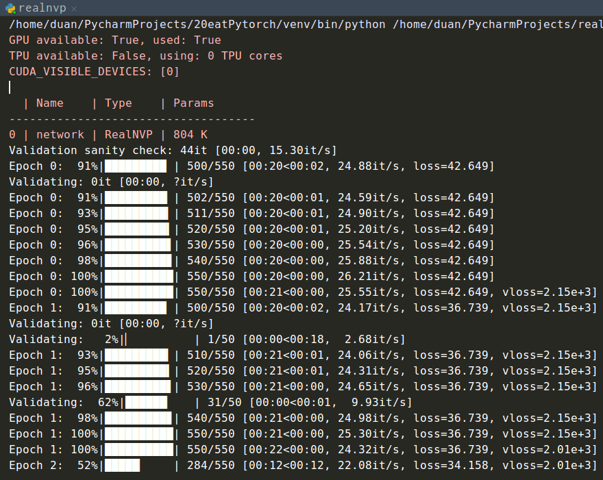

#　NICE 复现

```bash
docker run --runtime=nvidia --rm -it -w /home -v /home/duan/data:/home/data/ -v /tmp/.X11-unix:/tmp/.X11-unix -e DISPLAY=unix$DISPLAY -e GDK_SCALE -e GDK_DPI_SCALE nvidia/cudagl:duan

docker commit -p 578cdbcbaca7 nvidia/cudagl:duan
```


## NICE版

### train.py

```python
# dataset
transform = transforms.ToTensor()
dataset = datasets.MNIST(root='./data/mnist', train=True, transform=transform, download=True)
dataloader = torch.utils.data.DataLoader(dataset=dataset, batch_size=256, shuffle=True, pin_memory=True)

# model
model = NICE(data_dim=784, num_coupling_layers=4)
model.train()
opt = optim.Adam(model.parameters())

# train
for i in range(cfg['TRAIN_EPOCHS']):
  mean_likelihood = 0.0  
  num_minibatches = 0    

  for batch_id, (x, _) in enumerate(dataloader):   # 取出输入数据 x （256，1，28，28）
      x = x.view(-1, 784) + torch.rand(784) / 256. # x (256, 784) 因为channel为1 
      x = torch.clamp(x, 0, 1) 					   # 将input张量每个元素的夹紧到区间 [0, 1]

      z, likelihood = model(x)
      loss = -torch.mean(likelihood)   # NLL

      loss.backward()
      opt.step()
      model.zero_grad()

      mean_likelihood -= loss
      num_minibatches += 1

  mean_likelihood /= num_minibatches
  print('Epoch {} completed. Log Likelihood: {}'.format(i, mean_likelihood))

  if epoch % 5 == 0:
    save_path = os.path.join(cfg['MODEL_SAVE_PATH'], '{}.pt'.format(epoch))
    torch.save(model.state_dict(), save_path)


```


### nice.py

#### class NICE

```python
class NICE(nn.Module):
  def __init__(self, data_dim, num_coupling_layers=3): # 耦合层3层
    super().__init__()

    self.data_dim = data_dim # 数据维度 784 

    # alternating mask orientations for consecutive coupling layers 连续耦合层的交替掩模方向
    masks = [self._get_mask(data_dim, orientation=(i % 2 == 0))
                                            for i in range(num_coupling_layers)]
	# 耦合层
    self.coupling_layers = nn.ModuleList([CouplingLayer(data_dim=data_dim,
                                			hidden_dim=100, mask=masks[i], num_layers=4) 
                                          for i in range(num_coupling_layers)])
	# 缩放层
    self.scaling_layer = ScalingLayer(data_dim=data_dim)
	
    # 先验 对数分布
    self.prior = LogisticDistribution()

  def forward(self, x, invert=False):
    if not invert:							# 是否逆即用来生成
      z, log_det_jacobian = self.f(x)		# 输入真实数据
      log_likelihood = torch.sum(self.prior.log_prob(z), dim=1) + log_det_jacobian # 第一部分为
      return z, log_likelihood

    return self.f_inverse(x)

  def f(self, x):
    z = x						# 保证维数相同
    log_det_jacobian = 0		# 雅克比矩阵的行列式的对数
    for i, coupling_layer in enumerate(self.coupling_layers): 	# 流过联合起来的耦合层
      z, log_det_jacobian = coupling_layer(z, log_det_jacobian)	# 
    z, log_det_jacobian = self.scaling_layer(z, log_det_jacobian)
    return z, log_det_jacobian

  def f_inverse(self, z):
    x = z
    x, _ = self.scaling_layer(x, 0, invert=True)
    for i, coupling_layer in reversed(list(enumerate(self.coupling_layers))):
      x, _ = coupling_layer(x, 0, invert=True)
    return x

  def sample(self, num_samples):
    z = self.prior.sample([num_samples, self.data_dim]).view(self.samples, self.data_dim)
    return self.f_inverse(z)

  def _get_mask(self, dim, orientation=True):
    mask = np.zeros(dim)
    mask[::2] = 1. 		   # 中间隔1个step赋值 [0 1 0 1 0 1] 
    if orientation:		   # 是否需要换向
      mask = 1. - mask     # flip mask orientation 反转方向
    mask = torch.tensor(mask)
    if cfg['USE_CUDA']:
      mask = mask.cuda()
    return mask.float()
```


### modules.py

#### class CouplingLayer

```python
class CouplingLayer(nn.Module):
  """
  Implementation of the additive coupling layer from section 3.2 of the NICE
  paper.
  """

  def __init__(self, data_dim, hidden_dim, mask, num_layers=4): #这里的num是全连接层数不是耦合层数
    super().__init__()

    assert data_dim % 2 == 0

    self.mask = mask

    modules = [nn.Linear(data_dim, hidden_dim), nn.LeakyReLU(0.2)] # 784维升到1000维度
    for i in range(num_layers - 2):
      modules.append(nn.Linear(hidden_dim, hidden_dim))
      modules.append(nn.LeakyReLU(0.2))
    modules.append(nn.Linear(hidden_dim, data_dim))

    self.m = nn.Sequential(*modules)

  def forward(self, x, logdet, invert=False):
    if not invert: 						#不为逆的学习过程
      x1, x2 = self.mask * x, (1. - self.mask) * x      # 将输入按索引分成两部分
      y1, y2 = x1, x2 + (self.m(x1) * (1. - self.mask)) # y1直接复制x1  y2=m(x1)+x2取后半部分
      return y1 + y2, logdet

    # Inverse additive coupling layer 	#逆的生成过程
    y1, y2 = self.mask * x, (1. - self.mask) * x
    x1, x2 = y1, y2 - (self.m(y1) * (1. - self.mask))
    return x1 + x2, logdet
```


#### class ScalingLayer

```python
class ScalingLayer(nn.Module):
  """
  Implementation of the scaling layer from section 3.3 of the NICE paper.
  """
  def __init__(self, data_dim):
    super().__init__()
    self.log_scale_vector = nn.Parameter(torch.randn(1, data_dim, requires_grad=True)) # 标准正态分布 size(1, data_dim)

  def forward(self, x, logdet, invert=False):
    log_det_jacobian = torch.sum(self.log_scale_vector) # 独立分量 log后可相加

    if invert:
        return torch.exp(- self.log_scale_vector) * x, logdet - log_det_jacobian

    return torch.exp(self.log_scale_vector) * x, logdet + log_det_jacobian
```


#### class LogisticDistribution

```python
class LogisticDistribution(Distribution):
  def __init__(self):
    super().__init__()

  def log_prob(self, x):
    return -(F.softplus(x) + F.softplus(-x))

  def sample(self, size):
      z = Uniform(torch.cuda.FloatTensor([0.]), torch.cuda.FloatTensor([1.])).sample(size)

    return torch.log(z) - torch.log(1. - z)
```


---

### summary

#### coupling layer

```python
input 	[1, 784]
output 	[1, 784]
5个全连接层-leakyrelu + 1个全连接层
----------------------------------------------------------------
        Layer (type)               Output Shape         Param #
================================================================
            Linear-1              [-1, 1, 1000]         785,000
         LeakyReLU-2              [-1, 1, 1000]               0
            Linear-3              [-1, 1, 1000]       1,001,000
         LeakyReLU-4              [-1, 1, 1000]               0
            Linear-5              [-1, 1, 1000]       1,001,000
         LeakyReLU-6              [-1, 1, 1000]               0
            Linear-7              [-1, 1, 1000]       1,001,000
         LeakyReLU-8              [-1, 1, 1000]               0
            Linear-9              [-1, 1, 1000]       1,001,000
        LeakyReLU-10              [-1, 1, 1000]               0
           Linear-11               [-1, 1, 784]         784,784
================================================================
Total params: 5,573,784
Trainable params: 5,573,784
Non-trainable params: 0
----------------------------------------------------------------
Input size (MB): 0.002991
Forward/backward pass size (MB): 0.082275
Params size (MB): 21.262299
Estimated Total Size (MB): 21.347565
----------------------------------------------------------------
```


---

#### all

```python
input 	[1, 784]
output 	[1, 784]
4个coupling layer + 1个scaling layer
----------------------------------------------------------------
        Layer (type)               Output Shape         Param #
================================================================
            Linear-1              [-1, 1, 1000]         785,000
         LeakyReLU-2              [-1, 1, 1000]               0
            Linear-3              [-1, 1, 1000]       1,001,000
         LeakyReLU-4              [-1, 1, 1000]               0
            Linear-5              [-1, 1, 1000]       1,001,000
         LeakyReLU-6              [-1, 1, 1000]               0
            Linear-7              [-1, 1, 1000]       1,001,000
         LeakyReLU-8              [-1, 1, 1000]               0
            Linear-9              [-1, 1, 1000]       1,001,000
        LeakyReLU-10              [-1, 1, 1000]               0
           Linear-11               [-1, 1, 784]         784,784
----------------------------------------------------------------
           Linear-12              [-1, 1, 1000]         785,000
        LeakyReLU-13              [-1, 1, 1000]               0
           Linear-14              [-1, 1, 1000]       1,001,000
        LeakyReLU-15              [-1, 1, 1000]               0
           Linear-16              [-1, 1, 1000]       1,001,000
        LeakyReLU-17              [-1, 1, 1000]               0
           Linear-18              [-1, 1, 1000]       1,001,000
        LeakyReLU-19              [-1, 1, 1000]               0
           Linear-20              [-1, 1, 1000]       1,001,000
        LeakyReLU-21              [-1, 1, 1000]               0
           Linear-22               [-1, 1, 784]         784,784
----------------------------------------------------------------
           Linear-23              [-1, 1, 1000]         785,000
        LeakyReLU-24              [-1, 1, 1000]               0
           Linear-25              [-1, 1, 1000]       1,001,000
        LeakyReLU-26              [-1, 1, 1000]               0
           Linear-27              [-1, 1, 1000]       1,001,000
        LeakyReLU-28              [-1, 1, 1000]               0
           Linear-29              [-1, 1, 1000]       1,001,000
        LeakyReLU-30              [-1, 1, 1000]               0
           Linear-31              [-1, 1, 1000]       1,001,000
        LeakyReLU-32              [-1, 1, 1000]               0
           Linear-33               [-1, 1, 784]         784,784
----------------------------------------------------------------
           Linear-34              [-1, 1, 1000]         785,000
        LeakyReLU-35              [-1, 1, 1000]               0
           Linear-36              [-1, 1, 1000]       1,001,000
        LeakyReLU-37              [-1, 1, 1000]               0
           Linear-38              [-1, 1, 1000]       1,001,000
        LeakyReLU-39              [-1, 1, 1000]               0
           Linear-40              [-1, 1, 1000]       1,001,000
        LeakyReLU-41              [-1, 1, 1000]               0
           Linear-42              [-1, 1, 1000]       1,001,000
        LeakyReLU-43              [-1, 1, 1000]               0
           Linear-44               [-1, 1, 784]         784,784
----------------------------------------------------------------
     ScalingLayer-45               [-1, 1, 784]             784
================================================================
Total params: 22,295,920
Trainable params: 22,295,920
Non-trainable params: 0
----------------------------------------------------------------
Input size (MB): 0.002991
Forward/backward pass size (MB): 0.335083
Params size (MB): 85.052185
Estimated Total Size (MB): 85.390259
----------------------------------------------------------------
```


## 补充

### softplus

​	softplus 函数可以用来产生正态分布的均值和标准差，因为它的范围是(0，∞)。
$$
\text{Softplus}(x) = \frac{1}{\beta}  \log(1 + \exp(\beta  x))​
$$


---

## pytorch版

输入参数

```python
parser.add_argument('--dataset',help='dataset to be modeled.',type=str,default='mnist')
parser.add_argument('--batch_size',help='number of images in a mini-batch.',type=int,default=200)
parser.add_argument('--latent',help='latent distribution.',type=str,default='logistic')
parser.add_argument('--max_iter',help='maximum number of iterations.',type=int,default=50)
parser.add_argument('--sample_size',help='number of images to generate.',type=int,default=64)
parser.add_argument('--lr',help='initial learning rate.',type=float,default=1e-3)
parser.add_argument('--momentum',help='beta1 in Adam optimizer.',type=float,default=0.9)
parser.add_argument('--decay',help='beta2 in Adam optimizer.',type=float,default=0.999)
parser.add_argument('--coupling',help='.',type=int,
                        default=4)
parser.add_argument('--save-every',
                        help='every how many epochs to save the model',
                        type=float,
                        default=5)
parser.add_argument('--coup-type',
                        help="coupling type",
                        type=str,
                        default="additive")
parser.add_argument('--mid-dim',
                        help='.',
                        type=int,
                        default=1000)
parser.add_argument('--hidden',
                        help='.',
                        type=int,
                        default=5)
```


