# ICML

# INNF+ 2019

## Tutorial on normalizing flows

Normalising Flow

• “Normalising” means that the change of variables gives a normalised density after applying an invertible transformation.
• “Flow” means that the invertible transformations can be composed with each other to create more complex invertible transformations.

• “标准化”意味着在应用**可逆变换后**，变量的变化给出了**标准化的密度**。

• “流”意味着可逆变换可以**相互组合**以创建更复杂的可逆变换。

**unconditional generative model $p(x)$​**

- sampling from prior
- anomaly detection 异常检测
- inferring latent variables

**conditional generative model $p(y|x)$**

- classification
- regression
- imputation 添补

distributions capture uncertainty, multi-modality, information分布捕捉不确定性、多模态、信息

generative models bridge ML with intuition from information theory生成模型将机器学习与信息论的直觉联系起来

- a distribution implies a lossless, alphabet-agnostic compression algorithm分布意味着无损、与字母表无关的压缩算法
- how many bits of information are in the training set vs. the test set 训练集与测试集中的信息位数

### preliminaries: change of variables

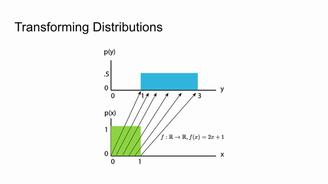

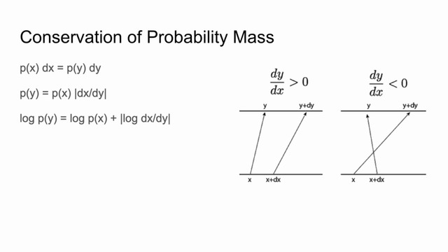

parallelogram 平行四边形

Sending a little chunk of probability mass to a different space requires the amount of mass to stay the same.

将一小块概率质量发送到不同的空间需要质量保持不变。

### Normalizing Flows: Main Idea

- taking some distribution X whose $log p(x)$ we can compute easily
- learn some function f(x) where sampling: y = f(x)
- learn its inverse f^-1(y) to transform points in Y back to the domain of X.
- density evaluation log p(y) = log p(x ) + |log det J(f^-1)(y)|, which can be optimized via SGD methods
- **Key challenge** in designing flows: **keep computation of inverse** f^-1 and **inverse-log-det-Jacobian tractable**
- common choice: triangular maps

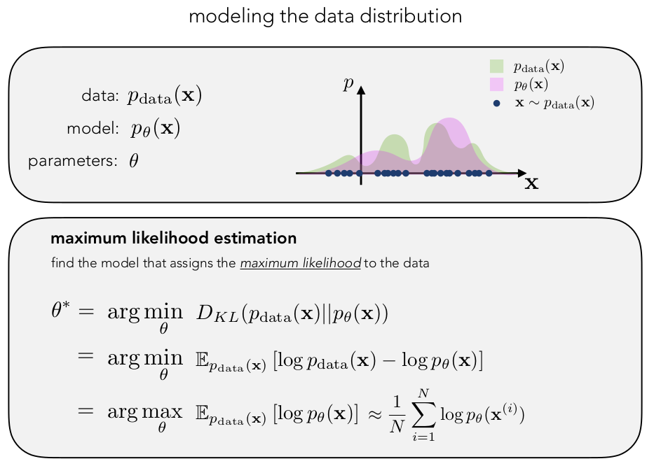

**conditioning**

- IAF, PixelCNN++, etc.: Condition the shift-and-log-scale functions 条件化偏移和尺度函数
- Glow: Compute average latent direction (zpos - zneg) for positive and negative labels.
- Can combine conditioning context directly, but make sure Jacobian remains tractable! 可以直接结合条件上下文，但要确保雅可比行列式仍然易于处理！

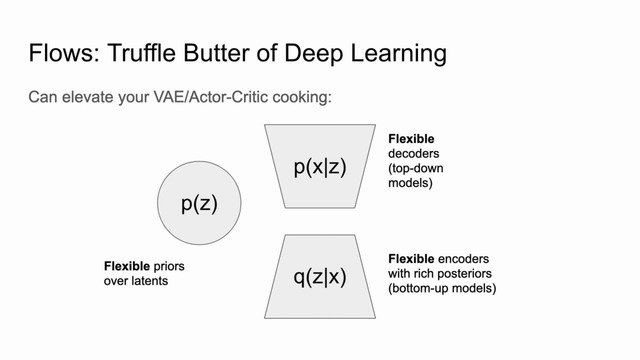

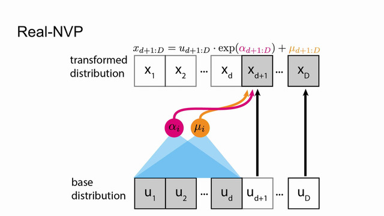

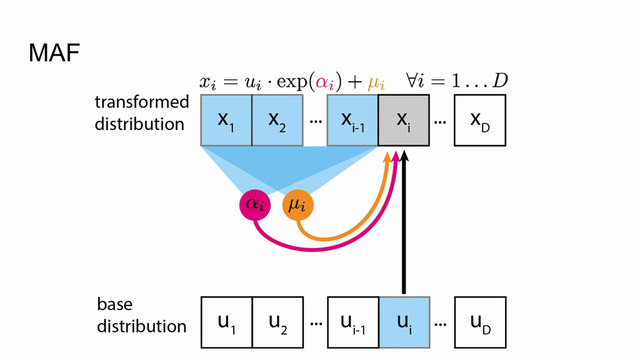

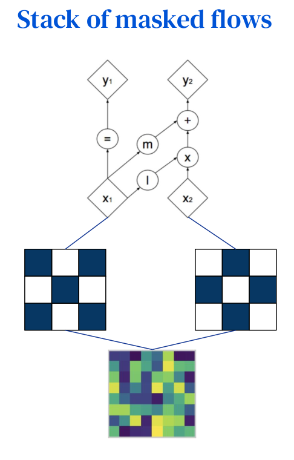

glow 初始化

ActNorm                     Data-dependent 数据依赖、数据相似性

1x1 Conv                    Random Rotation Matrix  随机旋转矩阵

Affine Coupling         Zero Initialization 零初始化

activation normalization 激活标准化，类似批归一化，批归一化添加的激活噪声的方差与GPU或其他处理单元（PU）的小批量大小成反比，造成了性能上的下降，而actnorm使用每个通道的标度和偏差参数执行激活的仿射变换，类似于批量标准化，初始化这些参数，使得在给定初始数据小批量的情况下，每个通道的后行为动作具有零均值和单位方差。初始化后，标度和偏差被视为与数据无关的常规可训练参数。actnorm就是对输入数据做预处理

1x1 conv 权重矩阵被初始化为随机旋转矩阵。具有相等数量的输入和输出通道的1x1卷积是置换操作的概况。通过矩阵的简化计算，可以简化整体的计算量

affine coupling 零初始化，用零初始化每个NN的最后一个卷积，使得每个仿射耦合层最初执行一个同一性函数，有助于训练深层网络。

### Continuous-Time Flows & FFJORD

- Not all maps need to be triangular! 并非所有映射都需要是三角矩阵
- First proposed in [Neural ODEs](https://arxiv.org/abs/1806.07366) (Chen et al. 2018), subsequently refined in Grathwohl et al. 2019
- Main idea: instead of learning triangular map with a tractable jacobian determinant, learn the jacobian and put it into a differentiable integrator to recover f!  不是学习带有易处理的雅可比行列式的三角矩阵，而是**学习雅可比并将其放入可微积分器中以恢复 f**！

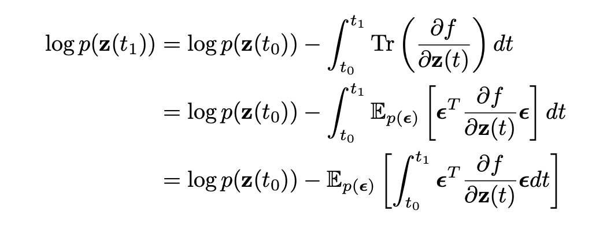

### tips & tricks

- Initialization and architecture design are important!   初始化和架构设计很重要！
- If NaNs, try decreasing depth of coupling layers (and increase width). 尝试减少耦合层的深度（并增加宽度）
- Check histogram of log-likelihoods at initialization don’t have extremely small values 在初始化时检查对数似然的直方图没有非常小的值
- MNIST: report nats = logep(y)
- Cifar10, SVHN, ImageNet, etc: report bits-per-pixel  报告每像素位数 bpd
- Isotropic Gaussian is a common choice of prior, but you can choose others (e.g. logistic)  各向同性高斯是先验的常见选择

**Info Theory: Probability + Compression** 信息理论、概率+压缩

- Entropy encoding: treat messages that you might want to compress/send as being sampled randomly from some distribution p(x).   熵编码：将您可能想要压缩的消息视为从某个分布 p(x) 中随机采样。
- Entropy $H(p) = E_{p(x)}[-log_b p(x)]$ is the **average negative log p(x)** over a data distribution.
  - Logarithm base b == number of symbols for output code (e.g. 2 for binary encoding).
- Shannon’s Source Coding Theorem (1948): H(p) is the **lower bound on average code length**平均码长的下限
  - Uniform distribution (max entropy): H(Cat([1/6]*6)) = 2.58 = log26
  - E.g. Entropy of Cat([0.8, .1, 0.25, .025, .025, .025]) = 1.48 
- If average code length for a pixel from ImageNet dataset is 4 bits, you can theoretically use p(x) to build a compression scheme that compresses dataset into 50% the size. 如果来自 ImageNet 数据集的像素的**平均码长为 4 位**，则**理论上**可以使用 p(x) 来构建压缩 **将数据集压缩到 50%** 大小的方案。

**Dequantization去量化**

- Data is discrete (e.g. RGB pixels stored as 8-bit integers), but our models usually express density functions 数据是离散的（例如，RGB 像素存储为 8 位整数），但我们的模型通常表示密度函数 
- Standard practice: via Jensen’s Inequality E[log p(x)] ≤ log E[p(x)], Continuous **log p(y) density is lower bound of discrete** **log p(x) mass.** Optimizing log p(y) also optimizes log p(x). 通过 Jensen 不等式 E[log p(x)] ≤ log E[p(x)]，连续log p(y) 密度是离散的下限log p(x) 质量。 优化 log p(y) 也优化 log p(x)。
- Papers report **log p(y)**

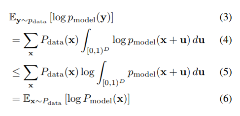

完全因式分解意味着如果将 x 映射到 z，它自然会沿着独立维度解开，这就是 NICE 双射器起源于独立分量分析、变分推理等的原因。

**Modeling RGB Images**

- **bits-per-pixel** **/ bits-per-dim** = log2p(y)/D
  - E.g. If bpp=3 for Cifar10, you can compress every 8 bits in Cifar10 to 3 bits.
  - Median JPEG bpp at quality=100 is about 1.37!! 
- Don’t forget to account for your model’s data scaling transform when computing p(xc)  在计算 p(xc) 时不要忘记考虑模型的数据缩放变换

### challenge

- **Challenge: Surpassing Autoregressive Models**

挑战：超越自回归模型

- **Challenge: Parameter Efficiency**

挑战：参数效率

Flow-based models still underfit. Also related to parallelism.

流模型仍然欠拟合,  也与并行性有关。

**Desiderata for flow models**

- Simple prior π(z) that allows for efficient sampling and tractable likelihood evaluation. E.g., Gaussian简单的先验 π(z)，允许进行有效的采样和易处理的似然评估
- Invertible transformations 可逆变换
- Computing likelihoods also requires the evaluation of determinants of n×n Jacobian matrices, where n is the data dimensionality
  - Computing the determinant for an n×n matrix is O(n^3): prohibitively expensive within a learning loop!
  - Key idea: Choose transformations so that the resulting Jacobian matrix has special structure. For example, the determinant of a triangular matrix is the product of the diagonal entries, i.e., an O(n) operation选择变换使生成的雅可比矩阵具有特殊结构。 例如，三角矩阵的行列式是对角线项的乘积，即 O(n) 运算

---

## Normalizing Flows on Tori and Spheres, ICML2020

**Probability distributions on:**

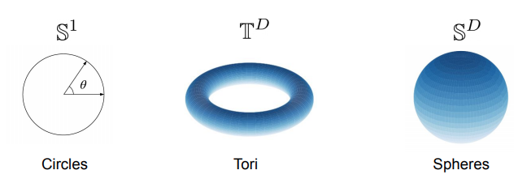

- As flexible as we like  随心所欲
- Any dimension D we like 我们喜欢的任何维度D
- With efficient and exact density evaluation and sampling 具有高效准确的密度评估和采样

**Why circles, tori and spheres?**

Not all data are Euclidean! 并非所有数据都是欧几里得的！

**Physics application: Estimating free energy**

物理应用：估计自由能量

### **Flows on the circle**

**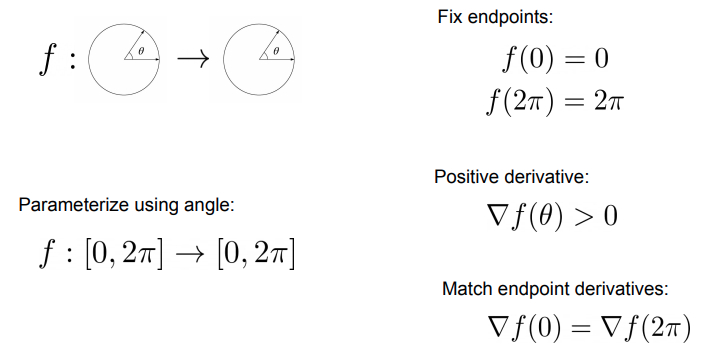**

**Flows on the circle: Three ways**

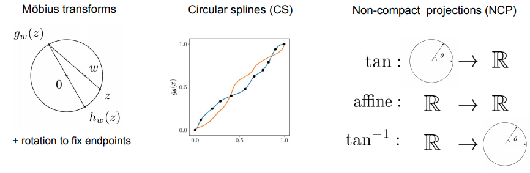

- Möbius transforms 莫比乌斯变换
- Circular splines (CS) 圆形样条 (CS) 
- Non-compact projections (NCP)非紧凑投影 (NCP)

**Expressive flows on circle: Mixtures**

circle上的表现力流：混合物

Composing Möbius (or NCP) transformations does not increase expressivity since they form a group. 组合 Möbius（或 NCP）变换不会增加表现力，因为它们形成了一个组。Instead, we propose an efficient method to create mixtures of them. 

Assume 

● N flows on $S^1$ 

● Define $f_k(0) = 0, f_k(2\pi)=2\pi, \nabla f_k(0) = \nabla f_k(2\pi)$
$$
f(\theta)=\frac{1}{N}\sum_k f_k(\theta)
$$
Still a valid diffeomorphism of $S^1$ with tractable Jacobian!

仍然是 $S^1$ 的有效微分同胚，具有可处理的雅可比行列式！

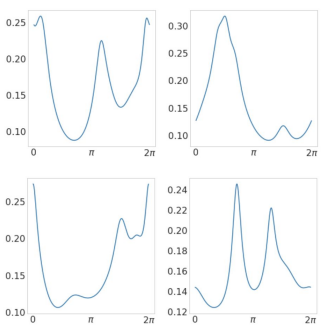

---

### Flows on tori

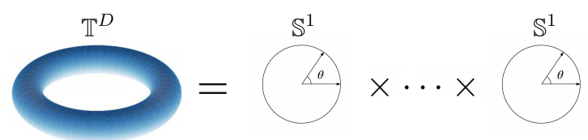
$$
p(\theta_1,\dots,\theta_D)=\prod_i p(\theta_i|\theta_1,\dots,\theta_{i-1})
$$
Autoregressive flow whose conditionals are circle flows (Möbius, CS or NCP)

条件为循环流的自回归流（莫比乌斯、CS 或 NCP）

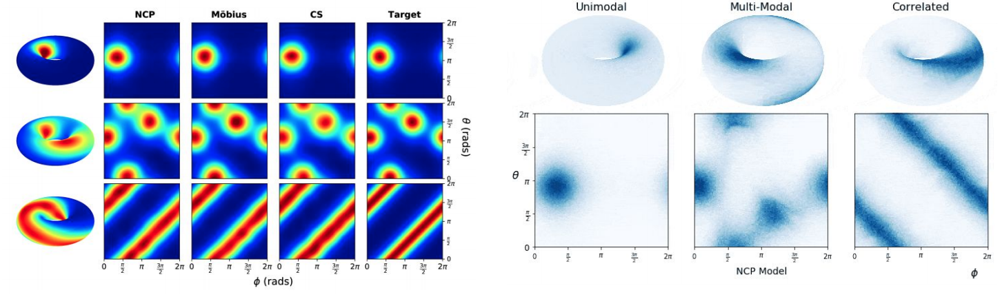

----

## Poster Spotlights

In [Invertible Neural Networks and Normalizing Flows](https://icml.cc/Conferences/2019/Schedule?showParentSession=3521)

Sat Jun 15 10:50 AM -- 11:30 AM (PDT) @ None

poster session I

In [Invertible Neural Networks and Normalizing Flows](https://icml.cc/Conferences/2019/Schedule?showParentSession=3521)

Nicholas Rhinehart · Yunhao Tang · Vinay Prabhu · Dian Ang Yap · Alexander Wang · Marc Finzi · Manoj Kumar · You Lu · Abhishek Kumar · Qi Lei · Michael Przystupa · Nicola De Cao · Polina Kirichenko · Pavel Izmailov · Andrew Wilson · Jakob Kruse · Diego Mesquita · Mario Lezcano Casado · Thomas Müller · Keir Simmons · Andrei Atanov

Sat Jun 15 11:30 AM -- 11:50 AM (PDT) @ None

Building a tractable generator network

In [Invertible Neural Networks and Normalizing Flows](https://icml.cc/Conferences/2019/Schedule?showParentSession=3521)

[ Video »](https://slideslive.com/38916690/invited-talk?t=197) 

Sat Jun 15 11:50 AM -- 12:10 PM (PDT) @ None

Glow: Generative Flow with Invertible 1x1 Convolutions

In [Invertible Neural Networks and Normalizing Flows](https://icml.cc/Conferences/2019/Schedule?showParentSession=3521)

Prafulla Dhariwal

[ Video »](https://slideslive.com/38916690/invited-talk?t=1505) 

Sat Jun 15 12:10 PM -- 12:30 PM (PDT) @ None

Contributed talk

In [Invertible Neural Networks and Normalizing Flows](https://icml.cc/Conferences/2019/Schedule?showParentSession=3521)

[ Video »](https://slideslive.com/38916690/invited-talk?t=2843) 

Sat Jun 15 02:00 PM -- 02:20 PM (PDT) @ None

Householder meets Sylvester: Normalizing flows for variational inference

In [Invertible Neural Networks and Normalizing Flows](https://icml.cc/Conferences/2019/Schedule?showParentSession=3521)

[ Video »](https://slideslive.com/38916693/invertible-neural-networks-and-normalizing-flows-200pm?t=0) 

Sat Jun 15 02:20 PM -- 02:40 PM (PDT) @ None

Neural Ordinary Differential Equations for Continuous Normalizing Flows

In [Invertible Neural Networks and Normalizing Flows](https://icml.cc/Conferences/2019/Schedule?showParentSession=3521)

[ Video »](https://slideslive.com/38916693/invertible-neural-networks-and-normalizing-flows-200pm?t=1291) 

Sat Jun 15 02:40 PM -- 03:00 PM (PDT) @ None

Contributed talk

In [Invertible Neural Networks and Normalizing Flows](https://icml.cc/Conferences/2019/Schedule?showParentSession=3521)

[ Video »](https://slideslive.com/38916693/invertible-neural-networks-and-normalizing-flows-200pm?t=2453) 

Sat Jun 15 03:00 PM -- 04:00 PM (PDT) @ None

poster session II

In [Invertible Neural Networks and Normalizing Flows](https://icml.cc/Conferences/2019/Schedule?showParentSession=3521)

Sat Jun 15 04:00 PM -- 04:20 PM (PDT) @ None

The Bijector API: An Invertible Function Library for TensorFlow

In [Invertible Neural Networks and Normalizing Flows](https://icml.cc/Conferences/2019/Schedule?showParentSession=3521)

[ Video »](https://slideslive.com/38916697/invited-talk?t=0) 

Sat Jun 15 04:20 PM -- 04:40 PM (PDT) @ None

Invertible Neural Networks for Understanding and Controlling Learned Representations

In [Invertible Neural Networks and Normalizing Flows](https://icml.cc/Conferences/2019/Schedule?showParentSession=3521)

[ Video »](https://slideslive.com/38916697/invited-talk?t=1236) 

Sat Jun 15 04:40 PM -- 05:00 PM (PDT) @ None

Contributed talk

In [Invertible Neural Networks and Normalizing Flows](https://icml.cc/Conferences/2019/Schedule?showParentSession=3521)

[ Video »](https://slideslive.com/38916697/invited-talk?t=2706) 

Sat Jun 15 05:00 PM -- 06:00 PM (PDT) @ None

Panel Session

In [Invertible Neural Networks and Normalizing Flows](https://icml.cc/Conferences/2019/Schedule?showParentSession=3521)

[ Video »](https://slideslive.com/38916700/panel-session) 