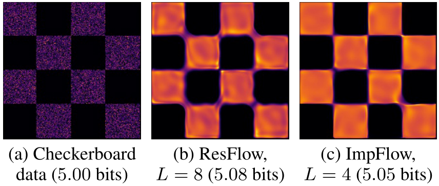
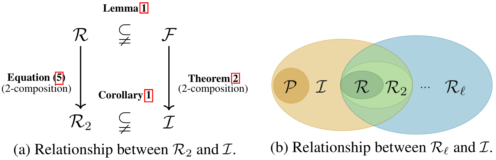
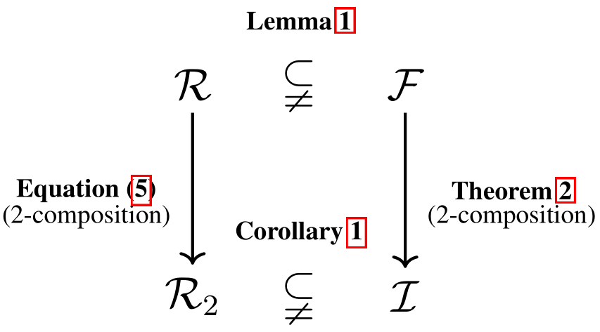
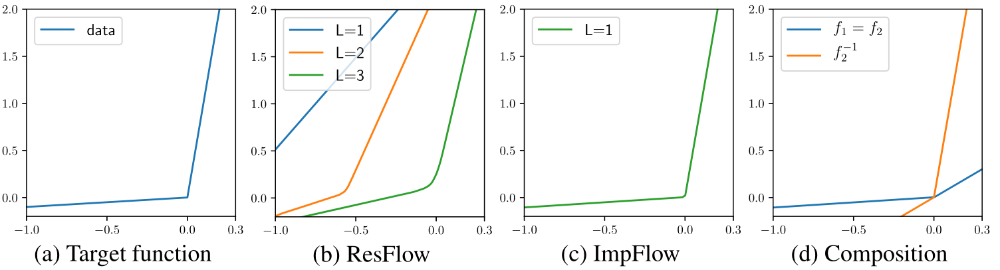
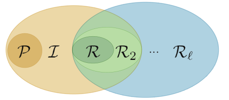

# Implicit Normalizing Flows

ICLR2021_Spot

----

## Abstract

归一化流通过**显式可逆变换**(explicit invertible transformation) $ \mathbf{z}=f(\mathbf{x}) $ 定义概率分布。 在这项工作中，我们提出了**隐式归一化流**（implicit normalizing flows, ImpFlows），它通过允许由方程 $ F(\mathbf{z}, \mathbf{x})=0 $ 的根隐式定义映射来**泛化**（generalize）归一化流。 ImpFlows 建立在残差流（ResFlows）上，**在表达性和可处理性之间保持适当的平衡**（a proper balance between expressiveness and tractability）。

通过理论分析（theoretical analysis），我们发现 ImpFlow 的**函数空间**比 ResFlows 的函数空间**严格丰富**（the function space of ImpFlow is strictly richer than that of ResFlows）。此外，对于具有**固定数量的块**（a fixed number of blocks）的任何ResFlow，存在一些函数使 ResFlow 具有**不可忽略的近似误差**（a non-negligible approximation error）。

但是，该函数可以由单块（single-block） ImpFlow **精确表示**。我们提出了一种**可扩展**（scalable）的算法来**训练**和从 ImpFlows 中**提取样本**。根据经验（Empirically），我们在几个分类和密度建模任务上评估 ImpFlow，并且在所有基准测试中，ImpFlow 的**参数数量**（a comparable amount of parameters）均优于 ResFlow。

---

## 1. Introduction

标准化流（NFs）（Variational inference with normalizing flows，ICML 2015; Nice，ICLR2014）是用于密度建模的有前途的方法。NFs 通过指定从 $x$ 到另一个随机变量 $z$ 的可逆变换 $f(x)$ 来定义模型分布 $ p_{\mathbf{x}}(\mathbf{x}) $。 通过变量变化(change-of-variable)公式，模型密度为
$$
\begin{equation}
 \ln p_{\mathbf{x}}(\mathbf{x})=\ln p_{\mathbf{z}}(f(\mathbf{x}))+\ln \mid \operatorname{det}\left(J_{f}(\mathbf{x})\right) |
\end{equation}\tag{1}
$$
其中 $ p_{\mathbf{x}}(\mathbf{z}) $ 遵循简单分布，例如高斯分布。NFs 由于其易处理性而特别吸引人，即可以将模型密度 $ p_{\mathbf{x}}(\mathbf{x}) $ 直接评估为 **Eq.1**。为了实现这种可处理性，NFs模型应该满足**两个要求**：（i）$x$ 和 $z$ 之间的映射是可逆的；  （ii）雅可比行列式 $J_{f}(\mathbf{x})$ 的对数行列式是易处理的。寻找满足这些可控性约束 (tractability constraints) 的丰富模型族(rich model families)对于 Nfs 的研究至关重要。对于第二个要求，早期的工作，例如逆自回归流（Kingma，NIPS2016）和RealNVP（Dinh，ICLR2017）将模型族（model family）限制为具有三角形雅可比矩阵的模型族。

最近，出现了一些**自由形式** (free-form) 的 **Jacobian 方法**，例如残差流（ResFlows）（Invertible residual networks，ICML2019; Residual flows for invertible generative modeling，NIPS2019）。他们通过利用**对数行列式**的**随机估计器**（stochastic estimator）来放宽**三角形雅可比约束**，从而**丰富了模型族**。但是，每个**转换块**（transformation block）的Lipschitz **常数**均受**可逆性约束**。通常，这不是可取的，因为将简单的**先验分布**映射到潜在的**复杂数据分布**可能需要具有**非常大**的**Lipschitz常数的转换**（见**Fig. 3**）。此外，所有上述方法（aforementioned methods）都假定存在一个明确的（explicit）前向映射 $ \mathbf{z}=f(\mathbf{x}) $ 。具有显式正向映射的双射仅覆盖了第一个要求所建议的**广义可逆函数的一小部分**（a fraction of the broad class of invertible functions），这可能会限制模型的容量。

**Fig. 3:**  Checkerboard data density and the results of a 8-block ResFlow and a 4-block ImpFlow. 棋盘数据密度 以及 8-block ResFlow 和 4-block ImpFlow的结果。

在本文中，我们提出了 implicit flows（ImpFlows）来**泛化**NFs，**允许转换被** $ F(\mathbf{z}, \mathbf{x})=0 $ **隐式定义**。给定 $x$（或$z$），可以通过隐式的根查找过程（root-finding procedure） $ \mathbf{z}=\operatorname{RootFind}(F(\cdot, \mathbf{x})) $ 来计算另一个变量。可以将先前 NFs 中使用的显式映射 $z = f(x)$ 视为 **ImpFlow 的特殊情况**，形式为 $F(z，x)= f(x)− z =0$. 

为了在**表达性和可处理性**之间取得平衡，我们从 ImpFlows 中提出了一个特殊的定义，其中每个 block 是由 **ResFlow block 和另一个ResFlow block的逆**来组成。我们从理论上研究**函数空间中** ResFlows 和 ImpFlows 的**模型容量**。 通过**放宽 Lipschitz 约束**，我们证明了 single-block ImpFlow 的**函数族**比 two-block ResFlow的函数族**严格丰富**。此外，对于任何具有固定块数的ResFlow，都存在某些可逆函数，使 ResFlow 具有**不可忽略的近似误差**，但是ImpFlow可以精确建模。

在实践方面，我们开发了一种**可伸缩**的（scalable）算法来估计概率密度及其梯度，并从ImpFlows中提取样本。 该算法利用（leverages）**隐式微分公式**（implicit differentiation formula）。尽管功能更强大，但是ImpFlow的梯度计算与 ResFlows 的梯度计算大部分相似，除了在**根查找方面有一些额外的开销**。我们在几个分类和生成建模任务上测试了 ImpFlow 的有效性。ImpFlow 在所有基准测试上均优于 ResFlow，具有可比的模型大小和计算成本。（comparable model sizes and computational cost）

---

## 2. Related Work

### 2.1. Expressive Normalizing Flows

有许多工作致力于提高NFs的能力。例如，Dinh等（ICLR2014, Nice; ICLR2017, RealNVP）; Kingma & Dhariwal（NIPS2018, Glow）;  Ho等（ICML2019, Flow++: Improving flow-based generative models with variational dequantization and architecture design）; 宋等（NIPS2019, Mintnet: Building invertible neural networks with masked convolutions）;  Hoogeboom等（ICML2019, Emerging convolutions for generative
normalizing flows）;  De Cao等（UAI2020, Block neural autoregressive flow）；  Durkan等（NIPS2019,  Neural spline flows）用**易处理的Jacobian**设计**专用的模型架构**。 

最近，Grathwohl等（ICLR2019, **Ffjord**:Free-form continuous dynamics for scalable reversible generative models）;  Behrmann等 （ICML2019, **Invertible residual networks**）;  Chen等（NIPS2019,**Residual flows for invertible generative modeling**）提出了具有**自由形式雅可比行列式**(不限制三角矩阵)的NFs，它们用**随机估计量近似了行列式**。 

在架构设计的同时，Chen等（ICML2020, **Vflow**: More expressive generative flows with variational data augmentation）； Huang等（arXiv2020,  **Augmented normalizing flows**: Bridging the gap between generative flows and latent variable models）； Cornish等（ICML2020,  **Relaxing bijectivity constraints** with continuously indexed normalising flows）；  Nielsen等（arXiv2020, **Survae flows**: Surjections to bridge the gap between vaes and flows）通过在**更高维度的空间中操作**来提高NFs的能力。

正如引言中提到的，所有这些现有作品都采用**显式正向映射**，这仅是广泛的**可逆函数类的子集**。相反，我们认为的**隐式函数族更丰富**。 虽然我们在本文中主要讨论 ResFlows 的**隐式泛化**（Chen, NIPS2019, **Residual flows for invertible generative modeling**），但利用隐式可逆函数的一般思想也可能会应用于其他模型。 最后，张等（ICML2020, Approximation capabilities of neural odes and invertible residual networks）正式证明 ResFlows 的**模型能力受到残差块尺寸的限制**。相比之下，我们根据**有界 Lipschitz 常数**研究 ResFlows 的另一个局限性，并以可比较的深度比较 ResFlows 和 ImpFlows 的**函数族**。

---

### 2.2. Continuous Time Flows (CTFs)

（Chen，NIPS2018b; Grathwohl，ICLR2019; Chen，ICML2018a）是用于生成模型的**离散时间流**的灵活替代方案。 他们通常将**可逆变换**视为一个**动力系统**，该动力系统由**常微分方程**（ODE）**求解器近似模拟**。相反，本文考虑的隐式函数族**不包含微分方程**，仅需要**定点解算器**(fixed point solvers)。而且，理论上的保证是不同的。 尽管 CTFs 通常研究**连续时间**（即“无限深度”限制）情况下的**通用逼近能力**（universal approximation），但我们在**有限数量的转换步骤**（a finite number of transformation steps）下考虑了 ImpFlows 和 ResFlows 的模型能力。最后，尽管CTFs 很灵活，但由于**不稳定性**（Liu，CVPR2020; Massaroli，arXiv2020）和**过多的ODE求解器步骤**（Finlay，ICML2020），它们的学习具有挑战性，使其**大规模应用**仍然是一个未解决的问题。

---

### 2.3. Implicit Deep Learning

利用**隐式函数可增强神经网络的灵活性**，从而以**特定于问题的方式进行网络层的设计**(problem-specific way)。 例如，Bai（NIPS2019）提出了一种深度均衡(equilibrium)模型，作为递归网络的紧凑替代;  Amos＆Kolter（ICML2017,  Differentiable optimization as a layer in neural networks.）**泛化了每一层以解决优化问题**；Wang（ICML2019）将**逻辑推理整合到神经网络中**;  Reshniak＆Webster（2019）利用**隐式Euler**方法来提高**残差块正向和反向过程的稳定性**; Sitzmann（2020）引入**周期函数**以进行表征学习。**与这些将隐式函数替换为前馈网络的工作不同**，我们为 NFs 开发了的**可逆的隐式函数**，讨论了此类函数存在的条件，并从理论上研究了我们提出的 ImpFlow 在该函数空间中的模型的能力。

---

## 3. Implicit Normalizing Flows

现在，我们将从对现有工作的简要概述开始(by starting with a brief overview of existing work)，介绍隐式规范化流程。

---

### 3.1. Normalizing Flows

如 [Eq. 1](#eq1) 所示，标准化流 $ f: \mathbf{x} \mapsto \mathbf{z} $ 是一个可逆函数，它使用变量变化公式（change-of-variable formula）定义概率分布。标准化流的建模能力取决于可逆函数 $f$ 的表达。Residual flows （ResFlows）（Chen，2019; Behrmann，2019）由于其**自由形式** (free-form) 的 **Jacobian 形式**而成为一类特别强大的NFs。ResFlows 使用 $ f=f_{L} \circ \cdots \circ f_{1} $ 来构造**可逆映射**，其中每一层 $f_l$ 是具有 **Lipschitz约束** 并由固定常数 $κ$ 限制的可逆残差网络： 
$$
\begin{equation}
 f_{l}(\mathbf{x})=\mathbf{x}+g_{l}(\mathbf{x}), \quad \operatorname{Lip}\left(g_{l}\right) \leq \kappa<1 
\end{equation}\tag{2}
$$
其中 $\operatorname{Lip}\left(g\right)$ 是函数 $g$ 的 Lipschitz常数（详细信息见 [Sec. 4.1](#sec41)）。尽管有 free-form 的Jacobian，ResFlows的模型**能力仍受可逆函数的 Lipschitz 常数限制**。每个ResFlow block $f_l$ 的 **Lipschitz 常数不能超过2**（Behrmann，2019），因此 **L-block 的 ResFlow的 Lipschitz 常数不能超过** $2^L$。但是，为了将简单的**先验分布转换为潜在的复杂数据分布**，通常**要求转换的Lipschitz常数足够大**。因此，仅仅**满足Lipschitz约束**，**ResFlows可能会很深**（见 **Fig. 3**）。下面，我们介绍隐式流（ImpFlows）以**放松Lipschitz约束**。

**Fig. 3:**  Checkerboard data density and the results of a 8-block ResFlow and a 4-block ImpFlow. 棋盘数据密度 以及 8-block ResFlow 和 4-block ImpFlow的结果。

---

### 3.2. Model Specification

通常，将隐式流（ImpFlow）定义为 $d$ 维随机变量 $\mathbf{x}$ 和 $\mathbf{z}$ 之间的可逆映射，并通过找到 $ F(\mathbf{z}, \mathbf{x})=\mathbf{0} $ 的根，其中 $F$ 是从 $\mathbb{R}^{2d}$ 到 $$\mathbb{R}^{d}$$ 的函数。特别的，先前 flow 实例中使用的显式映射 $ \mathbf{z}=f(\mathbf{x}) $（Chen，2019; Kingma＆Dhariwal，2018）可以表示为隐式函数，形式为 $\begin{equation}
 F(\mathbf{z}, \mathbf{x})=f(\mathbf{x})-\mathbf{z}=\mathbf{0} 
\end{equation}$。虽然 ImpFlows 是一个强大的族，但通常不能保证它们满足 NFs 所要求的**对数行列式的可逆性**和**易处理性**。在本文中，我们将重点放在以下特定形式上，该形式在**表达性和可延展性**之间取得了良好的平衡，并为以后的研究留下了其他可能性。

#### Definition 1.

令 $ g_{\mathbf{z}}: \mathbb{R}^{d} \rightarrow \mathbb{R}^{d} $ 和 $ g_{\mathbf{x}}: \mathbb{R}^{d} \rightarrow \mathbb{R}^{d} $  是两个函数，使得 $ \operatorname{Lip}\left(g_{\mathbf{x}}\right)<1 $ 和 $ \operatorname{Lip}\left(g_{\mathbf{z}}\right)<1 $，其中 $ \operatorname{Lip}\left(g\right) $ 是函数 $g$ 的Lipschitz 常数。ImpFlows 的**特定形式**定义为
$$
\begin{equation}
 F(\mathbf{z}, \mathbf{x})=\mathbf{0},  \quad\text{where}  \quad F(\mathbf{z}, \mathbf{x})=g_{\mathbf{x}}(\mathbf{x})-g_{\mathbf{z}}(\mathbf{z})+\mathbf{x}-\mathbf{z} 
\end{equation} \tag{3}
$$
[Eq. 3](#eq3) 的根组解在 $\mathbb{R}^{d} \times \mathbb{R}^{d}$中形成一个子集，它实际上定义了唯一可逆函数 $f$ 的赋值规则(assignment rule)。

对于任何的 $\mathbf{x}_0$，根据 [Definition 1](#def1)，我们可以构造一个收缩 $ h_{\mathbf{x}_{0}}(\mathbf{z})=F\left(\mathbf{z}, \mathbf{x}_{0}\right)+\mathbf{z} $, 它具有唯一的固定点，对应于唯一的根（关于 $\mathbf{z}$ ）  $ F\left(\mathbf{z}, \mathbf{x}_{0}\right)=\mathbf{0} $，由 $ f\left(\mathbf{x}_{0}\right) $ 表示。 

类似地，在反向过程中，给定 $\mathbf{z}_{0}$，$ F\left(\mathbf{z}_{0}, \mathbf{x}\right)=\mathbf{0} $ 的根（关于 $\mathbf{x}$）也存在并且是唯一的，用 $ f^{-1}\left(\mathbf{z}_{0}\right) $ 表示。 如 [Theorem 1](#the1) 总结，这两个属性足以确保 $f$ 的存在和可逆。 

#### Theorem 1. 

[Eq. 3](#eq3) 定义了一个唯一的映射 $ f: \mathbb{R}^{d} \rightarrow \mathbb{R}^{d}, \mathbf{z}=f(\mathbf{x}) $，并且 $f$ 是可逆的。

见 [Appendix A.1](#app1) 中的证明。[Theorem 1](#the1) 表征了（characterizes） [Definition 1](#def1) 中引入的 ImpFlow 的有效性（the validness of）。实际上，a single ImpFlow 是 a single ResFlow 和另一个 single ResFlow的逆 的**堆栈**，这将在 **Sec. 4** 中正式说明。我们将在 **Sec. 4** 中研究ImpFlows的函数族的表达性，并在 **Sec. 5** 提出一种可扩展的算法来学习基于 **Sec 4** 中的 ImpFlows 的**深度生成模型**。  

---

## 4. Expressiveness Power

我们首先在 [Sec. 4.1](#sec41) 介绍一些关于 **Lipschitz 连续函数**的初步知识。 然后正式研究 ImpFlows 的表达能力，尤其是与 ResFlows 相比。特别的，我们在 [Sec. 4.2](#sec42) 证明了 ImpFlows 的函数空间比的 ResFlows 的函数空间严格丰富，见 **Fig. 1(a)**。 此外，对于具有固定数量的块的任何ResFlow，存在一些函数，使 ResFlow 具有不可忽略的近似误差。 但是，该函数可以由 single-block ImpFlow精确表示。 结果显示在 **Fig. 1(b)** 中，并在 [Sec. 4.3](#sec43) 中正式提出。

**Fig. 1:** An illustration of our main theoretical results on the expressiveness power of ImpFlows and ResFlows. Panel (a) and Panel (b) correspond to results in Sec. 4.2 and Sec. 4.3 respectively.

---

### 4.1. Lipschitz Continuous Functions

对于任何可微函数 $ f: \mathbb{R}^{d} \rightarrow \mathbb{R}^{d} $ 和任何 $ \mathbf{x} \in \mathbb{R}^{d} $，我们将 $f$ 在 $\mathbf{x}$ 处的雅可比矩阵表示为 $ J_{f}(\mathbf{x}) \in \mathbb{R}^{d \times d} $

#### Definition 2.

如果存在常数 $L$ 满足下式，则函数 $ \mathbb{R}^{d} \rightarrow \mathbb{R}^{d} $ 称为Lipschitz连续。
$$
\begin{equation}
 \left\|f\left(\mathbf{x}_{1}\right)-f\left(\mathbf{x}_{2}\right)\right\| \leq L\left\|\mathbf{x}_{1}-\mathbf{x}_{2}\right\|, \forall \mathbf{x}_{1}, \mathbf{x}_{2} \in \mathbb{R}^{d} 
\end{equation}
$$
满足不等式 (inequality) 的最小 $L$ 称为 $f$ 的 Lipschitz常数，表示为 $ \operatorname{Lip}(f) $。

通常， $ \operatorname{Lip}(f) $ 的定义取决于 $$|| ·||$$的选择，为简单起见，本文默认使用L2-范数。

---

#### Definition 3.

如果函数 $ f: \mathbb{R}^{d} \rightarrow \mathbb{R}^{d} $ 是 Lipschitz 连续的并且具有逆映射 $f^{-1}$（且逆映射也是Lipschitz连续），则称函数 $f$ 为 bi-Lipschitz 连续。

在下面的分析中考虑 Lipschitz 常数的等效定义是很有用的。

---

#### Proposition 1.

命题1

Rademacher（Federer（1969），Theorem 3.1.6）

如果 $ f: \mathbb{R}^{d} \rightarrow \mathbb{R}^{d} $ 是 Lipschitz 连续的，则 $f$ 几乎在任何地方都是可微的，并且
$$
\begin{equation}
 \operatorname{Lip}(f)=\sup _{\mathbf{x} \in \mathbb{R}^{d}}\left\|J_{f}(\mathbf{x})\right\|_{2} 
\end{equation}
$$
其中 $ \|M\|_{2}=\sup _{\left\{\mathbf{v}:\|\mathbf{v}\|_{2}=1\right\}} \|M \mathbf{v}\|_{2}  $ 是矩阵 $ M \in \mathbb{R}^{d \times d} $ 的算子范数

---

### 4.2. Comparision to Two-Block ResFlows

**Fig. 1a:** Relationship between $\mathcal{R}_2$ and $\mathcal{I}$.

**Fig. 2:**  A 1-D motivating example. 一维激励的例子。（a）目标函数图。（b）使用具有不同块数的ResFlows拟合目标函数的结果。由于Lipschtiz约束，所有函数都有不可忽略的（non-negligible）逼近误差。（c）可以精确表示目标函数的 ImpFlow。（d）合成 **ResFlow block** 和**另一个 ResFlow block 的逆**以构造ImpFlow block 的可视化视图。 详细设置可以在 [Appendix D](#appd) 中找到。

我们正式比较了 a single-block ImpFlow 和 a two-block ResFlow 的表达能力。我们在 **Fig. 1a** 的这一小节中突出了理论结果的结构，并在 **Fig. 2** 中给出了一个一维激活的例子。所有的证明都可以在 [Appendix. A](#appa) 中找到。 另一方面，根据 ResFlow 的定义，single-block ResFlow 的函数族为 
$$
\begin{equation}
 \mathcal{R}:=\left\{f: f=g+\mathrm{Id}, g \in C^{1}\left(\mathbb{R}^{d}, \mathbb{R}^{d}\right), \operatorname{Lip}(g)<1\right\} 
\end{equation}\tag{4}
$$
其中 $ C^{1}\left(\mathbb{R}^{d}, \mathbb{R}^{d}\right) $ 包含从 $ \mathbb{R}^{d} $ 到 $ \mathbb{R}^{d} $ 的所有具有连续导数的函数，$\mathrm{Id}$ 表示恒等图。 此外，$\ell$-block ResFlows 的函数族由以下组成定义： 
$$
\begin{equation}
 \mathcal{R}_{\ell}:=\left\{f: f=f_{\ell} \circ \cdots \circ f_{1}\right. \text{for some } \left.f_{1}, \cdots, f_{\ell} \in \mathcal{R}\right\} 
\end{equation}\tag{5}
$$
根据 [Eq. 4](#eq4) 和 [Eq. 5](#eq5)，$ \mathcal{R}_{1}=\mathcal{R} $。

另一方面，根据 [Eq. 3](#eq3) 中 ImpFlow 的定义，我们可以获得 $(g_{\mathbf{x}} + \mathrm{Id})(\mathbf{x})=g_{\mathbf{x}}(\mathbf{x})+\mathbf{x}=g_{\mathbf{z}} (\mathbf{z})+\mathbf{z}=\left(g_{\mathbf{z}}+\mathrm{Id}\right)(\mathbf{z}) $，其中 $◦$ 表示函数的组成。同理，我们有 $ \mathbf{z}=\left(\left(g_{\mathbf{z}}+\mathrm{Id}\right)^{-1} \circ\left(g_{\mathbf{x}}+\mathrm{Id}\right)\right)(\mathbf{x}) $ ，这意味着 single-block ImpFlow 的函数族是 
$$
\begin{equation}
 \mathcal{I}=\left\{f: f=f_{2}^{-1} \circ f_{1}\right. \text{for some } \left.f_{1}, f_{2} \in \mathcal{R}\right\} 
\end{equation}\tag{6}
$$
直观上，a single-block ImpFlow 可以解释为 **一个 ResFlow block 和另一个ResFlow block 的逆函数**的组成，它们可能没有明确的形 explicit form（有关1D示例，见 **Fig. 2c** 和 **Fig. 2d** ）。因此，研究  $\mathcal{I}$ 和 $\mathcal{R}_2$ 之间的关系是很自然的。

在此之前，我们首先介绍一个没有明显 Lipschitz 约束的“单调递增函数”族（monotonically increasing functions），并证明它严格大于 $\mathcal{R}$ 。

#### Lemma 1.

引理1
$$
\begin{equation}
 \mathcal{R} \varsubsetneqq \mathcal{F}:=\left\{f \in \mathcal{D}: \underset{\mathbf{x} \in \mathbb{R}^{d}, \mathbf{v} \in \mathbb{R}^{d},\|\mathbf{v}\|_{2}=1}{ \operatorname{inf}} \mathbf{v}^{T} J_{f}(\mathbf{x}) \mathbf{v}>0\right\} 
\end{equation}
$$
其中 $\mathcal{D}$ 是从 $ \mathbb{R}^{d} $ 到 $ \mathbb{R}^{d} $ 的所有 bi-Lipschitz $C^1$-diffeomorphisms(同态)的集合，而 $ A \varsubsetneqq B $ 表示 $A$ 是 $B$ 的真子集（proper subset）。

请注意，它遵循 Behrmann（2019，Lemma2），所有在 $ \mathcal{R} $ 中的函数都是 bi-Lipschitz 的，所以 $ \mathcal{R} \varsubsetneqq \mathcal{D} $ . 在1D 输入情况下，我们可以得到 $ \mathcal{R}=\left\{f \in C^{1}(\mathbb{R}): \inf _{x \in \mathbb{R}} f^{\prime}(x)>0, \sup _{x \in \mathbb{R}} f^{\prime}(x)<2\right\} $，并且 $ \mathcal{F}=\left\{f \in C^{1}(\mathbb{R}): \inf _{x \in \mathbb{R}} f^{\prime}(x)>0\right\} $。在高维情况下，$\mathcal{R}$ 和 $\mathcal{F}$ 难以阐述。尽管如此，$\mathcal{R}$ 中函数的 Lipschitz 常数小于 2（Behrmann，2019），但 $\mathcal{F}$ 中函数的 Lipschitz 常数可以任意大。

基于 [Lemma 1](le1)，我们证明ImpFlows $ \mathcal{I} $ 的函数族由 $\mathcal{F}$ 中两个函数的组成组成，因此严格大于 $ \mathcal{R}_2 $ ，如以下定理所总结。

#### Theorem 2.

a single-block ImpFlow的函数族的等效形式（Equivalent form）。
$$
\begin{equation}
 \mathcal{I}=\mathcal{F}_{2}:=\left\{f: f=f_{2} \circ f_{1}\right. \text{for some } \left.f_{1}, f_{2} \in \mathcal{F}\right\} 
\end{equation}
$$
注意，恒等映射 $ I d \in \mathcal{F} $，很容易得到 $ \mathcal{F} \subset \mathcal{I} $。因此，a single ImpFlow 的 Lipschitz 常数（及其逆）可以任意（arbitrarily）大。 由于 $ \mathcal{R} \varsubsetneqq \mathcal{F} $ ，并且 $ \mathcal{I} \backslash \mathcal{R}_{2} $ 中存在一些函数（参见 [Sec 4.3](#sec43) 中的构造示例），因此可以得出以下推论。

#### Corollary 1.

$$
 \mathcal{R} \varsubsetneqq \mathcal{R}_{2} \varsubsetneqq \mathcal{F}_{2}=\mathcal{I}
$$

**Fig. 2b and 2c** 中一维示例的结果与 [Corollary 1](#cor1)一致。此外， [Corollary 1](#cor1) 可以推广到具有 $2\ell$-block ResFlows 和 $\ell$-block ImpFlows的情况，这强烈地推动了normalizing flows中的隐式层的使用。

---

### 4.3. Comparison with Multi-Block ResFlows

**Fig. 1b**  Relationship between $ \mathcal{R}_{0} $ and $ \mathcal{I} $

如 **Fig. 1b** 所示，我们进一步研究了 $ \mathcal{R}_{\ell} $ ($\ell>2$)和 $$ \mathcal{I}$$ 之间的关系。对于固定的 $\ell$，$ \mathcal{R}_{\ell} $ 中函数的 Lipschitz 常数仍然是有界的，并且有无限个不存在于 $ \mathcal{R}_{\ell} $ 中但在 $$ \mathcal{I}$$ 中的函数。我们构造了一个这样的函数族：对于任何$ L, r \in \mathbb{R}^{+} $，定义
$$
\begin{equation}
 \mathcal{P}(L, r)=\left\{f: f \in \mathcal{F}, \exists \mathcal{B}_{r} \subset \mathbb{R}^{d}, \forall \mathbf{x}, \mathbf{y} \in \mathcal{B}_{r},\|f(\mathbf{x})-f(\mathbf{y})\|_{2} \geq L\|\mathbf{x}-\mathbf{y}\|_{2}\right\} 
\end{equation}\tag{9}
$$
其中 $\mathcal{B}_{r}$ 是半径为 $r$ 的 $d$ 维球。显然，$\mathcal{P}(L, r)$ 是一个无限集。下面，我们将展示 $ \forall 0<\ell<\log _{2}(L)$，$\mathcal{R}_{\ell} $ 对于$\mathcal{P}(L, r)$ 中的函数具有不可忽略的近似误差。 但是，它们完全可以由 $$ \mathcal{I}$$ 中的函数表示。

#### Theorem 3.

给定 $ L>0 $ 和 $ r>0 $，我们有

- $ \mathcal{P}(L, r) \subset \mathcal{I} $

- $ \forall 0<\ell<\log _{2}(L),  \mathcal{P}(L, r) \cap \mathcal{R}_{\ell}=\varnothing  $. 此外，对于任何具有 $d$ 维球 $\mathcal{B}_{r}$ 的 $ f \in \mathcal{P}(L, r) $，用 $ \mathcal{R}_{\ell} $ 函数拟合 $\mathcal{B}_{r}$ 中的 $f$ 的最小误差满足
  $$
  \begin{equation}
   \inf _{g\in \mathcal{R}_{\ell}} \sup _{\mathbf{x} \in \mathcal{B}_{r}}\|f(\mathbf{x})-g(\mathbf{x})\|_{2} \geq \frac{r}{2}\left(L-2^{\ell}\right) 
  \end{equation}\tag{10}
  $$

遵循 [Theorem 3](#the3)，要建模 $ f \in \mathcal{P}(L, r) $，我们只需要 a single-block ImpFlow，但至少需要a -$ \log _{2}(L) $-block  ResFlow。在 **Fig. 2b** 中，我们展示了 1D 情况，其中a 3-block ResFlow 无法拟合 a single ImpFlow 可以精确表示的函数。此外，我们还证明了 ImpFlows 的其他一些属性。特别是 $ \mathcal{R}_{3} \not \subset \mathcal{I} $。我们将结果正式呈现在 [Appendix B](#appb) 中。

---

## 5. Generative Modeling With ImpFlows

ImpFlows can be parameterized by neural networks and stacked to form a deep generative model to
model high-dimensional data distributions. We develop a scalable algorithm to perform inference,
sampling and learning in such models. For simplicity, we focus on a single-block during derivation.
Formally, a parametric ImpFlow block z = f(x;θ) is defined by

可以通过神经网络对ImpFlows进行参数化，然后将其堆叠以形成一个深度生成模型，以对高维数据分布进行建模。 我们开发了一种可扩展的算法，可以在此类模型中执行推理，采样和学习。 为简单起见，我们将重点放在推导过程中的单个块上。
   形式上，参数ImpFlow块z = f（x;θ）定义为

and Lip(g x ) < 1, Lip(g z ) < 1. Let θ denote all the parameters in g x and g z (which does NOT mean
g x and g z share parameters). Note that x refers to the input of the layer, not the input data.
The inference process to compute z given x in a single ImpFlow block is solved by finding the root
of F(z,x;θ) = 0 w.r.t. z, which cannot be explicitly computed because of the implicit formulation.
Instead, we adopt a quasi-Newton method (i.e. Broyden’s method (Broyden, 1965)) to solve this
problem iteratively, as follows:

和Lip（g x）<1，Lip（g z）<1。令θ表示g x和g z中的所有参数（这并不意味着g x和g z共享参数）。 请注意，x是指图层的输入，而不是输入数据。
 通过找到F（z，x;θ）= 0 w.r.t的根来求解在给定x的单个ImpFlow块中计算z的推理过程。  z，由于隐式公式而无法显式计算。
   相反，我们采用拟牛顿法（即Broyden法（Broyden，1965年））来迭代地解决此问题，如下所示： 

where B is a low-rank approximation of the Jacobian inverse 1 and α is the step size which we use
line search method to dynamically compute. The stop criterion is kF(z [i] ,x;θ)k 2 < ? f , where ? f
is a hyperparameter that balances the computation time and precision. As Theorem 1 guarantees the
existence and uniqueness of the root, the convergence of the Broyden’s method is also guaranteed,
which is typically faster than a linear rate.

其中B是Jacobian逆1的低阶近似，而α是我们使用线搜索方法动态计算的步长。 停止标准为kF（z [i]，x;θ）k 2 <？  f，在哪里？  f是在计算时间和精度之间取得平衡的超参数。 由于定理1保证了根的存在和唯一性，因此也保证了Broyden方法的收敛性，通常比线性速率快。

Another inference problem is to estimate the log-likelihood. Assume that z ∼ p(z) where p(z) is a
simple prior distribution (e.g. standard Gaussian). The log-likelihood of x can be written by

另一个推断问题是估计对数似然性。 假设z〜p（z），其中p（z）是一个简单的先验分布（例如标准高斯分布）。  x的对数似然可以写成

where J f (x) denotes the Jacobian matrix of a function f at x. See Appendix. A.4 for the detailed
derivation. Exact calculation of the log-determinant term requires O(d 3 ) time cost and is hard to
scale up to high-dimensional data. Instead, we propose the following unbiased estimator of lnp(x)
using the same technique in Chen et al. (2019) with Skilling-Hutchinson trace estimator (Skilling,
1989; Hutchinson, 1989):

其中J f（x）表示x处函数f的雅可比矩阵。 见附录。  A.4为详细推导。 对数行列式项的精确计算需要O（d 3）时间成本，并且很难扩展到高维数据。 相反，我们使用Chen等人的相同技术提出了lnp（x）的以下无偏估计量。  （2019）和Skilling-Hutchinson追踪估算器（Skilling，1989; Hutchinson，1989）：

where p(N) is a distribution supported over the positive integers.

其中p（N）是在正整数上支持的分布。

The sampling process to compute x given z can also be solved by the Broyden’s method, and the
hyperparameters are shared with the inference process.

   计算给定z的x的采样过程也可以通过Broyden方法解决，并且超参数与推理过程共享。

In the learning process, we perform stochastic gradient descent to minimize the negative log-
likelihood of the data, denoted as L. For efficiency, we estimate the gradient w.r.t. the model
parameters in the backpropagation manner. According to the chain rule and the additivity of the
log-determinant, in each layer we need to estimate the gradients w.r.t. x and θ of Eqn. (13). In
particular, the gradients computation involves two terms: one is
∂
∂(·)
lndet(I + J g (x;θ)) and the other is
∂L
∂z
∂z
∂(·) , where g is a function satisfying Lip(g) < 1 and (·) denotes x or θ. On the one
hand, for the log-determinant term, we can use the same technique as Chen et al. (2019), and obtain
an unbiased gradient estimator as follows.
   在学习过程中，我们执行随机梯度下降以最小化数据的负对数似然性（表示为L）。为了提高效率，我们估计了梯度w.r.t。 模型参数采用反向传播方式。 根据链式规则和对数行列式的可加性，在每一层中，我们需要估计梯度w.r.t。 等式的x和θ。  （13）。 特别地，梯度计算涉及两个术语：一个是∂（·）lndet（I + J g（x;θ）），而另一个是 other是∂L∂z∂z∂（·），其中g是满足Lip（g）<1的函数，而（·）表示x或θ。 一方面，对于对数行列式，我们可以使用与Chen等人相同的技术。  （2019），并获得如下的无偏梯度估计量。

where p(N) is a distribution supported over the positive integers. On the other hand,
∂L
∂z
∂z
∂(·)
can be
computed according to the implicit function theorem as follows (See details in Appendix A.5):

其中p（N）是在正整数上支持的分布。 另一方面，可以根据隐函数定理如下计算computedL∂z∂z∂（·）（请参阅附录A.5中的详细信息）：

In comparision to directly calculate the gradient through the quasi-Newton iterations of the forward
pass, the implicit gradient above is simple and memory-efficient, treating the root solvers as a black-
box. Following Bai et al. (2019), we compute
∂L
∂z J
−1
G
(z) by solving a linear system iteratively, as
detailed in Appendix C.1. The training algorithm is formally presented in Appendix C.4.

为了通过前向传递的拟牛顿迭代直接计算梯度，上面的隐式梯度简单且存储效率高，将根求解器视为黑盒。 继Bai等。  （2019年），我们通过迭代求解线性系统来计算∂L∂zJ -1 G（z），如附录C.1所述。 训练算法在附录C.4中正式提出。

## A. Additional Lemmas And Proofs

引理和证明

### A.1 Proof For [Theorem 1](#the1)

Proof. [Theorem 1](#the1)

首先，对任意的 $ \forall \mathbf{x}_{0} \in \mathbb{R}^{d} $，映射
$$
\begin{equation}
 h_{\mathbf{x}_{0}}(\mathbf{z})=F\left(\mathbf{z}, \mathbf{x}_{0}\right)+\mathbf{z} 
\end{equation}
$$
是一个对映(contrative)映射，可以通过 $g_{z}$ 的 Lipschitz 条件表示：
$$
\begin{equation}
 \left(F\left(\mathbf{z}_{1}, \mathbf{x}_{0}\right)+\mathbf{z}_{1}\right)-\left(F\left(\mathbf{z}_{2}, \mathbf{x}_{0}\right)+\mathbf{z}_{2}\right)\|=\| g_{z}\left(\mathbf{z}_{1}\right)-g_{z}\left(\mathbf{z}_{2}\right)\|<\| \mathbf{z}_{1}-\mathbf{z}_{2} \mid 
\end{equation}
$$
因此，$ h_{\mathbf{x}_{0}}(\mathbf{z}) $ 有一个唯一的不动点，用 $ f\left(\mathbf{x}_{0}\right) $ 表示：
$$
\begin{equation}
 h_{\mathbf{x}_{0}}\left(f\left(\mathbf{x}_{0}\right)\right)=f\left(\mathbf{x}_{0}\right) \Leftrightarrow F\left(f\left(\mathbf{x}_{0}\right), \mathbf{x}_{0}\right)=0 
\end{equation}
$$
类似地，我们还有：$ \forall \mathbf{z}_{0} \in \mathbb{R}^{d} $，存在一个满足 $ F\left(\mathbf{z}_{0}, g\left(\mathbf{z}_{0}\right)\right)=0 $ 的唯一 $ g\left(\mathbf{z}_{0}\right) $。

此外，令 $ \mathbf{z}_{0}=f\left(\mathbf{x}_{0}\right) $，我们有 $ F\left(f\left(\mathbf{x}_{0}\right), g\left(f\left(\mathbf{x}_{0}\right)\right)\right)=0 $。通过唯一性，我们有 $ g\left(f\left(\mathbf{x}_{0}\right)\right)=\mathbf{x}_{0} $，$\forall \mathbf{x}_{0} \in \mathbb{R}^{d}$。 同样，$ f\left(g\left(\mathbf{x}_{0}\right)\right)=\mathbf{x}_{0} $，$ \forall \mathbf{x}_{0} \in \mathbb{R}$。 因此，$f$ 是唯一且可逆的。

## B. 

