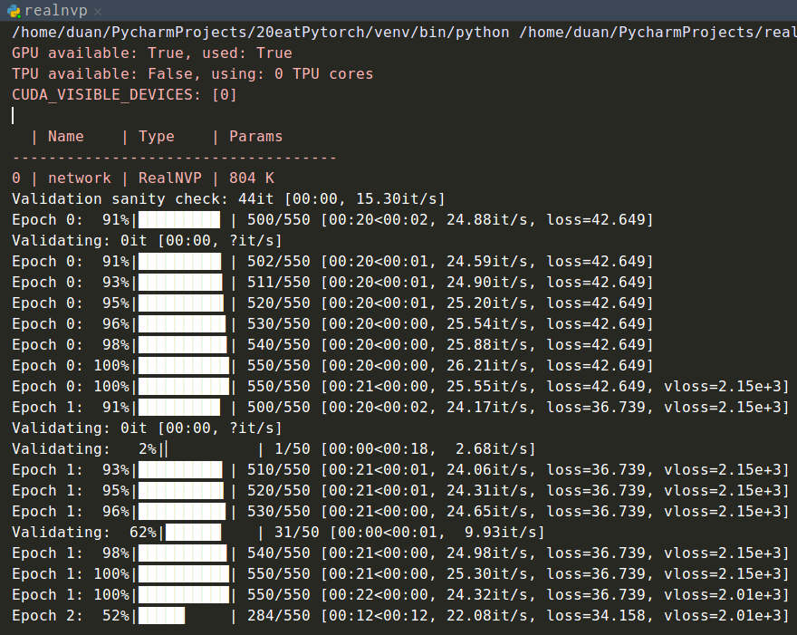

#　NICE 复现

```bash
docker run --runtime=nvidia --rm -it -w /home -v /home/duan/data:/home/data/ -v /tmp/.X11-unix:/tmp/.X11-unix -e DISPLAY=unix$DISPLAY -e GDK_SCALE -e GDK_DPI_SCALE nvidia/cudagl:duan

docker commit -p 578cdbcbaca7 nvidia/cudagl:duan
```


## NICE版

### train.py

```python
# dataset
transform = transforms.ToTensor()
dataset = datasets.MNIST(root='./data/mnist', train=True, transform=transform, download=True)
dataloader = torch.utils.data.DataLoader(dataset=dataset, batch_size=256, shuffle=True, pin_memory=True)

# model
model = NICE(data_dim=784, num_coupling_layers=4)
model.train()
opt = optim.Adam(model.parameters())

# train
for i in range(cfg['TRAIN_EPOCHS']):
  mean_likelihood = 0.0  
  num_minibatches = 0    

  for batch_id, (x, _) in enumerate(dataloader):   # 取出输入数据 x （256，1，28，28）
      x = x.view(-1, 784) + torch.rand(784) / 256. # x (256, 784) 因为channel为1 
      x = torch.clamp(x, 0, 1) 					   # 将input张量每个元素的夹紧到区间 [0, 1]

      z, likelihood = model(x)
      loss = -torch.mean(likelihood)   # NLL

      loss.backward()
      opt.step()
      model.zero_grad()

      mean_likelihood -= loss
      num_minibatches += 1

  mean_likelihood /= num_minibatches
  print('Epoch {} completed. Log Likelihood: {}'.format(i, mean_likelihood))

  if epoch % 5 == 0:
    save_path = os.path.join(cfg['MODEL_SAVE_PATH'], '{}.pt'.format(epoch))
    torch.save(model.state_dict(), save_path)


```


### nice.py

#### class NICE

```python
class NICE(nn.Module):
  def __init__(self, data_dim, num_coupling_layers=3): # 耦合层3层
    super().__init__()

    self.data_dim = data_dim # 数据维度 784 

    # alternating mask orientations for consecutive coupling layers 连续耦合层的交替掩模方向
    masks = [self._get_mask(data_dim, orientation=(i % 2 == 0))
                                            for i in range(num_coupling_layers)]
	# 耦合层
    self.coupling_layers = nn.ModuleList([CouplingLayer(data_dim=data_dim,
                                			hidden_dim=100, mask=masks[i], num_layers=4) 
                                          for i in range(num_coupling_layers)])
	# 缩放层
    self.scaling_layer = ScalingLayer(data_dim=data_dim)
	
    # 先验 对数分布
    self.prior = LogisticDistribution()

  def forward(self, x, invert=False):
    if not invert:							# 是否逆即用来生成
      z, log_det_jacobian = self.f(x)		# 输入真实数据
      log_likelihood = torch.sum(self.prior.log_prob(z), dim=1) + log_det_jacobian # 第一部分为
      return z, log_likelihood

    return self.f_inverse(x)

  def f(self, x):
    z = x						# 保证维数相同
    log_det_jacobian = 0		# 雅克比矩阵的行列式的对数
    for i, coupling_layer in enumerate(self.coupling_layers): 	# 流过联合起来的耦合层
      z, log_det_jacobian = coupling_layer(z, log_det_jacobian)	# 
    z, log_det_jacobian = self.scaling_layer(z, log_det_jacobian)
    return z, log_det_jacobian

  def f_inverse(self, z):
    x = z
    x, _ = self.scaling_layer(x, 0, invert=True)
    for i, coupling_layer in reversed(list(enumerate(self.coupling_layers))):
      x, _ = coupling_layer(x, 0, invert=True)
    return x

  def sample(self, num_samples):
    z = self.prior.sample([num_samples, self.data_dim]).view(self.samples, self.data_dim)
    return self.f_inverse(z)

  def _get_mask(self, dim, orientation=True):
    mask = np.zeros(dim)
    mask[::2] = 1. 		   # 中间隔1个step赋值 [0 1 0 1 0 1] 
    if orientation:		   # 是否需要换向
      mask = 1. - mask     # flip mask orientation 反转方向
    mask = torch.tensor(mask)
    if cfg['USE_CUDA']:
      mask = mask.cuda()
    return mask.float()
```


### modules.py

#### class CouplingLayer

```python
class CouplingLayer(nn.Module):
  """
  Implementation of the additive coupling layer from section 3.2 of the NICE
  paper.
  """

  def __init__(self, data_dim, hidden_dim, mask, num_layers=4): #这里的num是全连接层数不是耦合层数
    super().__init__()

    assert data_dim % 2 == 0

    self.mask = mask

    modules = [nn.Linear(data_dim, hidden_dim), nn.LeakyReLU(0.2)] # 784维升到1000维度
    for i in range(num_layers - 2):
      modules.append(nn.Linear(hidden_dim, hidden_dim))
      modules.append(nn.LeakyReLU(0.2))
    modules.append(nn.Linear(hidden_dim, data_dim))

    self.m = nn.Sequential(*modules)

  def forward(self, x, logdet, invert=False):
    if not invert: 						#不为逆的学习过程
      x1, x2 = self.mask * x, (1. - self.mask) * x      # 将输入按索引分成两部分
      y1, y2 = x1, x2 + (self.m(x1) * (1. - self.mask)) # y1直接复制x1  y2=m(x1)+x2取后半部分
      return y1 + y2, logdet

    # Inverse additive coupling layer 	#逆的生成过程
    y1, y2 = self.mask * x, (1. - self.mask) * x
    x1, x2 = y1, y2 - (self.m(y1) * (1. - self.mask))
    return x1 + x2, logdet
```


#### class ScalingLayer

```python
class ScalingLayer(nn.Module):
  """
  Implementation of the scaling layer from section 3.3 of the NICE paper.
  """
  def __init__(self, data_dim):
    super().__init__()
    self.log_scale_vector = nn.Parameter(torch.randn(1, data_dim, requires_grad=True)) # 标准正态分布 size(1, data_dim)

  def forward(self, x, logdet, invert=False):
    log_det_jacobian = torch.sum(self.log_scale_vector) # 独立分量 log后可相加

    if invert:
        return torch.exp(- self.log_scale_vector) * x, logdet - log_det_jacobian

    return torch.exp(self.log_scale_vector) * x, logdet + log_det_jacobian
```


#### class LogisticDistribution

```python
class LogisticDistribution(Distribution):
  def __init__(self):
    super().__init__()

  def log_prob(self, x):
    return -(F.softplus(x) + F.softplus(-x))

  def sample(self, size):
      z = Uniform(torch.cuda.FloatTensor([0.]), torch.cuda.FloatTensor([1.])).sample(size)

    return torch.log(z) - torch.log(1. - z)
```


---

### summary

#### coupling layer

```python
input 	[1, 784]
output 	[1, 784]
5个全连接层-leakyrelu + 1个全连接层
----------------------------------------------------------------
        Layer (type)               Output Shape         Param #
================================================================
            Linear-1              [-1, 1, 1000]         785,000
         LeakyReLU-2              [-1, 1, 1000]               0
            Linear-3              [-1, 1, 1000]       1,001,000
         LeakyReLU-4              [-1, 1, 1000]               0
            Linear-5              [-1, 1, 1000]       1,001,000
         LeakyReLU-6              [-1, 1, 1000]               0
            Linear-7              [-1, 1, 1000]       1,001,000
         LeakyReLU-8              [-1, 1, 1000]               0
            Linear-9              [-1, 1, 1000]       1,001,000
        LeakyReLU-10              [-1, 1, 1000]               0
           Linear-11               [-1, 1, 784]         784,784
================================================================
Total params: 5,573,784
Trainable params: 5,573,784
Non-trainable params: 0
----------------------------------------------------------------
Input size (MB): 0.002991
Forward/backward pass size (MB): 0.082275
Params size (MB): 21.262299
Estimated Total Size (MB): 21.347565
----------------------------------------------------------------
```


---

#### all

```python
input 	[1, 784]
output 	[1, 784]
4个coupling layer + 1个scaling layer
----------------------------------------------------------------
        Layer (type)               Output Shape         Param #
================================================================
            Linear-1              [-1, 1, 1000]         785,000
         LeakyReLU-2              [-1, 1, 1000]               0
            Linear-3              [-1, 1, 1000]       1,001,000
         LeakyReLU-4              [-1, 1, 1000]               0
            Linear-5              [-1, 1, 1000]       1,001,000
         LeakyReLU-6              [-1, 1, 1000]               0
            Linear-7              [-1, 1, 1000]       1,001,000
         LeakyReLU-8              [-1, 1, 1000]               0
            Linear-9              [-1, 1, 1000]       1,001,000
        LeakyReLU-10              [-1, 1, 1000]               0
           Linear-11               [-1, 1, 784]         784,784
----------------------------------------------------------------
           Linear-12              [-1, 1, 1000]         785,000
        LeakyReLU-13              [-1, 1, 1000]               0
           Linear-14              [-1, 1, 1000]       1,001,000
        LeakyReLU-15              [-1, 1, 1000]               0
           Linear-16              [-1, 1, 1000]       1,001,000
        LeakyReLU-17              [-1, 1, 1000]               0
           Linear-18              [-1, 1, 1000]       1,001,000
        LeakyReLU-19              [-1, 1, 1000]               0
           Linear-20              [-1, 1, 1000]       1,001,000
        LeakyReLU-21              [-1, 1, 1000]               0
           Linear-22               [-1, 1, 784]         784,784
----------------------------------------------------------------
           Linear-23              [-1, 1, 1000]         785,000
        LeakyReLU-24              [-1, 1, 1000]               0
           Linear-25              [-1, 1, 1000]       1,001,000
        LeakyReLU-26              [-1, 1, 1000]               0
           Linear-27              [-1, 1, 1000]       1,001,000
        LeakyReLU-28              [-1, 1, 1000]               0
           Linear-29              [-1, 1, 1000]       1,001,000
        LeakyReLU-30              [-1, 1, 1000]               0
           Linear-31              [-1, 1, 1000]       1,001,000
        LeakyReLU-32              [-1, 1, 1000]               0
           Linear-33               [-1, 1, 784]         784,784
----------------------------------------------------------------
           Linear-34              [-1, 1, 1000]         785,000
        LeakyReLU-35              [-1, 1, 1000]               0
           Linear-36              [-1, 1, 1000]       1,001,000
        LeakyReLU-37              [-1, 1, 1000]               0
           Linear-38              [-1, 1, 1000]       1,001,000
        LeakyReLU-39              [-1, 1, 1000]               0
           Linear-40              [-1, 1, 1000]       1,001,000
        LeakyReLU-41              [-1, 1, 1000]               0
           Linear-42              [-1, 1, 1000]       1,001,000
        LeakyReLU-43              [-1, 1, 1000]               0
           Linear-44               [-1, 1, 784]         784,784
----------------------------------------------------------------
     ScalingLayer-45               [-1, 1, 784]             784
================================================================
Total params: 22,295,920
Trainable params: 22,295,920
Non-trainable params: 0
----------------------------------------------------------------
Input size (MB): 0.002991
Forward/backward pass size (MB): 0.335083
Params size (MB): 85.052185
Estimated Total Size (MB): 85.390259
----------------------------------------------------------------
```


## 补充

### softplus

​	softplus 函数可以用来产生正态分布的均值和标准差，因为它的范围是(0，∞)。
$$
\text{Softplus}(x) = \frac{1}{\beta}  \log(1 + \exp(\beta  x))​
$$

---

## pytorch版

输入参数

```python
parser.add_argument('--dataset',help='dataset to be modeled.',type=str,default='mnist')
parser.add_argument('--batch_size',help='number of images in a mini-batch.',type=int,default=200)
parser.add_argument('--latent',help='latent distribution.',type=str,default='logistic')
parser.add_argument('--max_iter',help='maximum number of iterations.',type=int,default=50)
parser.add_argument('--sample_size',help='number of images to generate.',type=int,default=64)
parser.add_argument('--lr',help='initial learning rate.',type=float,default=1e-3)
parser.add_argument('--momentum',help='beta1 in Adam optimizer.',type=float,default=0.9)
parser.add_argument('--decay',help='beta2 in Adam optimizer.',type=float,default=0.999)
parser.add_argument('--coupling',help='.',type=int,
                        default=4)
parser.add_argument('--save-every',
                        help='every how many epochs to save the model',
                        type=float,
                        default=5)
parser.add_argument('--coup-type',
                        help="coupling type",
                        type=str,
                        default="additive")
parser.add_argument('--mid-dim',
                        help='.',
                        type=int,
                        default=1000)
parser.add_argument('--hidden',
                        help='.',
                        type=int,
                        default=5)
```





---

# ICLR 2015 NICE: NON-LINEAR INDEPENDENT COMPONENTS ESTIMATION

## 摘要

我们提出了一个用于建模复杂高维密度的深度学习框架，称为非线性独立分量估计（NICE）。它基于这样一个理念，即一个好的**表示**就是**数据有一个易于建模的分布**。为此，学习数据的非线性确定性（deterministic）转换，将其映射到潜在（latent）空间，从而使转换后的数据符合（conform）因子分解分布（factorized distribution），即产生独立的潜在变量。我们将这个变换参数化，使得计算雅可比矩阵和逆雅可比矩阵的行列式变得非常简单（trivia），但是我们仍然能够通过简单的构建块（每个模块都基于一个深层神经网络）来学习复杂的非线性变换。训练准则简单地说就是精确的对数似然（log-likelihood），这是可操作的。无偏原始取样（Unbiased ancestral sampling）也很容易。我们证明了这种方法在四个图像数据集上都可以产生良好的生成模型，并可用于图像修复。


## 1. 介绍

​	无监督学习的核心问题之一是如何获取**结构未知**的复杂数据分布。深度学习方法（Bengio，2009）依赖于对数据表示的学习，这些数据将捕获其最重要的变化因素。这就提出了一个问题：什么是好的表示？与最近的研究(Kingma and Welling, 2014; Rezende et al., 2014; Ozair and Bengio, 2014)一样，我们认为，一个好的表示是指**数据分布**易于**建模**。在本文中，我们考虑一种特殊情况，即我们要求学习者找到一种转换函数 $h=f(x)$ ，将数据转换到一个新的空间中，即结果分布因子，即分量（ components ）$h_d$ 是独立的（independent）：
$$
p_{H}(h)=\prod_{d} p_{H_{d}}\left(h_{d}\right)
$$
​	该训练准则借鉴对数似然法。更具体地说，我们考虑变量变化函数 $h=f(x)$ ，其中假设 $f$ 是可逆的（invertible），并且 $h$ 的维数与 $x$ 的**维数相同**，以确定分布 $ p_H$。变量变化规则给出了：
$$
p_{X}(x)=p_{H}(f(x)) \left| \operatorname{det} \frac{\partial f(x)}{\partial x}\right|
$$
​	其中 $\frac{\partial f(x)}{\partial x}$ 是函数 $f$ 在 $x$ 处的雅可比矩阵。本文选择 $f$，使计算雅可比的行列式变得容易。此外，它的逆 $f^{−1}$也可以很容易地得到，这使得我们可以很容易地从 $p_{X}(x)$ 中取样，如下所示：
$$
\begin{array}{l}
h \sim p_{H}(h) \\
x=f^{-1}(h)
\end{array}
$$
​	本文的一个关键的新颖之处在于设计了这样一个变换 $f$ ，它产生了 **简易的Jacobian的行列式计算** 和 **简易的Jacobian求逆** 这两个性质，同时允许我们有足够的能力来学习复杂的变换。这背后的核心思想是，我们可以将 $x$ 分成两个块 $(x_1，x_2)$，并将形式为 $(x_1，x_2)$ 到 $(y_1，y_2)$ 的转换作为构建块：
$$
\begin{array}{l}
y_{1}=x_{1} \\
y_{2}=x_{2}+m\left(x_{1}\right)
\end{array}
$$
​	其中 $m$ 是一个任意（arbitrarily）复杂函数（在我们的实验中是一个 ReLU MLP）。此构造块对所有 $m$ 都有一个单位雅可比行列式，并且是容易求逆的，因为：
$$
\begin{array}{l}
x_{1}=y_{1} \\
x_{2}=y_{2}-m\left(y_{1}\right)
\end{array}
$$
​	详细内容、周围讨论和实验结果如下。


---

## 2. 学习连续概率的双映射变换

​	我们考虑从 $N$ 个例子的有限（finite）数据集 $D$ 上的参数密度族（parametric family of densities ） $\left\{p_{\theta}, \theta \in \Theta\right\}$ 学习概率密度的问题，每个例子都在一个空间 $\mathcal{X}$ 中；通常 $\mathcal{X}=\mathbb{R}^{D}$.

​	我们的特殊方法（approach）包括使用以下变数变换公式（change of variables formula），通过最大似然（maximum likelihood）将数据分布—连续、几乎处处可微的非线性变换 $f$ 学习为更简单的分布：
$$
\log \left(p_{X}(x)\right)=\log \left(p_{H}(f(x))\right)+\log \left(\left|\operatorname{det}\left(\frac{\partial f(x)}{\partial x}\right)\right|\right) \tag{Eq. 1}
$$

​	其中先验分布 $p_H(h)$ ，为预定义密度函数，例如标准的各向同性高斯分布。如果先验分布是阶乘分布（即具有独立维度），则我们得到以下非线性独立分量估计（NICE）准则，在我们的数据生成模型下作为阶乘分布（factorial distribution）的定性变换（deterministic transform）是简易最大似然：
$$
\log \left(p_{X}(x)\right)=\sum_{d=1}^{D} \log \left(p_{H_{d}}\left(f_{d}(x)\right)\right)+\log \left(\left|\operatorname{det}\left(\frac{\partial f(x)}{\partial x}\right)\right|\right) \tag{Eq. 2}
$$

​	其中 $f(x)=\left(f_{d}(x)\right)_{d \leq D}$ .

​	我们可以把 NICE 看作是学习数据集的可逆预处理转换。可逆预处理可以通过压缩数据来简单地增加似然（likelihood arbitrarily）。我们使用变数变换公式（**Eq. 1**）来精确地抵消（exactly counteract）这种现象，并使用先验 $p_H$ 的分解结构来鼓励模型在数据集中发现有意义的结构。在**Eq. 1**中，经过 $f$ 变换后的雅可比矩阵的行列式收缩并根据需要鼓励在高密度区域（在数据点处）扩展。 如Bengio等人所述，表示学习倾向于扩大与输入的更多“有趣”区域（例如，在无监督学习情况下的高密度区域）相关的表示空间的数量。

​	与以前使用自动编码器，尤其是变分（variationa）自动编码器的工作一致，我们将 $f$ 称为编码器、它的逆 $f^{-1}$ 称为解码器。在给定 $f^{-1}$ 的情况下，通过在有向图模型 $H \rightarrow X$ 中进行原始取样（ancestral sampling）即可轻松地从模型进行采样，即如 **Eq. 2** 所述。


---

## 3. 架构

---

### 3.1. 三角结构

​	该模型的体系结构的关键是获得一个双映射族，且该双映射族的雅可比行列式是易处理的，其计算是直接的：forwards（编码器 $f$）、backwards（解码器 $f^{-1}$）。如果我们使用分层或组合变换 $f=f_{L} \circ \ldots \circ f_{2} \circ f_{1}$ ，则前向和后向计算是其各层计算的组成（按适当的顺序），其雅可比行列式是其各层雅各布行列式的乘积。 因此，我们的首要目标是定义那些更基本的组成部分。 

​	首先，我们考虑仿射（affine）变换。(Rezende et al., 2014) 和 (Kingma and Welling, 2014) 提出方案：使用对角矩阵或经过 rank-1 校正的对角矩阵作为求逆和行列式的变换矩阵。具有可确定行列式的矩阵的另一族若是三角矩阵，则其行列式只是其对角元素的乘积。 就计算而言，在测试时对三角矩阵求逆是合理的。 许多平方矩阵 $M$ 也可以表示为上下三角矩阵的乘积 $M = LU$。 由于可以构成这样的变换，因此我们看到这些组合物的有用成分包括雅可比行列式为对角，下三角或上三角形式。

​	一种使用这种观察方法的方法是建立一个具有三角权重矩阵和双映射激活函数的神经网络，但这极大地限制了体系结构，将设计选择限制在深度和非线性选择上。 另外，我们可以考虑使用三角雅可比函数族。 通过确保雅可比行列式的对角元素易于计算，雅可比行列式的行列式也易于计算。


---

### 3.2. 耦合层

​	在本小节中，我们描述了具有三角雅可比行列式的双映射变换族。 这将为转换 $f$ 提供基础。

#### 3.2.1. 通用耦合层

​	令 $x \in \mathcal{X}$，$I_1$，$I_2$为 $[\![1,D]\!]$ 的一个分区，使得 $d=\left|I_{1}\right|$，而 $m$ 为在 $\mathbb{R}^{d}$ 上定义的函数，我们可以定义 $y=\left(y_{I_{1}}, y_{I_{2}}\right)$，其中：
$$
\begin{array}{l}
y_{I_{1}}=x_{I_{1}} \\
y_{I_{2}}=g\left(x_{I_{2}} ; m\left(x_{I_{1}}\right)\right)
\end{array}
$$
​	其中 $g: \mathbb{R}^{D-d} \times m\left(\mathbb{R}^{d}\right) \rightarrow \mathbb{R}^{D-d}$ 是耦合定律，给定第二个参数的第一个参数的可逆映射。 相应的计算图如**Fig. 2**所示。如果我们考虑 $I_{1}=[\![1, d]\!]$，和 $I_{2}=[\![d, D]\!]$，则该函数的雅可比行列式为：
$$
\frac{\partial y}{\partial x}=\left[\begin{array}{cc}
I_{d} & 0 \\
\frac{\partial y_{I_2}}{\partial x_{I_{1}}} & \frac{\partial y_{I_{2}}}{\partial x_{I_{2}}}
\end{array}\right]
$$
​	其中，$I_d$ 是大小为 $d$ 的单位矩阵。 这意味着 $\operatorname{det} \frac{\partial y}{\partial x}=\operatorname{det} \frac{\partial y_{I_{2}}}{\partial x_{I_{2}}}$。 此外，我们观察到可以使用以下方法反转映射：
$$
\begin{array}{l}
x_{I_{1}}=y_{I_{1}} \\
x_{I_{2}}=g^{-1}\left(y_{I_{2}} ; m\left(y_{I_{1}}\right)\right)
\end{array}
$$
​	我们称这种转换为具有耦合函数 $m$ 的耦合层。


**Fig 2: Computational graph of a coupling layer.** 耦合层的计算图

---

##### 3.2.2.1. 加性耦合层 Additive

​	为简单起见，我们选择加性耦合定律 $g(a ; b)=a+b$ 作为耦合定律，以便通过取 $a=x_{I_{2}}$ 和 $ b=m\left(x_{I_{1}}\right)$：
$$
\begin{array}{l}
y_{I_{2}}=x_{I_{2}}+m\left(x_{I_{1}}\right) \\
x_{I_{2}}=y_{I_{2}}-m\left(y_{I_{1}}\right)
\end{array}
$$
​	因此计算此转换的逆运算仅与计算转换自身一样耗资源。 我们强调，对耦合函数 $m$ 的选择没有限制（但必须满足具有合适的域和共域）。 例如，$m$ 可以是具有 $d$ 个输入单元和 $D-d$ 个输出单元的神经网络。 

​	此外，由于 $\operatorname{det} \frac{\partial y_{I_{2}}}{\partial x_{I_{2}}}=1$，加性耦合层变换除了其普通逆外，还具有单位雅可比行列式。 

##### 3.2.2.2. 乘性耦合层 multiplicative

​	乘法耦合定律 $g(a ; b)=a \odot b, b \neq 0$ 

##### 3.2.2.3. 仿射耦合层 affine

​	仿射耦合定律 $g(a ; b)=a \odot b_{1}+b_{2}, b_{1} \neq 0$，如果 $m: \mathbb{R}^{d} \rightarrow \mathbb{R}^{D-d} \times \mathbb{R}^{D-d}$。

​	

​	出于数值稳定性的原因，我们选择了加性耦合层，因为当耦合函数 $m$ 为整流（rectified）神经网络时，变换变为分段线性（piece-wise linear）。


---

#### 3.2.3. 合并耦合层

​	我们可以组成几个耦合层以获得更复杂的分层转换。 由于耦合层保持其输入的一部分不变，因此我们需要在交替层（alternating layers）中交换分区中两个子集的角色，以便两个耦合层的组成可以修改每个维度。 通过分析雅可比行列式，我们观察到至少需要三个耦合层才能使所有尺寸相互影响。我们通常使用四个。


---

### 3.3. ALLOWING RESCALING

​	由于每个附加耦合层都具有单位雅可比的行列式（即体积保持），因此它们的组成部分也必定也具有单位雅可比行列式。 为了解决这个问题，我们在顶层包含了一个对角线缩放（diagonal scaling）矩阵 $S$，该矩阵将第 $i$ 个输出值乘以 $S_{ii}:\left(x_{i}\right)_{i \leq D} \rightarrow\left(S_{i i} x_{i}\right)_{i \leq D}$。 这允许学习者在某些尺寸上给予更多的权重（对模型进行更多的变化），而在其他尺寸上给予更少的权重。

​	在 $S_{ii}$ 对于某些 $i$ 变为 $+∞$ 的极限中，数据的有效维数已减小 1。只要 $f$ 在数据点附近保持可逆，这是可能的。对于这样一个按比例缩放的对角最后阶段以及其余部分的下三角或上三角阶段（对角线相同），**NICE** 准则具有以下形式：
$$
\log \left(p_{X}(x)\right)=\sum_{i=1}^{D}\left[\log \left(p_{H_{i}}\left(f_{i}(x)\right)\right)+\log \left(\left|S_{i i}\right|\right)\right]
$$
​	我们可以将这些比例因子与PCA的本征谱相关联，以显示潜在维度存在多少变化（ $S_{ii}$ 越大，$i$ 的重要性就越小）。 频谱的重要维度可以看作是算法学习到的多种形式。前一项鼓励 $S_{ii}$ 变小，而行列式项 $\log S_{ii}$ 阻止 $S_{ii}$ 达到 0。


---

### 3.4. 先验分布

​	如前所述，我们选择先验分布为阶乘形式，即：
$$
p_{I I}(h)=\prod_{d=1}^{D} p_{H_{d}}\left(h_{d}\right)
$$
​	我们通常会在标准分布系列中选择此分布，例如，gaussian分布：
$$
\log \left(p_{H_{d}}\right)=-\frac{1}{2}\left(h_{d}^{2}+\log (2 \pi)\right)
$$
​	或logistic分布： 
$$
\log \left(p_{H_{d}}\right)=-\log \left(1+\exp \left(h_{d}\right)\right)-\log \left(1+\exp \left(-h_{d}\right)\right)
$$
​	我们倾向于使用logistic分布，因为它可以提供更好的行为梯度。


---

## 4. 近期方法


---

## 5. 实验

### 5.1. 对数似然和生成

​	我们在MNIST（LeCun and Cortes, 1998），the Toronto Face Dataset 2 (TFD) （Susskind et al., 2010），the Street View House Numbers dataset (SVHN)（Netzer et al., 2011）和CIFAR-10上训练了（Krizhevsky, 2010）我们的NICE。 根据（Uria et al., 2013）的规定，我们使用了数据的去量化（dequantized）版本：我们在数据中添加了 $\frac{1}{256}$ 的均匀噪声，并在去量化后将其重新缩放为 $[0,1]^{D}$。 并针对CIFAR-10添加了 $\frac{1}{128}$ 的均匀噪声，将数据重新缩放为 $[-1,1]^{D}$。

​	所使用的体系结构是四个耦合层的堆栈，最后一层具有对角正比例缩放（以指数方式参数化）$\exp (s)$，在**TFH**上有近似白化操作 ；在 **SVHN** 和 **CIFAR-10**上有准确的的ZCA。 我们通过分隔奇数（$I_1$）和偶数（$I_2$）分量来划分输入空间，因此等式为：
$$
\begin{aligned}
h_{I_{1}}^{(1)} &=x_{I_{1}} \\
h_{I_{2}}^{(1)} &=x_{I_{2}}+m^{(1)}\left(x_{I_{1}}\right) \\
\end{aligned}
$$

$$
\begin{aligned}
h_{I_{2}}^{(2)} &=h_{I_{2}}^{(1)} \\
h_{I_{1}}^{(2)} &=h_{I_{1}}^{(1)}+m^{(2)}\left(x_{I_{2}}\right) \\
\end{aligned}
$$

$$
\begin{aligned}
h_{I_{1}}^{(3)} &=h_{I_{1}}^{(2)} \\
h_{I_{2}}^{(3)} &=h_{I_{2}}^{(2)}+m^{(3)}\left(x_{I_{1}}\right) \\
\end{aligned}
$$

$$
\begin{aligned}
h_{I_{2}}^{(4)} &=h_{I_{2}}^{(3)} \\
h_{I_{1}}^{(4)} &=h_{I_{1}}^{(3)}+m^{(4)}\left(x_{I_{2}}\right) \\
\end{aligned}
$$

$$
\begin{aligned}
h =\exp (s) \odot h^{(4)}
\end{aligned}
$$

​	用于耦合层的耦合函数 $m^{(1)}$ , $m^{(2)}$ , $m^{(3)}$ 和 $m^{(4)}$ 都是具有线性输出单元的深度整流网络。我们对每个耦合功能使用相同的网络架构：MNIST的五个隐藏层为1000个单元，TFD的五个隐藏层为4000个单元，SVHN和CIFAR-10的四个隐藏层为2000个单元。

​	对于MNIST，SVHN和CIFAR-10，以前使用了标准的 logistic 分布。标准正态分布作为TFD的先验。

​	通过使用学习率 $10^{−3}$，动量 $0.9$，$β_{2}= 0.01$，$λ= 1$ 且 $\epsilon=10^{-4}$ 的AdaM（Kingma and Ba, 2014）最大对数似然估计 $\log \left(p_{H}(h)\right)+\sum_{i=1}^{D} s_{i}$ 来训练模型。在1500次迭代后，我们根据验证对数似然来选择最佳模型。

​	经过测试，我们在MNIST上获得了1980.50的对数似然，TFD获得了5514.71，SVHN获得了11496.55，CIFAR-10获得了5371.78。 我们与现有的在对数似然方面获得的最佳结果进行了比较：TFD为5250，CIFAR-10为3622，其中包含因子分析器的深度混合（Tangetal., 2012）（尽管它仍然是一个下限），请参见 Table 4。 由于通常使用Parzen窗口估计来评估MNIST上的连续生成模型，因此无法进行公平的比较。经过训练的模型生成的样本如Fig. 5所示。


---

### 5.2. 图像增强

​	在这里，我们考虑一个简易的（naive）迭代过程，用经过训练的生成模型来实现修复。 对于修补，我们将观测到的尺寸（$x_{O}$）固定在其值上，并使用投影梯度上升（以使输入保持在其原始值范围内），步长为 $\alpha_{i}=\frac{10}{100+i}$ 的高斯噪声，将隐藏尺寸（$X_H$）的对数似然性最大化，其中 $i$ 是随机梯度更新之后的迭代：
$$
\begin{aligned}
x_{H, i+1} &=x_{H, i}+\alpha_{i}\left(\frac{\partial \log \left(p_{X}\left(\left(x_{O}, x_{H, i}\right)\right)\right)}{\partial x_{H, i}}+\epsilon\right) \\
\epsilon & \sim \mathcal{N}(0, I)
\end{aligned}
$$
​	其中 $x_H，i$ 是迭代 $i$ 代时隐藏维的值。 结果显示在MNIST的测试示例中，如图6所示。尽管没有为此模型训练模型，但是修复过程似乎可以产生合理的定性性能，但是请注意偶尔会出现虚假模式。


---

## 6. 结论

​	在这项工作中，我们提出了一种新的灵活的体系结构，用于学习高度非线性的双射变换，该变换将训练数据映射到对其分布进行分解的空间，并提供了一种通过直接最大化对数似然率来实现此目的的框架。  NICE模型具有高效的无偏差祖先采样功能，并在对数似然性方面获得了竞争性结果。

​	请注意，我们模型的架构可以使用其他能够利用其优势的归纳原理进行训练，例如环形子空间分析（TSA）（Cohen and Welling，2014）。

​	我们还简要介绍了变式自动编码器。 我们还注意到，NICE可以启用更强大的近似推论，从而在这些模型中允许更复杂的近似后验分布族，或者更丰富的先验族。


---

## 7. 未来展望


---

## 8. 补充

​	概率是在**特定环境下某件事情发生的可能性**，也就是结果没有产生之前依据环境所对应的参数来预测某件事情发生的可能性，比如抛硬币，抛之前我们不知道最后是哪一面朝上，但是根据硬币的性质我们可以推测任何一面朝上的可能性均为50%，这个概率只有在抛硬币之前才是有意义的，抛完硬币后的结果便是确定的；

​	而似然刚好相反，是在**确定的结果下去推测产生这个结果的可能环境**（参数），还是抛硬币的例子，假设我们随机抛掷一枚硬币1,000次，结果500次人头朝上，500次数字朝上（实际情况一般不会这么理想，这里只是举个例子），我们很容易判断这是一枚标准的硬币，两面朝上的概率均为50%，这个过程就是我们根据结果来判断这个事情本身的性质（参数），也就是似然。


​	结果和参数相互对应的时候，似然和概率在数值上是相等的，如果用 $\theta$ 表示环境对应的参数，$x$ 表示结果，那么概率可以表示为：$P(x|\theta)$，$P(x|\theta)$ 是条件概率的表示方法，$\theta$ 是前置条件，理解为在 $\theta$ 的前提下，事件 $x$ 发生的概率。

​	相对应的似然可以表示为：$L(\theta|x)$，理解为已知结果为 $x$ ，参数为 $\theta$ (似然函数里 $\theta$ 是变量，这里说的参数是相对与概率而言的)对应的概率，即：$L(\theta|x)=P(x|\theta)$

​	需要说明的是两者在数值上相等，但是意义并不相同， $L(\theta|x)$ 是关于 $\theta$ 的函数，而 $P(x|\theta)$ 则是关于 $x$ 的函数，两者从不同的角度描述一件事情。

​	以伯努利分布（Bernoulli distribution，又叫做两点分布或0-1分布）为例：
$$
f(x ; p)=\left\{\begin{array}{lr}
p & \text { if } x=1 \\
1-p & \text { if } x=0
\end{array}\right.
$$
​	也可以写成一下形式：
$$
f(x ; p)=p^{x}(1-p)^{1-x} \quad \text { for } x \in\{0,1\}
$$
​	这里注意区分 $f(x ; p)$，$f(x ; p)$ 与前面的条件概率的区别，引号后的 $p$ 仅表示 $f$ 依赖于 $p$ 的值，$p$ 并不是 $f$ 的前置条件，而只是这个概率分布的一个参数而已，也可以省略引号后的内容：
$$
f(x)=p^{x}(1-p)^{1-x} \quad \text { for } x \in\{0,1\}
$$
​	对于任意的参数 $p$ 我们都可以画出伯努利分布的概率图，当 $p=0.5$ 时，$f(x)=0.5$ 。其概率密度图如下图所示：


​	从似然的角度出发，假设我们观测到的结果是 $x=0.5$（即某一面朝上的概率是50%，这个结果可能是通过几千次几万次的试验得到的，总之我们现在知道这个结论），可以得到以下的似然函数： 
$$
\mathcal{L}(p \mid x=0.5)=p^{0.5}(1-p)^{0.5}
$$
​	对应的图与上述一致。

​	与概率分布图不同的是，似然函数是一个 $(0, 1)$ 内连续的函数，所以得到的图也是连续的，我们很容易看出似然函数的极值（也是最大值）在 $p=0.5$ 处得到，通常不需要做图来观察极值，令似然函数的偏导数为零即可求得极值条件。

​	ps. 似然函数里的 $p$ 描述的是硬币的性质而非事件发生的概率（比如 $p=0.5$ 描述的是一枚两面均匀的硬币）。为了避免混淆，可以用其他字母来表示这个性质，如果我们用 $π$ 来表示，那么似然函数就可以写成： 
$$
\mathcal{L}(\pi \mid x=0.5)=\pi^{0.5}(1-\pi)^{0.5}
$$
​	

​	似然函数的最大值意味着什么？让我们回到概率和似然的定义，概率描述的是在一定条件下某个事件发生的可能性，概率越大说明这件事情越可能会发生；而似然描述的是结果已知的情况下，该事件在不同条件下发生的可能性，似然函数的值越大说明该事件在对应的条件下发生的可能性越大。

​	现在再来看看之前提到的抛硬币的例子：
$$
\mathcal{L}(p \mid x=0.5)=p^{0.5}(1-p)^{0.5}
$$
​	上面的 $p$ （硬币的性质）就是我们说的事件发生的条件，$L$ 描述的是性质不同的硬币，任意一面向上概率为50% 的可能性有多大，是不是有点绕？让我们来定义 A：

​	A = 事件的结果 = 任意一面向上概率为50%

​	那么 $L$ 描述的是性质不同的硬币，A 事件的可能性有多大。

​	在很多实际问题中，比如机器学习领域，我们更关注的是似然函数的最大值，我们需要根据已知事件来找出产生这种结果最有可能的条件，目的当然是根据这个最有可能的条件去推测未知事件的概率。在这个抛硬币的事件中，$p$ 可以取 $[0, 1]$ 内的所有值，这是由硬币的性质所决定的，显而易见的是 $p=0.5$ 这种硬币最有可能产生我们观测到的结果。

​	对数化的似然函数

​	实际问题往往要比抛一次硬币复杂得多，会涉及到多个独立事件，在似然函数的表达式中通常都会出现连乘： 
$$
\mathcal{L}=\prod_{i=1}^{N} p_{i}
$$
​	对多项乘积的求导往往非常复杂，但是对于多项求和的求导却要简单的多，对数函数不改变原函数的单调性和极值位置，而且根据对数函数的性质可以将乘积转换为加减式，这可以大大简化求导的过程： 
$$
\log (\mathcal{L})=\log \left(\prod_{i=1}^{N} p_{i}\right)=\sum_{i=1}^{N} \log \left(p_{i}\right)
$$
​	在机器学习的公式推导中，经常能看到类似的转化。


看到这应该不会再那么迷糊了吧~最后再来个例子：

​	假如有一个罐子，里面有黑白两种颜色的球，数目多少不知，两种颜色的比例也不知。我们想知道罐中白球和黑球的比例，但我们不能把罐中的球全部拿出来数。现在我们可以每次任意从已经摇匀的罐中拿一个球出来，记录球的颜色，然后把拿出来的球再放回罐中。这个过程可以重复，我们可以用记录的球的颜色来估计罐中黑白球的比例。假如在前面的一百次重复记录中，有七十次是白球，请问罐中白球所占的比例最有可能是多少？很多人马上就有答案了：70%。而其后的理论支撑是什么呢？


[http://nooverfit.com/wp/gan%E5%92%8Cvae%E9%83%BDout%E4%BA%86%EF%BC%9F%E7%90%86%E8%A7%A3%E5%9F%BA%E4%BA%8E%E6%B5%81%E7%9A%84%E7%94%9F%E6%88%90%E6%A8%A1%E5%9E%8B%EF%BC%88flow-based%EF%BC%89-glow%EF%BC%8Crealnvp%E5%92%8Cnice/](http://nooverfit.com/wp/gan和vae都out了？理解基于流的生成模型（flow-based）-glow，realnvp和nice/)


https://blog.csdn.net/a312863063/article/details/94306107


http://www.gwylab.com/note-flow_based_model.html


https://zhuanlan.zhihu.com/p/45523924


https://zhuanlan.zhihu.com/p/46107505


https://blog.csdn.net/a312863063/article/details/86626548