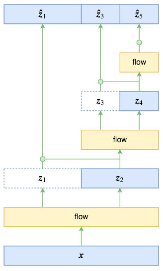
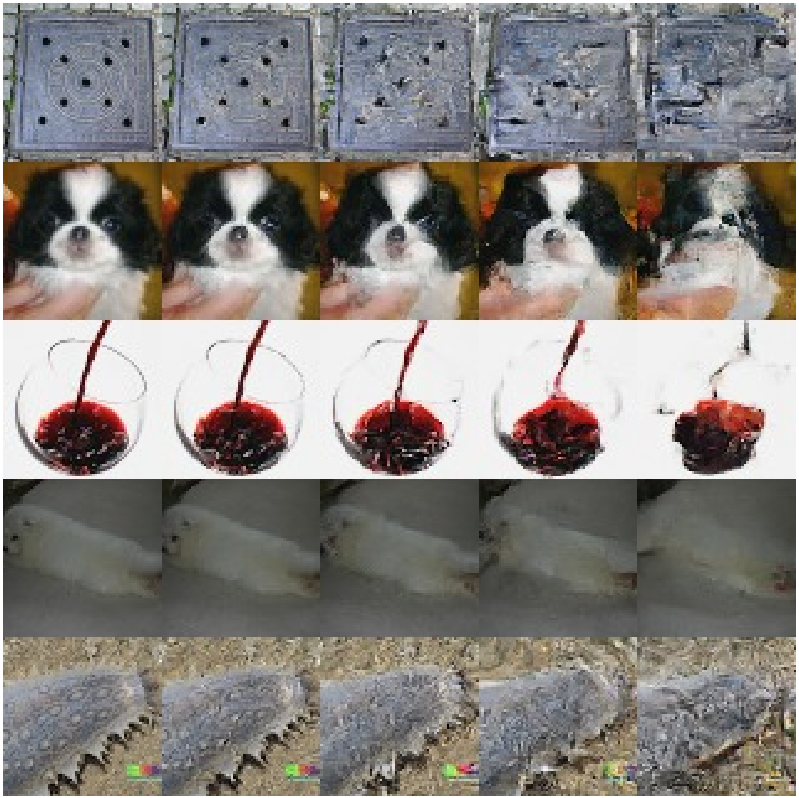

# DENSITY ESTIMATION USING REAL NVP

ICLR 2017


**以隐空间Z的隐变量z抽样为模型核心，以容易计算的log-likelihood损失函数为指导**


## Abstract

Unsupervised learning of probabilistic models is a central yet challenging problem
in machine learning. Specifically, designing models with tractable learning, sampling, inference and evaluation is crucial in solving this task. 概率模型的无监督学习是机器学习中的一个核心但具有挑战性的问题。 具体而言，设计具有易于学习，采样，推理和评估的模型对于解决此任务至关重要。 

We extend the space of such models using real-valued non-volume preserving (Real NVP) transformations, a set of powerful, stably invertible, and learnable transformations, resulting in an unsupervised learning algorithm with exact log-likelihood computation, exact and efficient sampling, exact and efficient inference of latent variables, and an interpretable latent space. 

我们使用实值非体积保持（Real NVP）转换，一组功能强大，稳定可逆且可学习的转换来扩展此类模型的空间，从而产生具有**精确对数似然计算**，**精确高效采样** ，**精确高效的潜在变量推断**以及**可解释的潜在空间**的无监督学习算法 

We demonstrate its ability to model natural images on four datasets through sampling, log-likelihood evaluation, and latent variable manipulations.

我们通过采样，对数似然评估和潜在变量操作在四个数据集上展示了模型对自然图像建模的能力。


---

## 1. Introduction

The domain of representation learning has undergone tremendous advances due to improved supervised learning techniques. However, unsupervised learning has the potential to leverage large pools of unlabeled data, and extend these advances to modalities that are otherwise impractical or impossible.由于改进的监督学习技术，表征学习领域已经取得了巨大的进步。 但是，无监督学习有可能利用大量未标记的数据，并将这些进展扩展到原本不切实际或不可能的模式。

One principled approach to unsupervised learning is generative probabilistic modeling. Not only do generative probabilistic models have the ability to create novel content, they also have a wide range of reconstruction related applications including inpainting[61 , 46 , 59], denoising[3], colorization[71], and super-resolution[9].

一种无监督学习的原则方法是**生成概率模型**。 生成概率模型不仅具有创建新颖内容的能力，而且还具有与**重建**相关的广泛应用，包括**修复**[61，46，59]，**去噪**[3]，**着色**[71]和**超分辨率**[9]。

As data of interest are generally high-dimensional and highly structured, the challenge in this domain is building models that are powerful enough to capture its complexity yet still trainable. We address this challenge by introducing real-valued non-volume preserving (Real NVP) transformations, a tractable yet expressive approach to modeling high-dimensional data.

由于关注的数据通常是**高维**且**高度结构化**的，因此在此领域中的挑战是建立**足以捕获其复杂性**但**仍可训练**的模型。 我们通过引入实值非体积保持（Real NVP）转换来解决此挑战，这是一种对高维数据建模的易处理但富有表现力的方法。

This model can perform efficient and exact inference, sampling and log-density estimation of data points. Moreover, the architecture presented in this paper enables exact and efficient reconstruction of input images from the hierarchical features extracted by this model.

该模型可以执行高效且精确的数据点推断，采样和对数密度估计。此外，本文提出的体系结构能够从该模型提取的**分层特征**中准确而有效地**重建**输入图像。


---

## 2. Related work

Substantial work on probabilistic generative models has focused on training models using maximum likelihood. One class of maximum likelihood models are those described by probabilistic undirected graphs, such as Restricted Boltzmann Machines [ 58 ] and Deep Boltzmann Machines [ 53 ]. These models are trained by taking advantage of the **conditional independence** property of their **bipartite** structure to allow efficient exact or approximate posterior inference on latent variables. However, because of the **intractability** of the **associated marginal distribution** over latent variables, their training, evaluation, and sampling procedures necessitate the use of approximations like **Mean Field inference** and **Markov Chain Monte Carlo**, whose convergence time for such complex models remains undetermined, often resulting in generation of highly correlated samples. Furthermore, these approximations can often hinder their performance[7].

关于**概率生成模型**的大量工作集中在使用**最大似然**的训练模型上。一类最大似然模型是由**概率无向图**描述的那些模型，例如**受限玻尔兹曼机**[58]和**深玻尔兹曼机**[53]。通过利用其**二分结构**的**条件独立**性的优势来训练这些模型，以允许对潜在变量进行有效的精确或近似后验推断。但是，由于潜在变量的**相关边际分布**难以处理，因此它们的训练，评估和抽样程序必须使用**均值推断**和**马尔可夫链蒙特卡洛**等近似方法，其对于此类复杂模型的**收敛时间尚未确定**，尤其是在生成高度相关的样本中。此外，这些近似值通常会阻碍其性能[7]。


**Directed graphical models** are instead defined in terms of an ancestral sampling procedure, which is appealing both for its conceptual and computational simplicity. They lack, however, the conditional independence structure of undirected models, making exact and approximate posterior inference on latent variables cumbersome [ 56 ]. Recent advances in **stochastic variational inference** [ 27 ] and **amortized inference** [ 13 , 43 , 35 , 49 ], allowed efficient approximate inference and learning of deep directed graphical models by maximizing a variational lower bound on the log-likelihood [ 45 ].

In particular, the **variational autoencoder** algorithm [35 , 49] simultaneously learns a generative network, that maps gaussian latent variables z to samples x , and a matched approximate inference network that maps samples x to a semantically meaningful latent representation z , by exploiting the reparametrization trick [68]. Its success in leveraging recent advances in backpropagation [ 51 , 39 ] in deep neural networks resulted in its adoption for several applications ranging from speech synthesis [ 12 ] to language modeling [ 8 ]. Still, the approximation in the inference process limits its ability to learn high dimensional deep  representations, motivating recent work in improving approximate inference [42, 48, 55, 63, 10, 59, 34].

后来，根据祖先采样过程定义了**有向图模型**，这在概念和计算方面都很吸引人。但是，它们**缺乏无向模型的条件独立性结构**，使得对**潜在变量的精确和近似后验推断变得麻烦**[56]。 **随机变分推理**[27]和**平摊推理**[13、43、35、49]的最新进展，通过**最大化对数似然的变分下限**[45]，可以进行有效的近似推论并学习深度有向图模型。

特别地，变分自动编码器算法[35，49]同时学习一个生成网络，该网络将高斯潜在变量 z 映射到样本 x，以及一个匹配的近似推理网络，通过利用**重参数化**技巧[68]**将样本 x 映射到语义上有意义的潜在表示 z**。它成功地利用了深度神经网络中反向传播的最新进展[51，39]，导致其被从语音合成[12]到语言建模[8]的多种应用所采用。 尽管如此，**推理过程中的近似值仍限制了其学习高维深度表示的能力**，从而激励了最近的工作，**改进近似推断**[42、48、55、63、10、59、34]。


Such approximations can be avoided altogether by abstaining from using latent variables. Auto-regressive models [ 18 , 6 , 37 , 20 ] can implement this strategy while typically retaining a great deal of flexibility. This class of algorithms tractably models the joint distribution by decomposing it into a product of conditionals using the probability chain rule according to a fixed ordering over dimensions, simplifying log-likelihood evaluation and sampling. Recent work in this line of research has taken advantage of recent advances in recurrent networks [ 51 ], in particular long-short term memory [ 26 ], and residual networks [ 25 , 24 ] in order to learn state-of-the-art generative image models [ 61 , 46 ] and language models [ 32 ]. 

The ordering of the dimensions, although often arbitrary, can be critical to the training of the model [ 66 ]. The sequential nature of this model limits its computational efficiency. For example, its sampling procedure is sequential and non-parallelizable, which can become cumbersome in applications like speech and music synthesis, or real-time rendering.. Additionally, there is no natural latent representation associated with autoregressive models, and they have not yet been shown to be useful for semi-supervised learning.

通过**避免使用潜在变量**，可以完全避免这种**近似的缺陷**。**自回归模型**[18，6，37，20]可以实施此策略，同时通常保留很大的灵活性。此类算法通过使用**概率链规则**根据维度上的固定顺序将其**分解**为**条件乘积**来对**联合分布**进行建模，从而**简化了对数似然评估和采样**。该研究领域的最新工作利用了**递归网络**[51]，特别是**长期短期记忆**[26]，以及**残差网络**[25、24]的最新进展，以学习最新技术改进生成图像模型[61，46]和语言模型[32]。 

尽管**维度的顺序**通常是任意的，但是其对于模型的训练至关重要[66]。该模型的顺序性质限制了其计算效率。 例如，它的采样过程是顺序的且不可并行的，这在语音和音乐合成或实时渲染等应用中可能会变得很麻烦。此外，自回归模型还没有**自然的潜在表示形式**，并且它们还没有被证明对**半监督学习**很有用。


Generative Adversarial Networks (GANs) [ 21 ] on the other hand can train any differentiable generative network by avoiding the maximum likelihood principle altogether. Instead, the generative network is associated with a discriminator network whose task is to distinguish between samples and real data. Rather than using an intractable log-likelihood, this discriminator network provides the training signal in an adversarial fashion. Successfully trained GAN models [ 21 , 15 , 47 ] can consistently generate sharp and realistically looking samples [ 38 ]. However, metrics that measure the diversity in the generated samples are currently intractable [ 62 , 22 , 30 ]. Additionally, instability in their training process [47] requires careful hyperparameter tuning to avoid diverging behavior. 

另一方面，生成对抗网络（GAN）[21]可以通过完全**避免最大似然原理**来训练任何可分化的生成网络。相反，生成网络与鉴别器网络相关联，鉴别器网络的任务是区分样本和真实数据。该鉴别器网络不是使用难以解决的对数似然性，而是以**对抗性方式提供训练信号**。成功训练的GAN模型[21、15、47]可以持续生成清晰逼真的样本[38]。 然而，测量所生成的样本中的**多样性的度量标准**目前是难以理解的[62、22、30]。 另外，训练过程中的不稳定性[47]需要**仔细的超参数调整**，以避免行为分歧。


理论上，训练将潜在变量 $z \sim p_Z$ 映射到样本 $x \sim p_X$ 的生成网络 $g$ 不需要像 GAN 中那样的鉴别器网络，也不需要像变分自编码器中那样的近似推理。**如果** $g$ 是**双射**的，**则可以**使用变量公式的更改通过最大似然来训练它： $x = g(z)、z= g^{-1}(x)$
$$
\begin{equation}
 p_{X}(x)=p_{Z}(z)\left|\operatorname{det}\left(\frac{\partial g(z)}{\partial z^{T}}\right)\right|^{-1}  \tag{1}
\end{equation}
$$

该最大似然公式公式已在几篇论文中进行了讨论，包括独立分量分析（ICA）[4，28]，高斯化[14，11]和深度密度模型[5，50，17，3]。 正如非线性ICA解决方案的存在性证据[29]所示，自回归模型可以看作是最大似然非线性ICA的易于处理的实例，其中残差对应于独立分量。 但是，正常的应用变量公式的更改会产生计算量大且条件差的模型，因此这种类型的大规模模型尚未进入普遍使用。


式（1）的推导过程
$$
\begin{align*}
  p_{X}(x)\Delta x&=p_{Z}(z)\Delta z\\
  p_{X}(x)\frac{\Delta x}{\Delta z}&=p_{Z}(z)  \\
  x &= g(z)\\
  p_{X}(x)|\operatorname{det}(g)|&=p_{Z}(z) \\
  p_{X}(x)&=p_{Z}(z) |\operatorname{det}(g)|^{-1}\\
\end{align*}
$$
其中
$$
\operatorname{det}(g)=\operatorname{det}(\frac{\delta x}{\delta z^T})=\operatorname{det}(\frac{\delta g(z)}{\delta z^T})
$$
下三式相等
$$
p_{X}(x)=p_{Z}(z) |\operatorname{det}(g)|^{-1}\\
p_{X}(x)=p_{Z}(z) |\frac{1}{\operatorname{det}(g)}|\\
p_{X}(x)=p_{Z}(z) |\operatorname{det}(g^{-1})|
$$
这是雅可比矩阵的性质，倒数就相当于函数的逆转。


---

## 3. Model definition

In this paper, we will tackle the problem of learning highly nonlinear models in high-dimensional continuous spaces through maximum likelihood. 在本文中，我们将通过**最大似然**解决在**高维连续空间**中学习**高度非线性模型**的问题。

In order to optimize the log-likelihood, we introduce a more flexible class of architectures that enables the computation of log-likelihood on continuous data using the change of variable formula. Building on our previous work in [ 17 ], we define a powerful class of **bijective functions** which enable exact and tractable density evaluation and exact and tractable inference.  为了优化对数似然，我们引入了一种更灵活的体系结构类别，该体系结构允许使用变量公式的更改对连续数据进行对数似然计算。 在我们以前的工作 NICE 的基础上，我们定义了一类强大的**双射函数**，该函数能够进行精确易处理的**密度评估**以及精确易处理的**推断**。 

Moreover, the resulting cost function does not to rely on a fixed form reconstruction cost such as square error [ 38 , 47 ], and generates sharper samples as a result.  而且，所得的成本函数**不依赖于**诸如平方误差[38、47]之类的**固定形式的重建成本**，并且因此产生更**清晰**的样本。 

Also, this flexibility helps us leverage recent advances in batch normalization [ 31 ] and residual networks [24, 25] to define a very deep multi-scale architecture with multiple levels of abstraction.  此外，这种灵活性还帮助我们利用 BN [31]和残差网络[24、25]的最新进展来定义具有多个抽象级别的非常深的多尺度体系结构。


---

### 3.1. Change of variable formula

给定一个观测数据变量 $x\in X$，一个潜在变量 $z\in Z$ ，服从一个简单先验概率分布 $p_Z$ 以及一个双映 $ f: X \rightarrow Z $（ $g = f^{-1}:Z\rightarrow X$），变量公式的变化定义了一个模型分布在 $X$ 上

双射 $Z = f(X)$，$Z = g(X)$，$f = g^{-1}$<span id="eq2"></span>
$$
\begin{equation}
 \begin{aligned} p_{X}(x) &=p_{Z}(f(x))\left|\operatorname{det}\left(\frac{\partial f(x)}{\partial x^{T}}\right)\right|  \\ 
 \log \left(p_{X}(x)\right) &=\log \left(p_{Z}(f(x))\right)+\log \left(\left|\operatorname{det}\left(\frac{\partial f(x)}{\partial x^{T}}\right)\right|\right) \end{aligned} \tag{2,3} 
\end{equation}
$$
$\frac{\delta f(x)}{\delta x^T}$ 是 $f$ 在 $x$ 处的雅可比行列式。可以使用逆变换采样规则[16]来生成精确分布的样本。在潜在空间中绘制样本 $z\sim p_Z$，其逆图像 $x = f^{-1}(z)= g(z)$ 在原始空间中生成一个样本。通过的图像 $f(x)$ 的密度乘以相关的雅可比行列式 $\operatorname{det} \frac{\delta f(x)}{\delta x^T}$ 可以完成 $x$ 点上密度的计算。见**Fig. 1**。精确有效的推理可以对模型进行准确，快速的评估。


**Fig. 1**: Real NVP 可以学习数据分布 $ \hat{p}_{X} $ 和潜在分布 $p_Z$（通常是高斯）之间可逆稳定的映射。这里显示了在二维数据集上学习到的映射。函数 $f(x)$ 将左上方**数据分布**中的样本 $x$ **映射**为右上方**潜在分布**中的近似样本 $z$，这对应于**给定数据的潜在状态的精确推断**。逆函数 $f^{-1}(z)$ 将来自右下角的**潜在分布**的样本 $z$ **映射**为来自左下角的**数据分布**的近似样本 $x$ ，这对应于**从模型精确生成样本**。 对于 $f(x)$ 和 $f^{-1}(z)$ ，还分别说明了 $\mathcal{X}$ 和 $\mathcal{Z}$ 空间中的网格线的变换。


---

### 3.2. Coupling layers

Computing the Jacobian of functions with high-dimensional domain and codomain and computing the determinants of large matrices are in general computationally very expensive. This combined with the restriction to bijective functions makes Equation 2 appear impractical for modeling arbitrary distributions.

通常，使用高维**域和陪域**计算函数的雅可比行列式以及计算大矩阵的行列式在**计算**上非常昂贵。这与对双射函数的限制相结合，使 [Eq2](#eq2) 对于建模任意分布显得不切实际。

> domain: 定义域  
>
> codomain: 取值空间
>
> range: 值域
>
> 
>
> 设 $G$ 是从 $X$ 到 $Y$ 的关系，$G$ 的定义域 $D(G)$ 为 $X$，且对**任何** $x∈X$ 都有**惟一**的 $y∈Y$ 满足 $G(x，y)$，则称 $G$ 为从 $X$ 到 $Y$ 的**映射**。
>
> 关系 $G$ 常使用另一些记号：$f: X→Y$ 等， $f$ 与 $G$ 的关系是 $y=f(x)(x∈X)$，当且仅当 $G(x，y)$ 成立，可取**变域** $X$ 中的不同元素为值的变元称为自变元或**自变量**，同样可取**变域** $Y$ 中的不同元素为值的变元称为因变元或**因变量**。
>
> 始集 $X$ 称为映射 $f$ 的**定义域**，记为 $D(f)$ 或 $dom(f)$；终集 $Y$ 称为映射的**陪域**，记为 $C(f)$ 或 $codom(f)$ ；$Y$ 中与 $X$ 中的元素有关系 $G$ 的元素的组合 $\{y|\exist x(x∈X∧y=f(x)∈Y)\}$称为映射的**值域**，记为 $R(f)$ 或$ran(f)$；
>
> 
>
> 当 $y=f(x)$ 时，$y$ 称为 $x$ 的象，而 $x$ 称为 $y$ 的原象，$y$ 的所有原象所成之集用 $f^{-1}(y)$ 表示；
>
> 对于 $A⊆X$，所有 $A$ 中元素的象的集合 ${y|\exist x(x∈A∧y=f(x)∈Y)}$ 或 ${f(x)|x∈A}$ 称为 $A$ 的**象**，记为$f(A)$ ；
>
> 对于 $B⊆Y$ ，所有 $B$ 中元素的原象的集合 ${x|x∈X∧∃y(y∈B∧y=f(x))}$ 称为 $B$ 的**原象**，记为 $f^{-1}(B)$。


> 数学上，单射、满射和双射指根据其**定义域**和**陪域**的关联方式所区分的三类函数。
>
> **单射**：指将不同的变量映射到不同的值的函数。
>
> **满射**：指**陪域等于值域**的函数， 即：对陪域中任意元素，都存在至少一个定义域中的元素与之对应。
>
> **双射**（也称一一对应）：既是单射又是满射的函数。直观地说，一个双射函数形成一个对应，并且每一个输入值都有正好一个输出值以及每一个输出值都有正好一个输入值。
>
> 


但是，如 NICE 中所示，通过仔细设计函数 $f$，可以学习一个既易于处理又非常灵活的双射模型。由于计算变换的雅可比行列式对于有效利用该原理进行训练至关重要，因此这项工作利用了以下简单观察结果：可以将**三角矩阵**的行列式有效地计算为其**对角线项的乘积**


我们通过堆叠一系列简单的双射来构建灵活且易于处理的双射函数。在每个简单的双射中，使用易于求逆的函数更新输入向量的一部分，但是该函数以复杂的方式取决于输入向量的其余部分。我们将每一个简单双射称为仿射耦合层 affine coupling layer。 给定 $D$ 维输入 $x$ 和 $d <D$，仿射耦合层的输出 $y$ 遵循以下等式
$$
\begin{equation}
 \begin{aligned} 
 y_{1: d} &=x_{1: d} \\ 
 y_{d+1: D} &=x_{d+1: D} \odot \exp \left(s\left(x_{1: d}\right)\right)+t\left(x_{1: d}\right) 
 \end{aligned} 
\end{equation}\tag{4,5}
$$
其中 $s$ 和 $t$ 代表比例尺度和平移，并且是 $ R^{d} \mapsto R^{D-d} $ 中的函数，且 $\odot$ 是Hadamard乘积或逐元素乘积（参见**Fig. 2** ）。


**Fig. 2**  正向和反向传播的计算图。耦合层应用简单的可逆变换，该变换首先缩放，然后对输入向量的一部分 $\mathbf{x}_2$ 加上恒定的偏移量，其以输入向量的另一部分 $\mathbf{x}_1$ 为条件。由于其简单的性质，这种转换既容易逆转，又具有易处理的行列式。但是，由函数 $s$ 和 $t$ 捕获的此转换的条件性质显著增加了此否则为弱函数的灵活性。正向和反向传播操作具有相同的计算成本。


---

### 3.3. Properties

这个转变的雅可比式为
$$
\begin{equation}
 \frac{\partial y}{\partial x^{T}}=
 
 \left[
 \begin{array}{cc}
 \frac{\partial y_{1: d}}{\partial x_{1: d}^{T}} & 
 \frac{\partial y_{1: d}}{\partial x_{d+1: D}^{T}} \\ 
 \frac{\partial y_{d+1: D}}{\partial x_{1: d}^{T}} & 
 \frac{\partial y_{d+1: D}}{\partial x_{d+1: D}^{T}}
 \end{array}
 \right] 
 
\end{equation}\tag{6}
$$
左上为恒等变换，结果为单位矩阵；右上没有关系，结果为0；左下关系较为复杂，但计算行列式时用不到。
$$
\begin{equation}
 \frac{\partial y}{\partial x^{T}}=
 
 \left[
 \begin{array}{cc}
 \mathbb{I}_{d} & 0 \\ 
 \frac{\partial y_{d+1: D}}{\partial x_{1: d}^{T}} & 
 \operatorname{diag}\left(\exp \left[s\left(x_{1: d}\right)\right]\right)
 \end{array}
 \right] 
 
\end{equation}\tag{6}
$$
其中右下 $\operatorname{diag}\left(\exp \left[s\left(x_{1: d}\right)\right]\right)$ 是对角矩阵，其对角元素对应于向量 $\exp \left[s\left(x_{1: d}\right)\right]$ 。鉴于观察到该雅可比矩阵为下**三角**矩阵，我们可以有效地将其行列式计算为**对角线之积**，放到**指数阶中变为之和** $$ \exp \left[\sum_{j} s\left(x_{1: d}\right)_{j}\right] $$。由于计算耦合层操作的雅可比行列式不涉及计算 $s$ 或 $t$ 的雅可比行列式，**因此这些函数可以任意复杂**。 我们将使它们成为深度卷积神经网络。请注意，$s$ 和 $t$ 的**隐藏层**可以具有比其输入和输出层**更多的特征**。

在定义概率模型的情况下，这些耦合层的另一个有趣的特性是它们的可逆性。实际上，计算逆运算与前向传播一样简单（见**Fig .2b**），
$$
\begin{equation}
 \left\{\begin{array}{ll}y_{1: d} & =x_{1: d} \\ y_{d+1: D} & =x_{d+1: D} \odot \exp \left(s\left(x_{1: d}\right)\right)+t\left(x_{1: d}\right)\end{array}\right. 
\end{equation}\tag{7}
$$

$$
\begin{equation} 
 \Leftrightarrow
 \left\{\begin{array}{l}
 x_{1: d}&=y_{1: d} \\ 
 x_{d+1: D}&=\left(y_{d+1: D}-t\left(y_{1: d}\right)\right) \odot \exp \left(-s\left(y_{1: d}\right)\right)
 \end{array}\right.
 
\end{equation}\tag{8}
$$

这意味着**采样**与该模型的**推断**一样高效。再次注意，计算耦合层的逆数不需要计算 $s$ 或 $t$ 的逆数，因此这些函数可能是任意复杂的，并且难以求逆。


---

### 3.4. Masked convolution

**注意，不是任意情况下套用卷积都是合理的，用卷积的前提是输入（在空间维度）具有局部相关性。图像本身是具有局部相关性的，因为相邻之间的像素是有一定关联的，因此一般的图像模型都可以使用卷积。**

可以使用二进制掩码 $b$ 并使用 $y$ 的函数形式来实现**划分区域**，
$$
\begin{equation}
 y=b \odot x+(1-b) \odot(x \odot \exp (s(b \odot x))+t(b \odot x)) 
\end{equation}\tag{9}
$$
我们使用了两个利用图像的局部相关结构的分区：spatial checkerboard pattern 和 channel-wise mask（见**Fig. 3**）。如果空间坐标为奇数则 spatial checkerboard pattern 的值为 1，否则为 0。channel-wise mask $b$ 对于通道尺寸的前一半为 1，对于后一半为 0。对于此处介绍的模型，$s(·)$ 和 $t(·)$ 均为整流卷积网络。


**Fig. 3** 仿射耦合层的**两种掩码方案**。左侧是 spatial checkerboard pattern。右侧是 channel-wise mask。压缩操作将左侧的 $4×4×1$ 张量减小为右侧的 $2×2×4$ 张量。在压缩操作之前，spatial checkerboard pattern 用于**耦合层**，在压缩操作之后使用 channel-wise mask。


> 不是任意情况下套用卷积都是合理的，用卷积的前提是输入（在空间维度）具有**局部相关性**。
>
> 图像本身是具有局部相关性的，因为相邻之间的像素是有一定关联的，因此一般的图像模型都可以使用卷积。
>
> 但是 flow 中的两个操作：1、将输入**分割**为两部分 $x_1$, $x_2$，然后输入到耦合层中，而模型 $s$, $t$ 事实上只对$x_1$ 进行处理；2、特征输入耦合层之前，要**随机打乱**原来特征的各个维度（相当于乱序的特征）。这两个操作都会**破坏局部相关性**，比如分割操作有可能割裂原来相邻的像素，随机打乱也可能将原来**相邻**的两个**像素分割得很远**。
>
> 
>
> 所以，如果还要坚持使用卷积，就要想办法**保留这种空间的局部相关性**。一幅图像有三个轴：高度（height）、宽度（width）、通道（channel），前两个属于**空间轴，显然具有局部相关性**，因此能操作的的就只有“**通道**”轴。为此，RealNVP 约定**分割和打乱**操作，**都只对“通道”轴执行**。也就是说，沿着通道将输入分割为 $x_1,x_2$ 后，$x_1$ 还是具有局部相关性的，还有沿着通道按着同一方式打乱整体后，空间部分的相关性依然得到保留，因此在模型 $s, t$ 中就可以使用卷积了。
>
> 
>
> 注： 在 RealNVP 中，将输入分割为两部分的操作称为 mask，因为这等价于用 0/1来区别标注原始输入。除了前面说的通过通道轴对半分的 mask 外，RealNVP 事实上还引入了一种空间轴上的交错 mask，如上图的右边，这种 mask 称为棋盘式 mask（格式像国际象棋的棋盘）。这种特殊的分割也保留了空间局部相关性，原论文中是两种 mask 方式交替使用的，但这种**棋盘式 mask 相对复杂，也没有什么特别明显的提升，所以在 Glow 中已经被抛弃**。


---

### 3.5. Combining coupling layers


**Fig. 4a** 在这种交替模式中，在下一个转换中修改在一个转换中保持相同的单元。

尽管耦合层可能很强大，但它们的正向变换使某些组件保持不变。可以通过以交替方式构成耦合层来克服此困难，以便在下一个耦合层中更新保留在一个耦合层中不变的组件（见 **Fig. 4a**）。依赖于这个架构，得出函数的雅可比行列式**仍然是易处理**的：
$$
\begin{equation}
 \begin{aligned} \frac{\partial\left(f_{b} \circ f_{a}\right)}{\partial x_{a}^{T}}\left(x_{a}\right) &=\frac{\partial f_{a}}{\partial x_{a}^{T}}\left(x_{a}\right) \cdot \frac{\partial f_{b}}{\partial x_{b}^{T}}\left(x_{b}=f_{a}\left(x_{a}\right)\right) \\ \operatorname{det}(A \cdot B) &=\operatorname{det}(A) \operatorname{det}(B) \end{aligned} 
\end{equation}\tag{10,11}
$$
类似地，它的逆可以很容易地计算为
$$
\begin{equation}
 \left(f_{b} \circ f_{a}\right)^{-1}=f_{a}^{-1} \circ f_{b}^{-1} 
\end{equation}\tag{12}
$$


随机打乱，充分混合信息


---

### 3.6. Multi-scale architecture

我们使用**压缩 squeezing 操作**实现多尺度体系结构：对于每个通道，它将图像划分为形状为 $ 2\times 2 \times c $ 的子正方形，然后将其重塑为形状为 $ 1 \times 1 \times 4 $ 的子正方形。压缩操作将 $ s \times s \times c $ 张量转换为 $ \frac{s}{2} \times \frac{s}{2} \times 4 c $ 张量（见 **Fig. 3**），有效地将**空间大小**换成了**通道数**。**在保持相关性的情况，同时起到打散变量的作用**。


**Fig. 3** 仿射耦合层的掩码方案。左侧是空间棋盘模板。右侧是逐通道遮蔽。压缩操作将左侧的 $4×4×1$ 张量减小为右侧的 $2×2×4$ 张量。在压缩操作之前，空间棋盘模板用于**耦合层**，而之后使用**通道**方向遮蔽图案。


> 一般的图像通道轴就只有三维，像 MNIST 这种灰度图还只有一维，怎么分割成两半？又怎么随机打乱？为了解决这个问题，RealNVP 引入了称为 **squeeze** 的操作，来让通道轴具有更高的维度。其思想很简单：**直接reshape**，但 reshape 时**局部地进行**。具体来说，假设原来图像为 $h×w×c$ 大小，前两个轴是空间维度，然后沿着空间维度分为一个个 $2×2×c$ 的块（这个 2 可以自定义），然后将每个块直接 reshape 为$1×1×4c$，也就是说最后变成了 $h/2 \times w/2 \times 4c$。
>
> 
>
> 有了 squeeze 这个操作，我们就可以增加通道轴的维数，但依然保留局部相关性，从而我们前面说的所有事情都可以进行下去了，所以 **squeeze** 成为 flow 模型在图像应用中的**必备操作**。


At each scale, we combine several operations into a sequence: we first apply three coupling layers with alternating checkerboard masks, then perform a squeezing operation, and finally apply three more coupling layers with alternating channel-wise masking. 

在每个尺度上，我们将几个操作组合为一个序列：首先应用三个交替的 **spatial checkerboard pattern** **耦合**层，然后执行**压缩**操作，最后应用三个交替的 **channel-wise mask** **耦合**层。

The channel-wise masking is chosen so that the resulting partitioning is not redundant with the previous checkerboard masking (see Figure 3). For the final scale, we only apply four coupling layers with alternating checkerboard masks. 

选择 channel-wise masking，以使生成的分区与先前的 checkerboard masking 无关（见 **Fig. 3**）。对于最终尺度，我们仅应用四个具有交替的 spatial checkerboard pattern 的耦合层。


在计算和存储成本方面以及在需要训练的参数数量方面，在所有耦合层中传播 $D$ 维向量将很麻烦。 因此，我们遵循[57]的设计选择，并定期将尺寸缩小一半（见[Eq14](#eq14)）。 我们递归定义此操作（见**Fig. 4b**）<span id="eq14"></span>

$$
\begin{equation}
 \begin{aligned} 
 h^{(0)} &=x \\
 \left(z^{(i+1)}, h^{(i+1)}\right) &=f^{(i+1)}\left(h^{(i)}\right) \\ 
 z^{(L)} &=f^{(L)}\left(h^{(L-1)}\right) \\ 
 z &=\left(z^{(1)}, \ldots, z^{(L)}\right)
 \end{aligned} 
\end{equation}\tag{13,14,15,16}
$$


**Fig. 4b** 排除变量。在每个步骤中，一半变量直接建模为高斯模型，而另一半则进行进一步的转换。越是后几层导出的隐变量 $z$，越是**有较高级的语义属性**。从信息论角度认为，可以理解每个可逆转换函数 $f$ 蕴含映射 $X空间 <–> Z空间$ 的信息，函数 $f$ 越多，**拥有的空间转换能力越强**，最终可以导致：如果隐变量 $z$ 蕴含较高语义的布局样式等信息，可逆函数 $f^{-1}$ 也能成功还原出图像（不仅是像素级别的还原）。


在我们的实验中，我们对 $i<L$ 使用此运算。 当计算 $f^{(i)}$（[Eq14](#eq14)）时，每层执行上述 **耦合-压缩-耦合** 操作的序列。在每一层，随着空间分辨率的降低，$s$ 和 $t$ 中隐藏层**特征的数量**将增加一倍。将已在不同尺度上分解的所有变量 `concat()` 在一起，就获得了最终的转换后的输出（[Eq16](#eq14)）。**多尺度架构降低了模型复杂度，引入了正则的效果**。**耦合-压缩-耦合** 过程代码如下：

```python
for coupling in self.in_couplings:
    # 3x coupling (checkboard)
    x, sldj = coupling(x, sldj, reverse) # sldj is log-determinant jacobian, ignore

if not self.is_last_block:
    # Squeeze -> 3x coupling (channel-wise)
    x = squeeze_2x2(x, reverse=False) # squeeze as mentioned above
    for coupling in self.out_couplings:
        x, sldj = coupling(x, sldj, reverse)
    x = squeeze_2x2(x, reverse=True) # unsqueeze to original shape

    # Re-squeeze -> split -> next block
    x = squeeze_2x2(x, reverse=False, alt_order=True) # 这个squeeze(alt_order=True)我没看懂是在干嘛, 总之到这里scale是halved
    x, x_split = x.chunk(2, dim=1) # 如公式(14), # 把channel分成两半
    x, sldj = self.next_block(x, sldj, reverse), # 一半进入下一个block(递归)
    x = torch.cat((x, x_split), dim=1) # 下一个block输出的结果(尺度没变)和另一半cat起来
    x = squeeze_2x2(x, reverse=True, alt_order=True) # 最终结果unsqueeze回原先的scale
```


As a consequence, the model must Gaussianize units which are factored out at a finer scale (in an earlier layer) before those which are factored out at a coarser scale (in a later layer). This results in the definition of intermediary levels of representation [53 , 49] corresponding to more local, fine-grained features as shown in Appendix D.

因此（As a consequence），该模型必须对以较细尺度（较前层）分解出的单元高斯化，然后再将其以较粗尺度（较后层）分解的单元进行高斯化。这导致了中间层次的表示[53、49]的定义，对应于 [Appendix D](#appendixd) 所示的更局部，细粒度的特征。


Moreover, Gaussianizing and factoring out units in earlier layers has the practical benefit of distributing the loss function throughout the network, following the philosophy similar to guiding intermediate layers using intermediate classifiers [40]. 

此外，早期层中的高斯化和分解单元具有在整个网络中分配损失函数的好处，遵循类似于使用中间分类器引导中间层的原理[40]。它还显著减少了模型使用的计算量和内存量，从而使我们能够训练更大的模型。


> 如下图所示。原始输入经过第一步 flow 运算（“flow运算” 指的是多个仿射耦合层的复合）后，输出跟输入的大小一样，这时候将输入对半分开两半 $z_1,z_2$ （自然也是沿着通道轴），其中 $z_1$ 直接输出，而只将 $z_2$ 送入到下一步 flow 运算，后面的依此类推。比如图中的特例，最终的输出由 $z_1,z_3,z_5$ 组成，总大小跟输入一样。
>
> 
>
> 多尺度结构有点“分形”的味道，原论文说它启发于 VGG。每一步的多尺度操作直接将数据**尺寸减少到原来的一半**，显然是非常可观的。但有一个很重要的细节，在 RealNVP 和 Glow 的论文中都没有提到，我是看了源码才明白的，那就是**最终的输出** $[z_1,z_3,z_5]$ **的先验分布应该怎么取**？按照 flow 模型的通用假设，直接设为一个标准正态分布？
>
> 事实上，作为**不同位置**的多尺度输出，$[z_1,z_3,z_5]$ 的**地位是不对等**的，而如果直接设一个**总体的标准正态分布**，那就是**强行将它们对等起来**，这是不合理的。最好的方案，应该是写出条件概率公式
> $$
> p(\boldsymbol{z}_1,\boldsymbol{z}_3,\boldsymbol{z}_5)=p(\boldsymbol{z}_1|\boldsymbol{z}_3,\boldsymbol{z}_5)p(\boldsymbol{z}_3|\boldsymbol{z}_5)p(\boldsymbol{z}_5)
> $$
> 由于$z_3,z_5$ 是由 $z_2$ 完全决定的，$z_5$ 也是由 $z_4$ 完全决定的，因此条件部分可以改为
> $$
> p(\boldsymbol{z}_1,\boldsymbol{z}_3,\boldsymbol{z}_5)=p(\boldsymbol{z}_1|\boldsymbol{z}_2)p(\boldsymbol{z}_3|\boldsymbol{z}_4)p(\boldsymbol{z}_5)
> $$
> RealNVP 和 Glow 假设**右端三个概率分布都是正态分布**，其中 $p(\boldsymbol{z}_1|\boldsymbol{z}_2)$ 的均值方差由算 $z_2$ 出来（可以直接通过卷积运算，这有点像 VAE）， $p(\boldsymbol{z}_3|\boldsymbol{z}_4)$ 的均值方差由 $z_4$ 算出来， $p(\boldsymbol{z}_5)$ 的均值方差直接学习出来。
>
> 显然这样的假设会比简单认为它们都是标准正态分布要有效得多。我们还可以换一种表述方法：上述的先验假设相当于做了如下的变量代换
> $$
> \boldsymbol{\hat{z}}_1=\frac{\boldsymbol{z}_1 - \boldsymbol{\mu}(\boldsymbol{z}_2)}{\boldsymbol{\sigma}(\boldsymbol{z}_2)},\quad \boldsymbol{\hat{z}}_3=\frac{\boldsymbol{z}_3 - \boldsymbol{\mu}(\boldsymbol{z}_4)}{\boldsymbol{\sigma}(\boldsymbol{z}_4)},\quad \boldsymbol{\hat{z}}_5=\frac{\boldsymbol{z}_5 - \boldsymbol{\mu}}{\boldsymbol{\sigma}}\tag{5}
> $$
> 然后认为 $[\boldsymbol{\hat{z}}_1,\boldsymbol{\hat{z}}_3,\boldsymbol{\hat{z}}_5]$ 服从标准正态分布。同 NICE 的尺度变换层一样，这三个变换都会导致一个非 1 的雅可比行列式，也就是要往 loss 中加入形如 $\sum\limits_{i=1}^D\log \boldsymbol{\sigma}_i$ 的这一项。
>
> 多尺度结构并不仅仅为了降低运算量。由于 flow 模型的可逆性，输入输出维度一样，事实上这会存在非常严重的**维度浪费问题**，这往往要求我们需要用足够复杂的网络去缓解这个维度浪费。多尺度结构相当于**抛弃了 $p(z)$ 是标准正态分布的直接假设**，而采用了一个**组合式的条件分布**，这样尽管输入输出的**总维度依然一样**，但是不同层次的**输出地位已经不对等了**，模型可以通过**控制每个条件分布的方差来抑制维度浪费问题**（极端情况下，方差为 0，那么高斯分布坍缩为狄拉克分布，维度就降低1），**条件分布相比于独立分布具有更大的灵活性**。而如果单纯从 loss 的角度看，多尺度结构为模型提供了一个强有力的**正则项**（相当于多层图像分类模型中的多条直连边）。


---

### 3.7. Batch normalization

为了进一步改善训练信号的传播，我们使用深度残差网络[24，25] 和 $s$ 和 $t$ 中的批处理归一化[31]和权重归一化[2，54]。 如 [Appendix E](#appendixe) 所述，我们介绍并使用了一种新颖的 BN 变体，该变体基于最近的 minibatches 的运行平均值，因此，在使用非常小的 minibatches 进行训练时，鲁棒性更高。

我们还将对整个耦合层输出应用 BN。BN 的影响很容易包含在 Jacobian 计算中，因为它可以对每个维度进行线性缩放。即给定估计的批次统计量 $\tilde{\mu}$ 和 ${\tilde{\sigma}^{2}}$，重缩放函数
$$
\begin{equation}
 x \mapsto \frac{x-\tilde{\mu}}{\sqrt{\tilde{\sigma}^{2}+\epsilon}} \tag{17}
\end{equation}
$$
有一个雅可比矩阵的**行列式**：
$$
\begin{equation}
 \left(\prod_{i}\left(\tilde{\sigma}_{i}^{2}+\epsilon\right)\right)^{-\frac{1}{2}} 
\end{equation}\tag{18}
$$
BN 的这种形式可以被视为类似于深度强化学习中的 reward normalization[44，65]。

我们发现使用此技术不仅可以使用**更深的耦合层堆栈**进行训练，而且还可以缓解科研人员通过**基于梯度**的方法训练带有**比例参数**的**条件分布**时经常遇到的**不稳定性**问题。

其中上式推导过程如下：
$$
\hat{\mathbf{x}} = \operatorname{Norm}(\mathbf{x},\mathcal{X}) = (\tilde{\sigma}^{2}+\epsilon)^{-\frac{1}{2}}(x-\tilde{\mu}) \\
\frac{\partial \hat{\mathbf{x}}}{\partial x} = (\tilde{\sigma}^{2}+\epsilon)^{-\frac{1}{2}}
$$
其中 $\mathbf{x}$ 作为层输入，是一个向量，$\mathcal{X}$ 为训练数据集，用来计算均值和方差。


---

### 3.8. Loss

一般变换到高斯分布空间，最终的损失函数为:
$$
log(p_X(x)) = \sum_d[-\frac{1}{2}(z_d^2 + \operatorname{log}(2\pi))] - 
\frac{1}{2}\sum_i\operatorname{log}(\tilde{\sigma}_i^2+\epsilon)
$$
利用逆变换传播误差，反向训练非线性的卷积网络 $s$ 和 $t$.


流模型通过拆分输入变量成两个部分，一个部分不变，并且通过非线性变换和另一部分做元素乘积和加减等操作，达到**变换空间**的目的，同时**简化了计算雅可比行列式成本**。而为了达到**所有元素都参加变换**，每次通过一个流操作后，需要对输出做**混合打乱**，作为一个流操作的输入，堆叠多层后最终输出变换后的结果。


---

## Appendix

### D. Latent variables semantic<span id="appendixd"></span>

As in [ 22 ], we further try to grasp the semantic of our learned layers latent variables by doing ablation tests. 

We infer the latent variables and resample the lowest levels of latent variables from a standard gaussian, increasing the highest level affected by this resampling. 

As we can see in the following figures, the semantic of our latent space seems to be more on a graphic level rather than higher level concept. 

Although the heavy use of convolution improves learning by exploiting image prior knowledge, it is also likely to be responsible for this limitation.

像[22]中一样，我们进一步尝试通过消融测试来掌握学习层的潜在变量的语义。 

我们推断潜在向量并从标准高斯重新采样最低水平的潜在向量，从而增加了受此重采样影响的最高水平。

如下图所示，潜在空间的语义似乎更多是在图形层面而不是高层次的概念。 

尽管大量使用卷积可以通过利用图像先验知识来改善学习，但它也可能是造成这种局限的原因。


下图第一列是原图，后面几列是高层隐变量的还原图像，并且从左向右，把隐变量信息**逐步删减**（依次保留100%, 50%, 25%, 12.5% 到 6.25%），模型**依旧能还原图像的轮廓等高层信息**。




Figure 22: Conceptual compression from a model trained on Imagenet ( 64 × 64 ). The leftmost
column represent the original image, the subsequent columns were obtained by storing higher level
latent variables and resampling the others, storing less and less as we go right. From left to right:
100%, 50%, 25%, 12.5% and 6.25% of the latent variables are kept.

图22：在Imagenet（64×64）上训练的模型的概念压缩。最左边的列代表原始图像，其它列是通过存储更高级别的潜在向量并重新采样其他变量而获得的，从左到右，潜在向量的存储量越来越少。 从左到右：保留了100％，50％，25％，12.5％和6.25％的潜在变量。


图23：在CelebA上训练的模型的概念压缩。


图24：根据LSUN（卧室类别）训练的模型的概念压缩。


图25：根据LSUN（教堂户外类别）训练的模型的概念压缩。


图26：根据LSUN（塔式类别）训练的模型的概念压缩。


---

### E. Batch normalization<span id="appendixe"></span>

我们进一步通过使用层统计信息 $\tilde{\mu}_{t}$，$\tilde{\sigma}_{t}^{2}$ 的移动平均值的加权平均值和当前的批次统计信息 $\hat{\mu}_{t}$，$\hat{\sigma}_{t}^{2}$ 来进行批归一化实验。 
$$
\begin{equation}
 \tilde{\mu}_{t+1}=\rho \tilde{\mu}_{t}+(1-\rho) \hat{\mu}_{t}
\end{equation}\tag{20}
$$

$$
\tilde{\sigma}_{t+1}^{2}=\rho \tilde{\sigma}_{t}^{2}+(1-\rho) \hat{\sigma}_{t}^{2}\tag{21}
$$

其中，$\rho$ 是动量。 当使用 $\hat{\mu}_{t+1}$，$\hat{\sigma}_{t+1}^{2}$ 时，我们仅通过当前批处理统计 $\hat{\mu}_{t}$，$\hat{\sigma}_{t}^{2}$ 传播梯度。我们观察到，使用这种滞后可以帮助模型训练非常小的微型批次。在CIFAR-10上，我们使用具有移动平均数的批归一化。


