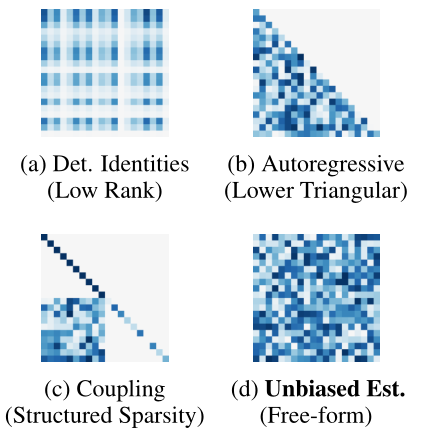
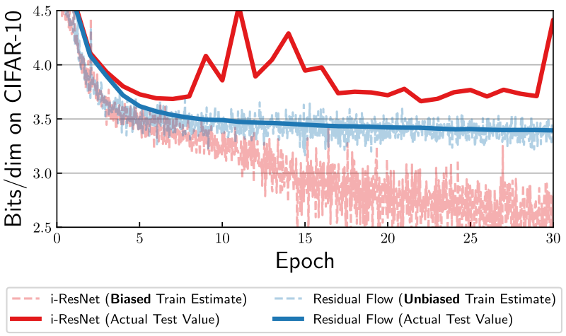
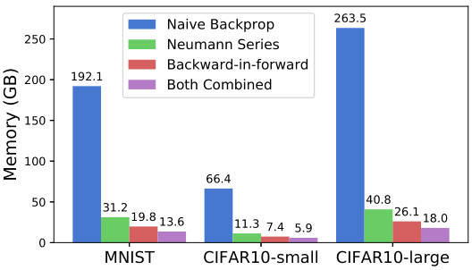
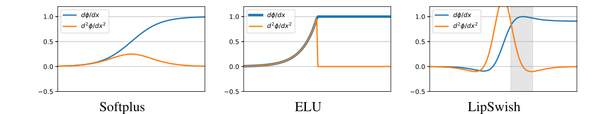

# Residual Flows for Invertible Generative Modeling

NIPS 2019

---

## Abstract

基于流的生成模型通过可逆变换对概率分布进行参数化，并且可以通过最大似然来进行训练。可逆残差网络提供了灵活的转换系列，其中仅需要 Lipschitz 条件而不是严格的体系结构约束即可实施可逆性。但是，先前的工作依靠**有偏的对数密度估计值**训练可逆残差网络以进行密度估计，其偏差随着网络表达的增加而增加。我们使用 “俄罗斯轮盘赌” 估算器给出对数密度的易于处理的无偏估计，并通过使用替代的无穷级数梯度来减少训练期间所需的内存。此外，我们通过提议使用避免导数饱和的激活函数以及将 Lipschitz 条件推广到诱导的混合范数来改善可逆残差块。产生的方法称为“残差流”，在基于流的模型中实现了最新的密度估计性能，并且优于在联合生成和判别模型中使用 coupling blocks 的网络

## 1. Introduction

最大似然是核心机器学习范式，它将学习视为分布对齐问题。然而，我们通常不清楚应该使用什么分布族（family of distributions）来拟合高维连续数据。在这方面，变量变化定理（the change of variables theorem）提供了一种构建灵活分布的吸引人的方法，该分布允许易于处理的精确采样和对其密度的有效评估。 这类模型通常称为可逆或基于流的生成模型（Deco，1995；Rezende，Variational inference with normalizing flows，2015）。

以可逆性作为其核心设计原则，基于流的模型（也称为标准化流）已证明能够生成逼真的图像（Kingma，Glow，2018 ），并且可以实现与竞争状态相当的密度估计性能 - 最先进的方法（Ho，Flow++，2019 ）。 在应用中，它们已被应用于研究对抗性鲁棒性（Jacobsen 等人，2019 年），并用于使用加权最大似然目标训练具有生成和分类能力的混合模型（Nalisnick 等人，2019 年）。

现有的基于流的模型（Rezende，Variational inference with normalizing flows，2015；Kingma ，Improved variational inference with inverse autoregressive flow，2016；Dinh，NICE，2014；Chen，NODE，2018）利用具有稀疏或结构化雅可比矩阵的受限变换（**Fig. 1**）。这些允许在模型下有效计算对数概率，但以建筑工程为代价。扩展到高维数据的转换依赖于专门的架构，例如耦合块（Dinh，2014，2017）或求解常微分方程（Grathwohl，Ffjord，2019）。这种方法具有很强的归纳偏差，可能会阻碍它们在其他任务中的应用，例如适用于生成和判别任务的学习表示。

**Figure 1**: Pathways to designing scalable normalizing flows and their enforced Jacobian structure. Residual Flows fall under unbiased estimation with free-form Jacobian.

设计可扩展标准化化流及其强制雅可比结构的途径。残差流属于具有自由形式雅可比行列式的无偏估计。

Behrmann，2019 表明，残差网络（He，2016）可以通过简单地强制执行 Lipschitz 约束而变得可逆，从而允许使用非常成功的判别深度网络架构进行基于流的无监督建模。不幸的是，密度评估需要计算无穷级数。Behrmann 使用的固定截断估计量的选择导致大量偏差与网络的表现力紧密耦合，并且不能说是执行最大似然，因为偏差是在目标和梯度中引入的。

在这项工作中，我们引入了残差流，这是一种基于流的生成模型，它产生对数密度的无偏估计，并通过对数密度计算具有内存高效的反向传播。这使我们能够使用富有表现力的架构并通过最大似然进行训练。此外，我们提出并尝试使用激活函数，以避免 Lipschitz 约束神经网络的导数饱和和诱导混合范数。

---

## 2. Background

### Maximum likelihood estimation

为了使用随机梯度下降执行最大似然，有一个梯度的无偏估计器就足够了
$$
\begin{equation}
 \nabla_{\theta} D_{\mathrm{KL}}\left(p_{\text {data }} \| p_{\theta}\right)=\nabla_{\theta} \mathbb{E}_{x \sim p_{\text {data }}(x)}\left[\log p_{\theta}(x)\right] =\mathbb{E}_{x \sim p_{\text {data }}(x)}\left[\nabla_{\theta}\log p_{\theta}(x)\right]
\end{equation}\tag{1}
$$
其中 $p_{\text {data }}$ 是可以从中采样的未知数据分布，$p_θ$ 是模型分布。梯度的无偏估计也紧跟在对数密度函数 $\log p_{\theta}(x)$ 的无偏估计之后。

### Change of variables theorem

通过可逆变换 $f$，变量变化如下
$$
\begin{equation}
 \log p(x)=\log p(f(x))+\log \left|\operatorname{det} \frac{d f(x)}{d x}\right| 
\end{equation}\tag{2}
$$
捕获转换样本的密度变化。$\log p(f(x))$ 经常使用简单的基本分布，例如标准正态分布。Eq. 2 的易处理的评估允许使用最大似然目标 Eq. 1 训练基于流的模型。相比之下，变分自编码器（Kingma ，2014）只能优化随机下界，而生成对抗网络（Goodfellow，2014）需要额外的鉴别器网络进行训练。

### Invertible residual networks(i-ResNets)

残差网络由简单的变换 $ y=f(x)=x+g(x) $ 组成。Behrmann (2019) 指出，如果 $g$ 是收缩的，即使用谱归一化强制执行的 Lipschitz 常数严格小于 1，则该变换通过 Banach 不动点定理可逆（Miyato，2018；Gouk，2018）

将 i-ResNets 应用于变量变化公式 Eq. 2，等式如下
$$
\begin{equation}
 \log p(x)=\log p(f(x))+\operatorname{tr}\left(\sum_{k=1}^{\infty} \frac{(-1)^{k+1}}{k}\left[J_{g}(x)\right]^{k}\right) 
\end{equation}\tag{3}
$$
其中 $ J_{g}(x)=\frac{d g(x)}{d x} $ 。此外，Skilling-Hutchinson 估计量（Skilling，1989；Hutchinson，1990）用于估计幂级数中的迹。Behrmann  (2019) 使用固定截断来近似 Eq. 3 中的无限级数。 然而，这种朴素的方法有一个偏差，它随着 $x$ 的维数和 $g$ 的 Lipschitz 常数而增长，因为两者都会影响这个幂级数的收敛速度。 

因此，固定截断估计器需要在偏差和表现力之间谨慎平衡，并且不能扩展到更高维的数据。 在不解耦目标和估计偏差的情况下，i-ResNet 最终会针对偏差进行优化，而没有改进实际的最大似然目标（见 Fig. 2）。

**Fig. 2** : i-ResNets suffer from substantial bias when using expressive networks, whereas Residual Flows principledly perform maximum likelihood with unbiased stochastic gradients.

i-ResNets 在使用表达网络时会受到很大的偏差，而残差流原则上使用无偏随机梯度执行最大似然。

---

## 3.Residual Flows

### 3.1. Unbiased Log Density Estimation for Maximum Likelihood Estimation

最大似然估计的无偏对数密度估计

由于幂级数，Eq. 3 中精确对数密度函数 $ \log p_{\theta}(\cdot) $ 的评估需要无限时间。相反，我们依靠随机化来推导出一个无偏估计量，该估计量可以基于现有概念（Kahn，1955）在有限时间内（概率为 1）计算。

让 $∆_k$ 表示无限级数的第 $k$ 项，假设我们总是评估第一项，然后抛硬币 $b ∼ \text{Bernoulli}(q)$ 来确定我们是停止还是继续评估剩余的项。 通过将剩余项重新加权 $ \frac{1}{1-q} $，我们获得了一个无偏估计量
$$
\begin{equation}
 \Delta_{1}+\mathbb{E}\left[\left(\frac{\sum_{k=2}^{\infty} \Delta_{k}}{1-q}\right) \mathbb{1}_{b=0}+(0) \mathbb{1}_{b=1}\right] =\Delta_{1}+\frac{\sum_{k=2}^{\infty} \Delta_{k}}{1-q}(1-q)=\sum_{k=1}^{\infty} \Delta_{k} 
\end{equation}\tag{4}
$$

有趣的是，虽然朴素计算总是使用无限计算，但这个无偏估计量在有限时间内被评估的概率为 $q$。 我们可以通过将这个过程无限次应用于剩余项来获得一个在有限时间内以概率为 1 进行评估的估计量。直接对评估项的数量进行采样，我们获得了适当命名的“俄罗斯轮盘赌”估计器（Kahn，1955）

$$
\begin{equation}
 \sum_{k=1}^{\infty} \Delta_{k}=\mathbb{E}_{n \sim p(N)}\left[\sum_{k=1}^{n} \frac{\Delta_{k}}{\mathbb{P}(N \geq k)}\right] 
\end{equation}\tag{5}
$$
我们注意到上面的解释只是作为一个直观的指导，而不是一个正式的推导。处理无限量的特殊性要求我们必须对 $∆_k$、$p(N)$ 或两者都做出假设，以使 Eq.5 成立。 虽然许多现有工作根据 Eq. 5 的特定应用做出了不同的假设，但我们将我们的结果声明为一个定理，其中唯一的条件是 $p(N)$ 必须支持所有索引。

#### Theorem 1（Unbiased log density estimator）

 令 $f(x) = x + g(x)$ 且 $\text{Lip}(g) < 1$ 且 $N$ 是支持正整数的随机变量。 则有
$$
\begin{equation} \log p(x) =  \log p(f(x)) + \mathbb{E}_{n,v}\left[
 \sum_{k=1}^{n} \frac{(-1)^{k+1}}{k} \frac{\partial v^{T}\left(J_{g}(x, \theta)^{k}\right) v}{\partial \theta} \right]
\end{equation}\tag{6}
$$
其中 $n ∼ p(N)$ 和 $v ∼ \mathcal{N} (0,I)$

我们使用了 Skilling-Hutchinson 迹估计器（Skilling，1989；Hutchinson，1990）来估计矩阵 $J^k_g$ 的迹。详细的证明在 **Appendix B** 中给出。

请注意，由于 $J_g$ 被限制为具有小于 1 的谱半径，因此幂级数以指数方式收敛。当无限级数表现出快速收敛时，俄罗斯轮盘赌估计器的方差很小（Rhee，2015；Beatson，2019），并且在实践中，我们不必调整 $p(N)$ 以减少方差。 相反，在我们的实验中，我们精确地计算两个项，然后使用来自 $p(N) = \text{Geom}(0.5)$ 的单个样本对其余项使用无偏估计量。 这导致 4 项的预期计算成本，低于 Behrmann 等人(2019) 用于他们的有偏估计的 5 到 10 项。 

**Theorem 1** 构成了残差流的核心，因为我们现在可以通过反向传播 Eq. 6 来执行最大似然训练以获得无偏梯度。**这使我们能够训练更有表现力的网络**，其中有偏差的估计器会失败（Fig. 2）。 我们为无偏估计器付出的代价是可变计算和内存，因为对数密度的每个样本都使用幂级数中的随机数项。

----

### 3.2. Memory-Efficient Backpropagation

内存高效的反向传播

内存可能是一种稀缺资源，并且由于来自无偏估计器的大量样本而耗尽内存可能会意外停止训练。 为此，我们提出了两种方法来减少训练期间的内存消耗。

为了了解朴素的反向传播有多大问题，梯度 w.r.t. 通过幂级数(6)直接微分，参数 $θ$ 可以表示为

$$
\log p(x)=\log p(f(x)) + \mathbb{E}_{n,v}\left[
 \sum_{k=1}^{n} \frac{(-1)^{k+1}}{k} \frac{\partial v^{T}\left(J_{g}(x, \theta)^{k}\right) v}{\partial \theta} \right]\tag{7}
$$
不幸的是，这个估计器需要将每一项都存储在内存中，因为 $ \partial / \partial \theta $ 需要应用于每一项。 总内存成本为 $ \mathcal{O}(n \cdot m) $，其中 $n$ 是计算项的数量，$m$ 是整个网络中残差块的数量。 这在训练期间非常需要内存，并且 $n$ 的大随机样本偶尔会导致内存不足。

**诺依曼梯度级数**

相反，我们可以将梯度具体表示为从 Neumann 级数导出的幂级数（参见 **Appendix C**）。 应用俄罗斯轮盘赌和迹估计器，我们得到以下定理。

#### Theorem 2（Unbiased log-determinant gradient estimator）

让 $Lip(g) < 1$ 且 $N$ 是一个支持正整数的随机变量。 然后

$$
\begin{equation}
 \frac{\partial}{\partial \theta} \log \operatorname{det}\left(I+J_{g}(x, \theta)\right)= \mathbb{E}_{n,v}\left[ \left(\sum_{k=0}^{n} \frac{(-1)^{k}}{\mathbb{P}(N \geq k)} v^{T} J(x, \theta)^{k}\right) \frac{\partial\left(J_{g}(x, \theta)\right)}{\partial \theta} v \right]
\end{equation}\tag{8}
$$
其中 $n ∼ p(N)$ 和 $v ∼ \mathcal{N} (0,I)$

由于不需要对 Eq. 8 中的幂级数进行微分，因此使用它可以将内存需求减少 $n$ 倍。 这在使用无偏估计量时特别有用，因为无论我们从 $p(N)$ 中提取多少项，内存都是恒定的。

**Backward-in-forward: early computation of gradients** 梯度的早期计算

我们可以通过在前向评估期间部分执行反向传播来进一步减少内存。 利用 $\text{log} \operatorname{det}(I + J g (x,θ))$ 作为标量(scalar quantity)，目标 $\mathcal{L}$ 的偏导数为

$$
\begin{equation}
 \frac{\partial \mathcal{L}}{\partial \theta}=\underbrace{\frac{\partial \mathcal{L}}{\partial \log \operatorname{det}\left(I+J_{g}(x, \theta)\right)}}_{\text {scalar }} \underbrace{\frac{\partial \log \operatorname{det}\left(I+J_{g}(x, \theta)\right)}{\partial \theta}}_{\text {vector }} 
\end{equation}
$$
对于每个残差块，我们计算 $ \partial \log \operatorname{det}\left(I+J_{g}(x, \theta)\right) / \partial \theta $ 连同前向传递，释放计算图的内存，然后简单地乘以 $ \partial \mathcal{L} / \partial \log \operatorname{det}\left(I+J_{g}(x, \theta)\right) $ 稍后在主要反向传播期间。这将内存减少了另一个因子 $m$ 到 $\mathcal{O}(1)$，开销可以忽略不计

请注意，虽然这两个技巧从通过 $\log \operatorname{det}$ 项的反向传播中消除了内存成本，但从 $\log p(f(x))$ 计算路径导数仍然需要与对残差网络的单个评估相同的内存量。Fig. 3 显示，对于朴素的反向传播，内存消耗可能是巨大的，并且使用大型网络是难以处理的。

**Fig. 3** 在相应的幂级数中计算 n = 10 项时，每个小批量 64 个样本的内存使用量 (GB)。CIFAR10-small 在任何残差块之前使用立即下采样。

---

### 3.3. Avoiding Derivative Saturation with the LipSwish Activation Function

使用 LipSwish 激活函数避免导数饱和

由于对数密度取决于通过雅可比 $J_g$ 的一阶导数，因此训练梯度取决于二阶导数。与饱和激活函数的现象类似，Lipschitz 约束激活函数可能存在导数饱和问题。例如，Behrmann 使用的 ELU 激活。在 $ \mathrm{ELU}^{\prime}(z)=1 $ 时达到最高的 Lipschitz 常数，但是当二阶导数在非常大的区域中恰好为零时会发生这种情况，这意味着在大的 Lipschitz 常数和非零梯度之间存在权衡 .

因此，我们希望我们的激活函数 $ \phi(z) $ 具有两个属性：

1. 对于所有 $z$，一阶导数必须限定为 $ \left|\phi^{\prime}(z)\right| \leq 1 $ 。
2. 当  $ \left|\phi^{\prime}(z)\right| $ 接近一时，二阶导数不应渐近消失。

虽然许多激活函数满足条件 1，但大多数不满足条件 2。我们认为 ELU 和 softplus 激活由于导数饱和而不是最优的。Fig. 4 显示，当 softplus 和 ELU 在单位 Lipschitz 的区域处饱和时，二阶导数变为零，这会导致训练期间梯度消失。

我们发现满足条件 2 的良好激活函数是平滑  smooth 且  non-monotonic 的函数，例如 Swish (Ramachandran, 2017)。 但是，默认情况下 Swish 不满足条件 1 作为 $ \operatorname{nax}_{z}\left|\frac{d}{d z} \operatorname{Swish}(z)\right| \lesssim 1.1 $. 但是通过
$$
\begin{equation}
 \operatorname{LipSwish}(z):=\operatorname{Swish}(z) / 1.1=z \cdot \sigma(\beta z) / 1.1 
\end{equation}\tag{10}
$$
其中 $\sigma$ 是 sigmoid 函数，导致 $ \max _{z}\left|\frac{d}{d z} \operatorname{LipSwish}(z)\right| \leq 1 $ 对于 $β$ 的所有值。$\operatorname{LipSwish}$ 是对 $\operatorname{Swish}$ 的简单修改，它表现出小于统一的 Lipschitz 属性。 在我们的实验中，我们通过将 $β$ 传递给 softplus 将其参数化为严格正值。Fig. 4 显示在最大 Lipschitz 区域中，$\operatorname{LipSwish}$ 由于其非单调性而不会饱和。

**Fig. 4** 常见的平滑 Lipschitz 激活函数 $ \phi $ 通常在  $ \phi^{\prime} $最大时消失 $ \phi^{\prime \prime} $ 。$\operatorname{LipSwish}$ 在 $ \phi^{\prime} $ 接近 1 的区域具有非消失的 $ \phi^{\prime \prime} $ 。

---

## 4. Related Work

 

---

## 5. Experiments

### 5.1. Density & Generative Modeling

我们使用与 Behrmann 类似的架构。除了在图像像素级没有立即可逆下采样（Dinh，2017）。由于每一层都有更多的空间维度，因此删除它会显著增加所需的内存量（如 Fig. 3 所示），但会提高整体性能。我们还将每个权重矩阵的 Lipschitz 常数的界限增加到 0.98 ，而 Behrmann 使用 0.90 来减少有偏估计量的误差。 更详细的架构描述在 **Appendix E** 中。

与使用多个 GPU、 large batch sizes 和几百个 epoch 的先前工作不同，残差流模型使用 64 的标准批量大小进行训练，并在 MNIST 和 CIFAR-10 的大约 300-350 个 epoch 中收敛。 尽管我们在实验中使用了 4 个 GPU 来加速训练，但大多数网络设置都可以安装在单个 GPU 上（参见 Fig. 3）。 在 CelebA-HQ 上，Glow 必须使用每个 GPU 的 1 批量大小和 40 个 GPU 的预算，而我们使用每个 GPU 的 3 批量大小和 4 个 GPU 的预算来训练我们的模型，这是由于模型较小和内存高效的反向传播 .

表 1 报告了标准基准数据集 MNIST、CIFAR-10、下采样 ImageNet 和 CelebA-HQ 上的每维位数（log 2 p(x)/d，其中 x ∈ R d）。 我们在所有数据集上实现了与最先进的基于流的模型的竞争性能。 为了评估，我们计算了幂级数 (3) 的 20 项，并使用无偏估计量 (6) 来估计剩余的项。 这将每维测试位的无偏估计的标准偏差降低到可以忽略不计的水平。

此外，可以将残余流的 Lipschitz 条件推广到任意 p 范数甚至混合矩阵范数。 通过与模型共同学习范数阶数，与频谱归一化相比，我们在 CIFAR-10 上实现了 0.003 位/dim 的小增益。 此外，我们表明其他规范如 p = ∞ 产生了更适合低维数据的约束。

有关如何概括 Lipschitz 条件以及对 2D 问题和图像数据的不同范数约束的探索，请参见附录 D。

## 6. Conclusion

## Appendix

### B. Proofs

我们首先制定一个引理，它给出了随机截断序列在相当一般的环境中是无偏估计量的条件。 之后，我们研究我们的特定估计量并证明满足引理的假设。
  请注意，在以前的作品中已经说明了类似的条件，例如 在 McLeish (2011) 和 Rhee 和 Glynn (2012)。 然而，我们使用 Bouchard-Côté (2018) 的条件，它只需要 p(N) 有足够的支持。
  为了使推导自成一体，我们按以下方式重新制定 Bouchard-Côté (2018) 中的条件： 

引理 3（无偏随机截断序列）。 令 Y k 是一个实数随机变量，其中 lim k→∞ E[Y k ] = a 对于某些 a ∈ R 。 此外，令 ∆ 0 = Y 0 且 ∆ k = Y k − Y k-1 且 k ≥ 1 。
   假设 E " ∞ X k=0 |∆ k | # < ∞ 并让 N 是一个支持正整数和 n ∼ p(N) 的随机变量。然后对于 Z = n X k=0 ∆ k P(N  ≥ k) ，它成立 a = lim k→∞ E[Y k ] = E n∼p(N) [Z] = a。
   证明。 首先，表示 Z M = M X k=0 1[N ≥ k]∆ k P(N ≥ k) 和 B M = M X k=0 1[N ≥ k]|∆ k |  P(N ≥ k) ，其中 |Z M |  ≤ B M 由三角不等式。 由于 B M 是非递减的，单调收敛定理允许交换期望和极限为 E[B] = E[lim M→∞ B M ] =

lim M→∞ E[BM ]。 此外，E[B] = lim M→∞ E[B M ] = lim M→∞ M X k=0 E ?  1[N ≥ k]|∆ k |  P(N≥k) ?
   = lim M→∞ M X k=0 P(N ≥ k)E|∆ k |  P(N ≥ k) = E " lim M→∞ MX k=0 |∆ k ] # < ∞，其中最后一步使用了假设。使用上面的，可以使用支配收敛定理来交换极限 和对 ZM 的期望。使用与上述类似的推导，它是 E[Z] = lim M→∞ E[ZM ] = lim M→∞ E " MX k=0 ∆ k # = lim M→∞ E[Y k ]  = a，其中我们使用了 YM 和 lim k→∞ E[Y k ] = a 的定义。

### C.

---

### E. Experiment Setup

我们使用标准设置将数据通过 “unsquashing” 层（我们使用 realnvp中的 logit 变换），然后交替多个块和挤压层（realnvp）。 我们在每个残差块之前和之后使用激活归一化（Glow）。 每个残差连接由下组成

LipSwish → 3×3 Conv → LipSwish → 1×1 Conv → LipSwish → 3×3 Conv 

隐藏维度为 512。以下是每个数据集的架构。

**MNIST**. $α =1e-5$.
	Image → LogitTransform(α) → 16×ResBlock → [Squeeze → 16×ResBlock ]  ×2 

**CIFAR-10** $α = 0.05$。
	Image → LogitTransform(α) → 16×ResBlock → [Squeeze → 16×ResBlock ]  ×2 

对于 MNIST 和 CIFAR-10 上的密度建模，我们在网络末端添加了 4 个全连接残差块，中间隐藏维度为 128。这些残差块未用于混合建模实验或其他数据集。 对于图像大小高于 32×32 的数据集，我们在除第一个挤压操作之外的每一次挤压操作后分解出一半的变量。

对于 CIFAR-10 上的混合建模，我们通过在训练数据中减去均值并除以标准差的标准预处理将 logit 变换替换为归一化。 用于混合建模的 MNIST 和 SVHN 架构与用于密度建模的架构相同。

为了在混合建模实验中使用分类器增强基于流的模型，我们在每个挤压层之后和网络末端添加了一个额外的分支。 每个分支由下组成

​	3×3 Conv → ActNorm → ReLU → AdaptiveAveragePooling((1,1)) 

其中自适应平均池化在所有空间维度上取平均值并产生一个维度为 256 的向量。每个尺度的输出连接在一起并馈送 进入线性 softmax 分类器。

**自适应幂迭代次数**。 我们对卷积使用了频谱归一化（Gouk，2018）。 为了考虑训练期间的可变权重更新，我们实施了频谱归一化的自适应版本，我们根据需要执行尽可能多的迭代，直到估计的频谱范数的相对变化足够小。 由于这作为一种摊销，在权重更新较小时减少了迭代次数，因此不会导致比固定次数的幂迭代更高的时间成本，同时，作为 Lipschitz 的更可靠保证 有界。

**优化**。 对于随机梯度下降，我们使用 Adam（Kingma，2015），在自适应学习率计算之外应用了 0.001 的学习率和 0.0005 的权重衰减（Loshchilov，2019；Zhang ，2019）。 我们使用 Polyak 平均（Polyak，1992）进行评估，衰减为 0.999。

**预处理**。 对于密度估计实验，我们对 CIFAR10、CelebA-HQ 64 和 CelebA-HQ 256 使用随机水平翻转。对于 CelebA-HQ 64 和 256，我们将样本预处理为 5 位。 对于混合建模和分类实验，我们在 SVHN 和 CIFAR-10 的 4 个像素的反射填充后使用随机裁剪；CIFAR-10 还包括随机水平翻转。

