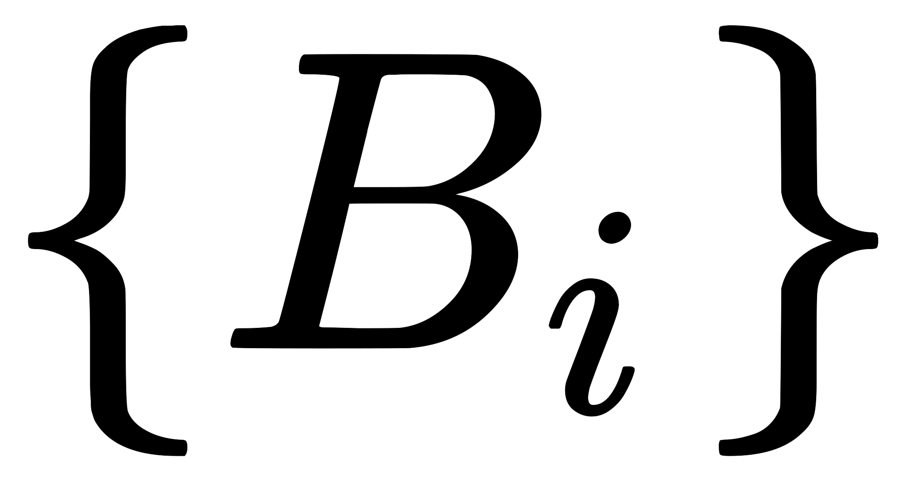
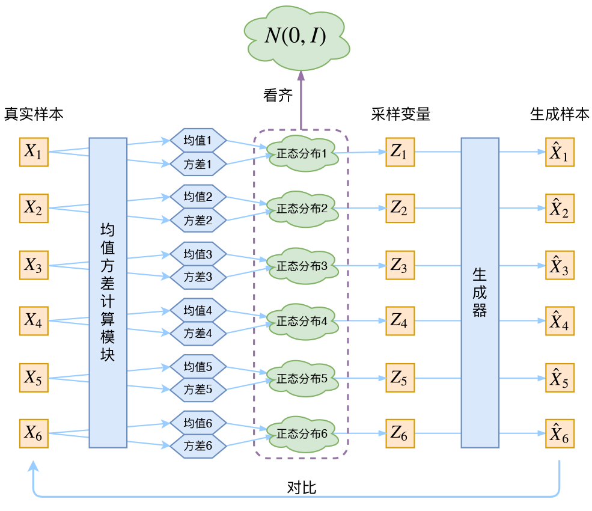

# 变分自编码器

## 变分自编码器（一）原来是这么一回事

https://spaces.ac.cn/archives/5253

---

### 0. Pre

#### 完备事件组

定义：（完备事件组/样本空间的划分）

设$B_1,B_2,\dots,B_n$是一组事件,若

（1）$\forall i \neq j \in \left\{1,2,\dots,n \right\},B_i\cap B_j=\varnothing $

（2）$B_1∪B_2∪…∪B_n=Ω$

则称 $B_1,B_2,\dots,B_n$ 样本空间Ω的一个划分，或称为样本空间Ω 的一个完备事件组。

> 若n个事件两两**互斥**，且这n个事件的**并**是Ω，则称这n个事件为完备事件组。

#### 全概率公式

设事件组 是样本空间 Ω 的一个划分，且 $P（B_i）>0（i=1, 2, \dots,n）$

则对任一事件B，有

#### 正态分布参数

1）概率密度曲线在均值处达到最大，并且对称；

2）一旦均值和标准差确定，正态分布曲线也就确定；

3）当X的取值向横轴左右两个方向无限延伸时，曲线的两个尾端也无限渐近横轴，理论上永远不会与之相交；

4）正态随机变量在特定区间上的取值概率由正态曲线下的面积给出，而且其曲线下的总面积等于1 ；

5）均值可取实数轴上的任意数值，决定正态曲线的具体位置；标准差决定曲线的“陡峭”或“扁平”程度：标准差越大，正态曲线越扁平；标准差越小，正态曲线越陡峭。这是因为，**标准差越小，意味着大多数变量值离均数的距离越短，因此大多数值都紧密地聚集在均数周围**，图形所能覆盖的变量值就少些（比如1±0.1涵盖[0.9，1.1]），于是都挤在一块，图形上呈现瘦高型。相反，**标准差越大，数据跨度就比较大，分散程度大，所覆盖的变量值就越多**（比如1±0.5涵盖[0.5，1.5]），图形呈现“矮胖型”。我们可以对照下图直观地看一下，图中黄色曲线为A，蓝色曲线为B，紫红色曲线为C。

如图，我们可以看到均数的大小决定了曲线的位置，标准差的大小决定了曲线的胖瘦。A和B的均值一样，但标准差不同，所以形状不同，根据我们的描述，图形越瘦高，标准差越小，图形越扁平，标准差越大。确实如此，图中B的标准差是1/2，小于A的标准差1。

---

### 1. 分布变换

VAE 和 GAN 都是希望构建一个从隐变量 Z 生成目标数据X的模型，但是实现上有所不同。更准确地讲，它们是**假设了Z服从某些常见的分布**（比如正态分布或均匀分布），然后希望训练一个模型 X=g(Z)，这个模型能够将**原来**的概率分布**映射**到**训练集**的概率分布，也就是说，它们的目的都是进行**分布之间的变换**。

生成模型的难题就是判断生成分布与真实分布的**相似度**，因为我们只知道两者的采样结果，不知道它们的分布**表达式**。

那么下载假设 Z 服从标准的正态分布，那么从中采样得到若干个 $Z_1,Z_2,\dots,Z_n$ ，然后对它做变换得到 $\hat{X}_1 = g(Z_1),\hat{X}_2 = g(Z_2),\dots,\hat{X}_n = g(Z_n)$。如何判断构造出来的数据集（由X组成）和我们目标的数据集分布是不是一样的。

**我们只有样本本身，没有分布表达式。**

---

### 2. VAE漫谈

#### 2.1. 经典回顾

首先我们有一批数据样本 ${X_1,…,X_n}$，其整体用 $X$ 来描述，我们本想根据 ${X_1,…,X_n}$ 得到 $X$ 的分布 $p(X)$ 。

如果能得到的话，那我直接根据 $p(X)$ 来采样，就可以得到所有可能的 $X$ 了（包括 ${X_1,…,X_n}$ 以外的），这是一个终极理想的生成模型了。

当然，这个理想很难实现，于是我们按照**全概率公式**将分布改一改
$$
p(X)=\sum_Z p(X|Z)p(Z)\tag{1}
$$
这里我们就不区分求和还是求积分了，意思对了就行。此时 $p(X|Z)$ 就描述了一个由 $Z$ 来生成 $X$ 的模型，而我们假设 $Z$ 服从标准正态分布，也就是 $p(Z)=\mathcal{N}(0,I)$。

如果这个理想能实现，那么我们就可以**先**从标准正态分布中**采样**一个 $Z$，**然后**根据 $Z$ 来**算**一个 $X$，也是一个很棒的生成模型。接下来就是结合自编码器来实现重构，保证有效信息没有丢失，再加上一系列的推导，最后把模型实现。框架的示意图如下：

我们完全不清楚：经过重新采样出来的 $Z_k$ ，是不是还对应着原来的 $X_k$，所以我们如果直接最小化 $\mathcal{D}(\hat{X}_k,X_k)^2$（这里DD代表某种距离函数）是很不科学的

#### 2.2. VAE初现

！！！其实，在整个VAE模型中，我们并没有去使用 $p(Z)$ （**隐变量空间的分布**）是正态分布的假设，我们用的是假设 $p(Z|X)$ （**后验分布**）是正态分布，

具体来说，给定一个**真实样本** $X_k$，假设存在一个**专属**于 $X_k$ 的分布 $p(Z|X_k)$ （**后验分布**），并进一步假设这个分布是（独立的、多元的）**正态分布**。因为后面要训练一个生成器 $X=g(Z)$，希望能够把从分布 $p(Z|X_k)$ 采样出来的一个 $Z_k$ 还原为 $X_k$。

如果假设 $p(Z)$ 是正态分布，然后从 $p(Z)$ 中采样一个 $Z$，不知道 $Z$ **对应**于哪个真实的 $X$。现在 $p(Z|X_k)$ 专属于 $X_k$，我们有理由说从这个分布采样出来的 $Z$ 一定还原到 $X_k$ 中去。

>In this case, we can let the
>variational approximate **posterior** be a multivariate Gaussian with a diagonal covariance structure:
>$$
>\log q_{\phi}(\boldsymbol{z}|\boldsymbol{x}^{(i)}) = \log \mathcal{N}(\boldsymbol{z} ;\boldsymbol{\mu}^{(i)},\boldsymbol{\sigma}^{2(i)}\boldsymbol{I})\tag{9}
>$$
>（注：这里是直接摘录原论文，本文所用的符号跟原论文不尽一致，望读者不会混淆。）

论文中的式(9)是实现整个模型的关键。尽管论文也提到 $p(Z)$ 是标准正态分布，然而那其实并不是本质重要的。

这时候每一个 $X_k$ 都配上了一个专属的正态分布，才方便后面的生成器做还原。**有多少个样本 X 就有多少个正态分布。**正态分布有两组参数：均值 $\mu$ 和方差 $\sigma ^2$ (多元的话，都是向量)。怎么找出专属于 $X_k$ 的正态分布参数？ **难算的我们都用神经网络来拟合**

于是我们构建**两个神经网络** $\mu_k = f_1(X_k),\log \sigma_k^2 = f_2(X_k)$ 来算它们了。我们选择拟合 $\log \sigma_k^2 = f_2(X_k)$ 而不是直接拟合 $\sigma_k^2$，是因为 $\sigma_k^2$ 总是非负的，需要加激活函数处理，而拟合 $\log \sigma_k^2 = f_2(X_k)$ 不需要加激活函数，因为它可正可负。

到这里，我能知道专属于 $X_k$ 的均值和方差了，也就知道它的正态分布长什么样了，然后从这个专属分布中采样一个 $Z_k$ 出来，然后经过一个生成器得到 $\hat{X}_k=g(Z_k)$，现在我们可以放心地最小化 $\mathcal{D}(\hat{X}_k,X_k)^2$，因为 $Z_k$ 是从**专属** $X_k$ 的分布中采样出来的，这个生成器应该要把开始的 $X_k$还原回来。于是可以画出VAE的示意图

---

#### 2.3. 分布标准化

让我们来思考一下，根据上图的训练过程，最终会得到什么结果。

首先，我们希望重构 $X$，也就是最小化 $\mathcal{D}(\hat{X}_k,X_k)^2$，但是这个重构过程受到噪声的影响，因为 $Z_k$ 是通过重新采样过的，不是直接由encoder算出来的。显然噪声会增加重构的难度，不过好在这个噪声强度（也就是方差）通过一个神经网络算出来的，所以最终模型**为了重构得更好，肯定会想尽办法让方差为0?????**。而**方差为0的话，也就没有随机性了?????**，所以不管怎么采样其实都只是得到确定的结果（也就是均值），只拟合一个当然比拟合多个要容易，而均值是通过另外一个神经网络算出来的。

模型会慢慢退化成普通的AutoEncoder，噪声不再起作用。

别急别急，其实**VAE还让所有的 $p(Z|X)$ 都向标准正态分布看齐**，这样就防止了噪声为零，同时保证了模型具有生成能力。怎么理解“保证了生成能力”呢？如果所有的 $p(Z|X)$ 都很接近标准正态分布 $\mathcal{N}(0,I)$，那么根据定义
$$
p(Z)=\sum_X p(Z|X)p(X)=\sum_X \mathcal{N}(0,I)p(X)=\mathcal{N}(0,I) \sum_X p(X) = \mathcal{N}(0,I)\tag{2}
$$
这样我们就能达到我们的先验假设：$p(Z)$是标准正态分布。然后我们就可以放心地从 $\mathcal{N}(0,I)$ 中采样来生成图像了。

那怎么让所有的 $p(Z|X)$ 都向 $\mathcal{N}(0,I)$ 看齐呢？如果没有外部知识的话，其实最直接的方法应该是在重构误差的基础上中加入额外的loss：
$$
\mathcal{L}_{\mu}=\Vert f_1(X_k)\Vert^2\quad \text{和}\quad \mathcal{L}_{\sigma^2}=\Vert f_2(X_k)\Vert^2\tag{3}
$$
因为它们分别代表了均值 $μ_k$ 和方差的对数 $logσ^2_k$，达到 $\mathcal{N}(0,I)$ 就是希望二者尽量接近于0了。不过，这又会面临着这**两个损失的比例要怎么选取的问题，选取得不好，生成的图像会比较模糊**。所以，原论文直接算了一般（各分量独立的）正态分布与标准正态分布的KL散度 $KL\Big(N(\mu,\sigma^2)\Big\Vert N(0,I)\Big)$ 作为这个额外的loss，计算结果为
$$
\mathcal{L}_{\mu,\sigma^2}=\frac{1}{2} \sum_{i=1}^d \Big(\mu_{(i)}^2 + \sigma_{(i)}^2 - \log \sigma_{(i)}^2 - 1\Big)\tag{4}
$$
这里的 $d$ 是隐变量 $Z$ 的维度，而 $μ_{(i)}$ 和 $σ^2_{(i)}$ 分别代表一般正态分布的均值向量和方差向量的第 $i$ 个分量。直接用这个式子做补充loss，就不用考虑均值损失和方差损失的相对比例问题了。显然，这个loss也可以分两部分理解：
$$
\begin{aligned}&\mathcal{L}_{\mu,\sigma^2}=\mathcal{L}_{\mu} + \mathcal{L}_{\sigma^2}\\ 
&\mathcal{L}_{\mu}=\frac{1}{2} \sum_{i=1}^d \mu_{(i)}^2=\frac{1}{2}\Vert f_1(X)\Vert^2\\ 
&\mathcal{L}_{\sigma^2}=\frac{1}{2} \sum_{i=1}^d\Big(\sigma_{(i)}^2 - \log \sigma_{(i)}^2 - 1\Big)\end{aligned}\tag{5}
$$

> 由于我们考虑的是各分量独立的多元正态分布，因此只需要推导一元正态分布的情形即可，根据定义我们可以写出
> $$
> \begin{aligned}&KL\Big(N(\mu,\sigma^2)\Big\Vert N(0,1)\Big)\\ 
> =&\int \frac{1}{\sqrt{2\pi\sigma^2}}e^{-(x-\mu)^2/2\sigma^2} \left(\log \frac{e^{-(x-\mu)^2/2\sigma^2}/\sqrt{2\pi\sigma^2}}{e^{-x^2/2}/\sqrt{2\pi}}\right)dx\\ 
> =&\int \frac{1}{\sqrt{2\pi\sigma^2}}e^{-(x-\mu)^2/2\sigma^2} \log \left\{\frac{1}{\sqrt{\sigma^2}}\exp\left\{\frac{1}{2}\big[x^2-(x-\mu)^2/\sigma^2\big]\right\} \right\}dx\\ 
> =&\frac{1}{2}\int \frac{1}{\sqrt{2\pi\sigma^2}}e^{-(x-\mu)^2/2\sigma^2} \Big[-\log \sigma^2+x^2-(x-\mu)^2/\sigma^2 \Big] dx\end{aligned}
> $$
> 整个结果分为三项积分，第一项实际上就是 $−logσ^2$ 乘以概率密度的积分（也就是1），所以结果是$−logσ^2$；第二项实际是正态分布的二阶矩，熟悉正态分布的朋友应该都清楚正态分布的二阶矩为 $μ^2+σ^2$；而根据定义，第三项实际上就是“-方差除以方差=-1”。所以总结果就是
> $$
> KL\Big(N(\mu,\sigma^2)\Big\Vert N(0,1)\Big)=\frac{1}{2}\Big(-\log \sigma^2+\mu^2+\sigma^2-1\Big)
> $$

---

#### 2.4. 重参数技巧

我们要从 $p(Z|X_k)$ 中采样一个 $Z_k$ 出来，尽管我们知道了 $p(Z|X_k)$ 是正态分布，但是均值方差都是靠模型算出来的，我们要靠这个过程反过来优化均值方差的模型，但是“采样”这个操作是不可导的，而采样的结果是可导的。我们利用

$$
\begin{aligned}&\frac{1}{\sqrt{2\pi\sigma^2}}\exp\left(-\frac{(z-\mu)^2}{2\sigma^2}\right)dz \\ 
=& \frac{1}{\sqrt{2\pi}}\exp\left[-\frac{1}{2}\left(\frac{z-\mu}{\sigma}\right)^2\right]d\left(\frac{z-\mu}{\sigma}\right)\end{aligned}\tag{6}
$$
这说明 $(z−μ)/σ=ε$ 是服从均值为0、方差为1的标准正态分布的，要同时把 $dz$ 考虑进去，是因为乘上 $dz$ 才算是概率，去掉 $dz$ 是概率密度而不是概率。这时候我们得到：

> 从 $\mathcal{N}(\mu,\sigma ^2)$ 中采样一个 $Z$，相当于从 $\mathcal{N}(0,1)$ 中采样一个 $ε$，然后让 $Z=μ+ε×σ$。

于是，我们将从 $\mathcal{N}(\mu,\sigma ^2)$ 采样变成了从 $\mathcal{N}(0,1)$ 中采样，然后通过参数变换得到从 $\mathcal{N}(\mu,\sigma ^2)$ 中采样的结果。这样一来，“采样”这个操作就不用参与梯度下降了，改为采样的结果参与，使得整个模型可训练了。

具体怎么实现，大家把上述文字对照着代码看一下，一下子就明白了～

---

### 3. 后续分析

#### 3.1. 本质

VAE虽然也称是AE（AutoEncoder）的一种，但它的做法（或者说它对网络的诠释）是别具一格的。在VAE中，它的**Encoder有两个**，**一个用来计算均值**，**一个用来计算方差**.

事实上，我觉得VAE从让普通人望而生畏的**变分**和**贝叶斯理论**出发，最后落地到一个具体的模型中，虽然走了比较长的一段路，但最终的模型其实是很接地气的：它本质上就是在我们常规的自编码器的基础上，**对encoder的结果**（在VAE中对应着计算**均值**的网络）**加上了“高斯噪声”**，使得结果**decoder能够对噪声有鲁棒性**；而那个额外的**KL loss**（目的是让均值为0，方差为1），事实上就是相当于对encoder的一个正则项，**希望encoder出来的东西均有零均值**。

那另外一个**encoder**（对应着计算**方差**的网络）的作用呢？它是用来**动态调节噪声的强度的**。直觉上来想，当decoder还没有训练好时（重构误差远大于KL loss），就会适当降低噪声（KL loss增加），使得拟合起来容易一些（重构误差开始下降）；反之，如果decoder训练得还不错时（重构误差小于KL loss），这时候噪声就会增加（KL loss减少），使得拟合更加困难了（重构误差又开始增加），这时候decoder就要想办法提高它的生成能力了。

说白了，重构的过程是希望没噪声的，而KL loss则希望有高斯噪声的，两者是对立的。所以，VAE跟GAN一样，内部其实是包含了一个**对抗**的过程，只不过它们两者是混合起来，共同进化的。从这个角度看，VAE的思想似乎还高明一些。

---

#### 3.2. 正态分布

对于正态分布来说，**所有点的概率密度都是非负的**。

---

#### 3.3. 变分

还有一个有意思（但不大重要）的问题是：VAE叫做“变分自编码器”，它跟变分法有什么联系？

呃～其实如果读者已经承认了KL散度的话，那VAE好像真的跟变分没多大关系了～因为理论上对于KL散度(7)我们要证明：

> 固定概率分布 $p(x)$ 或 $q(x)$ 的情况下，对于任意的概率分布 $q(x)$ 或 $p(x)$ ，都有$KL\big(p(x)||q(x)\big)≥0$ ，而且只有当 $p(x)=q(x)$ 时才等于零。

因为 $KL\big(p(x)||q(x)\big)$ 实际上是一个泛函，要对泛函求极值就要用到变分法，当然，这里的变分法只是普通微积分的平行推广，还没涉及到真正复杂的变分法。而VAE的变分下界，是直接基于KL散度就得到的。所以直接承认了KL散度的话，就没有变分的什么事了。

一句话，VAE的名字中“变分”，是因为它的推导过程用到了**KL散度及其性质**。

---

#### 3.4. 条件VAE

最后，因为目前的VAE是无监督训练的，因此很自然想到：如果有标签数据，那么能不能把标签信息加进去辅助生成样本呢？这个问题的意图，往往是希望能够实现控制某个变量来实现生成某一类图像。当然，这是肯定可以的，我们把这种情况叫做Conditional VAE，或者叫CVAE。（相应地，在GAN中我们也有个CGAN。）

但是，CVAE不是一个特定的模型，而是一类模型，总之就是把标签信息融入到VAE中的方式有很多，目的也不一样。这里基于前面的讨论，给出一种非常简单的VAE。

在前面的讨论中，我们希望 $X$ 经过编码后，$Z$ 的分布都具有零均值和单位方差，这个“希望”是通过加入了KL loss来实现的。

如果现在多了类别信息 $Y$，**我们可以希望同一个类的样本都有一个专属的均值 $μ^Y$（方差不变，还是单位方差），这个 $μ^Y$ 让模型自己训练出来**。这样的话，有多少个类就有多少个正态分布，而在生成的时候，我们就可以通过控制均值来控制生成图像的类别。事实上，这样可能也是在VAE的基础上加入最少的代码来实现CVAE的方案了，因为这个“新希望”也只需通过修改KL loss实现：
$$
\mathcal{L}_{\mu,\sigma^2}=\frac{1}{2} \sum_{i=1}^d\Big[\big(\mu_{(i)}-\mu^Y_{(i)}\big)^2 + \sigma_{(i)}^2 - \log \sigma_{(i)}^2 - 1\Big]\tag{8}
$$

下图显示这个简单的CVAE是有一定的效果的，不过因为encoder和decoder都比较简单（纯MLP），所以控制生成的效果不尽完美。

---

# 李宏毅 VAE

https://www.bilibili.com/video/BV15b411g7Wd?p=75

## AE

encoder的权重参数**不**一定非要与decoder 的权重**互逆**

**De-noising auto-encoder**

**Contractive auto-encoder**

改变 input 使，input对encoder的改变最小化。

# 博客 AE

## AutoEncoder详解（一）

https://blog.csdn.net/roguesir/article/details/77469665

encode和decode两个过程可以理解成互为反函数，在encode过程不断降维，在decode过程提高维度。

当AutoEncoder过程中用卷积操作提取特征，相当于encode过程为一个深度卷积神经网络，好多层的卷积池化，那么decode过程就需要进行反卷积和反池化，那么，反卷积和反池化如何定义呢？

### **反池化**

其实在池化过程中，会**标记**像素点中最大值的位置，在Unpooling过程将最大值**还原**，其他位置填0

### **反卷积**

将反卷积中的输入做padding=2，这样原本输入维度由3个变成了7个，再做正向卷积

---

## AutoEncoder详解（二）

https://roguesir.blog.csdn.net/article/details/81173557

### Undercomplete AutoEncoder

AutoEncoder（自编码器，AE）是神经网络的一种，基本结构分为编码、解码过程，即找到随机映射 $f=p_{encoder}(h|x)$ 和 $g=p_{decoder}(x|h)$ 。其基本结构如下图所示：

其中，$f$ 为编码器，$g$ 为解码器，实际上，可以将 $f$ 和 $g$ 理解成反函数的映射关系，AutoEncoder的目的是使输入 $x$ 和输出 $r$ 差异最小，但这并不是关键之处，关键之处在于让模型通过编码解码过程**学习到特征**，或者说**学习到数据的分布**。

当 $h$ 的维数大于输入 $x$ 时，模型不会学习到任何有用的特征，因为模型的目标函数即为最小化 $x$ 和 $r$ 之间的差异， $h$ 的维数足够大时，只需进行输入数据的**复制**即可得到与输入相同的输出，但这并不是模型想要达到的效果，因此在AutoEncoder设置时， $h$  的维数会**小于输入的维数**，这样才能迫使模型丢弃没用的特征（或者说**丢弃不影响数据分布的特征**），学习并保留有用的特征，这种自编码器就称为欠完备自编码器（Undercomplete AutoEncoder），学习欠完备的表示将会强制自编码器捕捉数据中的显著特征。

### De-noising AutoEncoder

以处理图像数据为例，将原始输入 x 加入随机噪声生成  x&#x27;  ，将 x&#x27; 输入到AutoEncoder中进行训练，经过encoder和decoder过程之后得到输出 y，损失函数则是计算原始输入 x 和输出 y 之间的差异，损失函数可以是**均方差**、**绝对误差**等，如此训练出的模型**具有降噪功能**，对含有噪声的图片不敏感。
常见的引入噪声的形式有两种：

- 对于图片，引入高斯噪声
- 对于向量，随机dropout

---

## 相对熵与交叉熵

### 相对熵

相对熵 (relative entropy) 又称为**KL散度**（Kullback-Leibler divergence），KL距离，是两个随机**分布**间**距离**的度量。记为 $D_{KL}(p||q)$。它度量当真实分布为p时，假设分布q的无效性。
$$
\begin{equation}D_{KL}(p \| q)=E_{p}\left[\log \frac{p(x)}{q(x)}\right]=\sum_{x \in \mathcal{X}} p(x) \log \frac{p(x)}{q(x)}\end{equation}
$$

---

### 交叉熵

假设有两个分布p，q，则它们在给定样本集上的交叉熵定义如下：
$$
\begin{equation}C E H(p, q)=E_{p}[-\log q]=-\sum_{x \in \mathcal{X}} p(x) \log q(x)=H(p)+D_{K L}(p \| q)\end{equation}
$$
交叉熵与的相对熵仅相差了 $H(p)$,当 $p$ 已知时，可以把 $H(p)$ 看做一个常数，此时交叉熵与KL距离在行为上是等价的，都反映了分布 $p，q$ 的相似程度。最小化交叉熵等于最小化 $KL$ 距离。它们都将在 $p=q$ 时取得最小值 $H(p)$（$p=q$ 时KL距离为0），

特别的，在logistic regression中，

$p$: 真实样本分布，服从参数为p的0-1分布，即X∼B(1,p)
$q$: 待估计的模型，服从参数为q的0-1分布，即X∼B(1,q)

两者的交叉熵为：
$$
\begin{equation}C E H(p, q)=-\left[\mathbf{y} \log \mathbf{h}_{\theta}(x)+(1-\mathbf{y}) \log \left(1-\mathbf{h}_{\theta}(x)\right)\right]\end{equation}
$$
取均值得：
$$
\begin{equation}-\frac{1}{m} \sum_{i=1}^{m}\left[y^{(i)} \log h_{\theta}\left(x^{(i)}\right)+\left(1-y^{(i)}\right) \log \left(1-h_{\theta}\left(x^{(i)}\right)\right)\right]\end{equation}
$$

这个结果与通过**最大似然估计方法**求出来的结果一致。

---

# 深度学习-自编码器 基本原理及项目实战

https://www.bilibili.com/video/BV18v41147bT

https://github.com/zhuozhudd/PyTorch-Course-Note

https://github.com/tsuirak/skills/tree/main/Pytorch/Pytorch_learn_by_dragen1860

## AE loss函数

最普通常见的**MSE误差**
$$
l(f(\mathbb{x})) = \frac{1}{2}\sum_k(\hat{x}_k-x_k)^2
$$
直接点对点（pointwise）差值平方和

**交叉熵误差**
$$
l(f(\mathbb{x})) = -\sum_k(x_k\text{log}(\hat{x}_k)+(1-x_k)\text{log}(1-\hat{x}_k))
$$
其中 $f(\mathbb{x}) = \hat{\mathbb{x}}$

适合输入为二元输入0或1，而不是浮点数

---

## Denoising AE

像素级别的重建，没有找到一些更深层次的特征。

我们在分布 $\mathcal{N}(0,0.01)$ 中采样一个[28, 28]的噪声加到原图像上，如果这样都可以重建成功，说明此时学到的潜在向量具有强大的表征能力。

## Dropout AE

加入随机失活单元

## Adversarial AE

希望学到的分布能够尽量接近均值为0，方差不做严格要求。

## VAE

### loss function

对于一个AE来说，我们的第一个目标是在给 decoder 输入潜在特征 z，得到 $x_i$ 的概率最大（最大似然）。即 $p_{\phi}(x_i|z)$ /  $\text{log}p_{\phi}(x_i|z)$。 其中 z 自己的分布为 $z\text{~}q_{\theta}(z|x_i)$。得到重建 loss：
$$
-E_{z\text{~}q_{\theta}(z|x_i)}[\text{log}p_{\phi}(x_i|z)]
$$
$q_{\theta}$ 为encoder，$p_{\phi}$ 为decoder.

KL散度/相对熵，输入两个参数(有顺序要求)，分布1和分布2，输出一个标量 $[0,+\infty]$，衡量两个分布之间的相似程度，值越小两个分布越接近，值越大两个分布差距越大。
$$
KL(P||Q) = \int_{-\infty}^{\infty}p(x)\text{log}\frac{p(x)}{q(x)}dx
$$

对于一个AE来说，我们的第二个目标是 $q_{\theta}(z|x_i)$ **分布接近于 $p(z)$**
$$
KL(q_{\theta}(z|x_i)||p(z))
$$

**注意不是 $q_{\theta}(z|x_i)$ 接近 $p_{\phi}(x_i|z)!!!$ 而是 $p(z)$**

合起来loss为
$$
l_i(\theta,\phi)=-E_{z\text{~}q_{\theta}(z|x_i)}[\text{log}p_{\phi}(x_i|z)]+KL(q_{\theta}(z|x_i)||p(z))
$$

$ p(z)$ 是自行预设的分布，一般都为高斯分布 

### 两个高斯分布的KL散度

假设 $p(z_i)\text{~} \mathcal{N}(\mu_1,\sigma_1^2)$， $q(z_i)\text{~} \mathcal{N}(\mu_2,\sigma_2^2)$，可以直接根据下式计算出 KL 散度
$$
\begin{split}
KL(p,q) &= -\int p(x)\text{log}q(x)dx+\int p(x)\text{log}p(x)dx\\
&=\frac{1}{2}\text{log}（2\pi \sigma_2^2）+\frac{\sigma_1^2+(\mu_1-\mu_2)^2}{2\sigma_2^2}-\frac{1}{2}(1+\text{log}2\pi\sigma_1^2)\\
&=\text{log}\frac{\sigma_2}{\sigma_1}++\frac{\sigma_1^2+(\mu_1-\mu_2)^2}{2\sigma_2^2}-\frac{1}{2}
\end{split}
$$

### sample采样

AE是没有考虑分布，没有采样的过程，是直接降维encoder再升维decoder。

而VAE考虑到了分布，需要从学习到的分布encoder进行**采样**，得到潜在向量，然后再输入到decoder

VAE 最后学习到了一个分布 $q_{\theta}(z|x_i)$

采样 $z\text{~} \mathcal{N}(\mu_1,\sigma_1^2)$，   $ z= \mathcal{N}(\mu_1,\sigma_1^2).sample()$  是不可微分的。

另 $ z= \mu + \sigma \cdot \epsilon$ 其中 $\epsilon\text{~} \mathcal{N}(0,1)$，这样 $z\text{~} \mathcal{N}(\mu_1,\sigma_1^2)$ 分布不变，均值、方差都不变，但可微了。

### 反向传播过程

---

### loss解释

重建损失鼓励分布去描述输入，我们的分布**偏离先验分布去描述数据的特征**

但是如果没有正则化，我们的网络就会去学习一个很狭窄的分布，网络学习到非常**小的方差**，仅仅能高效的表示一个数值，**没有泛化性**。在这个分布范围内，**微小**的改变输入会造成**很大**的输出，在这个分布范围**外**，怎么改变输入不会变化。

加入KL散度作为正则化项，鼓励分布的**均值向0**，并且确定一个有效的**方差**以得到一个**smooth的潜在空间**。

---

### 神经网络角度理解VAE

2个均值，2个方差都为神经元

均值和方差定义了潜在空间的分布，然后通过确定的分布采样得到潜在向量。

正常的 AE 没有第三层，即没有均值和方差的神经元层，是直接从第二层连接到潜在向量层。

学习的是分布 $q(h)$ 可以通过分布进行sample，每个特征都有自己的分布。

---

# VAE 论文

## Abstract

How can we perform efficient inference and learning in directed probabilistic models, in the presence of continuous latent variables with intractable posterior distributions, and large datasets?   在存在具有难解的后验分布的连续潜在变量和大型数据集的情况下，我们如何在定向概率模型中进行有效的推理和学习？ 

We introduce a stochastic variational inference and learning algorithm that scales to large datasets and, under some mild differ- entiability conditions, even works in the intractable case. Our contributions is two-fold.   我们介绍了一种随机变分推理和学习算法，该算法可扩展到大型数据集，并且在某些温和的微分条件下，甚至可以在棘手的情况下工作。 我们的贡献是双重的。 

First, we show that a reparameterization of the variational lower bound yields a lower bound estimator that can be straightforwardly optimized using standard stochastic gradient methods.   首先，我们证明了变化下界的重新参数化产生了一个下界估计量，该估计量可以使用标准随机梯度方法直接进行优化。 

Second, we show that for i.i.d. datasets with continuous latent variables per datapoint, posterior inference can be made especially efficient by fitting an approximate inference model (also called a recognition model) to the intractable posterior using the proposed lower bound estimator. 其次，我们为i.d. 对于每个数据点具有连续潜在变量的数据集，通过使用拟议的下界估计器将近似推理模型（也称为识别模型）拟合到难处理的后验，可以使后验特别有效。   