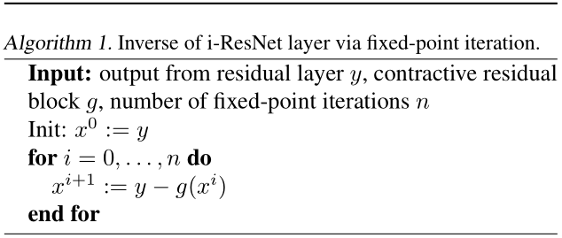

# Invertible Residual Networks

ICML2019 

## Abstract

我们证明了标准的 ResNet 体系结构可以使之**可逆**，从而允许将相同的模型用于分类，**密度估计和生成**。通常，实施可逆性需要**划分维度**(partitioning dimensions)或**限制网络体系结构**( restricting network architectures)。相反，我们的方法只需要在**训练**过程中添加一个简单的**标准化步骤**(normalization step)即可，这已经在标准框架中提供了。

Invertible ResNets 定义了一个生成模型，可以通过对未标记数据的**最大似然**进行训练。 为了计算似然，我们对 residual block 的雅可比对数行列式引入了**易于处理的近似**（tractable approximation）。

我们的经验评估表明，Invertible ResNets 在最先进的图像分类器和 flow-based 生成模型上均具有竞争力，这是以前用单一架构无法实现的。

---

## 1.  Introduction

基于神经网络的模型的主要吸引力之一是，单个模型体系结构通常可用于解决各种相关任务。 但是，最近的许多改进都基于针对特定领域（particular domains ）量身定制的专用解决方案。例如，无监督学习中的最新架构正在变得越来越具有领域特定性 （Van Den Oord，2016b; Kingma，2018; Parmar，2018; Karras，2018; Van  Den Oord，2016a）。另一方面，用于判别式学习的最成功的前馈架构之一是深度残差网络（He，2016; Zagoruyko，2016），与同类的生成网络有很大差异。

这种鸿沟使得为**给定任务**选择或设计合适的体系结构变得很复杂。这也使**判别任务**难以从**无监督学习**中受益。我们用在这两个领域都表现出色的新型架构来弥合这一差距。

为实现这一目标，我们专注于可逆网络，这些网络已证明在判别性（Gomez，2017; Jacobsen，2018）和生成性（Dinh，2014; 2017; Kingma，  2018）独立执行任务，尽管使用相同的模型范式（model paradigm）。

它们通常依赖于固定维拆分启发法，但与非体积保留（non-volume conserving ）元素交织的常见拆分受到限制，它们的选择对性能有重大影响（Kingma，2018; Dinh，2017）。这使得建立可逆网络成为一项艰巨的任务。在这项工作中，我们表明，这些具有竞争性的密度估计性能所必需的奇特（exotic）设计会严重损害判别性能。

为了克服这个问题，我们利用 ResNets 作为 ODE 的 Euler 离散化的观点（Haber，2018; Ruthotto，2018; Lu，2017; Ciccone，2018）并且证明了 invertible ResNets (iResNets) 只需更改标准 ResNets 的规范化方案即可构建。

**Fig. 1:** 标准 ResNet 网络(左)和 iResNet (右)的动力学。两个网络都将区间 $[2，2]$ 映射为: i)半深度处的噪声 **$x^3$-函数**；ii)全深度处的噪声**恒等函数**。Invertible ResNets 描述了一个双射连续动态，而 ResNets 导致了与非双射连续动态相对应的交叉和折叠路径(用白色圈起来)。由于折叠(collapsing)路径，ResNets 不是有效的密度模型。

**Fig. 1** 可视化了标准和可逆ResNet所学到的动力学差异。该方法允许每个 residual block 具有不受约束的体系结构，而只需要**每个 block 的 Lipschitz 常数小于一个常数**。我们证明，在构建图像分类器时，此限制对性能的影响可以忽略不计-在对MNIST，CIFAR10和CIFAR100图像进行分类时，它们的性能与不可逆的性能相当。

然后，我们展示如何将 i-ResNets 训练为未标记数据上的最大似然生成模型。为了计算似然，我们对残差块的雅可比行列式引入了易于处理的（tractable approximation）近似。像FFJORD（Grathwohl，2019）一样，i-ResNet flows 具有不受约束的（free-form）雅可比矩阵，这使他们可以学习**比**使用的三角映射的**其他可逆模型**中**更富有表现力**的变换。我们的经验评估表明，i-ResNets 在最先进的图像分类器和 flow-based 的生成模型上均具有竞争力，使通用体系结构更接近现实。

## 2. Enforcing Invertibility in ResNets

在常微分方程初值问题上 ResNet 架构与 Euler 方法有显著的相似性
$$
\begin{equation}
 x_{t+1} \leftarrow x_{t}+g_{\theta_{t}}\left(x_{t}\right) \\ x_{t+1} \leftarrow x_{t}+h f_{\theta_{t}}\left(x_{t}\right) 
\end{equation}
$$
其中 $ x_{t} \in \mathbb{R}^{d} $ 表示激活或状态，$t$ 表示层索引或时间，$h> 0$ 是步长，$g_{θ_t}$ 是残差块。这种联系在深度学习和动力学系统的交叉点吸引了研究（Lu，2017; Haber，2018; Ruthottor，2018; Chen，2018）。 但是，很少有人关注时间倒退(backwards)的动力学。
$$
\begin{equation}
 x_{t} \leftarrow x_{t+1}-g_{\theta_{t}}\left(x_{t}\right) \\ x_{t} \leftarrow x_{t+1}-h f_{\theta_{t}}\left(x_{t}\right) 
\end{equation}
$$
这相当于隐式向后的 Euler 离散化。特别地，及时解决动力学倒退将实现相应的 ResNet 的逆过程。 以下 [Theorem 1](#the1) 指出，一个简单的条件足以使动力学可解，从而使 ResNet 可逆： 

### Theorem 1

可逆 ResNets 的充分条件

令 $ F_{\theta}: \mathbb{R}^{d} \rightarrow \mathbb{R}^{d} $ ，其中 $ F_{\theta}=\left(F_{\theta}^{1} \circ \ldots \circ F_{\theta}^{T}\right) $ 定义一个ResNet，该网络内块 $ F_{\theta}^{t}=I+g_{\theta_{t}} $ 。然后如果满足以下条件:
$$
\begin{equation}
 \operatorname{Lip}\left(g_{\theta_{t}}\right)<1 \text{, for all  t=1,} \ldots, T 
\end{equation}
$$
则 ResNet $F_{\theta}$ 可逆，其中 $\operatorname{Lip}\left(g_{\theta_{t}}\right)$ 是 $g_{\theta_{t}}$ 的 Lipschitz 常数。

请注意，**此条件对于可逆性不是必需的**。其他方法（NICE/RealNvp，2014; 2017; i-revnet，2018; Chang，2018; Glow，2018）依赖于**划分维度**或**自回归结构**来创建逆的解析解。

**Algorithm 1.**

当强制令 $\operatorname{Lip}\left(g_{\theta_{t}}\right)<1$ 使 ResNet 可逆，我们没有此逆的解析形式。但是，我们可以通过简单的定点迭代（fixed-point iteration）来获得它，请参见 **Algorithm 1**。请注意，定点迭代的起始值可以是任何矢量，因为定点是唯一的。但是，将输出 $y = x + g(x)$ 用作初始化 $x^0:=y$ 是一个很好的起点，因为 $y$ 仅通过**恒等边界扰动**（a bounded perturbation of the identity）从 $x$ 中获得。根据巴纳赫不动点定理（Banach fixed-point theorem），我们有
$$
\begin{equation}
 \left\|x-x^{n}\right\|_{2} \leq \frac{\operatorname{Lip}(g)^{n}}{1-\operatorname{Lip}(g)}\left\|x^{1}-x^{0}\right\|_{2} 
\end{equation}\tag{1}
$$

因此，收敛速度在迭代次数 $n$ 中是指数的，并且较小的 Lipschitz 常数将产生更快的收敛。

除了可逆性之外，压缩的（contractive）残差块还会使残差层变为 bi-Lipschitz（双射Lipschitz）。

---

### Lemma 2

（Forward and Inverse 正向和反向的Lipschitz常数）。令 $ F(x)=x+g(x) $ 且 $ \operatorname{Lip}(g)=L<1 $ 表示残留层。 然后，它保持
$$
\begin{equation}
 \operatorname{Lip}(F) \leq 1+L \quad \text{and} \quad \operatorname{Lip}\left(F^{-1}\right) \leq \frac{1}{1-L} 
\end{equation}
$$

   因此，通过设计，可逆ResNet为它们的正向和反向映射都提供了稳定性保证。 在以下部分中，我们讨论了增强Lipschitz条件的方法。

## Reference

