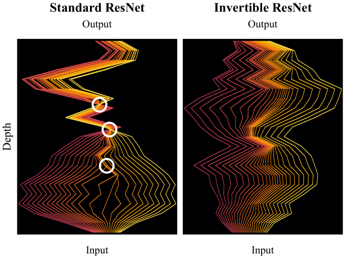
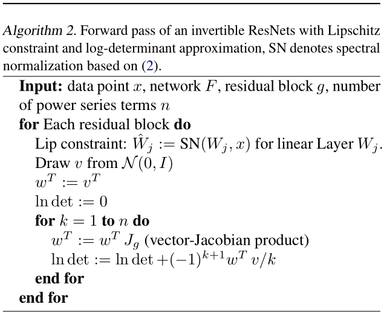
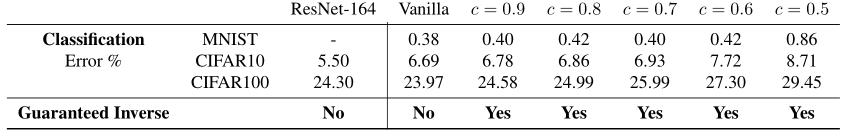
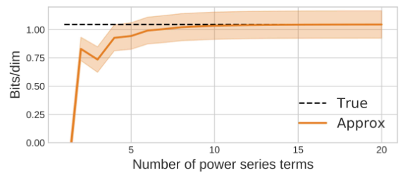
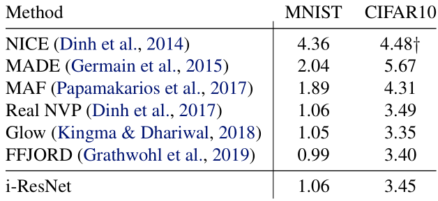

# Invertible Residual Networks

ICML2019 

[细水长flow之可逆ResNet：极致的暴力美学](https://kexue.fm/archives/6482)


```shell
python -m visdom.server # 开启visdom服务  http://127.0.0.2:8097/
#开启容器时加参数 -p 127.0.0.2:8097:8097 
```


```sh
# dens_set_cifar
python CIFAR_main.py --nBlocks 16 16 16 --nStrides 1 2 2 --nChannels 512 512 512 --coeff 0.9 -densityEstimation -multiScale --lr 0.003 --weight_decay 0. --numSeriesTerms 5 --dataset cifar10 --batch 128 --warmup_epochs 1 --save_dir ./results/dens_est_cifar --vis_server your.server.local --vis_port your_port_nr
```


```sh
# classify_cifar
python ./CIFAR_main.py --nBlocks 7 7 7 --nStrides 1 2 2 --nChannels 32 64 128 --coeff 0.9 --batch 128 --dataset cifar10 --init_ds 1 --inj_pad 13 --powerIterSpectralNorm 1 --save_dir ./results/zca_clf_full_cifar10_wrn22_inj_pad_coeff09 --nonlin elu --optimizer sgd --vis_server your.server.local --vis_port your_port_nr
```


## Code

```python
parser = argparse.ArgumentParser(description='Train i-ResNet/ResNet on Cifar')
parser.add_argument('-densityEstimation', '--densityEstimation', dest='densityEstimation',
                    action='store_true', help='perform density estimation')
parser.add_argument('--optimizer', default="adamax", type=str, help="optimizer", choices=["adam", "adamax", "sgd"])
parser.add_argument('--lr', default=0.003, type=float, help='learning rate')
parser.add_argument('--coeff', default=0.9, type=float, help='contraction coefficient for linear layers')
parser.add_argument('--numTraceSamples', default=1, type=int, help='number of samples used for trace estimation')
parser.add_argument('--numSeriesTerms', default=5, type=int, help='number of terms used in power series for matrix log')
parser.add_argument('--powerIterSpectralNorm', default=5, type=int, help='number of power iterations used for spectral norm')
parser.add_argument('--weight_decay', default=0., type=float, help='coefficient for weight decay')
parser.add_argument('--drop_rate', default=0.1, type=float, help='dropout rate')
parser.add_argument('--batch', default=4, type=int, help='batch size')
parser.add_argument('--init_batch', default=1024, type=int, help='init batch size')
parser.add_argument('--init_ds', default=2, type=int, help='initial downsampling')
parser.add_argument('--warmup_epochs', default=1, type=int, help='epochs for warmup')
parser.add_argument('--inj_pad', default=0, type=int, help='initial inj padding')
parser.add_argument('--epochs', default=200, type=int, help='number of epochs')
parser.add_argument('--nBlocks', nargs='+', type=int, default=[16, 16, 16])
parser.add_argument('--nStrides', nargs='+', type=int, default=[1, 2, 2])
parser.add_argument('--nChannels', nargs='+', type=int, default=[512, 512, 512])
parser.add_argument('--resume', default='', type=str, metavar='PATH',
                    help='path to latest checkpoint (default: none)')
parser.add_argument('-e', '--evaluate', dest='evaluate', action='store_true',
                    help='evaluate model on validation set')
parser.add_argument('-interpolate', '--interpolate', dest='interpolate', action='store_true', help='train iresnet')
parser.add_argument('-drop_two', '--drop_two', dest='drop_two', action='store_true', help='2d dropout on')
parser.add_argument('-nesterov', '--nesterov', dest='nesterov', action='store_true',
                    help='nesterov momentum')
parser.add_argument('-norm', '--norm', dest='norm', action='store_true',
                    help='compute norms of conv operators')
parser.add_argument('-analysisTraceEst', '--analysisTraceEst', dest='analysisTraceEst', action='store_true',
                    help='analysis of trace estimation')
parser.add_argument('-multiScale', '--multiScale', dest='multiScale', action='store_true',
                    help='use multiscale')
parser.add_argument('-fixedPrior', '--fixedPrior', dest='fixedPrior', action='store_true',
                    help='use fixed prior, default is learned prior')
parser.add_argument('-noActnorm', '--noActnorm', dest='noActnorm', action='store_true',
                    help='disable actnorm, default uses actnorm')
parser.add_argument('--nonlin', default="elu", type=str, choices=["relu", "elu", "sorting", "softplus"])
parser.add_argument('--dataset', default='cifar10', type=str, help='dataset')
parser.add_argument('--save_dir', default="./results/dens_est_cifar", type=str, help='directory to save results')
parser.add_argument('--vis_port', default=8097, type=int, help="port for visdom")
parser.add_argument('--vis_server', default="localhost", type=str, help="server for visdom")
parser.add_argument('--log_every', default=10, type=int, help='logs every x iters')
parser.add_argument('-log_verbose', '--log_verbose', dest='log_verbose', action='store_true',
                    help='verbose logging: sigmas, max gradient')
parser.add_argument('-deterministic', '--deterministic', dest='deterministic', action='store_true',
                    help='fix random seeds and set cuda deterministic')
```


### main.py

```python
# dens_est

def main():
	# transform
    
    # datasets
    
    # setup logging with visdom
    
    # dataloader
    
    # get multiscale network4
    model = multiscale_iResNet(in_shape, #(3, 32, 32)
                                       args.nBlocks, args.nStrides, args.nChannels,#[16 16 16] [1 2 2] [512 512 512]
                                       args.init_ds == 2,
                                       args.inj_pad, args.coeff, args.densityEstimation,#0 0.9 true
                                       args.nClasses, #10
                                       args.numTraceSamples, args.numSeriesTerms,#1 5
                                       args.powerIterSpectralNorm,#5
                                       actnorm=(not args.noActnorm),#false
                                       learn_prior=(not args.fixedPrior),#false
                                       nonlin=args.nonlin)#elu
    
```


### conv_iResNet.py

```python
# 
class multiscale_conv_iResNet(nn.Module):
    def __init__(self, in_shape, nBlocks, nStrides, nChannels, init_squeeze=False, inj_pad=0,
                 coeff=.9, density_estimation=False, nClasses=None,
                 numTraceSamples=1, numSeriesTerms=1,
                 n_power_iter=5,
                 actnorm=True, learn_prior=True, nonlin="relu"):
        super(multiscale_conv_iResNet, self).__init__()
        assert len(nBlocks) == len(nStrides) == len(nChannels)
        if init_squeeze:
            self.init_squeeze = Squeeze(2)
        else:
            self.init_squeeze = None

        if inj_pad > 0:
            self.inj_pad = injective_pad(inj_pad)
        else:
            self.inj_pad = None

        if init_squeeze:
            in_shape = downsample_shape(in_shape)
        in_shape = (in_shape[0] + inj_pad, in_shape[1], in_shape[2])  # adjust channels

        self.nBlocks = nBlocks
        self.density_estimation = density_estimation
        self.nClasses = nClasses
        # parameters for trace estimation
        self.numTraceSamples = numTraceSamples if density_estimation else 0
        self.numSeriesTerms = numSeriesTerms if density_estimation else 0
        self.n_power_iter = n_power_iter

        self.stack, self.in_shapes = self._make_stack(in_shape, nBlocks,
                                                      nStrides, nChannels, numSeriesTerms, numTraceSamples,
                                                      coeff, actnorm, n_power_iter, nonlin)
        # make prior distribution
        self._make_prior(learn_prior)
        # make classifier
        self._make_classifier(self.final_shape(), nClasses)
        assert (nClasses is not None or density_estimation), "Must be either classifier or density estimator"
```


### SpectralNormConv

$$
\mathbf{W} = \dfrac{\mathbf{W}}{\sigma(\mathbf{W})} \\
         \sigma(\mathbf{W}) = \max_{\mathbf{h}: \mathbf{h} \ne 0} \dfrac{\|\mathbf{W} \mathbf{h}\|_2}{\|\mathbf{h}\|_2}
$$


```python
def spectral_norm_conv(module, coeff, input_dim, name='weight', n_power_iterations=1, eps=1e-12):
    r"""将谱归一化应用于给定模块中的参数
    谱归一化通过使用幂迭代方法计算的权重矩阵的谱范数重新缩放权重张量来稳定GAN中鉴别器的训练。如果权重张量的维数大于2，则在幂迭代法中将其重新整形为2D以获得谱范数。这是通过一个hook实现的，该hook在每个 :meth:`~Module.forward` 调用之前计算谱范数并重新调整权重。 
    
    Args:
        module (nn.Module): 包含的模块
        name (str, optional): 权重参数名称
        n_power_iterations (int, optional): 计算谱范数的幂迭代次数
        eps (float, optional): epsilon 在计算范数时的数值稳定性
        dim (int, optional): 输出个数对应的维度，默认为0，当为1时，作为ConvTranspose1/2/3d实例的模块，
    Returns:
        The original module with the spectal norm hook 带有谱归一化hook的原始模块
    Example::
        >>> m = spectral_norm(nn.Linear(20, 40))
        Linear (20 -> 40)
        >>> m.weight_u.size()
        torch.Size([20])
    """
    input_dim_4d = (1, input_dim[0], input_dim[1], input_dim[2])
    SpectralNormConv.apply(module, coeff, input_dim_4d, name, n_power_iterations, eps)
    return module
```


```python
"""
Conv2D 层的软谱归一化（未强制，仅 <= coeff）
"""
class SpectralNormConv(object):
    # 每次 forward call 前后不变
    #   u = normalize(W @ v)
    # NB: 在初始化时，不强制执行此不变量

    _version = 1
    # At version 1:
    #   made  `W` not a buffer,
    #   added `v` as a buffer, and
    #   made eval mode use `W = u @ W_orig @ v` rather than the stored `W`.

    @staticmethod
    def apply(module, coeff, input_dim, name, n_power_iterations, eps):
        for k, hook in module._forward_pre_hooks.items():
            if isinstance(hook, SpectralNormConv) and hook.name == name:
                raise RuntimeError("Cannot register two spectral_norm hooks on "
                                   "the same parameter {}".format(name))

        fn = SpectralNormConv(coeff, input_dim, name, n_power_iterations, eps)
        weight = module._parameters[name]

        with torch.no_grad():
            num_input_dim = input_dim[0]* input_dim[1]* input_dim[2]* input_dim[3]
            v = normalize(torch.randn(num_input_dim), dim=0, eps=fn.eps)

            # get settings from conv-module (for transposed convolution) 从 conv-module 获取设置（用于转置卷积）
            stride = module.stride
            padding = module.padding
            # forward call to infer the shape 推断shape
            u = conv2d(v.view(input_dim), weight, stride=stride, padding=padding,
                               bias=None)
            fn.out_shape = u.shape
            num_output_dim = fn.out_shape[0]* fn.out_shape[1]* fn.out_shape[2]* fn.out_shape[3]
            # overwrite u with random init 用随机初始化覆盖u
            u = normalize(torch.randn(num_output_dim), dim=0, eps=fn.eps)

            
            
    def compute_weight(self, module, do_power_iteration):
        # NB: 如果设置了 `do_power_iteration`，`u` 和 `v` 向量将在幂迭代中实时更新。这很重要，因为在 `DataParallel` forward 中，向量（作为缓冲区）从并行化模块广播到每个模块副本，这是一个动态创建的新模块对象。每个副本运行自己的谱范数幂迭代。所以简单地将更新的向量分配给这个函数运行的模块将导致更新永远丢失。下次复制并行化模块时，相同的随机初始化向量将被广播并使用！
		
        # 因此，为了使更改传播回来，我们依赖两个重要的行为（也通过测试强制执行）： 
        # 1. 如果广播张量已经在正确的设备上，`DataParallel` 不会克隆存储； 并且它确保parallelized 模块已经在`device[0]` 上。
        # 2. 如果 `out=` kwarg 中的输出张量具有正确的形状，它会 # 只填充值。
        
        # 因此，由于在所有设备上执行相同的幂迭代，只需就地更新张量将确保 `device[0]` 上的模块副本将更新并行化模块上的 _u 向量（通过共享存储）。
       
        #然而，在我们就地更新 `u` 和 `v` 之后，我们需要在使用它们来标准化权重之前克隆它们。
        #这是为了支持通过两次前向传递进行反向传播，例如，GAN 训练中的常见模式：
        #loss = D(real) - D(fake)
        #否则，引擎将抱怨第一个前向后需要做的变量（即，`u` 和 `v` 向量）在第二个前向中改变。
        
        weight = getattr(module, self.name + '_orig')
        u = getattr(module, self.name + '_u')
        v = getattr(module, self.name + '_v')
        sigma_log = getattr(module, self.name + '_sigma') # for logging

        # 从 conv-module 获取设置（用于转置卷积）
        stride = module.stride
        padding = module.padding

        if do_power_iteration: #幂迭代
            with torch.no_grad():
                for _ in range(self.n_power_iterations):
                    v_s = conv_transpose2d(u.view(self.out_shape), weight, stride=stride,padding=padding, output_padding=0)
                    # Note: out flag for in-place changes就地更改的 out 标志
                    v = normalize(v_s.view(-1), dim=0, eps=self.eps, out=v)
                    
                    u_s = conv2d(v.view(self.input_dim), weight, stride=stride, padding=padding,
                           bias=None)
                    u = normalize(u_s.view(-1), dim=0, eps=self.eps, out=u)
                if self.n_power_iterations > 0:
                    # See above on why we need to clone 请参阅上文了解为什么我们需要克隆
                    u = u.clone()
                    v = v.clone()
        weight_v = conv2d(v.view(self.input_dim), weight, stride=stride, padding=padding,
                           bias=None)
        weight_v = weight_v.view(-1)
        sigma = torch.dot(u.view(-1), weight_v)  
        # enforce spectral norm only as constraint 仅将谱范数强制为约束
        factorReverse = torch.max(torch.ones(1).to(weight.device),
                                  sigma / self.coeff)
        # for logging
        sigma_log.copy_(sigma.detach())

        # rescaling
        weight = weight / (factorReverse + 1e-5)  # for stability
        return weight
```


---

## Abstract

我们证明了标准的 ResNet 体系结构可以使之**可逆**，从而允许将相同的模型用于分类，**密度估计和生成**。通常，实施可逆性需要**划分维度**(partitioning dimensions)或**限制网络体系结构**( restricting network architectures)。相反，我们的方法只需要在**训练**过程中添加一个简单的**标准化步骤**(normalization step)即可，这已经在标准框架中提供了。

Invertible ResNets 定义了一个生成模型，可以通过对未标记数据的**最大似然**进行训练。 为了计算似然，我们对 residual block 的雅可比对数行列式引入了**易于处理的近似**（tractable approximation）。

我们的经验评估表明，Invertible ResNets 在最先进的图像分类器和 flow-based 生成模型上均具有竞争力，这是以前用单一架构无法实现的。


---

## 1.  Introduction

基于神经网络的模型的主要吸引力之一是，单个模型体系结构通常可用于解决各种相关任务。 但是，最近的许多改进都基于针对特定领域（particular domains ）量身定制的专用解决方案。例如，无监督学习中的最新架构正在变得越来越具有领域特定性 （Van Den Oord，2016b; Kingma，2018; Parmar，2018; Karras，2018; Van  Den Oord，2016a）。另一方面，用于判别式学习的最成功的前馈架构之一是深度残差网络（He，2016; Zagoruyko，2016），与同类的生成网络有很大差异。

这种鸿沟使得为**给定任务**选择或设计合适的体系结构变得很复杂。这也使**判别任务**难以从**无监督学习**中受益。我们用在这两个领域都表现出色的新型架构来弥合这一差距。


为实现这一目标，我们专注于可逆网络，这些网络已证明在判别性（Gomez，2017; Jacobsen，2018）和生成性（Dinh，2014; 2017; Kingma，  2018）独立执行任务，尽管使用相同的模型范式（model paradigm）。

它们通常依赖于固定维拆分启发法，但与非体积保留（non-volume conserving ）元素交织的常见拆分受到限制，它们的选择对性能有重大影响（Kingma，2018; Dinh，2017）。这使得建立可逆网络成为一项艰巨的任务。在这项工作中，我们表明，这些具有竞争性的密度估计性能所必需的奇特（exotic）设计会严重损害判别性能。


为了克服这个问题，我们利用 ResNets 作为 ODE 的 Euler 离散化的观点（Haber，2018; Ruthotto，2018; Lu，2017; Ciccone，2018）并且证明了 invertible ResNets (iResNets) 只需更改标准 ResNets 的规范化方案即可构建。<span id="#fig1"></span>



**Fig. 1:** 标准 ResNet 网络(左)和 iResNet (右)的动力学。两个网络都将区间 $[2，2]$ 映射为: i)半深度处的噪声 **$x^3$-函数**；ii)全深度处的噪声**恒等函数**。Invertible ResNets 描述了一个双射连续动态，而 ResNets 导致了与非双射连续动态相对应的交叉和折叠路径(用白色圈起来)。由于折叠(collapsing)路径，ResNets 不是有效的密度模型。


**Fig. 1** 可视化了标准和可逆ResNet所学到的动力学差异。该方法允许每个 residual block 具有不受约束的体系结构，而只需要**每个 block 的 Lipschitz 常数小于一个常数**。我们证明，在构建图像分类器时，此限制对性能的影响可以忽略不计-在对MNIST，CIFAR10和CIFAR100图像进行分类时，它们的性能与不可逆的性能相当。


然后，我们展示如何将 i-ResNets 训练为未标记数据上的最大似然生成模型。为了计算似然，我们对残差块的雅可比行列式引入了易于处理的（tractable approximation）近似。像FFJORD（Grathwohl，2019）一样，i-ResNet flows 具有不受约束的（free-form）雅可比矩阵，这使他们可以学习**比**使用的三角映射的**其他可逆模型**中**更富有表现力**的变换。我们的经验评估表明，i-ResNets 在最先进的图像分类器和 flow-based 的生成模型上均具有竞争力，使通用体系结构更接近现实。


---

## 2. Enforcing Invertibility in ResNets

在常微分方程初值问题上 ResNet 架构与 Euler 方法有显著的相似性
$$
\begin{equation}
 x_{t+1} \leftarrow x_{t}+g_{\theta_{t}}\left(x_{t}\right) \\ x_{t+1} \leftarrow x_{t}+h f_{\theta_{t}}\left(x_{t}\right) 
\end{equation}
$$
其中 $ x_{t} \in \mathbb{R}^{d} $ 表示激活或状态，$t$ 表示层索引或时间，$h> 0$ 是步长，$g_{θ_t}$ 是残差块。这种联系在深度学习和动力学系统的交叉点吸引了研究（Lu，2017; Haber，2018; Ruthottor，2018; Chen，2018）。 但是，很少有人关注时间倒退(backwards)的动力学。
$$
\begin{equation}
 x_{t} \leftarrow x_{t+1}-g_{\theta_{t}}\left(x_{t}\right) \\ x_{t} \leftarrow x_{t+1}-h f_{\theta_{t}}\left(x_{t}\right) 
\end{equation}
$$
这相当于隐式向后的 Euler 离散化。特别地，及时解决动力学倒退将实现相应的 ResNet 的逆过程。 以下 [Theorem 1](#the1) 指出，一个简单的条件足以使动力学可解，从而使 ResNet 可逆： 


---

### Theorem 1<span id="the1"></span>

可逆 ResNets 的充分条件

令 $ F_{\theta}: \mathbb{R}^{d} \rightarrow \mathbb{R}^{d} $ ，其中 $ F_{\theta}=\left(F_{\theta}^{1} \circ \ldots \circ F_{\theta}^{T}\right) $ 定义一个ResNet，该网络内块 $ F_{\theta}^{t}=I+g_{\theta_{t}} $ 。然后如果满足以下条件:
$$
\begin{equation}
 \operatorname{Lip}\left(g_{\theta_{t}}\right)<1 \text{, for all  t=1,} \ldots, T 
\end{equation}
$$
则 ResNet $F_{\theta}$ 可逆，其中 $\operatorname{Lip}\left(g_{\theta_{t}}\right)$ 是 $g_{\theta_{t}}$ 的 Lipschitz 常数。

请注意，**此条件对于可逆性不是必需的**。其他方法（NICE/RealNvp，2014; 2017; i-revnet，2018; Chang，2018; Glow，2018）依赖于**划分维度**或**自回归结构**来创建逆的解析解。


#### **Proof. (Theorem 1)**

因为 ResNet $ F_{\theta} $ 是函数的组合，因此如果每个块 $ F_{\theta}^{t} $ 是可逆的，则它是可逆的。令 $ x_{t+1} \in \mathbb{R}^{d} $ 为任意，并考虑反向的的欧拉离散化 $ x_{t}=x_{t+1}-h f_{\theta_{t}}\left(x_{t}\right)=x_{t+1}-g_{\theta_{t}}\left(x_{t}\right) $。 重写作为迭代形式
$$
\begin{equation}
 x_{t}^{0}:=x_{t+1} \quad \text{and} \quad x_{t}^{k+1}:=x_{t+1}- g_{\theta_{t}}\left(x_{t}^{k}\right) 
\end{equation}\tag{6}
$$
如果迭代收敛，则 $ \lim _{k \rightarrow \infty} x_{t}^{k}=x_{t} $ 是不动点。 因为 $ g_{\theta_{t}}: \mathbb{R}^{d} \rightarrow \mathbb{R}^{d} $ 是 Banach 空间上的算子，所以由于 Banach 不动点定理，收缩条件 $ \operatorname{Lip}\left(g_{\theta_{t}}\right)<1 $ 保证了收敛。


### **Algorithm 1.**<span id="algo1"></span>


当强制令 $\operatorname{Lip}\left(g_{\theta_{t}}\right)<1$ 使 ResNet 可逆，我们没有此逆的解析形式。但是，我们可以通过简单的定点迭代（fixed-point iteration）来获得它，请参见 [Algorithm 1](#algo1)。请注意，定点迭代的起始值可以是任何矢量，因为定点是唯一的。但是，将输出 $y = x + g(x)$ 用作初始化 $x^0:=y$ 是一个很好的起点，因为 $y$ 仅通过**恒等边界扰动**（a bounded perturbation of the identity）从 $x$ 中获得。根据巴纳赫不动点定理（Banach fixed-point theorem），我们有<span id="eq1"></span>
$$
\begin{equation}
 \left\|x-x^{n}\right\|_{2} \leq \frac{\operatorname{Lip}(g)^{n}}{1-\operatorname{Lip}(g)}\left\|x^{1}-x^{0}\right\|_{2} 
\end{equation}\tag{1}
$$

因此，收敛速度在迭代次数 $n$ 中是指数的，并且较小的 Lipschitz 常数将产生更快的收敛。

除了可逆性之外，压缩的（contractive）残差块还会使残差层变为 bi-Lipschitz（双射Lipschitz）。


---

### Lemma 2<span id="lem2"></span>

（Forward and Inverse 正向和反向的 Lipschitz常数）。令 $ F(x)=x+g(x) $ 且 $ \operatorname{Lip}(g)=L<1 $ 表示残差层。然后，它保持
$$
\begin{equation}
 \operatorname{Lip}(F) \leq 1+L \quad \text{and} \quad \operatorname{Lip}\left(F^{-1}\right) \leq \frac{1}{1-L} 
\end{equation}
$$

因此通过设计，invertible ResNets 为它们的正向和反向映射都提供了稳定性保证。在以下部分中，我们讨论了增强 Lipschitz条件的方法。


#### Proof. (Lemma 2)

首先请注意，$ \operatorname{Lip}(F) \leq 1+L $ 直接来自Lipschitz 常数的加法运算。对于逆，考虑
$$
\begin{equation}
 \begin{aligned}\|F(x)-F(y)\|_{2} &=\|x-y+g(x)-g(y)\|_{2} \\ &=\|x-y-(-g(x)+g(y))\|_{2} \\ & \geq\left|\|x-y\|_{2}-\|-g(x)+g(y)\|_{2}\right| \\ & \geq\left|\|x-y\|_{2}-\|(-1)(g(x)-g(y))\|_{2}\right| \\ & \geq\|x-y\|_{2}-\|g(x)-g(y)\|_{2} \\ & \geq\|x-y\|_{2}-L\|x-y\|_{2}, \end{aligned} 
\end{equation}
$$
在这里我们在上式中应用逆三角形不等式（reverse triangular inequality），并应用 $g$ 的Lipschitz 常数。 因为 $ F^{-1} $ 是射影，所以对于 $ z, w \in \mathbb{R}^{d} $，满足 $ x=F^{-1}(z) $ 和 $ y=F^{-1}(w) $ 是可能的。
$$
\begin{equation}
 \left\|F\left(F^{-1}(z)\right)-F\left(F^{-1}(w)\right)\right\|_{2} \geq(1-L)\left\|F^{-1}(z)-F^{-1}(w)\right\|_{2} \\
 \Longleftrightarrow \quad \frac{1}{1-L}\|z-w\|_{2} \geq\left\|F^{-1}(z)-F^{-1}(w)\right\|_{2} 
\end{equation}
$$
它适用于所有 $z,w$。


---

### 2.1. Satisfying the Lipschitz Constraint

满足Lipschitz约束

我们将残差块实现为**收缩非线性** $ \phi $（例如ReLU，ELU，tanh）和**线性映射的组合**。

例如，在我们的卷积网络中，$ g = W_{3} \phi\left(W_{2} \phi\left(W_{1}\right)\right) $，其中 $W_i$ 是卷积层。因此，
$$
\begin{equation}
 \operatorname{Lip}(g)<1, \quad \text{if}\quad \left\|W_{i}\right\|_{2}<1 
\end{equation}
$$
其中 $ \|\cdot\|_{2} $ 表示谱范数 spectral norm。请注意，对 $g$ 的 Jacobian 谱范数进行正则化（Sokoli, 2017）仅会局部降低它，并不保证上述条件。因此，我们将对每一层强制执行 $ \left\|W_{i}\right\|_{2}<1 $。

如（Miyato, 2018）所述，如果滤波器内核大于 $1 × 1$，那么参数矩阵上的幂迭代仅近似于 $\| W_{i} \|_{2} $ 上的界限，而不是真实的谱范数，有关界限的详细信息，请参见（Tsuzuku,2018）。因此，与（Miyato, 2018）不同。我们按照（Gouk,2018）的建议通过使用 $ W_{i} $ 和 $ W_{i}^{1} $ 进行功率迭代来直接估计 $ W_{i} $ 的谱范数。幂迭代产生了一个低估计值 under-estimate $ \tilde{\sigma}_{i} \leq\left\|W_{i}\right\|_{2} $。 使用此估算值，我们通过下式进行标准化：
$$
\begin{equation}
 \tilde{W}_{i}=\left\{\begin{array}{ll}c W_{i} / \tilde{\sigma}_{i}, & \text { if } c / \tilde{\sigma}_{i}<1 \\ W_{i}, & \text { else }\end{array}\right. 
\end{equation}\tag{2}
$$
其中超参数 $c <1$ 是缩放系数。由于 $ \tilde{\sigma}_{i} $ 是一个低估计值，因此无法保证 $ \left\|W_{i}\right\|_{2} \leq c $ 满足。 但是，经过训练后（Sedghi, 2019）提供了一种在傅立叶变换参数矩阵上使用 SVD 精确检查 $ \left\|W_{i}\right\|_{2} $  的方法，这将使我们能够证明 $ \operatorname{Lip}(g)<1 $ 在所有情况下均成立。


---

## 3. Generative Modelling with i-ResNets

我们可以通过首先对 $ z \sim p_{z}(z) $ 进行采样（其中 $ z \in \mathbb{R}^{d} $）然后为某些函数 $ \Phi: \mathbb{R}^{d} \rightarrow \mathbb{R}^{d} $ 定义 $ x=\Phi(z) $ 来为数据 $ x \in \mathbb{R}^{d} $ 定义一个简单的生成模型。如果 $ \Phi$ 是可逆的，并且我们定义 $ F=\Phi^{-1} $，那么我们可以使用变量变化公式(change of variables formula)来计算该模型下任意 $x$ 的似然<span id="eq3"></span>
$$
\begin{equation}
 \ln p_{x}(x)=\ln p_{z}(z)+\ln \left|\operatorname{det} J_{F}(x)\right| 
\end{equation}\tag{3}
$$
其中 $ J_{F}(x) $ 是 $F$ 在 $x$ 处的雅可比行列式。这种形式的模型称为标准化流（Rezende，2015）。由于引入了功能强大的双射函数逼近器，它们最近已经成为高维数据的流行模型，其雅可比对数行列式可以被有效地计算（Dinh，2014; 2017; Kingma，2018; Chen，2018）或逼近（Grathwohl，2019）。

由于保证了 i-ResNets 是可逆的，因此我们可以使用它们在 [Eq. 3](#eq3) 中对 $F$ 进行参数化。 可以通过首先对 $ z \sim p(z) $ 进行采样，然后使用 [Algorithm 1](#algo1). 计算 $ x=F^{-1}(z) $ 来抽取该模型的样本。在 **Fig. 2** 中，我们与 Glow 相比，显示了使用 i-ResNet 在某些二维数据集上定义生成模型的示例（Kingma，2018）。


**Fig. 2** Visual comparison of i-ResNet flow and Glow. Details of this experiment can be found in [Appendix C.3](#appC3).


---

### 3.1. Scaling to Higher Dimensions

缩放到更高的尺寸

尽管 i-ResNets 的可逆性使我们可以使用它们来定义归一化流，但我们必须计算 $ \ln \left|\operatorname{det} J_{F}(x)\right| $。 评估模型下的数据密度。计算此数量通常需要 $ \mathcal{O}\left(d^{3}\right) $ 的时间成本，这使得单纯地缩放至高维数据成为不可能。

为了绕过该约束，我们在 [Eq. 3](#eq3) 中给出了对数行列式项的易于处理的近似，它将按比例缩放到高维 $d$。 此前，（Ramesh，2018）将对数行列式估计应用于没有 i-ResNets 特定结构的不可逆深度生成模型。

首先，我们注意到 Lipschitz 约束恒等式的扰动 $x + g(x)$ 产生正行列式，因此
$$
\begin{equation}
 \left|\operatorname{det} J_{F}(x)\right|=\operatorname{det} J_{F}(x) 
\end{equation}
$$
参见 [Lemma 6](#lem6) in Appendix A。将这个结果与非奇异 $ A \in \mathbb{R}^{d \times d} $ 的矩阵恒等式 $ \ln \operatorname{det}(A)=\operatorname{tr}(\ln (A)) $ 结合起来（Withers，2010）
$$
\begin{equation}
 \ln \left|\operatorname{det} J_{F}(x)\right|=\operatorname{tr}\left(\ln J_{F}\right) 
\end{equation}
$$
其中 $\operatorname{tr}$ 表示矩阵的迹，$\ln $表示矩阵取对数。 因此，对于 $ z=F(x)=(I+g)(x) $，它有：
$$
\begin{equation}
 \ln p_{x}(x)=\ln p_{z}(z)+\operatorname{tr}\left(\ln \left(I+J_{g}(x)\right)\right) 
\end{equation}
$$
矩阵对数的迹可以表示为幂列（Hall，2015）<span id="eq4"></span>
$$
\begin{equation}
 \operatorname{tr}\left(\ln \left(I+J_{g}(x)\right)\right)=\sum_{k=1}^{\infty}(-1)^{k+1} \frac{\operatorname{tr}\left(J_{g}^{k}\right)}{k} 
\end{equation}\tag4
$$
当 $ \left\|J_{g}\right\|_{2}<1 $ 时，则列收敛。因此，由于Lipschitz约束，我们可以在保证收敛的情况下通过上述幂级数计算对数行列式。

在给出上述幂级数的随机近似值之前，我们观察到 i-ResNets 的以下属性：由于 $ \operatorname{Lip}\left(g_{t}\right)<1 $ 对于每层 $t$ 的残差块，我们可以在其对数行列式上提供上下限:
$$
\begin{equation}
 d \sum_{t=1}^{T} \ln \left(1-\operatorname{Lip}\left(g_{t}\right)\right) \leq \ln \left|\operatorname{det} J_{F}(x)\right| \\
 d \sum_{t=1}^{T} \ln \left(1+\operatorname{Lip}\left(g_{t}\right)\right) \geq \ln \left|\operatorname{det} J_{F}(x)\right| 
\end{equation}
$$
对于所有 $ x \in \mathbb{R} $ 都满足上式，请参见 [Lemma 7](#lem7) in Appendix A。因此，层数 $T$ 和 Lipschitz 常数都会影响 i-ResNets 的收缩和扩展范围，在设计此类体系结构时必须将其考虑在内。


----

### 3.2. Stochastic Approximation of log-determinant

对数行列式的随机逼近<span id="sec32"></span>

用 [Eq. 4](#eq4) 中的幂级数来表达对数行列式有三个主要的计算缺陷 drawback：

- 1）计算 $ \operatorname{tr}\left(J_{g}\right) $ 的复杂度为 $ \mathcal{O}\left(d^{2}\right) $，或者大约需要对 $g$ 进行 $d$ 个评估，作为对角线的每个对角线项。Jacobian 需要计算 $g$ 的单独导数（Grathwohl，2019）。  
- 2）需要矩阵幂 $ J_{g}^{k} $，这需要完备的Jacobian知识。  
- 3）级数是无限的。

幸运的是，可以减轻缺陷 1 和 2。首先，向量-雅可比积 $ v^{T} J_{g} $ 可以通过与逆向模式自动微分求值 $g$ 近似相同的成本来计算。其次，$ A \in \mathbb{R}^{d \times d} $ 的矩阵迹的随机逼近
$$
\begin{equation}
 \operatorname{tr}(A)=\mathbb{E}_{p(v)}\left[v^{T} A v\right] 
\end{equation}
$$
称为 Hutchinsons 迹估算器，可用于估算 $ \operatorname{tr}\left(J_{g}^{k}\right) $。分布 $ p(v) $ 需要满足 $ \mathbb{E}[v]=0 $ 和 $ \operatorname{cov}(v)=1 $，参见（Hutchinson，1990； Avron，2011）。

虽然这允许对矩阵迹进行无偏估计，但要获得有限的计算成本，[Eq. 4](#eq4) 中的幂级数将在索引 $n$ 处被截断，以解决缺陷 3。 [Algorithm 2](#algo2) 总结了基本步骤。 截断将无偏估计量变为有偏估计量，其中偏置bias取决于截断误差truncation error。幸运的是，这个错误可以得到限制，如下所示。

<span id="algo2"></span>



为了提高使用此估计器时优化的稳定性，我们建议使用具有连续导数的非线性激活，例如ELU（Clever，2015）或 softplus 的而不是 ReLU（[Appendix C.3](#appc3)）。


---

### 3.3. Error of Power Series Truncation

幂级数截断错误

我们使用**有限**幂级数估计 $ \ln \left|\operatorname{det}\left(I+J_{g}\right)\right| $
$$
\begin{equation}
 P S\left(J_{g}, n\right):=\sum_{k=1}^{n}(-1)^{k+1} \frac{\operatorname{tr}\left(J_{g}^{k}\right)}{k} 
\end{equation}\tag{5}
$$
其中 $ P S\left(J_{g}, \infty\right)= \operatorname{tr}\left(\ln \left(I+J_{g}\right)\right)$。 我们感兴趣的是将对数行列式的截断误差限制为数据维 $d$ ，Lipschitz 常数 $Lip(g)$ 和级数 $n$ 中项数的函数。


---

### Theorem 3

（loss 的近似误差）。令 $g$ 表示残差函数，$J_g$ 表示雅可比行列式。 然后，在第 $n$ 项处的幂级数被截断的误差定为
$$
\begin{equation}
 \begin{aligned} &\left|P S\left(J_{g}, n\right)-\ln \operatorname{det}\left(I+J_{g}\right)\right| \\ \leq &-d\left(\ln (1-\operatorname{Lip}(g))+\sum_{k=1}^{n} \frac{\operatorname{Lip}(g)^{k}}{k}\right) . \end{aligned} 
\end{equation}
$$
尽管上面的结果给出了评估 loss 耗的误差范围，但在训练过程中，loss 梯度的误差引起了人们的极大兴趣。类似地，我们可以获得以下界限。 证明在 [Appendix A](#th3proof) 中给出。


#### Proof. (Theorem 3)

我们首先注意到
$$
\begin{equation}
 \begin{aligned}\left|P S\left(J_{g}, n\right)-\operatorname{tr} \ln \left(J_{g}\right)\right| &=\left|\sum_{k=n+1}^{\infty}(-1)^{k+1} \frac{\operatorname{tr}\left(J_{g}^{k}\right)}{k}\right| \\ & \leq \sum_{k=n+1}^{\infty}\left|(-1)^{k+1} \frac{\operatorname{tr}\left(J_{g}^{k}\right)}{k}\right| \\ & \leq \sum_{k=n+1}^{\infty}\left|\frac{\operatorname{tr}\left(J_{g}^{k}\right)}{k}\right| \\ & \leq d \sum_{k=n+1}^{\infty} \frac{\operatorname{Lip}(g)^{k}}{k}, \end{aligned} 
\end{equation}
$$
该不等式从下式得到<span id="estimation9"></span>
$$
\begin{equation}
 \begin{aligned}\left|\operatorname{tr}\left(J^{k}\right)\right| & \leq\left|\sum_{i=d}^{d} \lambda_{i}\left(J^{k}\right)\right| \leq \sum_{i=d}^{d}\left|\lambda_{i}\left(J^{k}\right)\right| \leq d \rho\left(J^{k}\right) \\ & \leq d\left\|J^{k}\right\|_{2} \leq d\|J\|_{2}^{k} \leq d \operatorname{Lip}(g)^{k} \end{aligned} 
\end{equation}
$$
我们注意到，全数列 $ \sum_{k=1}^{\infty} \frac{\operatorname{Lip}(g)^{k}}{k}=-\ln (1-\operatorname{Lip}(g)) $ 因此可以将近似误差限制为
$$
\begin{equation}
 \left|P S\left(J_{g}, n\right)-\operatorname{tr} \ln \left(J_{g}\right)\right| \leq-d\left(\ln (1-\operatorname{Lip}(g))+\sum_{k=1}^{n} \frac{\operatorname{Lip}(g)^{k}}{k}\right) 
\end{equation}
$$


---

### Theorem 4

（梯度近似的收敛速度）。设 $ \theta \in \mathbb{R}^{p} $ 表示网络 $F$ 的参数，令 $g$ 表示残差函数，$J_g$ 表示雅可比行列式。此外，假设有界输入和具有 Lipschitz 导数的 Lipschitz 激活函数。然后，我们得出收敛速度

$$
\begin{equation}
 \left.\| \nabla_{\theta}\left(\ln \operatorname{det}\left(I+J_{g}\right)\right)-P S\left(J_{g}, n\right)\right) \|_{\infty}=\mathcal{O}\left(c^{n}\right) 
\end{equation}
$$
其中 $ c:=\operatorname{Lip}(g) $，$n$ 为幂级数中使用的项数。

在实践中，仅需采用 5-10 项即可使每个维度小于 0.001 位的偏差，通常报告其精度高达 0.01 精度（ [Appendix E](#appE) ）。


#### Proof. (Theorem 4)

首先，我们通过微分幂级数并使用跟踪算子的线性来导出。 我们获得
$$
\begin{equation}
 \begin{aligned} \frac{\partial}{\partial \theta_{i}} \ln \operatorname{det}\left(I+J_{g}(x, \theta)\right) &=\frac{\partial}{\partial \theta_{i}}\left(\sum_{k=1}^{\infty}(-1)^{k+1} \frac{\operatorname{tr}\left(J_{g}^{k}(x, \theta)\right)}{k}\right) \\ &=\operatorname{tr}\left(\sum_{k=1}^{\infty} \frac{k(-1)^{k+1}}{k} J_{g}^{k-1}(x, \theta) \frac{\partial\left(J_{g}(x, \theta)\right)}{\partial \theta_{i}}\right) \\ &=\operatorname{tr}\left(\sum_{k=0}^{\infty}(-1)^{k} J_{g}^{k}(x, \theta) \frac{\partial\left(J_{g}(x, \theta)\right)}{\partial \theta_{i}}\right) . \end{aligned} 
\end{equation}
$$
通过定义 $$ \|\cdot\|_{\infty} $$
$$
\begin{equation}
 \left\|\nabla_{\theta} P S\left(J_{g}(\theta), \infty\right)-\nabla_{\theta} P S\left(J_{g}(\theta), n\right)\right\|_{\infty}=\max _{i=1, \ldots, p}\left|\frac{\partial}{\partial \theta_{i}} P S\left(J_{g}(\theta), \infty\right)-\frac{\partial}{\partial \theta_{i}} P S\left(J_{g}(\theta), n\right)\right| 
\end{equation}
$$
这就是为什么我们从现在开始考虑任意 $i$。 这是
$$
\begin{equation}
 \begin{aligned}\left|\frac{\partial}{\partial \theta_{i}} P S\left(J_{g}(\theta), \infty\right)-\frac{\partial}{\partial \theta_{i}} P S\left(J_{g}(\theta), n\right)\right| &=\sum_{k=n+1}^{\infty}(-1)^{k} \operatorname{tr}\left(J_{g}^{k}(x, \theta) \frac{\partial\left(J_{g}(x, \theta)\right)}{\partial \theta_{i}}\right) \\ & \leq d \sum_{k=n+1}^{\infty} \operatorname{Lip}(g)^{K}\left\|\frac{\partial J_{g}(x, \theta)}{\partial \theta_{i}}\right\|_{2} \end{aligned} 
\end{equation}
$$
这里我们使用了与 Theorem 3 的证明中中间[估计](#estimation9)的相同论点。

为了束缚 $ \left\|\frac{\partial J_{g}(x, \theta)}{\partial \theta_{i}}\right\|_{2} $ 我们需要研究残差块的设计。我们假设收缩激活和元素激活函数（因此 $ \phi^{\prime}(\cdot)<1 $）和残差块中的 $N$ 个线性层 $W_i$ 。 然后，我们可以将雅可比行列式写成矩阵乘积 
$$
\begin{equation}
 J_{g}(x, \theta)=W_{N}^{T} D_{N} \cdots W_{1}^{T} D_{1} 
\end{equation}
$$
其中 $ D_{i}=\operatorname{diag}\left(\phi^{\prime}\left(z_{i-1}\right)\right) $ 具有预激活 $ z_{i-1} \in \mathbb{R}^{d} $

由于我们需要相对于权重 $ \theta_{i} $ 约束 Jacobian 的导数，因此必须进行两次反向传播（Drucke，1992）。通常$ \left\|W_{i}^{T}\right\|_{2},\left\|D_{i}\right\|_{2},\left\|D_{i}^{*}\right\|_{2}:=\left\|\operatorname{diag}\left(\phi^{\prime \prime}\left(z_{i-1}\right)\right)\right\|_{2},\left\|\left(\frac{\partial W_{i}}{\partial \theta_{i}}\right)\right\|_{2} $ 和 $ \|x\|_{2} $ 项出现在导数的约束内。 因此，为了约束 $ \left\|\frac{\partial J_{g}(x, \theta)}{\partial \theta_{i}}\right\|_{2} $ ，我们将前面的项约束如下
$$
\begin{equation}
 \begin{aligned}\left\|W_{i}^{T}\right\|_{2} & \leq \operatorname{Lip}(g) \\\left\|D_{i}\right\|_{2} & \leq \text { const } \\\left\|D_{i}^{*}\right\|_{2} & \leq \text { const } \\\|x\|_{2} & \leq \text { const } \\\left\|\left(\frac{\partial W_{i}}{\partial \theta_{i}}\right)^{T}\right\|_{2} & \leq\left\|W_{i}\right\|_{F}+s . \end{aligned} 
\end{equation}
$$
特别地，上第二行归因于 Lipschitz 激活函数的假设，而上第三行归因于假设激活函数的 Lipschitz 导数。请注意，我们使用的是连续可区分的激活函数（因此，不是ReLU），其中这种假设适用于ELU，softplus和tanh等常见函数。此外上第四行通过假设有界输入和由于网络为 Lipschitz 而成立。为了理解约束上第五行，我们将 $s$ 表示为 $θ_i$ 的参数共享量。 例如，如果 $θ_i$ 是卷积核的入口，则 $ s=w * h $，具有 $w$ 空间宽度和 $h$ 空间高度。 然后
$$
\begin{equation}
 \left\|\left(\frac{\partial W_{i}}{\partial \theta_{i}}\right)^{T}\right\|_{2} \leq\left\|W_{i}\right\|_{F}+s 
\end{equation}
$$
因为
$$
\begin{equation}
 \frac{\partial W_{l m}(x, \theta)}{\partial \theta_{i}}=\left\{\begin{array}{ll}1, & \text { if } W_{l m}=\theta_{i} \\ 0, & \text { else }\end{array}\right. 
\end{equation}
$$
因此，随着出现在二阶导数 ||$ \frac{\partial J_{g}(x, \theta)}{\partial \theta_{i}}||_{2} $ 中的每个项有界，我们可以引入常数 $ a(g, \theta, x)<\infty $，其取决于参数，$g$ 的实现和输入 $x$ 。 请注意，我们没有给出 ||$ \frac{\partial J_{g}(x, \theta)}{\partial \theta_{i}} \|_{2} $ 的确切界限，因为我们仅对存在这样的界限感兴趣，以便证明权利要求的收敛性。


---

## 4. Related Work

### 4.1. Reversible Architectures

我们将重点放在具有高效逆计算的可逆架构上，即NICE（Dinh，2014），iRevNet（Jacobsen，2018），Real-NVP（Dinh，2017），Glow（Kingma，2018）和 Neural ODEs（Chen，2018）及其随机密度估计量FFJORD（Grathwohl，2019）。 下表总结了不同可逆网络之间的比较。


Table 1.  Non-volume preserving 是指允许收缩和膨胀（contraction and expansions）的能力，exact likelihood 是指精确计算变量变化。unbiased estimator 是对数行列式的随机近似值，见 [Sec. 3.2](#sec32) 。


NICE，i-RevNet，Real-NVP 和 Glow 中使用的维度分解方法可以进行正向和逆向映射分析。但是，此限制要求在Glow 中引入其他步骤，例如可逆 1×1 卷积（Kingma，2018）。 这些 1×1 卷积需要在数值上进行求逆，从而使Glow 完全不可解析地求逆。 相比之下，i-ResNet 可以看作是一种中间方法，其中前向映射是通过分析给出的，而逆向可以通过**定点迭代**来计算。

此外，i-ResNet 块具有正向和逆向的 Lipschitz 边界（ [Lemma2](#lem2) ），而其他方法在设计上不具有此属性。 因此，对于诸如逆向问题（Ardizzone，2019）或基于不变性的对抗性漏洞（Jacobsen，2019）等对稳定性至关重要的应用而言，i-ResNets 可能是一个有趣的途径。

Neural ODEs（Chen，2018）允许类似于 i-ResNets 的  free-form dynamics，这意味着只要输入和输出**维度相同**，就可以使用任何体系结构。为了获得离散的正向和逆向动力学，NODE 依赖于自适应 ODE 求解器，从而可以在精度与速度之间进行权衡。然而，对于诸如高分辨率图像之类的非常高的输入维度的可扩展性仍然不清楚。


---

### 4.2. Ordinary Differential Equations

由于 ResNet 和 Euler 离散化的相似性，i-ResNet 和 ODE 之间存在许多联系，我们将在本节中进行回顾。

**Relationship of i-ResNets to Neural ODEs:**

将深度网络视为随时间变化的动态的观点提供了两种基本的学习方法

1）使用诸如 ResNets 的**离散**体系结构直接学习动力学（Haber，2018; Ruthotto，2018; Lu，2017; Ciccone，2018）。 

2）通过使用神经网络对 ODE 进行**参数化**来间接学习动力学（Chen, 2018; Grathwohl, 2019）等。

固定 ResNet $ F_{\theta} $ 的动力学 $ x(t) $ 仅在对应于每个块 $ g \theta_{t} $ 的时间点 $ t_{i} $ 定义。但是，可以使用**时间上的线性插值**来生成连续动态。见 [Fig. 1](#fig1) ，其中显示了线性内插可逆 ResNet 的连续动力学与标准ResNet的连续动力学。可逆ResNets 沿着连续路径是**双射**的，而常规 ResNets 可能会导致**交叉或合并**路径。另一方面，直接学习 ODE 的间接方法是基于 ODE 求解器来**适应离散化**，但是与 i-ResNet 相比，它没有固定的计算预算。


**Stability of ODEs:**

有两种主要方法可以研究 ODE 的稳定性：

1）$ t \rightarrow \infty $ 的行为

2）有限时间间隔 $ [0, T] $ 的Lipschitz 稳定性。  

基于时间不变动力学 $ f(x(t)) $ ，(Ciccone，2018) 使用**反对称层**构造了渐近稳定的 ResNet，使得 $ \operatorname{Re}\left(\lambda\left(J_{x}\right)\right)<0 $ ，其中 $ \operatorname{Re}(\lambda(\cdot)) $ 表示特征值的实部，$ \rho(\cdot) $ 为谱半径，$ J_{x} g $ 为点 $x$ 处的雅可比行列式。通过 Gershgorin circle theorem(**该定理就是用来估计矩阵的特征值的值范围**) 投影权重，他们进一步满足 $ \rho\left(J_{x} g\right)<1 $，从而产生渐近稳定的ResNet，并且各层**共享权重**。 

另一方面（Haber，2018; Ruthotto，2018）考虑了对应于标准ResNet的时间相关动力学 $ f(x(t), \theta(t)) $ 。通过使用**反对称的层和权重的投影**来保证稳定性。

相反，对于Lipschitz 连续动力学，$ [0, T] $ 上的初值问题是恰当的（Ascher，2008）。因此，$ \operatorname{Lip}(f)<1 $ 的可逆 ResNet 可以理解为步长 $h = 1$ 的 ODE 的稳定器，而**不受反对称层的限制**。


---

### 4.3. Spectral Sum Approximations

谱总和逼近

对于许多机器学习问题（例如高斯过程回归）（Dong，2017），像对数行列式这样的谱总和的逼近引起了广泛的兴趣。

除此之外，使用类似于我们的方法的对数行列式的泰勒逼近（Boutsidis，2017），或切比雪夫多项式方法（Han，2016）。

（Boutsidis，2017）针对对称正定矩阵给出了随机迹估计和（通过截断幂级数的进行估计的）误差范围。 但是，$ I+J_{g} $ 不是对称的，因此，此处的分析不适用。

最近，有人提出了对称正定矩阵的无偏估计（Adams，2018）和无偏梯度估计（Hanetal，2018）。 

此外，切比雪夫多项式已用于逼近深度神经网络中的雅可比对数行列式的以进行密度匹配和 GAN 的似然评估（Ramesh和LeCun，2018）。


---

## 5. Experiments

我们完成了对 i-ResNets 的全面实验调查。 首先，我们用数值方法验证 i-ResNets 的可逆性。 然后，我们在许多常见的图像分类数据集上研究了它们的判别能力。此外，我们将 i-ResNets 与其他可逆网络的判别性能进行了比较。 最后，我们研究如何使用 i-ResNets 定义生成模型。


---

### 5.1. Validating Invertibility and Classification

为了将 i-ResNets 与标准 ResNet 架构的**判别性能**和**可逆性**进行比较，我们在 CIFAR10，CIFAR100 和 MNIST 上训练了这两种模型。  

CIFAR 和 MNIST 模型的模型分别具有 `54` 和 `21` 个残差块，我们对所有其他超参数使用相同的设置。为了确保双射性，我们将  `strided downsampling` 替换为 `invertible downsampling` 操作（Jacobsen，2018），有关训练和网络架构的详细信息，见 [Appendix C.2](#appc2) 。 

我们通过填充零将输入通道的数量增加到16。 这与在模型的输入端使用标准卷积层将数据投影到更高维空间的标准做法类似，但是这种映射是可逆的。为了获得数值逆，我们为每个块应用了100个定点迭代（ [Eq. 1](#eq1)）。 

选择此数字是为了确保对 vanilla ResNet 的不良重建（ [Fig. 3](#fig3) ）不是由于使用了太少的迭代而引起的。在实践中，迭代次数就足够少了，如 [Appendix D](#appd) 中分析的重建误差和迭代次数之间的权衡所示。


**Fig. 3** 原始图像（top）和来自 `c=0.9` 的i-ResNet（middle）和具有相同体系结构的标准ResNet（bottom）的重构，表明在没有 Lipschitz 约束的情况下，定点迭代无法恢复输入。


基线预激活 ResNet-164 的分类和重建结果，ResNet-164是具有类似 iResNets 的架构，没有Lipschitz 约束的ResNet（表示为 vanilla）[Table. 2](#tab2) 中显示了五个具有不同光谱归一化系数的可逆ResNet。结果说明，对于较大的分层Lipschitz常数c设置，我们提出的可逆ResNet在分类性能方面与基线具有竞争性，而可证明是可逆的 。当应用非常保守的归一化（小c）时，所有测试的数据集的分类误差都会更高。




**Table. 2** 通过系数 c 将 i-ResNet 与具有不同 Lipschitz 约束的类似深度和宽度的 ResNet-164 基线架构进行比较。Vanilla 与 i-ResNet 共享相同的体系结构，没有 Lipschitz 约束。


为了证明我们的归一化方案是有效的并且标准的 ResNet 通常不是可逆的，我们使用 [Algorithm 1](#algo1) 从每个模型的特征重构输入。有趣的是，我们的分析还揭示了在 MNIST 上训练后不受约束的 ResNet 是可逆的（[Fig 7.](#fig7) in Appendix B），而在 `CIFAR10/100` 上则不是。此外，我们发现在使用 `CIFAR10` 进行训练后，带有和不带有BatchNorm 的 ResNet 都是不可逆的，这也可以从（[Fig 6.](#fig6) in Appendix B）中的奇异值图看出。4个具有1个谱标准化迭代的 GeForce GTX 1080 GPU 的运行时间为 0.5 秒，用于具有128个样本的批处理的正向和反向传递，而在不进行频谱归一化的情况下则为 0.2 秒。有关运行时的详细信息，请参见C.1节（附录）。


重建误差迅速衰减，并且经过 5-20 次迭代后误差是无法察觉的，这是前向传播的 5-20 倍，并且对应于重建 100 张 `CIFAR10` 图像所需的 0.15-0.75 秒。


即使对于最大的标准化系数，计算逆函数也很快，但是在更强的归一化条件下，计算逆函数变得更快。将谱标准化系数降低 0.2 时，完全收敛所需的迭代次数大约减少了一半，[Fig 8.](#fig8) in Appendix D。 我们还运行了一个 i-RevNet（Jacobsen，2018），它具有与 ResNet164 相当的超参数，并且其性能与 ResNet-164 相当，为5.6％。但是请注意，i-RevNets 像 NICE（Dinh，2014）一样，是体积节省的，因此不太适合生成模型。


总而言之，我们观察到没有附加约束来实现可逆性是不可能的，但是很难预测网络是否将具有此属性。在我们提出的模型中，我们可以保证逆的存在而不会显着损害分类性能。


---

### 5.2. Comparison with Other Invertible Architectures

在本节中，我们将 i-ResNet 分类器与 state-of-the-art  invertible flow-based 模型 Glow 进行比较。我们采用（Kingma，2018）的实现并对其进行修改以对 `CIFAR10` 图像进行分类（不包含生成模型组件）。 我们创建了一个 i-ResNet，其结构与 CIFAR10 上的默认 Glow 模型（表示为 i-ResNet Glow 样式）尽可能接近，并将其与 Glow 的两个变体进行比较，其中一个变体使用了学习的（1×1卷积） 和 affine block 结构，另一个变体使用逆向排序（Real-NVP）和 additive block 结构。

该实验的结果可以在 [Table 3.](#tab3) 中找到。我们可以看到 i-ResNets 在此区分性任务上的性能优于 Glow 基础的所有版本，即使使网络深度和宽度适应 Glow 的情况也是如此。 这表明，与 Glow 相比，i-ResNets 在其块结构中对于区分性任务具有**更合适的感应偏差**(suitable inductive bias)。


**Table 3.** 将CIFAR10分类结果与最新流 Glow 作为分类器进行比较。 我们比较了 Glow 的两个版本以及 i-ResNet 架构，它们的层和通道数与 Glow 尽可能相似，称为“i-ResNet, Glow-Style”。


我们还发现，与这些其他模型相比，i-ResNets 的训练要容易得多。我们能够使用 SGD 训练动量和学习率为 0.1 的i-ResNets，而我们测试的所有 Glow 版本都需要 Adam 或Adamax（Kingma，2014）和小得多的学习率来避免发散。


---

### 5.3. Generative Modeling

我们进行了许多实验，以验证 iResNets 在构建生成模型中的实用性。 首先，我们在简单的二维数据集上比较 i-ResNet Flows 和 Glow（Kingma，2018）。[Fig 2.](#fig2) 定性地显示了由 Glow 模型获得的密度，该模型具有 100 个耦合层和 100 个可逆线性变换。我们将其与 i-ResNet 进行比较，在 i-ResNet 中，耦合层被具有相同数量参数的**可逆残差块**替换，可逆线性变换被 **actnorm**替换（Kingma，2018）。 这导致 i-ResNet 模型的参数略少，同时保持了相等的层数。在本实验中，由于数据是二维的，因此我们使用蛮力计算的对数行列式训练 i-ResNets。

我们发现，i-ResNets 能够更准确地**适应这些简单的密度**。 如（Grathwohl, 2019）所述 ，我们认为这是由于我们的**模型能够避免划分维度**。(avoid partitioning dimensions)


接下来，我们将评估 MNIST 和 CIFAR10 上的图像的作为生成模型的 i-ResNets。我们的模型由多个 i-ResNet 块组成，然后是可逆向下采样或“压缩”尺寸以对空间尺寸进行向下采样。我们使用类似于（RealNvp;Glow）的多尺度体系结构。在这些实验中，我们使用对数行列式逼近训练i-ResNet，[Algorithm 2](#algo2) 。完整的体系结构，实验和评估的详细信息，请参阅 [Appendix C.3](#appc3) 我们的 CIFAR10 模型的示例如 [Fig 5.](#fig5) 所示，而我们的 MNIST 模型的示例可以在 [Appendix F](#appf) 中找到。


**Fig 5.** CIFAR10来自我们 `i-ResNet flow` 的样本。 更多样本可以在 [Appendix F](#appf) 中找到。


与分类模型相比，使用 5 个 series terms 的对数行列式逼近将计算时间大致增加了 4 倍。我们的对数行列式估计器的偏差和方差如  [Fig 4.](#fig4)  所示。



**Fig 4.** 随着幂级数项的增加，我们的对数行列式估计器的偏差和标准偏差。差异归因于**随机迹估计器**。


结果和与其他生成模型的比较可以在  [Table 4.](#tab4)  中找到。尽管我们的模型不如 Glow 和 FFJORD 表现出色，但令人惊讶的是 ResNets 只需进行很少的修改就可以创建与这些高度工程化的模型竞争的生成模型 。我们认为，性能差异主要是由于我们使用了有偏对数行列式估计器，并且使用无偏方法（Han，2018）可以帮助弥补这一差距。




**Table 4.** MNIST和CIFAR10 bits/dim 结果。$†$ 使用 ZCA 预处理，因此结果无法直接比较。


---

## 6. Other Applications

在许多应用中，次要的无监督学习或生成建模目标是与主要的判别任务结合起来制定的。  i-ResNets 在这里具有吸引力，因为它们在区分性任务和生成性任务上都设法取得了出色的性能。 我们总结了一些应用领域，以强调 i-ResNets 有望解决的任务繁多：

- 混合密度和判别模型，用于联合分类和检测或公平应用（Nalisnick et al., 2018; Louizos et al., 2016)
- 下游任务的无监督学习 (Hjelm et al., 2019; Van Den Oord et al., 2018)
- 从几个标记示例中进行半监督学习 (Oliver et al., 2018; Kingma et al., 2014)
- 用混合回归和生成损失解决逆问题 (Ardizzone et al., 2019)
- 基于似然性生成模型的对抗鲁棒性 (Schott et al., 2019; Jacobsen et al., 2019)

最后，在i-ResNet的各层上的 **Lipschitz 边界**可以帮助优化的**梯度稳定性**以及对抗性鲁棒性，这似乎是有道理的。


## 7. Conclusions

我们引入了一种新的体系结构i-ResNets，它允许自由形式的层体系结构，同时仍然提供易于处理的密度估计。雅可比行列式的无限制形式允许通过残差块进行扩展和收缩，而基于分区的模型（Dinh，2014； 2017； Kingma，2018）必须包括仿射块和缩放层，以实现非体积保持。

在未来的工作中仍有一些挑战有待解决。首先，我们对数行列式的估计是有偏的。 但是，最近在为对数行列式建立无偏估计量方面取得了进展（Han，2018），我们认为这可以改善生成模型的性能。其次，学习和设计具有 **Lipschitz 约束**的网络具有挑战性。例如，我们需要约束块中的每个线性层，而不是能够直接控制块的 Lipschitz 常数，请参见（Anil，2018） 提出了一种解决该问题的有前途的方法。


---

## Acknowledgments

----

## Reference

## A. Additional Lemmas and Proofs


**Proof. (Theorem 3)**<span id="th3proof"></span>

我们首先注意到
$$
\begin{equation}
 \begin{aligned}\left|P S\left(J_{g}, n\right)-\operatorname{tr} \ln \left(J_{g}\right)\right| &=\left|\sum_{k=n+1}^{\infty}(-1)^{k+1} \frac{\operatorname{tr}\left(J_{g}^{k}\right)}{k}\right| \\ & \leq \sum_{k=n+1}^{\infty}\left|(-1)^{k+1} \frac{\operatorname{tr}\left(J_{g}^{k}\right)}{k}\right| \\ & \leq \sum_{k=n+1}^{\infty}\left|\frac{\operatorname{tr}\left(J_{g}^{k}\right)}{k}\right| \\ & \leq d \sum_{k=n+1}^{\infty} \frac{\operatorname{Lip}(g)^{k}}{k} \end{aligned} 
\end{equation}
$$
且上不等式满足：
$$
\begin{equation}
 \begin{aligned}\left|\operatorname{tr}\left(J^{k}\right)\right| & \leq\left|\sum_{i=d}^{d} \lambda_{i}\left(J^{k}\right)\right| \leq \sum_{i=d}^{d}\left|\lambda_{i}\left(J^{k}\right)\right| \leq d \rho\left(J^{k}\right) \\ & \leq d\left\|J^{k}\right\|_{2} \leq d\|J\|_{2}^{k} \leq d \operatorname{Lip}(g)^{k} \end{aligned} 
\end{equation}
$$
我们注意到整个序列 $ \sum_{k=1}^{\infty} \frac{\operatorname{Lip}(g)^{k}}{k}=-\ln (1-\operatorname{Lip}(g)) $ ，因此我们可以将近似误差限制为
$$
\begin{equation}
 \left|P S\left(J_{g}, n\right)-\operatorname{tr} \ln \left(J_{g}\right)\right| \leq-d\left(\ln (1-\operatorname{Lip}(g))+\sum_{k=1}^{n} \frac{\operatorname{Lip}(g)^{k}}{k}\right) 
\end{equation}
$$


---

### Lemma 6<span id="lem6"></span>

（残差层的雅可比行列式为正行列式）。令 $ F(x)=(I+g(\cdot))(x) $ 表示残差层，且 $ J_{F}(x)=I+J_{g}(x) $ 表示其在 $ x \in \mathbb{R}^{d} $ 的雅可比行列。如果 $ \operatorname{Lip}(g)<1 $，则它对所有 $x$ 都保持 $ J_{F}(x) $ 的 $λ_i$ 为正，因此
$$
\begin{equation}
 \left|\operatorname{det}\left[J_{F}(x)\right]\right|=\operatorname{det}\left[J_{F}(x)\right] 
\end{equation}
$$
其中 $λ_i$ 表示特征值。


**Proof. (Lemma 6)**

首先，由于 $ \operatorname{Lip}(g)<1 $，因此对于所有的 $x$，我们有 $ \lambda_{i}\left(J_{F}\right)=\lambda_{i}\left(J_{g}\right)+1 $ 和 $ \left\|J_{g}(x)\right\|_{2}<1 $。

由于谱半径 $ \rho\left(J_{g}\right) \leq\left\|J_{g}\right\|_{2} $，所以 $ \left|\lambda_{i}\left(J_{g}\right)\right|<1 $ 。

因此有 $ \operatorname{Re}\left(\lambda_{i}\left(J_{F}\right)\right)>0 $，则得到 $ \operatorname{det} J_{F}=\prod_{i}\left(\lambda_{i}\left(J_{g}\right)+1\right)>0 $。


---

### Lemma 7<span id="lem7"></span>

（invertible ResNet 的对数行列式的上下界）。令 $ F_{\theta}: \mathbb{R}^{d} \rightarrow \mathbb{R}^{d} $ 且 $ F_{\theta}= \left(F_{\theta}^{1} \circ \ldots \circ F_{\theta}^{T}\right) $ 表示具有块 $ F_{\theta}^{t}=I+g_{\theta_{t}} $ 的 invertible ResNet。 然后，我们可以获得以下界限
$$
\begin{equation}
 d \sum_{t=1}^{T} \ln \left(1-\operatorname{Lip}\left(g_{t}\right)\right) \leq \ln \left|\operatorname{det} J_{F}(x)\right|\\
 d \sum_{t=1}^{T} \ln \left(1+\operatorname{Lip}\left(g_{t}\right)\right) \geq \ln \left|\operatorname{det} J_{F}(x)\right| 
\end{equation}
$$
对于所有 $ x \in \mathbb{R}^{d} $ 都满足上式


**Proof. (Lemma 7)**

首先，各层的总和归因于函数组成，因为 $ J_{F}(x)=\prod_{t} J_{F^{t}}(x) $ 并且
$$
\begin{equation}
 \ln \left|\operatorname{det} J_{F}(x)\right|=\ln \left(\prod_{t=1}^{T} \operatorname{det} J_{F^{t}}(x)\right)=\sum_{t=1}^{T} \ln \operatorname{det} J_{F^{t}}(x) 
\end{equation}
$$
在这里我们使用了 [Lemma 6](#lem6) 行列式大于 0 的性质。此外，请注意，
$$
\begin{equation}
 \sigma_{d}(A)^{d} \leq \prod_{i} \sigma_{i}(A)=|\operatorname{det} A| \leq \sigma_{1}(A)^{d} 
\end{equation}
$$
对于矩阵 $A$ ，最大奇异值为 $\sigma_{1}$ 和最小奇异值为 $\sigma_{d}$。 此外，我们有 [Lemma 2](#lem2) 得出的 $ \sigma_{i}\left(J_{F^{t}}\right) \leq\left(1+\operatorname{Lip}\left(g_{t}\right)\right) $ 和 $ \sigma_{d}\left(J_{F^{t}}\right) \leq\left(1-\operatorname{Lip}\left(g_{t}\right)\right) $。将其插入并最终应用对数规则得出要求的范围。


---

## B. Verification of Invertibility

**Inveritibility of Learned Mappings** 

在此实验中，我们训练具有各种分层 Lipschitz 系数（$ c \in\{.3, .5, .7, .9\} $）的标准 ResNets 和 i-ResNets。 训练后，我们根据（Sedghi，2019）的方法，通过计算每个线性映射的最大奇异值，检查每一层学习到的变换。 可以清楚地看到（Figure 6 left），标准模型和 BatchNorm 模型具有许多高于 1 的奇异值，从而使其残差连接不可逆。相反，在 i-ResNet 模型（Figure 6 right）中，所有奇异值都小于1（并大致等于 $c$ ），表明它们的残差连接是可逆的。


**Fig 6.** Cifar10 上各种经过训练的 ResNet 的每层卷积算子的最大奇异值。left：Vanilla和Batchnorm ResNet 的奇异值。 基线 ResNet 很可能是不可逆的，因为大约三分之二的层的奇异值都在1之上，这使得这些块没有约束力。right：我们的4个谱标准化 ResNet 的奇异值。 正则化是有效的，并且在每种情况下，单个 ResNet 块都保持收缩。


**Computing Inverses with Fixed-Point Iteration**

在这里，我们使用**不动点迭代**对训练模型中的逆进行数值计算， [Algorithm 1](#algo1) 。我们使用 100 次迭代对每个残差连接进行求逆（以确保收敛）。 我们看到，使用此方法可以反转 i-ResNets，而使用标准 ResNets 不能保证（Figure 7 top）。有趣的是，在MNIST上，我们发现在MNIST上进行训练后，标准ResNets确实是可逆的（Figure 7 bottom）。


**Fig 7.** 原始图像（上），$c = 0.9$ 的i-ResNets（中）和从Vanilla中重建的图像（下）。 出人意料的是，即使没有显式强制执行 Lipschitz 常数，`MNIST` 重建对于这两个模型也几乎是精确的。但是，在 `CIFAR10` 上，对于原始的ResNet而言，重建完全失败，但是对于我们提出的网络，定性和定量是精确的。


---

## C. Experimental Details


### C.2. Classification <span id="appc2"></span>

**Architecture** 

我们使用具有 `39` 个卷积瓶颈块的预激活 ResNet，每个卷积瓶颈块具有 `3` 个卷积层，内核大小分别为 `3x3`、`1x1`、`3x3`。 所有模型都使用 `ELU` 非线性（Clevert，2015）。 

在批量归一化方面，我们在每个**非线性前**应用 BN，在**可逆**模型中，我们在每个**残差块前**使用 `ActNorm`（Kingma，2018）。

该网络在 `13` 和 `26` 个块之后有 `2` 个下采样阶段，其中使用**维度压缩**操作来降低空间分辨率。 这在每个方向上将 spatial dimension 减小了 2 倍，同时将 channels 数增加了 4 倍。 

所有模型都将数据转换为 `8x8x256` 张量，我们将 BN，a nonlinearity 和 average pooling 应用于256-维向量。在此表示法之上使用**线性分类器**。


**Injective Padding** 单射填充

由于我们的可逆模型无法**增加其潜在表示的维数**，因此我们使用**单射填充**（Jacobsen，2018），该方法将 0 的通道连接到输入，从而增加了转换张量的大小。

这与在模型输入端使用非 ResNet 卷积将**数据投影到高维空间**的标准做法相类似，但是这种映射是可逆的。

我们将 `13` 个通道的 `0` 加到所有测试的模型中，因此第一个残差块的输入是张量为 `32x32x16` 的张量。我们尝试删除此步骤，但发现对于我们的 CIFAR10 模型，其精度降低了约 `2%`。


**Training**

以 `momentum SGD` 和权重衰减 `5e-4` 训练 `200`个 epoch。 学习率设置为 `0.1`，并在 `60`、`120` 和 `160` 个 epoch 后衰减 `0.2` 倍。 

对于数据增强，我们在训练过程中对 `MNIST` 应用 **upt随机偏移** 到两个像素，对`CIFAR(10/100)` 应用 **shift /随机水平翻转**。 

通过减去平均值并除以训练集的标准差将将`MNIST` 和 `CIFAR(10/100)`  的输入归一化为 `[-0.5,0.5]`。


---

### C.3. Generative Modeling

<span id="appC3"></span>

**Toy Densities**

我们使用了 100 个残差块，其中每个残差连接是一个具有状态大小 2-64-64-64-2 的多层感知器和 ELU 非线性(Clevert，2015)。我们在每次残差块之后都使用 ActNorm (Glow) 。通过在训练期间构造完整的雅可比矩阵来精确计算对数密度的变化可视化。


**MNIST and CIFAR**

我们的生成模型的结构与Glow非常相似。该模型包括 “尺度块” 是以不同空间分辨率运行的 i-ResNet 块组。在每个 “尺度块” 之后，分开最后，我们执行压缩操作，将每个维度的空间分辨率降低 2 倍，并进行乘法运算通道数乘以 4 (可逆下采样)。

我们的 MNIST 和 CIFAR10 型号有三个尺度块。每个尺度块有 32 个 i-ResNet 块。每个 i-ResNet 块由 `3 × 3`、`1 × 1`、`3 × 3` 滤波器的三个卷积组成，其间具有 ELU 非线性。每个卷积层在 MNIST 模型中有 32 个滤波器，在CIFAR10 模型中有 512 个滤波器。

我们使用 Adamax (Kingma，2014)优化器进行了200个时期的训练，学习率为0.003。全程培训我们使用幂级数近似( [Eq. 4](#eq4)  )估计 [Eq. 3](#eq3)  中的对数行列式，其中十项用于 MNIST 模式和 CIFAR10 模式的 5 个术语。


**Evaluation**

在评估过程中，我们使用第3.3节中给出的界限来确定需要给出的术语数量偏差小于0 . 0001比特/秒的估计。然后，我们对来自哈钦森估计器的足够多的样本进行平均标准误差小于. 001 bit/dim，因此我们可以安全地报告我们模型的bit/dim精度，误差不超过.0002.


**Choice of Nonlinearity**

求对数行列式估计量的微分需要我们计算神经网络的输出。如果我们使用具有不连续导数的非线性，那么这些值是在某些地区没有定义。这会导致不稳定的优化。为了保证优化所需的数量总是存在的，我们建议使用具有连续导数的非线性，例如ELU (Clevert等人，2015)或softplus。在我们所有的实验中，我们都使用ELU。


---

## D. Fixed Point Iteration Analysis


**Fig 8.** 在不动点迭代次数与重构误差（对数标度）之间进行权衡，以计算（在CIFAR10上）训练后的可逆ResNets的不同归一化系数的反函数。 重建误差迅速衰减。5-20 次迭代分别足以获得视觉上完美的重建效果。请注意，一次迭代对应于一次 `foward pass` 的时间，因此逆向比推理慢大约 5 到 20 倍。 对于一批具有 5-20 次迭代的 100 张CIFAR10图像，这对应于 0.15-0.75 秒的重建时间，而经过 100 次迭代，则对应于 4.3 秒的重建时间。


## E. Evaluating the Bias of Our Log-determinant Estimator

在这里，我们在数值上评估用于训练我们的生成模型的对数行列式估计量的偏差（ [Eq.4](#eq4) ）。

当幂级数中的项数增加时，我们将真实值（通过蛮力计算）与估算器的均值和标准差进行比较。 在 10 个 terms 下，估算器的偏差可以忽略，而在 20 个 terms 后，估算器的偏差在数值上为 0。这是超过 1000 个测试示例的平均值。


**Fig. 9** 当改变幂级数中使用的项数时，对数行列式估计器的近似误差收敛。该差异归因于随机迹估计器。


## F. Additional Samples of i-ResNet flow