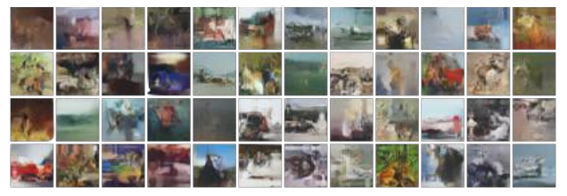

# The Reading Report of Invertible Residual Networks

# Abstract

本文为 Invertible Residual Networks 论文的个人阅读总结报告。不同于现有的基于流模型的网络架构，这篇论文提出了一种基于 ResNet 全新的可逆网络，该可逆网络在保留流模型易于处理的密度估计和非体积保持的优良特性的同时，消除了流模型对维度划分和网络体系结构的限制。iResNet 通过一个 Lipschitz 约束巧妙的同时解决了关于满足网络可逆性，网络逆函数计算，对数行列式逼近三个问题，其设计不可谓不巧妙。该可逆网络不仅在生成任务上表现良好，在判别任务上也展示了不可小觑的潜力。

 

----

# 1. Information

本文为ICML 2019年接受的文章Invertible Residual Networks 隶属于Deep Learning Architectures体系，其作者为来自德国不来梅大学Universität Bremen和加拿大多伦多大学向量研究所的 Jens Behrmann、Will Grathwohl、Ricky T.Q. Chen、David Duvenaud、Jörn-Henrik Jacobsen。其中Ricky T.Q和David Duvenaud也是NeurIPS 2018最佳论文（Neural Ordinary Differential Equations）的作者。其中加拿大多伦多大学向量研究所是由2018年图灵奖获得者神经网络之父 Geoffrey Hiton 所创建。

 

In International Conference on Machine Learning, pp. 573-582, 2019.

 

# 2. Background

首先提出一个问题，为什么我们要追求可逆模型？因为一个可逆模型意味着它是信息无损的，意味着它可以用来做更好的分类网络，意味着可以直接用最大似然来做生成模型。而本文所做的工作基于能力十分强大的 ResNet，意味着它可能有着比之前的 Glow 模型更好的表现。

总而言之，如果一个模型是可逆的，其可逆的成本不高而且拟合能力强，那么它就有很广的用途，例如判别任务、密度估计和生成任务等等。

 

## 2.1. 可逆网络架构

现有的可逆网络架构，如NICE、RealNvp 和 Glow 通过巧妙的维度分解网络架构设计从而实现模型的可逆。并通过约束雅可比矩阵为三角矩阵从而保证雅可比行列式计算的计算资源耗损,以进一步计算精确的对数似然。这样的模型在理论上优雅漂亮，但是存在一个严重的问题: 由于必须约束逆变换过程简单和易于计算的雅可比行列式，就会导致每一层的非线性变换能力都很弱。

state-of-the-art flow-based 模型 Glow，每一层只有一半的变量被变换；所以为了保证充分的拟合能力，对模型深度有较高的要求（比如针对 256 维度的人脸生成任务，Glow 模型使用了大概600个卷积层，参数量为两亿），计算量非常大。而 iResNet 模型却不要求较深的网络层数，却仍然能保持足够充分变换（transform）能力。

## 2.2. 神经常微分方程

将深度网络视为随时间变化的动态的观点提供了两种基本的学习方法。其中一种直接使用离散体系结构直接学习动力学（Haber，2018; Ruthotto，2018; Lu，2017; Ciccone，2018）；而另一种（Chen，2018b; Grathwohl，2019; Chen，2018a）则使用神经网络对常微分方程进行参数化来间接学习动力学。他们通常将可逆变换视为一个动力系统，该动力系统由常微分方程（ODE）求解器近似模拟。

state-of-the-art NFs 模型 Continuous Normalizing Flows（Chen，2018b）方法使用雅可比迹来代替雅可比行列式，其具体做法是将线性变换过程通过一个常微分方程进行参数化。但是与 i-ResNet 相比，它没有固定的计算预算。如下图所示，阐述了线性内插 iResNet 的连续动力学与标准ResNet的连续动力学的区别。可逆ResNets 沿着连续路径是**双射**的，而常规的 ResNets 可能会导致**交叉或合并**路径。

 

**Fig. 1:** 标准 ResNet 网络(左)和 iResNet (右)的动力学。Invertible ResNets 描述了一个双射连续动态，而 ResNets 导致了与非双射连续动态相对应的交叉和折叠路径(用白色圈起来)。由于折叠(collapsing)路径，ResNets 不是有效的密度模型。

---

# 3. Methodology

ResNet 模型的基本模块为
$$
\begin{equation}y = x + g(x)\triangleq F(x)\end{equation}\tag{1}
$$
其中 $x$ 为输入特征，即恒等映射部分，$g(x)$ 为特征变换，即残差部分，$y$ 为输出特征 ，我们称为上式1为一个 ResNet Block。ResNet Block 其将神经网络需拟合的原函数 $y$ 变为 $y-x$，其中 $x,y$ 都是向量（张量）。该操作可以保证网络的深度尽可能的大，但又不必担心梯度弥散的问题。广义上的 ResNet，是允许通过 $1\times 1$ 卷积改变维度的，但这里的 ResNet 指的是不改变维度的 ResNet，即输入输出维度相同，which is 双射函数的充要条件。

如果我们只关心做分类问题，那么我们只需保证网络模型可逆，从而实现信息无损即可；see Sec 3.1

如果我们还关心目标的重建，我们就还需要计算网络模型的逆函数，以进行采样推理；Sec 3.2

如果我们需要使用像 nice，realnvp，glow 这样的 flow-based model 用最大似然（生成问题的本质）来训练生成模型，那么我们还需要解决网络中雅可比行列式的计算损耗问题。Sec 3.3

## 3.1. 可逆条件

因为 式1 是 ResNet 的基本模块，所以只需要保证每个模块可逆即可。式1 可逆的充分条件为
$$
\begin{equation}\text{Lip}(g) < 1\end{equation}\tag{2}
$$
其中 
$$
\begin{equation}\text{Lip}(g) \triangleq \max_{x_1\neq x_2}\frac{\Vert g(x_1) - g(x_2)\Vert_2}{\Vert x_1 - x_2\Vert_2}\end{equation}\tag{3}
$$
是函数 $g$ 的 Lipschitz 范数。

因为 $g$ 是神经网络，神经网络是由矩阵运算和激活函数组合而成的，即代表结构是
$$
g(x)=\begin{equation}\sigma(Wx+b)\end{equation}\tag{4}
$$
由非线性激活函数 $ \sigma$ 参数化，并由权重 $ W $ 和偏差 $ b$ 表示仿射变换。根据式3，我们有：
$$
\begin{equation}\Vert \sigma(Wx_1+b) - \sigma(Wx_2+b)\Vert\leq C(W,b)\cdot \Vert x_1 - x_2 \Vert\end{equation}\tag{5}
$$
其中 $C(W,b)$ 为一个关于 $W$ 与 $b$ 的表达式，其数值即为 Lipschitz 常数。取 $\Delta x \to 0$，采用一阶项近似，得到
$$
\begin{equation}\left\Vert \frac{\partial \sigma}{\partial x}W(x_1 - x_2)\right\Vert\leq C(W,b)\cdot \Vert x_1 - x_2 \Vert\end{equation}\tag{6}
$$
根据链式法则，$\text{Lip}(g) < 1$ 的充分条件是 “$ \sigma$ 的 Lipschitz 范数不超过1” 且 “$Wx+b$ 的 Lipschitz 范数小于1”，即
$$
\text{Lip}(\sigma)<1 
\quad \text{and} \quad 
\text{Lip}(Wx+b)<1\tag{7}
$$

---

### 3.1.1 $\text{Lip}(\sigma)<1$

为了满足条件1。针对式6中的 $\partial \sigma / \partial x$ 项，目前常用的激活函数（如 sigmoid、tanh、relu、elu 等）都满足导数有上下界的约束。因此条件 1 满足。

----

### 3.1.2. $\text{Lip}(Wx+b)<1$

即意味着要求矩阵 $W$ 的 Lipschitz 范数小于1。其中矩阵 $W$ 的 Lipschitz 范数即 “谱范数”，记为 $\text{Lip}(W)$ 或 $\Vert W\Vert_2$。

为了满足条件2。即“ $Wx+b$ 的 Lipschitz 范数小于1”，针对式6中的 $W(x_1 - x_2)$ 项，则有
$$
\begin{equation}\Vert W(x_1 - x_2)\Vert\leq C\Vert x_1 - x_2 \Vert\end{equation}\tag{8}
$$
此时问题已被转化成矩阵范数问题，矩阵范数相当于向量的模长，定义为
$$
\begin{equation}\Vert W\Vert_2 = \max_{x\neq 0}\frac{\Vert Wx\Vert}{\Vert x\Vert}\end{equation}\tag{9}
$$
又称为谱范数（Spectral Norm），其中 $\Vert Wx\Vert$ 和 $\Vert x\Vert$ 都是指向量的范数，即普通的向量模长。根据式 9 我们将式 8 转换为
$$
\begin{equation}\Vert W(x_1 - x_2)\Vert\leq \Vert W\Vert_2\cdot\Vert x_1 - x_2 \Vert\end{equation}\tag{10}
$$
Note: 笔者还发现式 10 同样可以通过 Frobenius 范数的柯西不等式变换来证明。并可以得到 $\Vert W\Vert_F$ 提供了 $\Vert W\Vert_2$ 的一个上界，如果不要求精度，同样可以直接采用  $\Vert W\Vert_2 \to \Vert W\Vert_F$ 逼近，简化计算。

**Theorem 1**

谱范数 $\Vert W\Vert_2$ 等于 $W^{\top}W$ 的最大特征根（主特征根）的平方根，如果 $W$ 是方阵，那么 $\Vert W\Vert_2$  等于 $W$ 的最大的特征根绝对值。The proofs are given in Appendix A.

根据Theorem 1，将问题变成了求 $W^{\top}W$ 的最大特征根，iResNet 采用幂迭代算法（见补充材料）来计算 $W^{\top}W$ 的最大特征根，即谱范数 $\Vert W\Vert_2$，其将谱范数 $\Vert W\Vert_2$ 的平方作为额外的正则项
$$
\begin{equation}loss = loss(y, g(x)) + \lambda \Vert W\Vert_2^2\end{equation}\tag{11}
$$
上式希望 $C=\Vert W\Vert_2$ 尽可能的小，以使神经网络满足 $\text{Lip}(Wx+b)<1$ 约束。iResNet 对模型 $g$ 中的所有核权重 $W$ 都添加了上述正则项，以使整个网络可逆。

---

## 3.2. 逆函数计算

为了进一步进行采样推理，以进行目标的重建。我们还需要将网络的逆函数计算出来。

假设 $y = x +g(x)$ 是可逆的，则其隐式逆函数为 $x = h(y)$，其本质为解非线性方程组。iResNet中采用以下迭代形式
$$
\begin{equation}x_{n+1}=y - g(x_n)\end{equation}\tag{12}
$$
显然，迭代序列 $\{x_n\}$ 是跟 $y$ 有关的，而一旦 $\{x_n\}$ 收敛到某个固定的函数
$$
\begin{equation}\lim_{n\to\infty} x_n(y) = \hat{h}(y)\end{equation}\tag{13}
$$
那么我们就有 $\hat{h}(y)=y-g\left(\hat{h}(y)\right)$，这意味着 $\hat{h}(y)$ 即是所求的 $x =h(y)$。

即如果式12 收敛，那么收敛的结果就是 $x+g(x)$ 的逆函数。我们有
$$
\begin{equation}\forall x_1,x_2,\quad\Vert g(x_1) - g(x_2)\Vert_2\leq \text{Lip}(g)\Vert x_1 - x_2\Vert_2\end{equation}\tag{14}
$$
所以根据式2 $\text{Lip}(g) < 1$，有
$$
\begin{equation}\begin{aligned}\Vert x_{n+1} - x_{n}\Vert_2&=\Vert g(x_{n}) - g(x_{n-1})\Vert_2\\ 
&\leq \text{Lip}(g)\Vert x_{n} - x_{n-1}\Vert_2\\ 
& = \text{Lip}(g)\Vert g(x_{n-1}) - g(x_{n-2})\Vert_2\\ 
&\leq \text{Lip}(g)^2\Vert x_{n-1} - x_{n-2}\Vert_2\\ 
&\dots\\ 
&\leq \text{Lip}(g)^n\Vert x_{1} - x_{0}\Vert_2\\ 
\end{aligned}\end{equation}\tag{15}
$$
根据巴拿赫不动点定理，我们有 $\Vert x_{n+1} - x_{n}\Vert_2\to 0$ 的充分条件是 $\text{Lip}(g) < 1$。其中涉及到柯西列的内容，详细证明见附录 C.

当做好归一化操作使得 $x+g(x)$ 可逆后，它的逆函数为 $x_{n+1}=y - g(x_n)$ 的不动点。数值计算时，只需要使用 式12 迭代格式迭代一定步数，使得精度满足要求就可得到收敛的结果，即 $x+g(x)$ 的逆函数。

---

## 3.3. 雅可比行列式计算

为了用最大似然（生成问题的本质）作为损失函数来训练生成模型，学习强大的生成能力。就需要将雅可比行列式计算出来，首先把雅可比矩阵算出来：
$$
\begin{equation}J_F\triangleq \frac{\partial}{\partial x}(x+g(x))= I + \frac{\partial g}{\partial x}\triangleq I + J_g\end{equation}\tag{16}
$$
雅可比行列式就是 $\det(J_F)=\det (I+J_g)$，但事实上，在做生成模型的时候，我们真正要算的，是“雅可比行列式的绝对值的对数”，即
$$
\begin{equation}\ln |\det(J_F)| = \ln |\det(I + J_g)|\equiv \ln \det(I + J_g)\end{equation}\tag{17}
$$
这里消去绝对值的原因是 Lipschitz 约束恒等式的扰动使 $x + g(x)$ 产生恒定的正行列式。

**Theorem 2**
$$
\begin{equation}\ln\det(\boldsymbol{A}) = \text{Tr}(\ln (\boldsymbol{A}))\end{equation}\tag{18}
$$
The proofs are given in Appendix A.

按定义来计算雅可比行列式？不行，因为这样子计算量实在是太大了，而且反向传播的时候，还要算行列式的导数，那就更复杂了。作者想出了繁琐但有效的解决方法，iResNet 利用 Theorem 2 得到下式
$$
\begin{equation}\ln\det(I + J_g) = \text{Tr}(\ln (I+J_g))\end{equation}\tag{19}
$$
通过实级数的对数展开式将 $\ln (I+J_g)$ 展开为：
$$
\begin{equation}\ln (I + J_g) = \sum_{n=1}^{\infty}(-1)^{n-1}\frac{J_g^n}{n}\label{eq:duishujishu}\end{equation}\tag{20}
$$
该级数收敛的条件是 $\Vert J_g\Vert_2 < 1$，即 $\text{Lip}(g) < 1$，而这正是 iResNet 的约束。

现在 $\ln (I + J_g)$ 为一个无穷级数，如果截断 $n$ 项，那么误差也正比于 $\text{Lip}(g)^n$，所以 iResNet 根据 $\text{Lip}(g)$ 来决定截断的数目。可以进一步写出：
$$
\begin{equation}\text{Tr}(\ln (I + J_g)) = \sum_{n=1}^{N}(-1)^{n-1}\frac{\text{Tr}(J_g^n)}{n}+\mathscr{O}\left(\text{Lip}(g)^N\right)\label{eq:det2tr}\end{equation}\tag{21}
$$
上式需要去计算 $J_g^n$，注意 $J_g$ 是一个矩阵，计算矩阵的 $n$ 次方资源损耗太过巨大。因此 iResNet 假设对于任意的矩阵 $A$，有
$$
\begin{equation}\text{Tr}(A)=\mathbb{E}_{u\sim p(u)}\big[u^{\top}Au\big]\end{equation}\tag{22}
$$
其中 $p(u)$ 是一个多元概率分布，其均值为0、协方差为单位矩阵。iResNet 对于每次迭代，从 $p(u)$ 中随机选一个向量 $u$ 出来，然后认为 $u^{\top}Au$ 就是 $\text{Tr}(A)$，即将式 21 转变为式 22
$$
\begin{equation}\text{Tr}(\ln (I + J_g)) \approx \sum_{n=1}^{N}(-1)^{n-1}\frac{u^{\top} J_g^n u}{n},\quad u\sim p(u)\label{eq:tr-caiyang}\end{equation}\tag{22}
$$
其中 
$$
\begin{equation}u^{\top} J_g^n u=u^{\top} J_g(\dots(J_g(J_g u)))\end{equation}
$$
因此不用把 $J_g^n$ 算出来，而是每步只需要算一个矩阵与一个向量的乘法，并且每步计算可以重复利用，因此计算量是大大减少的。

即 iResNet 将首先雅可比矩阵做对数级数展开[20](#eq20)，然后将行列式计算转化为迹的计算[21](#eq21)，并且利用概率采样的方式 [22](#eq22)，就可以最高效地计算雅可比行列式。

 

---

# 4. Results

## Toy数据集实验

Toy数据集，构造了一些有规律的随机点来，其目的是使用生成模型去拟合它的分布，GAN中也常做这样的实验。从下图可以看到 iResNet 的效果比 Glow 好得多。我觉得是因为 iResNet 是一个很对称的、没有什么偏置的模型，而 Glow 则是有偏的，它需要我们以某种方式打乱输入，然后对半切分，对半之后两部分的运算是不一样的，这就带来了不对称的问题。

**Fig. 2** Visual comparison of i-ResNet flow and Glow.

## 分类任务实验

既然是 iResNet 是基于 ResNet 的网络，其最基本的用途就是分类了。下表表明用 iResNet 做分类任务，效果也是很不错的，Lipschitz约束的存在不会明显影响分类结果（表中的 $c$ 就是 $\text{Lip}(g)$）。

**Table. 2** 通过系数 c 将 i-ResNet 与具有不同 Lipschitz 约束的类似深度和宽度的 ResNet-164 基线架构进行比较。Vanilla 与 i-ResNet 共享相同的体系结构，没有 Lipschitz 约束。

其中 ResNet-164 是具有类似 iResNets 架构的网络，vanilla 表示为没有 Lipschitz 约束的 ResNet。观察到当应用非常保守的归一化（当 $c$ 很小时），所有测试的数据集的分类误差都会更高，但当 $c$ 较大时，趋近于1时，其与普通的 ResNet-64 极具竞争性。

## 生成模型实验

当前state-of-the-art 的流模型系列在生成复杂图片方面还远比不上 GAN，但两者之间的定量对比没有明显的优劣。我们将 i-ResNet 与其进行比较，将流模型中的耦合层使用具有相同数量参数的**可逆残差块**替换，可逆线性变换使用 **actnorm**替换（Kingma，2018）。下图也表明可逆ResNet作为一个基于流的生成模型方面也是很优秀的。

**Fig 5.** CIFAR10来自我们 `i-ResNet flow` 的样本。

与其他生成模型的结果比较可以在  [Table 4.](#tab4)  中找到。尽管 iResNet 模型不如 Glow 和 FFJORD 表现出色，但令人惊讶的是 ResNets 只需进行很少的修改就可以创建与这些高度工程化的生成模型进行竞争。

**Table 4.** MNIST和CIFAR10 bits/dim 结果。$†$ 使用 ZCA 预处理，因此结果无法直接比较。

---

# 5. Conclusion

在iResNet之前，用于判别学习的最成功的前馈架构之一是深度残差网络，但该架构与对应的生成模型有很大不同。这种划分使得为给定任务选择或设计合适架构变得复杂。而 iResNet提出了一种可以解决该问题的表现良好的新架构，弥补了这一差距。且其不限制与特定的网网络结构设计。其整个工作很暴力，通过一个 Lipschitz 常数，解决了可逆最大似然生成模型的三个问题，有一种浑然的美感在里边，并非简单的堆砌数学公式。

但是其在判别任务与生成任务中与个别网络结果仍有差距，我认为这是由于作者在进行矩阵迹计算【式21】使用了概率采样【22】的方法，仅仅从多元概率分布 $p(u)$ 中随机取一个向量，这导致其对对数行列式的估计是有偏的，我个人认为如果可以通过无偏的方法来处理这部分的估计，可能会提升一定的性能。

---

# A. Additional Lemmas and Proofs

*Proof*. (**Theorem 1**)

根据式9，我们有
$$
\Vert W\Vert_2^2 = \max_{x\neq 0}\frac{x^{\top}W^{\top} Wx}{x^{\top} x} = \max_{\Vert x\Vert=1}x^{\top}W^{\top} Wx
$$
假设 $W^{\top} W$ 对角化为 $\text{diag}(\lambda_1,\dots,\lambda_n)$，即 $W^{\top} W=U^{\top}\text{diag}(\lambda_1,\dots,\lambda_n)U$，其中 $\lambda_i$ 都是它的特征根，且非负，其中 $U$ 是正交矩阵，由于正交矩阵与单位向量的积还是单位向量，那么
$$
\begin{aligned}\Vert W\Vert_2^2 =& \max_{\Vert x\Vert=1}x^{\top}\text{diag}(\lambda_1,\dots,\lambda_n) x \\ 
=& \max_{\Vert x\Vert=1} \lambda_1 x_1^2 + \dots + \lambda_n x_n^2\\ 
\leq & \max\{\lambda_1,\dots,\lambda_n\} (x_1^2 + \dots + x_n^2)\quad(\text{Note:}\Vert x\Vert=1）\\ 
=&\max\{\lambda_1,\dots,\lambda_n\}\end{aligned}
$$
从而 $\Vert W\Vert_2^2$ 等于 $W^{\top} W$ 的最大特征根。

*Proof*. (**Theorem 2**)

我们考虑带标量参数 $t$ 的
$$
\begin{equation}f(t)=\det(\exp(t\boldsymbol{A}))\end{equation}
$$
然后求其导数得
$$
\begin{equation}\begin{aligned}\frac{d}{dt}f(t)=&f(t)\text{Tr}\left(\exp(-t\boldsymbol{A})\underbrace{\frac{d}{dt}\exp(t\boldsymbol{A})}_{=\exp(t\boldsymbol{A})\boldsymbol{A}}\right)\\ 
=&f(t)\text{Tr}(\boldsymbol{A})\end{aligned}\end{equation}
$$
其中 $\text{Tr}(\boldsymbol{A})$ 为一个常数，我们得到了一个一阶齐次微分方程。它的解析解为
$$
\begin{equation}f(t)=C\exp(t\,\text{Tr}(\boldsymbol{A}))\end{equation}
$$
当 $t=0$ 时，我们有 $f(0)=1$ ，进一步计算得 $C=1$，即 $f(t)=\exp(t\,\text{Tr}(\boldsymbol{A}))$，即证明了
$$
\begin{equation}\det(\exp(t\boldsymbol{A}))=\exp(t\,\text{Tr}(\boldsymbol{A}))\end{equation}
$$
当 $t=1$ 时，得到恒等式 $\det(\exp(\boldsymbol{A})) = \exp(\text{Tr}(\boldsymbol{A}))$。两边取对数，可以得到它的另一个常见的形式
$$
\begin{equation}\ln\det(\boldsymbol{B}) = \text{Tr}(\ln (\boldsymbol{B}))\end{equation}
$$

---

# B. Power iterations Algorithm

幂迭代通过上述的迭代格式
$$
\begin{equation}u \leftarrow \frac{(W^{\top}W)u}{\Vert (W^{\top}W)u\Vert}\end{equation}
$$
迭代若干次后，最后通过下式
$$
\begin{equation}\Vert W\Vert_2^2\approx u^{\top}W^{\top}Wu\end{equation}
$$
得到范数，即最大的特征根的近似值。也可以等价改写为
$$
\begin{equation}v\leftarrow \frac{W^{\top}u}{\Vert W^{\top}u\Vert},\,u\leftarrow \frac{Wv}{\Vert Wv\Vert},\quad  \Vert W\Vert_2 \approx u^{\top}Wv\end{equation}
$$
这样，初始化 $u,v$ 后（可以用全1向量初始化），就可以迭代若干次得到 $u,v$，然后代入 $u^{\top}Wv$ 算得 $\Vert W\Vert_2$ 的近似值。

# C. Banach's Fixed Point Theorem

对于任意正整数 $k$ ，我们继续考虑 $\Vert x_{n+k} - x_{n}\Vert_2$：
$$
\begin{equation}\begin{aligned}\Vert x_{n+k} - x_{n}\Vert_2&\leq\Vert x_{n+k} - x_{n+k-1}\Vert_2+\dots+\Vert x_{n+2} - x_{n+1}\Vert_2+\Vert x_{n+1} - x_{n}\Vert_2\\ 
&\leq \left(\text{Lip}(g)^{n+k-1}+\dots+\text{Lip}(g)^{n+1}+\text{Lip}(g)^{n}\right)\Vert x_{1} - x_{0}\Vert_2\\ 
& = \frac{1 - \text{Lip}(g)^k}{1 - \text{Lip}(g)}\cdot\text{Lip}(g)^{n}\Vert x_{1} - x_{0}\Vert_2\\ 
& \leq \frac{\text{Lip}(g)^n}{1 - \text{Lip}(g)}\Vert x_{1} - x_{0}\Vert_2 
\end{aligned}\end{equation}
$$
可以看到我们得到了 $\Vert x_{n+k} - x_{n}\Vert_2$ 的一个上界，它只与 $n$ 有关，且可以任意小。也就是说，对于任意 $\varepsilon > 0$，我们可以找到一个 $n$，使得对于任意的正整数 $k$ 都有 $\Vert x_{n+k} - x_{n}\Vert_2 < \varepsilon$。这样的数列我们称为Cauchy列，它是必然收敛的。至此，我们终于证明了的收敛性。

顺便一提的是，在上式中，取 $k\to\infty$，我们得到：
$$
\begin{equation}\left\Vert x^* - x_{n}\right\Vert_2 \leq \frac{\text{Lip}(g)^n}{1 - \text{Lip}(g)}\Vert x_{1} - x_{0}\Vert_2\end{equation}
$$
也就是说，这个迭代算法的收敛速度跟正比于 $\text{Lip}(g)^n$，那么自然是 $\text{Lip}(g)$ 越小收敛越快，但是 $\text{Lip}(g)$ 越小模型的拟合能力越弱，原论文中它的范围是 $0.5～0.9$。

说宏大一点，其实这就是泛函分析中的“巴拿赫不动点定理”，又称“压缩映射定理”（因为 $\text{Lip}(g)$ 小于1，所以 $g$ 被称为一个压缩映射。）。

