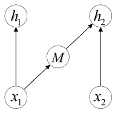
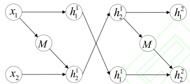
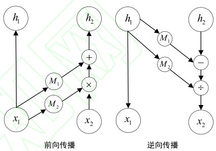
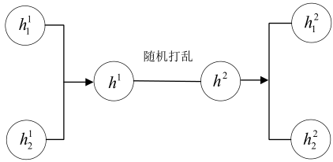
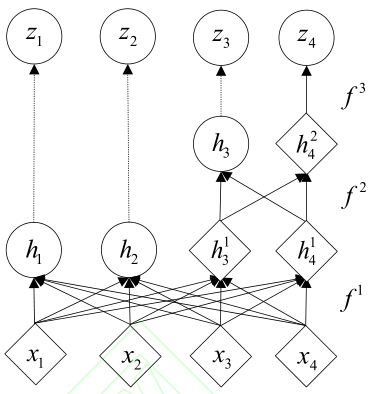
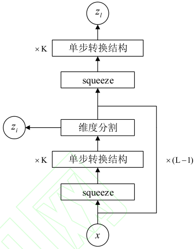

# 深度生成模型综述

自动化学报 深度生成模型综述 胡铭菲

流模型的基本思想是：**真实数据分布一定可以由转换函数映射到人为给定的简单分布**，如果该**转换函数是可逆的**且可求出该转换函数的形式，则这个**简单分布和转换函数的逆函数就能够构成一个深度生成模型**。可逆函数的性质说明 Flow 模型是一个精确模型，有希望生成质量足够好的样本。

Flow 模型的相关论文较少，重要的论文中存在很多必须了解的基本结构，因此本节首先介绍 Flow
的基础框架，然后详细说明 NICE 、Real NVP 和 Glow 等常规流、i-ResNet 以及变分流等模型的结
构。

## 5.1. 流模型框架

数据分布 $P(x)$ 通过转换函数 $F(x)$ 将该分布映射为指定的**简单分布**，**假设**该分布是**各分量独立**的**高斯分布**，则 $P(x)$ 可以表示成带有转换函数和雅可比行列式的如下形式：
$$
\begin{equation}
 P(x)=\frac{1}{(2 \pi)^{D / 2}} \exp \left(-\frac{1}{2}\|F(x)\|^{2}\right) \mid \operatorname{det}\left[\frac{\partial F}{\partial x}\right] 
\end{equation}
$$
其中 $det(\cdot)$ 表示雅可比行列式。根据该目标函数优化能得到 $F(x)$ 中的参数，进而得知逆函数 $G(z)$ 的具体形式，这样就能得到一个生成模型。但雅可比行列式的计算量很大，转换函数的逆变换难以求解，为了保证计算上的可行性，$F(x)$ 必须满足如下条件：

​	①雅可比行列式容易计算；
​	②函数可逆，求逆过程的计算量尽量小。

雅可比行列式的维数与数据维数相关，对于**高维数据**而言，**雅可比行列式的计算量要比函数求逆更大**，因此 $F(x)$ 首先要满足第一个条件。流模型提出将雅可比行列式设计为容易计算的**三角阵行列式**，其值等于对角线元素乘积从而简化求解雅可比行列式的计算量:
$$
\begin{equation}
 \left|\operatorname{det}\left[\frac{d h^{i}}{d h^{i-1}}\right]\right|=\operatorname{sum} \left|\operatorname{diag}\left[\frac{d h^{i}}{d h^{i-1}}\right] \right| 
\end{equation}
$$
三角阵行列式的上三角或下三角区域元素的值为 0 意味着每次转换都**只有一部分元素参与了映射**，**另一部分元素只进行了恒等变换**，这种简单变换**产生的非线性较弱**，需要多个简单变换的复合形式增强模型的拟合能力。根据链式法则可得：
$$
\begin{equation}
 \frac{\partial z}{\partial x}=\frac{\partial h^{1}}{\partial x} \cdot \frac{\partial h^{2}}{\partial h^{1}} \cdots \frac{\partial h^{k}}{\partial h^{k-1}} \cdot \frac{\partial z}{\partial h^{k}} 
\end{equation}
$$
流模型的转换函数用神经网络表示，该神经网络相当于一系列转换函数作用效果的累积，这种简单变换的叠加过程如同流水一般积少成多，因此将这样的过程称为 ‘流’，大部分流模型都以这种模型框架为基础。此时流模型的对数似然函数可以写成：
$$
\begin{equation}
 \begin{aligned} & \log P(x) \\=&-\log P(z)-\sum_{i=1}^{k} \log \left|\operatorname{det}\left(\frac{d h_{i}}{d h_{i-1}}\right)\right| \\=&-\sum_{i=1}^{k}\left(\frac{1}{2}\left\|F^{i}(x)\right\|^{2}-\log \left|\operatorname{det}\left(\frac{d h_{i}}{d h_{i-1}}\right)\right|\right)+c \end{aligned} 
\end{equation}
$$
其中 $ c=-\frac{D}{2} \log (2 \pi) $ 表示常数。

---

## 5.2 常规流

### 5.2.1 NICE

非线性独立成分估计（Nonlinear Independent Components Estimation，NICE）[5] 是第一个流模型，此后出现的流模型大部分都是以 NICE 的结构和理论为基础。除了流模型的基本框架外， NICE 提出了三个重要的模型结构：加性耦合层、维数混合和维数压缩层。

#### 加性耦合层

NICE 提出将雅可比行列式构造成三角阵形式，并将这种结构称为耦合层（ coupling layer ）。耦合层将 $D$ 维输入变量分割成两部分 $ x_{D}=\left[x_{1: d}, x_{d+1, D}\right]=\left[x_{1}, x_{2}\right] $，然后取如下变换：
$$
\begin{equation}
 h_{1}=x_{1} \\ h_{2}=x_{2}+M\left(x_{1}\right) 
\end{equation}
$$
其中 $M$ 表示定义在空间 $ \mathbf{R}^{d} $ 上的任意函数，下一个隐藏层变量为 $ h=\left[h_{1}, h_{2}\right] $，这种只含有加性算法的耦合层被称为加性耦合层（ Additive Coupling ），其结构如下 **Fig. 15** 所示。

**Fig. 15** 加性耦合层结构

加性耦合层的雅可比行列式是上三角行列式且对角线元素全部为 1 ，用分块矩阵表示该行列式为：
$$
\begin{equation}
 \frac{\partial h}{\partial x}=\left[\begin{array}{cc}\partial h_{1} / \partial x_{1} & \partial h_{1} / \partial x_{2} \\ \partial h_{2} / \partial x_{1} & \partial h_{2} / \partial x_{2}\end{array}\right]=\left[\begin{array}{cc}I_{d} & 0 \\ \partial h_{2} / \partial x_{1} & I_{D-d}\end{array}\right]=1 
\end{equation}
$$
该雅可比行列式的值为 1 ，根据链式法则可以得到：
$$
\begin{equation}
 \operatorname{det}\left[\frac{\partial z}{\partial x}\right]=\operatorname{det}\left[\frac{\partial h^{1}}{\partial x}\right] \cdots \operatorname{det}\left[\frac{\partial z}{\partial h^{k}}\right]=1 
\end{equation}
$$
这使得该项在目标函数中的值为 1 ，从而消除了雅可比行列式的计算量。该转换函数的逆函数也很容易得到，其逆变换的形式如下：
$$
\begin{equation}
 x_{1}=h_{1} \\
 x_{2}=h_{2}-M\left(h_{1}\right) 
\end{equation}
$$
这种结构的转换函数即满足可逆性的要求，且逆函数和雅可比行列式都容易求解，不需要额外的计算量，后来大部分的流模型都采用了这种结构。

---

#### 维数混合

转换函数不仅非线性能力较弱，而且每次转换过程都有一部分元素没有变化。为了使信息能充分混合， NICE 采用在每次耦合层后直接交换两部分元素的位置 $ h_{1}^{1}=h_{2}^{2}, \quad h_{2}^{1}=h_{1}^{2} $，其结构如图 16 所示。

**Fig. 16** 维数混合结构

---

#### 维数压缩层

Flow 是以可逆变换结构为基础的模型，变换可逆性使得模型中**各隐藏层的维数**需要与**输入样本维数 $D$ 的大小相同**，这使得 Flow 模型存在严重的维数浪费问题，因此 NICE 提出在**最后一层和先验分布之间引入维数压缩层**，此时模型的对数似然函数变为
$$
\begin{equation}
 \begin{aligned} \log P(x)=&-\frac{D}{2} \log (2 \pi)-\sum_{i=1}^{k}\left(\frac{1}{2}\left\|G^{i}(x)\right\|^{2}\right) \\ &-\frac{1}{2}\|s \cdot G(x)\|^{2}+\sum_{i=1}^{D} \log s_{i} \end{aligned} 
\end{equation}
$$
其中 $s$ 表示维数压缩层中待优化的参数。在压缩层中引入 $s$ 等价于将先验分布的方差也作为参数进行优化。如果某个方差接近 0 ，说明其对应的维数所表示的流形已经塌缩为点，从而起到维数压缩的作用。

---

### 5.2.2 RealNVP

Real NVP [63] 的全称为 real-valued non-volume preserving ，直译为实值非体积保持，非体积保持是指该模型的雅可比行列式的值不为 1 。 Real NVP 在NICE 的基本结构上，提出了比加性耦合层**非线性能力更强**的**仿射耦合层和维数的随机打乱机制**，在**耦合层中引入卷积层**使得 Flow 模型可以更好地处理图像问题，并设计了多尺度结构以**降低 NICE 模型的计算量和存储空间**。

#### 仿射耦合层 

NICE 性能较差与耦合层结构过于简单有关，因此 Real NVP 提出在原有的加性耦合层的基础上加入了乘性耦合，两者组成的混合层称为仿射耦合层（ affine coupling layer ），其结构如图 17 所示。

**Fig. 17** 仿射耦合层结构

该耦合层可以表示成如下形式：
$$
\begin{equation}
 h_{1}=x_{1} \\
 h_{2}=x_{2} \odot M_{2}\left(x_{1}\right)+M_{1}\left(x_{1}\right) 
\end{equation}
$$
仿射耦合层的雅可比行列式是对角线不全为 1 的下三角阵，用分块矩阵表示该行列式为：
$$
\begin{equation}
 \frac{\partial h}{\partial x}=\left[\begin{array}{cc}I_{d} & 0 \\ \frac{\partial h_{2}}{\partial x_{1}} & M_{2}\left(x_{1}\right)\end{array}\right] 
\end{equation}
$$
该行列式的值为对角线元素乘积 ，为了保证**可逆性**需要约束雅可比行列式**对角线各元素均大于**
**0**，因此 Real NVP **直接用神经网络输出 $ \log s $** 。 该转换函数的逆函数很容易表示为：
$$
\begin{equation}
 x_{1}=h_{1} \\
 x_{2}=\frac{h_{2}-M_{1}\left(x_{1}\right)}{M_{2}\left(x_{1}\right)} 
\end{equation}
$$

---

#### 随机混合机制 

NICE 性能较差的另一个原因是交换两个分量的位置不能充分混合变量信息，因此 Real NVP 采用随机混合机制，对耦合层之间的分量随机打乱，再将打乱后的向量重新分割成两部分并输送到下个耦合层中，其结构如图 18 所示。

**Fig. 18** 随机混合结构

---

#### 掩码卷积层 

为了更好的处理图片样本， RealNVP 在流模型中引入了卷积层。卷积方法可以捕捉样本在空间上的局部相关性，但是**随机打乱机制会使样本原有的局部相关性消失**，为此 Real NVP 提出先使用掩码**增加样本通道数**并**降低空间维数**，棋盘掩码是一种固定间隔的空间轴上的交错掩码，能够有效保留样本在空间的局部相关性：
$$
\begin{equation}
 h \times w \times c \rightarrow \frac{1}{n} h \times \frac{1}{n} w \times 2 n c 
\end{equation}
$$
用棋盘掩码增加样本通道数的操作称为挤压（ squeeze ），是流模型中使用卷积层的必须步骤，然后对样本的通道执行分割和打乱操作，这种方式**保留了样本的局部相关性**，以便直接使用卷积网络，大幅度**提高模型的计算效率**。

---

#### 多尺度结构 

NICE 的加性耦合层和 real NVP的仿射耦合层在每次执行时都有部分维数的向量没有改变，因此 real NVP 提出在仿射耦合层中使用如 Fig. 19 所示的多尺度结构，是仿射耦合层交替变换的一种组合结构。

将样本分成四部分 $ x=\left[x_{1}, x_{2}, x_{3}, x_{4}\right] $ 输入到耦合层中，第一次转换将 $x_1$ 和 $x_2$ 转换成 $h_1$ 和
$h_2$ 后当作多尺度结构的结果 $z_1$ 和 $z_2$，然后将没有改变的 $h_3^1$ 和 $h_4^1$ 输入到耦合层中继续转换，得到转换后的结果 $z_3$ 和没有改变的 $h_4^2$，最后在第三次转换过程中将 $h_4^2$ 转换成 $z_4$ 。

#### 

**Fig. 19** 仿射耦合层的组合策略

多尺度结构通过这种逐层转换的方式，使数据的全部元素都可以在一个复合耦合层内进行转换，保留了原有方法中雅可比行列式容易计算的特点，减少模型复杂度和计算量的同时增加模型的生成能力。

---

### 5.2.3. GLOW

GLOW [64] 是以 NICE 和 RealNVP 为基础结构的模型，是当前流模型中效果最好的模型。 GLOW 模型主要有两个贡献：第一个贡献是**修改流模型的结构**，提出完整的模型结构，引入 Actnorm 层；第二个贡献是提出 **1x1 卷积**和 **LU 矩阵分解**方法并将置换矩阵当作优化项。

#### 模型结构修改 

GLOW 以 RealNVP 模型为基础构造了性能更好的模型框架，并针对 RealNVP 的不足进行两处修改：

1. 仿射耦合层内部的乘性耦合使得其计算量是加性耦合层的两倍，但经过实验证明仿射耦合层的
性能提升很小，因此 GLOW 训练高维样本时为了减少计算量**只保留加性耦合层**。

2. GLOW 证明了**棋盘掩码的复杂操作不能提升模型的生成能力**，因此**删除**了该模块。

#### Actnorm 层 

由于内存限制，流模型在训练较大的图像时每个批次的样本数通常选 1 ，因此提出了类似于批归一化处理的 Actnorm 层。 Actnorm 用**批次样本的均值和方差初始化参数** $b$ 和 $s$ ，是**对先验分布的平移和缩放，有助于提高模型的生成能力**。

#### 置换矩阵 

相比于 NICE 中的简单交换，RealNVP 的随机打乱方法可以得到更低的损失，因此 GLOW 提出用 **1x1 卷积**运算改变置换通道的排列，用**置换矩阵替代随机打乱**并放到损失函数中一并优化以进一步提升模型效果。

具体方法是通过一个随机旋转矩阵 $W$ 置换输入轴通道的排列顺序使 $ h=x W $，为了保证转换函数的可逆性，方阵 $W$ 初始化为**随机正交矩阵**，因此其雅可比行列式的值为 $ \operatorname{det} W $。

为了更容易计算雅可比行列式的值， GLOW 利用 **LU 矩阵分解法**分解正交矩阵 $W$ 使 $ W=P L U $，其中 $P$ 是置换矩阵，$L$ 是对角线全为 1 的下三角阵，$U$ 是上三角阵，此时可以容易得到雅可比行列式的值为上三角阵 $U$ 的对角线乘积：
$$
\begin{equation}
 \log |\operatorname{det} W|=\sum \log |\operatorname{diag}(U)| 
\end{equation}
$$
GLOW 使用 LU 分解法计算旋转矩阵 $W$ 的雅克比行列式的值，几乎没有改变原模型的计算量，且减少了待优化参数的数量。实验证明了可逆 1x1 卷积可以得到比随机打乱机制**更低的损失**且具有**很好的稳定性**。

**Fig. 20** GLOW 的层结构

GLOW 的单个转换结构包括 **Actnorm 层**、**可逆 1x1 卷积**和**耦合层**，其流程图如 Fig. 20 所示。图中的超参数 $K$ 和 $L$ 表示循环次数。样本 $x$ 先进行 squeeze 操作后用单步转换结构迭代 $K$ 次，然后将转换的结果进行维数分割，分割后的两部分变量与多尺度结构的结果意义相同，将整个过程循环 $L-1$ 次后将未转换过的部分维数再次进行 squeeze 操作和 $K$ 次单步转换，以上构成了 GLOW 的多尺度结构。

GLOW 进一步提升了流模型的性能，各个数据集上的表现都超过了其他所有流模型，可以生成清晰度很高的人脸图像，缺点是置换矩阵导致模型的层数很多，拥有生成式模型中最大的参数量级，例如生成 256x256 的高清人脸图像需要 600 多个耦合层和 2 亿多个参数，训练成本很高，因此改进自身结构或使用非线性程度更高的转换函数以降低训练成本和模型深度是提高流模型实用性的关键。

---

## 5.3 可逆残差网络

以 GLOW 为代表的常规流模型有两个严重的问题：第一个问题是流模型**为了保证转换函数的雅**
**可比行列式在计算量上的可行性**，导致**单层转换函数的非线性变换能力很弱**，过多耦合层的累加使模型的参数个数巨大；第二个问题是为了有一个容易求解的逆函数，**流模型的耦合层的存在，导致模型是不对称的**。

可逆残差网络（ Invertible Residual Networks,i-ResNet ）是**以残差网络为基础的生成模型**，**利用约束使残差块可逆**，然后用**近似方法计算**残差块的**雅可比行列式**，这使得 i-ResNet 与其它流模型有本质区别：**保留了 ResNet 的基本结构和拟合能力**，使残差块是对称的又有很强的非线性转换能力。

---

### 5.3.1 残差块的可逆性条件

i-ResNet 的基本模块与 ResNet 相同，可以表示成 $ y=x+G(x) $，残差块用神经网络 $ x+G(x) $ 拟合y ，使得残差块的梯度 $ 1+\partial G(x) / \partial y $ 不会在深层网络中出现梯度消失的问题，以便训练更深层次的网络。将 i-ResNet 构造成流模型，首先要保证模型的可逆性，等同于保证单个残差块的可逆性。残差块可逆性的充分不必要条件是函数 $ G(\cdot) $ 的 Lipschitz 范数小于 1 即 $ \operatorname{Lip}(G)<1 $。因此神经网络拟合的函数 $ G(\cdot)=F(W x+b) $ 使用普通激活函数时，其可逆性条件等价于权重矩阵 $W$ 的谱范数小于 1 ：
$$
\begin{equation}
 \operatorname{Lip}(G)<1 \Leftrightarrow \operatorname{Lip}(W)<1 
\end{equation}
$$
因此只要对 $ G(\cdot) $ 内的所有权重矩阵进行谱归一化后乘一个介于 0 和 1 之间的系数即可保证残差
块的可逆性：
$$
\begin{equation}
 W \leftarrow \frac{c W}{\|W\|_{2}} 
\end{equation}
$$

---

### 5.3.2 i-ResNet 的求解方法

流模型需要直接计算出残差块的逆函数，但残差块的形式导致很难直接求出逆函数的解析形式，为了简化计算，i-ResNet 使用迭代 $ x_{n+1}=y-G\left(x_{n}\right) $：当 $x_{n}$ 收敛到某个固定函数时表明得到了足够近似的逆函数，并给出限制 $ \operatorname{Lip}(G)>0.5 $ 保证 $x_{n}$ 的收敛性。

i-ResNet 的关键是如何求解残差块的雅可比行列式的值，雅可比行列式可以表示如下：
$$
\begin{equation}
 \frac{\partial(x+G(x))}{\partial x}=I+\frac{\partial G}{\partial x} 
\end{equation}
$$
为了求解该式， i-ResNet 先后使用**级数展开**、**截断**和**随机近似**三种数学方法：首先用恒等式将雅可比行列式绝对值的对数**转化为求迹**，并在使用级数展开形式后在第 n 项截断，然后使用随机近似方法得到近似值。

i-ResNet 使用多种手段直接且较高效的求解出残差块的雅可比行列式，尽管模型的生成能力与GLOW 相差很大，但摆脱了耦合层的弊端，是对 FLOW 模型的革新和大胆的尝试

---

## 5.4 变分推理流

---

## 5.5 总结

Flow 是一个非常精巧的模型，也是在**理论上没有误差的模型**。Flow 设计了一个可逆的编码器，只要训练出编码器的参数就能直接得到完整的解码器，完成生成模型的构造。为了保证编码器的可逆
性和计算上的可行性，目前 Flow 类模型只能使用多个耦合层的堆叠来增加模型的拟合能力，但耦合层的拟合能力有限，这种方法很大程度上限制了模型的性能。 

Flow 目前的应用范围集中在图像生成领域中的人脸生成，最优秀的模型为 GLOW 。相比于以 GAN 为首的其他深度生成模型，Flow 参数量更多、运算量更大，且**应用领域只局限于图像生成**，这些弊端限制了 Flow 的进一步发展，作为无误差的生成模型，潜力巨大的 Flow 模型应该在未来的研究中**寻找更高效的可逆编码器结构或者拟合能力更强的耦合层，并扩展模型的应用范围**。

https://scholar.google.com/scholar?start=40&hl=en&scisbd=1&as_sdt=2005&sciodt=0,5&cites=13099094504334344711&scipsc=

2021-07-28

**start**

Hierarchical Reinforcement Learning with Optimal Level Synchronization based on a Deep Generative Model JY Kim, [J Xuan](https://scholar.google.com/citations?user=POQ_yJUAAAAJ&hl=en&oi=sra), C Liang, [F Hussain](https://scholar.google.com/citations?user=L2Ve-R0AAAAJ&hl=en&oi=sra) - arXiv preprint arXiv:2107.08183, 2021 - arxiv.org

**end**

Implicit Normalizing Flows

2020年10月7日 尾号2021前全部整理完

## 1. Hierarchical Reinforcement Learning with Optimal Level Synchronization based on a Deep Generative Model

Normalizing Flow : A simple distribution can be transformed into a complex distribution by repeatedly using an invertible mapping function. The change of the variable theorem makes the transformation from a variable to a new one possible and leads to the final distribution of the target variable as follows. Suppose a probability density function $z~q(z)$ for a random variable $z$. If an invertible bijective transformation function 𝑔 exists between a new variable $x$ and $y$, $x=f(z)$ and $z=f^{-1}(x)$. Again, if the change of the variable theorem is applied to $x$ and $z$ in the multivariate version,
$$
\begin{equation}
 \mathbf{z}_{i-1} \sim q_{i-1}\left(\mathbf{z}_{i-1}\right), \mathbf{z}_{i}=f_{i}\left(\mathbf{z}_{i-1}\right), \mathbf{z}_{i-1}=f_{i}^{-1}\left(\mathbf{z}_{i}\right) 
\end{equation}
$$
and then
$$
\begin{equation}
 q_{i}\left(\mathbf{z}_{i}\right)=q_{i-1}\left(f_{i}^{-1}\left(\mathbf{z}_{i}\right)\right)\left|\frac{d f_{i}^{-1}}{d \mathbf{z}_{i}}\right| \\
 \log q_{i}\left(\mathbf{z}_{i}\right)=\log q_{i-1}\left(\mathbf{z}_{i-1}\right)-\log \left|\frac{d f_{i}}{d \mathbf{z}_{i-1}}\right| 
\end{equation}
$$
Finally, the chain of $K$ transformations of probability density function $f_i$, which is easily inverted and whose Jacobian determinant can be easily computed, from the initial distribution $z_0$ yields a final target variable $x$,
$$
\begin{equation}
 \mathbf{x}=\mathbf{z}_{\mathrm{K}}=f_{\mathrm{K}} \circ \circ \circ f_{2} \circ f_{1}\left(\mathbf{z}_{0}\right) 
 \\
 \log p(\mathbf{x})=\log q_{\mathrm{K}}\left(\mathbf{z}_{\mathrm{K}}\right)=\log q_{0}\left(\mathbf{z}_{0}\right)-\sum_{i=1}^{\mathrm{K}} \log \left|\frac{d f_{i}}{d \mathbf{z}_{i-1}}\right| 
\end{equation}
$$
In our research, we focus on the advantages of a normalizing flow, which are model flexibility and generation speed, even though it also has drawbacks. A Real-valued Non-Volume
Preserving algorithm (RealNVP) makes use of a normalizing flow which is implemented with an invertible bijective transformation function. Each bijection called an affine coupling
layer, which is $ f: \mathbf{x} \mapsto \mathbf{y} $, decomposes an input dimension into two sections. The intrinsic transformation property using the affine coupling layer causes the input dimension to be unchanged with the alternate modification of the two split input sections in each coupling layer. Based on this property, the inverse operation is attained without difficulty. 

In addition, the inverse operation easily computes its Jacobian determinant since its Jacobian is a lower triangular matrix. RealNVP uses a multi-scale architecture as well as a batch normalization for better performance. To support a local correlation structure of an image, there are two masked convolution methods: the spatial checkerboard pattern mask and channel-wise mask[31]. Non-linear Independent Components Estimation (NICE) which is a previous model of RealNVP uses an additive coupling layer which does not use the scale term of an affine coupling layer [32]. Generative flow with 1×1 convolutions (Glow) is a method to simplify the architecture regarding a reverse operation of channel ordering of NICE and RealNVP[33].

Several studies have tried to overcome the chronic drawback of a normalizing flow, biased log-density estimation [34], [35]. [36] utilizes the intrinsic characteristic of FDGM with an inductive bias based on a model architecture. Hence, the research takes advantage of a biased log-density estimation of FDGM itself. The research suggests a model architecture
using a VAE which extracts a global representation of an image and a FDGM, which depends on a local representation, with a conditional input of the global representation of the image.
Finally, an unbiased log-density estimation of an image can be expected from the FDGM using the output of the VAE. We adopt this architecture as the main idea for our model. The
model architecture is as follows. The compression encoder
$$
\begin{equation}
 q_{\phi}(z \mid x) 
\end{equation}
$$
in the VAE framework compresses the image $x$ with a high dimension to the latent representation $z$ with a low dimension. Then to reconstruct $x$ using a flow-based decoder 
$$
\begin{equation}
 v=f_{\theta}(x ; z) 
\end{equation}
$$
where a latent representation $z$, which is the output of the compression encoder, is fed into the flow-based decoder as a conditional input for dealing with the biased log-density estimation of FDGM. Finally, image $x$ is reconstructed by using the inverse function 
$$
\begin{equation}
 x=f_{\theta}^{-1}(v ; z) 
\end{equation}
$$

## 2. Continuous Latent Process Flows

Normalizing flows [ 32 , 12 , 23 , 13 , 29 , 22 , 3 , 8 , 24 , 30 ] employ a bijective mapping $ f: \mathbb{R}^{d} \rightarrow \mathbb{R}^{d} $ to transform a random variable $Y$ with a simple base distribution $p_Y$ to a random variable $X$ with a complex target distribution $p_X$ . We can sample from a normalizing flow by first sampling $y ∼ p_Y$ and then transforming it to $x = f(y)$ . As a result of invertibility, normalizing flows can also be used for density estimation. Using the change-of-variables formula, we have ,$ \log p_{\boldsymbol{X}}(\boldsymbol{x})=  \log p_{\boldsymbol{Y}}(g(\boldsymbol{x}))+\log \mid \operatorname{det}\left(\frac{\partial g}{\partial \boldsymbol{x}}\right) $ where $g$ is the inverse of $f$.

## 3. Approximation capabilities of measure-preserving neural networks

2.2 Measure-preserving neural networks

We first briefly present existing measure-preserving neural networks as follows, including NICE [6] and RevNet [14]. 

NICE is an architecture to unsupervised generative modeling via learning a nonlinear bijective transformation between the data space and a latent space. 

The architecture is composed of a series of modules which take inputs $ \left(x_{1}, x_{2}\right) $ and produce outputs $ \left(\hat{x}_{1}, \hat{x}_{2}\right) $ according to the following additive coupling rules,
$$
\begin{equation}
 \hat{x}_{1}=x_{1}+f_{\text {net }}\left(x_{2}\right) \\
 \hat{x}_{2}=x_{2} 
\end{equation}\tag{3}
$$
Here, $ f_{\text {net }} $ is typically a neural network, $x_1$ and $x_2$ form a partition of the vector in each layer. Since the model is invertible and its Jacobian has unit determinant, the log-likelihood and its gradient can be tractably computed. 

As an alternative, the components of inputs can be reshuffled before separating them. Clearly, this architecture is imposed measure-preserving constraints. A similar architecture is used in the reversible residual network (RevNet) [14] which is a variant of ResNets [17] to avoid storing intermediate activations during backpropagation relied on the invertible architecture. In each module, the inputs are decoupled into $ \left(x_{1}, x_{2}\right) $ and the outputs
 $ \left(\hat{x}_{1}, \hat{x}_{2}\right) $  are produced by
$$
\begin{equation}
\hat{x}_{1}=x_{1}+f_{n e t_{1}}\left(x_{2}\right) \\
\hat{x}_{2}=x_{2}+f_{n e t_{2}}\left(\hat{x}_{1}\right)
\end{equation} \tag{4}
$$
Here, $f_{n e t_{1}}$, $f_{n e t_{2}}$ are trainable neural networks. It is observed that (4) is composed of two modules defined in (3) with the given reshuffling operation before the second module and also measure-preserving.

The architecture we investigate is analogous to RevNet but without reshuffling operations and using fixed dimension-splitting mechanisms in each layer. Let us begin by introducing the modules sets. Given integer $ D \geq s \geq 2 $ and control families $ \mathcal{N} \mathcal{N}^{D-s+1} $, $ \mathcal{N} \mathcal{N}^{s-1} $, denote
$$
\begin{equation}
 \mathcal{M}_{u p}=\left\{m: x \mapsto \hat{x} \mid \hat{x}[: s]=x[: s]+f_{n e t}(x[s:]), \hat{x}[s:]=x[s:], f_{n e t} \in \mathcal{N} \mathcal{N}^{D-s+1}\right\} \\
 \mathcal{M}_{l o w}=\left\{m: x \mapsto \hat{x} \mid \hat{x}[: s]=x[: s], \hat{x}[s:]=x[s:]+f_{n e t}(\hat{x}[: s]), f_{n e t} \in \mathcal{N} \mathcal{N}^{s-1}\right\} 
\end{equation}
$$
Subsequently, we define the collection of measure-preserving neural networks generated by $ \mathcal{M}_{u p} $ and $ \mathcal{M}_{low} $ as
$$
\begin{equation}
 \Psi=\bigcup_{N \geq 1}\left\{m_{N} \circ \cdots \circ m_{1} \mid m_{i} \in \mathcal{M}_{u p} \cup \mathcal{M}_{\text {low }}, 1 \leq i \leq N\right\} 
\end{equation}
$$
We are in fact aiming to show the approximation property of $ \Psi$.

---

## 4. Improving the expressiveness of neural vocoding with non-affine Normalizing Flows

NF transforms some D-dimensional real vector of continuous random variables $u$ into another D-dimensional real vector of continuous random variables $x$. Usually $u$ is sampled from a simple base distribution (for example Logistic) $ p_{u}(\mathbf{u}) $. In the vocoding task x corresponds to audio signal that follows a probability density $ p_{x}(\mathbf{x}) $. Conceptually, we can outline two blocks in the NF. One is the transformation function $T$, which has to be invertible and differentiable. The other is the conditioner neural network $c$ that predicts the parametrization $h$ for the transformation $T$.
$$
\begin{equation}
 \mathbf{x}=T(\mathbf{u} ; \mathbf{h}) \quad \mathbf{u}=T^{-1}(\mathbf{x} ; \mathbf{h}) \quad \mathbf{h}=c(\mathbf{u}) 
\end{equation}
$$
Given the invertible and differentiable nature of $T$, the density of $x$ is well-defined and can be obtainable by a change of variables:
$$
\begin{equation}
 p_{x}(\mathbf{x})=p_{u}(\mathbf{u})\left|\operatorname{det} J_{T}(\mathbf{u})\right|^{-1} 
\end{equation}
$$
The Jacobian$ J_{T}(\mathbf{u}) $ is $ D \times D $ matrix of all partial derivatives of $T$ over $u$. In this section, we discuss the merits and limitations of different NF architectures and outline our model design.

There are two major paradigms of training NF. One paradigm is to fit NF to the data with Maximum Likelihood Estimation (MLE) [14, 16, 17, 18]. In practice, it means that the model computes $T^{-1}$ during training and $T$ during the synthesis. Another paradigm assumes that we can evaluate the target data density, and we aim to train a NF to minimize the divergence loss. Commonly this is done with knowledge distillation [26], where the data density is estimated through a teacher network [13, 15]. A notable example of this training in the context of vocoding is the use of a high-quality Wavenet [5] to train a NF-based PW [13]. This paradigm for training and synthesis requires only the forward transformation $T$. In both paradigms, to train the model, we have to compute the Jacobian determinant, which typically costs $ O\left(D^{3}\right) $. However, in many practical applications, we can reduce this complexity. 

An autoregressive conditioner network has the Jacobian that is a lower triangular matrix with determinant computable in $ O\left(D\right) $ [13, 14, 15, 16, 27, 28]. It is shown [24, 29] that under the
assumption of enough capacity and data, an autoregressive conditioner with non-linear transformations can approximate any continuous distribution with any desired precision - a property called universal approximation. NF using such a conditioner can parallelize the forward transformation computation,but its inverse is sequential. This poses a challenge for the MLE paradigm training due to the high temporal resolution of speech data. Coupling layers are a common workaround for this problem [14, 28, 30]. Such an architecture allows efficient computation of both forward and inverse transformations. However, it may limit the expressivity of NF since a significant number of dimensions are left unchanged at each flow layer [31]. Because of the above argumentation, in this work, we decided to use Parallel Wavenet [13] which is a fully-autoregressive model trained with knowledge distillation that does not require any computation of the transformation inverse.

The NF transformation has to be invertible and differentiable. The most straightforward and common design choice is to implement the transformation as an affine function [13, 14,
15, 16, 27, 28]. Such a design is attractive because of its simplicity and analytically tractability. However, the drawback of such a transformation is its limited expressivity. Specifically,
the output of NF belongs to the same distribution family as its base. In some cases, this might negatively affect the capture of multimodal target distributions [23, 24, 25]. To overcome this limitation, the transformation might be implement as a composition or the weighted sum of monotonically increasing activation functions[23,24,25], the integral of some positive function[29], or a spline of analytically invertible monotonic functions
[22, 30, 32]. All above transformations are Universal Approximators [24, 29]. Another idea is to use constrained residual functions [33, 34]. Unfortunately, for these methods, we either cannot efficiently compute the determinant of the Jacobian or the function has limited expressivity [31]. Finally, we might also construct the flow by defining an ordinary differential equation (ODE) that describes the evolution of NF in time instead of a finite sequence of transformations [17, 18]. According to recent surveys [35], Normalizing Flows with finite composition of non-affine transformations outperform other flow-based methods. Considering the above pros and cons, we decide to enhance PW with a composition of monotonically increasing non-affine activation functions inspired by Flow++ [25].

## *5. Large-capacity Image Steganography Based on Invertible Neural Networks

基于可逆神经网络的大容量图像隐写技术（中文翻译版）

参考意义较大！！！！！！！！！！！！！！！！！！！！！！！！！！！！！！

**Invertible Neural Networks (INN)**

Pioneering research on INN-based mapping can be seen in NICE [14] and RealNVP [15]. In [20] a further explanation for the invertibility is explored. INNs have also been proved to share some advantages in **estimating the posterior of an inverse problem** [2]. In [47], flexible INNs are constructed with masked convolutions under some composition rules. An **unbiased flow-based generative model** is also introduced in [13]. Besides that, FFJORD [21], Glow [34], i-RevNet [32] and i-ResNet [6] further improve the coupling layer for density estimation, achieving better generation results. 

Because of the powerful network representation, INNs are also used for **various inference tasks**, such as image colorization [3], image rescaling [58], image compression [54], and video super-resolution [64]. We take the advantage of INN’s bijective construction and efficient invertibility for our steganography issue.

正向逆向图参考

**Fig .2** System pipeline. Unlike traditional methods (a) where steganography and recovery of the hidden image are processed separately, we introduce an invertible steganography framework (b). The multiple hidden images are concatenated with the host image, serving as a forward input to the trainable invertible network. The container image is then generated using several invertible blocks sharing the same structures. Conversely, the backpropagation effectively recovers the hidden images with high quality from the container image.

## 6. Copula-Based Normalizing Flows

Density estimation via NFs revolve around learning a diffeomorphic transformation $T_θ$ that maps some unknown target distribution $P_x$ to a known and tractable base distribution
$P_z$ . At the cornerstone of NFs is the change of variables formula
$$
\begin{equation}
 p_{\theta}(x)=p_{\mathbf{z}}\left(T_{\theta}(x)\right)\left|\operatorname{det} J_{T_{\theta}}(x)\right| \quad for  x \in \mathbb{R}^{D} 
\end{equation}\tag{1}
$$
which relates the evaluation of the estimated density $p_θ$ of $ \mathbf{x} \sim P_{\mathbf{x}} $ to the evaluation of the base density $p_z$ , of $T_θ (x)$ , and of $ \operatorname{det} J_{T_{\theta}}(x) $ . By composing simple diffeomorphic
building blocks $ T_{\theta}:=T_{\theta, l} \circ \cdots \circ T_{\theta, 1} $ , we are able to obtain expressive transformations, while presuming diffeomorphy and computational tractablity of the building blocks. Due to
the tractable PDF in (1) , we are able to train the model via maximum likelihood estimation (MLE)
$$
\begin{equation}
 \hat{\theta} \in \underset{\theta}{\arg \min } \mathbb{E}_{p_{\text {data }}}\left[-\log p_{\theta}(\mathbf{x})\right] 
\end{equation}
$$
where $p_{data}$ is the **PDF** of the empirical distribution of $x$ . A comprehensive overview of NFs, including the exact parameterizations of certain flow models $T_θ$ , computational aspects, and more, can be found in Kobyzev et al. (2020) and Papamakarios et al. (2021).

---

## *7. Densely connected normalizing flows

One of the uttermost goals of artificial intelligence is to generate images, audio waveforms, and natural language symbols. To achieve the desired goal, the current state of the art uses deep compositions of non-linear transformations [ 1 , 2 ] known as deep generative models [ 3 , 4 , 5 , 6 , 7 ]. Formally, deep generative models **estimate an unknown data distribution** $p_D$ given by a set of i.i.d. samples $ D=\left\{\boldsymbol{x}_{1}, \ldots, \boldsymbol{x}_{n}\right\} $. The data distribution is approximated with a model distribution $p_θ$ defined by the architecture of the model and a set of parameters $θ$ . While the architecture is usually handcrafted, the set of parameters $θ$ is obtained by optimizing the likelihood across the training distribution $p_D$ :
$$
\begin{equation}
 \theta^{*}=\underset{\theta \in \Theta}{\operatorname{argmin}} \mathbb{E}_{\boldsymbol{x} \sim p_{D}}\left[-\ln p_{\theta}(\boldsymbol{x}) \right]
\end{equation}
$$
normalizing flows [ 6 , 17 , 18 ] model the likelihood **using a bijective mapping** to a predefined latent distribution $p(z)$ , typically a multivariate Gaussian. Given the bijection $f_θ$ , the likelihood is defined using the change of variables formula:
$$
\begin{equation}
 p_{\theta}(\boldsymbol{x})=p(\boldsymbol{z})\left|\operatorname{det} \frac{\partial \boldsymbol{z}}{\partial \boldsymbol{x}}\right|, \quad \boldsymbol{z}=f_{\theta}(\boldsymbol{x}) 
\end{equation}\tag{2}
$$
This approach requires computation of the Jacobian determinant ($ \operatorname{det} \frac{\partial \boldsymbol{z}}{\partial \boldsymbol{x}} $). Therefore, during the construction of bijective transformations, a great emphasis is placed on **tractable determinant computation** and **efficient inverse computation** [RealNVP, Glow]. Due to these constraints, invertible transformations require more parameters to achieve a similar capacity compared to standard NN building blocks [i-revnet].Still, modeling $p_θ(x)$ using bijective formulation enables exact likelihood evaluation and efficient sample generation, which makes this approach convenient for various downstream tasks [21 , 22 , 23].

The bijective formulation (2) implies that the input and the latent representation have the same dimensionality. Typically, convolutional units of normalizing-flow approaches [RealNVP] **internally内部地 inflate膨胀** the dimensionality of the input, extract useful features, and then **compress压缩 them back** to the original dimensionality. Unfortunately, the capacity of such transformations is limited by input dimensionality[Vflow]. This issue can be addressed by expressing the model as a sequence of bijective transformations [RealNVP]. However, increasing the depth alone is a suboptimal approach to improve capacity of a deep model [Efficientnet]. Recent works propose to widen the flow by increasing the input dimensionality [Vflow, Augmented normalizing flows]. We propose an effective development of that idea which further improves the performance while relaxing computational requirements.

We increase the expressiveness of normalizing flows by incremental augmentation of intermediate latent representations with Gaussian noise. The proposed cross-unit coupling applies an affine transformation to the noise, where the scaling and translation are computed from a set of previous intermediate representations. In addition, we improve intra-unit coupling by proposing a transformation which fuses the global spatial context with local correlations. The proposed image-oriented architecture improves expressiveness and computational efficiency. Our models set the new state-of-the-art result in likelihood evaluation on ImageNet32, ImageNet64 and CelebA.

**7.2.1. Normalizing flows with cross-unit coupling**

---

## 8. On the expressivity of bi-Lipschitz normalizing flows

Residual flow

**2.Background**

**2.1. Bi-Lipschitz Normalizing Flows**

----

## 9. PassFlow: Guessing Passwords with Generative
Flows

2.Background

---

## 10. Normalizing Flows for Probabilistic Modeling and Inference

**3.3 Residual Flows**

---

## 11. Data-efficient meta-learning with Bayesian

**2.8 normalize flow**

---

## 12. Invertible DenseNets with Concatenated LipSwish

**2 Background**

---

## 13. TRUMPETS : Injective Flows for Inference and Inverse Problems

Residual flow

**3.3 ESTIMATING LOG-LIKELIHOODS**

----

## 14. CONVEX POTENTIAL FLOWS

**3.2 O(1)-M EMORY U NBIASED ∇logdetH ESTIMATOR**

## 15. Multiscale Invertible Generative Networks for High-Dimensional Bayesian Inference

多尺度处理