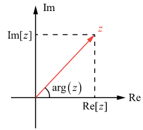
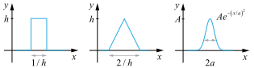
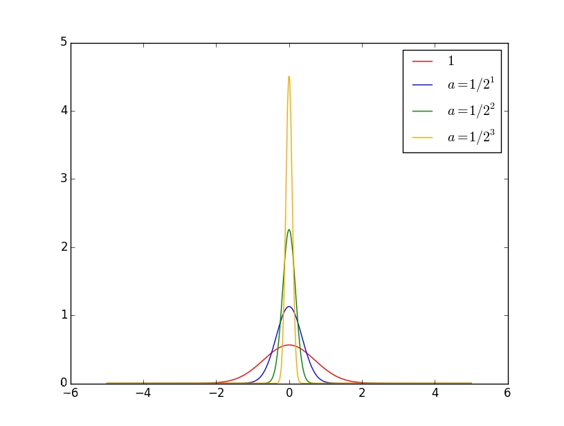
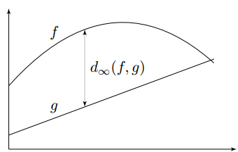

# Math

https://wuli.wiki/online/

https://www.mathsisfun.com/


## 复数/实部/虚部

**复数（complex number）** 是一对满足以下运算的有序实数．令 $z$ 为复数，$x,y$ 为实数，则可以表示为 $z=(x,y)$．其中 $x,y$ 分别被称为复数 $z$ 的**实部（real part）**和**虚部（imaginary part）**，可以记为 $Re[z]$ 和 $Im[z]$．特殊地，我们把复数 $(0,1)$ 称为**虚数单位**，用 $i$ 表示．最后我们定义虚部为零的复数 $(x,0)$ 就是实数 $x$ 本身．把所有复数的集合记为 $C$，那么全体实数的集合 $R$ 就是它的一个子真子集，即 $R⊂C$

定义两个复数的加法为实部和虚部分别相加 <span id="eq1"></span>
$$
\begin{equation}
(x_1, y_1) + (x_2, y_2) = (x_1+ x_2, y_1 + y_2)
\end{equation}\tag{1}
$$
定义复数和实数 $s$ 相乘为（满足交换律）<span id="eq2"></span>
$$
\begin{equation}
s(x, y) = (x, y)s = (sx, sy)
\end{equation}\tag{2}
$$
 可见任意一个复数可以表示为一个加法和一个乘法：$(x,y)=(x,0)+y(0,1)$，即熟悉的
$$
z=x+iy
$$

---

### 复平面



由此可以看到，复数跟二维平面上的**几何矢量**是十分相似的．如图 1，一个**复数**可以看做**复平面**上的一个**点**（或矢量），该矢量在复平面的**实轴**和**虚轴**方向的分量分别等于其实部和虚部．复数的**模**定义为对应矢量的模，即
$$
\begin{equation}
 \left\lvert z \right\rvert  = \sqrt{ \operatorname{Re} [z]^2 +  \operatorname{Im} [z]^2}
\end{equation}
$$
另外我们把矢量与实轴的夹角称为**幅角**．我们可以通过 Arctan 函数计算幅角
$$
\begin{equation}
\arg(z) =  \operatorname{Arctan} ( \operatorname{Im} [z],  \operatorname{Re} [z])
\qquad (\arg z \in (-\pi, \pi])
\end{equation}
$$
也可以通过模和幅角来计算实部与虚部
$$
\begin{equation}
 \operatorname{Re} [z] =  \left\lvert z \right\rvert  \cos\left(\arg z\right)  \qquad  \operatorname{Im} [z] =  \left\lvert z \right\rvert  \sin\left(\arg z\right) 
\end{equation}
$$
在 “指数函数（复数），任意复数也可以通过欧拉公式表示为以下形式
$$
\begin{equation}
z = A(\cos\theta +  \mathrm{i} \sin\theta) = A \mathrm{e} ^{ \mathrm{i} \theta}
\end{equation}
$$
其中 $\theta = \arg z$，$A =  \left\lvert z \right\rvert$


---

### 基本运算

**共轭**

 一个复数的共轭等于与其实部相同，虚部相反的复数
$$
\begin{equation}
z ^*  =  \operatorname{Re} [z] -  \mathrm{i} \,  \operatorname{Im} [z]
\end{equation}
$$
所以共轭运算**不改变复数的模**，但将其**幅角变为相反数**．在复平面上，这相当于把一个点关于 $x$ 轴取**镜像对称**．


**加和减**

[式 1](#eq1) 中已经定义了加法. 与实数相同，定义减法为 $z_1 - z_2 = z_1 + (-z_2)$，有
$$
\begin{equation}
(x_1 +  \mathrm{i}  y_1) \pm (x_2 +  \mathrm{i}  y_2) = (x_1 \pm x_2) +  \mathrm{i}  (y_1 \pm y_2)
\end{equation}
$$
在复平面上，这相当于把两个复数对应的矢量进行矢量相加减. 显然，复数的加法满足**交换律**，**分配律**，**结合律**。

特殊地，将一个复数与其复共轭加减可得其实部和虚部<span id="eq10"></span>
$$
\begin{equation}
 \operatorname{Re} [z] = \frac12 (z + z ^* ) \qquad
 \operatorname{Im} [z] = \frac12 (z - z ^* )
\end{equation}\tag{10}
$$


**乘法**

两个复数相乘定义为（注意 [式 2](#eq2)  是该定义的一种特殊情况）

$$
\begin{equation}
z_1z_2 = (x_1 +  \mathrm{i}  y_1)(x_2 +  \mathrm{i}  y_2) = (x_1 x_2 - y_1 y_2) +  \mathrm{i}  (x_1 y_2 + x_2 y_1)
\end{equation}
$$
可以证明，乘积的模等于两复数模之积，乘积的幅角等于两复数的幅角之和，即
$$
\begin{equation}
 \left\lvert z_1 z_2 \right\rvert  =  \left\lvert z_1 \right\rvert  \left\lvert z_2 \right\rvert 
\end{equation}
$$

$$
\begin{equation}
\arg(z_1 z_2) = \arg(z_1) + \arg(z_2)
\end{equation}
$$

证明：令 $\theta_i = \arg z_i$，则

$$
\begin{equation} \begin{aligned}
z_1 z_2 &= (A_1 \cos\theta_1 +  \mathrm{i}  A_1 \sin\theta_1)(A_2 \cos\theta_2 +  \mathrm{i}  A_2 \sin\theta_2)\\
&= A_1 A_2 (\cos\theta_1\cos\theta_2 - \sin\theta_1\sin\theta_2) +  \mathrm{i}  A_1 A_2 (\cos\theta_1\sin\theta_2 + \cos\theta_2\sin\theta_1)\\
&= A_1 A_2 [ \cos\left(\theta_1 + \theta_2\right)  +  \mathrm{i}   \sin\left(\theta_1 + \theta_2\right) ]
\end{aligned} \end{equation}
$$
其中最后一步用到了两角和公式．容易看出，最后得到的是一个模为 $A_1A_2$ 的复数．证毕．

不难证明复数的乘法满足**交换律**和**结合律**．容易证明，一个复数模的平方可以用它和复共轭的乘积表示．<span id="eq15"></span>

$$
\begin{equation}
x^2 + y^2 =  \left\lvert z \right\rvert ^2 = z z ^* 
\end{equation}\tag{15}
$$


**除法**

和实数一样，复数的除法定义为乘法的逆运算．令 $z_1 = z z_2$（$z_2≠0$），则两个复数相除可以记为

$$
\begin{equation}
z = \frac{z_1}{z_2} = \frac{x_1 +  \mathrm{i}  y_1}{x_2 +  \mathrm{i}  y_2}
\end{equation}
$$
但我们希望可以将结果的实部与虚部分开，于是我们可以对 $z_1$，$z_2$ 同时乘以 $z_2^{*}$，即 $z_1z_2^{*} = zz_2z_2^{*}$，或

$$
\begin{equation}
z = \frac{z_1 z_2 ^* }{z_2 z_2 ^* }
= \frac{(x_1 +  \mathrm{i}  y_1)(x_2 -  \mathrm{i}  y_2)}{(x_2 +  \mathrm{i}  y_2)(x_2 -  \mathrm{i}  y_2)}
= \frac{x_1 x_2 + y_1 y_2}{x_2^2 + y_2^2} +  \mathrm{i}  \frac{x_2 y_1 - x_1 y_2}{x_2^2 + y_2^2}
\end{equation}
$$
这个步骤叫做**分母有理化**

与乘法同理，两个复数相除相当于把它们的模相除，幅角相减，即

$$
\begin{equation}
 \left\lvert z_1/z_2 \right\rvert  =  \left\lvert z_1 \right\rvert / \left\lvert z_2 \right\rvert 
\end{equation}
$$

$$
\begin{equation}
\arg(z_1/z_2) = \arg(z_1) - \arg(z_2)
\end{equation}
$$


### 定理 1<span id="the1"></span>

两个复数进行任意次加减乘除后**再**取共轭，等于它们分别取共轭后**再**进行运算．

根据定义易证．例如
$$
\begin{equation}
\frac{2 z_1 z_2}{(z_3 + z_4)^2} = \frac{2 z_1^* z_2^*}{(z_3^* + z_4^*)^2}
\end{equation}
$$
根据[式 15](#eq15)，[式 10](#eq10) 和 [定理 1](#the1) 易得
$$
\begin{equation}
\begin{aligned}
 \left\lvert z_1 + z_2 \right\rvert ^2 &=  \left\lvert z_1 \right\rvert ^2 +  \left\lvert z_2 \right\rvert ^2 + z_1^* z_2 + z_2^* z_1\\
&=  \left\lvert z_1 \right\rvert ^2 +  \left\lvert z_2 \right\rvert ^2 + 2 \operatorname{Re} [z_1^* z_2]
\end{aligned}
\end{equation}
$$
在复平面中，该式可以表示余弦定理，即计算两矢量之和的模．

---

## 矩阵

### 秩

$$
\begin{equation}
 \left\{\begin{array}{l}x_{1}-x_{2}+x_{3}=5 \\ x_{1}+x_{2}+x_{3}=7 \\ 2 x_{1}-2 x_{2}+2 x_{3}=14\end{array}\right\} 
\end{equation}
$$

对上面的线性方程组，第一个方程和第二个方程有不同的解，而第2个方程和第3个方程的解完全相同。从这个意义上说，第3个方程是"多余"的，因为它没有带来任何的信息量，把它去掉，所得的方程组与原来的方程组同解。**为了从方程组中去掉多余的方程，自然就导出了"矩阵的秩"这一概念**。

还记得我们怎么手工求矩阵的秩吗？为了求矩阵A的秩，我们是通过矩阵**初等变换**把A化为**阶梯型矩阵**，若该阶梯型矩阵有**r个非零行**，那**A的秩rank(A)就等于r**。从物理意义上讲，矩阵的**秩度量**的就是**矩阵的行列之间的相关性**。如果矩阵的各行或列是**线性无关**的，矩阵就是**满秩**的，也就是秩等于行数。回到上面线性方程组来说吧，因为线性方程组可以用矩阵描述嘛。秩就表示了有多少个有用的方程了。上面的方程组有3个方程，实际上只有2个是有用的，一个是多余的，所以对应的矩阵的秩就是2了。

既然秩可以度量相关性，而矩阵的相关性实际上有带有了矩阵的结构信息。如果矩阵之间各行的**相关性很强**，那么就**表示这个矩阵实际可以投影到更低维的线性子空间**，也就是用几个向量就可以完全表达了，它就是**低秩**的。所以我们总结的一点就是：如果矩阵表达的是结构性信息，例如图像、用户-推荐表等等，那么这个矩阵各行之间存在这一定的相关性，那这个矩阵一般就是低秩的。


-----

### 特征值/特征向量

设 $A$ 是 $n$ 阶方阵，如果存在常数 $λ$ 和非零 $n$ 维列向量 $x$，使得 $Ax= λx$ 成立，则称 $\lambda$ 是 $A$ 的一个**特征值**（characteristic value)或本征值（eigenvalue)。非零 $n$ 维列向量 $x$ 称为矩阵 $A$ 的属于（对应于）特征值 $\lambda$ 的**特征向量**或本征向量，简称 $A$ 的特征向量或 $A$ 的本征向量。

$A$ 的所有特征值的全体，叫做 $A$ 的谱，记为 $\lambda(A)$.


---

### 迹

在线性代数中，一个 $n×n$ 矩阵 $A$ 的主对角线上各个元素的总和被称为矩阵A的迹，一般记作 $tr(A)$。
$$
\begin{equation}
 \operatorname{tr} A=\sum_{i=1}^{n} a_{i i} 
\end{equation}
$$


----

### 单位矩阵

在矩阵的乘法中，有一种矩阵起着特殊的作用，如同数的乘法中的1，这种矩阵被称为单位矩阵。它是个方阵，从左上角到右下角的对角线（称为**主对角线**）上的元素均为1。除此以外全都为0。
$$
\begin{equation}
 \left(\begin{array}{lll}1 & 0 & 0 \\ 0 & 1 & 0 \\ 0 & 0 & 1\end{array}\right) 
\end{equation}
$$


---

### 正定矩阵

**positive definite, PD**

https://zhuanlan.zhihu.com/p/81169491

https://zhuanlan.zhihu.com/p/44860862

---

### 半正定矩阵

**positive semi-definite, PSD**


---

### 托普利兹矩阵

简称为**T型矩阵**。托普利兹矩阵的**主对角线上的元素相等**，**平行于主对角线的线上的元素也相等**；矩阵中的各元素**关于次对角线对称**，即T型矩阵为次对称矩阵。

简单的T形矩阵包括前向位移矩阵和后向位移矩阵。

设 $ T=\left[t_{i j}\right] \in C^{n \times n} $，如果 $ t_{i j}=t_{j-i}(i, j=1,2, \ldots, n) $，即：
$$
\begin{equation}
 T=\left(\begin{array}{ccccc}t_{0} & t_{1} & t_{2} & \cdots & t_{n-1} \\ t_{-1} & t_{0} & t_{1} & \cdots & t_{n-2} \\ t_{-2} & t_{-1} & t_{0} & \cdots & t_{n-3} \\ \vdots & \vdots & \vdots & \ddots & \vdots \\ t_{-n+1} & t_{-n+2} & t_{-n+3} & \cdots & t_{0}\end{array}\right) 
\end{equation}
$$
则称 $T$ 为托普利兹矩阵（Toeplitz matrix）。


---

### 循环矩阵

循环矩阵是一种**特殊形式的 Toeplitz 矩阵**，它的行向量的每个元素都是前一个行向量各元素依次**右移**一个位置得到的结果。
$$
\begin{equation}
 C=\left[\begin{array}{ccccc}c_0 & c_{n-1} & \ldots & c_2 & c_1 \\ c_{1} & c_{0} & c_{n-4} & \ldots & c_{2} \\ \vdots & \vdots & \ddots & \vdots & \vdots \\ c_{n-2} & c_{n-1} & \ldots & c_{0} & c_{n-1} \\ c_{n-1} & c_{n-2} & \ldots & c_{1} & c_{0}\end{array}\right] 
\end{equation}
$$
形式如上的矩阵 $C$ 就是**循环矩阵**。可以用**离散傅立叶变换**快速解循环矩阵。


---

## Domain/Codomain/Range

domain: 定义域  

codomain: 取值空间

range: 值域


设 $G$ 是从 $X$ 到 $Y$ 的关系，$G$ 的定义域 $D(G)$ 为 $X$，且对**任何** $x∈X$ 都有**惟一**的 $y∈Y$ 满足 $G(x，y)$，则称 $G$ 为从 $X$ 到 $Y$ 的**映射**。

关系 $G$ 常使用另一些记号：$f: X→Y$ 等， $f$ 与 $G$ 的关系是 $y=f(x)(x∈X)$，当且仅当 $G(x，y)$ 成立，可取**变域** $X$ 中的不同元素为值的变元称为自变元或**自变量**，同样可取**变域** $Y$ 中的不同元素为值的变元称为因变元或**因变量**。

始集 $X$ 称为映射 $f$ 的**定义域**，记为 $D(f)$ 或 $dom(f)$；终集 $Y$ 称为映射的**陪域**，记为 $C(f)$ 或 $codom(f)$ ；$Y$ 中与 $X$ 中的元素有关系 $G$ 的元素的组合 $\{y|\exist x(x∈X∧y=f(x)∈Y)\}$称为映射的**值域**，记为 $R(f)$ 或$ran(f)$；


当 $y=f(x)$ 时，$y$ 称为 $x$ 的象，而 $x$ 称为 $y$ 的原象，$y$ 的所有原象所成之集用 $f^{-1}(y)$ 表示；

对于 $A⊆X$，所有 $A$ 中元素的象的集合 ${y|\exist x(x∈A∧y=f(x)∈Y)}$ 或 ${f(x)|x∈A}$ 称为 $A$ 的**象**，记为$f(A)$ ；

对于 $B⊆Y$ ，所有 $B$ 中元素的原象的集合 ${x|x∈X∧∃y(y∈B∧y=f(x))}$ 称为 $B$ 的**原象**，记为 $f^{-1}(B)$。


---

## injective/surjective/bijective

数学上，单射、满射和双射指根据其**定义域**和**陪域**的关联方式所区分的三类函数。<span id="injective"></span>

**单射**：指将不同的变量映射到不同的值的函数。

**满射**：指**陪域等于值域**的函数， 即：对陪域中任意元素，都存在至少一个定义域中的元素与之对应。

**双射**（也称一一对应）：既是单射又是满射的函数。直观地说，一个双射函数形成一个对应，并且每一个输入值都有正好一个输出值以及每一个输出值都有正好一个输入值。


www.mathsisfun.com


**General Function**：普通的函数 可以多对一，但是不能一对多 

- one-to-many is not OK 
- many-to-one is OK

**Injective**：单射，没有多个输入 A 对同一个输出 B。 

- one-to-many is not OK 
- many-to-one is not OK
- **One-to-One**

**Surjective**：满射，每个输出 B 都至少有一个输出 A 与之匹配 也叫做 ”Onto“

- 陪域等于值域

**Bijective**：双射，同时满足单射及满射的函数

- **one-to-one correspondence**

perfect pairing，双射函数有逆！


## Inverse Function

https://www.mathsisfun.com/sets/function-inverse.html

满足以下性质
$$
\begin{equation}
 f\left(f^{-1}(x)\right)=x 
\end{equation}
$$

$$
\begin{equation}
 f^{-1}(f(x))=x 
\end{equation}
$$

函数不可逆怎么处理，**限制定义域**
$$
x^2 → \left\{x^{2} \mid x \geq 0\right\} 
$$
下边是一个例子


上图函数不可逆


限制定义域


函数可逆


**No Inverse**

凸函数有最小值，可以被优化算法求解


**Inverse**


Bijective function


---

## Jacobian

​	现在有一个函数 $f$ ，其输入是一个二维向量 $z$ ，输出是一个二维向量 $x$
$$
\begin{aligned}
z =\left[\begin{array}{l}
z_{1} \\
z_{2}
\end{array}\right] \quad x=\left[\begin{array}{l}
x_{1} \\
x_{2}
\end{array}\right] 
\end{aligned}
$$

$$
x = f(z)
$$

​	函数 $f$ 的雅克比矩阵 $J_f$ 就是把所有输入和输出都做偏微分；其雅克比矩阵 $J_f$ 的逆 $J_{f^{-1}}$ 如下<span id="jf"></span>


$$
J_{f} =\left[\begin{array}{ll}
\partial x_{1} / \partial z_{1} & \partial x_{1} / \partial z_{2} \\
\partial x_{2} / \partial z_{1} & \partial x_{2} / \partial z_{2}
\end{array}\right]
$$

$$
J_{f^{-1}}=\left[\begin{array}{ll}
\partial z_{1} / \partial x_{1} & \partial z_{1} / \partial x_{2} \\
\partial z_{2} / \partial x_{1} & \partial z_{2} / \partial x_{2}
\end{array}\right]
$$

​	其中 $J_f$ 与 $J_{f^{-1}}$ 相乘结果为单位矩阵 $J_{f} J_{f^{-1}}=I$	

​	假设现有输入输出为<span id="eq1"></span>
$$
\begin{array}{c}
{\left[\begin{array}{c}
z_{1}+z_{2} \\
2 z_{1}
\end{array}\right]=f\left(\left[\begin{array}{c}
z_{1} \\
z_{2}
\end{array}\right]\right)}
\end{array} \tag{1}
$$
​	其 $J_f$ 为 $J_{f} =\left[\begin{array}{ll}1 & 1 \\
2 & 0
\end{array}\right]$

​	**[Eq. 1](#eq1)** 的逆为
$$
\left[\begin{array}{c}
x_{2} / 2 \\
x_{1}-x_{2} / 2
\end{array}\right]=f^{-1}\left(\left[\begin{array}{c}
x_{1} \\
x_{2}
\end{array}\right]\right)
$$
​	其 $J_{f^{-1}}$ 为 $ J_{f^{-1}}=\left[\begin{array}{ll}0 & 1/2 \\1 & -1/2
\end{array}\right]$
$$
J_{f} J_{f^{-1}}= \left(\begin{array}{lll}1 & 0 \\ 0 & 1 \end{array}\right)
$$
​	如果函数 $f$ 可逆，则其雅克比矩阵 $J_f$ 与其逆函数 $f^{-1}$ 的雅克比矩阵 $J_{f^{-1}}$  互逆即<span id="eq2"></span>
$$
J_f^{-1} = J_{f^{-1}} \tag{2}
$$

---

## Determinant

​	方阵的行列式是提供有关矩阵信息的 **scalar** 标量。

- 2X2

$$
\begin{array}{c}
A=\left[\begin{array}{ll}
a & b\\
c & d
\end{array}\right] \\
\operatorname{det}(A)=a d-b c
\end{array}
$$

​	2维中A的Determinant意义是面积


- 3X3

$$
\begin{aligned}
A =&\left[\begin{array}{lll}
a_{1} & a_{2} & a_{3} \\
a_{4} & a_{5} & a_{6} \\
a_{7} & a_{8} & a_{9}
\end{array}\right] \\
\operatorname{det}(A) =& 
a_{1} a_{5} a_{9}+a_{2} a_{6} a_{7}+a_{3} a_{4} a_{8} \\
&-a_{3} a_{5} a_{7}-a_{2} a_{4} a_{9}-a_{1} a_{6} a_{8}
\end{aligned}
$$

​	3维中A的Determinant意义是体积


​	根据**[Eq. 2](#eq2)**推断有以下倒数性质：<span id="eq3"></span>
$$
\color{#FF3030}\begin{array}{l}
\operatorname{det}(\mathrm{A})=1 / \operatorname{det}\left(A^{-1}\right) \\
\operatorname{det}\left(J_{f}\right)=1 / \operatorname{det}\left(J_{f^{-1}}\right)
\end{array} \tag{3}
$$

---

## Change of Variable Theorem<span id="cvt"></span>

​	假设有分布 $\pi(z)$ ,通过函数 $f$ 生成的 $x$ 也形成了一个分布 $p(x)$


​	Input的z上有$z^{'}$, $x^{'}=f(z^{'})$ , 寻找 $z^{'}，x^{'}$ 的关系，也就是 $\pi(z^{'})$ 和 $p(x^{'})$ 的关系。


​	假设有均匀分布 $\pi(z)$ ，其中$ z \in (0,1)$ ，有$\int \pi(z) d z=1$


​	假设有函数 $f$ 为 
$$
x=f(z)=2z+1
$$
​	则有均匀分布 $p(x)$ ，其中$ x \in (1,3)$ ，也有有$\int p(x) d x=1$


​	底变为原来1的两倍2，则高变为原来1的一半1/2，那么两个分布之间的关系如下式子
$$
p\left(x^{\prime}\right)=\frac{1}{2} \pi\left(z^{\prime}\right)
$$

------

### 1D Example

​	现有不常规的概率分布 $\pi(z)$ 通过函数变换后变成了另一种概率分布 $p(x)$   


​	通过 $x=f(z)$ ，如何寻找 $z$ 的概率密度/分布 $\pi(z)$ 和 $x$ 的概率密度 $p(x)$ 之间的关系?


​	现在假设把 $z^{\prime}$ 移动到 $z^{\prime} + \Delta{z}$ ，这一范围内的概率密度被拉宽到 $(x^{\prime},x^{\prime}+\Delta{x})$ 的范围：


​	假设 $\Delta{z} \rightarrow 0$ ， $(z^{\prime},z^{\prime}+\Delta{z})$ 范围内的概率密度可以近似看成均匀的，假设 $(x^{\prime},x^{\prime}+\Delta{x})$ 范围内的概率密度也是均匀的


​	也就是蓝色方块面积被拉宽到绿色方块，因此两块面积相同
$$
p\left(x^{\prime}\right) \Delta x=\pi\left(z^{\prime}\right) \Delta z
$$
​	方程两边同时除以 $\Delta{x}$ 得:
$$
p\left(x^{\prime}\right)=\pi\left(z^{\prime}\right) \frac{\Delta z}{\Delta x}
$$
​	$\Delta{z} \rightarrow 0 ,\Delta{x} \rightarrow 0 $进一步可以处理为：
$$
\begin{array}{l}
 \\
p\left(x^{\prime}\right)=\pi\left(z^{\prime}\right)\left|\frac{d z}{d x}\right|
\end{array}
$$
​	即 z 对 x 的微分，如果知道函数 $f$ 的逆，就可以算 z 对 x 的微分。加绝对值的原因如下图:


​	

------

### 2D Example

​	现在 $z$ 和 $x$ 都是二维向量，同样的有转换函数 $x = f(z)$ ，如何寻找 $z$ 的概率密度 $\pi(z)$ 和 $x$ 的概率密度 $p(x)$ 之间的关系?

​	假设蓝色正方形的分布为 $\pi(z^{\prime})$ ，宽为 $\Delta{z_1}$ 高为 $\Delta{z_2}$，通过 $f$ 后，蓝色正方形变为绿色的菱形 


​	上图中 $\color{#FF3030}\Delta{x_{11}}$ 是 $z_1$ 改变时 $x_1$ 的改变量， $\color{#FF3030}\Delta{x_{21}}$ 是 $z_1$ 改变时 $x_2$ 的改变量

​				 $\color{#FF3030}\Delta{x_{12}}$ 是 $z_2$ 改变时 $x_1$ 的改变量， $\color{#FF3030}\Delta{x_{22}}$ 是 $z_2$ 改变时 $x_2$ 的改变量。

​	蓝色方块面积与 $\pi(z^{\prime})$ 相乘=绿色菱形面积与 $p(x^{\prime})$ 相乘，有下式
$$
p\left(x^{\prime}\right)\left|\operatorname{det}\left[\begin{array}{ll}
\Delta x_{11} & \Delta x_{21} \\
\Delta x_{12} & \Delta x_{22}
\end{array}\right]\right|=\pi\left(z^{\prime}\right) \Delta z_{1} \Delta z_{2}
$$
​	移项:
$$
p\left(x^{\prime}\right)\left|\frac{1}{\Delta z_{1} \Delta z_{2}} \operatorname{det}\left[\begin{array}{cc}
\Delta x_{11} & \Delta x_{21} \\
\Delta x_{12} & \Delta x_{22}
\end{array}\right]\right|=\pi\left(z^{\prime}\right)
$$
​	把 $\frac{1}{\Delta z_{1} \Delta z_{2}}$ 放到 Det 里:
$$
p\left(x^{\prime}\right)\left|\operatorname{det}\left[\begin{array}{cc}
\Delta x_{11} / \Delta z_{1} & \Delta x_{21} / \Delta z_{1} \\
\Delta x_{12} / \Delta z_{2} & \Delta x_{22} / \Delta z_{2}
\end{array}\right]\right|=\pi\left(z^{\prime}\right)
$$
​	其中 $\Delta x_{11} / \Delta z_{1}$ 等价于 $\partial x_{1} / \partial z_{1}$ ； $\Delta x_{21} / \Delta z_{1}$ 等价于 $\partial x_{2} / \partial z_{1}$ 。则有:
$$
p\left(x^{\prime}\right)\left|\operatorname{det}\left[\begin{array}{cc}
\partial x_{1} / \partial z_{1} & \partial x_{2} / \partial z_{1} \\
\partial x_{1} / \partial z_{2} & \partial x_{2} / \partial z_{2}
\end{array}\right]\right|=\pi\left(z^{\prime}\right)
$$
​	把内部矩阵转置，不会改变其行列式:
$$
p\left(x^{\prime}\right)\left|\operatorname{det}\left[\begin{array}{cc}
\partial x_{1} / \partial z_{1} & \partial x_{1} / \partial z_{2} \\
\partial x_{2} / \partial z_{1} & \partial x_{2} / \partial z_{2}
\end{array}\right]\right|=\pi\left(z^{\prime}\right)
$$
​	则转置后的内部矩阵为 [$J_{f}$](#jf) :
$$
\color{#FF3030}p\left(x^{\prime}\right)\left|\operatorname{det}\left(J_{f}\right)\right|=\pi\left(z^{\prime}\right)
$$

$$
p\left(x^{\prime}\right)=\pi\left(z^{\prime}\right)\left|\frac{1}{\operatorname{det}\left(J_{f}\right)}\right|\\
$$

​	利用**[Eq. 3](#eq3)**的性质转换:
$$
\color{#FF3030}p\left(x^{\prime}\right)=\pi\left(z^{\prime}\right)\left|\operatorname{det}\left(J_{f^{-1}}\right)\right|
$$
​	其中 z 是输入（潜在向量），x 是输出，x = f(z)


### 生成 Example

给定一个观测数据变量 $x\in X$，一个潜在变量 $z\in Z$ ，服从一个简单先验概率分布 $p_Z$ 以及一个双射 $ f: X \rightarrow Z $（ $g = f^{-1}:Z\rightarrow X$），变量公式的变化定义了一个模型分布在 $X$ 上

双射 $Z = f(X)$，$Z = g(X)$，$f = g^{-1}$
$$
\begin{equation}
 \begin{aligned} p_{X}(x) &=p_{Z}(f(x))\left|\operatorname{det}\left(\frac{\partial f(x)}{\partial x^{T}}\right)\right|  \\ 
 \log \left(p_{X}(x)\right) &=\log \left(p_{Z}(f(x))\right)+\log \left(\left|\operatorname{det}\left(\frac{\partial f(x)}{\partial x^{T}}\right)\right|\right) \end{aligned} 
\end{equation}
$$
$\frac{\delta f(x)}{\delta x^T}$ 是 $f$ 在 $x$ 处的雅可比行列式。


----

## 狄拉克分布

https://wuli.wiki/online/Delta.html

**Dirac delta function**

在物理中我们经常会遇到一些模型，如质点和点电荷等，这类模型使用了极限的思想（如令体积趋于无穷小）

$δ(x)$ 并不是数学中一个严格意义上的函数，而是在泛函分析中被称为广义函数（generalized function）或分布（distribution）



**Fig. 1**

我们来考虑一个函数（左图），其表示的函数如下，$x_0$ 即为长方形宽的中点。
$$
\begin{equation}
f_h(x) =
\begin{cases}
h &  \left( \left\lvert x - x_0 \right\rvert  \leqslant \frac{1}{2h} \right) \\
0 &  \left( \left\lvert x - x_0 \right\rvert  > \frac{1}{2h} \right) 
\end{cases}
\end{equation}\tag{1}
$$
其中 $h$ , $x_0$ 是常数．由函数图像易得函数曲线下面的面积为 $\int_{-\infty}^{+\infty} f_h(x)  \,\mathrm{d}{x}  = 1$．现在我们令 $h \to \infty$，长方形的高将趋于无穷大，宽将趋于零，而**定积分结果不变**．这里就如同 [Change of Variable Theorem](#cvt) 的思想

这样，上面的 $f_h(x)$ 就可以表示为 $\delta(x - x_0)$．当然，我们还可以选取其他含有参数的 $f(x)$  来逼近 $δ$  函数，如图中的另外两种情况(最右为高斯分布)．



**Fig. 2** 高斯分布函数 a 趋近于0的序列图像


### 定义

把 $δ$ 函数看作是满足一定条件的**函数序列**，即无穷个函数按一定顺序排列．

> **定义1** 狄拉克 $δ$ 函数
>
> 令 $\delta_1(x), \delta_2(x), \dots$ 为一个**连续实函数的序列**．若 $\delta_n(x)$ 满足以下两个条件，那么我们把该函数列称为狄拉克 $δ$ 函数（列）：
> $$
> \begin{equation}
> \lim_{n\to\infty}\int_{-\infty}^{+\infty} \delta_n(x)  \,\mathrm{d}{x}  = 1
> \end{equation}\tag{2}
> $$
> 对任意给定的不包含 0 的区间 $(a,b)$ ($a,b \ne 0$，可取 $\pm\infty$)，有
> $$
> \begin{equation}
> \lim_{n\to\infty} \int_{a}^{b} \delta_n(x)  \,\mathrm{d}{x}  = 0
> \end{equation}\tag{3}
> $$

事实上，教材上常使用以下定义 2，但笔者认为这两种定义是等价的，且前者更容易理解(定义 1 是定义 2 的必要条件，只需要令定义 2 中的 $f(x) = 1$ 证明式 2 ；再令 $f(x)$ 在区间 $(a,b)$ 为 1，否则为 0，证明式 3）

> **定义 2**　狄拉克 $δ$ 函数 2
>
> 令 $\delta_1(x), \delta_2(x), \dots$ 为一个**连续实函数的序列**．若 $\delta_n(x)$ 满足以下条件，那么我们把该函数列称为狄拉克 $δ$ 函数（列）：
>
> 　　 对所有性质良好（例如在 $x=0$ 连续）的 $f(x)$，都有
> $$
> \begin{equation}
> \lim_{n\to\infty}\int_{-\infty}^{+\infty} \delta_n(x)f(x)  \,\mathrm{d}{x}  = f(0)
> \end{equation}\tag{4}
> $$


 一些物理教材会把 $\delta(x)$  的性质简单记为
$$
\begin{equation}
\delta(x) =
\begin{cases}
+\infty & (x = 0)\\
0 & (x \ne 0)
\end{cases}
\end{equation}\tag{5}
$$

$$
\begin{equation}
\int_{-\infty}^{+\infty} \delta(x)  \,\mathrm{d}{x}  = 1
\end{equation}\tag{6}
$$

$\delta(x)$ **不是函数，更不可积**，$x \ne 0$ 时极限 $\lim_{n\to \infty}\delta_n(x)$ 也未必存在．


### 常见性质

**性质1**

 若一个等式中出现了所谓的 $\delta$ 函数 $\delta(x)$，那么其严格的定义是先将 $\delta(x)$ 替换为符合[定义 1](https://wuli.wiki/online/Delta.html#def1)的任意函数列 $\delta_n(x)$，令**等式在 $n\to\infty$ 的极限时成立**．

　　 例如  $\delta(x)$ 一个重要的性质是：对任意在 $x = x_0$ 处连续函数 $f(x)$，有
$$
\begin{equation}
\int_{-\infty}^{+\infty} f(x) \delta(x - x_0)  \,\mathrm{d}{x} = f(x_0)
\end{equation}\tag{10}
$$
使用[定义 1](https://wuli.wiki/online/Delta.html#def1) 表示，该等式的严格意义是（注意极限和积分不可交换，且极限必须在最外面）
$$
\begin{equation}
\lim_{n\to\infty}\int_{-\infty}^{+\infty} f(x) \delta_n(x - x_0)  \,\mathrm{d}{x} = f(x_0)
\end{equation}
$$
由于我们假设[定义 1](https://wuli.wiki/online/Delta.html#def1)和[定义 2](https://wuli.wiki/online/Delta.html#def2)等效，这是成立的．


---

## 高斯分布

高斯分布函数为
$$
\begin{equation}
f(x) = \frac{1}{\sigma \sqrt{2\pi }} \exp \left[-\frac{(x - \mu )^2}{2\sigma ^2} \right] 
\end{equation}\tag{1}
$$
其中 $μ$ 是分布的的平均值，$σ$ 是标准差．满足归一化条件  
$$
\begin{equation}
\int_{-\infty}^{\infty} f(x)  \,\mathrm{d}{x}  = 1
\end{equation}\tag{2}
$$


**高斯分布（Gaussian Distribution）**又叫**正态分布（Normal Distribution）**，具有如下形式
$$
\begin{equation}
f(x) = A\exp \left[-\lambda (x - x_0)^2 \right] 
\end{equation}\tag{3}
$$
可见其主要特征就是指数函数中含有 $\Delta x^2$ 项．由对称性，分布函数是关于 $x =x_0$ 的偶函数，所以平均值显然为 $\mu = x_0$．首先我们补充两个积分，由换元积分法（$x=\sqrt{t}$）以及 $Γ$ 函数的性质得
$$
\begin{equation}
\int_{-\infty }^{+\infty }  \exp\left(-x^2\right)  \,\mathrm{d}{x}   = \int_0^{+\infty} t^{-1/2} \mathrm{e} ^{ - t}  \,\mathrm{d}{t}   =  \left(-\frac12 \right) ! = \sqrt \pi 
\end{equation}\tag{4}
$$

$$
\begin{equation}
\int_{-\infty}^{+\infty} x^2 \exp\left(-x^2\right)  \,\mathrm{d}{x}   = \int_0^{+\infty} t^{1/2} \mathrm{e} ^{-t}  \,\mathrm{d}{t}   = \frac12 ! = \frac12  \left(-\frac12 \right) ! = \frac{\sqrt\pi}{2}
\end{equation}\tag{5}
$$

根据分布函数的归一化条件，结合[式 4](https://wuli.wiki/online/GausPD.html#eq4)得
$$
\begin{equation}
1 = \int_{-\infty}^{+\infty} f(x)  \,\mathrm{d}{x}   = A\int_{-\infty}^{+\infty} \exp \left[-\lambda (x - x_0)^2 \right]   \,\mathrm{d}{x}   = A\sqrt{\frac{\pi}{\lambda}}
\end{equation}\tag{6}
$$
即 $A = \sqrt{\lambda/\pi}$．再来计算高斯分布的方差，结合[式 5](https://wuli.wiki/online/GausPD.html#eq5)得
$$
\begin{equation}
\sigma ^2 = \int_{-\infty}^{+\infty} (x - x_0)^2 A\exp \left[-\lambda (x - x_0)^2 \right]   \,\mathrm{d}{x}   = \frac{1}{2\lambda}
\end{equation}\tag{7}
$$
用[式 6](https://wuli.wiki/online/GausPD.html#eq6)和[式_7](https://wuli.wiki/online/GausPD.html#eq7)解得 $\lambda = 1/(2\sigma^2)$ 和 $A = 1/(\sigma\sqrt{2\pi})$，代入[式 3](https://wuli.wiki/online/GausPD.html#eq3)可得高斯分布[式 1](https://wuli.wiki/online/GausPD.html#eq1)．


---

## 范数

范数(norm)是数学中的一种基本概念。在泛函分析中，它**定义在赋范线性空间中**，并满足一定的条件，即①非负性；②齐次性；③三角不等式。它常常被用来度量**某个向量空间**（或**矩阵**）**中的每个向量的长度或大小**。

范数是具有“长度”概念的函数。

距离的定义是一个宽泛的概念，只要满足**非负、自反、三角不等式**就可以称之为距离。范数是一种强化了的距离概念，它在定义上比距离多了一条数乘的运算法则。有时候为了便于理解，我们可以把范数当作距离来理解。


这三个条件可以参考度量空间中的[详述](#metric conditon)


### 向量范数

用来表示向量**大小**，指定义的其在度量空间中的大小，而不是简单的实数大小。


下式的 $X$ 为向量

向量的**0-范数**： ${\left\| X \right\|_0}  =\#\left(i \mid x_{i} \neq 0\right) $，表示非0元素的个数

向量的**1-范数**： ${\left\| X \right\|_1} = \sum\limits_{i = 1}^n {\left| {{x_i}} \right|} $; 各个元素的绝对值之和；也称街区距离（city-block）

向量的**2-范数**：${\left\| X \right\|_2} = {\left( {\sum\limits_{i = 1}^n {{x_i}^2} } \right)^{\frac{1}{2}}} = \sqrt {\sum\limits_{i = 1}^n {{x_i}^2} }$；每个元素的平方和再开平方根；Euclid范数，也称欧几里得范数，欧氏距离

向量的**无穷范数**：${\left\| X \right\|_\infty } = \mathop {\max }\limits_{1 \le i \le n} \left| {{x_i}} \right|$，也称棋盘距离（chessboard），切比雪夫距离

向量的**p-范数**：$ \|X\|_{p}=\sqrt[p]{\sum_{i}\left|x_{i}\right|^{p}} $


**例：向量 $X=[2, 3, -5, -7]$ ，求向量的1-范数，2-范数和无穷范数。**

向量的1-范数：各个元素的绝对值之和 ${\left\| X \right\|_1}=2+3+5+7=17$；

向量的2-范数：每个元素的平方和再开平方根 ${\left\| X \right\|_2} = {\left( {{\rm{2}} \times {\rm{2}} + {\rm{3}} \times {\rm{3}} + {\rm{5}} \times {\rm{5}} + {\rm{7}} \times {\rm{7}}} \right)^{\frac{1}{2}}} = 9.3274$；

 向量的无穷范数：

（1）正无穷范数：向量的所有元素的绝对值中最大的；即X的正无穷范数为：7； 

（2）负无穷范数：向量的所有元素的绝对值中最小的；即X的负无穷范数为：2；


向量的**p-范数**：${\left\| X \right\|_p} = {\left( {\sum\limits_{i = 1}^n {{{\left| {{x_i}} \right|}^p}} } \right)^{\frac{1}{p}}}$，其中正整数 $p≥1$，并且有 $\mathop {\lim }\limits_{p \to \infty } {\left\| X \right\|_p} = \mathop {\max }\limits_{1 \le i \le n} \left| {{x_i}} \right|$

向量元素绝对值的 $p$ 次方和的 $\frac{1}{p}$  次幂。 $p$ 和之前的 $q$ 是一个东西，随着 $p$ 越大，等高线图越接近正方形（正无穷范数）；越小，曲线弯曲越接近原点（负无穷范数）

$p$ 的含义是一般化正则项的幂指数，也就是我们常说的2范数，两者在形式上是完全等同的。结合范数的定义，我们可以解释一般化正则项为一种对待求参数 $w$ 的测度，可以用来限制模型不至于过于复杂


---

### 矩阵范数

设：向量，矩阵，例如矩阵 $A$ 为：

A=[2, 3, -5, -7;

​      4, 6,  8, -4;

​      6, -11, -3, 16];

（1）矩阵的**1-范数**（**列模**）：${\left\| A \right\|_1} = \mathop {\max }\limits_{X \ne 0} \frac{{{{\left\| {AX} \right\|}_1}}}{{{{\left\| X \right\|}_1}}} = \mathop {\max }\limits_{1 \le j \le n} \sum\limits_{i = 1}^n {\left| {{a_{ij}}} \right|}$；矩阵的每一列上的元素绝对值先求和，再从中取个最大的，（列和最大）；即矩阵A的1-范数为：27


（2）矩阵的**2-范数**（**谱模**）：$$ \|A\|_{2}=\max _{X \neq 0} \frac{\|A X\|_{2}}{\|X\|_{2}}=\sqrt{\lambda_{\max }\left(A^{*} A\right)}=\sqrt{\max _{1 \leq i \leq n}\left|\lambda_{i}\right|} $$，其中 $ \lambda_{i} $ 为 $ A^{T} A $ 的特征值；矩阵 $ A^{T} A $ 的最大特征值开平方根。（$A^∗$ 为 $A$ 的共轭转置，实数域等同于 $A^T$）


（3）矩阵的**无穷范数**（**行模**）：$ \|A\|_{\infty}=\max _{X \neq 0} \frac{\|A X\|_{\infty}}{\|X\|_{\infty}}=\max _{1 \leq \mathrm{i} \leq n} \sum_{j=1}^{n}\left|a_{i j}\right| $；矩阵的每一行上的元素绝对值先求和，再从中取个最大的，（行和最大，**行和范数**）


（4）矩阵的**核范数**：$\Vert \mathbf A \Vert_{*} =  \sum\limits_{i=1}^n \lambda_i$ ，若 $A$ 矩阵是方阵，$λ_i$ 称为本征值；若不是方阵，称为奇异值，即奇异值/本征值之和。这个范数可以用来低秩表示（因为最小化核范数，相当于最小化矩阵的秩——低秩）；

 


（5）矩阵的**L0范数**：矩阵的**非0元素的个数**，通常用它来表示稀疏，L0范数越小0元素越多，也就越稀疏。

 

（6）矩阵的**L1范数**：矩阵中的**每个元素绝对值之和**，它是L0范数的最优凸近似，因此它也可以近似表示稀疏；称为系数规则算子（Lasso regularization）

 


（7）矩阵的**F范数/L2范数**：$\Vert \mathbf A \Vert_{F} = \sqrt{ \sum\limits_{i=1}^m \sum\limits_{j=1}^n \vert a_{i,j}\vert^2 }$，**矩阵元素绝对值的平方和再开平方**，它的有点在它是一个凸函数，可以求导求解，易于计算；（Ridge regularization）Frobenius范数（希尔伯特-施密特范数，这个称呼只在希尔伯特空间)

 


（8）矩阵的**L21范数**：矩阵先以每一列为单位，求每一列的F范数（也可认为是向量的2范数），然后再将得到的结果求L1范数（也可认为是向量的1范数），很容易看出它是介于L1和L2之间的一种范数


### L0/L1稀疏化

L0和L1都可以实现稀疏化，不过一般选用L1而不用L0，原因包括：

1）L0范数很难优化求解（NP难）；

2）L1是L0的最优凸近似，比L0更容易优化求解。（这一段解释过于数学化，姑且当做结论记住）


稀疏化的好处是是什么？

1）特征选择

实现特征的自动选择，去除无用特征。稀疏化可以去掉这些无用特征，将特征对应的权重置为零。

2）可解释性（interpretability）

例如判断某种病的患病率时，最初有1000个特征，建模后参数经过稀疏化，最终只有5个特征的参数是非零的，那么就可以说影响患病率的主要就是这5个特征。


### L2避免过拟合

L2避免过拟合的原理是：让L2范数的规则项 $\|W\|_2$ 尽可能小，可以使得 $W$ 每个元素都很小，接近于零，但是与 L1不同的是，不会等于0；这样得到的模型抗干扰能力强，参数很小时，**即使样本数据x发生很大的变化，模型预测值y的变化也会很有限**。

L2范数除了避免过拟合问题，还有一个优点是有助于处理 condition number 不好的情况下，矩阵求解困难的问题。condition number 是对系统 ill-condition 程度的一个衡量标准。假设有方程组 $Ax=b$，需要求解 $x$。如果 $A$ 或者 $b$ 发生轻微改变，就会使得 $x$ 的解发生很大变化，那么这个方程组系统就是ill-condition的，反之就是well-condition的。下图为例说明：


第一行是两个原始的方程序系统；第二行对系统的b做出轻微修改，左侧方程组的解发生较大变化，右侧的变化不明显；第三行对系统的A做出轻微修改，同样左侧系统的解发生较大变化，右侧的变化不明显。这说明左侧的系统是ill-condition的，右侧的是well-condition的。

具体到通过训练数据建立的模型中时，ill-condition可以说就是不稳定的，当输入的样本数据发生变化时，预测结果就会不准确。condition number就是用来对系统的ill-condition程度进行衡量的，condition number值小的就是well-condition，反之为ill-condition。如果一个矩阵的condition number在1附近，那么它就是well-conditioned的，如果远大于1，那么它就是ill-conditioned的，如果一个系统是ill-conditioned的。


### 模型空间限制

使用L1,L2范式建立模型时，损失函数可以写成如下形式：

Lasso: $ \min _{w} \frac{1}{n}\|\mathrm{y}-X \mathrm{w}\|^{2}, \quad $ s.t. $ \|\mathrm{w}\|_{1} \leq C $

Ridge: $ \min _{w} \frac{1}{n}\|\mathrm{y}-X \mathrm{w}\|^{2}, \quad $ s.t. $ \|\mathrm{w}\|_{2} \leq C $

可以说成是将模型空间限制在w的某个范围内，如下图所示，在$（w1,w2）$空间上可以画出目标函数的等高线，约束条件则是平面上半径为 $C$ 的一个 norm ball，等高线与 norm ball 首次相交的地方就是最优解。


通过对比可以看出，L1-ball 和 L2-ball 的不同在于 L1 在和每个坐标轴相交的地方都有”角“出现，与目标函数相交的地方也是在角的位置。角的位置就容易产生稀疏性，例如图中的交点处 w1=0。L2 就没有这样的性质，因为没有角，相交的位置有稀疏性的概率就非常低，从直观上解释了为什么 L1 能够产生稀疏性而 L2 就不行。

总结一下就是：L1 范式会趋向于产生较少的特征，在特征选择时很有用；L2 会选择更多特征，但对应权值接近零。


### 核范数秩

核范数 $\|W\|_*$ 是指矩阵奇异值的和，Nuclear Norm。约束 Low-Rank（低秩）。

我们先来回忆下线性代数里面"秩"到底是啥？
$$
\begin{equation}
 \left\{\begin{array}{l}x_{1}-x_{2}+x_{3}=5 \\ x_{1}+x_{2}+x_{3}=7 \\ 2 x_{1}-2 x_{2}+2 x_{3}=14\end{array}\right\} 
\end{equation}
$$
对上面的线性方程组，第一个方程和第二个方程有不同的解，而第2个方程和第3个方程的解完全相同。从这个意义上说，第3个方程是"多余"的，因为它没有带来任何的信息量，把它去掉，所得的方程组与原来的方程组同解。**为了从方程组中去掉多余的方程，自然就导出了"矩阵的秩"这一概念**。

还记得我们怎么手工求矩阵的秩吗？为了求矩阵A的秩，我们是通过矩阵**初等变换**把A化为**阶梯型矩阵**，若该阶梯型矩阵有**r个非零行**，那**A的秩rank(A)就等于r**。从物理意义上讲，矩阵的**秩度量**的就是**矩阵的行列之间的相关性**。如果矩阵的各行或列是**线性无关**的，矩阵就是**满秩**的，也就是秩等于行数。回到上面线性方程组来说吧，因为线性方程组可以用矩阵描述嘛。秩就表示了有多少个有用的方程了。上面的方程组有3个方程，实际上只有2个是有用的，一个是多余的，所以对应的矩阵的秩就是2了。

既然秩可以度量相关性，而矩阵的相关性实际上有带有了矩阵的结构信息。如果矩阵之间各行的**相关性很强**，那么就**表示这个矩阵实际可以投影到更低维的线性子空间**，也就是用几个向量就可以完全表达了，它就是**低秩**的。所以我们总结的一点就是：如果矩阵表达的是结构性信息，例如图像、用户-推荐表等等，那么这个矩阵各行之间存在这一定的相关性，那这个矩阵一般就是低秩的。

如果X是一个m行n列的数值矩阵，rank(X)是X的秩，假如rank (X)远小于m和n，则我们称X是低秩矩阵。低秩矩阵每行或每列都可以用其他的行或列线性表出，可见它包含大量的冗余信息。利用这种冗余信息，可以对缺失数据进行恢复，也可以对数据进行特征提取。

好了，低秩有了，那约束低秩只是约束rank(w)呀，和我们这节的核范数有什么关系呢？他们的关系和L0与L1的关系一样。因为rank()是非凸的，在优化问题里面很难求解，那么就需要寻找它的凸近似来近似它了。$\text{rank}(w)$ 的凸近似就是核范数 $||W||_*$。

**1）矩阵填充(Matrix Completion)**

**2）鲁棒PCA**

**3）背景建模**

**4）变换不变低秩纹理（TILT）**


https://www.cnblogs.com/MengYan-LongYou/p/4050862.html

https://charlesliuyx.github.io/2017/10/03/%E3%80%90%E7%9B%B4%E8%A7%82%E8%AF%A6%E8%A7%A3%E3%80%91%E4%BB%80%E4%B9%88%E6%98%AF%E6%AD%A3%E5%88%99%E5%8C%96/#Why-amp-What-%E6%AD%A3%E5%88%99%E5%8C%96

## 拓扑学

拓扑学是研究**几何图形或空间**在**连续改变形状**后还能**保持不变**的一些性质的学科, 它只考虑物体间的**位置关系**而不考虑它们的形状和大小


换句话说，在某个空间里，物体之间的**位置关系**始终遵循某些**固定的规则**，而这些规则是这个**空间本身赋予**的，和放进这个空间内的物体并没有关系。

因此拓扑学里有一个最基本的概念便是**“拓扑空间”**，而拓扑空间的本质便是集合，且这个集合内的元素（不仅仅是单个的点，还包括这个集合内的子集）之间的位置关系，满足一些公理。


既然是研究**抽象空间内的位置关系**，

- 一种情况就是忽略**距离**在描述这种关系中所发挥的作用，这便是**一般拓扑学**，又称为**点集拓扑学**。我们可以把它理解成一种“极端”，在这种极端下，你不会关心距离的度量，因而往往并不会看到特别多的算术出现，有时甚至会借助图形帮助分析，今后我们将听到的开集、闭集、紧集等概念其实均起源于此分支。
- 另一种极端，便是仅仅关注于“数字”的拓扑，或者说是“实数空间”的拓扑学，因此又名为**“实分析”(Real Analysis)** 或**实变函数论**


**定义了距离（范数）的拓扑空间就是度量空间**


---

## 度量空间

这部分也可以看 泛函基础 [度量空间的定义](#fanhanduliangkongjian)

度量空间(Metric Space)，在数学中是指一个集合，并且该集合中的任意元素之间的**距离是可定义**的。

亦称距离空间。一类特殊的[拓扑空间](https://baike.baidu.com/item/拓扑空间/1498597)。Fréchet将[欧几里得空间](https://baike.baidu.com/item/欧几里得空间/785521)的距离概念抽象化，于1906年定义了度量空间。

欧氏空间是一个特别的度量空间.

度量空间（metric space）是一种具有**度量函数（metric function）**或者叫做**距离函数（distance function）**的集合，此函数定义集合内所有元素间的距离，被称为集合上的metric。

<span id = "metric conditon"></span>

引入度量空间的定义了，对于一个非空集合 G =｛x，y，z···｝里面的任意两个元素组成一对都对应一个实数，这个对应（下边的d跟f一样是一个映射）必须满足几个条件

1，d（x，y）大于等于0 ，d（x，y）=0当且仅当x=y

2，d（x，y）=d（y，x）

3，d（x，y）小于等于d（x，z）+d（z，y）

这就是一个度量空间，非空集合 G 里面的元素可以是空间中的点，可以是人的心灵，可以是任何什么东西，随你喜欢，数学的任务就是把他们抽象出来就可以。那如果我们定义两个数学家心灵的距离就是他们合写论文的数量这是不是度量空间呢？这显然不是，因为这不满足第一条条件，两个数学家合写论文的数量为零时（相同时）不一定他们就是同一个数学家。


> d 是 distance() 函数


**Definition 1.** (X, d) 是一个**度量空间**，如果 X 为一个集合且集合内的**距离方程（或度量）**d在映射关系为： X × X → $ \mathbb{R}_{+} $ 时满足以下性质：

(i) d(x, y) = 0 当且仅当 x = y ;

(ii) d(x, y) = d(y, x) 对于所有 x, y∈ X ;

(iii) d(x, z) ≤ d(x, y) + d(y, z) 。

其中，第三个名为**三角不等式(triangle inequality)**的性质是最为重要的，而这一性质在欧氏空间(Euclidean spaces)下，便是小学知识中的“两点之间线段最短”公理。而欧氏空间下所采用的度量方法则称为欧氏度量(Euclidean metric)或者欧氏距离(Euclidean distance)。当然，如今我们在更为一般的空间下，这一性质可能会以许多其他形式所展现。

最后，我们列举一些今后常用的概念以及度量空间的例子：

- $ \left(\mathbb{R}_{n}, d\right) $ 被称为**欧几里得度量(Euclidean metric)**如果其距离方程 d 满足 $d(x, y) = \sqrt{\sum_{i=1}^{n}\left(x_{i}-y_{i}\right)^{2}} $。
- $ \left(\mathbb{R}_{n}, d\right) $  被称为**“城市网格”(city grid)**或**“曼哈顿”度量("Manhattan" metric)**。如果其距离方程 d满足 $ d(x, y)=\sum_{i=1}^{n}\left|x_{i}-y_{i}\right| $ 
- 如果 $ \left(X, d\right) $ 是度量空间且 $ Y \subset X $，则 $ \left(Y, d_{Y}\right) $ 也为度量空间，其中 $ d_{Y}(x, y)=d(x, y) $ 对于所有 $x, y\in Y$ 。其中 $ \left(Y, d_{Y}\right) $ 或  $ \left(Y, d\right) $  被称为  $ \left(X, d\right) $ 的**度量子空间(metric subspace)**。
- 若 X 为任意集合且距离方程 d 满足：当 $x\neq y$ 时， d(x, y) = 1；当 $x = y$ 时，d(x, y) = 0。则(X, d)被称为**离散度量(discrete metric)**。
- 有这样的空间被称为**函数空间(function spaces)**：度量空间 $ \left(X, d_{\infty}\right) $ 满足 $ X=\{f:[0,1] \rightarrow[0,1]\}$ 且 $ d_{\infty}(f, g)=\sup _{x \in[0,1]}|f(x)-g(x)| $。（其中 $ d_{\infty}$ 通式为 $ d_{\infty}=\max_i|x_i-y_i|$, 此例中使用了上确界的概念，即如果 $ A \subseteq \mathbb{R} $，则 $ \sup A=\min \{s \in \mathbb{R} \cup\{\infty\}  :a \leq s对于所有a \in A \}$。）此例又被称为 **sup metric**或 **uniform metric** 。



从上面函数空间的例子中我们可以看出，集合 $X$ 已不再是我们熟知的“点集”，而是“函数集”。通俗地讲，函数空间内的**函数f与函数g之间距离**d的表达式应当等于**定义域内 |f(x) - g(x)|的最大值**，如上图所示。


### 实数序列的极限与Metric Function

极限是数学分析的基本概念，在数学分析中，实数序列的极限定义如下：

如果 x 是序列 $(x_n)$ 的极限或者说序列 $(x_n)$ 收敛到极限x，需要满足下面的条件：

> 对于每一个实数 $\epsilon >0$, 存在一个自然数 N，使得对于每一个自然数 $n\geq N$, 有 $|x_n-x|<\epsilon$.

记作 $x_n \rightarrow x$ 或者 $ \lim _{n \rightarrow \infty} x_{n}=x $

如果一个序列收敛到某个极限，那么称它是收敛的（convergent），否则称它是发散的（divergent）。

上述定义符号化的表示为:

$$
\begin{equation}
 \forall \varepsilon>0\left(\exists N \in \mathbb{N}\left(\forall n \in \mathbb{N}\left(n \geq N \Longrightarrow\left|x_{n}-x\right|<\varepsilon\right)\right)\right) 
\end{equation}
$$
注意到其中的 $\left|x_{n}-x\right|$ 其实是两个实数间的一种metric function：$ d\left(x_{n}, x\right)=\left|x_{n}-x\right| $ ，那么实数序列 $(x_n)$ 收敛到极限x，当且仅当：

$$
\begin{equation}
 \lim _{n \rightarrow \infty} d\left(x_{n}, x\right)=0 
\end{equation}
$$


### 收敛的扩展

随着数学研究的深入，人们**不满足于将收敛的概念局限于实数序列**上，而是希望对于如**复数、向量、函数**等序列也可以定义极限。如果每次对于一种新的对象，都重新定义一遍什么是极限，那就太不简洁了。

解决方法是把这些**对象共有的特性抽象出来**，定义一种general的空间，这种空间具有实数空间、复数空间等基本空间的特性，然后在这个空间上定义极限。

注意到，**这些基本空间的都有metric function**或distance function，比如实数空间 $\mathbb{R}$ 的distance function是 $ d(x, y)=|x-y|, x, y \in \mathbb{R} $。

**把metric function或distance function的共性提取出来，在一个任意的集合上规定：**

度量空间是一个**有序对**，记作 $(X,d)$，其中 $X$ 是一个**集合**，$d$ 是 $X$ 上的metric function: $ X \times X \rightarrow[0, \infty) $，它把 $X$ 中的每一对点 $x，y$ **映射到一个非负实数**，并且满足如下四条公理：

- 非负性： $ d(x, y) \geq 0 $
- 唯一性： $ d(x, y)=0 \Leftrightarrow x=y $
- 对称性： $d(x,y)=d(y,x)$
- 三角不等式：$ x, y, z \in X, \quad d(x, z) \leq d(x, y)+d(y, z) $

度量空间的种类是非常多的，比如，可以验证如下的空间是度量空间：

n 维欧氏空间 $ \mathbb{R}^{n}=\left\{\left(x_{1}, \ldots, x_{n}\right) \mid x_{1}, \ldots, x_{n} \in \mathbb{R}\right\} $，其中：
$$
\begin{equation}
 d\left(\left(x_{1}, \ldots, x_{n}\right),\left(y_{1}, \ldots, y_{n}\right)\right)=\sqrt{\left(x_{1}-y_{1}\right)^{2}+\cdots+\left(x_{n}-y_{n}\right)^{2}}
\end{equation}
$$


- **任何一个赋范向量空间（normed vector space）**：$ d(x, y)=\|y-x\| $，比如 d(x,y) 可以是曼哈顿范数（Manhattan norm）中的Manhattan distance，也可以是极大范数（maximum norm）中的Chebyshev distance。如果这个normed vector space是complete, 则称之为Banach空间。
- **具有离散度量的集合**，其中 d(x,y)=0 if x=y 否则d(x,y) = 1 。

**定义了度量空间之后，就可以在其中定义极限了**：

度量空间 $X$ 中的一个序列  $(x_n)$  收敛到极限 $x\in X$ 当且仅当对于每个 $\epsilon >0$，存在一个自然数 N 使得 $d(x_n,x)<\epsilon$ 对于每个 $n>N$ 都成立。


---

## 欧几里德空间

四维空间被称为**标准欧几里德空间**，可以拓展到n维。人类作为三维物体可以理解**四维时空**（三个空间维度和一个时间维度）但无法认识以及存在于**四维空间**，因为人类属于第三个空间维度生物。通常所说时间是第四维即四维时空下的时间维度。**四维空间的第四维指与x，y，z同一性质的空间维度**。然而**四维时空并不是标准欧几里德空间**，时间的本质是描述运动的快慢。


---

## 赋范向量空间

一个把向量映射到非负实数的函数如果满足简介中描述的性质，就叫做一个半范数；如果只有零向量的函数值是零，那么叫做范数。拥有一个范数的向量空间叫做赋范向量空间，拥有半范数的叫做半赋范向量空间。


---

## 柯西-利普希茨定理/皮卡-林德勒夫定理

保证了一阶常微分方程]的局部解以至最大解的存在性和唯一性。


https://www.knowpia.cn/pages/%E7%9A%AE%E5%8D%A1-%E6%9E%97%E5%BE%B7%E6%B4%9B%E5%A4%AB%E5%AE%9A%E7%90%86


---

## 连续

以陆地为例。
岛屿：不连续
一般陆地：连续
丘陵：李普希兹连续
悬崖：非李普希兹连续
山包：可导
平原：线性
半岛：非凸

李普希兹连续就是说，一块地不仅没有河流什么的玩意儿阻隔，而且这块地上没有特别陡的坡。其中最陡的地方有多陡呢？这就是所谓的**李普希兹常数**。

悬崖的出现导致最陡的地方有“无穷陡”，所以不是李普希兹连续。


---

## lipschitz 连续条件


这个圆锥的斜率就是 Lipschitz常数。图中粉色曲线的任意一点的斜率都小于这个常数


1.它其实就是在一个连续函数 $f$ 上面额外施加了一个限制，要求存在一个常数 $K\geq 0$ 使得**定义域内**的任意两个元素 $x_1$ 和 $x_2$ 都满足
$$
|f(x_1) - f(x_2)| \leq K |x_1 - x_2|
$$

此时称函数 $f$ 的 Lipschitz常数为 $K$。

简单理解，比如说 $f$ 的定义域是实数集合，那上面的要求就等价于 $f$ 的**导函数绝对值**不超过$K$ 。再比如说 $\log (x)$ 就不是 Lipschitz 连续，因为它的导函数没有上界。Lipschitz 连续条件**限制**了一个连续函数的**最大局部变动幅度**。
$$
|\frac{f(x_1) - f(x_2)}{x_1 - x_2}| \leq K
$$


2.**存在一个实数 L，使得对于函数 f（x）上的每对点，连接它们的线的斜率的绝对值不大于这个实数 L。最小的L称为该函数的 Lipschitz常数。**


3.函数图像的曲线上任意两点连线的斜率一致有界，就是任意的斜率都小于同一个常数，这个常数就是Lipschitz常数。

从局部看：我们可以取**两个充分接近的点**，如果这个时候**斜率的极限**存在的话，这个斜率的极限就是这个**点的导数**。也就是说函数可导，又是Lipschitz连续，那么导数有界。反过来，如果**可导函数，导数有界，可以推出函数 Lipschitz连续**。

从整体看：Lipschitz连续要求函数在无限的区间上不能有**超过线性的增长**，所以这些和函数在无限区间上不是Lipschitz连续的。


**Lipschitz continuous： 函数被一次函数上下夹逼**

**Lipschitz continuous gradient ：函数被二次函数上下夹逼**

**Lipschitz continuous Hessian ：函数被三次函数上下夹逼**


Lipschitz continuous 用在函数值上是为了不让函数值变化的太快；

用在导函数上，是为了不让导函数变化的太快；

用在Hessian上，是为了让Hessian不变化的太快。

但他们都导致了一个很有意思的结果：这个 Lipschitz continuous 不管用在什么上，都使**的函数被多项式上下夹逼**，一方面便于我们处理，另一方面至少我们能控制一下函数的包络信息。


4.在数学中，特别是实分析，**lipschitz条件，即**利普希茨连续条件（Lipschitz continuity），是一个比**通常连续更强**的**光滑性条件**。直觉上，利普希茨连续函数**限制了函数改变的速度**，符合利普希茨条件的函数的斜率，必小于一个称为利普希茨常数的实数（该常数依函数而定）。

在微分方程，利普希茨连续是**皮卡-林德洛夫定理(Picard-Lindelöf)**中**确保了初值问题存在唯一解的核心条件**。一种特殊的利普希茨连续，称为压缩应用于[巴拿赫不动点定理](https://baike.baidu.com/item/巴拿赫不动点定理/9492042)。

举个例子：$f(x) = |x|，K=1$；符合利普希茨（Lipschitz ）条件。注意 $f(x)$ 在 $x=0$ 处是不可微的，因此符合**Lipschitz 条件的函数未必处处可微**


---

### 局部 Lipschitz 条件成立的充分条件

假设 $f:[a,b] \times D \to {{\rm{R}}^m}$ 在某个区域 $D \subset {{\rm{R}}^n}$ 上是连续的，$\frac{{\partial f}}{{\partial x}}(t,x)$ 存在，并且在 $[a,b] \times D$ 上连续。如果对于一个图集 $W \subset D$，存在常数 $L \ge 0$，使得在 $[a,b] \times W$ 上有
$$
\left\| {\frac{{\partial f}}{{\partial x}}(t,x)} \right\| \le L
$$
则对于所有的 $t \in [a,b],x \in W,y \in W$，有
$$
||f(t,x) - f(t,y)|| \le L||x - y||
$$


给定：两个欧式空间 $(X,d_X)$ 和 $(Y,d_Y)$. $d_X$ 表示集合 $X$ 上的欧式距离，$d_Y$ 同理。有函数 $f:X \to Y$ 

一个函数被称为局部李普希茨连续函数，如果对于 $X$ 中的每一个 $x$，都存在一个 $x$ 的邻域 $U$，使得限制 $U$ 的 $f$ 是李普希茨连续函数。等价地，如果 $X$ 是局部紧度量空间，那么 $f$ 是局部李普希茨的。当且仅当它在 $X$ 的每个紧子集上是李普希茨连续的。在非局部紧的空间中，这是一个必要条件，但不是充分条件。


### bi-Lipschitz

如果存在 $K ≥ 1$，使
$$
\begin{equation}
 \frac{1}{K} d_{X}\left(x_{1}, x_{2}\right) \leq d_{Y}\left(f\left(x_{1}\right), f\left(x_{2}\right)\right) \leq K d_{X}\left(x_{1}, x_{2}\right) \\
 \frac{1}{K}  \leq \frac{d_{Y}\left(f\left(x_{1}\right), f\left(x_{2}\right)\right)}{d_{X}\left(x_{1}, x_{2}\right)} \leq K 
\end{equation}
$$
那么 $f$ 就叫做 **bilipschitz**(也写为bi-Lipschitz)。bilipschitz映射是[单射](#injective)的，实际上是其图像的**同胚**(homeomorphism)映射。bilipschitz函数和[单射](#injective)李普希茨函数是一样的，[单射](#injective)李普希茨函数的反函数也是李普希茨函数。

>两个拓扑空间 ${X,T_X}$和 ${Y,T_Y}$ 之间的函数 $f:X \to Y$ 称为**同胚**，如果它具有下列性质：
>
>- $f$ 是[双射](#injective)（单射和满射）；
>- $f$ 是连续的；
>- 反函数 $f$ 也是连续的（f是开映射）。
>
>满足以上三个性质的函数有时称为**双连续**。


---

### 深度学习中的Lipschitz约束：泛化与生成模型

https://kexue.fm/archives/6051


#### 1. L 约束与泛化

##### 1.1. 扰动敏感

记输入为 $x$，输入为 $y$，模型为 $f$，模型参数为 $w$，记为
$$
\begin{equation}y = f_w(x)\end{equation}\tag{1}
$$
很多时候，我们希望得到一个“**稳健**”的模型。

何为稳健？一般来说有两种含义，

一是对于**参数扰动的稳定性**，比如模型变成了 $f_{w+\Delta w}(x)$ 后是否还能达到相近的效果？如果在动力学系统中，还要考虑模型最终是否能**恢复**到 $f_w(x)$；

二是对于**输入扰动的稳定性**，比如输入从 $x$ 变成了 $x+\Delta x$ 后，$f_w(x+\Delta x)$ 是否能给出**相近的预测结果**。

读者或许已经听说过深度学习模型存在“对抗攻击样本”，比如图片只**改变一个像素**就给出完全不一样的分类结果，这就是**模型对输入过于敏感**的案例。


---

##### 1.2. L 约束

所以，大多数时候我们都希望**模型对输入扰动是不敏感的**，这通常能提高模型的**泛化**性能。也就是说，我们希望 $\Vert x_1 - x_2 \Vert$ 很小时
$$
\begin{equation}\Vert f_w(x_1) - f_w(x_2)\Vert\end{equation}\tag{2}
$$
也尽可能地小。当然，“尽可能” 究竟是怎样，谁也说不准。于是 Lipschitz 提出了一个更具体的约束，那就是存在某个常数 $C$（它**只与参数有关**，**与输入无关**），使得下式恒成立<span id="eq3"></span>
$$
\begin{equation}\Vert f_w(x_1) - f_w(x_2)\Vert\leq C(w)\cdot \Vert x_1 - x_2 \Vert\end{equation}\tag{3}
$$
也就是说，希望整个模型被一个线性函数“控制”住。这便是 L 约束了。

**换言之，在这里我们认为满足 L 约束的模型才是一个好模型**～并且对于具体的模型，我们希望**估算出 $C(w)$ 的表达式**，并且**希望 $C(w)$ 越小越好，越小意味着它对输入扰动越不敏感，泛化性越好。**


---

##### 1.3. 神经网络

在这里我们对具体的神经网络进行分析，以观察神经网络在什么时候会满足 L 约束。

简单起见，我们考虑单层的全连接 $f(Wx+b)$ ，这里的 $f$ 是激活函数，而 $W,b$ 则是参数矩阵/向量，这时候 [Eq. 3](#eq3) 变为
$$
\begin{equation}\Vert f(Wx_1+b) - f(Wx_2+b)\Vert\leq C(W,b)\cdot \Vert x_1 - x_2 \Vert\end{equation}\tag{4}
$$
让充分接近，那么就可以将左边用一阶项近似，得到
$$
\begin{equation}\left\Vert \frac{\partial f}{\partial x}W(x_1 - x_2)\right\Vert\leq C(W,b)\cdot \Vert x_1 - x_2 \Vert\end{equation}\tag{5}
$$
显然，要希望左边不超过右边，$∂f/∂x$ 这一项（每个元素）的绝对值必须不超过某个常数。这就要求我们要使用“导数有上下界”的激活函数，不过我们目前常用的激活函数，比如 sigmoid、tanh、relu 等，都满足这个条件。假定激活函数的梯度已经有界，尤其是我们常用的 relu 激活函数来说这个界还是 1，因此 $∂f/∂x$ 这一项只带来一个常数，我们暂时忽略它，剩下来我们只需要考虑 $\Vert W(x_1 - x_2)\Vert$。

多层的神经网络可以逐步递归分析，从而最终还是单层的神经网络问题，而 CNN、RNN 等结构本质上还是特殊的全连接，所以照样可以用全连接的结果。因此，对于神经网络来说，问题变成了：如果
$$
\begin{equation}\Vert W(x_1 - x_2)\Vert\leq C\Vert x_1 - x_2 \Vert\end{equation}\tag{6}
$$

恒成立，那么的值可以是多少？找出C的表达式后，我们就可以希望尽可能小，从而给参数带来一个正则化项。

> 泰勒一阶近似 $f(x) = f(a) + f^{\prime}(a)(x-a)$


---

## Banach's Fixed Point Theorem

巴拿赫不动点定理，又称为压缩映射原理（Contraction Mapping Principle）。


---

## 卷积-矩阵乘法

Pytorch提供的 `nn.Conv2d` 方法，是把卷积操作转化成矩阵乘法，而不是真的通过滑动卷积核来做卷积，下面做具体介绍。


将卷积运算转化为矩阵乘法，从乘法和加法的运算次数上看，两者没什么差别，但是转化成矩阵后，运算时需要的数据被存在**连续的内存**上，这样访问**速度大大提升**（cache），同时，矩阵乘法有很多库提供了高效的实现方法，像BLAS、MKL等，转化成矩阵运算后可以通过这些库进行加速。

缺点呢？这是一种空间换时间的方法，**消耗了更多的内存**——转化的过程中数据被冗余存储。


https://zhuanlan.zhihu.com/p/84050835

https://www.cnblogs.com/marsggbo/p/12074297.html

https://petewarden.com/2015/04/20/why-gemm-is-at-the-heart-of-deep-learning/

https://www.cnblogs.com/shine-lee/p/10775831.html


kernel(3×33×3)与input(4×44×4) 的卷积示意如下：


只做了四次操作


在上面这张图中，阴影表示的是 kernel，按理说我们展开 kernel 应该是9个元素。但是在这里，我们展开kernel 的方式是，**把 kernel 放在 input 上，按照 input 的尺寸展开**。这样以来，空余的部分（就是上图展开后的 kernel 中浅蓝色没有加阴影的部分）就写成 0。0 与任何数乘积为 0。这样每一步的卷积，相当于展开后的 kernel 的对应的一行与展开的 input 的矩阵乘积。

令展开后的 kernel 矩阵为 $C$，那么 $C$ 用数学的表达方式写成：


这样，矩阵卷积可以写成：
$$
\begin{equation}
 (I * K)^{f l a t}=C I^{\text {flat }} 
\end{equation}
$$
上标 flat 表示将矩阵展平为一维向量。那么，对于有填充的卷积，该怎么办呢？事实上，对于有填充的卷积，相当于对 input 进行了扩展，得到了 $\text{input}^{\text{extend}}$，然后我们对 $\text{input}^{\text{extend}}$ 与 $\text{kernel}$ 再次运用上面的原理进行计算。

在上面的这个 $C$ 矩阵中，我们可以做这样的一个分割：


我们看到每一个子块 $H_i$ 都是一个**循环矩阵（circulant matrix）**，而整个矩阵则是这些子块的循环矩阵。因此我们把这样的矩阵叫做**双块循环矩阵（doubly block circulant matrix）**。


离散卷积可以被认为是矩阵的乘法。只是，这个矩阵的元素是有限制的。例如，对于一维卷积而言，矩阵的每一行元素与上一行错位一个位置。这种矩阵叫做托普勒斯矩阵（Toeplitz matrix）。在二维卷积中，对应的则是双块循环矩阵（doubly block circulant matrix）。这些矩阵的一些元素受到相等的约束。

除此之外，我们也看到这些矩阵是很稀疏的（大多数位置是0）。原因是我们的kernel通常要比input小很多。把卷积用矩阵乘法的视角来解读似乎对我们实现卷积没什么帮助，但是对我们理解卷积和设计神经网络却很有意义。

例如，加入有一个神经网络算法运用了矩阵乘法，并且对矩阵的结构没有特别的要求，那么我们也可以用卷积来替代这个矩阵乘法而不需要改动神经网络。


https://blog.csdn.net/github_36326955/article/details/72835148


---

## 欧拉法求解常微分方程

https://www.wolframalpha.com/

1. 一阶齐次线性微分方程

$$
y' +P(x)y=0
$$

其通解为：$ y=C e^{-\int P(x) d x} $

2. 一阶非齐次线性微分方程

$$
\begin{equation}
 y^{\prime}+P(x) y=Q(x)
\end{equation}
$$

其通解为：$ y=C e^{-\int P(x) d x}+e^{-\int P(x) d x} \int Q(x) e^{\int^{p(x) d x}} d x $

3. 二阶齐次常系数微分方程

$$
\begin{equation}
 y^{\prime \prime}+p y^{\prime}+q y=0 
\end{equation}
$$

设特征方程
$$
\begin{equation}
 r \cdot r+p \cdot r+q=0 
\end{equation}
$$
两根为 $r_1$, $r_2$  #TODO 

4. 二阶非齐次常系数微分方程

$$
\begin{equation}
 y^{\prime \prime}+p y^{\prime}+q y=f(x)
\end{equation}
$$

https://wenku.baidu.com/view/5f03c763cbaedd3383c4bb4cf7ec4afe04a1b1d6.html


> 形如 $y'=f(y/x)$的方程称为“齐次方程”，必须是**除号**，不能是**乘号**
>
> 形如 $y''+py'+qy=0$（其中p和q为常数）的方程称为“齐次线性方程”
>
> 形如 $y'+P(x)y=Q(x)$ 的微分方程称为“一阶线性微分方程“，$Q(x)$ 称为自由项
>
> 
>
> **齐次**方程，指的是简化后的方程中所有非零项的**指数之和**相等
>
> **一阶**，指的是方程中关于 $Y$ 的导数是**一阶导数**。
>
> **线性**，指的是方程简化后的每一项关于 $y、y'$ 的**指数为 1**。
>
> 两个变量之间存在**一次方函数关系**，就称它们之间存在**线性关系**。
>
> 
>
> $ x^{2}+3 x y+5 y^{2} $、$ 5 a^{3} b^{2}+8 a b^{4}+7 a^{2} b^{3} $ 都是齐次多项整式
>
> 齐次 > homogeneous


---

### Example 1

具体例子如下
$$
\begin{equation}
 \hat{y}=8 x(2-y) \\
 y(0)=1 
\end{equation}
$$
化简为：
$$
\begin{equation}
 y'+8xy=16x
\end{equation}
$$
其中 $P(x) = 8x$，$Q(x) = 16x$

代入通解化简：
$$
\begin{equation}
  y=C e^{-\int P(x) d x}+e^{-\int P(x) d x} \int Q(x) e^{\int^{p(x) d x}} d x  \\
 =C e^{-\int 8x d x}+e^{-\int 8x d x} \int 16x e^{\int^{8x d x}} d x \\
 =C e^{-4x^2}+e^{-4x^2} \int 16x e^{{4x^2}} d x\\
 =C e^{-4x^2}+e^{-4x^2} 2 e^{{4x^2}}  \\
 =C e^{-4x^2}+ 2 
\end{equation}
$$
代入 $y(0) = 1$，得 $C = -1$，则有解析解为：$ \mathrm{y}=2-e^{-4 x^{2}} $


#### 欧拉法

##### 差分方法

Euler ODE 差分方法，用**差商代替导数**，将微分方程离散化，得到**递推公式**。递推公式又称为差分格式或差分方程，它与常微分方程的误差称为**截断误差**。用折线近似曲线 $y=y(x)$，欧拉法又称为**折线法**。

将区间 `[a,b]` 分成 n 段，那么方程在第 $x_i$ 点有 $ y^{\prime}\left(x_{i}\right)=f\left(x_{i}, y\left(x_{i}\right)\right) $，再用**向前差商**近似代替导数则为： 
$$
 \frac{\left(y\left(x_{i}+1\right)-y\left(x_{i}\right)\right)}{h}=f\left(x_{i}, y\left(x_{i}\right)\right) 
$$
在这里，$h$ 是步长，即相邻两个结点间的距离。因此可以根据 $x_i$ 点和 $y_i$ 点的数值计算出 $y_i + 1$ 来：
$$
y_{i+1}=y_{i}+h \times f\left(x_{i}, y_{i}\right), \quad i=0,1,2, n
$$
这就是**欧拉格式**，若初值 $y_i + 1$ 是已知的，则可依据上式逐步算出数值解 $ y_{1}, y_{2} \cdots \cdots . \mathrm{yn} $.

例子中的 $f\left(x_{i}, y\left(x_{i}\right)\right)  = 8 x(2-y)$：

```matlab
h = 0.1;
x = 0 : h : 1;
y = zeros(size(x));
y(1) = 1;  % 对应的式子为 y(0) = 1， matlab索引从 1 开始
for i = 2 :length(x)
	% y_i  = y_{i-1} + h x (8 * x_{i-1} * (2 - y_{i - 1}))
	y(i) = y(i - 1) + h * (8 * x(i-1) * (2 - y(i - 1)));
end

ytrue = 2 - exp(-4*(x.^2)); %解析解
plot(x,y,x,ytrue);
legend('y_euler','y_true')
```


##### 数值积分方法

$$
\begin{equation}
 \frac{d y}{d x}=f(x, y) \\
  
  
\end{equation}
$$

两边同时积分
$$
\int_{x_{n}}^{x_{n+1}} \frac{d y}{d x} d x=\int_{x_{n}}^{x_{n+1}} f(x, y(x)) d x \\
$$
进一步化简
$$
y\left(x_{n+1}\right)-y\left(x_{n}\right)=\int_{x_{n}}^{x_{n+1}} f(x, y(x)) d x
$$
(1) 显式差分格式
$$
y\left(x_{n+1}\right)=y\left(x_{n}\right)+\int_{x_{n}}^{x_{n+1}} f(x, y(x)) d x
$$
根据**左矩形公式** $\int_{x_{n}}^{x_{n+1}} f(x, y(x)) d x  \approx h \times f\left(x_{n}, y_{n}\right)$，其中 $h = x_{n+1} - x_{n}$

最终得到
$$
\begin{equation}
 y\left(x_{n+1}\right)=y\left(x_{n}\right)+h f\left(x_{n}, y\left(x_{n}\right)\right) \\
  y_{n+1}=y_{n}+h f\left(x_{n}, y_{n}\right) 
\end{equation}
$$
(2) 隐式差分格式

根据**右矩形公式** $\int_{x_{n}}^{x_{n+1}} f(x, y(x)) d x  \approx h \times f\left(x_{n+1}, y_{n+1}\right)$，其中 $h = x_{n+1} - x_{n}$

最终得到
$$
\begin{equation}
 y\left(x_{n+1}\right)=y\left(x_{n}\right)+h f\left(x_{n+1}, y\left(x_{n+1}\right)\right) \\
  y_{n+1}=y_{n}+h f\left(x_{n+1}, y_{n+1}\right) 
\end{equation}
$$
或根据**梯形公式** $ \int_{x_{n}}^{x_{n+1}} f(x, y(x)) d x \approx \frac{h}{2}\left[f\left(x_{n}, y\left(x_{n}\right)\right)+f\left(x_{n+1}, y\left(x_{n+1}\right)\right)\right] $，其中 $h = x_{n+1} - x_{n}$

最终得到
$$
 y\left(x_{n+1}\right)=y\left(x_{n}\right)+\frac{h}{2}\left[f\left(x_{n}, y\left(x_{n}\right)\right)+f\left(x_{n+1}, y\left(x_{n+1}\right)\right)\right] \\
  y_{n+1}=y_{n}+\frac{h}{2}\left[f\left(x_{n}, y_{n}\right)+f\left(x_{n+1}, y_{n+1}\right)\right] 
$$
(3) 预报-校正公式

先使用左矩形公式推导的显示差分格式，再使用梯形公式推导的隐式差分格式。前一步起到预报-校正的作用
$$
\begin{equation}
 \tilde{y}_{n+1}=y_{n}+h f\left(x_{n}, y_{n}\right) \\ y_{n+1}=y_{n}+\frac{h}{2}\left[f\left(x_{n}, y_{n}\right)+f\left(x_{n+1}, \tilde{y}_{n+1}\right)\right] 
\end{equation}
$$
https://wenku.baidu.com/view/e731000f580216fc700afde3.html


---

# 泛函基础

https://www.zhihu.com/column/math-in-ML

## 1.1 度量空间的定义

<span id ="fanhanduliangkongjian"></span>


**零、数集**

$ \mathbb{R} $ 为实数集，$ \mathbb{C} $ 为复数集，$ \mathbb{Q} $ 为有理数集，$ \mathbb{R} \backslash \mathbb{Q} $ 为无理数集。如果既适用于实数集，又适用于复数集，那么记做 $ \mathbb{K} $。


**一、度量空间定义**

度量空间 $(X,d)$  包括集合 $X$ 和相应的度量 $d:X\times X \rightarrow \mathbb{R}$ ，同时度量需要满足以下四个公理：

- 非负性：    $ \forall x, y \in X, d(x, y) \geq 0 $
- 非退化(齐次/自反/唯一性： $ x, y \in X, d(x, y)=0 \Leftrightarrow x=y $
- 对称性：     $ \forall x, y \in X, d(x, y)=d(y, x) $
- 三角不等式：  $ \forall x, y, z \in X, d(x, y) \leq d(x, z)+d(z, y) $

Remark: 三角不等式可以推广到一个路径 $ x_{1}, \cdots, x_{n} $ 上，有 $ d\left(x_{1}, x_{n}\right) \leq d\left(x_{1}, x_{2}\right)+\cdots+d\left(x_{n-1}, x_{n}\right) $。

Remark: 同样的度量，用到子集 $ Y \subset X $ 上，和子集一起也构成一个度量空间，记做 $ \left(Y,\left.d\right|_{Y \times Y}\right) $ 。

Remark: 只有当基本空间和度量两个元素都一样时，才称它们为同样的度量空间。

Remark: 注意到 $ \{\infty\} \notin \mathbb{R} $ ，即还有一个隐含的要求，**距离必须是有限的**。


七、度量空间举例：向量空间

对于向量空间 $ X=A \subset \mathbb{K}^{n} $ ，$ d_{p}(x, y)=\left(\sum_{i \in[n]}\left|x_{i}-y_{i}\right|^{p}\right)^{1 / p} $ 为其度量，其中 $ p \in[1,+\infty) $ 。

对于向量空间 $ X=A \subset \mathbb{K}^{n} $ ，$ d_{\infty}(x, y)=\max _{i \in[n]}\left|x_{i}-y_{i}\right| $ 为其度量，它是前述度量中 $ p \rightarrow \infty $ 的极限情形。

证明它是度量空间：前三条容易证明，对于三角不等式，前者的验证使用 Hölder 不等式即可得到，后者的验证可以仿照第六部分的证明。


八、度量空间举例：函数空间

对于某区间上的连续函数集合 $ X=C[a, b] $ ，$ d_{\infty}(x, y)=\max _{t \in[a, b]}|x(t)-y(t)| $  证明它是度量空间：前三条容易证明，对于三角不等式的验证可以仿照第六部分的证明。


---

## 1.2. 开集与闭集

**一、球**

对于 $ x_{0} \in X, r>0 $  定义：

开球：  $ B\left(x_{0}, r\right)=\left\{x \in X: d\left(x_{0}, x\right)<r\right\} $

闭球：  $ \bar{B}\left(x_{0}, r\right)=\left\{x \in X: d\left(x_{0}, x\right) \leq r\right\} $

球面： $ S\left(x_{0}, r\right)=\left\{x \in X: d\left(x_{0}, x\right)=r\right\} $

Remark：当 $ X=\mathbb{R}^{3} $ 时，上述图像和我们熟悉的现实生活中的球一样

Remark：注意上述定义都是在集合 $X$ 内定义的，即如果 $X$ 定义比较『奇怪』，可能使得上述『球』看起来不是一个规则的『球』，比如到达了 $X$ 的『边界』，从而『球』被『切掉』了一部分。


**二、内点、内部、开集和闭集**

内点：对于度量空间 $ (X, d) $ ，$ M \subset X $ ，如果 $ x \in M, \exists r>0, B(x, r) \subset M $ ，则称 $x$ 为 $X$ 的内点。

内部：$M$ 中所有内点的集合称为 $M$ 的内部，记做 $ M^{\circ} $。

开集：如果 $M$ 中所有的点都是内点（即 $ M=M^{\circ} $），那么称 $M$ 为 $X$ 的开子集；通常，会有一个默认的 $X$ ，因此也直接称 $M$ 为开集。

闭集：如果 $ M^{c}=X \backslash M $ 为开集，那么 $M$ 为闭集。


例子：在 $\mathbb{R}$ 上，开区间就是开集，闭区间就是闭集。


推论 1：  $M^{\circ}$ 为开集

推论 2：  $M^{\circ}$ 为包含在 M 中的最大开集

推论 3：  $B(x,r)$ 为开集

推论 4：  $ \bar{B}\left(x, r\right)$ 为闭集

开集的性质 1： $ \emptyset, X $ 为开集

开集的性质 2：任意多个开集的并集仍为开集

开集的性质 3：有限多个开集的交集仍为开集

闭集的性质 1： $ \emptyset, X $ 为闭集

闭集的性质 2：有限多个闭集的并集仍为闭集

闭集的性质 3：任意多个闭集的交集仍为闭集


Remark 1：存在既不是开集，也不是闭集的，比如 $\mathbb{R}$ 上的半开半闭区间。

Remark 2：存在既是开集也是闭集的，即上面提到的  $ \emptyset, X $ 。


**三、聚点、导集和闭包**

聚点：$ (X, d) $ 为度量空间，$ M \subset X, x \in X $, 对于任意 $ r>0 $ ，有 $ M \cap(B(x, r) \backslash\{x\}) \neq \emptyset $ ，则称 $x$ 为 $M$ 的聚点。

导集：M 所有聚点的集合为其导集，记为 $ M^{\prime} $。

闭包：定义  $ \bar{M}=M \cup M^{\prime} $ ，则称 $ \bar{M} $ 为 $M$ 的闭包。

闭包等价定义：  $ \bar{M}=\{x \in X: \forall r>0, M \cap B(x, r) \neq \emptyset\} $

性质： $ \bar{M} $  为包含 $M$ 的最小闭集

性质： $M$ 为闭集，当且仅当  $ \bar{M}=M $


**四、连续、连续映射**

**映射在某点连续**：两个度量空间 $ \left(X_{1}, d_{1}\right) $ 和  $ \left(X_{2}, d_{2}\right) $，一个映射 $ T: X_{1} \rightarrow X_{2} $。如果对于任意 $ \epsilon>0 $ ，都存在 $ \delta>0 $ 使得对于任意给定的  $ x \in X_{1} $，$ d_{1}\left(x, x_{0}\right)<\delta $  都有 $ d_{2}\left(T x, T x_{0}\right)<\epsilon $ 。这样称映射 $T$ 在 $x=x_0$ 处连续。

**连续映射**：如果映射 $ T: X_{1} \rightarrow X_{2} $ 处处连续，则称其为连续映射。

**Lipschitz 连续映射**：存在常数 $ C \geq 0 $ ，对于任意 $ x, y \in X_{1} $ ，有 $ d_{2}\left(T x_{1}, T x_{2}\right) \leq C d_{1}\left(x_{1}, x_{2}\right) $ 。


Remark：连续函数的定义是上述定义的一种特殊情况，可以把连续函数看做从定义域 $ [a, b] $ 到值域 $\mathbb{R}$ 的一个映射。

Remark：对于映射 $ T: X_{1} \rightarrow X_{2} $ ，如果 $ \left(X_{1}, d_{1}\right) $ 为离散度量空间，那么 $T$ 为连续映射。因为只要取 $ \delta<1 $ 即只剩下一个元素。

Remark：Lipschitz 连续映射是一致连续映射。

Remark：映射不一定是一一映射，因此可能不存在逆映射；$ T^{-1} $  符号只是表示逆像，不代表存在逆映射。


---

## 1.3. 收敛性、完备性和紧性

**一、收敛性**

【**定义**：收敛、收敛列、极限】设 $ (X, d) $ 为度量空间， $ \left\{x_{n}\right\} $ 为 X 中的数列，若存在 $ x \in X $使得 $ \lim _{n \rightarrow \infty} d\left(x_{n}, x\right)=0 $，则 $ \left\{x_{n}\right\} $ 在 X 中收敛，称 $ \left\{x_{n}\right\} $ 为收敛列，称 x 为 $ \left\{x_{n}\right\} $ 的极限，记做 $ x_{n} \rightarrow x $ 。

- 【注】要注意极限要在 X 中，即  $ x \in X $ 。举个例子。$ X=(0,1) $ ，$ x_{n}=1 / n $，则 $ \left\{x_{n}\right\} $ 在 X 中不收敛！
- 【注】收敛列就像一根针，刺到某个位置就精确地停住了，后面的分析很关心针尖停在什么位置。（瞎扯）
- 【注】 $ \epsilon-N $ 描述：$ \forall \epsilon>0, \exists N \geq 1, s . t . \forall n \geq N, d\left(x_{n}, x\right)<\epsilon $。
- 【例子】从某一项之后为常值的序列是收敛列。


**二、柯西列**

【定义：柯西列】设 $ (X, d) $ 为度量空间， $ \left\{x_{n}\right\} $ 为 X 中的数列，$ \forall \epsilon>0, \exists N \geq 1, s . t . \forall m, n \geq N, d\left(x_{m}, x_{n}\right)<\epsilon $，则称它为柯西列。 A s.t. B（A使B满足）

- 【注】判定一个数列收敛一般需要知道极限在哪，比较困难；**判定柯西列只需要对数列内元素之间的距离进行比较即可**，比较容易。

【柯西列的性质 1】柯西列为有界集。即如果 X 中的数列 $ \left\{x_{n}\right\} $  为柯西列，则 $ \left\{x_{n}: n \geq 1\right\} $ 为有界集。
【柯西列的性质 2】收敛列必为柯西列。
【柯西列的性质 3】如果柯西列有收敛子列，则该柯西列也收敛，并且极限和收敛子列相同。即 $ \lim _{n \rightarrow \infty} x_{n}=\lim _{k \rightarrow \infty} x_{n_{k}} $。


**三、完备性**

【定义：完备性】设 $ (X, d) $ 为度量空间，如果 X 中的**任意柯西列都是收敛列**，则 $ (X, d) $ 为完备度量空间。

【注】 $ \mathbb{R}, \mathbb{C} $ 是完备的，这门课中不对此证明。

【例】 $(0,1)$ 不是完备的，比如 $ x_{n}=1 / n $ 为柯西列，但是不收敛到  $(0,1)$  中。
【例】**离散度量空间是完备的。容易看到，只要离散度量空间中的两个点距离小于 1，那么这两个点就相同，因此序列就从此之后是一个常序列。**


---

## 1.4. Banach 不动点定理

https://zhuanlan.zhihu.com/p/86233206

**一、不动点与压缩映射**

【定义：不动点（fixed point）】设 $X$ 为非空集合，$ T: X \rightarrow X $ 为映射，$ x_{0} \in X $ ，并且 $ T x_{0}=x_{0} $，那么就称 $x_0$ 为 $T$ 的不动点。

【定义：压缩映射（contraction mapping）】设 $ (X, d) $ 为度量空间， $ T: X \rightarrow X $  为映射，若存在常数 $ 0 \leq \alpha<1 $ ，$ d(T x, T y) \leq \alpha d(x, y) $，则称 $T$ 为压缩映射。

- 【注】压缩映射和不动点的关系：求不动点的一种方法是迭代法，即 $ x_{1}=T x_{0}, x_{2}=T x_{1}, x_{3}=T x_{2}, \cdots $ ；迭代法要能收敛并且收敛到不动点，就需要映射为压缩映射。后面会详细说明。
- 【注】 $\alpha$ 必须严格小于 1，等于 1 都不行。比如 $ T x=x+1 / x $ ，在 $ (0, \infty) $ 上其不动点发散，不是压缩映射；但是 $ d(T x, T y) \leq d(x, y), \forall x, y \in X $ 。


**二、Banach 不动点定理**

【定理：Banach】设 $ (X, d) $ 为非空**完备**度量空间， $ T: X \rightarrow X $ 为压缩映射，则 T 必有唯一不动点。

- 【证明存在性】构造一个数列，$ x_{1}=T x_{0}, x_{2}=T x_{1}, x_{3}=T x_{2}, \cdots $  ；利用压缩映射先证明其相邻两项可无限小 $ d\left(x_{m+1}, x_{m}\right) \leq \alpha^{m} d\left(x_{1}, x_{0}\right) $ ，再联合三角不等式证明它为柯西列；由完备性可说明该数列也是收敛列，即数列存在极限 x；再使用三角不等式 $ d(x, T x) \leq d\left(x, x_{m}\right)+d\left(x_{m}, T x\right) $ 说明该 x 为其不动点。
- 【证明唯一性】假设存在两个不动点 x, y；$ d(x, y)=d(T x, T y) \leq \alpha d(x, y) $；联合度量空间的非负性，有 $ d(x, y)=0 $，即不动点唯一。
- 【注】证明过程中迭代的起点可以任意为 X 中的一点，最后都能收敛。
- 【注】可以得到 $ d\left(x_{n}, x\right) \leq \frac{\alpha^{n}}{1-\alpha} d\left(x_{1}, x_{0}\right) $ ，它可以用于在做一次迭代之后就估计到 n 步迭代形成的误差上界。
- 【注】可以得到 $ d\left(x_{n}, x\right) \leq \frac{\alpha}{1-\alpha} d\left(x_{n}, x_{n-1}\right) $ ，它能用于实时估计误差上界。
- 【注】可以看出，很大程度上，$\alpha$ 决定了收敛的速率。
- 【推论】若 $ S=T^{m}, m \geq 1 $ 为压缩映射，也可以说明 T 有唯一不动点。证明也容易：对 S 应用上述定理，可以说明 S 有唯一不动点 x； $ x=\lim _{n \rightarrow \infty} S^{n}(T x)=\lim _{n \rightarrow \infty} T\left(S^{n} x\right)=T x $。


**下面讲几个 Banach 不动点定理的应用**

**三、求一个数的平方根**

【定理：**导数小于 1 **则函数为**压缩映射**】对于一个函数 $ f: M \rightarrow M, M \subset \mathbb{R} $，且 M 为闭区间（比如 $ (-\infty, a],[a, b],[b,+\infty) $）。如果 $ \sup _{t}\left|f^{\prime}(t)\right|=c<1 $，则 $f$ 为压缩映射。

>数学上用Sup这个记号表示“上确界”，即最小上界。supremum
>
>inf(数学符号) 表示下确界，英文名infimum。
>
>
>
>中值定理内容是说一段连续光滑曲线中必然有一点，它的斜率与整段曲线平均斜率相同。
>
>如果函数 $f(x)$ 满足在闭区间[a,b]上连续；在开区间 (a,b）内可导，那么在（a,b）内至少有一点 $ \varepsilon(a<\varepsilon<b) $ ，使等式 $ f(b)-f(a)=f^{\prime}(\varepsilon)(b-a) $ 成立。

【证明】应用中值定理，有 $ \forall s, t \in M,|f(s)-f(t)|=\left|f^{\prime}(\xi)(s-t)\right|<c|s-t| $ 。
【求平方根的方法】如果要求 $p$ 的平方根，$p>0$，从一个比 $\sqrt{p}$ 大的数字开始，做迭代 $ f(t)=\frac{1}{2}\left(t+\frac{p}{t}\right) $ 即可以收敛到  $\sqrt{p}$ 。

【证明】 $ f(t)-\sqrt{p}=\frac{1}{2}\left(\sqrt{t}-\frac{\sqrt{p}}{\sqrt{t}}\right)^{2} \geq 0 $ ，并且 $ \sup _{t}\left|f^{\prime}(t)\right|=\frac{t^{2}-p}{2 t^{2}}<1 $ 。
【例子】求 $ \sqrt{2} $


**四、求解线性方程组**

这类问题在本专栏的数值分析系列有讲过，参考 张楚珩：【数值分析 2】线性方程组求解 中的 2.4 节。

【线性方程组转化为不动点迭代问题】线性方程组 Ax=b 的求解问题可以转化为 [公式] 。如果映射 [公式] 为压缩映射，那么该映射就有唯一不动点，并且不难看出该不动点为 Ax=b 的解。

【注】这种不动点迭代方式就是数值分析里面讲的 Jacobi 方法。
【有唯一不动点的条件】若 [公式] （又称行和判据或者 strictly diagonal dominant），则上述不动点迭代收敛到唯一不动点。

【证明】就是证明其满足 Banach 不动点定理的条件， [公式] 。
【推论】如果矩阵 A 满足上述行和判据，并且对角元都非零，那么 A 可逆。因为对于任意 b，都可以通过上述不动点迭代找到一个唯一的解使得 [公式] 。
五、微分方程局部解的存在性
【问题描述】考虑微分方程 [公式] ，目标是在一个小范围 [公式] 内，求解函数 [公式]，希望能判断解是否存在、是否唯一。

【问题分析】f 函数是想说明一阶微分可以是关于 t 和 x(t) 的任意函数。函数 [公式] 可以被画作 [公式] 上的一条曲线，这条曲线经过点 [公式]。

【局部性】定义 [公式] ， [公式] 是完备度量空间。考虑一个子空间 [公式] ；在 [公式] 上画出来，它只局限在一个 [公式] 中的矩形内，稍微简略一点，也把这个矩形记做 [公式] ；其中 [公式] 。定义映射 [公式] 。容易看出 [公式] ，因为 [公式] 。因此，只需要研究局部 J 和 C 即可。

【压缩映射】规定 Lipschitz 条件如下，对于任意的 [公式] ，有 [公式] 。如果 f 满足 Lipschitz 条件，并且 [公式] ，那么 T 是压缩映射。证明如下： [公式] 。由此可知，反复按照 T 迭代可以收敛到唯一的不动点。

【局部解存在及唯一】不动点处 [公式] ，可以验证，它满足微分方程；因此不动点是一个解，即局部解存在；而要满足微分方程，一定需要解 [公式] ，而在此范围内不动点唯一，由此可知微分方程的局部解唯一。

【总结】f 满足 Lipschitz 条件，并且足够平滑（ [公式] ）；则可以通过反复迭代 T 算子找到唯一的局部解。（相比于书/课上的证明，这里去掉了比较繁琐的参数，证明更简洁；缺点是 C 的选取稍显 ad hoc）

**六、第二类 Fredholm 方程**

【问题描述】 [公式] ，其中 [公式] 已知，需要求解 [公式] 。

【求解】 [公式] 是完备度量空间。令 [公式] ，由于 [公式] 为闭集，该最大值一定存在并且有限。定义映射 [公式] 。有 [公式] 。因此当 [公式] 时， T 为压缩映射，积分方程有唯一解。

**七、Volterra 方程**
【问题描述】 [公式] ，其中 [公式] 已知，其中 [公式] 需要求解 [公式] 。

注意它和第二类 Fredholm 方程的区别在于积分从原来的 [公式] 变成了 [公式] ，相应地 K 的定义域有一些变化。
【压缩映射】思路仍然是找到一个映射为压缩映射，并且不动点是方程的解。令映射 [公式] ，不难验证其不动点就是方程的解。可以证明 [公式] ，其中 [公式] 和前面类似。注意到 [公式] ，因此肯定存在 m 使得前面的系数小于 1，由此根据前面的推论可以知道 T 为压缩映射。由此 Volterra 方程存在唯一解。

【证明】用数学归纳法，先证明 m=1 时成立；然后在从 m=k 到 m=k+1；中间用到的就是 [公式] ，以及多项式的积分。
**八、隐函数存在定理**
【定理】考虑 [公式] 上的带状区域 [公式] ，设 [公式] ，其偏导数 [公式] 在 L 上处处存在，并且 [公式] 。则存在唯一的 [公式] 。

形象地来看要求对 y 的偏导为正，则从 -inf 到 +inf 的区间内一定能穿过零点，把这个零点找出来连在一起就形成了 y(x)。如下图所示。

【证明】构造 [公式] 。同样，先说明 [公式] ，并且不动点就是隐函数的解。最关键的证明需要使用中值定理 [公式] 。
**九、总结**
Banach 不动点定理的应用主要有以下几个步骤：

构造映射使得映射的不动点就是要寻找的解；
确保感兴趣的集合 X 中的任意元素经过映射之后仍然落在集合 X 中；
证明这个映射为压缩映射，根据压缩系数小于 1 的条件判断原问题解的唯一性；


---

# 多项式插值

https://zhuanlan.zhihu.com/p/54208140