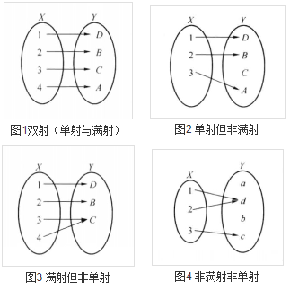
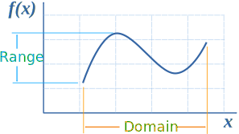
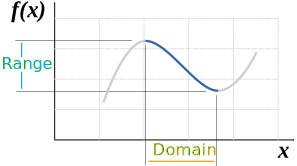
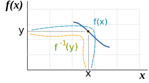
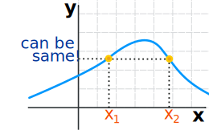
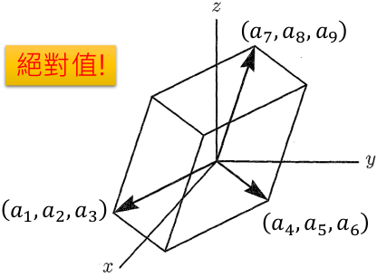
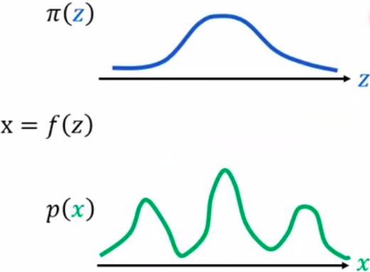
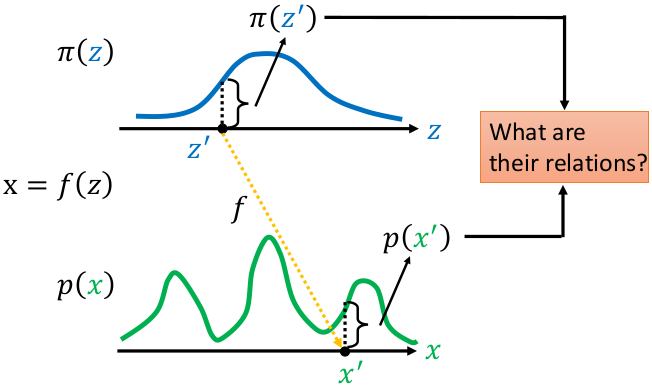
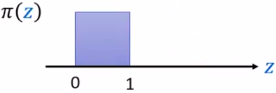
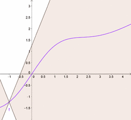

# Math

https://wuli.wiki/online/

https://www.mathsisfun.com/


## 复数/实部/虚部

**复数（complex number）** 是一对满足以下运算的有序实数．令 $z$ 为复数，$x,y$ 为实数，则可以表示为 $z=(x,y)$．其中 $x,y$ 分别被称为复数 $z$ 的**实部（real part）**和**虚部（imaginary part）**，可以记为 $Re[z]$ 和 $Im[z]$．特殊地，我们把复数 $(0,1)$ 称为**虚数单位**，用 $i$ 表示．最后我们定义虚部为零的复数 $(x,0)$ 就是实数 $x$ 本身．把所有复数的集合记为 $C$，那么全体实数的集合 $R$ 就是它的一个子真子集，即 $R⊂C$

定义两个复数的加法为实部和虚部分别相加 <span id="eq1"></span>
$$
\begin{equation}
(x_1, y_1) + (x_2, y_2) = (x_1+ x_2, y_1 + y_2)
\end{equation}\tag{1}
$$
定义复数和实数 $s$ 相乘为（满足交换律）<span id="eq2"></span>
$$
\begin{equation}
s(x, y) = (x, y)s = (sx, sy)
\end{equation}\tag{2}
$$
 可见任意一个复数可以表示为一个加法和一个乘法：$(x,y)=(x,0)+y(0,1)$，即熟悉的
$$
z=x+iy
$$


---

### 复平面


由此可以看到，复数跟二维平面上的**几何矢量**是十分相似的．如图 1，一个**复数**可以看做**复平面**上的一个**点**（或矢量），该矢量在复平面的**实轴**和**虚轴**方向的分量分别等于其实部和虚部．复数的**模**定义为对应矢量的模，即
$$
\begin{equation}
 \left\lvert z \right\rvert  = \sqrt{ \operatorname{Re} [z]^2 +  \operatorname{Im} [z]^2}
\end{equation}
$$
另外我们把矢量与实轴的夹角称为**幅角**．我们可以通过 Arctan 函数计算幅角
$$
\begin{equation}
\arg(z) =  \operatorname{Arctan} ( \operatorname{Im} [z],  \operatorname{Re} [z])
\qquad (\arg z \in (-\pi, \pi])
\end{equation}
$$
也可以通过模和幅角来计算实部与虚部
$$
\begin{equation}
 \operatorname{Re} [z] =  \left\lvert z \right\rvert  \cos\left(\arg z\right)  \qquad  \operatorname{Im} [z] =  \left\lvert z \right\rvert  \sin\left(\arg z\right) 
\end{equation}
$$
在 “指数函数（复数），任意复数也可以通过欧拉公式表示为以下形式
$$
\begin{equation}
z = A(\cos\theta +  \mathrm{i} \sin\theta) = A \mathrm{e} ^{ \mathrm{i} \theta}
\end{equation}
$$
其中 $\theta = \arg z$，$A =  \left\lvert z \right\rvert$


---

### 基本运算

**共轭**

 一个复数的共轭等于与其实部相同，虚部相反的复数
$$
\begin{equation}
z ^*  =  \operatorname{Re} [z] -  \mathrm{i} \,  \operatorname{Im} [z]
\end{equation}
$$
所以共轭运算**不改变复数的模**，但将其**幅角变为相反数**．在复平面上，这相当于把一个点关于 $x$ 轴取**镜像对称**．


**加和减**

[式 1](#eq1) 中已经定义了加法. 与实数相同，定义减法为 $z_1 - z_2 = z_1 + (-z_2)$，有
$$
\begin{equation}
(x_1 +  \mathrm{i}  y_1) \pm (x_2 +  \mathrm{i}  y_2) = (x_1 \pm x_2) +  \mathrm{i}  (y_1 \pm y_2)
\end{equation}
$$
在复平面上，这相当于把两个复数对应的矢量进行矢量相加减. 显然，复数的加法满足**交换律**，**分配律**，**结合律**。

特殊地，将一个复数与其复共轭加减可得其实部和虚部<span id="eq10"></span>
$$
\begin{equation}
 \operatorname{Re} [z] = \frac12 (z + z ^* ) \qquad
 \operatorname{Im} [z] = \frac12 (z - z ^* )
\end{equation}\tag{10}
$$


**乘法**

两个复数相乘定义为（注意 [式 2](#eq2)  是该定义的一种特殊情况）

$$
\begin{equation}
z_1z_2 = (x_1 +  \mathrm{i}  y_1)(x_2 +  \mathrm{i}  y_2) = (x_1 x_2 - y_1 y_2) +  \mathrm{i}  (x_1 y_2 + x_2 y_1)
\end{equation}
$$
可以证明，乘积的模等于两复数模之积，乘积的幅角等于两复数的幅角之和，即
$$
\begin{equation}
 \left\lvert z_1 z_2 \right\rvert  =  \left\lvert z_1 \right\rvert  \left\lvert z_2 \right\rvert 
\end{equation}
$$

$$
\begin{equation}
\arg(z_1 z_2) = \arg(z_1) + \arg(z_2)
\end{equation}
$$

证明：令 $\theta_i = \arg z_i$，则

$$
\begin{equation} \begin{aligned}
z_1 z_2 &= (A_1 \cos\theta_1 +  \mathrm{i}  A_1 \sin\theta_1)(A_2 \cos\theta_2 +  \mathrm{i}  A_2 \sin\theta_2)\\
&= A_1 A_2 (\cos\theta_1\cos\theta_2 - \sin\theta_1\sin\theta_2) +  \mathrm{i}  A_1 A_2 (\cos\theta_1\sin\theta_2 + \cos\theta_2\sin\theta_1)\\
&= A_1 A_2 [ \cos\left(\theta_1 + \theta_2\right)  +  \mathrm{i}   \sin\left(\theta_1 + \theta_2\right) ]
\end{aligned} \end{equation}
$$
其中最后一步用到了两角和公式．容易看出，最后得到的是一个模为 $A_1A_2$ 的复数．证毕．

不难证明复数的乘法满足**交换律**和**结合律**．容易证明，一个复数模的平方可以用它和复共轭的乘积表示．<span id="eq15"></span>

$$
\begin{equation}
x^2 + y^2 =  \left\lvert z \right\rvert ^2 = z z ^* 
\end{equation}\tag{15}
$$


**除法**

和实数一样，复数的除法定义为乘法的逆运算．令 $z_1 = z z_2$（$z_2≠0$），则两个复数相除可以记为

$$
\begin{equation}
z = \frac{z_1}{z_2} = \frac{x_1 +  \mathrm{i}  y_1}{x_2 +  \mathrm{i}  y_2}
\end{equation}
$$
但我们希望可以将结果的实部与虚部分开，于是我们可以对 $z_1$，$z_2$ 同时乘以 $z_2^{*}$，即 $z_1z_2^{*} = zz_2z_2^{*}$，或

$$
\begin{equation}
z = \frac{z_1 z_2 ^* }{z_2 z_2 ^* }
= \frac{(x_1 +  \mathrm{i}  y_1)(x_2 -  \mathrm{i}  y_2)}{(x_2 +  \mathrm{i}  y_2)(x_2 -  \mathrm{i}  y_2)}
= \frac{x_1 x_2 + y_1 y_2}{x_2^2 + y_2^2} +  \mathrm{i}  \frac{x_2 y_1 - x_1 y_2}{x_2^2 + y_2^2}
\end{equation}
$$
这个步骤叫做**分母有理化**

与乘法同理，两个复数相除相当于把它们的模相除，幅角相减，即

$$
\begin{equation}
 \left\lvert z_1/z_2 \right\rvert  =  \left\lvert z_1 \right\rvert / \left\lvert z_2 \right\rvert 
\end{equation}
$$

$$
\begin{equation}
\arg(z_1/z_2) = \arg(z_1) - \arg(z_2)
\end{equation}
$$


### 定理 1<span id="the1"></span>

两个复数进行任意次加减乘除后**再**取共轭，等于它们分别取共轭后**再**进行运算．

根据定义易证．例如
$$
\begin{equation}
\frac{2 z_1 z_2}{(z_3 + z_4)^2} = \frac{2 z_1^* z_2^*}{(z_3^* + z_4^*)^2}
\end{equation}
$$
根据[式 15](#eq15)，[式 10](#eq10) 和 [定理 1](#the1) 易得
$$
\begin{equation}
\begin{aligned}
 \left\lvert z_1 + z_2 \right\rvert ^2 &=  \left\lvert z_1 \right\rvert ^2 +  \left\lvert z_2 \right\rvert ^2 + z_1^* z_2 + z_2^* z_1\\
&=  \left\lvert z_1 \right\rvert ^2 +  \left\lvert z_2 \right\rvert ^2 + 2 \operatorname{Re} [z_1^* z_2]
\end{aligned}
\end{equation}
$$
在复平面中，该式可以表示余弦定理，即计算两矢量之和的模．


---

## Domain/Codomain/Range

domain: 定义域  

codomain: 取值空间

range: 值域


设 $G$ 是从 $X$ 到 $Y$ 的关系，$G$ 的定义域 $D(G)$ 为 $X$，且对**任何** $x∈X$ 都有**惟一**的 $y∈Y$ 满足 $G(x，y)$，则称 $G$ 为从 $X$ 到 $Y$ 的**映射**。

关系 $G$ 常使用另一些记号：$f: X→Y$ 等， $f$ 与 $G$ 的关系是 $y=f(x)(x∈X)$，当且仅当 $G(x，y)$ 成立，可取**变域** $X$ 中的不同元素为值的变元称为自变元或**自变量**，同样可取**变域** $Y$ 中的不同元素为值的变元称为因变元或**因变量**。

始集 $X$ 称为映射 $f$ 的**定义域**，记为 $D(f)$ 或 $dom(f)$；终集 $Y$ 称为映射的**陪域**，记为 $C(f)$ 或 $codom(f)$ ；$Y$ 中与 $X$ 中的元素有关系 $G$ 的元素的组合 $\{y|\exist x(x∈X∧y=f(x)∈Y)\}$称为映射的**值域**，记为 $R(f)$ 或$ran(f)$；


当 $y=f(x)$ 时，$y$ 称为 $x$ 的象，而 $x$ 称为 $y$ 的原象，$y$ 的所有原象所成之集用 $f^{-1}(y)$ 表示；

对于 $A⊆X$，所有 $A$ 中元素的象的集合 ${y|\exist x(x∈A∧y=f(x)∈Y)}$ 或 ${f(x)|x∈A}$ 称为 $A$ 的**象**，记为$f(A)$ ；

对于 $B⊆Y$ ，所有 $B$ 中元素的原象的集合 ${x|x∈X∧∃y(y∈B∧y=f(x))}$ 称为 $B$ 的**原象**，记为 $f^{-1}(B)$。


---

## injective/surjective/bijective

数学上，单射、满射和双射指根据其**定义域**和**陪域**的关联方式所区分的三类函数。<span id="injective"></span>

**单射**：指将不同的变量映射到不同的值的函数。

**满射**：指**陪域等于值域**的函数， 即：对陪域中任意元素，都存在至少一个定义域中的元素与之对应。

**双射**（也称一一对应）：既是单射又是满射的函数。直观地说，一个双射函数形成一个对应，并且每一个输入值都有正好一个输出值以及每一个输出值都有正好一个输入值。




www.mathsisfun.com


**General Function**：普通的函数 可以多对一，但是不能一对多 

- one-to-many is not OK 
- many-to-one is OK

**Injective**：单射，没有多个输入 A 对同一个输出 B。 

- one-to-many is not OK 
- many-to-one is not OK
- **One-to-One**

**Surjective**：满射，每个输出 B 都至少有一个输出 A 与之匹配 也叫做 ”Onto“

- 陪域等于值域

**Bijective**：双射，同时满足单射及满射的函数

- **one-to-one correspondence**

perfect pairing，双射函数有逆！


## Inverse Function

https://www.mathsisfun.com/sets/function-inverse.html

满足以下性质
$$
\begin{equation}
 f\left(f^{-1}(x)\right)=x 
\end{equation}
$$

$$
\begin{equation}
 f^{-1}(f(x))=x 
\end{equation}
$$

函数不可逆怎么处理，**限制定义域**
$$
x^2 → \left\{x^{2} \mid x \geq 0\right\} 
$$
下边是一个例子



上图函数不可逆



限制定义域



函数可逆


**No Inverse**

凸函数有最小值，可以被优化算法求解



**Inverse**


Bijective function


---

## Jacobian

​	现在有一个函数 $f$ ，其输入是一个二维向量 $z$ ，输出是一个二维向量 $x$
$$
\begin{aligned}
z =\left[\begin{array}{l}
z_{1} \\
z_{2}
\end{array}\right] \quad x=\left[\begin{array}{l}
x_{1} \\
x_{2}
\end{array}\right] 
\end{aligned}
$$

$$
x = f(z)
$$

​	函数 $f$ 的雅克比矩阵 $J_f$ 就是把所有输入和输出都做偏微分；其雅克比矩阵 $J_f$ 的逆 $J_{f^{-1}}$ 如下<span id="jf"></span>


$$
J_{f} =\left[\begin{array}{ll}
\partial x_{1} / \partial z_{1} & \partial x_{1} / \partial z_{2} \\
\partial x_{2} / \partial z_{1} & \partial x_{2} / \partial z_{2}
\end{array}\right]
$$

$$
J_{f^{-1}}=\left[\begin{array}{ll}
\partial z_{1} / \partial x_{1} & \partial z_{1} / \partial x_{2} \\
\partial z_{2} / \partial x_{1} & \partial z_{2} / \partial x_{2}
\end{array}\right]
$$

​	其中 $J_f$ 与 $J_{f^{-1}}$ 相乘结果为单位矩阵 $J_{f} J_{f^{-1}}=I$	

​	假设现有输入输出为<span id="eq1"></span>
$$
\begin{array}{c}
{\left[\begin{array}{c}
z_{1}+z_{2} \\
2 z_{1}
\end{array}\right]=f\left(\left[\begin{array}{c}
z_{1} \\
z_{2}
\end{array}\right]\right)}
\end{array} \tag{1}
$$
​	其 $J_f$ 为 $J_{f} =\left[\begin{array}{ll}1 & 1 \\
2 & 0
\end{array}\right]$

​	**[Eq. 1](#eq1)** 的逆为
$$
\left[\begin{array}{c}
x_{2} / 2 \\
x_{1}-x_{2} / 2
\end{array}\right]=f^{-1}\left(\left[\begin{array}{c}
x_{1} \\
x_{2}
\end{array}\right]\right)
$$
​	其 $J_{f^{-1}}$ 为 $ J_{f^{-1}}=\left[\begin{array}{ll}0 & 1/2 \\1 & -1/2
\end{array}\right]$
$$
J_{f} J_{f^{-1}}= \left(\begin{array}{lll}1 & 0 \\ 0 & 1 \end{array}\right)
$$
​	如果函数 $f$ 可逆，则其雅克比矩阵 $J_f$ 与其逆函数 $f^{-1}$ 的雅克比矩阵 $J_{f^{-1}}$  互逆即<span id="eq2"></span>
$$
J_f^{-1} = J_{f^{-1}} \tag{2}
$$

---

## Determinant

​	方阵的行列式是提供有关矩阵信息的 **scalar** 标量。

- 2X2

$$
\begin{array}{c}
A=\left[\begin{array}{ll}
a & b\\
c & d
\end{array}\right] \\
\operatorname{det}(A)=a d-b c
\end{array}
$$

​	2维中A的Determinant意义是面积


- 3X3

$$
\begin{aligned}
A =&\left[\begin{array}{lll}
a_{1} & a_{2} & a_{3} \\
a_{4} & a_{5} & a_{6} \\
a_{7} & a_{8} & a_{9}
\end{array}\right] \\
\operatorname{det}(A) =& 
a_{1} a_{5} a_{9}+a_{2} a_{6} a_{7}+a_{3} a_{4} a_{8} \\
&-a_{3} a_{5} a_{7}-a_{2} a_{4} a_{9}-a_{1} a_{6} a_{8}
\end{aligned}
$$

​	3维中A的Determinant意义是体积



​	根据**[Eq. 2](#eq2)**推断有以下倒数性质：<span id="eq3"></span>
$$
\color{#FF3030}\begin{array}{l}
\operatorname{det}(\mathrm{A})=1 / \operatorname{det}\left(A^{-1}\right) \\
\operatorname{det}\left(J_{f}\right)=1 / \operatorname{det}\left(J_{f^{-1}}\right)
\end{array} \tag{3}
$$

---

## Change of Variable Theorem<span id="cvt"></span>

​	假设有分布 $\pi(z)$ ,通过函数 $f$ 生成的 $x$ 也形成了一个分布 $p(x)$



​	Input的z上有$z^{'}$, $x^{'}=f(z^{'})$ , 寻找 $z^{'}，x^{'}$ 的关系，也就是 $\pi(z^{'})$ 和 $p(x^{'})$ 的关系。



​	假设有均匀分布 $\pi(z)$ ，其中$ z \in (0,1)$ ，有$\int \pi(z) d z=1$



​	假设有函数 $f$ 为 
$$
x=f(z)=2z+1
$$
​	则有均匀分布 $p(x)$ ，其中$ x \in (1,3)$ ，也有有$\int p(x) d x=1$


​	底变为原来1的两倍2，则高变为原来1的一半1/2，那么两个分布之间的关系如下式子
$$
p\left(x^{\prime}\right)=\frac{1}{2} \pi\left(z^{\prime}\right)
$$

------

### 1D Example

​	现有不常规的概率分布 $\pi(z)$ 通过函数变换后变成了另一种概率分布 $p(x)$   


​	通过 $x=f(z)$ ，如何寻找 $z$ 的概率密度/分布 $\pi(z)$ 和 $x$ 的概率密度 $p(x)$ 之间的关系?


​	现在假设把 $z^{\prime}$ 移动到 $z^{\prime} + \Delta{z}$ ，这一范围内的概率密度被拉宽到 $(x^{\prime},x^{\prime}+\Delta{x})$ 的范围：


​	假设 $\Delta{z} \rightarrow 0$ ， $(z^{\prime},z^{\prime}+\Delta{z})$ 范围内的概率密度可以近似看成均匀的，假设 $(x^{\prime},x^{\prime}+\Delta{x})$ 范围内的概率密度也是均匀的


​	也就是蓝色方块面积被拉宽到绿色方块，因此两块面积相同
$$
p\left(x^{\prime}\right) \Delta x=\pi\left(z^{\prime}\right) \Delta z
$$
​	方程两边同时除以 $\Delta{x}$ 得:
$$
p\left(x^{\prime}\right)=\pi\left(z^{\prime}\right) \frac{\Delta z}{\Delta x}
$$
​	$\Delta{z} \rightarrow 0 ,\Delta{x} \rightarrow 0 $进一步可以处理为：
$$
\begin{array}{l}
 \\
p\left(x^{\prime}\right)=\pi\left(z^{\prime}\right)\left|\frac{d z}{d x}\right|
\end{array}
$$
​	即 z 对 x 的微分，如果知道函数 $f$ 的逆，就可以算 z 对 x 的微分。加绝对值的原因如下图:


​	

------

### 2D Example

​	现在 $z$ 和 $x$ 都是二维向量，同样的有转换函数 $x = f(z)$ ，如何寻找 $z$ 的概率密度 $\pi(z)$ 和 $x$ 的概率密度 $p(x)$ 之间的关系?

​	假设蓝色正方形的分布为 $\pi(z^{\prime})$ ，宽为 $\Delta{z_1}$ 高为 $\Delta{z_2}$，通过 $f$ 后，蓝色正方形变为绿色的菱形 


​	上图中 $\color{#FF3030}\Delta{x_{11}}$ 是 $z_1$ 改变时 $x_1$ 的改变量， $\color{#FF3030}\Delta{x_{21}}$ 是 $z_1$ 改变时 $x_2$ 的改变量

​				 $\color{#FF3030}\Delta{x_{12}}$ 是 $z_2$ 改变时 $x_1$ 的改变量， $\color{#FF3030}\Delta{x_{22}}$ 是 $z_2$ 改变时 $x_2$ 的改变量。

​	蓝色方块面积与 $\pi(z^{\prime})$ 相乘=绿色菱形面积与 $p(x^{\prime})$ 相乘，有下式
$$
p\left(x^{\prime}\right)\left|\operatorname{det}\left[\begin{array}{ll}
\Delta x_{11} & \Delta x_{21} \\
\Delta x_{12} & \Delta x_{22}
\end{array}\right]\right|=\pi\left(z^{\prime}\right) \Delta z_{1} \Delta z_{2}
$$
​	移项:
$$
p\left(x^{\prime}\right)\left|\frac{1}{\Delta z_{1} \Delta z_{2}} \operatorname{det}\left[\begin{array}{cc}
\Delta x_{11} & \Delta x_{21} \\
\Delta x_{12} & \Delta x_{22}
\end{array}\right]\right|=\pi\left(z^{\prime}\right)
$$
​	把 $\frac{1}{\Delta z_{1} \Delta z_{2}}$ 放到 Det 里:
$$
p\left(x^{\prime}\right)\left|\operatorname{det}\left[\begin{array}{cc}
\Delta x_{11} / \Delta z_{1} & \Delta x_{21} / \Delta z_{1} \\
\Delta x_{12} / \Delta z_{2} & \Delta x_{22} / \Delta z_{2}
\end{array}\right]\right|=\pi\left(z^{\prime}\right)
$$
​	其中 $\Delta x_{11} / \Delta z_{1}$ 等价于 $\partial x_{1} / \partial z_{1}$ ； $\Delta x_{21} / \Delta z_{1}$ 等价于 $\partial x_{2} / \partial z_{1}$ 。则有:
$$
p\left(x^{\prime}\right)\left|\operatorname{det}\left[\begin{array}{cc}
\partial x_{1} / \partial z_{1} & \partial x_{2} / \partial z_{1} \\
\partial x_{1} / \partial z_{2} & \partial x_{2} / \partial z_{2}
\end{array}\right]\right|=\pi\left(z^{\prime}\right)
$$
​	把内部矩阵转置，不会改变其行列式:
$$
p\left(x^{\prime}\right)\left|\operatorname{det}\left[\begin{array}{cc}
\partial x_{1} / \partial z_{1} & \partial x_{1} / \partial z_{2} \\
\partial x_{2} / \partial z_{1} & \partial x_{2} / \partial z_{2}
\end{array}\right]\right|=\pi\left(z^{\prime}\right)
$$
​	则转置后的内部矩阵为 [$J_{f}$](#jf) :
$$
\color{#FF3030}p\left(x^{\prime}\right)\left|\operatorname{det}\left(J_{f}\right)\right|=\pi\left(z^{\prime}\right)
$$

$$
p\left(x^{\prime}\right)=\pi\left(z^{\prime}\right)\left|\frac{1}{\operatorname{det}\left(J_{f}\right)}\right|\\
$$

​	利用**[Eq. 3](#eq3)**的性质转换:
$$
\color{#FF3030}p\left(x^{\prime}\right)=\pi\left(z^{\prime}\right)\left|\operatorname{det}\left(J_{f^{-1}}\right)\right|
$$
​	其中 z 是输入（潜在向量），x 是输出，x = f(z)


### 生成 Example

给定一个观测数据变量 $x\in X$，一个潜在变量 $z\in Z$ ，服从一个简单先验概率分布 $p_Z$ 以及一个双射 $ f: X \rightarrow Z $（ $g = f^{-1}:Z\rightarrow X$），变量公式的变化定义了一个模型分布在 $X$ 上

双射 $Z = f(X)$，$Z = g(X)$，$f = g^{-1}$
$$
\begin{equation}
 \begin{aligned} p_{X}(x) &=p_{Z}(f(x))\left|\operatorname{det}\left(\frac{\partial f(x)}{\partial x^{T}}\right)\right|  \\ 
 \log \left(p_{X}(x)\right) &=\log \left(p_{Z}(f(x))\right)+\log \left(\left|\operatorname{det}\left(\frac{\partial f(x)}{\partial x^{T}}\right)\right|\right) \end{aligned} 
\end{equation}
$$
$\frac{\delta f(x)}{\delta x^T}$ 是 $f$ 在 $x$ 处的雅可比行列式。


----

## 狄拉克分布

https://wuli.wiki/online/Delta.html

**Dirac delta function**

在物理中我们经常会遇到一些模型，如质点和点电荷等，这类模型使用了极限的思想（如令体积趋于无穷小）

$δ(x)$ 并不是数学中一个严格意义上的函数，而是在泛函分析中被称为广义函数（generalized function）或分布（distribution）


**Fig. 1**

我们来考虑一个函数（左图），其表示的函数如下，$x_0$ 即为长方形宽的中点。
$$
\begin{equation}
f_h(x) =
\begin{cases}
h &  \left( \left\lvert x - x_0 \right\rvert  \leqslant \frac{1}{2h} \right) \\
0 &  \left( \left\lvert x - x_0 \right\rvert  > \frac{1}{2h} \right) 
\end{cases}
\end{equation}\tag{1}
$$
其中 $h$ , $x_0$ 是常数．由函数图像易得函数曲线下面的面积为 $\int_{-\infty}^{+\infty} f_h(x)  \,\mathrm{d}{x}  = 1$．现在我们令 $h \to \infty$，长方形的高将趋于无穷大，宽将趋于零，而**定积分结果不变**．这里就如同 [Change of Variable Theorem](#cvt) 的思想

这样，上面的 $f_h(x)$ 就可以表示为 $\delta(x - x_0)$．当然，我们还可以选取其他含有参数的 $f(x)$  来逼近 $δ$  函数，如图中的另外两种情况(最右为高斯分布)．


**Fig. 2** 高斯分布函数 a 趋近于0的序列图像


### 定义

把 $δ$ 函数看作是满足一定条件的**函数序列**，即无穷个函数按一定顺序排列．

> **定义1** 狄拉克 $δ$ 函数
>
> 令 $\delta_1(x), \delta_2(x), \dots$ 为一个**连续实函数的序列**．若 $\delta_n(x)$ 满足以下两个条件，那么我们把该函数列称为狄拉克 $δ$ 函数（列）：
> $$
> \begin{equation}
> \lim_{n\to\infty}\int_{-\infty}^{+\infty} \delta_n(x)  \,\mathrm{d}{x}  = 1
> \end{equation}\tag{2}
> $$
> 对任意给定的不包含 0 的区间 $(a,b)$ ($a,b \ne 0$，可取 $\pm\infty$)，有
> $$
> \begin{equation}
> \lim_{n\to\infty} \int_{a}^{b} \delta_n(x)  \,\mathrm{d}{x}  = 0
> \end{equation}\tag{3}
> $$

事实上，教材上常使用以下定义 2，但笔者认为这两种定义是等价的，且前者更容易理解(定义 1 是定义 2 的必要条件，只需要令定义 2 中的 $f(x) = 1$ 证明式 2 ；再令 $f(x)$ 在区间 $(a,b)$ 为 1，否则为 0，证明式 3）

> **定义 2**　狄拉克 $δ$ 函数 2
>
> 令 $\delta_1(x), \delta_2(x), \dots$ 为一个**连续实函数的序列**．若 $\delta_n(x)$ 满足以下条件，那么我们把该函数列称为狄拉克 $δ$ 函数（列）：
>
> 　　 对所有性质良好（例如在 $x=0$ 连续）的 $f(x)$，都有
> $$
> \begin{equation}
> \lim_{n\to\infty}\int_{-\infty}^{+\infty} \delta_n(x)f(x)  \,\mathrm{d}{x}  = f(0)
> \end{equation}\tag{4}
> $$


 一些物理教材会把 $\delta(x)$  的性质简单记为
$$
\begin{equation}
\delta(x) =
\begin{cases}
+\infty & (x = 0)\\
0 & (x \ne 0)
\end{cases}
\end{equation}\tag{5}
$$

$$
\begin{equation}
\int_{-\infty}^{+\infty} \delta(x)  \,\mathrm{d}{x}  = 1
\end{equation}\tag{6}
$$

$\delta(x)$ **不是函数，更不可积**，$x \ne 0$ 时极限 $\lim_{n\to \infty}\delta_n(x)$ 也未必存在．


### 常见性质

**性质1**

 若一个等式中出现了所谓的 $\delta$ 函数 $\delta(x)$，那么其严格的定义是先将 $\delta(x)$ 替换为符合[定义 1](https://wuli.wiki/online/Delta.html#def1)的任意函数列 $\delta_n(x)$，令**等式在 $n\to\infty$ 的极限时成立**．

　　 例如  $\delta(x)$ 一个重要的性质是：对任意在 $x = x_0$ 处连续函数 $f(x)$，有
$$
\begin{equation}
\int_{-\infty}^{+\infty} f(x) \delta(x - x_0)  \,\mathrm{d}{x} = f(x_0)
\end{equation}\tag{10}
$$
使用[定义 1](https://wuli.wiki/online/Delta.html#def1) 表示，该等式的严格意义是（注意极限和积分不可交换，且极限必须在最外面）
$$
\begin{equation}
\lim_{n\to\infty}\int_{-\infty}^{+\infty} f(x) \delta_n(x - x_0)  \,\mathrm{d}{x} = f(x_0)
\end{equation}
$$
由于我们假设[定义 1](https://wuli.wiki/online/Delta.html#def1)和[定义 2](https://wuli.wiki/online/Delta.html#def2)等效，这是成立的．


---

## 高斯分布

高斯分布函数为
$$
\begin{equation}
f(x) = \frac{1}{\sigma \sqrt{2\pi }} \exp \left[-\frac{(x - \mu )^2}{2\sigma ^2} \right] 
\end{equation}\tag{1}
$$
其中 $μ$ 是分布的的平均值，$σ$ 是标准差．满足归一化条件  
$$
\begin{equation}
\int_{-\infty}^{\infty} f(x)  \,\mathrm{d}{x}  = 1
\end{equation}\tag{2}
$$


**高斯分布（Gaussian Distribution）**又叫**正态分布（Normal Distribution）**，具有如下形式
$$
\begin{equation}
f(x) = A\exp \left[-\lambda (x - x_0)^2 \right] 
\end{equation}\tag{3}
$$
可见其主要特征就是指数函数中含有 $\Delta x^2$ 项．由对称性，分布函数是关于 $x =x_0$ 的偶函数，所以平均值显然为 $\mu = x_0$．首先我们补充两个积分，由换元积分法（$x=\sqrt{t}$）以及 $Γ$ 函数的性质得
$$
\begin{equation}
\int_{-\infty }^{+\infty }  \exp\left(-x^2\right)  \,\mathrm{d}{x}   = \int_0^{+\infty} t^{-1/2} \mathrm{e} ^{ - t}  \,\mathrm{d}{t}   =  \left(-\frac12 \right) ! = \sqrt \pi 
\end{equation}\tag{4}
$$

$$
\begin{equation}
\int_{-\infty}^{+\infty} x^2 \exp\left(-x^2\right)  \,\mathrm{d}{x}   = \int_0^{+\infty} t^{1/2} \mathrm{e} ^{-t}  \,\mathrm{d}{t}   = \frac12 ! = \frac12  \left(-\frac12 \right) ! = \frac{\sqrt\pi}{2}
\end{equation}\tag{5}
$$

根据分布函数的归一化条件，结合[式 4](https://wuli.wiki/online/GausPD.html#eq4)得
$$
\begin{equation}
1 = \int_{-\infty}^{+\infty} f(x)  \,\mathrm{d}{x}   = A\int_{-\infty}^{+\infty} \exp \left[-\lambda (x - x_0)^2 \right]   \,\mathrm{d}{x}   = A\sqrt{\frac{\pi}{\lambda}}
\end{equation}\tag{6}
$$
即 $A = \sqrt{\lambda/\pi}$．再来计算高斯分布的方差，结合[式 5](https://wuli.wiki/online/GausPD.html#eq5)得
$$
\begin{equation}
\sigma ^2 = \int_{-\infty}^{+\infty} (x - x_0)^2 A\exp \left[-\lambda (x - x_0)^2 \right]   \,\mathrm{d}{x}   = \frac{1}{2\lambda}
\end{equation}\tag{7}
$$
用[式 6](https://wuli.wiki/online/GausPD.html#eq6)和[式_7](https://wuli.wiki/online/GausPD.html#eq7)解得 $\lambda = 1/(2\sigma^2)$ 和 $A = 1/(\sigma\sqrt{2\pi})$，代入[式 3](https://wuli.wiki/online/GausPD.html#eq3)可得高斯分布[式 1](https://wuli.wiki/online/GausPD.html#eq1)．


---

## 度量空间

度量空间(Metric Space)，在数学中是指一个集合，并且该集合中的任意元素之间的距离是可定义的。

亦称距离空间。一类特殊的[拓扑空间](https://baike.baidu.com/item/拓扑空间/1498597)。Fréchet将[欧几里得空间](https://baike.baidu.com/item/欧几里得空间/785521)的距离概念抽象化，于1906年定义了度量空间。

欧氏空间是一个特别的度量空间.


---

## 欧几里德空间

四维空间被称为**标准欧几里德空间**，可以拓展到n维。人类作为三维物体可以理解**四维时空**（三个空间维度和一个时间维度）但无法认识以及存在于**四维空间**，因为人类属于第三个空间维度生物。通常所说时间是第四维即四维时空下的时间维度。**四维空间的第四维指与x，y，z同一性质的空间维度**。然而**四维时空并不是标准欧几里德空间**，时间的本质是描述运动的快慢。


---

## 赋范向量空间

一个把向量映射到非负实数的函数如果满足简介中描述的性质，就叫做一个半范数；如果只有零向量的函数值是零，那么叫做范数。拥有一个范数的向量空间叫做赋范向量空间，拥有半范数的叫做半赋范向量空间。


---

## 柯西-利普希茨定理/皮卡-林德勒夫定理

保证了一阶常微分方程]的局部解以至最大解的存在性和唯一性。


https://www.knowpia.cn/pages/%E7%9A%AE%E5%8D%A1-%E6%9E%97%E5%BE%B7%E6%B4%9B%E5%A4%AB%E5%AE%9A%E7%90%86


---

## 连续

以陆地为例。
岛屿：不连续
一般陆地：连续
丘陵：李普希兹连续
悬崖：非李普希兹连续
山包：可导
平原：线性
半岛：非凸

李普希兹连续就是说，一块地不仅没有河流什么的玩意儿阻隔，而且这块地上没有特别陡的坡。其中最陡的地方有多陡呢？这就是所谓的**李普希兹常数**。

悬崖的出现导致最陡的地方有“无穷陡”，所以不是李普希兹连续。


---

## lipschitz 连续条件



这个圆锥的斜率就是 Lipschitz常数。图中粉色曲线的任意一点的斜率都小于这个常数


1.它其实就是在一个连续函数 $f$ 上面额外施加了一个限制，要求存在一个常数 $K\geq 0$ 使得**定义域内**的任意两个元素 $x_1$ 和 $x_2$ 都满足
$$
|f(x_1) - f(x_2)| \leq K |x_1 - x_2|
$$

此时称函数 $f$ 的 Lipschitz常数为 $K$。

简单理解，比如说 $f$ 的定义域是实数集合，那上面的要求就等价于 $f$ 的**导函数绝对值**不超过$K$ 。再比如说 $\log (x)$ 就不是 Lipschitz 连续，因为它的导函数没有上界。Lipschitz 连续条件**限制**了一个连续函数的**最大局部变动幅度**。
$$
|\frac{f(x_1) - f(x_2)}{x_1 - x_2}| \leq K
$$


2.**存在一个实数 L，使得对于函数 f（x）上的每对点，连接它们的线的斜率的绝对值不大于这个实数 L。最小的L称为该函数的 Lipschitz常数。**


3.函数图像的曲线上任意两点连线的斜率一致有界，就是任意的斜率都小于同一个常数，这个常数就是Lipschitz常数。

从局部看：我们可以取**两个充分接近的点**，如果这个时候**斜率的极限**存在的话，这个斜率的极限就是这个**点的导数**。也就是说函数可导，又是Lipschitz连续，那么导数有界。反过来，如果**可导函数，导数有界，可以推出函数 Lipschitz连续**。

从整体看：Lipschitz连续要求函数在无限的区间上不能有**超过线性的增长**，所以这些和函数在无限区间上不是Lipschitz连续的。


**Lipschitz continuous： 函数被一次函数上下夹逼**

**Lipschitz continuous gradient ：函数被二次函数上下夹逼**

**Lipschitz continuous Hessian ：函数被三次函数上下夹逼**


Lipschitz continuous 用在函数值上是为了不让函数值变化的太快；

用在导函数上，是为了不让导函数变化的太快；

用在Hessian上，是为了让Hessian不变化的太快。

但他们都导致了一个很有意思的结果：这个 Lipschitz continuous 不管用在什么上，都使**的函数被多项式上下夹逼**，一方面便于我们处理，另一方面至少我们能控制一下函数的包络信息。


4.在数学中，特别是实分析，**lipschitz条件，即**利普希茨连续条件（Lipschitz continuity），是一个比**通常连续更强**的**光滑性条件**。直觉上，利普希茨连续函数**限制了函数改变的速度**，符合利普希茨条件的函数的斜率，必小于一个称为利普希茨常数的实数（该常数依函数而定）。

在微分方程，利普希茨连续是**皮卡-林德洛夫定理(Picard-Lindelöf)**中**确保了初值问题存在唯一解的核心条件**。一种特殊的利普希茨连续，称为压缩应用于[巴拿赫不动点定理](https://baike.baidu.com/item/巴拿赫不动点定理/9492042)。

举个例子：$f(x) = |x|，K=1$；符合利普希茨（Lipschitz ）条件。注意 $f(x)$ 在 $x=0$ 处是不可微的，因此符合**Lipschitz 条件的函数未必处处可微**


---

### 局部 Lipschitz 条件成立的充分条件

假设 $f:[a,b] \times D \to {{\rm{R}}^m}$ 在某个区域 $D \subset {{\rm{R}}^n}$ 上是连续的，$\frac{{\partial f}}{{\partial x}}(t,x)$ 存在，并且在 $[a,b] \times D$ 上连续。如果对于一个图集 $W \subset D$，存在常数 $L \ge 0$，使得在 $[a,b] \times W$ 上有
$$
\left\| {\frac{{\partial f}}{{\partial x}}(t,x)} \right\| \le L
$$
则对于所有的 $t \in [a,b],x \in W,y \in W$，有
$$
||f(t,x) - f(t,y)|| \le L||x - y||
$$


给定：两个欧式空间 $(X,d_X)$ 和 $(Y,d_Y)$. $d_X$ 表示集合 $X$ 上的欧式距离，$d_Y$ 同理。有函数 $f:X \to Y$ 

一个函数被称为局部李普希茨连续函数，如果对于 $X$ 中的每一个 $x$，都存在一个 $x$ 的邻域 $U$，使得限制 $U$ 的 $f$ 是李普希茨连续函数。等价地，如果 $X$ 是局部紧度量空间，那么 $f$ 是局部李普希茨的。当且仅当它在 $X$ 的每个紧子集上是李普希茨连续的。在非局部紧的空间中，这是一个必要条件，但不是充分条件。


### bi-Lipschitz

如果存在 $K ≥ 1$，使
$$
\begin{equation}
 \frac{1}{K} d_{X}\left(x_{1}, x_{2}\right) \leq d_{Y}\left(f\left(x_{1}\right), f\left(x_{2}\right)\right) \leq K d_{X}\left(x_{1}, x_{2}\right) \\
 \frac{1}{K}  \leq \frac{d_{Y}\left(f\left(x_{1}\right), f\left(x_{2}\right)\right)}{d_{X}\left(x_{1}, x_{2}\right)} \leq K 
\end{equation}
$$
那么 $f$ 就叫做 **bilipschitz**(也写为bi-Lipschitz)。bilipschitz映射是[单射](#injective)的，实际上是其图像的**同胚**(homeomorphism)映射。bilipschitz函数和[单射](#injective)李普希茨函数是一样的，[单射](#injective)李普希茨函数的反函数也是李普希茨函数。

>两个拓扑空间 ${X,T_X}$和 ${Y,T_Y}$ 之间的函数 $f:X \to Y$ 称为**同胚**，如果它具有下列性质：
>
>- $f$ 是[双射](#injective)（单射和满射）；
>- $f$ 是连续的；
>- 反函数 $f$ 也是连续的（f是开映射）。
>
>满足以上三个性质的函数有时称为**双连续**。


---

### 深度学习中的Lipschitz约束：泛化与生成模型

https://kexue.fm/archives/6051


#### 1. L 约束与泛化

##### 1.1. 扰动敏感

记输入为 $x$，输入为 $y$，模型为 $f$，模型参数为 $w$，记为
$$
\begin{equation}y = f_w(x)\end{equation}\tag{1}
$$
很多时候，我们希望得到一个“**稳健**”的模型。

何为稳健？一般来说有两种含义，

一是对于**参数扰动的稳定性**，比如模型变成了 $f_{w+\Delta w}(x)$ 后是否还能达到相近的效果？如果在动力学系统中，还要考虑模型最终是否能**恢复**到 $f_w(x)$；

二是对于**输入扰动的稳定性**，比如输入从 $x$ 变成了 $x+\Delta x$ 后，$f_w(x+\Delta x)$ 是否能给出**相近的预测结果**。

读者或许已经听说过深度学习模型存在“对抗攻击样本”，比如图片只**改变一个像素**就给出完全不一样的分类结果，这就是**模型对输入过于敏感**的案例。


---

##### 1.2. L 约束

所以，大多数时候我们都希望**模型对输入扰动是不敏感的**，这通常能提高模型的**泛化**性能。也就是说，我们希望 $\Vert x_1 - x_2 \Vert$ 很小时
$$
\begin{equation}\Vert f_w(x_1) - f_w(x_2)\Vert\end{equation}\tag{2}
$$
也尽可能地小。当然，“尽可能” 究竟是怎样，谁也说不准。于是 Lipschitz 提出了一个更具体的约束，那就是存在某个常数 $C$（它**只与参数有关**，**与输入无关**），使得下式恒成立<span id="eq3"></span>
$$
\begin{equation}\Vert f_w(x_1) - f_w(x_2)\Vert\leq C(w)\cdot \Vert x_1 - x_2 \Vert\label{eq:l-cond}\end{equation}\tag{3}
$$
也就是说，希望整个模型被一个线性函数“控制”住。这便是 L 约束了。

**换言之，在这里我们认为满足 L 约束的模型才是一个好模型**～并且对于具体的模型，我们希望**估算出 $C(w)$ 的表达式**，并且**希望 $C(w)$ 越小越好，越小意味着它对输入扰动越不敏感，泛化性越好。**


---

##### 1.3. 神经网络

在这里我们对具体的神经网络进行分析，以观察神经网络在什么时候会满足 L 约束。

简单起见，我们考虑单层的全连接 $f(Wx+b)$ ，这里的 $f$ 是激活函数，而 $W,b$ 则是参数矩阵/向量，这时候 [Eq. 3](#eq3) 变为
$$
\begin{equation}\Vert f(Wx_1+b) - f(Wx_2+b)\Vert\leq C(W,b)\cdot \Vert x_1 - x_2 \Vert\end{equation}\tag{4}
$$
让充分接近，那么就可以将左边用一阶项近似，得到
$$
\begin{equation}\left\Vert \frac{\partial f}{\partial x}W(x_1 - x_2)\right\Vert\leq C(W,b)\cdot \Vert x_1 - x_2 \Vert\end{equation}\tag{5}
$$
显然，要希望左边不超过右边，$∂f/∂x$ 这一项（每个元素）的绝对值必须不超过某个常数。这就要求我们要使用“导数有上下界”的激活函数，不过我们目前常用的激活函数，比如 sigmoid、tanh、relu 等，都满足这个条件。假定激活函数的梯度已经有界，尤其是我们常用的 relu 激活函数来说这个界还是 1，因此 $∂f/∂x$ 这一项只带来一个常数，我们暂时忽略它，剩下来我们只需要考虑 $\Vert W(x_1 - x_2)\Vert$。

多层的神经网络可以逐步递归分析，从而最终还是单层的神经网络问题，而 CNN、RNN 等结构本质上还是特殊的全连接，所以照样可以用全连接的结果。因此，对于神经网络来说，问题变成了：如果
$$
\begin{equation}\Vert W(x_1 - x_2)\Vert\leq C\Vert x_1 - x_2 \Vert\label{sec:l-cond-nn}\end{equation}\tag{6}
$$

恒成立，那么的值可以是多少？找出C的表达式后，我们就可以希望尽可能小，从而给参数带来一个正则化项。

> 泰勒一阶近似 $f(x) = f(a) + f^{\prime}(a)(x-a)$


---

## Banach's Fixed Point Theorem

巴拿赫不动点定理，又称为压缩映射原理（Contraction Mapping Principle）。


---

## 欧拉法求解常微分方程

https://www.wolframalpha.com/

1. 一阶齐次线性微分方程

$$
y' +P(x)y=0
$$

其通解为：$ y=C e^{-\int P(x) d x} $

2. 一阶非齐次线性微分方程

$$
\begin{equation}
 y^{\prime}+P(x) y=Q(x)
\end{equation}
$$

其通解为：$ y=C e^{-\int P(x) d x}+e^{-\int P(x) d x} \int Q(x) e^{\int^{p(x) d x}} d x $

3. 二阶齐次常系数微分方程

$$
\begin{equation}
 y^{\prime \prime}+p y^{\prime}+q y=0 
\end{equation}
$$

设特征方程
$$
\begin{equation}
 r \cdot r+p \cdot r+q=0 
\end{equation}
$$
两根为 $r_1$, $r_2$  #TODO 

4. 二阶非齐次常系数微分方程

$$
\begin{equation}
 y^{\prime \prime}+p y^{\prime}+q y=f(x)
\end{equation}
$$

https://wenku.baidu.com/view/5f03c763cbaedd3383c4bb4cf7ec4afe04a1b1d6.html


> 形如 $y'=f(y/x)$的方程称为“齐次方程”，必须是**除号**，不能是**乘号**
>
> 形如 $y''+py'+qy=0$（其中p和q为常数）的方程称为“齐次线性方程”
>
> 形如 $y'+P(x)y=Q(x)$ 的微分方程称为“一阶线性微分方程“，$Q(x)$ 称为自由项
>
> 
>
> **齐次**方程，指的是简化后的方程中所有非零项的**指数之和**相等
>
> **一阶**，指的是方程中关于 $Y$ 的导数是**一阶导数**。
>
> **线性**，指的是方程简化后的每一项关于 $y、y'$ 的**指数为 1**。
>
> 两个变量之间存在**一次方函数关系**，就称它们之间存在**线性关系**。
>
> 
>
> $ x^{2}+3 x y+5 y^{2} $、$ 5 a^{3} b^{2}+8 a b^{4}+7 a^{2} b^{3} $ 都是齐次多项整式
>
> 齐次 > homogeneous


---

### Example 1

具体例子如下
$$
\begin{equation}
 \hat{y}=8 x(2-y) \\
 y(0)=1 
\end{equation}
$$
化简为：
$$
\begin{equation}
 y'+8xy=16x
\end{equation}
$$
其中 $P(x) = 8x$，$Q(x) = 16x$

代入通解化简：
$$
\begin{equation}
  y=C e^{-\int P(x) d x}+e^{-\int P(x) d x} \int Q(x) e^{\int^{p(x) d x}} d x  \\
 =C e^{-\int 8x d x}+e^{-\int 8x d x} \int 16x e^{\int^{8x d x}} d x \\
 =C e^{-4x^2}+e^{-4x^2} \int 16x e^{{4x^2}} d x\\
 =C e^{-4x^2}+e^{-4x^2} 2 e^{{4x^2}}  \\
 =C e^{-4x^2}+ 2 
\end{equation}
$$
代入 $y(0) = 1$，得 $C = -1$，则有解析解为：$ \mathrm{y}=2-e^{-4 x^{2}} $


#### 欧拉法

##### 差分方法

Euler ODE 差分方法，用**差商代替导数**，将微分方程离散化，得到**递推公式**。递推公式又称为差分格式或差分方程，它与常微分方程的误差称为**截断误差**。用折线近似曲线 $y=y(x)$，欧拉法又称为**折线法**。

将区间 `[a,b]` 分成 n 段，那么方程在第 $x_i$ 点有 $ y^{\prime}\left(x_{i}\right)=f\left(x_{i}, y\left(x_{i}\right)\right) $，再用**向前差商**近似代替导数则为： 
$$
 \frac{\left(y\left(x_{i}+1\right)-y\left(x_{i}\right)\right)}{h}=f\left(x_{i}, y\left(x_{i}\right)\right) 
$$
在这里，$h$ 是步长，即相邻两个结点间的距离。因此可以根据 $x_i$ 点和 $y_i$ 点的数值计算出 $y_i + 1$ 来：
$$
y_{i+1}=y_{i}+h \times f\left(x_{i}, y_{i}\right), \quad i=0,1,2, n
$$
这就是**欧拉格式**，若初值 $y_i + 1$ 是已知的，则可依据上式逐步算出数值解 $ y_{1}, y_{2} \cdots \cdots . \mathrm{yn} $.

例子中的 $f\left(x_{i}, y\left(x_{i}\right)\right)  = 8 x(2-y)$：

```matlab
h = 0.1;
x = 0 : h : 1;
y = zeros(size(x));
y(1) = 1;  % 对应的式子为 y(0) = 1， matlab索引从 1 开始
for i = 2 :length(x)
	% y_i  = y_{i-1} + h x (8 * x_{i-1} * (2 - y_{i - 1}))
	y(i) = y(i - 1) + h * (8 * x(i-1) * (2 - y(i - 1)));
end

ytrue = 2 - exp(-4*(x.^2)); %解析解
plot(x,y,x,ytrue);
legend('y_euler','y_true')
```


##### 数值积分方法

$$
\begin{equation}
 \frac{d y}{d x}=f(x, y) \\
  
  
\end{equation}
$$

两边同时积分
$$
\int_{x_{n}}^{x_{n+1}} \frac{d y}{d x} d x=\int_{x_{n}}^{x_{n+1}} f(x, y(x)) d x \\
$$
进一步化简
$$
y\left(x_{n+1}\right)-y\left(x_{n}\right)=\int_{x_{n}}^{x_{n+1}} f(x, y(x)) d x
$$
(1) 显式差分格式
$$
y\left(x_{n+1}\right)=y\left(x_{n}\right)+\int_{x_{n}}^{x_{n+1}} f(x, y(x)) d x
$$
根据**左矩形公式** $\int_{x_{n}}^{x_{n+1}} f(x, y(x)) d x  \approx h \times f\left(x_{n}, y_{n}\right)$，其中 $h = x_{n+1} - x_{n}$

最终得到
$$
\begin{equation}
 y\left(x_{n+1}\right)=y\left(x_{n}\right)+h f\left(x_{n}, y\left(x_{n}\right)\right) \\
  y_{n+1}=y_{n}+h f\left(x_{n}, y_{n}\right) 
\end{equation}
$$
(2) 隐式差分格式

根据**右矩形公式** $\int_{x_{n}}^{x_{n+1}} f(x, y(x)) d x  \approx h \times f\left(x_{n+1}, y_{n+1}\right)$，其中 $h = x_{n+1} - x_{n}$

最终得到
$$
\begin{equation}
 y\left(x_{n+1}\right)=y\left(x_{n}\right)+h f\left(x_{n+1}, y\left(x_{n+1}\right)\right) \\
  y_{n+1}=y_{n}+h f\left(x_{n+1}, y_{n+1}\right) 
\end{equation}
$$
或根据**梯形公式** $ \int_{x_{n}}^{x_{n+1}} f(x, y(x)) d x \approx \frac{h}{2}\left[f\left(x_{n}, y\left(x_{n}\right)\right)+f\left(x_{n+1}, y\left(x_{n+1}\right)\right)\right] $，其中 $h = x_{n+1} - x_{n}$

最终得到
$$
 y\left(x_{n+1}\right)=y\left(x_{n}\right)+\frac{h}{2}\left[f\left(x_{n}, y\left(x_{n}\right)\right)+f\left(x_{n+1}, y\left(x_{n+1}\right)\right)\right] \\
  y_{n+1}=y_{n}+\frac{h}{2}\left[f\left(x_{n}, y_{n}\right)+f\left(x_{n+1}, y_{n+1}\right)\right] 
$$
(3) 预报-校正公式

先使用左矩形公式推导的显示差分格式，再使用梯形公式推导的隐式差分格式。前一步起到预报-校正的作用
$$
\begin{equation}
 \tilde{y}_{n+1}=y_{n}+h f\left(x_{n}, y_{n}\right) \\ y_{n+1}=y_{n}+\frac{h}{2}\left[f\left(x_{n}, y_{n}\right)+f\left(x_{n+1}, \tilde{y}_{n+1}\right)\right] 
\end{equation}
$$
https://wenku.baidu.com/view/e731000f580216fc700afde3.html