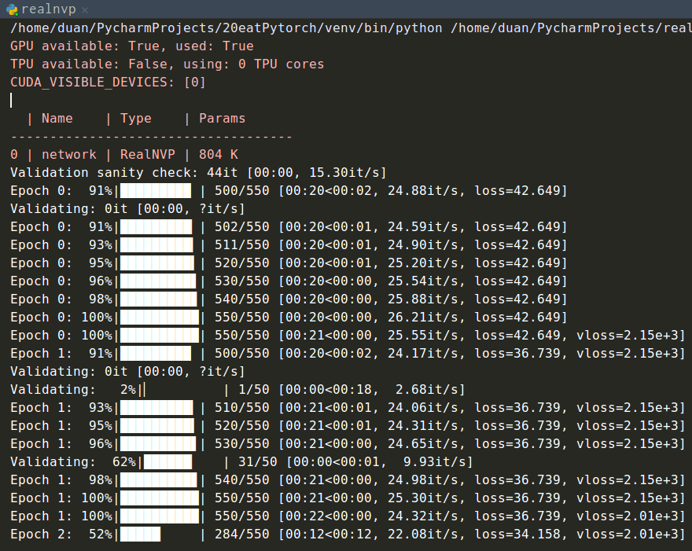

#　NICE 复现

## pytorch版

输入参数

```python
parser.add_argument('--dataset',help='dataset to be modeled.',type=str,default='mnist')
parser.add_argument('--batch_size',help='number of images in a mini-batch.',type=int,default=200)
parser.add_argument('--latent',help='latent distribution.',type=str,default='logistic')
parser.add_argument('--max_iter',help='maximum number of iterations.',type=int,default=50)
parser.add_argument('--sample_size',help='number of images to generate.',type=int,default=64)
parser.add_argument('--lr',help='initial learning rate.',type=float,default=1e-3)
parser.add_argument('--momentum',help='beta1 in Adam optimizer.',type=float,default=0.9)
parser.add_argument('--decay',help='beta2 in Adam optimizer.',type=float,default=0.999)
parser.add_argument('--coupling',help='.',type=int,
                        default=4)
parser.add_argument('--save-every',
                        help='every how many epochs to save the model',
                        type=float,
                        default=5)
parser.add_argument('--coup-type',
                        help="coupling type",
                        type=str,
                        default="additive")
parser.add_argument('--mid-dim',
                        help='.',
                        type=int,
                        default=1000)
parser.add_argument('--hidden',
                        help='.',
                        type=int,
                        default=5)
```


