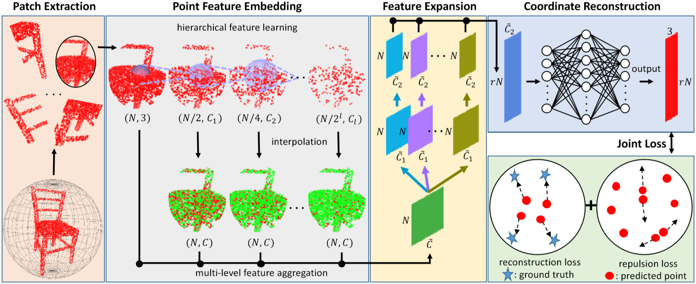

# PU-GAN 阅读

## PU-GAN

2020-08-22 17:25:14

2021-01-01

## PU-NET

​	Point Cloud Upsampling Network

### Abstart

​	由于数据的稀疏性和不规则性，使用深度网络学习和分析3D点云具有挑战性。 在本文中，我们提出了一种**数据驱动**的点云上采样技术。 

​	核心思想是学习每个点的多层次特征，然后利用不同的卷积分支在特征空间中进行扩充， 然后将扩充后的特征进行分解并重建为上采样点云集。

​	我们的网络是在块级别实现的，并且使用了联合的损失函数使得上采样后的点在潜在的曲面上分布一致。

​	我们使用合成和扫描数据进行了各种实验，以评估我们的方法，并证明了其相对于某些基准方法和基于优化的方法的优越性。结果表明，我们的上采样点具有更好的均匀性，并且更靠近下层表面。

----

### Architecture

**Fig. 1 PU-Net的网络架构.** 输入具有 N 个点，而输出具有 rN 个点，其中 r 是上采样率。$C_i$，$\tilde{C}$ 和 $\tilde{C}_{i}$ 表示特征通道数目。我们通过插值为原始的 N 个点恢复不同的级别特征，并通过卷积将所有级别特征缩减为固定维度 $C$ 。点云特征集成（embedding）模块中的红色表示原来的和逐步降采样的点，绿色显示恢复的特征。 我们联合使用重建损失函数和互斥损失函数用来端到端地训练上采样网络。

​	

​	给定一个具有不均匀分布的点坐标的3D点云，我们的网络旨在输出一个更密集的点云，该点云遵循目标对象的基础表面同时分布均匀。

​	PU-Net有四个组件：块提取 Patch Extraction、点特征集成 Point Feature Embedding、特征扩张 Feature Expansion和坐标重建 Coordinate Reconstruction。

​	首先，我们从给定的一组先验3D模型中提取具有不同尺度和分布的**点块**（第2.1节）。

​	然后，点特征集成组件通过**分层特征学习**和**多级特征聚合**将原始3D坐标映射到特征空间（第2.2节）。

​	之后，我们使用特征扩展组件**扩展特征的数量**（第2.3节）

​	并通过坐标重建组件中的一系列全连接层重建输出点云的3D坐标（第2.4节）。

#### Patch Extraction

​	我们采集一组3D物体作为训练的先验信息。 这些物体涵盖了各种各样的形状，从光滑的表面到具有尖锐的边缘和角落的形状。本质上，要使我们的网络对点云进行上采样，它应该从对象中学习局部几何模式。这促使我们采取基于块的方法来训练网络并学习几何语义。 

​	详细地说，我们随机选择这些物体表面上的 M 个点。从每个选定的点开始，我们在物体上生成一个曲面块，以使该块上的任何点都与曲面上的选定点相距一定的测地线距离（$d$）。 然后，我们使用Poisson盘采样在每个块上随机生成 N 个点，作为块上的参考真值分布。 在我们的上采样任务中，局部和全局上下文都有助于平稳而均匀的输出。 因此，我们用不同的大小设置 $d$ ，以便我们可以以不同的尺度和密度提取先前物体上的点块。

geodesic distance 三维空间中两点的最短路径

---

#### Point Feature Embedding

​	神经网络浅层特征一般反映着局部的小尺度特征，为了更好的上采样结果，采用skip-connection来聚集不同层的特征。

​	由于在分层特征提取中逐步对每个小块的输入进行二次下采样，通过PointNet++中的插值方法，首先从下采样的点特征中上采样恢复所有原始点的特征N×Cl ，从而连接每个级别的点特征。具体而言，插值点x在l水平上的特征通过以下方式计算:

​	为了从块中学习局部和全局几何背景，我们考虑以下两种特征学习策略，它们的优势是相辅相成的：

​	

##### Hierarchical feature learning 层次特征学习

​	渐进地捕获越来越多的层次结构特征已被证明是提取局部和全局特征的有效策略。 因此，我们采用PointNet++ [30]中最近提出的分层特征学习机制作为网络中最重要的部分。 

​	为了采用分层特征学习进行点云上采样，我们具体在每个级别使用相对较小的分组半径，因为生成新点通常比[30]中的高级识别任务涉及更多的局部上下文。

​	abstraction

##### Multi-level feature aggregation 多级特征聚合

​	网络中的较低层通常对应于较小规模的局部特征，反之亦然。 为了获得更好的上采样结果，我们应该最佳地汇总不同级别的要素。以前的一些工作采用跳过连接进行级联的多级特征聚合[25、32、30]。 但是，这种自上而下的传播方式对于汇总我们的上采样问题中的特征并不是非常有效。 因此，我们建议直接组合不同级别的特征，并让网络了解每个级别的重要性[11、38、12]。 

​	由于在每个块上设置的输入点（请参见图1中的点特征嵌入）在层次特征提取中逐步进行了二次采样，因此我们首先通过PointNet++中的插值方法从下采样后的点特征中恢复所有原始点的特征，从而将每个级别的点特征连接起来。 具体来说，级别`中的插值点x的特征可通过以下公式计算：
$$
f^{(\ell)}(x)=\frac{\sum_{i=1}^{3} w_{i}(x) f^{(\ell)}\left(x_{i}\right)}{\sum_{i=1}^{3} w_{i}(x)}
$$
​	其中 $w_{i}(x)=1 / d\left(x, x_{i}\right)$ 是距离权重的倒数，而xi，x2，x3是级别`中x的三个最近邻居。 然后，我们使用1×1卷积将不同级别的插值特征缩减为相同的维数，即C.最后，我们将每个级别的特征连接为嵌入点特征f。

​	

---

#### Feature Expansion

​	在Point Feature Embedding之后，扩展了特征空间中的特征数量, 这相当于扩展点的数量，因为点和特征是可以互换的。假设f的维数是N×C’，N是输入点的数目，C’是级联集成特征的特征维数。特征扩展操作将输出维数为rN×C的特征f，其中r是上采样率，C是新的特征维数。本质上，这类似于图像相关任务中的特征上采样，这可以通过反卷积或插值来完成。然而，由于点的非规则性和无序特性，将这些操作应用于点云并不容易。

​	因此，提出了一种基于子像素卷积层的有效特征扩展操作：

​	其中C i 1 ( ∙ ) C^1_i(\bullet)*C**i*1(∙)和C i 2 ( ∙ ) C^2_i(\bullet)*C**i*2(∙)是两组分开的1x1的卷积。意思就是通过两次卷积操作C i 1 ( ∙ ) C^1_i(\bullet)*C**i*1(∙)和C i 2 ( ∙ ) C^2_i(\bullet)*C**i*2(∙)将N × C ~ N ×\tilde C*N*×*C*~先后变成r r*r*个N × C ~ 1 N ×\tilde C_1*N*×*C*~1的特征层，再变成r r*r*个N × C ~ 2 N ×\tilde C_2*N*×*C*~2的特征层，最后拼接成N × r C ~ 2 N × r\tilde C_2*N*×*r**C*~2的特征图。R S RS*R**S*是Reshape的操作，将N × r C ~ 2 N × r\tilde C_2*N*×*r**C*~2转换为r N × C ~ 2 rN ×\tilde C_2*r**N*×*C*~2。

​	我们强调，Point Feature Embedding的特征已经通过高效的多级特征聚合封装了来自邻域点的相对空间信息，因此在执行此特征扩展操作时，我们不需要明确考虑空间信息。

​	值得一提的是，从每个集合中的第一卷积C i 1 ( ) C^1_i()*C**i*1()生成的r r*r*个特征集合具有高相关性，这将导致最终重建的3D点彼此过于接近。因此，我们进一步为每个特征集添加另一个卷积(具有单独的权重)。由于我们训练网络学习r r*r*个特征集的r个不同卷积，这些新特征可以包含更多样的信息，从而减少它们的相关性。这种特征扩展操作可以通过对r r*r*个特征集应用分离的卷积来实现。它也可以通过计算效率更高的分组卷积来实现。

---

#### Coordinate Reconstruction

​	在本部分中，我们将从扩展的特征中以 $r N \times \tilde{C}_{2}$ 的大小重建输出点的3D坐标。 具体来说，我们通过每个点的特征上的一系列全连接层对3D坐标进行回归，最终输出上采样点维度为 $r N \times 3$。

---

## PointNet++