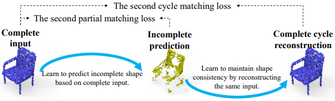
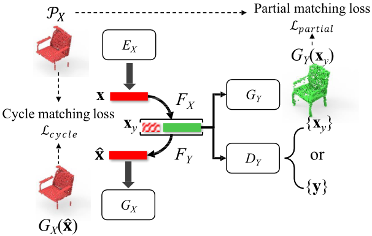
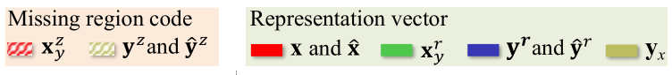
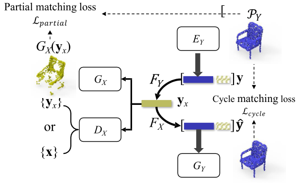

# Cycle4Completion

CVPR2021：  Unpaired Point Cloud Completion using Cycle Transformation with Missing Region Coding

---

## Abstract

In this paper, we present a novel unpaired point cloud completion network, named Cycle4Completion, to infer the complete geometries from a partial 3D object.      在本文中，我们提出了一种新颖的不成对的点云完成网络，称为 `Cycle4Completion`，可以从部分3D对象推断出完整的几何形状。

Previous unpaired completion methods merely focus on the learning of geometric correspondence from incomplete shapes to complete shapes, and ignore the learning in the reverse direction, which makes them suffer from low completion accuracy due to the limited 3D shape understanding ability. 先前的不成对完成方法仅专注于**从不完整形状到完整**形状的几何对应关系的学习，而**忽略了相反方向**的学习，这使得它们由于3D形状理解能力有限而遭受较低的完成精度。

To address this problem, we propose two simultaneous **cycle transformations** between the latent spaces of complete shapes and incomplete ones. 为了解决这个问题，我们提出了完全形状和不完全形状的潜在空间之间的两个同时**循环变换**。

Specifically, the first cycle transforms shapes from incomplete domain to complete domain, and then projects them back to the incomplete domain. This process learns the geometric characteristic of complete shapes, and maintains the shape consistency between the complete prediction and the incomplete input. 具体来说，第一个循环将形状从不完整域转换为完整域，然后将其投影回不完整域。此过程了解完整形状的几何特征，并保持完整预测和不完整输入之间的形状一致性。 

Similarly, the inverse cycle transformation starts from complete domain to incomplete domain, and goes back to complete domain to learn the characteristic of incomplete shapes. 类似地，逆循环变换从完整域开始到不完整域，然后返回到完整域以学习不完整形状的特征。 

We experimentally show that our model with the learned bidirectional geometry correspondence outperforms state-of-the-art unpaired completion methods. 我们通过实验证明，具有学习到的双向几何对应关系的模型优于最新的不成对完成方法。

---

## 1. Introduction

Point clouds, as a popular 3D representation, can be easily produced by 3D scanning devices and depth cameras. However, due to the limitations of the view angles of camera/scanning devices and self-occlusion, raw point clouds are often sparse, noisy and partial, which usually require shape completion before being analyzed in further applications such as shape classification [25, 17], retrieval [14, 8, 15], semantic/instance segmentation [22, 35]. Although the recent data-driven supervised completion methods [31, 40, 37, 39, 19, 21] have achieved impressive performance, they heavily rely on the paired training data, which consists of incomplete shapes and their corresponding complete ground truth. In real-world applications, however,
such high quality and large-scale paired training dataset is not easy to access, which makes it hard to directly train a supervised completion network.

点云作为一种流行的3D表示形式，可以通过3D扫描设备和深度相机轻松生成。 但是，由于相机/扫描设备的视角和自闭塞的限制，原始点云通常稀疏，嘈杂且局部，通常需要在完成其他应用（例如形状分类）之前对形状进行完善[25，17 ]，检索[14、8、15]，语义/实例分割[22、35]。 尽管最近的数据驱动的监督完成方法[31、40、37、39、19、21]取得了骄人的成绩，但它们**严重依赖配对的训练数据**，该训练数据由不完整的形状及其相应的完整的G.T. 组成。但是，在实际应用中，如此高质量和大规模的成对训练数据集并不容易访问，这使得直接训练受监督的完成网络变得困难。

A promising but challenging solution to this problem is to learn a completion network in an unpaired way, where the common practice is to establish the shape correspondence between the incomplete shapes and complete ones from the unpaired training data without requiring the incomplete and complete correspondence. The latest work like Pcl2Pcl [3]  introduced an adversarial framework to merge the geometric gap between the complete shape distribution and incomplete one in the latent representation space. Although many efforts have been made to learn the geometric correspondence from incomplete shapes to complete ones, previous methods ignore the inverse correspondence from complete
shapes to incomplete ones, which leads to low completion accuracy due to the limited 3D shape understanding ability. 

解决此问题的一个有希望但具有挑战性的解决方案是以不成对的方式学习补全网络，通常的做法是从不成对的训练数据中建立**不完整**的形状和**完整**的形状之间的**形状对应关系**，而无需不完整和完整的对应关系。像Pcl2Pcl[3] 这样的最新作品引入了一种对抗性框架，用于合并潜在表示空间中完整形状分布和不完整形状之间的几何间隙。尽管已经进行了许多努力来学习从不完整形状到完整形状的几何对应关系，但是先前的方法忽略了从完整形状到不完整形状的逆对应关系，这由于有限的3D形状理解能力而导致较低的完成精度。

To address this problem, we propose a novel unpaired point cloud completion network, named Cycle4Completion, to establish the geometric correspondence between incomplete and complete shapes in both directions. We achieve this by designing two cycle transformations, i.e. the incomplete cycle transformation (incomplete-cycle) and the complete cycle transformation (complete-cycle), as shown in Figure 1. The incomplete-cycle in Figure 1(a) learns the mapping from the incomplete domain to the complete one, which is then projected back to the incomplete domain. On the other hand, the complete-cycle in Figure 1(b) provides the completion knowledge on the inverse direction with incomplete input, which can be used to further enhance the incompletion quality for incomplete-cycle.

为了解决这个问题，我们提出了一个新的不成对的点云完成网络，称为Cycle4Completion，以建立**两个方向**上不完整和完整形状之间的几何对应关系。 我们通过设计两个周期转换来实现此目的，即不完整周期转换（incomplete-cycle）和完整周期转换（complete-cycle），如图1所示。图1（a）中的不完整周期从中学习映射 将不完整的域转换为完整的域，然后将其投影回不完整的域。 另一方面，图1（b）中的完整循环提供了具有不完整输入的反方向的完整知识，可用于进一步提高不完整循环的不完整质量。

**Fig. 1.a** 循环变换的图示，它由两个逆循环组成，如（a）和（b）所示。 循环变换通过学习从互补形状生成完整或不完整的形状，从而使网络了解3D形状。

**Fig. 1.b** 循环变换的图示，它由两个逆循环组成，如（a）和（b）所示。 循环变换通过学习从互补形状生成完整或不完整的形状，从而使网络了解3D形状。

 

**图2.a** 目标混乱的问题。 基于神经网络的变换FX可以学习将多个不完整的输入（A1，A2，A3）投影到一个完整的目标（A）中，但是其逆变换FY无法学习将一个完整的输入投影到多个不完整的目标中。

但是，如图2（a）所示，直接在潜在空间中应用循环变换会遇到一个新问题，我们将其称为**目标混淆问题**。 当建立从多个不完整形状（例如A1，A2和A3）到一个完整形状（例如A）的形状对应关系时，会出现此问题。 这是因为一个循环需要网络根据完整的输入来预测不完整的形状，并且相应的转换网络FY无法仅通过深层神经网络将一个完整的输入完全映射到多个不同的不完整的目标中。 为了解决这个问题，我们提出了可学习的缺失区域编码（MRC），将不完整的形状转换为完整的形状，如图2（b）所示。

**图2.b** 缺失区域编码的解决方案。 我们建议使用可学习的代码Z（在上图中表示为Z1，Z2，Z3）来编码缺失区域

不完整形状的表示可以分解为两部分：一个是其相应完整形状的表示A，另一个是用于编码其缺失区域的代码 Z。 从不完整的形状预测完整形状时，仅考虑表示A，而从完整的形状预测不完整形状时，则考虑表示 A 和编码 Z。 因此，转换网络 FY 将通过学习将一个完整的输入投影到几个不完整的目标来减轻混乱。 取而代之的是，可学习的缺失区域代码Z可以帮助网络澄清哪个不完整形状是当前的转换目标，并缓解目标混乱的问题。 我们的主要贡献概述如下。

- We propose a novel unpaired point cloud completion network, named Cycle4Completion. Compared with previous unpaired completion methods which only consider the single-side correspondence from incomplete shapes to complete ones, Cycle4Completion can enhance the completion performance by establishing the geometric correspondence between complete shapes and incomplete shapes from both directions.我们提出了一种新颖的不成对的点云完成网络，称为Cycle4Completion。与以前的不成对完成方法仅考虑从不完整形状到完整形状的单边对应关系相比，Cycle4Completion可以通过在两个方向上在完整形状和不完整形状之间建立几何对应关系来提高完成性能。
- We propose the partial matching loss and cycle matching loss, and combine them with the cycle transformations to establish the bidirectional geometric correspondence between the complete and incomplete shapes, and maintain the shape consistency throughout the whole transformation process.我们提出了局部匹配损失和循环匹配损失，并将它们与循环变换相结合，以建立完整和不完整形状之间的双向几何对应关系，并在整个变换过程中保持形状一致性。
- We propose the missing region coding to decompose the incomplete shape representation into a representation of its corresponding complete shape, and a missing region code to encode the missing regions of the incomplete shapes, respectively. This solves the target confusion when the network tries to predict multiple incomplete shapes based on a single complete shape. 我们建议使用缺失区域编码将不完整的形状表示分解为对应的完整形状的表示，并提出缺失区域代码分别对不完整形状的缺失区域进行编码。 当网络尝试基于单个完整形状预测多个不完整形状时，这解决了目标混乱。

## 2. Related Work

近年来，3D形状补全已引起越来越多的关注。 先前的补全方法可以大致分为两类，即传统方法和基于深度学习的方法，我们将在下面详细介绍。

**Traditional approaches for 3D shape completion.** 

基于传统几何/统计的方法[30、1、34、27、24、28]利用部分输入上的曲面的几何特征来生成3D形状的缺失区域[30、1、32、34]或利用 大型形状数据库以搜索相似的形状/补丁来填充3D形状的缺失区域[27、20、24、28]。 例如，Hu等人[34] 提出通过定义点云的平滑和去噪特性并在相似区域中全局搜索缺失区域，来利用点云的局部平滑度和非局部自相似性。 另一方面，数据驱动的形状完成方法，如Shen等[28]。 将3D形状的完成过程作为自下而上的零件组装过程进行描述，其中以3D形状存储库为参考来恢复各种高级完整结构。 总之，这些传统的形状完成方法主要基于手工规则来描述缺失区域的特征以及缺失区域与完整形状之间的相似性。 因此，这种方法的泛化能力通常受到限制。 例如，Sung等人[30]提出的方法。 预定义3D形状的语义部分的几类，并使用几何特征（例如部分位置，比例和方向）从形状数据库中查找缺失区域的相似部分。 这种方法通常在形状更复杂的情况下失败，这超出了预定义的语义部分类别或几何特征的描述。相反，基于深度学习的完成方法可以学习更灵活的功能，以根据不完整的输入预测完整的形状。这种方法将在下面的小节中详细介绍。

**Deep learning approaches for 3D shape completion.** 

第二类包括基于神经网络的方法，该方法利用深度学习从输入形状[15、10、9、11、22]中学习表示形式，并使用编码器-解码器框架根据表示来预测完整形状 。 该类别可以根据不同的输入形状形式进一步分类，包括：体积形状完成度[4、6、29] 和点云完成度[40、31、26、18、33]。 我们的 Cycle4Completion 也属于这一类，它完成了由点云表示的 3D 形状。 最近的著名研究，例如 MAPVAE [16]，TopNet [31]和SA-Net [36]在监督点云完成任务上取得了令人印象深刻的结果。

此外，RL-GAN-Net [26]在对抗训练中引入了强化学习，以进一步改善生成的完整点云的真实性和一致性。 但是，尽管在有监督的点云完成任务上已取得了很大的进步，但此任务在很大程度上取决于配对的训练数据，但是很少有用于不完整的真实世界扫描的配对G.T.。 另一方面，关于未配对点云完成任务的研究很少。 作为一项开创性的工作，AML [29]直接测量了不完整和完整形状的潜在表示之间的最大可能性。 遵循类似的做法，Pcl2Pcl [3]引入了GAN框架来弥合不完整和完整形状之间的语义鸿沟。

与上述未配对方法相比，我们的Cycle4Completion还通过在潜在空间中从两个方向进行循环变换来建立自监督，这可以为学习不完整形状和完整形状之间的双向几何对应关系提供更好的指导。

**Relationships with GANs.** 

二维域中不成对的样式传输网络CycleGAN，其简单的 cycle-consistency 循环一致性损失通常无法指导生成器推断缺失的形状，因为为不完整的输入设想一致的缺失形状会更加复杂 而不是转移样式。

因此，我们建议在**潜在空间中**执行循环变换，其中提出了部分和循环匹配损失以保持传递的形状一致性。 考虑到 3D 补全本质上是从 3D 形状到 3D 形状的重建过程，因此从 2D 图像[12、7、13]重建 3D 形状也是一个值得注意的研究方向，与3D补全密切相关。 两项任务之间的区别在于，从 2D 图像进行 3D 重建不需要输入3D信息，而基于 3D 形状的完成任务则需要 3D 形状信息作为输入。

---

## 3. The Architecture of Cycle4Completion

### 3.1. Formulation

如图3（a）所示，令 $ \mathcal{P}_{X}=\left\{\mathbf{p}_{i}^{x}\right\} $ 表示不完整形状的点云，而 $ \mathcal{P}_{Y}=\left\{\mathbf{p}_{i}^{y}\right\} $ 表示完整的点云。 我们的目标是学习不完整形状的潜在表示 $ {x} $ 与完整形状的潜在表示 ${y}$ 之间的两个映射 $ F_{X} $ 和 $ F_{Y} $。 这些表示分别由点云编码器 $ E_{X}: \mathcal{P}_{X} \rightarrow \mathbf{x} $ 和 $ E_{Y}: \mathcal{P}_{Y} \rightarrow \mathbf{y} $ 生成，它们分别在自动编码器框架下与点云生成器 $G_{X}$ 和 $G_Y$ 一起训练。 另外，引入了两个对抗鉴别器 $D_X$ 和 $D_Y$ 。 $D_X$ 旨在区分 ${\mathbf{x}}$ 和 ${\mathbf{y}_{x}}$，其中 $ \mathbf{y}_{x}=F_{Y}(\mathbf{y}) $。  $D_Y$ 旨在区分 ${\mathbf{y}}$ 和 ${\mathbf{x}_{y}}$，其中 $ \mathbf{x}_{y}=F_{X}(\mathbf{x}) $。我们将两个函数 $F_X$ 和 $F_Y$ 的复合运算表示为 $F_X F_Y$。

**Fig. 3(a)** （a）中的整体结构包括（b）中的不完整周期变换以及（c）中的完整周期变换。 两个循环都使用自我重建来学习形状一致性

### 3.2. 用于学习潜在空间的编码器-解码器

两个自动编码器分别学习不完整和完整形状的潜在表示空间。我们将两个点云 $ \mathcal{P}_{1} $ 和 $ \mathcal{P}_{2} $ 之间的完整倒角距离（CD）定义为
$$
\begin{equation}
 \mathcal{L}_{\mathrm{CD}}\left(\mathcal{P}_{1} \leftrightharpoons \mathcal{P}_{2}\right)=\sum_{\mathbf{p}_{i}^{1} \in \mathcal{P}_{1}} \min _{\mathbf{p}_{i}^{2} \in \mathcal{P}_{2}}\left\|\mathbf{p}_{i}^{1}-\mathbf{p}_{i}^{2}\right\|+\sum_{\mathbf{p}_{i}^{2} \in \mathcal{P}_{2}} \min _{\mathbf{D}_{i}^{1} \in \mathcal{P}_{1}}\left\|\mathbf{p}_{i}^{2}-\mathbf{p}_{i}^{1}\right\| . 
\end{equation} \tag{1}
$$
用于训练自动编码器框架的重建损耗 $ \mathcal{L}_{A E} $ 公式为：
$$
\begin{equation}
 \mathcal{L}_{A E}=\mathcal{L}_{C D}\left(\mathcal{P}_{X} \leftrightharpoons G_{X}(\mathbf{x})\right)+\mathcal{L}_{C D}\left(\mathcal{P}_{Y} \leftrightharpoons G_{Y}(\mathbf{y})\right) 
\end{equation}\tag{2}
$$

---

### 3.3. Cycle Transformation

#### Transformation with missing region coding. 

**Fig. 3(b)** 不完整周期变换，该变换从不完整的输入（红色）产生完整的预测（绿色）

对于图3（b）中的不完整循环变换，当 $\mathbb{x}$ 从不完整域转换为完整域 $ \mathbf{x}_{y} $ 时，$F_X$ 会生成缺失区域代码 $ \mathbf{x}_{y}^{z} $ 和完整形状表示 $ \mathbf{x}_{y}^{r} $。 因此，$ \mathbf{x}_{y} $ 可以进一步表示为 $ \mathbf{x}_{y}=\left[\mathbf{x}_{y}^{r}: \mathbf{x}_{y}^{z}\right] $ 。 备注“：”表示两个特征向量的串联。 然后，基于 $ G_{Y} $ 的 $ \mathbf{x}_{y}^{r} $ 预测完整形状为 $ G_{Y}\left(\mathbf{x}_{y}^{r}\right) $。 判别器 $D_Y$ 仅在  $ \mathbf{x}_{y}^{r} $  和 $y$ 之间进行判别。 为了在变换过程中建立形状一致性，$ \mathbf{x}_{y} $ 再次由 $ F_{Y} $ 投射回不完全域，表示为 $ \hat{\mathbf{x}} $。 循环重建的形状由 $ G_{X} $ 预测，表示为 $ G_{X}(\hat{\mathbf{x}}) $。

对于图3（c）中的完整循环变换，编码器 $ E_{Y} $ 直接预测完整的形状表示 $ \mathbf{y}^{r} $。 为了预测不完整的形状，我们从 $[0,1]$ 之间的均匀分布（表示为 $ \mathbf{y}^{z} $）和与$ \mathbf{y}^{r} $（表示 $ \mathbf{y}=\left[\mathbf{y}^{r}: \mathbf{y}^{z}\right] $ ）之间的均匀分布中随机采样缺失的区域代码。 然后，变换网络 $ F_{Y} $ 将 $ \mathbf{y} $ 变换为不完整域，记为 $ \mathbf{y}_{x} $。 与不完全循环变换类似，基于  $ \mathbf{y}_{x} $ 由 $ G_{X} $ 预测不完全形状，记为 $ G_{X}\left(\mathbf{y}_{x}\right) $ 。 判别器 $ D_{X} $ 在 $ \mathbf{y}_{x} $ 和 $ \mathbf{x} $ 之间进行判别。 遵循不完全循环变换的反方向，通过预测重构形状 $ G_{Y}(\hat{\mathbf{y}}) $ 来建立完整周期变换期间的形状一致性，其中 $ \hat{\mathbf{y}}=F_{X}\left(\mathbf{y}_{x}\right) $。 请注意，与 $ \mathbf{y} $ 相同，$ \hat{\mathbf{y}} $ 还包含完整的表示 $ \hat{\mathbf{y}}^{r} $ 和缺失的区域代码 $ \hat{\mathbf{y}}^{z} $

---

#### Code matching Loss.

在图3（c）的完整循环变换中，从均匀分布中采样缺失区域代码y z，以便从当前完整输入P Y创建缺失区域。 在形状P Y通过F Y和F X循环之后，变换网络F Y F X预测出新的缺失区域代码y y z。 因为y z和ˆ y z都对应于相同的不完整形状，所以两个代码应相等。 因此，我们建议使用y z和ˆ y z之间的欧几里得距离作为代码匹配损耗，可以表示为：
$$
\begin{equation}
 \mathcal{L}_{\text {code }}=\left\|\mathbf{y}^{z}-\hat{\mathbf{y}}_{z}\right\|^{2} $
\end{equation}\tag{3}
$$

#### **Cycle matching loss.** 

循环匹配损耗的目的是使循环重建G Y（/ y）/ G X（ˆ x）的形状与它们相应的输入P Y / P X匹配，这应在整个转换过程中保持形状一致性。 具体而言，我们将循环匹配损耗定义为输入P Y / P X与重构点云G Y（ˆ y）/ G X（ˆ x）之间的完整倒角距离，即L CD（P X？
   G X（ˆ x））和L CD（P Y？G Y（ˆ y））。 然后我们将转移网络F X和F Y的全周期匹配损失表示为：
$$
\begin{equation}
 \mathcal{L}_{\text {cycle }}=\mathcal{L}_{\mathrm{CD}}\left(\mathcal{P}_{X} \leftrightharpoons G_{X}(\hat{\mathbf{x}})\right)+\mathcal{L}_{\mathrm{CD}}\left(\mathcal{P}_{Y} \leftrightharpoons G_{Y}(\hat{\mathbf{y}})\right) 
\end{equation}\tag{4}
$$

#### **Partial matching loss.** 

部分匹配损耗是方向性约束，旨在将一种形状匹配到另一种形状，而无需在反方向上进行匹配。 在以前的工作[3]中可以找到类似的做法，该工作采用定向Hausdoff距离将完全预测与不完全输入部分匹配。 但是，单方向的局部匹配不能为推断缺失区域提供进一步的指导，因此我们将局部匹配集成到循环变换中以在两个方向上建立更全面的几何对应关系。 我们将两个点云P 1和P 2之间的部分倒角距离定义为：
$$
\begin{equation}
 \mathcal{L}_{\mathrm{CD}^{\prime}}\left(\mathcal{P}_{1} \rightarrow \mathcal{P}_{2}\right)=\sum_{\mathbf{p}_{i}^{1} \in \mathcal{P}_{1}} \min _{\mathbf{p}_{i}^{2} \in \mathcal{P}_{2}}\left\|\mathbf{p}_{i}^{1}-\mathbf{p}_{i}^{2}\right\| 
\end{equation}\tag{5}
$$

这是仅要求P 2的形状与P 1的形状部分匹配的约束。 对于图3（b）中的不完整周期，部分匹配损耗表示为L CD 0（PX→GY（xry）），对于图3（c）中的完整周期，部分匹配损耗表示为L CD 0  （GX（yx）→PY）。 注意，以上两个部分倒角距离的方向总是从不完整的形状指向完整的形状，这保证了不完整的形状部分地匹配完整的形状，无论是预测的还是真实的。 全部的部分匹配损耗定义为：L部分= L CD 0（P X→G Y（x r y））+ L CD 0（G X（y x）→P Y）。
   （6）

#### Adversarial loss

To further bridge the geometric gap be-
tween the latent representations of complete and incomplete
shapes, the adversarial learning framework is adopted as an
unpaired constraint. Specifically, two discriminators D X
and D Y are used to distinguish the real and fake representa-
tions in the incomplete and complete domains, respectively.
The D X in incomplete domain discriminates between the
real latent representations {x} and the fake latent represen-
tations {y x }; in the same way, the D Y in complete domain
discriminates between {y} and {x y }. In order to stabilize
the training, we formulate the objective loss for discrimina-
tor under the WGAN-GP [5] framework. For simplicity, we
formulate the loss for D X as:
$$
\begin{equation}
 \mathcal{L}_{D_{X}}=\mathbb{E}_{\mathbf{x}} D_{X}(\mathbf{x})-\mathbb{E}_{\mathbf{y}_{x}} D_{X}\left(\mathbf{y}_{x}\right)+\lambda_{g p} \mathcal{T}_{D_{X}} 
\end{equation}\tag{7}
$$

where λ gp is a pre-defined weight factor and T D X is gradi-
ent penalty term, denoted as:
$$
\begin{equation}
 \mathcal{T}_{D_{X}}=\mathbb{E}_{\mathbf{x}}\left[\left(\left\|\nabla_{\mathbf{x}} D_{X}(\mathbf{x})\right\|_{2}-1\right)^{2}\right] 
\end{equation}\tag{8}
$$
The discriminator loss L D Y for D Y can be formulated in
the same way. The final adversarial losses for generator
{F X ,F Y } and discriminator {D X ,D Y } are given as
$$
\begin{equation}
 \mathcal{L}_{D}=\mathcal{L}_{D_{X}}+\mathcal{L}_{D_{Y}} \tag{9}\\ 
\end{equation}
$$

$$
\mathcal{L}_{G}=\mathbb{E}_{\mathbf{y}_{x}}  D_{X}\left(\mathbf{y}_{x}\right)+\mathbb{E}_{\mathbf{x}_{y}}  D_{Y}\left(\mathbf{x}_{y}^{r}\right) \tag{10}
$$

## 5. Conclusions

我们提出了不成对点的 Cycle4Completion 来处理点云补全任务。我们的模型成功捕捉到收入和收入之间的双向几何对应完整的形状，使学习没有成对完整形状的点云完成。 我们的模型有效地学习生成假的不完整 引导完成网络的形状。拟议的Cy- cle4Completion在广泛使用的ShapeNet上进行评估 数据集，实验结果表明 与其他不成对的组件相比 完全方法。