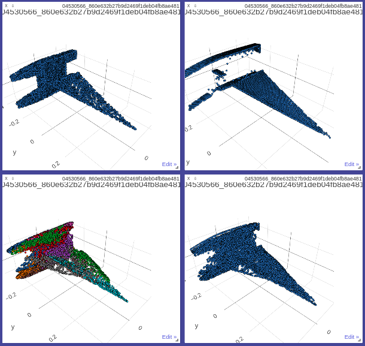
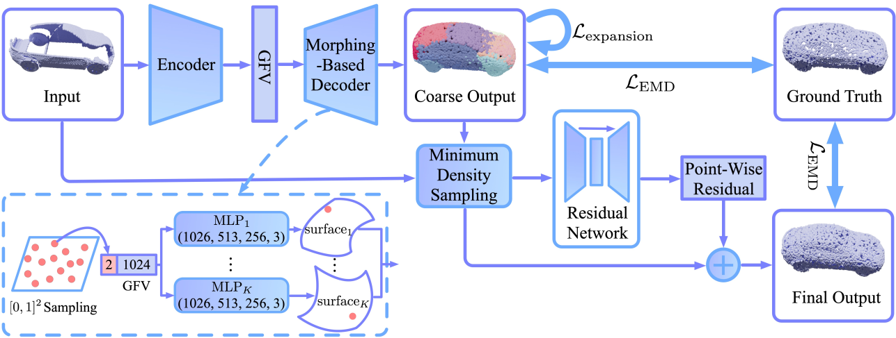
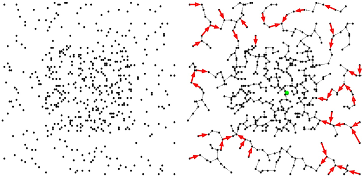
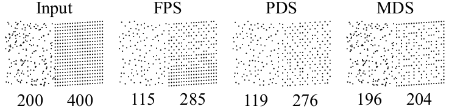
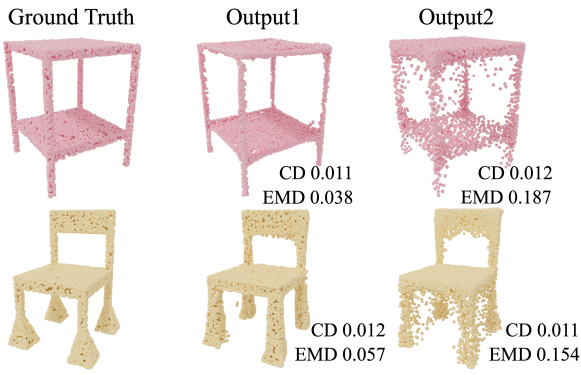

# MSN-Code

https://github.com/Colin97/MSN-Point-Cloud-Completion

```bash
# MSN
docker run --runtime=nvidia --rm -it -p 127.0.0.2:8097:8097 -w /home -v /home/duan/windows/udata:/home/data/ -v /tmp/.X11-unix:/tmp/.X11-unix -e DISPLAY=unix$DISPLAY -e GDK_SCALE -e GDK_DPI_SCALE nvidia/cudagl:duan

docker commit -p 06ea5c52cbaa nvidia/cudagl:duan
python -m visdom.server # 开启visdom服务

http://127.0.0.2:8097/

# /usr/local/lib/python3.6/dist-packages/
```


## val.py

```python
with torch.no_grad(): #验证关闭梯度计算
    partial # 10 5000 3 10个网络补全数据
    gt      # 10 5000 3 10个原始完整数据
	
    output1 ,output2, expansion_penalty  = network(partial.transpose(2,1).contiguous()) 
    # jump to model.py class MSN [10,8192,3] [10,8192,3] 1
    dist, _ = EMD(output1, gt, 0.002, 10000)
    emd1 = torch.sqrt(dist).mean()
    dist, _ = EMD(output2, gt, 0.002, 10000)
    emd2 = torch.sqrt(dist).mean()
    return emd1, emd2, expansion_penalty
```


## model.py

```python
class MSN(nn.Module):
    def __init__(self, num_points = 8192, bottleneck_size = 1024, n_primitives = 16):
        super(MSN, self).__init__()
        self.num_points = num_points
        self.bottleneck_size = bottleneck_size
        self.n_primitives = n_primitives
        self.encoder = nn.Sequential(                #编码器
        PointNetfeat(num_points, global_feat=True),
        nn.Linear(1024, self.bottleneck_size),
        nn.BatchNorm1d(self.bottleneck_size),
        nn.ReLU()
        )
        self.decoder = nn.ModuleList([PointGenCon(bottleneck_size = 2 +self.bottleneck_size) for i in range(0,self.n_primitives)])
        self.res = PointNetRes()
        self.expansion = expansion.expansionPenaltyModule()

    def forward(self, x):
        partial = x			# [10 5000 3]
        x = self.encoder(x) # [10 1024] 全局特征
        outs = []
        for i in range(0,self.n_primitives):
            rand_grid = Variable(torch.cuda.FloatTensor(x.size(0),2,self.num_points//self.n_primitives)) #10, 2, 512 variable 参与反向传播
            rand_grid.data.uniform_(0,1) # 生成0 1 之间的实数
            y = x.unsqueeze(2).expand(x.size(0),x.size(1), rand_grid.size(2)).contiguous() #对x升维度[10 1024 512]
            y = torch.cat( (rand_grid, y), 1).contiguous() # 拼接y [10 1026 512]
            outs.append(self.decoder[i](y)) # 00-15  [10,3,512]

        outs = torch.cat(outs,2).contiguous()    # [10,3,8192]
        out1 = outs.transpose(1, 2).contiguous() # [10,8192,3]
        
        dist, _, mean_mst_dis = self.expansion(out1, self.num_points//self.n_primitives, 1.5)# dist         [10,8192] 路径     mean_mst_dis [10]      平均最小生成树路径
        loss_mst = torch.mean(dist)# 平均loss

        id0 = torch.zeros(outs.shape[0], 1, outs.shape[2]).cuda().contiguous()# [10,1,8192]
        outs = torch.cat( (outs, id0), 1) #[10,1,8192]+[10,3,8192]=[10,4,8192]
        id1 = torch.ones(partial.shape[0], 1, partial.shape[2]).cuda().contiguous()#[10,1,5000]
        partial = torch.cat( (partial, id1), 1)#[10,1,5000]+[10,3,5000]=[10,4,5000]
        xx = torch.cat( (outs, partial), 2)#[10,4,8192]+[10,4,5000]=[10,4,8192+5000]

        # [10,3,8192] 8192 10
        resampled_idx = MDS_module.minimum_density_sample(xx[:, 0:3, :].transpose(1, 2).contiguous(), out1.shape[1], mean_mst_dis)  # [10,8192]
        xx = MDS_module.gather_operation(xx, resampled_idx) # [10,4,8192]
        delta = self.res(xx) # xx[10,4,8192] delta=[10,3,8192]
        xx = xx[:, 0:3, :]   # [10,3,8192]
        out2 = (xx + delta).transpose(2,1).contiguous()  # [10,8192,3]
        return out1, out2, loss_mst
```


## 架构

### encoder编码

```python
self.encoder = nn.Sequential(                #编码器
        PointNetfeat(num_points, global_feat=True),
        nn.Linear(1024, self.bottleneck_size),
        nn.BatchNorm1d(self.bottleneck_size),
        nn.ReLU()
        )

input  [3,5000] 3个通道数 5000个特征
output [1024]   1024维瓶颈向量
----------------------------------------------------------------
        Layer (type)               Output Shape         Param #
================================================================
        pointnetfeat                 [-1, 1024]
            Linear-7                 [-1, 1024]       1,049,600
       BatchNorm1d-8                 [-1, 1024]           2,048
              ReLU-9                 [-1, 1024]               0
```


#### class PointNetFeat()

```python
input  [3,5000] 3个通道数 5000个特征
output [1024]   1024维瓶颈向量
----------------------------------------------------------------
        Layer (type)               Output Shape         Param #
================================================================
            Conv1d-1             [-1, 64, 5000]             256
       BatchNorm1d-2             [-1, 64, 5000]             128
        		relu             [-1, 64, 5000]
            Conv1d-3            [-1, 128, 5000]           8,320
       BatchNorm1d-4            [-1, 128, 5000]             256
            	relu            [-1, 128, 5000]
            Conv1d-5           [-1, 1024, 5000]         132,096
       BatchNorm1d-6           [-1, 1024, 5000]           2,048
    			 max              [-1, 1024, 1]
        		view                 [-1, 1024]
```


------

### decoder解码-16个表面元素形成复杂的形状

```python
    self.decoder = nn.ModuleList([PointGenCon(bottleneck_size = 2 +self.bottleneck_size) for i in range(0,self.n_primitives)])

    x #[10 1024]
	for i in range(0,self.n_primitives): # 16次
            rand_grid = Variable(torch.cuda.FloatTensor(x.size(0),2,self.num_points//self.n_primitives)) # 随机网格[10 2 512]
            rand_grid.data.uniform_(0,1) # 网格内生成0 1之间的实数
            y = x.unsqueeze(2).expand(x.size(0),x.size(1), rand_grid.size(2)).contiguous() 			# 对x升维度[10 1024 512]
            y = torch.cat( (rand_grid, y), 1).contiguous() # 拼接y和随机网格[10 1026 512]
            outs.append(self.decoder[i](y)) # 00-15  [10,3,512]
```


#### class PointGenCon()

```python
input  [10,1026,512] 1026个通道数 512个点 
output [10,3,512]    3个通道数 512个点
----------------------------------------------------------------
        Layer (type)               Output Shape         Param #
================================================================
           Conv1d-10            [-1, 1026, 512]       1,053,702
      BatchNorm1d-11            [-1, 1026, 512]           2,052
        		relu
           Conv1d-12             [-1, 513, 512]         526,851
      BatchNorm1d-13             [-1, 513, 512]           1,026
            	relu
           Conv1d-14             [-1, 256, 512]         131,584
      BatchNorm1d-15             [-1, 256, 512]             512
                relu
           Conv1d-16               [-1, 3, 512]             771
             Tanh-17               [-1, 3, 512]               0
```


------

### 扩展惩罚

```python
self.expansion = expansion.expansionPenaltyModule()

dist, _, mean_mst_dis = self.expansion(out1, self.num_points//self.n_primitives, 1.5)
# dist         [10,8192] 路径
# mean_mst_dis [10]      平均mst路径
```


#### class expansionPenaltyFunction()

```python
class expansionPenaltyFunction(Function):
    @staticmethod
    def forward(ctx, xyz, primitive_size, alpha): # xyz[10,8192,3] 512 1.5
        assert(primitive_size <= 512)
        batchsize, n, _ = xyz.size()
        assert(n % primitive_size == 0)
        xyz = xyz.contiguous().float().cuda()
        dist = torch.zeros(batchsize, n, device='cuda').contiguous() #[10,8192]
        assignment = torch.zeros(batchsize, n, device='cuda', dtype=torch.int32).contiguous() - 1 # [10,8192] 值为-1
        neighbor = torch.zeros(batchsize, n * 512,  device='cuda', dtype=torch.int32).contiguous() # [10,8192*512] 
        cost = torch.zeros(batchsize, n * 512, device='cuda').contiguous()# [10,8192*512]
        mean_mst_length = torch.zeros(batchsize, device='cuda').contiguous() #[10]
        expansion_penalty.forward(xyz, primitive_size, assignment, dist, alpha, neighbor, cost, mean_mst_length)
        ctx.save_for_backward(xyz, assignment)
        return dist, assignment, mean_mst_length / (n / primitive_size)

    @staticmethod
    def backward(ctx, grad_dist, grad_idx, grad_mml):
        xyz, assignment = ctx.saved_tensors
        grad_dist = grad_dist.contiguous()
        grad_xyz = torch.zeros(xyz.size(), device='cuda').contiguous()
        expansion_penalty.backward(xyz, grad_xyz, grad_dist, assignment)
        return grad_xyz, None, None
```


### 最小密度采样

```python
resampled_idx = MDS_module.minimum_density_sample(xx[:, 0:3, :].transpose(1, 2).contiguous(), out1.shape[1], mean_mst_dis) # [10,8192]
```


#### class MinimumDensitySampling()

```python
class MinimumDensitySampling(Function):
    @staticmethod
    def forward(ctx, xyz, npoint, mean_mst_length): 
        # xyz [10,13192,3] npoint 8192 mean_mst_length 10
        # 使用迭代半径点采样来选择一组具有最大最小距离的npoint要素
        # npoint : 采样集中的要素数量
        # mean_mst_length : 扩展惩罚模块的平均边缘长度
        
        idx = torch.zeros(xyz.shape[0], npoint, requires_grad= False, device='cuda', dtype=torch.int32).contiguous()
        MDS.minimum_density_sampling(xyz, npoint, mean_mst_length, idx)
        return idx

    @staticmethod
    def backward(grad_idx, a=None):
        return None, None, None
```


------

### res残差

```python
self.res = PointNetRes()
delta = self.res(xx) #xx[10,4,8192] delta=[10,3,8192]
```

#### class PointNetRes()

```python
input  [10,4,8192]  4个通道数 8192个点 
output [10,3,8192]  3个通道数 8192个点
----------------------------------------------------------------
        Layer (type)               Output Shape         Param #
================================================================
          Conv1d-139             [-1, 64, 8192]             320
     BatchNorm1d-140             [-1, 64, 8192]             128   
                relu                                          # >>pointfeat [-1, 64, 8192] 
          Conv1d-141            [-1, 128, 8192]           8,320
     BatchNorm1d-142            [-1, 128, 8192]             256
                relu
          Conv1d-143           [-1, 1024, 8192]         132,096
     BatchNorm1d-144           [-1, 1024, 8192]           2,048
                 max                 [-1, 1024]
    repeat(1,1,8192)           [-1, 1024, 8192]			            # >>x [-1, 1024, 8192]
    cat(x,pointfeat)           [-1, 1088, 8192]
          Conv1d-145            [-1, 512, 8192]         557,568
     BatchNorm1d-146            [-1, 512, 8192]           1,024
                relu
          Conv1d-147            [-1, 256, 8192]         131,328
     BatchNorm1d-148            [-1, 256, 8192]             512
                relu
          Conv1d-149            [-1, 128, 8192]          32,896
     BatchNorm1d-150            [-1, 128, 8192]             256
                relu
          Conv1d-151              [-1, 3, 8192]             387
            Tanh-152              [-1, 3, 8192]               0
```

 


------

## summary

------

```python
input  [10,3,5000] 3个通道数 5000个特征
output []
----------------------------------------------------------------
        Layer (type)               Output Shape         Param #
================================================================
        PointGenFeat
            Linear-7                 [-1, 1024]       1,049,600
       BatchNorm1d-8                 [-1, 1024]           2,048
              ReLU-9                 [-1, 1024]               0
      16*PointGenCon
expansionPenaltyModule-138           [-1, 8192]               0
         PointNetRes
================================================================
Total params: 29,525,859
Trainable params: 29,525,859
Non-trainable params: 0
----------------------------------------------------------------
Input size (MB): 0.057220
Forward/backward pass size (MB): 581.984375
Params size (MB): 112.632214
Estimated Total Size (MB): 694.673809
----------------------------------------------------------------
```


## Demo




# MSN

Morphing and Sampling Network for Dense Point Cloud Completion

http://cseweb.ucsd.edu/~mil070/projects/AAAI2020/paper.pdf

$\color{#FF3030}continuous\quad implicit\quad filed$

## Abstract

​	3D点云补全，是一个从局部点云中推断出完整的几何形状的任务。 为了获得高保真度的密集点云并避免分布不均，细节模糊或结构损失，我们提出了一种新颖的方法来分两个阶段完成部分点云。 

​	具体来说，在第一阶段，该方法使用**参数化表面元素的集合**来预测一个**完整但粗粒度**的点云。然后，在第二阶段，该方法通过一种新颖的**采样算法**将粗粒度预测与输入点云**合并**。

​	我们的方法利用联合损失函数来指导点的分布。 大量的实验验证了我们方法的有效性，并证明了该方法在“地球移动器距离”（Earth Mover’s Distance）和“倒角距离”（Chamfer Distance）方面均优于现有方法。


## Introduction

​	从现实世界的扫描中获取高保真3D模型具有挑战性，这不仅取决于传感器的功能，而且还依赖于需要足够的视图进行扫描。基于这种受限的原始数据，需要进行形状完善以补偿结构损失并提高质量，以使后续应用受益，例如形状分类（Sarmad等2019）和点云配准（Yuan等2018）。

​	现有的基于学习的方法将3D形状表示为体积网格（Dai等2017; Han等2017; Stutz等2018）或基于视图的投影（Park等2017），然后利用3D / 2D 卷积运算。这些方法遭受高计算成本或几何信息的损失。 随着用于点云分析和生成的深度学习的进步，已经提出了一些有关3D点云补全的合理工作（Yuan等2018; Gurumurthy等2019; Sarmad等2019; Tchapmi等2019），以防止因离散化而导致的大量内存占用和伪影。

​	但是，由于分析和生成点云的能力有限，这些工作有时会产生失真 distorted 的结果，甚至无法保留输入中已揭示 revealed 的某些实际结构。 例如，它们可能能够补全椅子的整体 overall 形状，但可能会忽略椅子腿之间的连接器 connectors，尽管它们出现在输入点云中。另一方面，点云比较的相似性指标起着重要作用。CD往往会导致密度分布不均匀和细节模糊（Achlioptas等2018）。作为替代方案，EMD对细节和密度分布更敏感，但遭受高计算成本，因此尚未应用于密集点云。

​	为了解决这些问题，我们提出了一种新颖的网络，该网络可以分两个阶段完成部分点云。在第一阶段，我们遵循auto-encoder architecture，并利用 2-manifold 表面元素的集合（可以进行2D参数化）来组装 assemble 完整的点云。为了防止表面元素重叠，我们提出了一种扩展惩罚，其激励每个表面元素集中在局部区域。尽管仅使用这种自动编码器就可以预测完整的点云，但曲面生成可能会比较粗糙，并且该预测也可能会忽略输入中的某些结构。为此，在第二阶段，我们将粗粒度预测与输入点云相结合，并采用一种新颖的采样算法，从该组合中获得均匀分布的子集点云。 然后为点云学习逐点残差，从而实现细粒度的细节。 我们使用EMD与真值进行比较，并使用 auction 拍卖算法（Bertsekas等1992）进行EMD逼近，该算法可应用于密集点云。

​	大量的实验证明了我们新颖性的有效性。 我们的方法在EMD和CD方面都优于现有方法。 **Fig. 1**显示了一些完成结果。 我们的工作主要包括：

- 一种用于密集点云完备的新方法，该方法保留已知结构并生成连续且平滑的细节；  
- 膨胀罚分，以防止表面元素之间重叠；  
- 用于获得均匀分布的子集点云的新颖采样算法；  
- EMD逼近的实现，可以应用于密集点云。


**Fig. 1** 我们的网络从局部视图预测现实结构，并均匀地补全点云。 每一对（补全前和补全后）以相同的颜色显示，完成后有32,768点。


---

## Related Work

### 3D Shape Completion

​	用于3D形状补全的常规方法主要包括基于**几何**的方法和基于**示例**的方法。

​	基于几何的方法可能会基于现有结构（Davis等2002； Zhao等2007）对光滑表面进行插值，或者依赖于某些几何假设，例如对称性（Thrun等2005； Sipiran等2014）。 但是，基于插值的方法不适用于大规模不完整的情况，并且几何假设并不总是适用于真实的3D数据。 

​	基于示例的方法（Pauly等2005； Sung等2015； Shen等2012）首先在大型形状数据库中检索了一些相似的模型，然后对所检索的模型进行变形和组装以完成部分形状。形状数据库在基于示例的方法中起着重要作用，因此对于完成罕见的新颖形状而言，它们不切实际。

​	基于学习的方法利用参数模型（例如神经网络）来学习部分形状与其完成之间的映射。许多作品诉诸于体积网格并利用3D卷积网络（Dai等2017; Han等2017; Stutz等2018）。 3D形状可以投影到2D视图中，并且某些方法使用2D卷积运算来生成新颖的视图（Tatarchenko等2016; Park等2017）。Litany等将3D形状表示为多边形网格。 在图卷积和参考网格模型的帮助下完成了部分人体和面部的网格划分。 最近还有一些探索连续隐式场来表示3D形状的方法（Chen等2019; Park等2019）。 但是，这些方法有其自身的局限性，例如较高的计算成本，几何细节的丢失以及仅适用于某些形状类别。


---

### Point Cloud Analysis

​	在不因离散而损失几何信息和伪像的情况下，点云可以成为更有效的表示。 但是，由于点云是无序的并且可能具有不同的密度，因此在不规则点云上进行深度学习面临许多挑战，我们无法直接在点云上应用传统卷积。PointNet（Qi等2017）使用对称函数汇总来自各个点的信息，随后对局部特征学习进行了一些改进（Qi等2017; Shen等2018）。一些方法将**点云投影**到规则结构，这允许传统卷积（Su等2018; Tatarchenko等2018）。通过为点云**构建图**，一些方法采用基于图的分析（Hu等2018; Landrieu等2018; Wang等2019）。 还有许多工作探索点云的**特殊卷积**运算（Jiang等2018; Li等2018; Liu等2019）。


---

### Point Cloud Generation

​	从潜在特征解码点云尚未得到充分研究。  Fan等使用完全连接的分支和2D反卷积分支生成点云坐标。FoldingNet（Yang等2018）将2D平面变形为3D形状，这有利于连续和平滑的结构。PCN（Yuan等2018）结合了全连接层和FoldingNet的优点，提出了一种从粗到精的点云生成器。AlasNet（Groueix等2018）进一步将3D形状表示为参数化表面元素的集合，并学习了从2D正方形到3D表面元素的映射，从而可以生成复杂的形状。


---

## Approach

​	给定位于对象的部分表面上点云，我们的方法有望预测出指示对象完整形状的点云。 输出点云应该足够密集并且分布均匀，以便可以捕获形状的细节。 我们的方法利用监督学习，并经过端到端的培训。

​	如 **Fig. 2** 所示，我们的方法将部分点云作为输入，并分两个阶段完成。 在第一阶段，自动编码器通过将单位正方形 morphs 变形为一组表面元素来预测完整的点云。提出了膨胀惩罚以防止表面元素之间的重叠。 在第二阶段，我们将第一阶段的粗略输出与输入点云合并。通过特殊的采样算法，我们从组合中获得均匀分布的点云子集，然后将其馈入残差网络以进行逐点残差预测。 通过添加残差，我们的方法输出最终点云。 与许多现有方法不同，我们采用EMD进行稠密点云比较。




**Fig. 2 方法架构.** “GFV”表示广义特征向量，$\mathcal{L}_{\text {expansion}}$和$\mathcal{L}_{\text {EMD}}$分别表示扩展惩罚和Earth Mover’s Distance. “ $[0，1]^2 $采样”表示在单位正方形上采样 2D 点。基于变形的解码器将单位正方形变形为表面元素的集合，这些表面元素被组装为粗略输出。 最小密度采样输出均匀分布的点云子集。


---

### Morphing-Based Prediction

​	在第一阶段，我们希望预测一个点云，该点云将使用自动编码器捕获对象的整体形状。 为了提高效率，编码器的设计遵循 PointNet 的思想（Qi等2017），尽管我们也可以使用其他网络进行特征提取。 受 AtlasNet（Groueix 等2018）的启发，我们随后将提取的特征馈送到基于变形的解码器中，以预测连续和平滑的形状。

​	如**Fig. 2**左下方所示，解码器使用 $K$ （实验中为16）个表面元素来形成复杂的形状。 期望每个表面元件集中在相对简单的局部区域上，从而使局部表面的产生更容易。 对于每个元素，解码器使用多层感知器（MLP）学习从单位正方形$[0，1]^2$到 3D 表面的映射，该感知器模仿 2D 正方形向 3D 表面的变形。在每个 forward 中，我们在单位正方形中随机采样 $N$ 个（实验中为512个）点。 然后，在将描述的预测作为输入传递给 $K$ 个 MLP 之前，将描述预测的编码特征向量与采样点坐标连接起来。每个采样的 2D 点将映射到位于 $K$ 个不同表面元素上的 $K$ 个 3D点。 结果，每个 forward 通过输出描述预测形状的 $KN$ 个点（实验中为8192个）。 由于 MLP 学习从 2D 到 3D 的连续映射，因此解码器可以通过在 2D 上进行密集采样来生成平滑表面。 尽管许多方法（例如全连接层）输出固定大小的离散点坐标，但我们的方法可以将多次 forward 传递的结果组合起来以生成具有任意分辨率的点云。 例如，**Fig. 1**显示了4次正向通过生成的密集点云。


**Fig. 3** 该图显示了成对的点云。来自相同表面元素的点具有相同的颜色。在每对中，左边的是没有扩展惩罚的结果，其中不同的表面元素倾向于相互混合；右边的是扩展惩罚的结果。


​	尽管我们将使用相似性指标（例如EMD）来指导 MLPs 的结合涵盖整个预测形状，但并未明确阻止 AtlasNet 中的 MLPs（Groueix 等2018）产生相同的空间区域，这可能导致表面元素之间重叠。 **Fig. 3** 显示了这样一个示例，在每对的左侧点云中，来自不同表面元素的点趋于彼此混合。 重叠可能导致点云的密度分布不均匀。 这也可能导致表面元素扩展并覆盖更大的区域，这使得对 2D 正方形进行变形和捕获局部细节更加困难。




**Fig. 4**  左图显示了表面元素的点云（2D为清晰表示）。 右图显示了有向最小生成树，其中绿点表示根。 对于所有红色边缘$（u，v）$，$u$ 被激励向 $v$ 方向收缩。


​	为此，我们提出了一个**扩展罚分**，它用作表面元素的正则化器。它鼓励每个表面元素紧凑并集中在局部区域。 具体来说，在每次正向传播中，我们将从每个 MLP 生成的 3D 点视为一个顶点集，并根据点之间的欧式距离为它们中的每个构造最小生成树 $T_i$。然后，我们选择 $T_i$ 直径的中间顶点（即包含最多顶点的简单路径）作为根顶点，并通过使其所有边缘指向根来定向 $T_i$ 。

​	**Fig. 4**显示了一个构造示例。 这样，我们就有 $K$ 个定向的最小生成树，它们描述了每个 MLP 的点分布。 如**Fig. 4**所示，具有较长长度（即成对的点之间的距离）的边缘表明分布更稀疏的点倾向于与其他 MLP 的点混合。 因此，膨胀损失使那些点沿着边缘朝着更紧凑的区域收缩。 它可以表示为：
$$
\mathcal{L}_{\text {expansion }}=\frac{1}{K N} \sum_{1 \leq i \leq K} \sum_{(u, v) \in \mathcal{T}_{i}} \mathbb{1}\left\{\operatorname{dis}(u, v) \geq \lambda l_{i}\right\} \operatorname{dis}(u, v)
$$
​	其中 $\operatorname{dis}(u, v)$ 表示顶点 $u$ 与顶点 $v$ 之间的欧几里得距离，$l_{i}=\left(\sum_{(u, v) \in \mathcal{T}_{i}} \operatorname{dis}(u, v)\right) /(N-1)$ 表示 $T_i$ 内边的平均长度， $1$ 是指标函数，其过滤边的长度短于 $λl_i$（实验中的 $λ$ 为1.5）。 由于构建的生成树在点的无穷小移动下是不变的，因此扩展惩罚几乎处处可微分的。 对于长度大于 $λl_i$ 的每个有向边$（u，v）∈T_i$，我们仅在backward 传递中给 $u$ 一个梯度。 从而促使 $u$ 向 $v$ 方向收缩，从而使表面元素更紧凑。

​	如**Fig. 3**所示，由于膨胀损失，表面元素之间的重叠得以缓解。 MLP 将整个形状分为 $K$ 个部分，每个 MLP 覆盖一个局部。 该分区甚至对应于对象的语义部分，这表明了下游语义应用程序的潜力。

​	尽管可能存在更直观的方法来激励每个表面元素集中（例如到平均点的距离），但我们发现它们过度约束了每个元素的形状。我们基于生成树的方法的关键思想是我们只希望惩罚那些分布稀疏的点（例如，每个表面元素边界上的那些稀疏分布的点）而不是所有点。 因此，我们的膨胀损失允许每个表面元素生成更灵活的形状。

```
\usepackage{ppm} $mathppm{1}$
\mathbbm{1}
```


---

### Merging and Refining 



**Fig .5** 该图显示了从600点中采样400点的结果。MDS结果的全球分布比FPS和PDS更均匀。


​	使用基于变形的自动编码器，我们可以生成预测整体形状的平滑点云。 但是，由于功能有限，自动编码器可能会忽略某些结构，这些结构已在输入点云中显示出来。 同样，固定大小的表面元素对于细粒度的局部细节来说不够灵活。因此，我们将自动编码器的粗略输出与输入合并，然后学习组合的逐点残差。

​	由于两个点云的密度可能不同，并且它们之间可能重叠，因此合并的点云可能分布不均匀。 因此，我们希望从组合中采样具有均匀分布的子集点云。 现有的点云采样算法，例如最远点采样（FPS）和泊松盘采样（PDS）（Wei等2008），不能保证结果的整体密度分布。**Fig. 5**显示了这样一个示例：输入点云由两部分组成，右侧部分的密度是左侧部分的两倍。 FPS和PDS的采样结果分布不均。 尽管面积相同，但右侧的点数比左侧的点数大得多。受使用图拉普拉斯算子（Luo等2018）的点云均匀化算法的启发，我们使用高斯权重的总和来估计点的“密度”，因此提出了一种新颖的采样算法，即最小密度采样（MDS）。我们将第 $i$ 个采样点表示为 $p_i$，将第一个 $i$ 个采样点的集合表示为 $\mathrm{P}_{i}=\left\{p_{j} \mid 1 \leq j \leq i\right\}$。 与FPS将距离 $P_{i-1}$ 的最远点返回为 $p_i$ 不同，在每次迭代中，MDS返回的点具有最小的“密度”：
$$
p_{i}=\underset{x \notin \mathrm{P}_{i-1}}{\operatorname{argmin}}  \sum_{p_{j} \in \mathrm{P}_{i-1}} \exp \left(-\left\|x-p_{j}\right\|^{2} /\left(2 \sigma^{2}\right)\right)
$$
​	其中参数 $σ$ 是一个正数，它对应于所考虑邻域的大小。 如 **Fig .5** 所示，MDS 输出一个子点云，其全局分布比FPS 和 PDS 更均匀。

​	以均匀分布的子集点云为输入，然后我们学习逐点残差进行细化，从而可以生成细粒度的结构。 由于来自输入的点更可靠，因此，除了点坐标的通道外，我们还向输入添加了另一个二进制通道以区分每个点的来源，其中“ 0”代表输入点云，“ 1”代表粗粒度输出点云。残差网络的架构类似于PointNet（Qi等2017），它使用点云并输出三通道残差。在逐点添加残差后，我们输出最终点云。


---

### Similarity Metric

​	点云完成的挑战之一是与地面真相的比较。 现有的相似性指标主要包括倒角距离（CD）和地球移动器的距离（EMD）（Fan等2017）。 对于两个点云 $S_1$ 和 $S_2$ ，CD测量一个点云中的每个点到另一个点云中的最近邻居之间的平均距离：
$$
\mathcal{L}_{\mathrm{CD}}\left(S_{1}, S_{2}\right)=\frac{1}{2}\left(\frac{1}{\left|S_{1}\right|} \sum_{x \in S_{1}} \min _{y \in S_{2}}\|x-y\|+\frac{1}{\left|S_{2}\right|} \sum_{y \in S_{2}} \min _{x \in S_{1}}\|x-y\|\right)
$$
​	仅当 $S_1$ 和 $S_2$ 具有相同size时才定义EMD：
$$
\mathcal{L}_{\mathrm{EMD}}\left(S_{1}, S_{2}\right)=\min _{\phi: S_{1} \rightarrow S_{2}} \frac{1}{\left|S_{1}\right|} \sum_{x \in S_{1}}\|x-\phi(x)\|_{2}
$$
​	其中 $φ$ 是双映射。现有的大多数论文都将 $CD$ 用作损失函数，因为它的计算效率更高。 然而，$CD$ 对某些视觉inferiority 是盲目的（Achlioptas等2018）。 **Fig. 6**显示了这样一个示例。 在第二种方法的输出中，在该类别的大多数对象具有质量的那些位置（例如，表的桌面）上的点往往会过分填充，并且可变部分的细节总是模糊不清。 但是，CD很难惩罚这种作弊行为，因为它的一项要求可能很小，而另一项却不能那么大。




**Fig. 6** 该图显示了两种不同方法的补全结果。  EMD更加可靠，可以区分结果的视觉质量。


​	通过解决线性分配问题，EMD强制输出具有与地面真实情况相同的密度分布，因此对本地细节和密度分布更具区分性。大多数现有方法采用 EMD 逼近的实现，该实现需要 $O（n^2）$ 个内存的占用量（ $n$ 表示点数），并且由于内存瓶颈而无法应用于密集点云。 因此，许多现有作品（Yuan等2018; Achlioptas等2018; Wang等2019）仅将EMD 用于具有约2,000个点的点云，这不足以捕获许多细节。

​	受拍卖算法的启发，线性分配问题的常数近似，我们实现了EMD的近似，它只需要 $O（n）$内存。 因此可以将其应用于密集点云以比较更多细节。 具体而言，该算法将两个点云中的点分别视为人和对象，并通过重复进行投标阶段和分配阶段来找到经济平衡。该算法以有限的迭代终止，并输出平均距离在最佳范围内的点分配。 在这里，是一个平衡错误率和收敛速度的参数。 在训练过程中，为加快损失函数的计算速度，我们确定了迭代次数，并贪婪地分配了剩余点。 我们实施的整个过程都是并行的，从而可以使用GPU进行深度学习。

​	实际上，运输距离还有很多其他变体（Cuturi等2013； Solomon等2015），有希望探索它们是否可以有效地用于比较两点云。 因此，我们的联合损失函数 $\mathcal{L}$ 可以计算为：
$$
\mathcal{L}=\mathcal{L}_{\mathrm{EMD}}\left(\mathrm{S}_{\text {coarse }}, \mathrm{S}_{\mathrm{gt}}\right)+\alpha \mathcal{L}_{\text {expansion }}+\beta \mathcal{L}_{\mathrm{EMD}}\left(\mathrm{S}_{\text {final }}, \mathrm{S}_{\mathrm{gt}}\right)
$$
​	其中 $\mathrm{S}_{\text {coarse }}$ 表示粗略输出，$\mathrm{S}_{\text {final }}$ 表示最终输出，$\mathrm{S}_{\text {gt }}$ 表示ground truth。  $α$ 和 $β$ 是加权因子（实验中 $α$ 为0.1，$β$ 为1.0）。 EMD条款和扩展惩罚的作用方向相反。 前者激励点云覆盖对象的整个形状，而后者充当正则化器，鼓励每个表面元素收缩。它们的相互约束使每个表面元素都集中在局部区域，而元素的结合则尽可能地接近地面真相。


## Experiments
### Data Generation and Model Training

​	我们在ShapeNet数据集上评估我们的方法（Chang等2015）。 我们从数据集中选择30974个合成CAD模型，该模型涵盖八类：桌子，椅子，汽车，飞机，沙发，灯，船只和内阁。 为了公平地比较，训练/测试的划分与PCN中的划分相同（Yuan等2018）。 我们为每个CAD模型生成50对部分和完整的点云，得到30,974×50对点云，用于训练和测试。 具体来说，将CAD模型标准化并位于原点。

​	对于它们中的每一个，我们在表面上均匀采样8,192个点，形成完整的点云。 然后，我们随机采样单位球面上的50个相机姿势，并将 2.5D 捕获的图像提升到3D局部点云中，这模仿了在实际应用中从不同视图获取3D原始数据的过程。 去噪后，为了便于训练，通过随机删除或复制点将部分点云统一为5,000个点的大小。

​	我们在8个Nvidia GPU上训练了模型，进行了 $2.3×10^5$ 次迭代（即25个epochs），批量大小为160。初始学习率为1e-3，每10个epochs衰减0.1。Adam被用作优化器。 除了产生点坐标和残差的最终tanh层以外，所有激活函数均为ReLU。 对所有对象类别进行端到端训练。


### Comparison with Existing Methods


---

### Ablation Study

​	我们将我们的方法与 **Table. 2** 中描述的一些消融版本进行了比较。关于扩展代价，通过使用Ball-Pivoting算法重新划分点云（Bernardini等1999），我们计算了面积的总和。 表面元素。 结果显示在 **Table. 4** 中，其表明在没有膨胀损失的情况下，每个表面元件倾向于覆盖明显更大的面积。 图3证明了膨胀损失可以促使每个表面元素集中在局部区域，并防止表面元素重叠。 如表3所示，没有扩展损失的版本A通常会产生具有较大EMD和CD的点云。 关于合并操作，将粗略输出与输入点云合并可以保留某些已知结构，从而获得更可靠的输出。 没有合并操作和后续精炼操作的版本B通常会产生具有较大EMD和CD的点云。

​	此外，我们使用MDS来获得均匀分布的子集点云。 用FPS代替MDS，版本C无法保证点的均匀分布，这会导致EMD大大增加。 但是，由于FPS可能会从可靠输入中保留更多点，因此版本C会生成带有较小CD的点云。 关于精炼操作，逐点残差可以生成细粒度的细节。 如果没有精炼操作，版本D倾向于生成具有较大EMD和CD的点云。 关于相似性度量，我们实现了一个近似值，该近似值可以为密集点云计算EMD。  E版将EMD替换为CD，并提供具有更大EMD和更小CD的解决方案。


## Conclusion
​	我们提出了一种新颖的点云补全方法，该方法可以分两个阶段完成部分点云的完成。利用扩展惩罚，我们可以有效地控制点的分布。 新颖的采样操作使我们能够保留已知的结构。 此外，我们已经讨论了相似性指标并为EMD实现了有效的近似。 大量实验表明，我们的方法可以预测更现实的结构并均匀地生成密集的点云。


