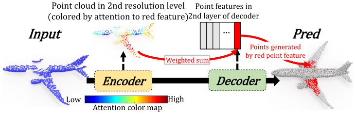

# SA-Net: Point Cloud Completion by Skip-attention Network with Hierarchical Folding

## Abstract

​	Point cloud completion aims to infer the complete geometries for missing regions of 3D objects from incomplete ones. Previous methods usually predict the complete point cloud based on the global shape representation extracted from the incomplete input. However, the global representation often suffers from the information loss of structure details on local regions of incomplete point cloud. To address this problem, we propose Skip-Attention Network(SA-Net) for 3D point cloud completion. 点云补全的目的是从不完整的对象中推断出3D对象缺失区域的完整对象。 先前的方法通常基于从不完整输入中提取的全局形状表示来预测完整点云。 但是，全局表示通常会遭受不完整点云局部区域上结构细节的信息丢失。 为了解决这个问题，我们提出了跳过注意力网络（SA-Net）来完成3D点云。


​	Our main contributions lie in the following two-folds. 

​	First, we propose a skip-attention mechanism to effectively exploit the local structure details of incomplete point clouds during the inference of missing parts. The skip-attention mechanism selectively conveys geometric information from the local regions of incomplete point clouds for the generation of complete ones at different resolutions, where the skip-attention reveals the completion process in an interpretable way. Second, in order to fully utilize the selected geometric information encoded by skip-attention mechanism at different resolutions, we propose a novel structure-preserving decoder with hierarchical folding for complete shape generation. The hierarchical folding preserves the structure of complete point cloud generated in upper layer by progressively detailing the local regions,using the skip-attentioned geometry at the same resolution. We conduct comprehensive experiments on ShapeNet and KITTI datasets, which demonstrate that the proposed SA-Net outperforms the state-of-the-art point cloud completion methods.


$$
\begin{equation}
 a_{j, k}=\frac{\exp \left(\mathrm{M}\left(\boldsymbol{p}_{j}^{i} \mid \theta_{h}\right)^{\mathrm{T}} \cdot \mathrm{M}\left(\boldsymbol{p}_{k}^{i} \mid \theta_{l}\right)\right)}{\sum_{n=1}^{N_{i}} \exp \left(\mathrm{M}\left(\boldsymbol{p}^{i} \mid \theta_{h}\right)^{\mathrm{T}} \cdot \mathrm{M}\left(\boldsymbol{p}^{i} \mid \theta_{1}\right)\right)} 
\end{equation}\tag{1}
$$

$$
\begin{equation}
 \boldsymbol{p}_{j}^{i} \leftarrow \boldsymbol{p}_{j}^{i}+\sum_{k=1}^{N_{i}^{D}} a_{j, k} \cdot \mathrm{M}\left(\boldsymbol{p}_{k}^{i} \mid \theta_{g}\right) 
\end{equation}\tag{2}
$$


## 3.4. skip-attention



**Fig. 4** Illustration of the skip-attention. skip-attention 计算完整点云的局部区域（Pred 中的红色点，由红色特征生成）与不完整点云的局部区域之间的模式相似度。不完整点云中的相似局部区域被选择性地融合到具有注意力加权和的解码器中。


skip-attention 作为管道将编码器提取的局部区域特征与解码器生成的点特征进行通信。 它还解释了网络如何使用来自不完整形状的信息来完成形状。  skip-attention 有两个目的。

首先，当生成位于不完整输入的现有区域中的点时，skip-attention 应该将来自编码器的同一区域的特征融合到解码器中，并引导解码器在该区域重建更一致的结构细节。

其次，当生成位于输入缺失区域的点时，skip-attention 应该**在原始输入点云中搜索可参考的相似区域**，并引导解码器将这些相似区域的形状作为推断形状的参考缺失的区域。

上述两个目的都是通过注意力机制实现的，如 Fig. 4 所示，其中解码器中的点特征与编码器中的局部区域特征之间的**语义相关性**通过注意力得分来衡量，得分越高表示模式相似性越显着（飞机的机翼）。 然后将局部区域特征通过加权求和融合成点特征，最后用于预测完整点云中的相关区域（也就是平面的翅膀）。


有多种可能的方法来计算跳过注意力管道的注意力。 在本文中，我们不会探索整个空间，而是通常选择两个直接实施，在 SA-Net 中运行良好。 skip-attention 中的第一个是直接采用 up-module 中描述的**可学习注意力机制**。 第二个是计算**余弦相似度**作为特征之间的注意力度量。

与可学习注意力相比，未平滑（无 softmax 激活）余弦注意力从之前的编码器网络中引入了更多信息，可以在解码器中的点特征和编码器中的局部区域特征之间建立强连接。 

另一方面，平滑的可学习注意力可以从原始点特征中保留更多信息。 对于可学习的注意力，第 $i$ 个分辨率级别的注意力分数是在来自解码器的点特征 $ \boldsymbol{p}_{j}^{i} $ 和来自编码器的所有局部区域特征 $ \left\{\boldsymbol{r}_{k}^{i} \mid k=1,2, \ldots, N_{i}^{E}\right\} $ 之间计算的，给出


$$
\begin{equation}
 a_{j, k}^{\mathrm{L}}=\frac{\exp \left(\mathrm{M}\left(\boldsymbol{p}_{j}^{i} \mid \theta_{h}^{\mathrm{L}}\right)^{\mathrm{T}} \cdot \mathrm{M}\left(\boldsymbol{r}_{k}^{i} \mid \theta_{l}^{\mathrm{L}}\right)\right)}{\sum_{n=1}^{N_{i}} \exp \left(\mathrm{M}\left(\boldsymbol{p}_{j}^{i} \mid \theta_{h}^{\mathrm{L}}\right)^{\mathrm{T}} \cdot \mathrm{M}\left(\boldsymbol{r}_{n}^{i} \mid \theta_{l}^{\mathrm{L}}\right)\right)} 
\end{equation}\tag{3}
$$
其中上标 $L$ 表示可学习。 对于余弦距离，注意力得分为
$$
\begin{equation}
 a_{j, k}^{\mathrm{C}}=\frac{\left(\boldsymbol{r}_{k}^{i}\right)^{\mathrm{T}} \boldsymbol{p}_{j}^{i}}{\left\|\boldsymbol{r}_{k}^{i}\right\|_{2}\left\|\boldsymbol{p}_{j}^{i}\right\|_{2}} 
\end{equation}\tag{4}
$$
其中上标 $C$ 表示单词 cosine。 与 up-module 中的 self attention 相同，我们使用元素级加法将局部区域特征 $ \left\{\boldsymbol{r}_{k}^{i}\right\} $ 的加权和融合到点特征 $ \boldsymbol{p}_{j}^{i} $  中，这与 Eq.2 相同。在消融研究（第 4.2 节）中，我们将定量比较这两种注意力的表现。


# 复现


```python
from torch_geometric.nn import PointConv, fps, radius, global_max_pool

def MLP(channels, batch_norm=True):
    return Seq(*[
        Seq(Lin(channels[i - 1], channels[i]), ReLU())
        #               ,BN(channels[i]))
        for i in range(1, len(channels))
    ])


class SAModule(torch.nn.Module):
    def __init__(self, ratio, r, nn):
        super(SAModule, self).__init__()
        self.ratio = ratio
        self.r = r
        self.conv = PointConv(nn)

    def forward(self, x, pos, batch, num_samples=32):
        idx = fps(pos, batch, ratio=self.ratio)
        row, col = radius(pos, pos[idx], self.r, batch, batch[idx],
                          max_num_neighbors=num_samples)
        edge_index = torch.stack([col, row], dim=0)
        x = self.conv(x, (pos, pos[idx]), edge_index)
        pos, batch = pos[idx], batch[idx]
        return x, pos, batch

class GlobalSAModule(torch.nn.Module):
    def __init__(self, nn):
        super(GlobalSAModule, self).__init__()
        self.nn = nn

    def forward(self, x, pos, batch):
        x = self.nn(torch.cat([x, pos], dim=1))
        x = global_max_pool(x, batch)
        pos = pos.new_zeros((x.size(0), 3))
        batch = torch.arange(x.size(0), device=batch.device)
        return x, pos, batch
    
class SkipAttention(Attention):

    def __init__(self, NN_h, NN_l, NN_g, NN_f=None):
        super(SkipAttention, self).__init__(NN_h, NN_l, NN_g, NN_f)

    def forward(self, p, r):
        h = self.M_h(p).expand(-1, -1, r.size(2), -1).unsqueeze(-2)
        l = self.M_l(r).expand(-1, h.size(1), -1, -1).unsqueeze(-1)
        g = self.M_g(r).squeeze()
        mm = torch.matmul(h, l).squeeze()
        attn_weights = F.softmax(mm, dim=-1)
        atten_appllied = torch.bmm(attn_weights, g)
        if self.M_f is not None:
            return self.M_f(p.squeeze() + atten_appllied)
        else:
            return p.squeeze() + atten_appllied
        
class SaNet(torch.nn.Module):
    meshgrid = [[-0.3, 0.3, 46], [-0.3, 0.3, 46]]
    x = np.linspace(*meshgrid[0])
    y = np.linspace(*meshgrid[1])

    points = torch.tensor(np.meshgrid(x, y), dtype=torch.float32)

    def __init__(self):
        super(SaNet, self).__init__()

        self.sa1_module = SAModule(0.25, 0.2, MLP([3 + 3, 64, 64, 128])) # ratio, r, nn
        self.sa2_module = SAModule(0.5, 0.4, MLP([128 + 3, 128, 128, 256]))
        self.sa3_module = GlobalSAModule(MLP([256 + 3, 256, 512, 512]))#nn

        self.skip_attn1 = SkipAttention(MLP([512 + 2, 128]), MLP([256, 128]), MLP([256, 512 + 2]), MLP([512 + 2, 512])) # NN_h, NN_l, NN_g, NN_f
        self.skip_attn2 = SkipAttention(MLP([256, 64]), MLP([128, 64]), MLP([128, 256]), MLP([256, 256])) # NN_h, NN_l, NN_g

        self.folding1 = FoldingBlock(64, 256, [MLP([512 + 512, 256]), MLP([512 + 512, 256]), MLP([512 + 512, 512 + 512]),
                                               MLP([512 + 512, 512, 256])], [512 + 2, 512], [1024, 512])

        self.folding2 = FoldingBlock(256, 512, [MLP([256 + 256, 64]), MLP([256 + 256, 64]), MLP([256 + 256, 256 + 256]),
                                                MLP([256 + 256, 256, 128])], [256 + 2, 256], [256, 256])
        self.folding3 = FoldingBlock(512, 2048, [MLP([128 + 128, 64]), MLP([128 + 128, 64]), MLP([128 + 128, 128 + 128]),
                                                 MLP([128 + 128, 128])], [128 + 2, 128], [512, 256, 128])

        self.lin = Seq(Lin(128, 64), ReLU(), Lin(64, 3))
    @staticmethod
    def sample_2D(m, n):
        indeces_x = np.round(np.linspace(0, 45, m)).astype(int)
        indeces_y = np.round(np.linspace(0, 45, n)).astype(int)
        x, y = np.meshgrid(indeces_x, indeces_y)
        p = SaNet.points[:, x.ravel(), y.ravel()].T.contiguous()
        return p

    def Encode(self, data):
        sa1_out = self.sa1_module(data.pos, data.pos, data.batch)
        sa2_out = self.sa2_module(*sa1_out)
        sa3_out = self.sa3_module(*sa2_out)
        return sa1_out, sa2_out, sa3_out

    def Decode(self, encoded):
        p = SaNet.sample_2D(8, 8)
        out = encoded[2][0].contiguous()
        out = out.view(out.size(0), 1, 1, out.size(-1)).repeat(1, 64, 1, 1)
        out = torch.cat((out, p.view(1, p.size(0), 1, p.size(-1)).repeat(out.size(0), 1, 1, 1)), -1)
        out = self.skip_attn1(out, encoded[1][0].view(out.size(0), 1, 256, encoded[1][0].size(-1)))
        out = self.folding1(out, 16, 16)
        out = out.unsqueeze(-2)
        out = self.skip_attn2(out, encoded[0][0].view(out.size(0), 1, 512, encoded[0][0].size(-1)))
        out = self.folding2(out, 16, 32)
        out = self.folding3(out, 64, 32)

        return self.lin(out)

    def forward(self, data):
        encoded = self.Encode(data)

        decoded = self.Decode(encoded)

        return decoded, encoded
```


