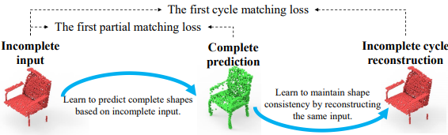
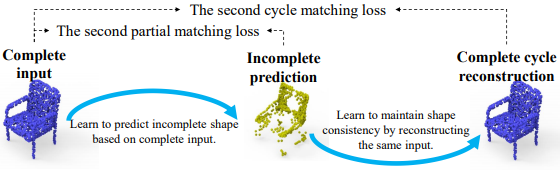
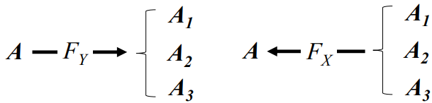
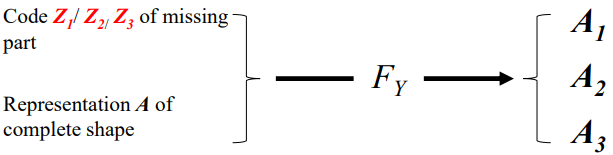

# Cycle4Completion

CVPR2021：  Unpaired Point Cloud Completion using Cycle Transformation with Missing Region Coding

---

## Abstract

In this paper, we present a novel unpaired point cloud completion network, named Cycle4Completion, to infer the complete geometries from a partial 3D object.      在本文中，我们提出了一种新颖的不成对的点云完成网络，称为 `Cycle4Completion`，可以从部分3D对象推断出完整的几何形状。

Previous unpaired completion methods merely focus on the learning of geometric correspondence from incomplete shapes to complete shapes, and ignore the learning in the reverse direction, which makes them suffer from low completion accuracy due to the limited 3D shape understanding ability. 先前的不成对完成方法仅专注于**从不完整形状到完整**形状的几何对应关系的学习，而**忽略了相反方向**的学习，这使得它们由于3D形状理解能力有限而遭受较低的完成精度。

To address this problem, we propose two simultaneous **cycle transformations** between the latent spaces of complete shapes and incomplete ones. 为了解决这个问题，我们提出了完全形状和不完全形状的潜在空间之间的两个同时**循环变换**。

Specifically, the first cycle transforms shapes from incomplete domain to complete domain, and then projects them back to the incomplete domain. This process learns the geometric characteristic of complete shapes, and maintains the shape consistency between the complete prediction and the incomplete input. 具体来说，第一个循环将形状从不完整域转换为完整域，然后将其投影回不完整域。此过程了解完整形状的几何特征，并保持完整预测和不完整输入之间的形状一致性。 

Similarly, the inverse cycle transformation starts from complete domain to incomplete domain, and goes back to complete domain to learn the characteristic of incomplete shapes. 类似地，逆循环变换从完整域开始到不完整域，然后返回到完整域以学习不完整形状的特征。 

We experimentally show that our model with the learned bidirectional geometry correspondence outperforms state-of-the-art unpaired completion methods. 我们通过实验证明，具有学习到的双向几何对应关系的模型优于最新的不成对完成方法。

---

## 1. Introduction

Point clouds, as a popular 3D representation, can be easily produced by 3D scanning devices and depth cameras. However, due to the limitations of the view angles of camera/scanning devices and self-occlusion, raw point clouds are often sparse, noisy and partial, which usually require shape completion before being analyzed in further applications such as shape classification [25, 17], retrieval [14, 8, 15], semantic/instance segmentation [22, 35]. Although the recent data-driven supervised completion methods [31, 40, 37, 39, 19, 21] have achieved impressive performance, they heavily rely on the paired training data, which consists of incomplete shapes and their corresponding complete ground truth. In real-world applications, however,
such high quality and large-scale paired training dataset is not easy to access, which makes it hard to directly train a supervised completion network.

点云作为一种流行的3D表示形式，可以通过3D扫描设备和深度相机轻松生成。 但是，由于相机/扫描设备的视角和自闭塞的限制，原始点云通常稀疏，嘈杂且局部，通常需要在完成其他应用（例如形状分类）之前对形状进行完善[25，17 ]，检索[14、8、15]，语义/实例分割[22、35]。 尽管最近的数据驱动的监督完成方法[31、40、37、39、19、21]取得了骄人的成绩，但它们**严重依赖配对的训练数据**，该训练数据由不完整的形状及其相应的完整的G.T. 组成。但是，在实际应用中，如此高质量和大规模的成对训练数据集并不容易访问，这使得直接训练受监督的完成网络变得困难。

A promising but challenging solution to this problem is to learn a completion network in an unpaired way, where the common practice is to establish the shape correspondence between the incomplete shapes and complete ones from the unpaired training data without requiring the incomplete and complete correspondence. The latest work like Pcl2Pcl [3]  introduced an adversarial framework to merge the geometric gap between the complete shape distribution and incomplete one in the latent representation space. Although many efforts have been made to learn the geometric correspondence from incomplete shapes to complete ones, previous methods ignore the inverse correspondence from complete
shapes to incomplete ones, which leads to low completion accuracy due to the limited 3D shape understanding ability. 

解决此问题的一个有希望但具有挑战性的解决方案是以不成对的方式学习补全网络，通常的做法是从不成对的训练数据中建立**不完整**的形状和**完整**的形状之间的**形状对应关系**，而无需不完整和完整的对应关系。像Pcl2Pcl[3] 这样的最新作品引入了一种对抗性框架，用于合并潜在表示空间中完整形状分布和不完整形状之间的几何间隙。尽管已经进行了许多努力来学习从不完整形状到完整形状的几何对应关系，但是先前的方法忽略了从完整形状到不完整形状的逆对应关系，这由于有限的3D形状理解能力而导致较低的完成精度。

To address this problem, we propose a novel unpaired point cloud completion network, named Cycle4Completion, to establish the geometric correspondence between incomplete and complete shapes in both directions. We achieve this by designing two cycle transformations, i.e. the incomplete cycle transformation (incomplete-cycle) and the complete cycle transformation (complete-cycle), as shown in Figure 1. The incomplete-cycle in Figure 1(a) learns the mapping from the incomplete domain to the complete one, which is then projected back to the incomplete domain. On the other hand, the complete-cycle in Figure 1(b) provides the completion knowledge on the inverse direction with incomplete input, which can be used to further enhance the incompletion quality for incomplete-cycle.

为了解决这个问题，我们提出了一个新的不成对的点云完成网络，称为Cycle4Completion，以建立**两个方向**上不完整和完整形状之间的几何对应关系。 我们通过设计两个周期转换来实现此目的，即不完整周期转换（incomplete-cycle）和完整周期转换（complete-cycle），如图1所示。图1（a）中的不完整周期从中学习映射 将不完整的域转换为完整的域，然后将其投影回不完整的域。 另一方面，图1（b）中的完整循环提供了具有不完整输入的反方向的完整知识，可用于进一步提高不完整循环的不完整质量。

**Fig. 1.a** 循环变换的图示，它由两个逆循环组成，如（a）和（b）所示。 循环变换通过学习从互补形状生成完整或不完整的形状，从而使网络了解3D形状。

**Fig. 1.b** 循环变换的图示，它由两个逆循环组成，如（a）和（b）所示。 循环变换通过学习从互补形状生成完整或不完整的形状，从而使网络了解3D形状。

 

**图2.a** 目标混乱的问题。 基于神经网络的变换FX可以学习将多个不完整的输入（A1，A2，A3）投影到一个完整的目标（A）中，但是其逆变换FY无法学习将一个完整的输入投影到多个不完整的目标中。

但是，如图2（a）所示，直接在潜在空间中应用循环变换会遇到一个新问题，我们将其称为**目标混淆问题**。 当建立从多个不完整形状（例如A1，A2和A3）到一个完整形状（例如A）的形状对应关系时，会出现此问题。 这是因为一个循环需要网络根据完整的输入来预测不完整的形状，并且相应的转换网络FY无法仅通过深层神经网络将一个完整的输入完全映射到多个不同的不完整的目标中。 为了解决这个问题，我们提出了可学习的缺失区域编码（MRC），将不完整的形状转换为完整的形状，如图2（b）所示。

**图2.b** 缺少区域编码的解决方案。 我们建议使用可学习的代码Z（在上图中表示为Z1，Z2，Z3）来编码缺失区域

The representations of incomplete shapes can be decomposed into two parts: one is the representation A of their corresponding complete shape, and the other one is the code Z to encode their missing regions. When predicting the complete shapes from the incomplete ones, only the representation A is considered, and when predicting the incomplete shapes from the complete ones, both the representation A and code Z are considered. Thus, the transformation network FY will relieve the confusion by learning to project one complete input to several incomplete targets. Instead, the learnable missing region code Z can help the network clarify which incomplete shape is the current target for transformation, and relieve the target confusion problem. Our main contributions are summarized as follows.
不完整形状的表示可以分解为两部分：一个是其相应完整形状的表示A，另一个是用于编码其缺失区域的代码Z。 从不完整的形状预测完整形状时，仅考虑表示A，而从完整的形状预测不完整形状时，则考虑表示A和代码Z。 因此，转换网络FY将通过学习将一个完整的输入投影到几个不完整的目标来减轻混乱。 取而代之的是，可学习的缺失区域代码Z可以帮助网络澄清哪个不完整形状是当前的转换目标，并缓解目标混乱的问题。 我们的主要贡献概述如下。

- We propose a novel unpaired point cloud completion network, named Cycle4Completion. Compared
  with previous unpaired completion methods which only consider the single-side correspondence from incomplete shapes to complete ones, Cycle4Completion can enhance the completion performance by establishing the geometric correspondence between complete shapes and incomplete shapes from both directions.我们提出了一种新颖的不成对的点云完成网络，称为Cycle4Completion。与以前的不成对完成方法仅考虑从不完整形状到完整形状的单边对应关系相比，Cycle4Completion可以通过在两个方向上在完整形状和不完整形状之间建立几何对应关系来提高完成性能。
- We propose the partial matching loss and cycle matching loss, and combine them with the cycle transformations to establish the bidirectional geometric correspondence between the complete and incomplete shapes, and maintain the shape consistency throughout the whole transformation process.我们提出了局部匹配损失和循环匹配损失，并将它们与循环变换相结合，以建立完整和不完整形状之间的双向几何对应关系，并在整个变换过程中保持形状一致性。
- We propose the missing region coding to decompose the incomplete shape representation into a representation of its corresponding complete shape, and a missing region code to encode the missing regions of the incomplete shapes, respectively. This solves the target confusion when the network tries to predict multiple incomplete shapes based on a single complete shape. 我们建议使用缺失区域编码将不完整的形状表示分解为对应的完整形状的表示，并提出缺失区域代码分别对不完整形状的缺失区域进行编码。 当网络尝试基于单个完整形状预测多个不完整形状时，这解决了目标混乱。

