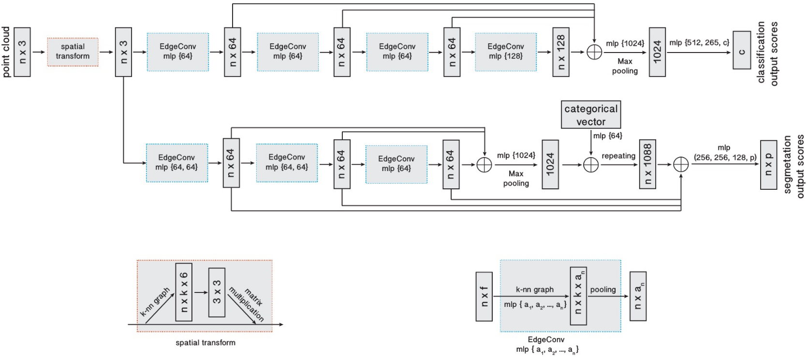
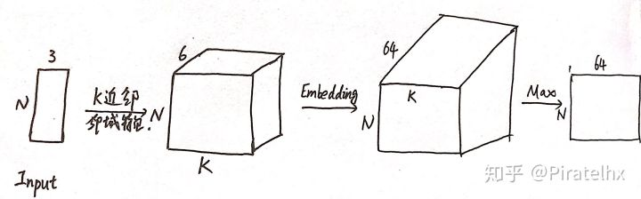

# DGCNN

​	Dynamic Graph CNN for Learning on Point Clouds


## start

```
docker run --runtime=nvidia --rm -it -v /tmp/.X11-unix:/tmp/.X11-unix -e DISPLAY=unix$DISPLAY -e GDK_SCALE -e GDK_DPI_SCALE duan/cuda10pytorch12:v1

xarclock
```


```
docker cp ./ e80c6769ee0f:home/duan/20eat
```


```
docker ps -a
docker commit -a "duan" -m "xxxx" -p 1525abaf2314 duan/cuda10pytorch12:v1
```


```bash
ssh-keygen -t rsa -C "837738300@qq.com" 
cat ~/.ssh/id_rsa.pub
git remote set-url origin git@xxx.com:xxx/xxx.git

Unpacking objects 进度停止
git git@xxx.git
```


## Abstract

​	Point clouds provide a flexible geometric representation suitable for countless applications in computer graphics; they also comprise the raw output of most 3D data acquisition devices. While hand-designed features on point clouds have long been proposed in graphics and vision, however, the recent overwhelming success of convolutional neural networks (CNNs) for image analysis suggests the value of adapting insight from CNN to the point cloud world. 

​	Point clouds inherently lack topological information so designing a model to recover topology can enrich the representation power of point clouds. To this end, we propose a new neural network module dubbed EdgeConv suitable for CNN-based high-level tasks on point clouds including classification and segmentation. 

​	EdgeConv acts on graphs dynamically computed in each layer of the network. It is differentiable and can be plugged into existing architectures. Compared to existing modules operating in extrinsic space or treating each point independently, EdgeConv has several appealing properties: 

​	It incorporates local neighborhood information; it can be stacked applied to learn global shape properties; and in multi-layer systems affinity in feature space captures semantic characteristics over potentially long distances in the original embedding. We show the performance of our model on standard benchmarks including ModelNet40, ShapeNetPart, and S3DIS.

​	点云提供了一种灵活的几何表示形式，适用于计算机图形学中的无数应用。它们还包含大多数3D数据采集设备的原始输出。尽管点云上的手工设计特征早已被提出用于图形和视觉，但是最近卷积神经网络（CNN）在图像分析方面取得了压倒性的成功，这表明了将CNN的洞察力应用于点云世界的价值。

​	**点云本质上缺乏拓扑信息**，因此**设计恢复拓扑的模型**可以丰富点云的表示能力。为此，我们提出了一种新的名为**EdgeConv**的神经网络模块，适用于点云上基于CNN的高级任务，包括分类和分割。 

​	EdgeConv作用于在网络的每一层中动态计算的图。它是可微分的，可以插入现有体系结构中。与在外部空间中运行或独立处理每个点的现有模块相比，EdgeConv具有几个吸引人的特性：

​	它包含局部邻域信息；它可以堆叠应用以学习全局形状属性；在多层系统中，特征空间中的亲和力会在原始嵌入中潜在的长距离内捕获语义特征。我们在标准基准（包括ModelNet40，ShapeNetPart和S3DIS）上展示了模型的性能。


## Why do this work?

​	点云这种数据结构是离散的，缺乏**拓扑信息**（也就是单个点与点之间的关联并没有显式建立，但是他们之间应该是有实际意义的）。	

​	自然而然地，如果我们能够通过某种方式建立点与点之间的拓扑关系，应该可以**增强表征**的能力。

​	**EdgeConv**的设计应运而生。


## What can the work do?

​	现在假设我们已经有了EdgeConv模块，那么我们就需要据此设计**网络结构表征**，然后使用提取的特征做分类、分割任务。

​	类似PointNet++，应该会主要包括分类、局部分割、场景分割这几个实验。


## The work bring to us

- 设计了EdgeConv，能够非常好地提取点云局部形状的特征，同时还能够保持**排列不变性**。
- 模型能够通过**动态更新**层与层之间的**图结构**来更好地学习点集的**语义**信息。
- EdgeConv具有普适性，可以很好地集成到多个已经存在的点云处理的**pipeline**中。
- 通过分析和实验测试，EdgeConv在benchmark上取得了SOTA结果。
- 开源了代码


**本文最核心的创新就是设计了EdgeConv这一效果不错的表征模块，并且可以将其运用到坐标空间和特征空间（实现动态更新图结构）。**


## How does it work?



Fig 1. Model architectures. The model architectures used for classification (top branch) and segmentation (bottom branch). 

​	The classification model takes as input n points, calculates an edge feature set of size k for each point at an EdgeConv layer, and aggregates(汇总) features within each set to compute EdgeConv responses（响应） for corresponding（对应的） points. The output features of the last EdgeConv layer are aggregated globally to form an 1D global descriptor, which is used to generate classification scores for c classes. 

​	The segmentation model extends the classification model by concatenating（串联） the 1D global descriptor and all the EdgeConv outputs (serving as local descriptors) for each point. It outputs per-point classification scores for p semantic labels. ⊕: concatenation（级联）. 

​	Point cloud transform block: The point cloud transform block is designed to align（对其） an input point set to a canonical space（规范空间） by applying an estimated（估计的） 3 × 3 matrix. To estimate the 3 × 3 matrix, a tensor concatenating（级联） the coordinates（坐标） of each point and the coordinate differences（坐标差） between its k neighboring points is used. 

​	EdgeConv block: The EdgeConv block takes as input a tensor of shape n × f , computes edge features（边特征） for each point by applying a multi-layer perceptron (mlp) with the number of layer neurons（神经元） defined as {a1 , a2 , ..., an }, and generates a tensor of shape n × a n after pooling among neighboring edge features.

---

### EdgeConv

​	**EdgeConv**是本文的最核心创新。	

​	先来个直观认知：

​	**EdgeConv**在网络的每一层上动态构建图结构，将每一点作为中心点来表征其与各个邻点的edge feature，再将这些特征聚合从而获得该点的新表征。

​	**EdgeConv**实现的实际就是通过构建局部邻域（这种局部邻域既可以建立在坐标空间，也可以建立在特征空间），对每个点表征。

​	将多个EdgeConv模块首尾相接不断堆叠也就是为了获得多层次、具有更加丰富语义的表征。即 **EdgeConv** 输入 $N*F$ ，输出 $N*F'$ 

---

#### 具体做法

​	构建图结构，顶点就是点云各个点，通过对每个点KNN，连接其K近邻，构建边的关系。


Fig 2. **Left**: Computing an edge feature,  $e_{ij}$  (top), from a point pair, $x_i$ and $x_j$ (bottom). In this example, $h_Θ ()$ is instantiated using a fully connected layer, and the learnable parameters are its associated weights. 

​	**Right**: The EdgeConv operation. The output of EdgeConv is calculated by aggregating the edge features associated with all the edges emanating from each connected vertex.

---

##### Input

​	定点集合
$$
\mathrm{X}=\left\{\mathrm{x}_{1}, \ldots, \mathrm{x}_{n}\right\} \subseteq \mathbb{R}^{F}
$$
​	n 个维度为 F 的点构成的点云，一般情况 F 为3: x、y、z，也有可能还包含颜色，表面类型等等


​	最简单的一种情况，我们用集合使用（k-NN）构建一个图，包括自环。 

##### Step 1 

​	定义对边的表征edge feature:
$$
e_{ij}=h_{\Theta}(x_i,x_j)
$$
​	其中: $h_{\Theta}: R^{F} \times R^{F} \rightarrow R^{F^{\prime}}$ 为非线性函数, $\Theta$ 是可学习的参数

##### Step 2

​	对所有边应用channel-wise symmetric aggregation(对称聚合) 操作(e.g. sum or max)来对中心点再表征，
$$
\mathbf{x}_{i}^{\prime}=\underset{j:(i, j) \in \mathcal{E}}{\square} h_{\Theta}\left(\mathbf{x}_{i}, \mathbf{x}_{j}\right)
$$
​	其中，$\square$ 表示聚合操作，$\mathcal{E}$ 表示以点 $\mathbf{x}_{i}$ 为中心的块中其余点与中心点 $\mathbf{x}_{i}$ 构成的pair集合。输出为第 i 个定点的EdgeConv。

​	与沿图像的卷积类似，我们将 $\mathbf{x}_i$ 视为中心像素，并将 $\left\{\mathbf{x}_{j}:(i, j) \in \mathcal{E}\right\}$ 视为围绕它的patch块。 


> Channel-wise卷积在channel维度上进行滑动，巧妙地解决卷积操作中输入输出的复杂全连接特性

---

​	 $h_{\Theta}$ 和 $\square$ 的选择方案有以下：

**方案1**

​	图结构中每个点的邻点是固定的K个，可以按照类似卷积来实现

$$
x_{i m}^{\prime}=\sum_{j:(i, j) \in \mathcal{E}} \theta_{m} \cdot \mathbf{x}_{j}
$$
​	其中： $\Theta=\left(\theta_{1}, \ldots, \theta_{M}\right)$ 将 $M$ 个不同的滤波编码，每一个 $\theta_{M}$ 都有与 $\mathbf{x}$ 相同的维度，.表示欧几里得内积，这里直接把step2结合进来了，step2聚合操作是 $\sum$ 。

**方案2**
$$
h_{\theta}\left(\mathbf{x}_{i}, \mathbf{x}_{j}\right)=h_{\theta}\left(\mathbf{x}_{i}\right)
$$
​	只考虑点自身全局特征，不考虑局部邻域邻点信息，PointNet 就是这么做的。因此，PointNet 可被视为 EdgeConv 的特殊版本。

**方案3**
$$
h_{\theta}\left(\mathbf{x}_{i}, \mathbf{x}_{j}\right)=h_{\theta}\left(\mathbf{x}_{j}\right)
$$
​	对应的聚合操作：
$$
x_{i m}^{\prime}=\sum_{j \in V}\left(h_{\theta}\left(\mathbf{x}_{j}\right)\right) g\left(u\left(\mathbf{x}_{i}, \mathbf{x}_{j}\right)\right)
$$
​	$g$ 是高斯核，$u$ 在欧式空间计算pairwise距离矩阵。

**方案4**
$$
h_{\theta}\left(\mathbf{x}_{i}, \mathbf{x}_{j}\right)=h_{\theta}\left(\mathbf{x}_{j}-\mathbf{x}_{i}\right)
$$
​	只考虑了局部信息（相对信息），损失了中心点的所谓全局特征

**方案5**
$$
h_{\theta}\left(\mathbf{x}_{i}, \mathbf{x}_{j}\right)=h_{\theta}\left(\mathbf{x}_{i}, \mathbf{x}_{j}-\mathbf{x}_{i}\right)
$$
​	EdgeConv选择的就是这个方案，既考虑了全局信息 $\mathbf{x}_{i}$ ，又考虑了局部邻域信息 $\mathbf{x}_{j}-\mathbf{x}_{i}$。

​	接着再送入一个感知机，即得到了edge feature：

$$
e_{i j m}^{\prime}=\operatorname{ReLU}\left(\theta_{m} \cdot\left(\mathbf{x}_{j}-\mathbf{x}_{i}\right)+\phi_{m} \cdot \mathbf{x}_{i}\right)
$$
​	其中： $\Theta=\left(\theta_{1}, \ldots, \theta_{M}, \phi_{1}, \ldots, \phi_{M}\right)$ 为可学习参数

​	关于聚合操作：

$$
x_{i m}^{\prime}=\max _{j:(i, j) \in \mathcal{E}} e_{i j m}^{\prime}
$$
​	池化操作即可，max pooling


---

### Dynamic graph update

​	我们在特征空间中计算pariwise distance矩阵，然后为每个点取最接近的k个邻域点。

​	不断重新计算各个点在每一层特征空间的近邻。


​	注意：**这是DGCNN和GCN的最大不同，GCN是在坐标空间构建好图结构后整体图结构就固定了，没有动态更新的过程！**


​	假设第 $l$ 层的输出为 $X^{l}=\left\{x_{1}^{l}, \ldots, x_{n}^{l}\right\} \subseteq \mathbb{R}^{F_{l}}$，则 $X^0$ 就是输入点云

​	每一层都会得到一个不同的图 $G^{l}=\left(v^{l}, \epsilon^{l}\right)$

​	每一层的边缘特征为 $\left(i, j_{i 1}\right), \ldots,\left(i, j_{i k}\right)$，取决于点 $ x_{i}^{l}$ 的 $k_l$ 个最近邻的点 $x_{j_{i 1}}^{l}, \ldots, x_{j_{i k}}^{l}$

​	更新公式：$x_{i}^{l+1}=\square_{j:(i, j) \in \epsilon^{l}} h_{\Theta}^{l}\left(x_{i}^{l}, x_{j}^{l}\right)$


---

### Properties

#### Permutation Invariance

$$
\mathbf{x}_{i}^{\prime}=\max _{j:(i, j) \in \mathcal{E}} h_{\Theta}\left(\mathbf{x}_{i}, \mathbf{x}_{j}\right)
$$

​	输出的 $\mathbf{x}_{i}^{\prime}$ 对 $\mathbf{x}_{i}$ 的任意排布是保持不变的。

​	因为聚合操作这里用的是channel wise的max pooling

#### Translation Invariance

​	这里只是一种“局部的”平移不变性

​	考虑对 $\mathbf{x}_{i}$  和 $\mathbf{x}_{j}$  平移 $T$ ，则：

$$
\begin{aligned}
e_{i j m}^{\prime} &=\theta_{m} \cdot\left(\mathrm{x}_{j}+T-\left(\mathrm{x}_{i}+T\right)\right)+\phi_{m} \cdot\left(\mathrm{x}_{i}+T\right) \\
&=\theta_{m} \cdot\left(\mathrm{x}_{j}-\mathrm{x}_{i}\right)+\phi_{m} \cdot\left(\mathrm{x}_{i}+T\right)
\end{aligned}
$$
​	后一项不是平移不变的，因此这里是局部平移不变的。


---

### classification

​	

---

### segmentation


## Process



流程如下：

​	输入 $N \times 3$ ，利用EdgeConv构造得到邻域特征 $N \times K \times 6$
​	采用 $1 \times 1$ 的卷积核对该特征进行升维，本质是Embedding过程，得到 $N \times K \times 64$
​	最后对Embedding后的特征进行aggregate，可以采用max或者sum这些输入无序性无关的操作，DGCNN采用的是max操作，再做个squeeze，得到 $N \times 64$
​	以此类推，之后在特征层进行上面重复的操作


- 在当前每个点的feature空间内（输入层的feature，就是 xyz 坐标），对于每个点 $x_{i}$，通过KNN算法，找到k个距离最近的点。k 个点按距离升序排列，得到： $x_{j_{i 1}}, x_{j_{i 2}}, \ldots, x_{j_{i k}}$
- 依次计算出 k 个边的 feature：$x_{j_{i 1}}-x_{i}, x_{j_{i}}-x_{i}, \ldots, x_{j_{i k}}-x_{i}$
- 每个边里面加入点的 feature，得到 k 个 feature：$\left(x_{i}, x_{j_{i 1}}-x_{i}\right),\left(x_{i}, x_{j_{i 2}}-x_{i}\right), \ldots,\left(x_{i}, x_{j_{i k}}-x_{i}\right)$
- 对于上面得到的每个 feature，用一个共享的网络 $h_{\theta}$ 来更新。代码中使用的是 kernel 是 1x1 的 Conv2d，相当于一个全连接层，得到 k 个 feature:  $h_{\theta}\left(x_{i}, x_{j_{i 1}}-x_{i}\right), \ldots, h_{\theta}\left(x_{i}, x_{j_{i k}}-x_{i}\right)$
- 用 max pool，将以上 k 个 feature 整合为一个 feature，作为点 $x_{i}$ 新的feature。


## Novel Idea

​	摘要后一段


---

## code

#### Pytorch

```python
class DynamicGraphCNN(nn.Module):
    @staticmethod
    def knn(x, k):
        """Compute pairwise distance of a point cloud.
		Args:
 			x-point_cloud: tensor (batch_size, num_points, num_dims)
 			k: int
 		Returns:
			idx-nearest neighbors: (batch_size, num_points, k)
		"""
        
        inner = -2 * torch.matmul(x.transpose(2, 1), x)   	#x 第2维度与第1维度 进行转置 然后与x矩阵相乘 
        xx = torch.sum(x**2, dim=1, keepdim=True)			#把第1维度的x的平方求和 保持其维度特性
        pairwise_distance = -xx - inner - xx.transpose(2, 1)
        idx = pairwise_distance.topk(k=k, dim=-1)[1]   # (B, N, k) # 找到前k个大的数 
        return idx

    @staticmethod
    def get_graph_feature(x, k=20, idx=None, dim9=False):
     	"""Construct edge feature for each point
      	Args:
        	x-point_cloud: (batch_size, num_points, 1, num_dims)
        	k: int
        	idx: (batch_size, num_points, k)
      	Returns:
        	features-edge features: (batch_size, num_points, k, num_dims)
      	"""
        B = x.size(0) # B代表Batchsize,即有多少样本
        N = x.size(2) # N代表每个样本的总点数
        x = x.view(B, -1, N)
        if idx is None:
            if dim9 == False:
                idx = DynamicGraphCNN.knn(x, k=k)   # (B, N, k) 没有d维度
            else:
                idx = DynamicGraphCNN.knn(x[:, 6:], k=k)

        idx_base = torch.arange(0, B, device=x.device).view(-1, 1, 1) * N #创建等差数组 从0开始到B结束 步长默认为1 
        #view -1 是指对第一个维度不做数量限定

        idx = idx + idx_base

        idx = idx.view(-1)
    
        _, num_dims, _ = x.size()

        x = x.transpose(2, 1).contiguous()   # (B, N, num_dims)  -> (B*N, num_dims) #   B * N * k + range(0, B*N)
        feature = x.view(B * N, -1)[idx, :]
        feature = feature.view(B, N, k, num_dims) 
        x = x.view(B, N, 1, num_dims).repeat(1, 1, k, 1)
        
        feature = torch.cat((feature - x, x), dim=3).permute(0, 3, 1, 2).contiguous()
    
        return feature  # (B, 2 * num_dims, N, k)
```


#### TensorFlow

```python
# 前3行：计算pairwise距离矩阵，提取K近邻，计算edge_feature
adj_matrix = tf_util.pairwise_distance(point_cloud_transformed)
nn_idx = tf_util.knn(adj_matrix, k=k)
edge_feature = tf_util.get_edge_feature(point_cloud_transformed, nn_idx=nn_idx, k=k)

# MLP表征edge_feature，池化获得point-wise feature
net = tf_util.conv2d(edge_feature, 64, [1, 1],
                        padding='VALID', stride=[1, 1],
                        bn=True, is_training=is_training,
                        scope='dgcnn1', bn_decay=bn_decay)
net = tf.reduce_max(net, axis=-2, keep_dims=True)

```


```python
def pairwise_distance(point_cloud):
  """Compute pairwise distance of a point cloud.
  Args:
    point_cloud: tensor (batch_size, num_points, num_dims)
  Returns:
    pairwise distance: (batch_size, num_points, num_points)
  """
  og_batch_size = point_cloud.get_shape().as_list()[0]
  point_cloud = tf.squeeze(point_cloud)
  if og_batch_size == 1:
    point_cloud = tf.expand_dims(point_cloud, 0)
    
  point_cloud_transpose = tf.transpose(point_cloud, perm=[0, 2, 1])
  point_cloud_inner = tf.matmul(point_cloud, point_cloud_transpose)
  point_cloud_inner = -2*point_cloud_inner
  point_cloud_square = tf.reduce_sum(tf.square(point_cloud), axis=-1, keep_dims=True)
  point_cloud_square_tranpose = tf.transpose(point_cloud_square, perm=[0, 2, 1])
  return point_cloud_square + point_cloud_inner + point_cloud_square_tranpose


def knn(adj_matrix, k=20):
  """Get KNN based on the pairwise distance.
  Args:
    pairwise distance: (batch_size, num_points, num_points)
    k: int
  Returns:
    nearest neighbors: (batch_size, num_points, k)
  """
  neg_adj = -adj_matrix
  _, nn_idx = tf.nn.top_k(neg_adj, k=k)
  return nn_idx


def get_edge_feature(point_cloud, nn_idx, k=20):
  """Construct edge feature for each point
  Args:
    point_cloud: (batch_size, num_points, 1, num_dims)
    nn_idx: (batch_size, num_points, k)
    k: int
  Returns:
    edge_features: (batch_size, num_points, k, num_dims)
                    B*N*K*C ，表示每个点与其K个近邻点的K个边的edge_feature
  """
  og_batch_size = point_cloud.get_shape().as_list()[0]
  point_cloud = tf.squeeze(point_cloud)
  if og_batch_size == 1:
    point_cloud = tf.expand_dims(point_cloud, 0)

  point_cloud_central = point_cloud

  point_cloud_shape = point_cloud.get_shape()
  batch_size = point_cloud_shape[0].value
  num_points = point_cloud_shape[1].value
  num_dims = point_cloud_shape[2].value

  idx_ = tf.range(batch_size) * num_points
  idx_ = tf.reshape(idx_, [batch_size, 1, 1]) 

  point_cloud_flat = tf.reshape(point_cloud, [-1, num_dims])
  point_cloud_neighbors = tf.gather(point_cloud_flat, nn_idx+idx_)
  point_cloud_central = tf.expand_dims(point_cloud_central, axis=-2)

  point_cloud_central = tf.tile(point_cloud_central, [1, 1, k, 1])

  edge_feature = tf.concat([point_cloud_central, point_cloud_neighbors-point_cloud_central], axis=-1)
  return edge_feature
```


## DeepGCNs (ICCV 2019)

### 具体思想

​	将GCN做得跟CNN一样可以有较深的层数。GCNN因为需要聚合相邻信息，所以说有一定的平滑，导致层数不能太深。所以说作者将三个在CNN中用得比较多的方法(resnet连接方式、densenet连接方式、膨胀卷积)，用在了动态图卷积中。使得梯度不会消失，信息得以保留。

https://harrylin-hyl.github.io/2020/02/14/%E7%82%B9%E4%BA%91%E5%9F%BA%E4%BA%8E%E5%9B%BE%E8%AE%BA%E7%9A%84%E5%A4%84%E7%90%86%E6%96%B9%E6%B3%95/

https://blog.csdn.net/yyl424525/article/details/99464457


## References

论文笔记：DGCNN（EdgeConv）

https://blog.csdn.net/hongbin_xu/article/details/85258278


搞懂DGCNN，这篇就够了！论文及代码完全解析

https://zhuanlan.zhihu.com/p/267895014


点云基于图论的处理方法

https://harrylin-hyl.github.io/2020/02/14/%E7%82%B9%E4%BA%91%E5%9F%BA%E4%BA%8E%E5%9B%BE%E8%AE%BA%E7%9A%84%E5%A4%84%E7%90%86%E6%96%B9%E6%B3%95/