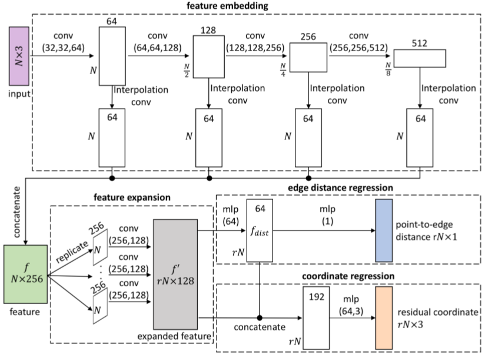

# 	EC-NET

EC-Net: an Edge-aware Point set Consolidation Network


## Abstract

​	Point clouds obtained from 3D scans are typically **sparse, irregular, and noisy**, and required to be **consolidated**. In this paper, we present the first deep learning based **edge-aware** technique to facilitate the consolidation of point clouds. 从3D扫描获得的点云通常是稀疏的，不规则的和嘈杂的，需要进行合并。 在本文中，我们提出了第一个基于深度学习的边缘感知技术，以促进点云的合并。 

​	We design our network to process points grouped in local patches, and train it to learn and help consolidate points, deliberately for edges.  我们设计网络以处理按局部块分组的点，并对其进行训练以学习和帮助合并点（故意针对边缘）。

​	To achieve this, we formulate a **regression component** to simultaneously recover 3D point coordinates and point to-edge distances from upsampled features, and an edge-aware joint loss function to directly minimize distances from output points to 3D meshes and to edges.  为了实现这一点，我们制定了回归分量以从上采样的特征中同时恢复3D点坐标和点到边缘的距离，以及边缘感知的关节损失函数以直接最小化从输出点到3D网格以及到边缘的距离。 

​	Compared with previous neural network based works, our consolidation is edge-aware. During the synthesis, our network can attend to the detected sharp edges and enable more accurate 3D reconstructions.  与以前的基于神经网络的作品相比，我们的整合具有边缘感知能力。 在合成过程中，我们的网络可以关注检测到的尖锐边缘并实现更准确的3D重建。

​	Also, we trained our network on virtual scanned point clouds, demonstrated the performance of our method on both synthetic and real point clouds, presented various surface reconstruction results, and showed how our method outperforms the state-of-the-arts. 此外，我们在虚拟扫描点云上训练了我们的网络，展示了我们的方法在合成点云和真实点云上的性能，展示了各种曲面重建结果，并展示了我们的方法如何胜过最新技术。

---

## 1. Introduction

​	Point cloud consolidation is a process of “massaging” a point set into a surface [1], for enhancing the surface reconstruction quality. In the past two decades, a wide range of techniques have been developed to address this problem, including denoising, completion, resampling, and many more. However, these techniques are mostly based on priors, such as piecewise smoothness. Priors are typically over-simplified models of the actual geometry behavior, thus the prior-based techniques tend to work well for specific class of models rather than being general. 点云合并是通过类似“按摩”的过程把点集放入表面[1]，以提高表面重建的质量。在过去的二十年中，已经开发了各种各样的技术来解决此问题，包括降噪，完成，重采样等等。但是，这些技术主要基于先验条件，例如分段平滑度。先验通常是实际几何行为的过度简化模型，因此，基于先验的技术对于特定类型的模型趋向于很好地工作，而不是通用的。


​	To **implicitly model** and characterize the geometry behavior, one common way is to take a **data-driven** approach and model the complex behavior using **explicit examples**. Data-driven surface reconstruction techniques [2,3,4,5] are based on matching local portions (often denoted as patches) to a set of examples. Particularly, the emergence of neural networks and their startling performance provide a new means for 3D reconstruction from point sets by data-driven learning [6,7,8]. One of the main limitations of these neural network based methods is that they are oblivious to sharp features on 3D objects, where undersampling problems are typically more severe, making it challenging for an accurate object reconstruction. 为了隐式建模和表征几何行为，一种常见的方法是采用数据驱动的方法，并使用显式示例对复杂行为建模。 数据驱动的表面重建技术[2,3,4,5]基于将局部（通常称为贴片）与一组示例匹配。 特别是，神经网络的出现及其惊人的性能为通过数据驱动的学习从点集进行3D重建提供了一种新的方法[6,7,8]。 这些基于神经网络的方法的主要局限性之一是，它们忽略了3D对象上的鲜明特征，在这种情况下，欠采样问题通常更为严重，这给精确的对象重建带来了挑战。


​	In this paper, we present the first edge-aware consolidation network, namely EC-Net, for point cloud consolidation. The network is designed and trained, such that the output points admit to the surface characteristic of the 3D objects in the training set. More importantly, our method is edge-aware, in the sense that the network learns the geometry of edges from the training set, and during the test time, it identifies edge points and generates more points along the edges (and over the surface) to facilitate a 3D reconstruction that preserves sharp features.在本文中，我们介绍了用于点云整合的第一个边缘感知整合网络，即EC-Net。 对网络进行设计和训练，以使输出点符合训练集中3D对象的表面特征。 更重要的是，在网络从训练集中学习边缘的几何形状的意义上，我们的方法是边缘感知的，并且在测试期间，它可以识别边缘点并沿着边缘（以及整个表面）生成更多点，从而 有助于保留清晰特征的3D重建。


​	Generally speaking, scanned point sets are **irregular and non-uniform**, and thus, do not lend themselves to be learned by common convolutional neural networks (CNN). Inspired by PointNet [9], we directly process 3D points by converting their coordinates into deep features and producing more points by feature expansion [7]. Then, for efficient learning of the edges, we design our network to process points grouped as local patches in the point cloud. To do so, we develop a patch extraction scheme that solely works on points, so that we can extract patches of points for use consistently in both training and testing phases.一般而言，扫描点集是不规则且不均匀的，因此不适合通过普通卷积神经网络（CNN）学习。 受PointNet [9]的启发，我们通过将3D点的坐标转换为深层特征并通过特征扩展产生更多点来直接处理3D点[7]。 然后，为了有效地学习边缘，我们设计了网络以处理在点云中分组为局部块的点。为此，我们开发了仅在点上起作用的块提取方案，以便我们可以提取要在培训和测试阶段一致使用的点补丁。


​	In addition, to train the network to be edge-aware, we associate edge and mesh triangle information with the training patches, and train the network to learn features from the patches by regressing point-to-edge distances and then the point coordinates. 此外，为了使网络具有边缘感知能力，我们将边缘和网格三角形信息与训练块相关联，并通过对点到边缘的距离进行回归，然后对点坐标进行回归，从而训练网络从块中学习特征。 

​	More importantly, we design a novel edge-aware joint loss function that can be efficiently computed for directly comparison between the output points and ground truth 3D meshes. Our loss function encourages the output points to be located close to the underlying surface and to the edges, as well as distributed more evenly on surface.  更重要的是，我们设计了一种新颖的边缘感知联合损失函数，可以对其进行有效计算，以直接比较输出点和地面真实3D网格。 我们的损失函数鼓励输出点位于下层表面和边缘附近，并在表面上更均匀地分布。

​	Then in the inference phase, the network can generate and find output points close to the edges. Since it is difficult to annotate edges directly in real scanned point clouds, we train our network on synthesized virtual scanned point clouds, and show the performance of our method on both real and virtual scanned point clouds. By using our trained network, we show through various experiments that we can improve not only the point cloud consolidation results (see Figures 1(b) & (c)), but also the surface reconstruction quality, compared to various state-of-the-art methods. All the code is available at the project webpage.然后，在推理阶段，网络可以生成并找到靠近边缘的输出点。 由于很难在真实扫描点云中直接注释边缘，因此我们在合成的虚拟扫描点云上训练我们的网络，并在真实和虚拟扫描点云上展示我们方法的性能。 通过使用我们训练有素的网络，我们通过各种实验表明，与各种状况相比，我们不仅可以改善点云合并结果（参见图1（b）和（c）），而且还可以改善表面重建质量。 艺术方法。 所有代码都可以在项目网页1上找到。

---

**Related works.** Consolidating scanned data and imperfect point clouds has been an active research area since the early 90’s [10,11,12]. We briefly review some traditional geometric works and then discuss some recent related works that employ neural networks. For a more comprehensive survey, please refer to [13].自90年代初期以来[10,11,12]，整合扫描数据和不完善的点云一直是一个活跃的研究领域。我们简要回顾一些传统的几何作品，然后讨论一些利用神经网络的最新相关作品。 有关更全面的调查，请参阅[13]。

*Point cloud consolidation.* Early works in this area assumed smooth surface [1,14,15]. In [14], the parameterization-free local projection operator (LOP) was devised to enhance the point set quality. However, these methods are oblivious to sharp edges and corners. To consolidate a point set in an edge-aware manner, some methods detected/sensed the sharp edges and arranged points deliberatively along edges to preserve their sharpness [16,17,18,19]. Huang et al. [20] developed the edge-aware resampling (EAR) algorithm; it computes reliable normals away from edges and then progressively upsamples points towards the surface singularities. Despite its promising results, EAR depends on the accuracy of the given/estimated normal. Preiner et al. [21] developed CLOP, a continuous version of the LOP, for fast surface construction using the Gaussian mixture model to describe the point cloud density. To sum up, these geometric approaches either assume strong priors or rely on extra geometric attributes for upsampling point sets.该领域的早期工作假定表面光滑[1,14,15]。在[14]中，设计了无参数的局部投影算子（LOP）以提高点集质量。但是，这些方法忽略了尖锐的边缘和角落。 为了以边缘感知的方式合并点集，一些方法检测/感知了尖锐的边缘，并故意沿着边缘排列点以保持其锐度[16,17,18,19]。黄等[20]开发了边缘感知重采样（EAR）算法； 它会计算远离边缘的可靠法线，然后逐步将采样点向上采样到表面奇异点。 尽管其结果令人鼓舞，但EAR取决于给定/估计法线的准确性。Preiner等[21]开发了CLOP，它是LOP的连续版本，用于使用高斯混合模型描述点云密度的快速表面构造。 综上所述，这些几何方法要么假定先验强，要么依赖额外的几何属性进行上采样点集。

*Neural networks for mesh and point cloud processing.* Motivated by the promising results that deep learning methods have achieved for image and video problems, there has been increasing effort to leverage neural networks for geometry and 3D shape problems. To do so, early works extracted low-level geometric features as inputs to CNNs [22,23]. Other works converted the input triangular meshes or point clouds to regular voxel grids [24,25,26,27,28,29] for CNN to process. However, pre-extracting low-level features may bring bias, while a volume representation demands a high computational cost and is constrained by its resolution.出于对图像和视频问题的深度学习方法所取得的令人鼓舞的结果的激励，人们越来越多地选择利用神经网络来解决几何和3D形状问题。 为此，早期工作提取了低级几何特征作为CNN的输入[22,23]。 其他工作将输入的三角形网格或点云转换为规则的体素网格[24,25,26,27,28,29]供CNN处理。 但是，预提取的低级功能可能会带来偏差，而体积表示需要很高的计算成本，并受其分辨率的限制。

---

Recently, point clouds have drawn more attention, and there are some works to utilize neural networks to directly process point clouds. Qi et al. [9] firstly developed the PointNet, a network that takes a set of unordered points in 3D as inputs and learns features for object classification and segmentation. Later, they proposed the PointNet++ to enhance the network with a hierarchical feature learning technique [30]. Subsequently, many other networks have been proposed。 近年来，点云引起了越来越多的关注，并且有一些利用神经网络直接处理点云的工作。  Qi等[9]首先开发了PointNet，该网络以3D中的一组无序点作为输入，并学习对象分类和分割的功能。 后来，他们提出了PointNet ++，以一种分层的特征学习技术来增强网络[30]。 随后，提出了许多其他网络


---

## 2. Method

In this section, we first present the training data preparation (Sec. 2.1) and the EC-Net architecture (Sec. 2.2). Then, we present the edge-aware joint loss function (Sec. 2.3) and the implementation details (Sec. 2.4). Figure 2 shows the pipeline of EC-Net; see the supplemental material for the detailed architecture. 在本节中，我们首先介绍培训数据准备（第2.1节）和EC-Net体系结构（第2.2节）。 然后，我们介绍了边缘感知联合损失函数（第2.3节）和实现细节（第2.4节）。 图2显示了EC-Net的管道； 有关详细架构，请参见补充材料。


**Fig. 2: The pipeline of EC-Net.**  对于输入**patch**中的每个点，我们首先使用PointNet++将其局部几何编码为特征向量 $f$（大小：$N×D$），然后使用特征扩展机制将 $f$ 扩展为 $f'$（大小：$rN×D_2$）。然后，我们对**残差点坐标**以及**距扩展特征的点到边距离**（$d$）进行回归，并通过将原始点坐标添加到残差来形成输出点坐标。最后，网络识别边缘上的点并产生输出点。该网络使用边缘感知的联合损失功能进行了训练，右侧四个黄色框。

---

### 2.1. Training data preparation

​	We train our network using point clouds synthesized from 3D objects, so that we can have ground truth surface and edge information. To start, we collect 3D meshes from ShapeNet [43] and other online repositories, including simple 3D shapes, mechanical parts, and everyday objects such as chairs. Since we train the network with patches as inputs, we prepare a large amount of patches on the 3D meshes and do not require many meshes. Moreover, we manually sketch polylines on each 3D mesh to annotate sharp edges on the meshes; see Figure 3(a). 我们使用从3D对象合成的点云来训练mesh，以便获得G.T.表面和边缘信息。首先，我们从ShapeNet [43]和其他在线存储库中收集3D网格，包括简单的3D形状，机械零件和日常对象（例如椅子）。 由于我们使用 **patch** 作为输入来训练网络，因此我们在3D网格上准备了大量patch，因此不需要很多mesh。此外，我们在每个3D网格上手动绘制折线以注释网格上的尖锐边缘。参见图3（a）。


**Fig .3** 在我们收集的某些3D网格（a）上的示例带注释的边缘（红色）。由我们的虚拟3D扫描产生的示例点云（b）。点密度变化，并且放大窗口也显示合成噪声。

**Virtual scanning.** To obtain point clouds from the 3D mesh objects, we use the following virtual scanning procedure. First, we normalize the mesh to fit in [−1,+1]3, and evenly arrange a circle of 30 virtual cameras (50° field of view) horizontally around (and to look at) the object. We then put the cameras two units from the object center and randomly perturb the camera positions slightly upward, downward or sideway. After that, we produce a point cloud for each camera by rendering a depth image of the object, adding quantization noise (see Sec. 3) to the depth values and pixel locations, and backprojecting each foreground pixel to obtain a 3D point sample. Then, we can compose the 3D point clouds from different cameras to obtain a virtual scanned data. Such sampling procedure mimics a real scanner with surface regions closer to the virtual camera receiving more point samples; see Figure 3(b) for two example results.  要从3D网格对象获取点云，我们使用以下虚拟扫描过程。首先，我们将网格标准化为适合$[−1，+ 1]^3$的水平，并在对象周围水平放置（并观察）30个虚拟摄像机（50°视场）的圆周。然后，我们将摄像头放置在距对象中心两个位置的位置，并随机地将摄像头的位置稍微向上，向下或侧向扰动。之后，我们通过渲染对象的深度图像，将量化噪声（see Sec. 3）添加到深度值和像素位置，并对每个前景像素进行反投影以获得3D点样本，为每个摄像机生成一个点云。 然后，我们可以从不同的摄像机组成3D点云，以获得虚拟扫描数据。这种采样过程模拟了一个真实的扫描仪，其表面区域更靠近虚拟相机，并接收更多的点样本。有关两个示例结果，请参见图3(b)。

**Patch extraction.** From a point cloud (see Figure 4(c)), we aim to extract local groups of points (patches), such that the points in a patch are geodesically close to one another over the underlying surface. This is very important, since using Euclidean distances to select points could lead to points on opposite sides of a thin surface, e.g., see the thin plates in the chair shown in Figure 3(b). Compared with [7], our patch extraction procedure directly operates on point clouds, not meshes, so we need a consistent extraction procedure for both network training and inference, where ground truth meshes are not available during the inference.  从一个点云（请参见图4(c)），我们旨在提取局部点组（patch），以使patch中的点在基本表面上大地上彼此接近。这是非常重要的，因为使用欧几里得距离选择点可能会导致点在薄表面的相对两侧，例如，请参见图3(b)所示的椅子上的薄板。与文献[7]相比，我们的patch提取程序直接在点云上运行，而不是在网格上运行，因此对于网络训练和推理，我们都需要一个一致的提取程序，而在推理过程中地面真相网格是不可用的。


**Fig. 4** 从点云中提取patch（一组局部点）的过程； 请注意，（a）和（b）仅在训练（而不是推论）阶段可用。

​	To this end, we first construct a weighted graph by considering each point as a **node** and creating an edge from each point to its k-nearest neighboring (k-nn) points, where k=10; see Figure 4(d). The edge weight is set as the Euclidean distance between the two points. 为此，我们首先通过将每个点视为一个节点并从每个点到其k个最近的相邻（k-nn）个点（其中k = 10）创建一条边来构造加权图; 参见图4（d）。 边缘权重设置为两点之间的欧式距离。 

​	Then, we randomly select m=100 points as the **patch centroids**; from each selected point, we use the Dijkstra algorithm to find the 2048 nearest points in terms of shortest path distances in the graph. Hence, we can find points that are approximately within a geodesic radius from the centroid.  然后，我们随机选择 m = 100 个点作为patch质心；从每个选定的点开始，我们使用Dijkstra算法根据图中的最短路径距离找到2048个最近的点。 因此，我们可以找到距质心大约在测地线半径内的点。 

​	Further, we randomly select $\hat{N}=1024$ points out of the 2048 points to introduce randomness into the point distribution, and normalize the 3D coordinates of the points to have zero mean inside a unit ball. For patches used for training, we also find the associated mesh triangles and annotated edge segments near the patches as the ground truth information for training the network; see Figure 4(e).  此外，我们从2048个点中随机选择 $\hat{N}=1024$ 个点，以将随机性引入点分布，并将这些点的3D坐标归一化以使单位球内的均值为零。 对于用于训练的patch，我们还找到了patch附近的相关网格三角形和带注释的边线段，作为训练网络的G.T.信息。 参见图4（e）。

---

### 2.2. Edge-aware Point set Consolidation Network


**Fig. 2: The pipeline of EC-Net.**  对于输入**patch**中的每个点，我们首先使用PointNet++将其局部几何编码为特征向量 $f$（大小：$N×D$），然后使用特征扩展机制将 $f$ 扩展为 $f'$（大小：$rN×D_2$）。然后，我们对**残差点坐标**以及**距扩展特征的点到边距离**（$d$）进行回归，并通过将原始点坐标添加到残差来形成输出点坐标。最后，网络识别边缘上的点并产生输出点。该网络使用边缘感知的联合损失功能进行了训练，右侧四个黄色框。

​	In this subsection, we present the major components of EC-Net; see Figure 2.

#### **Feature embedding and expansion.** 

​	This component first maps the neighboring information (raw 3D coordinates of nearby points) around each point into a feature vector using PointNet++ [30] to account for the fact that the input points are irregular and unordered. 该组件首先使用PointNet++将每个点周围的邻近信息（附近点的原始3D坐标）映射到特征向量中，以解释输入点不规则且无序的事实。

​	The output is a D-dimensional multi-scale feature vector for each input point, where D is 256 in our experiments. In this step, we make the following adaptation for our problem. By design, PointNet++ processes a full point cloud of an object, while EC-Net processes local patches. Since patches have open boundary, points near the boundary have neighbors mostly on one of its side only, so we found that the extracted features of these points are less accurate.  输出是每个输入点的D维多尺度特征向量，在我们的实验中D为256。 在这一步中，我们对问题进行了以下调整。 按照设计，PointNet++处理对象的整个点云，而EC-Net处理局部patch。 由于patch具有开放边界，边界附近的点大多仅在其一侧具有邻居，因此我们发现这些点的提取特征不太准确。

​	Hence, out of the ˆ N feature vectors, we retain the N= ˆ N 2 feature vectors (denoted as f) corresponding to points closer to the patch centroid. Next, the component synthesizes points by expanding features directly in feature space using the feature expansion module in [7], since points and features should be interchangeable. After this module, feature f (dimension: N ×D) are expanded to be f0 (dimension: rN ×D2), where r is the upsampling rate and D2 is the new feature dimension, which is set as 128; see again Figure 2.   因此，在 $\hat{N}$ 个特征向量中，我们保留了 $N = \frac{\hat{N}}{2}$ 个特征向量（表示为 $f$ ），它们对应于更接近贴片质心的点。 接下来，由于点和特征应该是可互换的，因此组件通过使用[7]中的特征扩展模块在特征空间中直接扩展特征来合成点。 在此模块之后，将特征 $f$ （尺寸：$N×D$）扩展为 $f'$ （尺寸：$rN×D_2$），其中 r 为上采样率，$D_2$为新特征尺寸，设置为128； 再次参见图2。

#### **Edge distance regression.** 

​	This component regresses a point-to-edge distance for each expanded feature (or point, equivalently) later for edge points identification. The regressed distance is an estimated shortest distance from the output point to the nearest annotated edge segment among all annotated edge segments associated with the patch.   该组件为每个扩展特征（等价于一个 **点**）回归一个点到边的距离，以进行边缘点识别。 回归距离是与该patch相关联的所有**带注释边缘段**中从输出点到最近的**带注释边缘段**的最短估计距离。

​	To do this, we extract a distance feature fdist from the expanded feature f0 via a fully connected layer, and then regress the point-to-edge distance d from fdist via another fully connected layer. We do this in two steps, so that we can feed fdist also to the coordinate regression component.   为此，我们通过一个全连接的层从扩展特征 $f’$ 提取距离特征 $f_{dist}$，然后通过另一个全连接的层从 $f_{dist}$ **回归**成点到边缘的距离 $d$。 我们分两步进行操作，这样我们就可以将 $f_{dist}$ 也输入坐标回归组件。

#### **Coordinate regression.** 

​	This component reconstructs the 3D coordinates of the output points; see Figure 2. First, we concatenate the expanded feature f0 with the distance feature fdist (from previous component) to form another feature, since fdist contains certain point-to-edge distance information. Then, we regress the point coordinates from the concatenated feature by applying two fully connected layers. Note that we only regress the residual 3D coordinates, and the network output 3D coordinates of the output points by adding the original 3D coordinates of the input points to the regressed residual 3D coordinates.

​	该组件可重建输出点的3D坐标；参见图2。首先，由于 $f_{dist}$ 包含某些点到边的距离信息，因此我们将扩展特征 $f’$ 与距离特征 $f_{dist}$ （来自上一个组件）连接起来以形成另一个特征。 然后，我们通过应用两个全连接的图层来从级联特征中回归点坐标。请注意，我们仅对残差3D坐标进行回归，并通过将输入点的原始3D坐标与回归的残差3D坐标相加来对输出点的网络输出3D坐标进行回归。

#### **Edge points identification.** 

Denoting di as the regressed point-to-edge distance of output point xi, we next find a subset of output points, namely edge points (denoted as S∆d with threshold ∆d) that are near the edges: S∆d = {xi}di<∆d. Note that this component is performed in both training and inference phases.  将 $d_i$ 表示为输出点 $x_i$ 的点到边的回归距离，接下来我们找到一个输出点的子集，即边缘附近的边缘点（用阈值 $\Delta_d$ 表示为 $S_{\Delta_d}$）：$\mathcal{S}_{\Delta_{d}}=\left\{x_{i}\right\}_{d_{i}<\Delta_{d}}$。 请注意，此组件在训练和推理阶段均执行。




**Fig. 12: The network architecture of EC-Net.** 

– The feature embedding component (see the dashed box on top) is based on PointNet++, where we adopt four levels with grouping radii 0.1, 0.2, 0.4, and 0.6 to extract the local features. The corresponding number of point samples in these four levels are N, N 2 , N 4 , and N 8 , respectively.  特征嵌入组件（请参见顶部的虚线框）基于PointNet ++，在这里我们采用四个级别，将半径0.1、0.2、0.4和0.6分组，以提取局部特征。 这四个级别中相应的点样本数分别为 $N$， $\frac{N}{2}$，$\frac{N}{4}$ 和 $\frac{N}{8}$。  

– Next, we directly **concatenate** features from different levels to **aggregate** the **multi-level feature.** Specifically, for each level, we use the interpolation in PointNet++ to restore the feature of the level, and then use a convolution to **reduce** the restored feature to **64** dimensions. After that, we concatenate the restored features from the four levels to form the D = 256 dimensional feature denoted as f (see the green box above). 接下来，我们直接将不同级别的要素连接起来，以聚合多级别的要素。 具体来说，对于每个级别，我们使用PointNet ++中的插值来还原级别的特征，然后使用卷积将还原的特征缩小为64维。 之后，我们将四个级别的还原特征连接起来，形成**D = 64*4 = 256**维特征，表示为 $f$（请参见上面的绿色框）。

– In the feature expansion component (see the dashed box on lower left), we follow the feature expansion module in PU-Net. Specifically, we create r copies of feature f, independently apply two separated convolutions with 256 and 128 output channels to each copy, and then concatenate the outputs to form the expand feature denoted as  $f'$ (see the grey box above).  在特征扩展组件（请参见左下方的虚线框）中，我们遵循PU-Net中的特征扩展模块。 具体来说，我们创建特征 $f$ 的 $r$ 个副本，分别对每个副本分别应用两个分别具有256和128个输出通道的卷积，然后将输出连接起来以形成表示为 $f'$ 的扩展特征（请参见上面的灰色框）

– In the edge distance regression component, we first use one fully-connected layer with width 64 to regress fdist from f0. Then, we use another fully-connected layer with width 1 to regress the point-to-edge distance d. 在边缘距离回归组件中，我们首先使用一层宽度为64的全连接的层使 $f_{dist}$ 从 $f'$ 回归。 然后，我们使用另一个宽度为1的全连接的层来回归点到边的距离 $d$ 。

– In the coordinate regression component, we first concatenate the fdist and f0 to form a 192 dimensional feature. Then, we use two fully-connected layers with width 64 and 3 to regress the residual point coordinates from the concatenated feature, and output the final 3D coordinates by adding back the original point coordinates.  在坐标回归组件中，我们首先将 $f_{dist}$ 和 $f'$ 连接起来以形成192维特征。然后，我们使用两个宽度分别为64和3的全连接的图层来从级联特征中回归残差点坐标，并通过加回原始点坐标来输出最终的3D坐标。

​	All the convolution layers and fully-connected layers in the above network are followed by the ReLU operator, except for the last two point-to-edge distance and residual coordinate regression layers.

​	除了最后两个点到边缘距离和残差坐标回归层之外，ReLU运算符跟随上述网络中的所有卷积层和全连接层。

---


### 2.3. Edge-aware joint loss function

The loss function should encourage the output points to be (i) located close to the underlying object surface, (ii) edge-aware (located close to the annotated edges), and (iii) more evenly distributed on the object surface. To this end, we guide the network’s behavior by designing an edge-aware joint loss function with the following four loss terms (see also the rightmost part of Figure 2):

​	损失函数应鼓励输出点位于（i）靠近下面的对象表面，（ii）边缘感知（位于靠近带注释的边缘）和（iii）更均匀地分布在对象表面上。 为此，我们通过设计具有以下四个损耗项的边缘感知联合损耗函数来指导网络的行为（另请参见图2的最右侧）：

#### Surface loss

encourages the output points to be located close to the underlying surface. When extracting each training patch from the input point clouds, we find **triangles** and **edge segments** associated with the patch; see Figure 4. Hence, we can define surface loss using the minimum shortest distance from each output point xi to all the mesh triangles T associated with the patch: dT(xi,T) = mint∈T dt(xi,t), where dt(xi,t) is the shortest distance from xi to triangle t ∈ T. It is worth noting that to compute dt in 3D, we need to consider seven cases, since the point on t that is the closest to xi may be located at triangle vertices, along triangle edges, or within the triangle face. Experimentally, we found that the algorithm [44] for calculating dt can be implemented using TensorFlow to automatically calculate the gradients when training the network. With dT computed for all the output points, we can sum them up to compute the surface loss:

​	Surface loss 会促使输出点位于下层曲面附近。 当从输入点云中提取每个训练patch时，我们发现与patch相关的三角形和边线段。参见图4。因此，我们可以使用最小化每个**输出点** $x_i$ 到**与patch相关的所有网格三角形** T 的**最短距离**来定义Surface loss ：
$$
d_T（x_i,T）=mint∈Td_t（x_i,t）
$$
​	其中 $d_t（x_i，t）$ 是 $x_i$ 到三角形 $t∈T$ 的最短距离。值得注意的是，在3D中计算 $d_t$ 时，我们需要考虑7种情况，因为 t 上最接近 $x_i$ 的点可能位于在三角形顶点，沿三角形边缘或在三角形面内。 通过实验，我们发现可以使用 TensorFlow 来实现计算 $d_t$ 的算法[44]，以便在训练网络时自动计算梯度。 通过为所有输出点计算 $d_T$ ，我们可T以将它们求和以计算表面损耗：
$$
L_{\text {surf }}=\frac{1}{\tilde{N}} \sum_{1 \leq i \leq \tilde{N}} d_{T}^{2}\left(x_{i}, T\right)
$$
​	其中$\hat{N}=rN$ 是每个 patch 中输出点的数量。

----

#### **Edge loss** 

encourages the output points to be edge-aware, i.e., located close to the edges. Denoting E as the set of annotated edge segments associated with a patch, we define edge loss using the minimum shortest distance from each edge point to all the edge segments in the patch: dE(xi,E) = mine∈E de(xi,e), where de(xi,e) is the shortest distance from edge point xi to any point on edge segment e ∈ E. Again, we implement the algorithm in [45] to calculate de for different shortest distance cases using TensorFlow to automatically calculate the gradients. Then, we sum up dE for all the edge points and obtain the edge loss: 

​	边缘损失会促使输出点意识到边缘，即位于边缘附近。 将 $E$ 表示为与 patch 相关联的带注释的**边线段**的集合，我们使用从每个边缘点到patch中所有**边线段**的最小最短距离来定义边线损耗：
$$
d_{E}\left(x_{i}, E\right)=\min _{e \in E} d_{e}\left(x_{i}, e\right)
$$
​	其中 $d_{e}\left(x_{i}, e\right)$ 是从边缘点 $x_i$ 到边缘段 $e∈E$ 上任何点的最短距离。同样，我们在[45]中实现了算法，以使用TensorFlow自动计算不同的最短距离情况下的 $d_e$ 计算梯度。 然后，我们对所有边缘点的 $d_E$求和，得出边缘损失：
$$
L_{\text {edge }}=\frac{\sum_{x_{i} \in \mathcal{S}_{\Delta_{d}}} d_{E}^{2}\left(x_{i}, E\right)}{\left|\mathcal{S}_{\Delta_{d}}\right|}
$$
​	其中$\mathcal{S}_{\Delta_{d}}$是边缘点集。 

---

#### **Repulsion loss** 

​	Repulsion loss 鼓励输出点在基础表面上更均匀地分布。 给定一组输出点$x_{i}, i=1 \ldots \tilde{N}$，将其定义为
$$
L_{\text {repl }}=\frac{1}{\tilde{N} \cdot K} \sum_{1 \leq i \leq \tilde{N}} \sum_{i^{\prime} \in \mathcal{K}(i)} \eta\left(\left\|x_{i^{\prime}}-x_{i}\right\|\right)
$$
​	其中 $\mathcal{K}(i)$ 是 $x_i$ 的K最近邻的索引集（我们将K设置为 4），$$||·  ||$$ 是L2范数，并且 $η（r）= max（0，h^2-r^2）$是对 $x_i$ 进行惩罚的函数，如果它太靠近其他一些附近的点，则根据经验将 $h$ 设置为0.03（经验均值  [20]根据点数和包围盒对角线长度估算出的点之间的距离）。 

​	值得注意的是，我们只想在 $x_i$ 过于接近某些邻域点时对其进行惩罚，因此我们仅考虑 $x_i$ 周围的一些最近邻域点； 此外，当点对点距离大于 $h$ 时，我们消除了排斥效应。

---

#### **Edge distance regression loss** 

​	边缘距离回归损失旨在指导网络将点到边缘距离 $d$ 回归为 $rN$ 个输出点的； 参见图2。考虑到网络难于回归$d$，因为并非所有输出点实际上都靠近带注释的边缘。 因此，我们设计了一个截断的回归损失：
$$
L_{r e g r}=\frac{1}{\tilde{N}} \sum_{1 \leq i \leq \tilde{N}}\left[\mathcal{T}_{b}\left(d_{E}\left(x_{i}, E\right)\right)-\mathcal{T}_{b}\left(d_{i}\right)\right]^{2}
$$
​	其中 $\mathcal{T}_{b}(x) = max(0,min(x,b))$ 是具有参数 $b$ 的分段线性函数。根据经验，我们发现网络训练对 $b$ 不敏感，并将其设置为0.5。

---

#### **End-to-end training** 

​	When training the network, we minimize the combined edge-aware joint loss function below with balancing weights $α$ and $β$:
$$
\mathcal{L}=L_{\text {surf }}+L_{\text {repl }}+\alpha L_{\text {edge }}+\beta L_{\text {regr }}
$$
​	In our implementation, we set $α$ and $β$ as 0.1 and 0.01, respectively.


----

### 2.4. Implementation Details

#### Network training 训练

​	Before the training, each input patch is normalized to fit in [−1,1]3. Then, we augment each patch on-the-fly in the network via a series of operators: a random rotation, a random translation in all dimensions by -0.2 to 0.2, a random scaling by 0.8 to 1.2, adding Gaussian noise to the patch points with σ set as 0.5% of the patch bounding box size, and randomly shuffling the ordering of points in the patch. 	在训练之前，将每个输入patch均归一化为 $[−1,1]^3$中的值。 然后，我们通过一系列运算符在网络上实时扩展每个块：随机旋转，所有维度上的随机平移-0.2到0.2，随机缩放0.8到1.2，向补丁添加高斯噪声将 $\sigma$ 设置为块包围盒大小的0.5％的点，并随机关闭块中点的顺序。

​	We implement our method using TensorFlow, and train the network for 200 epochs using the Adam [46] optimizer with a minibatch size of 12 and a learning rate of 0.001. 	我们使用 TensorFlow 实施我们的方法，并使用Adam [46]优化器以最小批量大小为12和学习率为0.001训练网络200个epochs。

​	In our experiments, the default upsampling rate r is set as 4. For threshold ∆d, we empirically set it as 0.15, since it is not sensitive to slight variation in our experiments. Overall, it took around 5 hours to train the network on an NVidia TITAN Xp GPU.	在我们的实验中，默认的上采样率r设置为4。对于阈值$\Delta_d$，我们凭经验将其设置为0.15，因为它对我们的实验中的细微变化不敏感。 总体而言，在**NVidia TITAN Xp GPU**上训练网络大约需要5个小时。

---

#### Network inference 推理

​	We apply a trained network to process point clouds also in a patch-wise manner. To do so, we first find a subset of points in a test point cloud, and take them as centroids to extract patches of points using the procedure in Sec. 2.1.  我们也以 patch-wise(每个patch都执行)方式将训练有素的网络应用于点云。为此，我们首先在测试点云中找到一个点子集，并使用Sec 2.1中的过程将它们作为质心来提取点patch。

​	For the patches to distribute more evenly over the point cloud, we use **farthest point sampling** to randomly find points in the test point cloud with parameter β, which is empirically set as three. Hence, each point in the point cloud should appear roughly in β different patches on average. After extracting the patches, we feed them into the network and apply the network to produce 3D coordinates and point-to-edge distances, as well as to identify edge points (see Sec. 2.3). 	为了使 patch 在 $N_{pt}$ 个点的点云上分布更均匀，我们使用**FPS**来在测试点云中随机找到 $M =β\frac{N_{pt}}{N}$个点，根据经验将 $\beta$ 其设置为 3。 因此，点云中的每个点平均应大致出现在 $β$ 个不同的块中。 提取 patch 后，我们将 patch 输入网络，并应用网络生成3D坐标和点到边的距离，并识别边缘点（请参见第2.3节）。 

​	Unlike the training phase, we set a smaller ∆d, which is 0.05. We use a larger ∆d in the training because training is an optimization process, where we want the network to consider more points to learn to identify the points near the edges.	与训练阶段不同，我们将 $\Delta_d$ 设置为较小的0.05。 我们在训练中使用较大的 $\Delta_d$ ，因为训练是一个优化过程，我们希望网络考虑更多的点以学习识别边缘附近的点。

---

#### Surface reconstruction 表面重建

​	First, we build a k-nn graph for the output points from network. Then, we filter edge points by fitting line segments using RANSAC, and filter surface points (not near edges points) by finding small groups of nearby points in the k-nn graph in an edge-stopping manner and fitting planes using PCA. Edge stopping means we stop the breath-first growth at edge points; this avoids including irrelevant points beyond the edges. These steps are iterated several times. Lastly, we fill the tiny gap between edge and surface points by including some original points in the gap, and by applying dart throwing to add new points. To further reconstruct the surface, we follow the procedure in EAR [20] to downsample the point set and compute normals, use ball pivoting [47] or screened Poisson surface reconstruction [48] to reconstruct the surface, and use a bilateral normal filtering [49] to clean the resulting mesh.

​	首先，我们为网络的输出点建立一个k-nn图。 然后，我们通过使用**RANSAC拟合线段来筛选边缘点**，并通过边缘停止方式在k-nn图中找到附近点的小群并使用**PCA拟合平面来筛选表面点**（而不是边缘点）。 边缘停止意味着我们在边缘点停止呼吸的第一增长； 这样可以避免将不相关的点包括在边缘之外。 这些步骤重复了几次。 最后，我们通过在间隙中包含一些原始点并通过使用飞镖投掷来添加新点来填充边缘点与曲面点之间的微小间隙。 为了进一步重建表面，我们按照**EAR** [20]中的步骤对点集进行**下采样并计算法线**，使用**球枢轴**[47]或**屏蔽的Poisson表面重建**[48]来重建表面，并使用**双边法向滤波**[49]清洁所得的网格。

---


# 复现

```shell
docker run --runtime=nvidia --rm -it -w /home -v /home/duan/windows/udata:/home/data/ -v /tmp/.X11-unix:/tmp/.X11-unix -e DISPLAY=unix$DISPLAY -e GDK_SCALE -e GDK_DPI_SCALE ecnet:1.3.0-gpu /bin/bash

docker commit -p 906d25b0557d ecnet:1.3.0-gpu

docker commit -a "duan" -m "xxxx" -p 01c5eed0e308 ecnet:1.3.0-gpu
```


```shell
docker pull registry.cn-hangzhou.aliyuncs.com/denverdino/tensorflow:1.3.0-gpu
docker pull registry.cn-hangzhou.aliyuncs.com/kubeflow_0/tensorflow-serving
```


```
pip install python-graph-core
apt install python-tk
```