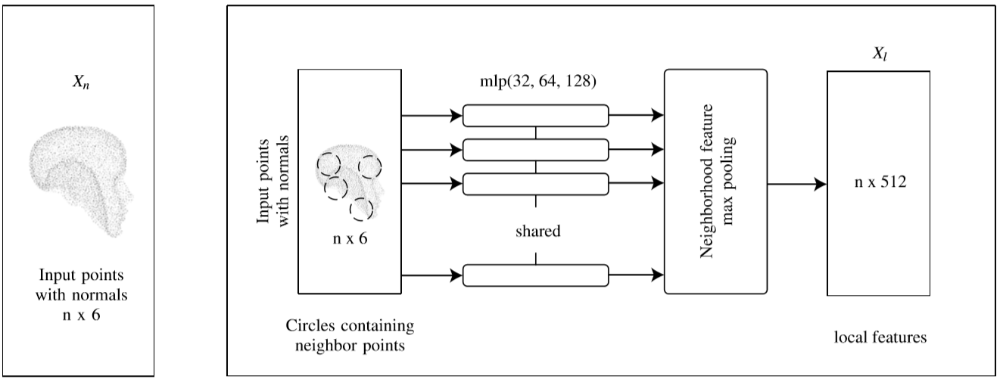
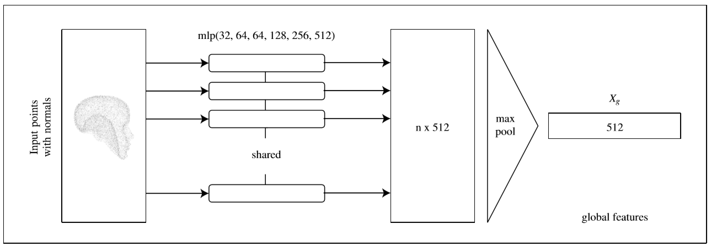
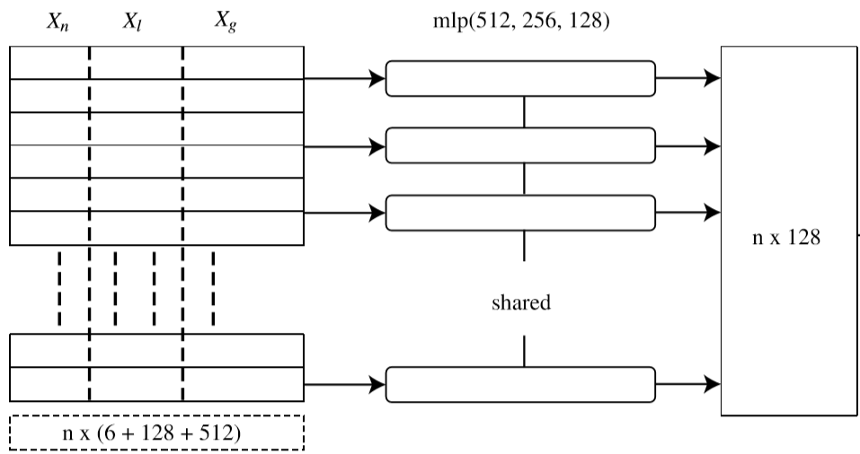
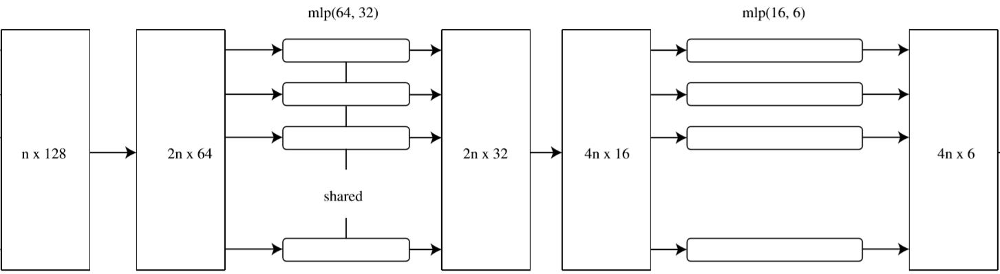

# Point Cloud Upsampling and Normal Estimation using Deep Learning for Robust Surface Reconstruction

## 1. Abstract

Thereconstructionofreal-worldsurfacesisonhighdemandinvariousapplications. Mostexistingreconstruction approaches apply 3D scanners for creating point clouds which are generally sparse and of low density. These points clouds will be triangulated and used for visualization in combination with surface normals estimated by geometrical approaches. However, the quality of the reconstruction depends on the density of the point cloud and the estimation of the surface normals. In this paper, we present a novel deep learning architecture for point cloud upsampling that enables subsequent stable and smooth surface reconstruction. A noisy point cloud of low density with corresponding point normals is used to estimate a point cloud with higher density and appendant point normals. To this end, we propose a compound loss function that encourages the network to estimate points that lie on a surface including normals accurately predicting the orientation of the surface. Our results show the benefit of estimating normals together with point positions. The resulting point cloud is smoother, more complete, and the final surface reconstruction is much closer to ground truth.

现实世界中表面构造的高要求的各种应用。 大多数现有的重建方法都使用3D扫描仪来创建通常稀疏且密度较低的点云。 这些点云将被三角剖分，并与通过几何方法估算的表面法线结合起来用于可视化。但是，重建的质量取决于点云的密度和表面法线的估计。在本文中，我们提出了一种新颖的深度学习架构，用于点云上采样，可以实现随后的稳定且平滑的表面重构。具有相应点法线的低密度噪声点云用于估计具有更高密度和附加点法线的点云。为此，我们提出了一种复合损失函数，该函数鼓励网络估算包括准确预测表面方向的法线在内的表面上的点。我们的结果显示了估计法线以及点位置的好处。由此产生的点云更平滑，更完整，并且最终的表面重建更接近于G.T.情况。

## 3. NETWORK ARCHITECTURE

对于给定的点云，我们的深度学习体系结构对应用的输入进行上采样并预测点法线，以使所有点均位于具有**均匀分布**的**基础表面**上。我们的深度学习网络包括特征嵌入，特征重塑（扩展点的维度）和点坐标回归。在3.1节中讨论输入点云到特征空间的转换将。在3.1节中完成了特征提取和连接。在第3.2节中讨论点维度中的特征重塑以上采样点。在3.3节特征扩展后，一系列具有共享权重的共享多层感知器（MLP）会将输出点云与法线进行回归。所有这些组件使我们能够使用点法线捕获上采样的点云。详细的架构如图1所示。

**Fig. 1** i,ii)输入点与局部特征提取模块

### 3.1. Feature Embedding

网络的主要目的是捕获输入点云的显著特征以学习其相邻点。 这是通过将输入点转换为高级矢量空间（称为特征）来完成的。 在我们的网络中，我们结合使用**全局和局部特征**提取来更好地捕获点云的属性。

#### 3.1.1 Global Features

全局特征的知识可以使网络更好地了解整个对象，例如，**density and spacing 密度和间距**等特征是模型特定的。PointNet（Qi等人，2016）架构使用一系列具有共享权重的共享MLP来提取用于分类和分割任务的全局特征。我们还使用相同的网络来提取全局特征。对于形状为 $n×6$ 的输入点云 $X_p$，全局特征 $X_g$ 的输出为 $1×g$ ，其中 $g$ 包含在最后一个MLP层中提取的特征数。

**Fig.1** iii) 全局特征提取模块

----

#### 3.1.2 Local Features

全局特征仅捕获对象的**overall property整体属性** ，但不包含有关局部属性的信息。局部特征是该网络最重要的部分。局部特征既包含邻域属性，也包含表面属性（例如法线）。 事实证明，局部特征在诸如点云分割或表面估计之类的任务中非常有帮助。我们有PointNet（Qi等人，2016），它通过使用一系列MLP提取每个点的特征。 But it does not induce local features based on **distance metrics**. 但是，它不会基于距离度量来诱发局部特征。对PointNet的改进是PointNet ++（Qi等人，2017），它捕获输入集中每个点的邻域patch，并对每个patch执行一系列MLP，并捕获局部信息。像PointNet ++一样，我们使用一系列不同**尺度**的样本和分组模块来提取 hierarchical features 层次结构特征，并将所有这些信息组合到一个特征层中。这也称为**多分辨率分组**。对于形状为 $n×6$ 的输入点云 $X_p$，局部特征 $X_l$的输出为 $n×l$，其中 $l$ 是在局部特征模块的最后一个MLP层中提取的特征数。

**Fig. 1** i,ii)输入点与局部特征提取模块

----

#### 3.1.3 Feature Concatenation

我们将所有学习的特征（即全局特征和局部特征）与沿特征维度的输入特征（即输入点云）**串联**起来。串联后的输出为 $n×(6 + 1 + g)$。 然后，在进行特征重塑之前，我们再次对这些级联特征使用一系列MLP。 这些操作之后的输出形状为 $n×d$ ，其中 $d$ 是缩放因子的倍数（即up_ratio，在我们的示例中为4）。

**Fig. 1** iv)特征串联

----

### 3.2 Feature Reshaping

​	特征Reshaping用于**扩展**点尺寸空间中的特征。由于点和特征都可以**interchangeable互换**，这意味着学习的特征也可以是相邻点。秉承这一理念，我们以点的维度reshaping了我们的特征，以扩大点的规模。此操作后，新的点特征形状为 $(n×up_{ratio})×(d÷up_{ratio})$。 Reshaping总是以2的倍数完成。

**Fig. 1** iv)特征reshaping

----

### 3.3 Coordinates Regression

在feature reshaping之后，我们使用一系列的MLP层以相应的法线对点云输出进行回归。 输出点云的形状为$(n×up_{ratio})×6$。 最终输出验证，G.T.是由复合损失函数完成的，下一部分将对此进行讨论。

----

## 4. LOSS FUNCTION

我们提出了一种由**点损失**和**法向损失**组成的复合损失函数。 点损失在第4.1节中介绍，而法向损失在第4.2节中介绍。

### 4.1 Point Loss

For point clouds, the Chamfer Distance (CD) (Fan et al., 2017) and Earth Mover’s Distance (EMD) (Rubner et al., 2000) are the most suitable cost functions. CDtriestofindtheminimumdistancebetween two sets of points, i.e., in our case the ground truth and the estimated point clouds. In the following, let the ground truth point cloud be Xp and the network output beb Xp. The CD is defined as: dcd(b Xp,Xp) = ∑ x∈b Xp min y∈Xpkx−yk2 2 + ∑ y∈Xp min x∈b Xpkx−yk2 2 (1) EMD tries to solve an optimization problem. The mathematical equation of EMD for output b Xp and groundtruthXp isshowninEq. (2)whereφ:b Xp→Xpis a bijection:
demd(b Xp,Xp) = min φ:b Xp→Xp
∑ x∈b Xp
kx−φ(x))k2 (2)
Both functions are fully differentiable. A Comparison of both functions can be seen in (Fan et al., 2017). However, EMD is more accurate than the CD. EMD is more computationally intensive and requires more time and memory for high density point clouds. In our network, we choose CD as a cost function for the point loss. It may happen that the predicted points lie too close to their neighbor points and this may lead to a non-uniform gathering of points in the point cloud. This behavior is depicted in Figure 2
Underlying surface Original points on underlying surface Predicted points Expected points on surface Figure2: Non-uniformgatheringofpredictedpointsaround the original points in the case of optimization using the chamfer distance CD. Therefore, we also include point neighbor loss as shown in Figure 3. This ensures that the new points are not only closer to the ground truth but also to K nearest points in the predicted points. The nearest neighbor loss is shown in Eq. (3). For our training, we set k = 15.
Underlying surface Original points on underlying surface New points Containing k neighbor points P0 to Pk−1
knn points Figure 3: Uniform distribution on underlying surface using knn point distance minimization.
dpoint knn(b Xp,Xp) = min x∈b Xp
k−1 ∑ i=0kx−yik2 2 (3) where: yi ∈Xp are the k nearest neighbors to x. Hence, the overall loss function for points is a combination of both CD and nearest neighbor loss. 

### 4.2 Normal Loss

为了预测准确的法线，我们也使用复合损失函数。对于上采样点云中的所有预测点，相应的点法线应接近G.T.真值和 adjacent 相邻点。这也确保了表面重建（例如，使用泊松重建）的鲁棒性。因此，我们使用欧氏距离度量来计算预测的法线和G.T.点法线之间的偏差。预测的法线 $\widehat{N}_{p}$ 和G.T.法线 $N_{p}$ 之间的法线损失如等式（4）所示。
$$
l_{\text {normal }}\left(\widehat{N}_{p}, N_{p}\right)=\min \sum_{\hat{n} \hat{N}_{p}, n \in N_{p}}\|\widehat{n}-n\|_{2}^{2} \tag{4}
$$
另外，我们需要注意估计的法线与下表面正交。由于法线垂直于表面，因此我们可以测量余弦相似度，如式（5）。
$$
l_{\text {normal_orth }}\left(\widehat{X}_{p}, \widehat{N}_{p}\right)=\min \sum_{i=0}^{k-1} \frac{\left\langle p_{l}-p_{i}, n_{l}\right\rangle}{\left\|p_{l}-p_{i}\right\|\left\|n_{l}\right\|} \tag{5}
$$
其中：$p_{i}, p_{l} \in X_{p}$，$p_i$ 是 $pl$ 的 knn，而 $n_l$ 是 $p_l$ 的法线，$\left\langle P,N\right\rangle$是点积

此外，我们假设每个最近 $k$ 点法线都应该相同。因此，我们尝试最小化每个预测法线的差异。该术语充当正态估计的附加正则化，并增强了平滑的邻域。对于我们的训练，我们将$k = 15$
$$
l_{\text {normal }_{-} k n n}\left(\widehat{N}_{p}\right)=\min _{x \in \widehat{N}_{p}} \sum_{i=0}^{k-1}\left\|x-y_{i}\right\|_{2}^{2}\tag{6}
$$
其中，$y_i\in\widehat{N}_p$ 是点 $x$ 的knn法线

----

### 4.3 Overall Loss

The overall loss function is a combination of both point loss and normal loss. Since the main objective is that new points are close to the input points, more weight is given to the point CD loss. The final loss function for training the network is given below with their corresponding weights. For our training we set w1 =1,w2 =0.1,w3 =0.05,w4 =0.0001,w5 =0.0001. We set larger values for the weights of point loss as compared to normal loss. The weights used by the lossfunctionareselectedbasedonablationstudy. We visualized the effect of different weights on the outputresultsandthus, cameupwiththeseweights. The knnlossfornormalshowsmoreerrorincaseofsharp edges thus have very small weight.

整体损失函数是点损失和法向损失的组合。 由于主要目的是使新点接近输入点，因此对点CD损失给予更大的权重。 下面给出了用于训练网络的最终损失函数及其相应的权重。 对于我们的训练，我们将w1 = 1，w2 = 0.1，w3 = 0.05，w4 = 0.0001，w5 = 0.0001。 与正常损失相比，我们为点损失权重设置了更大的值。 损失函数所使用的权重是根据讨厌的研究来选择的。 我们可视化了不同权重对输出结果的影响，并随之得出了这些权重。 正常情况下的节距在出现尖锐边缘的情况下显示出更多的错误，因此权重很小。

loss = w1dcd +w2dpoint knn +w3lnormal +w4lnormal orth +w5lnormal knn
(7)

----

