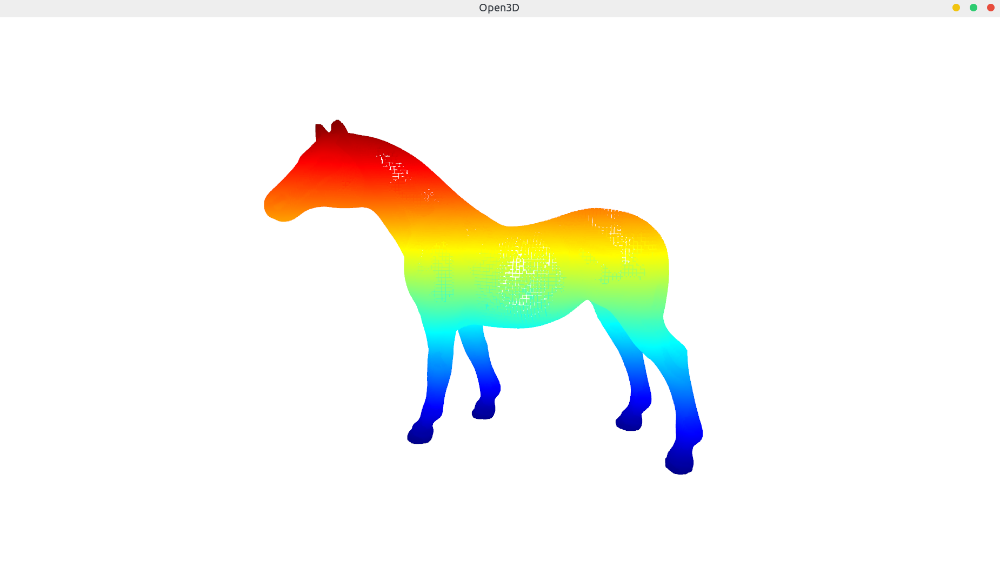
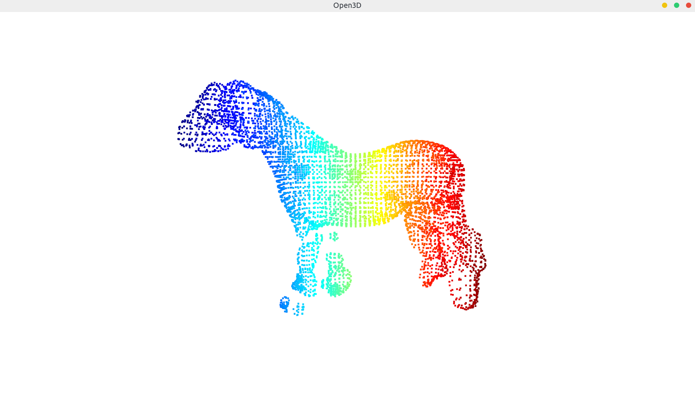

# 曲面重建





## docker

```bash
docker pull nvidia/opengl:1.0-glvnd-runtime-ubuntu18.04

docker run --runtime=nvidia --rm -it -v /home/duan/data:/home/data/ -v /tmp/.X11-unix:/tmp/.X11-unix -e DISPLAY=unix$DISPLAY -e GDK_SCALE -e GDK_DPI_SCALE nvidia/opengl:1.0-glvnd-runtime-ubuntu18.04

docker cp ./ beb9cb3564cf:/home/

docker commit -a "duan" -m "xxxx" -p 3cd7bb39415e nvidia/opengl:1.0-glvnd-runtime-ubuntu18.04
```


## PU-GAN重建

```
M. Kazhdan and H. Hoppe. Screened Poisson surface reconstruction. ACM Trans. on Graphics, 32(3):29:1–13, 2013.7
```


## PU-NET重建

```
apt-get install meshlab
```


## 安装pcl点云库

```bash
# 依赖 Boost 
# Boost库是一个可移植、提供源代码的C++库,作为标准库的后备,是C++标准化进程的发动机之一。
sudo apt-get install mpi-default-dev openmpi-bin openmpi-common #安装mpi库 信息传递接口
sudo apt-get install libboost-all-dev

# Eigen 线性代数运算库
sudo apt install libeigen3-dev
# FLANN 近似最近邻居的快速库
sudo apt install libflann1.9 libflann-dev
# VTK
sudo apt install libvtk7.1-qt libvtk7.1 libvtk7-qt-dev

# Qhull pcl_surface
sudo apt install libqhull* libgtest-dev
# OpenNI pcl_io

# CUDA pcl_*

```


```bash
build-essential # 基本构建软件包的信息性列表 
linux-libc-dev # Linux内核标头用于开发

libusb-1.0-0-dev libusb-dev # 用户空间USB编程库开发文件
libudev # 提供了API来进行内省和枚举本地系统上的设备。

mpi-default-dev # 高性能消息传递库-头文件
openmpi-bin # 高性能消息传递库-二进制文件
openmpi-common # 高性能消息传递库-通用文件

libflann1.9 libflann-dev # 近似最近邻居的快速库
libeigen3-dev # eigen库
libboost-all-dev # boost库
libvtk7.1-qt libvtk7.1 libvtk7-qt-dev # VTK库 qt库 qt开发文件
libqhull* # 计算凸包和相关结构 convex hull

libgtest-dev # Google的编写C ++测试的框架[源代码]
freeglut3-dev  # OpenGL Utility Toolkit开发文件
pkg-config # 管理库的编译和链接标志

libxmu-dev libxi-dev # X11杂项实用程序库（开发头） X11输入扩展库（开发头）
mono-complete # 完整的Mono运行时，开发工具和所有库

openjdk-8-jdk openjdk-8-jre # OpenJDK开发套件（JDK） Java runtime

libsuitesparse-dev libsuitesparse-doc #UMFPACK
```


```bash
# all
sudo apt update  
sudo apt install git build-essential linux-libc-dev # 基本构建软件包的信息性列表 Linux内核标头用于开发
sudo apt install cmake cmake-gui
sudo apt install libusb-1.0-0-dev libusb-dev libudev-dev
sudo apt install mpi-default-dev openmpi-bin openmpi-common 
sudo apt install libflann1.9 libflann-dev
sudo apt install libeigen3-dev #这个需要自己下载正确版本安装
sudo apt install libboost-all-dev # 慢
sudo apt install libvtk7.1-qt libvtk7.1 libvtk7-qt-dev# 慢
sudo apt install libqhull* libgtest-dev
sudo apt install freeglut3-dev pkg-config
sudo apt install libxmu-dev libxi-dev
sudo apt install mono-complete # 慢
sudo apt install openjdk-8-jdk openjdk-8-jre # 慢
sudo apt install libsuitesparse-dev libsuitesparse-doc
# optional
sudo apt-get install gdb # 调试

rm -r /var/lib/apt/lists/*
###################################################################
在ubuntu18.04中libvtk已经从网上说的5.10版本变成了7.10。当然随着时间的退役7.10也会被舍弃，这时我们要用到

sudo apt-cache search libvtk
sudo apt-cache search libflann1.8 libflann-dev
sudo apt-cache search libeigen3-dev

我们用这行命令去搜索libvtk的最新版本。
在ubuntu18.04中qt-sdk已经被舍弃，亲身测试不需要安装。
sudo apt-get install qt-sdk
###################################################################
```


```bash
cd pcl && mkdir build && cd build
cmake -DCMAKE_BUILD_TYPE=None -DCMAKE_INSTALL_PREFIX=/usr \ -DBUILD_GPU=ON -DBUILD_apps=ON -DBUILD_examples=ON .. 
make -j4
sudo make -j4 install


# 编译pcl_surface子项目时，如需添加on_nurbs和opennurbs时，需在用cmake编译时添加nurbs相关的，编译一次后需再添加umfpack再编译和产生
```


## error

1.  fatal error: suitesparse/cholmod.h: No such file or directory

```bash
sudo apt install libsuitesparse-dev libsuitesparse-doc
```


2. CMake Error at /usr/local/share/pcl-1.8/PCLConfig.cmake:44 (message):
   common is required but boost was not found

```
更换compiler即可
```


3. [pcl::PCDReader::readHeader] Could not find file '../bun0.pcd'.

```
注意路径
```


4. libGL error: No matching fbConfigs or visuals found
   libGL error: failed to load driver: swrast

```bash
replace nvidia/cuda:8.0-runtime-ubuntu16.04 image with nvidia/opengl:1.0-glvnd-runtime-ubuntu16.04

Do not forget to add display to nvidia capabilities var:

ENV NVIDIA_DRIVER_CAPABILITIES compute,utility,display
https://hub.docker.com/r/nvidia/opengl
###################################################################


apt install mesa-utils
glxinfo |grep rendering #提示：direct rendering: Yes 表明启动正常；
glxgears #里面有3个转动的齿轮，并且终端每5秒显示出转动多少栅；
```

https://unix.stackexchange.com/questions/589236/libgl-error-no-matching-fbconfigs-or-visuals-found-glxgears-error-docker-cu


## reference

PCL1.7.2编译曲面重建项目pcl_surface以及pcl_surface_no_nurbs相关问题 https://weibo.com/p/2304187e51fca00102wgn1

Ubuntu18.04安装PCL（详细教程）https://www.guyuehome.com/10039


---

## 基于多项式重构的平滑和法线估计

​	移动最小二乘（MLS）曲面重构方法来平滑和重采样噪声数据。使用统计分析很难消除某些数据不规则性（由较小的距离测量误差引起）。要创建完整的模型，必须考虑光滑的表面以及数据中的遮挡。在无法获取其他扫描的情况下**，一种解决方案是使用重采样算法，该算法尝试通过周围数据点之间的高阶多项式插值来重新创建表面的缺失部分。**通过执行重采样，可以纠正这些小的错误，并且可以将多个扫描记录在一起执行平滑操作合并成同一个点云。


---

## 