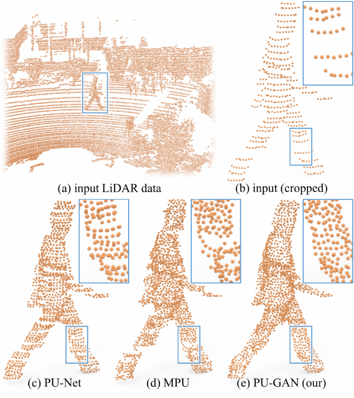
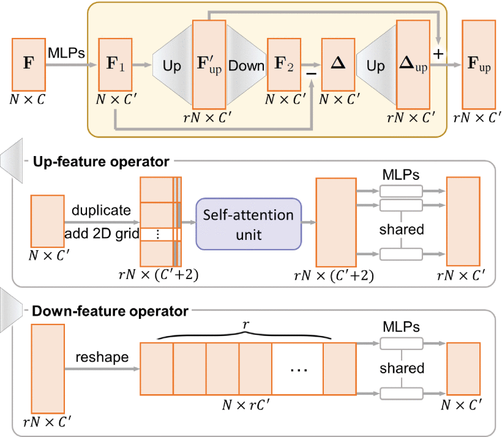
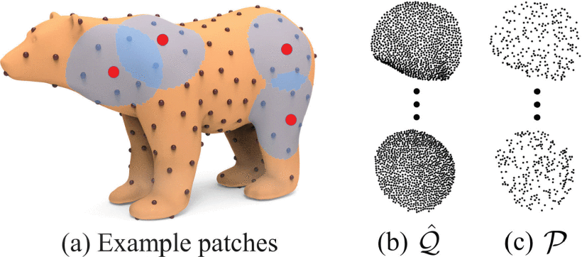
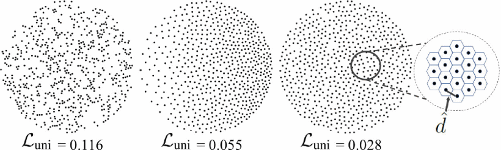

# PU-GAN复现


## start

```
docker run --runtime=nvidia --rm -it tensorflow/pu-gan:latest


docker run --runtime=nvidia --rm -it -v $(pwd):/workspace/ -w /root/PU-GAN -v /tmp/.X11-unix:/tmp/.X11-unix -e DISPLAY=unix$DISPLAY -e GDK_SCALE -e GDK_DPI_SCALE tensorflow/pu-gan:latest
```


```
docker cp ./1 4fb3a797f572:/root/
```


```
docker ps -a
docker commit -a "duan" -m "xxxx" -p 5b3c3b2d2eed tensorflow/pu-gan:latest
```


```bash
ssh-keygen -t rsa -C "837738300@qq.com" 
cat ~/.ssh/id_rsa.pub
git remote set-url origin git@xxx.com:xxx/xxx.git
```


## 问题

1. 安装tensorflow后报错ImportError: libcublas.so.9.0: cannot open shared object file: No such file or directory

```
版本不匹配，cuda和
```


2. 安装tensorflow1.11.0后出现

```
pytorch-lightning 0.9.0 requires tensorboard==2.2.0, but you'll have tensorboard 1.11.0 which is incompatible.
```

​	导致这两个库无法使用，需要重新安装


3. 使用后./evaluation: error while loading shared libraries: libCGAL.so.13: cannot open shared object file: No such file or directory

```
先安装cgal
https://www.cgal.org/download/linux.html

cmake-gui 修改CGAL_DIR的路径
/usr/local/lib/cmake/CGAL

cmake时需要Realease模式
sudo cmake -DCMAKE_BUILD_TYPE=Release .
sudo make
```


4. nvcc: command not found

```
直接替换为/usr/local/cuda9.0/bin/nvcc
```


5. 2019-05-23 14:33:04.952328: I tensorflow/core/platform/cpu_feature_guard.cc:140] Your CPU supports instructions that this TensorFlow binary was not compiled to use: AVX2 FMA
   2019-05-23 14:33:05.050837: I tensorflow/stream_executor/cuda/cuda_gpu_executor.cc:898] successful NUMA node read from SysFS had negative value (-1), but there must be at least one NUMA node, so returning NUMA node zero

```
warning 忽视即可
或者屏蔽
import os
os.environ['TF_CPP_MIN_LOG_LEVEL'] = '2'
```


---

# PU-GAN

PU-GAN: A Point Cloud Upsampling Adversarial Network


## Abstract

​	**Point clouds** acquired from range scans are often **sparse** 稀疏, **noisy** 含噪, and **non-uniform** 不均匀. 

​	This paper presents a new **point cloud upsampling network** called **PU-GAN**, which is formulated 制定 based on a **generative adversarial network** (GAN), to **learn** a rich variety of point **distributions** from the latent space 学习潜在空间中多样的点分布and **upsample** **points** over patches on object surfaces 物体表面的块上点进行上采样. 

​	To realize a working GAN network, we construct an **<u>up-down-up expansion unit</u>** 自上而下再向上扩展单元 in the generator for upsampling point features with **error feedback** 误差反馈 and **self-correction** 自动校正, and formulate a **<u>self-attention unit</u>** to enhance the **feature integration** 集成. 

​	Further, we design a **compound loss** with **adversarial** 对抗, **uniform** 均一 and **reconstruction** 重建 terms, to encourage the discriminator to learn more latent patterns and enhance the output point distribution uniformity. 

​	Qualitative 定性 and quantitative 定量 evaluations demonstrate the quality of our results over the state-of-the-arts in terms of distribution uniformity, proximity-to-surface, and 3D reconstruction quality.


​	从范围扫描获取的点云通常是稀疏的，嘈杂的并且不均匀的。 本文提出了一种称为PU-GAN的新点云上采样网络，该网络是基于生成对抗网络（GAN）制定的，旨在从潜在空间中学习各种各样的点分布，并在物体表面的块上进行上采样点。 

​	为了实现可运行的GAN网络，我们在生成器中构造了一个**自上而下再向上**的扩展单元，以对具有误差反馈和自校正功能的点特征进行上采样，并制定了一个**自注意力单元**来增强特征集成。 

​	此外，我们设计了具有对抗性，均一性和重构性的**复合损失函数**，以鼓励鉴别器学习更多的潜在模式并增强输出点分布的均一性。

​	最后从分布均匀性，表面接近度和3D重建质量进行定性和定量的评估，证明了我们的结果优于最新技术。


## 1. Introduction

​	Point clouds are the standard outputs from 3D scanning. In recent years, they are gaining more and more popularity as a compact representation for 3D data, and as an effective means for processing 3D geometry. However, raw **point clouds** produced from depth cameras and LiDAR sensors are often **sparse, noisy, and non-uniform**. This is evidenced in various **public benchmark datasets**, such as KITTI [8], SUN RGB-D [28], and ScanNet [6]. Clearly, the raw data is required to be amended 修补, before it can be effectively used for rendering 渲染, analysis 分析, or general processing 常用处理.

​	Given a **sparse**, **noisy**, and **non-uniform** point cloud, our **goal** is to upsample it and generate a point cloud that is **dense**, **complete**, and **uniform**, as a **faithful representation** of the underlying surface 稳定的底层表面表示. These goals are very challenging to achieve, given such an imperfect 不完善 input, since, apart from upsampling the data, we need to **fill** small **<u>holes</u>** 孔 and **<u>gaps</u>** 缝隙 in data, while improving the point **distribution uniformity**.

​	Early methods [3, 21, 14, 15, 33] for the problem are **optimization-based** 基于优化的方法, where various shape **priors** 先验 are used to constrain 约束 the point cloud generation. Recently, deep neural networks brought the promise of data-driven approaches to the problem. Network architectures, including **PU-Net** [40], **EC-Net** [39], and very recently, **MPU** [38], have demonstrated the advantage of upsampling point clouds through learning. However, these networks may **not** produce **plausible** 合理的 results from low-quality inputs that are particularly 特别 sparse and non-uniform; in Figure 1 (c)-(e), we show a typical 典型的 example that demonstrates the advantage of our method, which unlike the other networks, it **combines <u>completion and uniformity</u>** together with upsampling.



**Figure 1.** Upsampling (b) a point set cropped from (a) the real-scanned KITTI dataset [8] by using (c) PU-Net [40] (CVPR 2018), (d) MPU [38] (CVPR 2019), and (e) our PU-GAN. Note the distribution non-uniformity and sparsity in the input.


​	In this work, we present a new point cloud upsampling framework, namely **PU-GAN**, that combines upsampling with **data amendment capability** 数据修改能力. The key contribution is an adversarial network to enable us to train a **generator** network to learn to **produce** a rich variety of point distributions from the latent space, and also a **discriminator** network to help implicitly 隐式的 **evaluate** the point sets produced from the generator against the latent point distribution. Particularly, the adversarial learning strategy of the GAN framework can **regularize** the predictions from a **<u>global perspective</u>** 视野 and implicitly **penalize** outputs that **<u>deviate</u>** 偏离 from the target.

​	However, successfully training a working GAN framework is known to be challenging [9, 25], particularly the **difficulty** to **balance between the generator and discriminator** and to **avoid** the tendency of **poor convergence** 收敛性差的趋势. Thus, we first **improve** the point **generation quality**, or equivalently 等效于 the **feature expansion capability** 特征扩展能力, of the generator, by constructing an **<u>up-down-up unit</u>** to expand point features <u>**by upsampling also their differences**</u> for **self-correction**. Besides, we formulate a **<u>self-attention unit</u>** to enhance the **<u>feature integration quality</u>** 特征集成质量. Lastly, we further design a **<u>compound loss</u>** to train the network end-to-end with adversarial, uniform, and reconstruction terms to enhance the distribution uniformity of the results and encourage the discriminator to learn more latent patterns in the target distribution.

​	To evaluate the upsampling quality of PU-GAN, we employ four metrics to assess its performance against the state-of-the-arts on a variety of synthetic and real-scanned data. Extensive experimental results show that our method outperforms others in terms of distribution uniformity, proximity-to-surface, and 3D reconstruction quality.


​	在这项工作中，我们提出了一个新的点云上采样框架，即PU-GAN，该框架将上采样与数据修正功能相结合。 关键的贡献是一个对抗性网络，使我们能够训练生成器网络以学习从潜在空间生成丰富的点分布，并且还有一个鉴别器网络，可以隐式地评估根据潜在点分布生成器产生的点集。 特别是，GAN框架的对抗学习策略可以从全局角度规范预测，并隐式地惩罚偏离目标的输出。

​	但是，成功地训练一个有效的GAN框架是有挑战性的[9，25]，特别是在生成器和鉴别器之间保持平衡以及避免收敛性差的困难。 因此，我们首先通过构造一个**上下上**单元，进行上采样来扩展点的特征及其误差并进行**自校正**，从而提高生成器的点生成质量，或等效地提高特征扩展能力。 此外，我们建立了一个**自我关注单元**，以提高特征集成质量。 最后，我们进一步设计了一种**复合损失函数**，以对抗性，统一性和重构性术语对网络进行端到端训练，以增强结果的分布均匀性，并鼓励鉴别器学习目标分布中更多的潜在模式。

​	为了评估PU-GAN的升采样质量，我们采用了四个指标来针对各种合成和实际扫描数据的最新技术评估其性能。 大量的实验结果表明，我们的方法在分布均匀性，表面接近度和3D重建质量方面优于其他方法。


## 2. Related Work

### 2.1. **Optimization-based upsampling.** 

​	To upsample a point set, a pioneering method by Alexa *et al*. [3] inserts points at <u>Voronoi diagram vertices</u> in the local tangent space. Later, Lipman *et al*. [21] introduced the <u>locally optimal projection (LOP)</u> operator to resample points and reconstruct surfaces based on an *L1* norm. Soon after, Huang *et al*. [14] devised a <u>weighted LOP</u> with an iterative normal estimation to consolidate point sets with noise, outliers, and non-uniformities. Huang *et al*. [15] further developed a <u>progressive</u> method called <u>EAR</u> for edge-aware resampling of point sets. Later, Wu *et al*. [33] proposed a consolidation method to fill large holes and complete missing regions by <u>introducing a new deep point representation</u>. Overall, these methods are *not* data-driven; **they heavily <u>rely on priors</u>**, e.g., **the assumption of smooth surface, normal estimation**, *etc*.

​	为了对点集进行上采样，这是Alexa[3]的开创性方法在局部切线空间的Voronoi图顶点处插入点。 

​	后来，利普曼[21]引入了局部最优投影（LOP）运算符以基于 L1 范数重采样点并重建曲面。 

​	不久之后，黄[14]设计了带有迭代法线估计的加权LOP，以合并具有噪声，离群值和非均匀性的点集。 

​	黄[15]进一步开发了一种称为EAR的渐进方法，用于点集的边缘感知重采样。 

​	后来，吴[33]提出了一种合并方法，通过引入新的深点表示来填充大洞并完成缺失区域。 

​	总的来说，这些方法不是由数据驱动的。 他们严重依赖先验，例如光滑表面的假设，法线估计等。


---

### 2.2. **Deep-learning-based upsampling.** 

​	In recent few years, several deep neural networks have been designed to **learn features** directly from point sets, *e.g*., PointNet [23], PointNet ++ [24], SpiderCNN [35], KCNet [26], SPLATNet [29], PointCNN [20], PointConv [13], PointWeb [44], DGCNN [31], *etc*. 

​	Different from point completion [41, 10] which generates the entire object from partial input 部分, point cloud upsampling tends to **improve** the point **distribution uniformity within local patches**. <u>Based on the PointNet++architecture</u>, Yu *et al*. [40] introduced a deep neural network **PU-Net** to upsample point sets. PU-Net works on patches and **<u>expands a point set by mixing-and-blending point features</u>** <u>in the feature space</u>. Later, they introduced **EC-Net** [39] for edge-aware 边缘感知 point cloud upsampling by formulating 制定 an edge-aware joint loss function to **<u>minimize the point-to-edge distances</u>**. Very recently, Wang *et al*. [38] presented a multi-step progressive upsampling (**MPU**) network to further **suppress 抑制 noise** and **retain 保留 details**. In this work, we present a new method to upsample point clouds by formulating a GAN framework, enabling us to generate higher-quality point samples with completion and uniformity.

​	近年来，已经设计了一些深度神经网络来直接从点集学习特征，例如，PointNet [23]，PointNet ++ [24]，SpiderCNN [35]，KCNet [26]，SPLATNet [29]  ]，PointCNN [20]，PointConv [13]，PointWeb [44]，DGCNN [31] 。 

​	与从部分输入生成整个对象的点完成[41，10]不同，点云上采样趋于改善局部面片内的点分布均匀性。 基于PointNet ++体系结构，Yu[40]引入了深度神经网络PU-Net来对点集进行升采样。  PU-Net可处理面片，并通过在特征空间中混合和融合点要素来扩展点集。 后来，他们提出了EC-Net [39]，用于边缘感知的点云上采样，方法是制定边缘感知的联合损失函数，以最小化点到边缘的距离。 最近，Wang[38]提出了一种多步渐进式上采样（MPU）网络，以进一步抑制噪声并保留细节。 在这项工作中，我们提出了一种通过制定GAN框架来对点云进行升采样的新方法，使我们能够生成具有完整性和均匀性的更高质量的点样本。


---

### 2.3. **GAN-based 3D shape processing.** 

​	Compared with the conventional CNN, the GAN framework makes use of a discriminator to **implicitly** learn to evaluate the point sets produced from the generator. Such flexibility 灵活性 particularly benefits generative tasks [19, 16, 43], since we hope the generator can produce a **rich variety** of output patterns.


---

​	Recently, there are some inspiring 启发性的 works in applying GAN to 3D shape processing. Most of them focus on generating 3D objects either **from** a <u>probabilistic space</u> 概率空间[32] or from <u>2D images</u> [36, 11, 27]. Moreover, Wang *et al*. [30] introduced a **3D-ED-GAN** for shape completion given a corrupted  损坏 3D scan as input. However, these methods can only consume 消耗 3D volumes as inputs or output shapes in voxel representations. Achlioptas *et al*. [2] first adapted the GAN model to **operate** on raw point clouds for enhancing the **representation learning**. To the best of our knowledge, no prior works develop GAN models for point cloud upsampling.

​	最近，在将GAN应用于3D形状处理方面有一些启发性的作品。 它们中的大多数都集中于从概率空间[32]或2D图像[36、11、27]生成3D对象。此外，王[30]引入了3D-ED-GAN来完成形状，因为输入的3D扫描损坏了。但是，这些方法只能使用3D体积作为体素表示中的输入或输出形状。Achlioptas[2]首先使GAN模型适应原始点云，以增强表示学习。据我们所知，没有任何先前的工作开发用于点云上采样的GAN模型。


---

## 3. Method

### 3.1. Overview


**Figure 2.** Overview of PU-GAN’s generator and discriminator architecture. Note that *N* is the number of points in input $\mathcal{P}$ ; $r$ is the upsampling rate; and $C$, $ C'$, $C_{d}$ and $C_{d}'$ are the number of feature channels that are 480, 128, 64, and 256, respectively 分别, in our implementation.


​	Given an unordered sparse 无序稀疏 point set $\mathcal{P}= \{p_{i}\}_{i=1}^{N}$ of *N* points, we aim to **generate** a dense point set $\mathcal{Q}=\left\{q_{i}\right\}_{i=1}^{r N}$ of *rN* points, where *r* is the upsampling rate 上采样率. While output $\mathcal{Q}$ is not necessarily a superset of ${P}$, we want it to satisfy 满足 two requirements: (i) ${Q}$ should describe the *same underlying geometry* 相同的基础几何结构 of a <u>latent target object</u> as ${P}$, so points in ${Q}$ should lie on and cover the target object surface; and (ii) points in ${Q}$ should be *uniformly-distributed* 均匀分布 on the target object surface, even for sparse and non-uniform input ${P}$.

​	**Figure 2** shows the overall network architecture of PUGAN, where the generator produces dense output $\mathcal{Q}$ from sparse input $\mathcal{P}$, and the discriminator aims to find the fake generated ones. Following, we first elaborate 阐述 on the architecture of the generator and discriminator (Section 3.2). We then present two building blocks 模块 in our architecture: the up-down-up expansion unit (Sections 3.3) and the self-attention unit (Section 3.4). Lastly, we present the patch-based training strategy with the compound loss (Section 3.5).


---

### 3.2. Network Architecture

#### 3.2.1. Generator

​	As shown on top of Figure 2, our generator network has three components to successively process 处理 input $\mathcal{P}$:

​	**The feature extraction component** aims to extract features F from input $\mathcal{P}$ of $N\times d$, where *d* is the number of dimensions in the input point attributes, *i.e*., coordinates, color, normal, *etc*. Here, we focus on the simplest case with d=3, considering only the 3D coordinates, and adopt the recent feature extraction method in [38], where **dense connections** 密集连接 are introduced 引进 to **integrate** 集成 **features** across different layers.

​	**The feature expansion component** expands **F** to produce the expanded features $F_{up}$; here, we design the <u>up-down-up expansion unit</u> (see Figure 2 (top)) to enhance the **feature variations** 特征变换 in ,$F_{up}$ enabling the generator to produce more **diverse** point distributions; see Section 3.3 for details.

​	**The point set generation component** first **regresses** 回归 a set of 3D coordinates from $F_{up}$  via a set of multilayer perceptrons (MLPs). Since the feature expansion process is still **local**, meaning that the features in $F_{up}$  (or equivalently, points in the latent space) are intrinsically 本质上 **close to the inputs**, we thus include a **farthest sampling** step in the network to retain only *rN* points that are further away from one another; see the green boxes in Figure 2. To allow this selection, when we expand $F$ to $F_{up}$ , we <u>actually generate **(r+2)N** features</u> in $F_{up}$ . This strategy further enhances the point set distribution uniformity, particularly from a global perspective 全局视野.


---

#### 3.2.2 Discriminator

​	The goal of the discriminator is to distinguish 辨别whether its input (a set of *rN* points) is produced by the generator. To do so, we first adopt the basic network architecture in [41] to **extract the global features**, since it efficiently **combines the local and global information**, and ensures a **lightweight** network. To **improve the feature learning**, we add a **self-attention unit** (see Section 3.4) <u>after the feature concatenation</u> 特征串联; see the middle part in Figure 2 (bottom). Compared with the basic MLPs, this attention unit helps enhance the **feature integration** 特征集成 and improve the **subsequent** 后续的 **feature extraction capability**. Next, we apply a set of MLPs and a max pooling to produce the **global features**, and **further regress** the final **confidence value** 最终置信度值 via a set of fully connected layers. If this confidence value is **close to 1**, the discriminator predicts that the input likely comes from a target distribution with high confidence, and otherwise from the generator.


---

### 3.3. Up-down-up Expansion Unit

​	To upsample a point set, PU-Net [40] **duplicates** 重复 the point features and uses **separate** 分离 MLPs to **process** 处理 **each copy** independently 独立地. However, the expanded features would be too **similar** to the inputs, so affecting 影响 the upsampling quality. **Rather than a single-step expansion,** the very recent **3PU** method [38] **<u>breaks</u>** a **16×** upsampling network into **four successive 连续 2×** upsampling subnets to progressively 逐步地 upsample in multiple steps 多步. Though details are better preserved in the upsampled results, the training process is **complex** and requires more **subsets** for a higher upsampling rate.

​	In this work, we construct an **up-down-up expansion unit** to expand the point features. To do so, we **first upsample** the point features (<u>after MLPs</u>) to generate $\mathbf{F}_{\mathrm{{up}}^{\prime}}$ and **downsample** it back (see Figure 3 (top)); then, we compute the **difference** (denoted as $\Delta$) between the **features** before the upsampling and after the downsampling. By also **upsampling** $\Delta$ to $\Delta_{\mathrm{up}}$, we add $\Delta_{\mathrm{up}}$ to $\mathbf{F}_{\mathrm{{up}}^{\prime}}$ to **<u>self-correct</u>** the expanded features; see again Figure 3 (top) for the whole procedure. Such a strategy not only **<u>avoids tedious multi-step training</u>** 避免繁琐的多步训练, but also **<u>facilitates the production of fine-grained features</u>** 有助于生成细粒度的特征.



**Figure 3.** The up-down-up expansion unit (top), up-feature operator (middle), and down-feature operator (bottom).


​	Next, we discuss the up-feature and down-feature operators in the up-down-up expansion unit (see also Figure 3):

​	**Up-feature operator.** To **upsample** the point features ***r* times**, we should **increase** the **variations among the duplicated features** 重复特征之间的差异. This is equivalent 等效于 to **pushing** the new points **away from** the input ones. After we **duplicate** 复制 the input feature map (of *N* feature vectors and $C\prime$ channels) ***r* times**, we adopt the **2D grid mechanism** in FoldingNet[37] to generate a unique 2D vector per feature-map copy, and **append** such vector to each point feature vector in the same feature-map copy; see Figure 3 (middle). Further, we use the self-attention unit (see Section 3.4) followed by a set of MLPs to produce the output upsampled features.

​	**Down-feature operator.** To downsample the expanded features, we **reshape** the features and then use a set of MLPs to **regress** the original features; see Figure 3 (bottom).


---

### 3.4. Self-attention Unit


**Figure 4.** Illustration 演示 of the self-attention unit.

​	To introduce long-range context dependencies 远程上下文依赖 to enhance feature integration 特征集成 after concatenation级联, we adopt the self-attention unit [42] in the generator (see Figure 3 (middle as well as in the discriminator (see Figure 2 (bottom)). **Figure 4** presents its architecture. Specifically, we transform the input features into **G** and **H** via **two separate MLPs**, and then generate the attention weights **W** from **G** and **H** by
$$
\begin{equation*}{\mathbf {W}} = f_{{\mathrm {softmax}}} (\mathbf{G}^{T}{\mathbf {H}}), \tag{1}\end{equation*}
$$
​	where fsoftmax denotes the **softmax** function. After that, we obtain the weighted features $\mathbf{W}^{T}$**K**, where **K** is the set of features extracted from the input via another MLP. Lastly, we generate the output features, which is the **sum of the input features and the weighted features**.


---

### 3.5. Patch-based End-to-end Training

#### 3.5.1 Training data preparation



**Figure 5.** (a) Seed points (black dots) and patches (blue disks) on a 3D mesh in training data. (b) & (c) Example $\hat{\mathcal{Q}}$ and $P$ on patches.

​	We trained our network to upsample local groups of points over patches on object surface. Specifically, for each 3D mesh (normalized in a unit sphere) in training set (see Section 4.1), we use **randomly** find 200 seed positions on each mesh surface, **geodesically** 基于地基的（即基于表面） grow a **patch** from each seed (each patch occupies $\sim$5% of the object surface), and then **normalize each patch within a unit sphere** 单位球; see Figure 5(a). On each patch, we further use **Poisson disk sampling** [5] to generate $\mathcal{Q}$, which is a target point set of ***rN* points** on the patch. During the training, we generate the network input $\mathcal{P}$ by **randomly selecting** ***N*** points on-the-fly from $\hat{\mathcal{Q}}$.


---

#### 3.5.2 Loss functions

​	We now present the **compound** loss designed for training PU-GAN in an end-to-end fashion.

---

##### 3.5.2.1. **Adversarial loss** 

To train the generator network *G* and discriminator network *D* in an adversarial manner, we use the **least-squared loss** [22] as our adversarial loss:
$$
\begin{equation*}\mathcal{L}_{\mathrm{g}\mathrm{a}\mathrm{n}}(G)\ =\ \frac{1}{2}[D(\mathcal{Q})-1]^{2} \tag{2}\end{equation*}
$$
and
$$
\begin{equation*}\ \mathcal{L}_{\mathrm{g}\mathrm{a}\mathrm{n}}(D) = \frac{1}{2}[D(\mathcal{Q})^{2}+(D(\hat{\mathcal{Q}})-1)^{2}], \tag{3}\end{equation*}
$$
​	where $D(\mathcal{Q})$ is the confidence value 置信度值 predicted by *D* from generator output $\mathcal{Q}$. During the network training, *G* aims to generate $\mathcal{Q}$ to fool *D* by minimizing $\mathcal{L}_{\mathrm{gan}}(G)$, while *D* aims to minimize $\mathcal{L}_{\mathrm{gan}}(D)$ to learn to distinguish 辨别 $\mathcal{Q}$ from $\hat{\mathcal{Q}}$.


---

##### 3.5.2.2. **Uniform loss** 



**Figure 6.** Example point sets with **same** **number** of points (625) but **different** point **distribution** patterns; $L_{uni}$ is computed with *p*=1%.


​	The problem of learning to generate point sets in 3D is **complex** with an immense 巨大的 space for exploration during the network training. Particularly 尤其是, we aim for uniform distributions; using the **adversarial loss** alone is **hard** for the network to **converge well**. Thus, we formulate 制定 a **uniform loss** to evaluate $\mathcal{Q}$ from the generator, aiming to improve the generative ability of the generator.

​	To evaluate a point set’s **uniformity**, the **NUC metric** in PU-Net [40] **crops** 裁剪 equal-sized 大小相同 **disks** on the object surface and **counts** the number of points in the disks. So, the metric **neglects** 忽略 the **local clutter** 局部混乱 of points. **Figure 6** shows three patches of points with very **different point distributions**; since they contain the **same number** of points, the NUC metric **cannot distinguish** their distribution uniformity.

---

###### 3.5.2.2.1. imbalance loss

​	Our method evaluates $\mathcal{Q}$ (a patch of *rN* points) during the network training by first using the **farthest sampling** to pick *M* seed points in $\mathcal{Q}$ and using a **ball query** of radius $r_d$ to **crop** a point **subset** (denoted as $S_j, j = 1.. M$) in $\mathcal{Q}$ at each seed. Here, we use a small $r_d$, so $S_j$ roughly 大致地 lies on 位于 **a small local disk** of area $\pi r_{d}^{2}$ on the **underlying surface**. On the other hand, since we f**orm patches by geodesics** and **normalize them in a unit sphere**, patch area is $\sim\pi 1^{2}$. So, the **expected percentage** of points in $S_j$ (denoted as *p*) is $\pi r_{d}^{2}/\pi 1^{2} = r_{d}^{2}$, and the **expected number** of points in $S_j$ (denoted as $\hat{n}$) is *rNp*. Hence, we follow the chi-squared 卡方 model to measure the deviation 偏差 of $|S_{j}|$ from $\hat{n}$, and define
$$
\begin{equation*}U_{{\mathrm {imbalance}}} (S_{j}) = \frac{(|S_{j}|-\hat{n})^{2}}{\hat{n}} \tag{4}\end{equation*}
$$


###### 3.5.2.2.2. clutter loss

​	To account for **local point clutter**, for each point in $S_j$, we find its **distance to the nearest neighbor**, denoted as $d_{j,k}$ for the k-th point in $S_j$. If $S_j$ has a uniform distribution, the **expected point-to-neighbor distance** $\hat{d}$ should be roughly 大致 $\sqrt{\frac{2\pi r_{d}^{2}}{|S_{j}|\sqrt{3}}}$, which is derived 诞生于 based on the **assumption** 假设 that $S_j$ is **flat**  平坦的 and neighboring points are **hexagonal** 六边形; see Figure 6 (right) for an illustration and supplemental material for the derivation. Again, we follow the chi-squared 卡方 model to measure the deviation of $d_{j,k}$ from $\hat{d}$, and define
$$
\begin{equation*}U_{\mathrm{clutter}}(S_{j})=\sum_{k=1}^{|S_{j}|}\frac{(d_{j,k}-\hat{d})^{2}}{\hat{d}}. \tag{5}\end{equation*}
$$

-----

​	Here, $U_{\mathrm{clutter}}$ accounts for the **local distribution uniformity** 均匀局部分布, while $U_{\mathrm{imbalance}}$ accounts for the **nonlocal uniformity** 非局部均一  to encourage better point coverage . Putting them together, we formulate the uniform loss as
$$
\begin{equation*}\mathcal{L}_{\mathrm{u}\mathrm{n}\mathrm{i}}=\sum_{j=1}^{M}U_{\mathrm{i}\mathrm{m}\mathrm{b}\mathrm{a}\mathrm{l}\mathrm{a}\mathrm{n}\mathrm{c}\mathrm{e}}(S_{j})\cdot U_{\mathrm{c}\mathrm{l}\mathrm{u}\mathrm{t}\mathrm{t}\mathrm{e}\mathrm{r}}(S_{j}). \tag{6}\end{equation*}
$$
​	**Figure 6。** shows three example point sets with the same number of points but different point distribution patterns. Using $\mathcal{L}_{\mathrm{uni}}$, we can distinguish the point uniformity among them.


---

##### 3.5.2.3. Reconstruction loss 

​	Both the adversarial and uniform losses **do not encourage** the generated points to **lie on the target surface.** Thus, we include a reconstruction loss using the Earth Mover’s distance (EMD) [7]:
$$
\begin{equation*}\mathcal{L}_{\mathrm{r}\mathrm{e}\mathrm{c}}=\min_{\phi:{\mathcal {Q}}\rightarrow\hat{{\mathcal {Q}}}}\sum_{q_{i}\in Q}\Vert q_{i}-\phi(q_{i})\Vert_{2}, \tag{7}\end{equation*}
$$
where $\phi: \mathcal{Q}\rightarrow \hat{\mathcal{Q}}$ is the bijection mapping 双向映射.


----

##### 3.5.2.4. Compound loss

​	Overall, we train PU-GAN end-to-end by minimizing $\mathcal{L}_{G}$ for generator and $\mathcal{L}_{D}$ for discriminator:
$$
\begin{equation*}\mathcal{L}_{G} = \lambda_{\mathrm{g}\mathrm{a}\mathrm{n}}\mathcal{L}_{\mathrm{g}\mathrm{a}\mathrm{n}}(G)+\lambda_{\mathrm{r}\mathrm{e}\mathrm{c}}\mathcal{L}_{\mathrm{r}\mathrm{e}\mathrm{c}}+\lambda_{\mathrm{u}\mathrm{n}\mathrm{i}}\mathcal{L}_{\mathrm{u}\mathrm{n}\mathrm{i}}, \tag{8}\end{equation*}
$$
and
$$
\begin{equation*}\ \mathcal{L}_{D} = \mathcal{L}_{\mathrm{g}\mathrm{a}\mathrm{n}}(D), \tag{9}\end{equation*}
$$
where $\lambda_{\mathrm{gan}}$, $\lambda_{\mathrm{rec}}$, and $\lambda_{\mathrm{uni}}$ are weights. During the training process, *G* and *D* are **optimized alternatively** 交替优化.


## 4. Experiments

### 4.1. Datasets and Implementation Details


### 4.2. Evaluation Metrics


### 4.3. Qualitative and Quantitative Comparisons


### 4.4. Upsampling Real-scanned Data


### 4.5. Ablation Study and Baseline Comparison


### 4.6. Other Experiments


---

## 5. Conclusion

​	In this paper, we presented, PU-GAN, a novel GAN-based point cloud upsampling network, that combines upsampling with data amendment capabilities. Such adversarial network enables the generator to produce a uniformly-distributed point set, and the discriminator to implicitly penalize outputs that deviate from the expected target. To facilitate the GAN framework, we introduced an up-down-up unit for feature expansion with error feedback and self-correction, as well as a self-attention unit for better feature fusion. Further, we designed a compound loss to guide the learning of the generator and discriminator. We demonstrated the effectiveness of our PU-GAN via extensive experiments, showing that it outperforms the state-of-the-art methods for various metrics, and presented the upsampling performance on real-scanned LiDAR inputs.

​	However, since PU-GAN is designed to complete tiny holes at patch level, it has limited ability in filling large gaps or holes in point clouds; see Figure 8. Analyzing and synthesizing at the patch level lacks a global view of the overall shape. Please refer to the supplemental material for a typical failure case. In the future, we will explore a multi-scale training strategy to encourage the network to learn from both local small patched and global structures. We are also considering exploring conditional GANs, to let the network learn the uniformity and semantic consistency at the same time.

​	在本文中，我们介绍了PU-GAN，这是一种基于GAN的新型点云上采样网络，它将上采样与数据修正功能结合在一起。 这种对抗网络使生成器能够生成均匀分布的点集，并且使鉴别器能够隐式惩罚偏离预期目标的输出。 为了简化GAN框架，我们引入了一个自上而下的单元，用于具有错误反馈和自我校正的特征扩展，以及一个用于更好地融合特征的自注意力单元。此外，我们设计了一个复合损失来指导生成器和鉴别器的学习。我们通过广泛的实验证明了我们的PU-GAN的有效性，表明它在各种指标方面都优于最新技术，并展示了在实时扫描的LiDAR输入上的升采样性能。
​    但是，由于PU-GAN旨在在补丁级别完成微小的孔，因此填充点云中的大间隙或孔的能力有限。 参见图8。在补丁程序级别进行分析和合成缺乏整体形状的全局视图。 有关典型的故障案例，请参阅补充材料。 将来，我们将探索一种多尺度的培训策略，以鼓励网络从局部的小规模结构和全局结构中学习。 我们也正在考虑探索条件GAN，以使网络同时学习一致性和语义一致性。


---

## ACKNOWLEDGMENTS

​	We thank anonymous reviewers for the valuable comments. The work is supported by the 973 Program (Proj. No. 2015CB351706), the National Natural Science Foundation of China with Proj. No. U1613219, the Research Grants Council of the Hong Kong Special Administrative Region (No. CUHK 14203416 & 14201717), and the Israel Science Foundation grants 2366/16 and 2472/7.

​	我们感谢匿名评论者的宝贵意见。 这项工作得到了国家自然科学基金973计划（项目编号2015CB351706）的支持。 编号U1613219，香港特别行政区研究资助局（编号CUHK 14203416＆14201717）和以色列科学基金会授予2366/16和2472/7。


