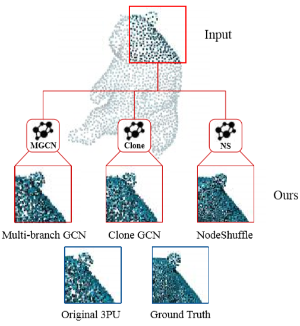
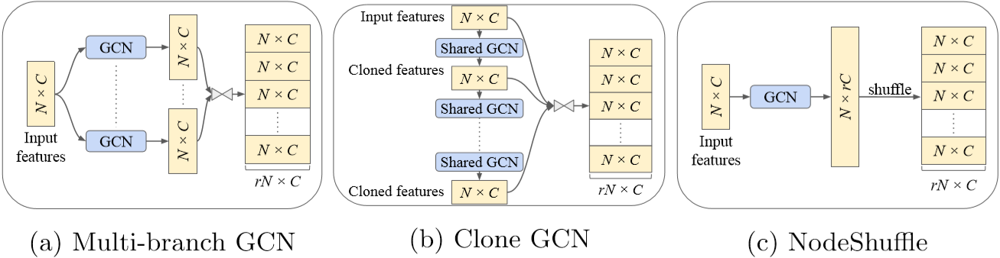
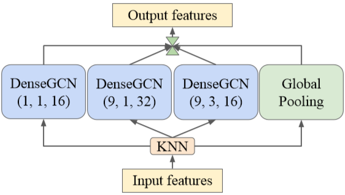
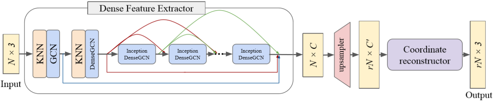

# PU-GCN

Point Cloud Upsampling using Graph Convolutional Networks

## Abstract

​	The effectiveness of learning-based point cloud upsampling pipelines heavily relies on the upsampling modules and feature extractors used therein. We propose three novel point upsampling modules: Multibranch GCN, Clone GCN, and NodeShuffle. 	基于学习的点云上采样管道的有效性在很大程度上取决于其中使用的上采样模块和特征提取器。我们提出了三种新颖的点上采样模块：**多分支GCN，克隆GCN和NodeShuffle**。 

​	Our modules use Graph Convolutional Networks (GCNs) to better encode local point information from the point neighborhood. These upsampling modules are versatile and can be incorporated into any point cloud upsampling pipeline. 

​	我们的模块使用图卷积网络（GCN）来更好地编码来自点邻域的本地点信息。 这些上采样模块具有多种功能，可以集成到任何点云上采样管道中。大量的实验表明，这些模块如何持续改进最新的上采样方法。 

​	Extensive experiments show how these modules consistently improve state-of-the-art upsampling methods. 

​	We also propose a new multi-scale point feature extractor, called Inception DenseGCN. By aggregating features at multiple scales, this feature extractor enables further performance gain in the final upsampled point clouds. We combine Inception DenseGCN with one of our upsampling modules (NodeShuffle) into a new point upsampling pipeline: PU-GCN. We show qualitatively and quantitatively the significant advantages of PU-GCN over the state-of-the-art. 

​	我们还提出了一种新的多尺度点特征提取器，称为**Inception DenseGCN**。 通过在多个尺度上聚合特征，此特征提取器可在最终的高采样点云中进一步提高性能。 我们将Inception DenseGCN与我们的一个上采样模块（NodeShuffle）组合成一个新的点上采样管道：PU-GCN。 我们定性和定量地显示了PU-GCN相对于最新技术的显着优势。 

## 1. Introduction

​	Point clouds are a popular way to represent 3D data. This increasing popularity stems from the increased availability of 3D sensors like LiDAR. Such sensors are now a critical part of important application in robotics and self-driving cars. However, due to hardware and computational constraints, these 3D sensors often produce sparse and noisy point clouds, which show evident deficiencies especially for small objects or those far away from the camera. Therefore, point cloud upsampling, the task of converting sparse, incomplete and noisy point clouds into dense, complete and clean ones, is attracting much attention. 

​	点云是表示3D数据的一种流行方法。这种越来越受欢迎的原因是LiDAR等3D传感器的可用性越来越高。如今，此类传感器已成为机器人技术和自动驾驶汽车中重要应用的关键部分。 但是，由于硬件和计算的限制，这些3D传感器通常会产生稀疏和嘈杂的点云，这显示出明显的缺陷，尤其是对于小物体或远离相机的物体。 因此，将稀疏，不完整和嘈杂的点云转换为密集，完整和干净的点云的点采样技术正引起人们的广泛关注。

​	Following the success in image super-resolution [4,10,15,19], deep learning methods now achieve state-of-the-art results in point cloud upsampling [14,27– 29]. Most deep upsampling pipelines comprise two major components: feature extraction and point upsampling. The performance of the point upsampling component tends to define the effectiveness of the final network. 	随着图像超分辨率的成功[4,10,15,19]，深度学习方法现在在点云上采样中获得了最先进的结果[14,27–29]。 大多数深度上采样管线包括两个主要组件：特征提取和点上采样。 点上采样组件的性能倾向于定义最终网络的有效性。 

​	Current methods use either a **multi-branch CNN** (PU-Net [29]) or a **duplicate-based** approach (3PU [27] and PU-GAN [14]) to upsample 3D points. Multi-branch CNNs operate on each point separately, ignoring any neighborhood information, while duplicate upsampling methods tend to generate point patches similar to the original point clouds. More details of these upsampling modules can be found in the supplementary material. 当前的方法使用**多分支CNN**（PU-Net [29]）或基于**复制**的方法（3PU [27]和PU-GAN [14]）对3D点进行上采样。多分支CNN分别在每个点上运行，而**忽略任何邻域信息**，而重复的上采样方法往往会**生成类似于原始点云的点patch**。这些上采样模块的更多详细信息可以在补充材料中找到。

These shortcomings lead to upsampled point clouds that lack local details (see Fig. 5). To better represent locality, we leverage the power of graphs and specifically Graph Convolutional Networks (GCNs). GCNs are considered a tool to process non-Euclidean data, and recent research on point cloud semantic and part segmentation shows their power in encoding local and global information [12,13,23,25]. In this paper, we use GCNs to design novel, versatile point cloud upsampling modules (see Fig. 1 and Fig. 2), which are better equipped at encoding local point information and learning to generate new point patches instead of merely replicating parts of the input.  这些缺点导致缺乏局部细节的高采样点云（见图5）。 为了更好地表示局部性，我们利用图的功能以及特定的图卷积网络（GCN）。  GCN被认为是处理非欧几里得数据的工具，最近对点云语义和部分分割的研究显示了它们在编码本地和全局信息方面的能力[12,13,23,25]。 在本文中，我们使用GCN设计新颖，通用的点云上采样模块（见图1和图2），这些模块可以更好地编码局部点信息并学习生成新的点patch，而不仅仅是复制部分输入的点信息。

**Fig. 1** Proposed GCN-based point upsampling modules. We develop three new upsampling modules (Multi-branch GCN, Clone GCN, and NodeShuffle) using a Graph Convolutional Network (GCN). When integrated into the 3PU [27] upsampling pipeline, they generate dense point clouds with fine-grained details, as compared to state-of-the-art point upsampling. The original 3PU uses duplicate-based upsampling. 提出的的基于GCN的点上采样模块。我们使用图卷积网络（GCN）开发了三个新的上采样模块（多分支GCN，克隆GCN和NodeShuffle）。 与最新的点上采样相比，将其集成到3PU [27]上采样管线中时，它们会生成具有细粒度细节的密集点云。 原始3PU使用基于复制的上采样。

**Fig. 2** Our proposed upsampling modules. (a) Multi-branch GCN: We apply r different GCN layers to the input nodes. The outputs from each GCN are concatenated node-wise. (b) Clone GCN: We pass the input through r GCN layers with shared weights, and concatenate their outputs. (c) NodeShuffle: We expand the number of input features using a GCN layer. We later apply a shuffle operation to rearrange the feature map. BC denotes node-wise concatenation.

​	我们提出的上采样模块。a）多分支GCN：我们将不同的GCN层应用于输入节点。每个GCN的输出都是节点级联的。 b）克隆GCN：我们将输入传递给具有共享权重的r个GCN层，并将它们的输出连接起来。c）NodeShuffle：我们使用GCN层扩展了输入要素的数量。 稍后，我们将执行shuffle操作来重新排列特征图。 对三角符号表示节点级联。

Point clouds often represent objects with variable part sizes. Using **multi-scale features** is an effective way to encode this property, and is essential for obtaining point clouds of high quality. /Recent works like PU-Net [29] extract point features at different downsampling levels. Such an architecture can encode multi-scale features, however, downsampling leads to loss of fine-grained details. /In contrast, 3PU [27] proposes a progressive upsampling network using different numbers of neighbors in subsequent upsampling units. This achieves different receptive fields and encodes multi-scale information. However, 3PU is computationally expensive due to its progressive nature. In this paper, we tackle this feature learning problem using a densely connected GCN architecture we call Inception DenseGCN. Following its prevalent usage in image recognition [20–22] for the merits of efficient extraction of multi-scale image information, we adopt the Inception architecture to encode multi-scale point features, after it is modified to use densely connected GCNs instead of CNNs. 

​	点云通常代表具有可变零件尺寸的对象。使用**多尺度特征**是编码此属性的有效方法，并且对于获得高质量的点云至关重要。  PU-Net [29]等最新作品在不同的下采样级别提取点特征。这样的架构可以编码多尺度特征，但是，**下采样会导致细粒度细节的丢失**。相比之下，3PU [27]提出了一种渐进式上采样网络，该网络在后续的上采样单元中使用不同数量的邻居。 这样可以实现不同的感受野并编码多尺度信息。 但是，由于3PU的先进性，其**计算量很大**。 在本文中，我们使用**密集连接的GCN架构**（称为Inception DenseGCN）来解决此特征学习问题。 在有效地提取多尺度图像信息的优点之后，继其在图像识别中的普遍使用[20-22]之后，在修改为使用密集连接的GCN而不是CNN的情况下，我们采用了**Inception架构**对**多尺度点特征**进行**编码** 。

Contributions. We summarize our contributions as three-fold. (1) We propose three novel point cloud upsampling modules using graph convolutions: Multibranch GCN, Clone GCN, and NodeShuffle. We show how these modules can be seamlessly integrated into current point upsampling methods, and consistently improve their performance. (2) We design Inception DenseGCN, a feature extraction block that encodes multi-scale information effectively. We combine Inception DenseGCN and one of our proposed upsampling modules (NodeShuffle) into a new architecture named PU-GCN. Through extensive quantitative and qualitative results and for both synthetic and real data, we show the superior performance of PU-GCN to the state-of-the-art. (3) We compile PU600, a new large-scale dataset with variable levels of shape diversity. We show the advantages of our new dataset using our approach as well as other state-of-the-art methods. Our reproducible code and PU600 dataset will be publicly available

贡献。 我们将我们的贡献总结为三个方面。  

1）我们提出了使用图卷积的三个新颖的**点云上采样模块**：多分支GCN，克隆GCN和NodeShuffle。 我们展示了如何将这些模块无缝地集成到当前的点升采样方法中，并不断提高其性能。 

2）我们设计了Inception DenseGCN，这是一种有效地编码多尺度信息的**特征提取模块**。 我们将Inception DenseGCN和我们提议的上采样模块之一（NodeShuffle）组合到一个名为PU-GCN的新体系结构中。 通过广泛的定量和定性结果以及综合和真实数据，我们展示了PU-GCN优于最新技术的性能。 

3）我们编译了PU600，这是一个具有可变形状多样性水平的新的大规模数据集。 我们使用我们的方法以及其他最新方法展示了新数据集的优势。 我们的可复制代码和PU600数据集将公开可用

---

## 2. Related Work

### Graph convolutional networks (GCNs). 

​	To cope with the increasing amount of non-Euclidean data in real-world scenarios, a surge of graph convolutional networks [7,11,17,24,25] have been proposed in recent years. Kipf et al. [11] simplified spectral graph convolutions with a first-order approximation. DGCNN [25] proposed EdgeConv to conduct dynamic graph convolution on point clouds. Recently, Li et al. [12,13] introduced residual/dense connections and dilated convolutions to GCNs, and successfully trained deep GCN architectures. Previous GCN works mainly investigate basic modules of discriminative models. However, due to the unordered and irregular nature of graph data, generative tasks for this modality remain elusive. In particular, point upsampling techniques, which are indispensable components for generative models, are under-explored. 

为了应对现实情况中非欧几里得数据的增加，近年来提出了图卷积网络[7,11,17,24,25]的浪潮。  Kipf等 [11]用一阶近似简化频谱图卷积。DGCNN [25]提出EdgeConv在点云上进行动态图卷积。最近，李等[12,13]向GCN引入了残差/密集连接和膨胀卷积，并成功地训练了深层GCN体系结构。GCN以前的工作主要研究判别模型的基本模块。 但是，由于图形数据的无序和不规则性质，用于这种方式的生成任务仍然难以实现。 尤其是，对于生成模型必不可少的组件-点升采样技术，尚未得到充分的研究。

### Multi-scale feature extraction. 

Inception architectures [20–22] enable very good performance in image recognition at relatively low computational cost. They extract multi-scale information by using different kernel sizes in different paths of the architecture. Inspired by the success of the Inception architecture for CNNs, Kazi et al. [9] proposed InceptionGCN, in which feature maps are passed into multiple branches, then each branch applies one graph convolution with a different kernel size. The outputs of these branches are aggregated by concatenation. We also adopt the Inception concept in our work to propose Inception DenseGCN, a GCN architecture that improves upon InceptionGCN by leveraging dense connections and global pooling. 

初始架构[20–22]以相对较低的计算成本实现了非常出色的图像识别性能。他们通过在体系结构的不同路径中使用不同的内核大小来提取多尺度信息。 受到CNN的Inception架构成功的启发，Kazi等[9]提出了InceptionGCN，其中将特征图传递到多个分支，然后每个分支应用一个具有不同内核大小的图卷积。这些分支的输出通过串联聚合。 我们在工作中也采用了Inception概念，以提出Inception DenseGCN，这是一种GCN体系结构，它通过利用密集连接和全局池对InceptionGCN进行了改进。

### Optimization-based upsampling methods. 

Alexa et al. [1] introduced one of the earliest optimization-based methods for point cloud upsampling. The idea behind their work is to insert new points at the vertices of the Voronoi diagram computed on the moving least squares surface. Lipman et al. [16] introduced a locally optimal projection operator to resample points based on an L1 norm. Another optimization-based method was introduced by Huang et al. [8], in which they proposed a method of resampling to process noisy and outlier-ridden point clouds in an edge-aware manner. A consolidation approach was introduced by Wu et al. [26], in which they augment surface points into deep points by associating them with other points that lie on the meso-skeleton of the shape. All these optimization-based methods rely on the quality of human crafted priors.

Alexa等[1]介绍了一种最早的基于优化的点云上采样方法。 他们的工作背后的想法是在移动的最小二乘曲面上计算出的Voronoi图的顶点处插入新点。 利普曼（Lipman）等[16]引入了局部最优投影算子，以基于L1范数对点进行重采样。  Huang等人介绍了另一种基于优化的方法。  [8]提出了一种重采样方法，以边缘感知的方式处理嘈杂的和离群的点云。  Wu等人介绍了一种合并方法。  [26]通过将表面点与形状中观骨架上的其他点相关联，将表面点扩展为深点。 所有这些基于优化的方法都依赖于人工制作的先验质量。

### Deep learning-based upsampling methods. 

Deep learning methods illustrate a promising improvement over optimization-based algorithms due to their data-driven nature and the learning capacity of neural networks. Learning features directly from point clouds was made possible by deep neural networks, such as PointNet [5], PointNet++ [18], DGCNN [25], KPConv [23], etc. Yu et al. [29] introduced the PU-Net that learns multi-scale features per point, expands the point set via a multi-branch CNN in feature space. However, PU-Net needs to downsample the input first to learn multi-scale features, which causes unnecessary resolution loss. Yu et al. [28] also proposed EC-Net, an edge-aware network for point set consolidation. It uses an edge-aware joint loss to encourage the network to learn to consolidate points for edges. However, it requires a very expensive edge-notation for training. Wang et al. [27] proposed 3PU, a progressive network that duplicates the input point patches over multiple steps. By using different kernel sizes in different upsampling units, 3PU learns multi-scale features with no resolution loss, unlike PU-Net. However, 3PU is computationally expensive due to its progressive nature, and it requires more data to supervise the middle stage output of the network. Recently, Li et al. [14] proposed PUGAN, a Generative Adverserial Network (GAN) designed to learn upsampled point distributions in point clouds from latent space. Different from previous work, they first upsample more points than the required target (e.g.×6) and then use farthest upsampling to sample the target number of points (e.g.×4) to produce the final output. While PU-GAN focuses on improving uniformity of upsampled point clouds by introducing a novel uniformity loss function, it does not specifically design upsampling modules or feature extractors. Our work tackles upsampling using novel GCN upsampling modules to capture local point information, and by encoding multi-scale features using Inception DenseGCN.

深度学习方法由于其数据驱动的特性和神经网络的学习能力，说明了对基于优化的算法的有希望的改进。 深度神经网络可以直接从点云学习特征，例如PointNet [5]，PointNet ++ [18]，DGCNN [25]，KPConv [23]等。Yu等  [29]介绍了PU-Net，它可以学习每个点的多尺度特征，并通过特征空间中的多分支CNN扩展点集。 但是，PU-Net首先需要对输入进行降采样以了解多尺度特征，这会导致不必要的分辨率损失。  Yu等[28]还提出了EC-Net，这是一种用于点集合并的边缘感知网络。它使用边缘感知的联合损失来鼓励网络学习合并边缘点。 但是，它需要非常昂贵的边缘符号来进行训练。  Wang等[27]提出了3PU，这是一种渐进式网络，可以在多个步骤上复制输入点补丁。 与PU-Net不同，通过在不同的上采样单位中使用不同的内核大小，3PU可以学习多尺度功能，而不会降低分辨率。但是，3PU由于其渐进性而在计算上很昂贵，并且它需要更多数据来监督网络的中间阶段输出。最近，李等人[14]提出了PUGAN，它是一种生成对抗网络（GAN），旨在从潜在空间中学习点云中的上采样点分布。 与先前的工作不同，他们首先对所需点数（例如，×6）进行上采样，然后使用最远的上采样对目标点数（例如，×4）进行采样，以产生最终输出。虽然PU-GAN致力于通过引入一种新颖的均匀性损失函数来提高上采样点云的均匀性，但它并未专门设计上采样模块或特征提取器。 我们的工作使用新颖的GCN上采样模块捕获本地点信息，并使用Inception DenseGCN对多尺度特征进行编码，从而解决上采样问题。

---

## 3. Methodology

### 3.1. Upsampling Modules

​	为了有效地对点云进行升采样，我们提出了三种不同的升采样模块：图2中所示的 Multi-branch GCN, Clone GCN, and NodeShuffle。

**Fig. 2**     a）将 $r$ 个不同的GCN层应用于输入节点。每个GCN的输出都是节点级联的。 b）将输入传递给具有共享权重的 $r$ 个GCN层，并将它们的输出连接起来。c）使用GCN层扩展了输入要素的数量，然后将执行shuffle操作来重新排列特征图。 对三角符号表示节点级联。

#### 3.1.1. Multi-branch GCN

​	图2a显示了我们的多分支GCN模块。 对于上采样因子 $r$，我们通过图卷积的 $r$ 个分支传递输入点云。输出在节点上级联以创建最终输出。形式上，对于输入$\mathcal{V}_{l} \in \mathbb{R}^{N \times C}$，我们获得输出 $\mathcal{V}_{l+1}^{U P} \in \mathbb{R}^{r N \times C}$ 如下：
$$
\mathcal{V}_{l+1}^{U P}=\mathcal{T}\left(\mathcal{F}_{1}\left(\mathcal{V}_{l}\right), \mathcal{F}_{2}\left(\mathcal{V}_{l}\right) \ldots, \mathcal{F}_{r}\left(\mathcal{V}_{l}\right)\right) \tag{1}
$$
​	其中 $\mathcal{T}$ 是一个 node-wise 级联运算符，用于融合来自不同GCN分支的输出。$\mathcal{F}_{i}$ 表示第 $i$ 个GCN分支。

#### 3.1.2. Clone GCN

Multi-branch GCN有效但参数繁重，因为我们需要 $r$ 个不同的GCN模块。为了解决这个容量问题，我们提出了Clone GCN（如图2b所示）。 Clone GCN无需并行使用多个分支卷积，而是将**共享GCN**的各层逐步应用于输出。 然后，将输出连接起来以生成上采样的点云。 克隆GCN执行的上采样功能定义为：
$$
\mathcal{V}_{l+1}^{U P}=\mathcal{T}\left(\mathcal{F}\left(\mathcal{V}_{l}\right), \mathcal{F}\left(\mathcal{F}\left(\mathcal{V}_{l}\right)\right), \mathcal{F}^{3}\left(\mathcal{V}_{l}\right), \ldots, \mathcal{F}^{r}\left(\mathcal{V}_{l}\right)\right)\tag{2}
$$
其中 $\mathcal{F}$ 表示共享的GCN.  $\mathcal{F}^{r}\left(\mathcal{V}_{l}\right)$ 是通过使用共享的权重将相同的 GCN 应用于$\mathcal{V}_{l}$  $r$ 次而获得的。

#### 3.1.3. NodeShuffle

Multi-branch GCN and Clone GCN都运行$r$ 次图卷积。为了进一步减轻计算负担，我们提出了NodeShuffle（如图2c所示）。 受图像超分辨率文献的**PixelShuffle**[19]启发，NodeShuffle是一种高效的图卷积上采样层。给定形状为 $N×C$ 的节点特征 $\mathcal{V}_{l}$，NodeShuffle操作将输出形状为 $rN×C$ 的新节点特征 $\mathcal{V}_{l+1}^{U P}$，如下所示：
$$
\mathcal{V}_{l+1}^{U P}=\mathcal{P} \mathcal{S}\left(\mathcal{W}_{l+1} * \mathcal{V}_{l}+b_{l+1}\right)
$$
​	其中 $\mathcal{P} \mathcal{S}$ 是一个 periodic shuffling 运算符，可将形状 $N×rC$ 的图形（例如点特征）重新排列为 $rN×C$。  NodeShuffle操作可以分为两个步骤。1）通道扩展：我们使用可学习的参数 $\mathcal{W}_{l+1}$ 和 $ b_{l+1}$，使用1层GCN扩展节点特征 $\mathcal{V}_{l}$ 以形成 $N×rC$ 形状。2）periodic shuffling：我们重新排列通道扩展的输出，以形成 $rN×C$ 的形状。与多分支和克隆GCN中的此类操作相反，NodeShuffle仅运行1个GCN操作。

与之前的多分支CNN [29]或基于复制项的向上采样[14，27]等上采样模块相比，我们的多分支GCN，克隆GCN和NodeShuffle利用图卷积代替了CNN。GCN使我们的上采样器能够编码来自点邻域的空间信息并从潜在空间中学习新点，而不是简单地复制原始点（如3PU [27]和PU-GAN [14]中所做的那样）。

---

### 3.2 Multi-scale Feature Extractor: Inception DenseGCN

Point clouds scanned using 3D sensors often include objects of various sizes and point resolutions. In order to encode the multi-scale nature of point clouds, we propose a new Inception DenseGCN feature extractor, which effectively integrates the DenseGCN module from DeepGCN [13] into the Inception module from GoogLeNet [21]. Residual and dense connections have been proven to be useful to increase the performance by Li et al. [13]. We favor dense over residual connections here, since the former utilizes features from previous layers, as well as different inception paths. 

使用 3D 传感器扫描的点云通常包含各种大小和点分辨率的对象。为了编码点云的多尺度性质，我们提出了一个新的 Inception DenseGCN 特征提取器，该提取器有效地将 DeepGCN[13] 中的 DenseGCN 模块集成到 GoogLeNet[21] 中的 Inception 模块中。Li等人[13]已证明，残差连接和密集连接有助于提高性能 。由于前者利用了先前各层的特征以及不同的起始路径，因此我们在这里优先考虑密集连接而不是残差连接。

**Fig.3 ** Inception DenseGCN. We use the parameters (k, d, c) to define a DenseGCN block. k is the number of neighbors (kernel size), d is the dilation rate, and c is the number of output channels. The green BC denotes feature-wise concatenation. 我们使用参数$（k，d，c）$定义DenseGCN块。 $k$ 是邻居数（内核大小），$d$ 是扩散率，$c$ 是输出通道数。绿色对三角符号表示按特征级联。

​	图3显示了我们的Inception DenseGCN块。在我们的实验中，每个Inception块使用三个DenseGCN块。每个DenseGCN块均由节点邻居数k，扩散率d和滤波器数c定义。注意，扩张图卷积算子是在DeepGCN中引入的[13]。与2D情况类似，该算子在不降低空间分辨率的情况下，使用相同的k有效地增加了感受野。Inception DenseGCN块的第一层使用K最近邻算法（KNN）来构建图并获得节点邻域。实验表明，在Inception DenseGCN内的后面各层中使图动态化并不会对性能产生实质性影响，但确实会增加模型的计算足迹。因此，我们决定共享图结构，而不在Inception DenseGCN内部的后续层中对其进行更新。此外，我们添加了一个全局池化层以提取全局上下文信息。每个 Inception 块输出 DenseGCN 块和全局池层的串联。

----

### 3.3. PU-GCN Architecture

We combine the proposed Inception DenseGCN extractor with our novel upsampling modules, and followed by a coordinate reconstructor propose a new upsampling model called PU-GCN. Its architecture is illustrated in Fig. 4. Given a point cloud of size N ×3, we compute dense features of size N ×C using our dense feature extractor. Then, we upsample the N×C features to rN×C0 using one of the proposed upsamplers. Finally, the coordinate reconstructor generates the rN ×3 upsampled point cloud. 

我们将提出的Inception DenseGCN提取器与我们新颖的上采样模块结合在一起，然后由坐标重构器提出一个称为PU-GCN的新上采样模型。其架构如图4所示。给定大小为 $N×3$ 的点云，我们使用密集特征提取器来计算大小为 $N×C$ 的密集特征。 然后，我们使用建议的上采样器之一将 $N×C$ 个特征上采样为 $rN×C'$。最后，坐标重建器生成 $rN×3$ 上采样点云。

**Fig.4**: PU-GCN architecture. PU-GCN uses a dense feature extractor consisting of 1 or more densely connected Inception DenseGCN blocks, followed by the upsampler and coordinate reconstructor. PU-GCN使用由1个或多个稠密连接的 Inception DenseGCN块组成的密集特征提取器，然后是上采样器和坐标重构器。

#### Dense feature extractor. 

我们在PU-GCN的开头使用 1 个GCN层，然后使用 1 个DenseGCN层，将3D坐标嵌入到潜在空间中并提取更高级别的空间信息。 为了保留更多的局部信息，我们在这两层中不使用膨胀图卷积。在补充材料中讨论了有关第一层中膨胀率影响的更多细节。DenseGCN的输出将通过几个密集连接的Inception DenseGCN块传递。在我们的实验中，我们仅使用两个这样的Inception DenseGCN块。 我们将在4.6节中测试Inception DenseGCN块的数量。第一个GCN层，DenseGCN块和Inception DenseGCN块的输出被串联在一起，并传递到我们的上采样器模块。

#### Upsampler

我们的上采样器包括两个阶段：上采样和特征压缩。给定输入特征 $N×C$，我们使用建议的上采样模块生成大小为 $rN×C$ 的更密集特征。 然后，我们使用两组MLP将特征压缩为 $rN×C'$。 默认情况下，我们在PU-GCN中使用NodeShuffle。 我们将在4.6节中尝试使用不同的上采样模块。 

#### Coordinate reconstructor.

​	我们将点从潜在空间重构到3D坐标空间，从而得到大小为 $rN×3$ 的所需更密集的点云。 我们使用与3PU [27]和PU-GAN [14]相同的坐标重建方法，其中使用两组MLP回归3D坐标。

---

## 4. Experiments

### 4.1. Datasets

### 4.2. Loss Function and Evaluation Metrics

Evaluation Metrics. Following previous work, we use the Chamfer distance (CD), Hausdorff distance (HD), and point-to-surface distance (P2F) with respect to ground truth meshes as evaluation metrics. The smaller the metrics, the better the performance.

**损失函数** 

我们使用在3PU中引入的修改后的CD倒角距离和加权斥力损失[27]：
$$
L=C(P, Q)+\lambda L_{r e p} \tag{4}
$$
其中$C（P，Q）$是预测点云P和地面真实点云Q之间的修正倒角距离损失。$\lambda L_{r e p}$ 表示排斥力，它鼓励生成的点远离原始点。$λ$是权衡系数。 正如3PU [27]所建议的，我们在所有实验中均使用λ= 0.02。 在补充材料中研究了排斥损失对PU-GCN的影响。 

**评估指标** 

在之前的工作之后，我们将相对于G.T.网格的 Chamfer distance 距离（CD），Hausdorff distance （HD）和point-to-surface distance （P2F）作为评估指标。 指标越小，性能越好。

----

### 4.3. Implementation Details

​	For training and testing, we use Poisson disk sampling from the original meshes to generate input and ground truth point clouds. In training, we use farthest point sampling to crop 200 patches from each 3D model as the input to the network. In total, we obtain 110,200 training patches in PU600. 

​	Each patch consists of 256 input points sampled from the original model. We use the same method to sample 1024 points per patch as the ground truth. As for testing, we use farthest point sampling to sample overlapped patches (patch size is 256) of the input point cloud and ensure coverage of the entire input, then we implement patch-based upsampling. The final result is obtained by first merging the overlapping patch outputs and then resampling with farthest point sampling. The data preprocessing mentioned above is the same as 3PU [27]. To measure performance w.r.t. the size of the input point cloud, we sample two sets of test samples: a sparse input with only 256 points and a dense input with 2048 points. 

​	为了进行训练和测试，我们使用原始网格中的**泊松圆盘采样**来生成输入和G.T.点云。在训练中，我们使用**最远点采样**从每个3D模型中裁剪200个patch，作为网络的输入。总共，我们在PU600中获得了110,200个训练patch。

​	每个patch均包含从原始模型中采样的256个输入点。我们使用相同的方法对每个patch采样1024个点作为G.T.。对于测试，我们使用最远点采样来采样输入点云的重叠patch（面片大小为256），并确保覆盖整个输入，然后实施基于patch的上采样。通过首先合并重叠的patch输出，然后使用最远的点采样进行重新采样，即可获得最终结果。上面提到的数据预处理与3PU [27]相同。衡量性能根据输入点云的大小，我们对两组测试样本进行采样：只有256个点的稀疏输入和有2048个点的密集输入。

In all our experiments, we train PU-GCN for 100 epochs with batch size 28 on an NVIDIA Tesla V100 (16GB) GPU. We optimize using Adam with learning rate of 0.0005 and beta 0.9. Similar to previous works, we perform point cloud normalization and augmentation (rotation, scaling, and random perturbations). To fairly compare PU-GCN against PU-Net [29] and 3PU [27], we train all these upsampling pipelines using our PU600 dataset, as well as PU-GAN’s dataset. Here, we note that we were unable to reproduce PU-GAN’s [14] results from the code made available by its authors, most probably because of the unstable nature

在所有实验中，我们在NVIDIA Tesla V100（16GB）GPU上训练PU-GCN进行100个epoch，batchsize为28。我们使用学习率为0.0005和beta 0.9的Adam进行优化。与以前的工作类似，我们执行点云归一化和扩充（旋转，缩放和随机扰动）。为了公平比较PU-GCN与PU-Net [29]和3PU [27]，我们使用我们的PU600数据集以及PU-GAN的数据集训练了所有这些上采样管道。

