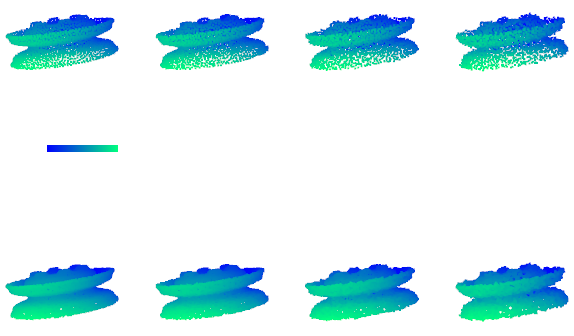

# PU-INN

## 论文注意要点

以下是最关键的问题。

- 缺少消融研究，以证明双向映射（即标准化流）是有用的（R3）
- 在pugeo-net中的比较似乎并不公平（R2）
- 缺少对pu-gan数据集的比较(R2)
- 缺乏稳健性，例如对邻域的敏感性，K的不同值会影响（R1）。
- 论文的动机motivation需要改进（R1，R2，R3，R4）
- 缺少引用（R1、R2、R3）（该论文是在CVPR 2021之后~2周提交的--因此，CVPR 2021论文在提交时是同期工作，因此不需要进行比较，但它们仍应作为同期工作被引用）。如果作者决定重新提交，与这些较新的工作进行比较会使论文更有力。


---

### 评论1

这项工作旨在通过使用条件归一化流（CNF），从稀疏的输入中产生一个密集的点集。

CNF 的设计在点云上采样方面似乎很合理。我很欣赏作者将 CNF 引入这一任务并进行了合理的修改。但仍有一些问题需要作者解决。

1) 对我来说，论文的**动机并不明确**。**在没有明确目标的情况下，直接将新技术应用于点云的上采样，这并不令人信服**。另外，即使在 "PUGeo-Net测试数据集中选定的11个模型和PU36数据集中的36个模型 "上，**性能的提高**也是非常**有限**的。
2) 这种方法的**稳健性**很难让人信服。正如在消融研究中所显示的，**网络对超参数相当敏感**，例如，**邻接点的数量**从8个改为6个，这个方法就不如以前的方法了。

3) 如图4和图5所示，与以前的方法相比，也很难说有什么改进。在Kitti上的**视觉结果**似乎也比其他论文中显示的要**差**，例如PU-GAN。

4) 在这次提交之前，有更多的论文[ref-1~2]发表了关于升采样的内容。也请讨论并**与SOTA进行比较**

[ref-1] PU-GCN: Point Cloud Upsampling via Graph Convolutional Network. CVPR 2021
[ref-2] Point Cloud Upsampling via Disentangled Refinement. CVPR 2021


其他问题。
1. 请解释该稿件如何推进该领域的研究和/或对文献的新贡献。你认为该论文最强和最弱的方面是什么？还请评论该论文的新颖性，其潜在的影响，以及结果和方法本身的可复制性。**本文通过使用条件归一化流（CNF）并进行合理的修改，对点云上升采样任务进行了研究。虽然这种新技术似乎是有效的，但其动机并不明确，而且改进也很有限。**
2. 该稿件在技术上是否**合理**？请在下面的公共评论中解释你的答案。**部分**
3. 稿件是否包含足够和适当的参考文献？请在下面的 "公众意见 "中解释并列出缺少的参考文献。**缺少重要的参考文献；需要更多的参考文献**
4. **introduction 是否用鼓励读者继续阅读的措辞说明了稿件的目的**？可以改进
5. 你如何评价**稿件的组织**？是否有**重点**？**长度与主题是否合适**？


---

### 评论2

contribution and experiments 都比较让审稿人满意。但仍有几点值得关注。

1. 由于作者在Tab.1中follows了pugeo-net的实验设置，但现有方法的结果似乎与pugeo-net的结果不同。**最好是直接引用pugeo-net的结果并与之比较，重新训练其他方法的模型似乎不公平。**

2. 建议作者提供在pu-gan（pu-gan[1]和dis-pu[2]）或pu1k（pu-gcn[3]）数据集上的结果，并与dis-pu和pu-gcn进行比较，因为这两个数据集是最先进的方法，而**pu-gan数据集在现有论文中被广泛使用**。

3. 如果能**给出更大的上采样率的定量比较**，比如pugeo-net和dis-pu的**16倍**，会更令人满意。

4. 建议提供与其他方法在真实扫描real scans（图6）和non-uniform非均匀数据（图10）上的**比较**。

5. 除了在Tab.1&2 中的模型尺寸比较，还建议提供**内存消耗的比较**。审稿人可能会担心，有**大量邻居的DGCNN可能会占用更多的内存**。

6. "条件归一化流" 的含义似乎与现有的工作不同，如"SRFlow[4]"和 "C-Flow[5]"。在以前的作品中，**"条件" 是指在从采样的高斯噪声中生成事物时加入图像或其他信息**，而作者的意思是**将输入点中的一组点特征注入到相同输入的另一组特征中**。是不是叫 "**feature fusion 特征融合**" 更好？

[1] Li, Ruihui, et al. "Pu-gan: a point cloud upsampling adversarial network." Proceedings of the IEEE/CVF International Conference on Computer Vision. 2019.
[2] Li, Ruihui, et al. "Point Cloud Upsampling via Disentangled Refinement." Proceedings of the IEEE/CVF Conference on Computer Vision and Pattern Recognition. 2021.
[3] Qian, Guocheng, et al. "Pu-gcn: Point cloud upsampling using graph convolutional networks." Proceedings of the IEEE/CVF Conference on Computer Vision and Pattern Recognition. 2021.
[4] Lugmayr, Andreas, et al. "Srflow: Learning the super-resolution space with normalizing flow." European Conference on Computer Vision. Springer, Cham, 2020.
[5] Pumarola, Albert, et al. "C-flow: Conditional generative flow models for images and 3d point clouds." Proceedings of the IEEE/CVF Conference on Computer Vision and Pattern Recognition. 2020.


本文通过使用**归一化流**和**特征插值技术**提出了一种新的点云上采样方法。本文显示了对点云上采样课题的良好影响 The paper shows good impact on point cloud upsampling topic。进行了各种实验来验证该方法的优越性能，但缺少与最先进方法的比较。一个小问题是论文的**新颖性**，因为这些技术看起来像是**不同的现有论文的技术的组合**。


---

### 评论3

作者**遗漏了太多的重要实验，无法充分证明其贡献**。


**优点**

- 本文提出了一种独特的点云上采样技术，包括归一化流和特征插值。因为归一化流学习了**点云从欧几里得空间到潜伏空间的双向映射**，**潜伏空间的插值立即反映了欧几里得空间的变化**。This paper presents a unique technique for point cloud upsampling that includes normalizing flows and feature interpolation. Because the normalizing flow learns a bijective mapping of point clouds from Euclidean space to latent space, interpolating in latent space immediately reflects changes in Euclidean space.
- 这些小雕像很有吸引力，也很有用。

**缺点**

1）**使用归一化流的好处没有得到明确验证**。

- 缺少了**最关键的消融研究**，**无法说明为什么双向映射（归一化流）是重要的**。最基本的，你必须保持流模块，**但不依靠它的反向映射来产生上采样点**，相反，你可以使用解码器（几层MLPs，如PU-Net、MPU或PU-GAN）从潜空间产生上采样点。 
- 改进并不强。如表3所示，**邻域大小对性能的影响比其他建议的模块都要大**，建议的PU-Flow在K=16的情况下只达到了1.1599的CD。**MPU也使用了K=16，他们的性能是1.022 CD，比PU-Flow好**。鉴于**MPU利用了与EdgeConv相同的特征提取器，这可能意味着归一化流没有帮助**，或者说目前提交的材料没有充分展示它。

2）**PU-GCN 和Dis-PU**

3）生成 claim 没有得到完全验证。论文声称 PU-Flow 可以产生均匀分布在底层表面的密集点（Page 1 L13）。在**下表面上产生点的能力是一个强有力的断言**。然而，**不清楚为什么归一化流可能对此有帮助。**

4）在 NF 部分的论文阅读需要改进。作为作者，你最好强调读者想知道的信息。比如说。

- **两个不同维度的空间之间的双向映射是如何进行的**？从一个低维空间到一个高维空间是一个不理想的问题 ill-posed problem不适定问题，因为缺少信息。我必须在稿件的文字之间找出答案，我相信答案就在前一篇论文提出的多尺度归一化流中。**这一部分应该在论文中写清楚，而且应该强调。**
- **双向映射（归一化流）有多大帮助**？这一点应该在文件中适当说明和强调。

5）**小的弱点--有限的新颖性**。归一化流不是一个重要的贡献，因为它已经在许多研究中被用于点云的生成。我同意应该承认利用归一化流进行点云上采样的贡献，但这不足以在旗舰期刊上发表。


---

### 评论4

我喜欢通过插值表示的点上采样方法，该方法编码了通过归一化流学到的**点分布先验**。这篇论文写得很好，很容易理解。对以前工作的参考是全面的，对多个数据集的评估是值得赞赏的。

我确实希望作者能在修改中解决以下问题。
1. 为什么作者选择使用**离散的归一化流**转换而不是PointFlow中使用的**连续归一化流**？离散流的使用似乎对模型结构造成了限制，特别是Sec 4.1中提到的瓶颈问题。这些问题是否可以通过使用一个连续的表述来解决？

2. **插值是在潜空间中进行的**，**但在欧氏空间中定义的邻域上进行**。实际上**在潜空间中寻找邻域不是更有意义**吗？在以前的生成方法[PointFlow]中，潜变量的平滑插值表明，潜空间实际上可能有一个嵌入的**语义相似性测距概念**。这个方案的另一个好处是，人们也许可以**使用简单的插值方法**，如 midpoint injection，**而不是使用学习模块来预测插值权重，这受制于一个固定的上采样率R**。

   In previous generative methods [PointFlow], the smooth interpolation of latent variables suggest that the latent space may actually have a notion of semantic similarity geodesic distance embedded.


论文 PU-Flow 介绍了一种新颖的点集上采样方法。与以前的点上采样网络不同，它的方法是基于生成性建模：NF。该方法本身是非常新颖的，可以启发进一步的研究。同时，与以前的方法的比较也显示出令人信服的优势。


---

# Figure

## 方法图

- [ ] 论文示意图 
- [ ] 论文总架构图

PU-INN 的总架构图。上图显示了 PU-INN 模型的整体架构，包含三个主要部分：PU-INN 主流层网络（第 4.1 节）、主体（第 4.2 节）和尾部（第 4.3 节）。 PU-Transformer 主体包括一组级联的 Transformer Encoders，作为整个 PU-Transformer 模型的核心组件。 特别地，每个 Transformer Encoder 的详细结构（例如，PU-Transformer body 总共包含 L 个 Transformer Encoders）如下图所示，其中所有注释与 Alg. 中的第 3-5 行一致。 1.


- [ ] 残差块示意图


- [ ] 局部特征提取图
- [ ] 全局特征提取图
- [ ] 特征聚合图
- [ ] 特征插值图


## 实验结果图

- [ ] Fig. 4 点云对比图，可视化P2F误差 5*6 矩阵 5个模型 （5个方法+1个GT）    一个boudingbox放大展示局部信息


It can better preserve the smoothness of local regions and produce a reliable shape, while other methods tend to produce more noisy points between some complex adjacent regions


- [ ] Fig. 5 曲面对比图，5*6 矩阵 5个模型 （5个方法+1个GT）  一个boudingbox放大展示局部信息

站立人 

Abraham                 8

Aloisius-von_Gonzaga 5

A_Roman_warrior √

Elisabeth  x

Franz_von_Assisi√

Goddess_of_hope√

Leopold  x

Saint_Mary_of_Antioch√

saint_sylvestre x

Standing_Isis_priest x


坐人

Hans_Christian_Andersen

Ludwig_van_Beethoven

Narcisse_made √

Woman_and_pupil


头像

Andre_Lens

Charles_Joseph

Friedrich_Schiller

Johan_van_Oldenbarnevelt


狮子

Lowe


compute normal ->25


octree depth ->12  top15


- [ ] Fig. 6 真实场景对比图，2*4矩阵 第一行为稀疏输入，第二行为稠密输出；4个场景，每个场景一个boundingbox放大


- [ ] Fig. 7 不同类别的生成结果，根据最近的点颜色。2*4矩阵 第一行为稀疏输入，第二行为稠密输出；


- [ ] Fig. 8 输入噪声结果对比。两个2行4列，第一行为稀疏输入，第二行为稠密输出； 输入噪声分别为 0 0.5% 1.0% 1.5%




- [ ] Fig .9 输入点数结果对比。 两个2行4列，第一行为稀疏输入，第二行为稠密输出； 输入点数分别为 512 1024 2048 4196


- [ ] Fig. 10 输入不均匀结果对比。3行2列，两行两个物体；第一列为稀疏输入，第二列为稠密输出，第三列为GT


# TODO

- [ ] Supplementary Material for:Unsupervised Detection of Distinctive Regions on 3D Shapes 里边的图片的风格！！！！！！！！！！！！ 必须follow


尽量画成这种哪些变量影响哪些变量的形式，投射关系


- [ ] Conditional 形式

- [ ] GUIDED IMAGE GENERATION WITH CONDITIONAL INVERTIBLE NEURAL NETWORKS


- [ ] 可逆架构里的切片换成下图这种 $\theta_1$ 和 $\theta_2$ 这种残缺的形式

Inference of cosmic-ray source properties by conditional invertible neural networks


- [ ] 注意力机制的图矩阵画成下边的颜色


- [ ] 分布的转化方式如下t图


- [ ] Exploring Data-Efficient 3D Scene Understanding with Contrastive Scene Contexts


- [ ] self-Supervised Deep Learning on Point Clouds by Reconstructing Space


- [ ] 重复的形式层数，画在全局特征提取器

DYNAMICALLY PRUNING SEGFORMER FOR EFFICIENT SEMANTIC SEGMENTATION


---

# Dense

DensePoint: Learning Densely Contextual Representation for Efficient Point Cloud Processing


----

# Global Feature


**Global Context Reasoning for Semantic Segmentation of 3D Point Clouds**

全局上下文依赖性对于 3D 点云的语义分割很重要。 然而，大多数现有方法堆叠特征提取层以扩大感受野，以沿空间维度聚合更多点的上下文信息。 在本文中，我们提出了一个点全局上下文推理（PointGCR）模块来沿通道维度捕获全局上下文信息。 在 PointGCR 中，使用无向图表示（即 ChannelGraph）来学习通道独立性。 具体来说，通道图首先表示为图节点，然后节点之间的独立性表示为图边。  PointGCR 是一个即插即用的端到端可训练模块。 它可以很容易地集成到现有的分段网络中，并实现显着的性能提升。 我们进行了广泛的实验来评估室内和室外数据集上提出的 PointGCR 模块。实验结果表明，我们的 PointGCR 模块有效地捕获了全局上下文依赖关系，并显着提高了几个现有网络的分割性能


**3DContextNet: K-d Tree Guided Hierarchical Learning of Point Clouds Using Local and Global Contextual Cues**

3D 点云的分类和分割是计算机视觉中的重要任务。 由于点云的不规则性，大多数现有方法在将点云用作 ConvNet 的输入之前将其转换为规则的 3D 体素网格。 不幸的是，体素表示对 3D 数据的几何性质高度不敏感。 最近的方法将点云编码为更高维的特征以覆盖全局 3D 空间。 然而，这些模型无法充分捕捉点云的局部结构。
   因此，在本文中，我们提出了一种利用 k-d 树强加的局部和全局上下文线索的方法。 该方法旨在沿着树结构逐步学习表示向量。 在具有挑战性的基准上的实验表明，所提出的模型提供了判别点集特征。 对于 3D 场景语义分割任务，我们的方法明显优于斯坦福大型 3D 室内空间数据集 (S3DIS) 上的最新技术。


**3D Point Capsule Networks**

在本文中，我们提出了 3D 点胶囊网络，这是一种自动编码器，旨在处理稀疏的 3D 点云，同时保留输入数据的空间排列。  3D 胶囊网络是我们新颖的统一 3D 自动编码器公式的直接结果。 他们的动态路由方案 [30] 和我们的方法部署的特殊 2D 潜在空间为几个常见的点云相关任务带来了改进，例如我们的广泛评估证实的对象分类、对象重建和部分分割。 此外，它还支持新的应用，例如零件插补和更换。


**SCANet: Spatial-channel attention network for 3D object detection**

本文旨在实现高精度 3D 对象检测，其中我们提出了一种新颖的空间通道注意网络 (SCANet)，这是一种两阶段检测器，将 LIDAR 点云和 RGB 图像作为输入来生成 3D 对象估计。 第一阶段是 3D 区域提议网络 (RPN)，我们在其中提出了新的空间通道注意 (SCA) 模块和扩展空间上采样 (ESU) 模块。 使用金字塔池化结构和全局平均池化，SCA 模块不仅可以有效地结合多尺度和全局上下文信息，还可以产生空间和通道方面的注意力来选择判别特征。 解码器中的 ESU 模块可以恢复由连续池化算子导致的丢失空间信息，以生成可靠的 3D 区域提议。 在第二阶段，我们设计了一种新的多级融合方案，用于准确分类和 3D 边界框回归。
   实验结果表明，SCANet 在具有挑战性的 KITTI 3D 对象检测基准上实现了最先进的性能。


# Attention


**NIPS Deep Modular Co-Attention Networks for Visual Question Answering**

P_PointASNL.md 文件


**PointASNL: Robust Point Clouds Processing using Nonlocal Neural Networks with Adaptive Sampling**

P_PointASNL.md 文件


```python
''' Input:
      xyz: (batch_size, ndataset, 3) TF tensor
      feature: (batch_size, ndataset, channel) TF tensor
'''


```


**SA-Det3D: Self-Attention Based Context-Aware 3D Object Detection**

P_PointASNL.md 文件


## **ACMMM2020_CF-SIS: Semantic-Instance Segmentation of 3D Point Clouds by**

**Context Fusion with Self-Attention**


**3.2. Inter-task Context Fusion** 

任务间上下文融合由两个相同的子分支组成，即 Sem2Ins 子分支和 Ins2Sem 子分支，只是 Ins2Sem 没有融合门。 不失一般性，以Sem2Ins 子分支为例进行进一步说明。

总的来说，在这个子分支中，我们首先根据语义原始特征 $ F_{\text {sem }}=\left\{s_{i} \mid i=1,2, \ldots, N\right\} $ 通过计算语义注意力来建模点之间的语义相关性。 然后，语义上下文通过语义原始特征的加权平均值聚合，并与实例原始特征 $ F_{i n s}=\left\{\boldsymbol{u}_{i} \mid i=1,2, \ldots, N\right\} $ 使用融合门融合 fusion gate，以进行控制从语义分支到实例分支的信息流。

具体来说，给定一个由语义原始特征 $s_i$ 表示的点，形成其对应语义上下文的 $N-1$ 个候选点是 $ S_{i}=\left\{s_{i_{j}} \mid j \in\{1,2, \ldots, N-1\}\right\} $  . 为了对中心点 $s_i$ 和其他点之间的语义关系进行建模，我们提出了空间注意力来计算中心点和候选点的特征之间的**余弦相似度分数**作为衡量语义关系的分数，给出为 $ q_{i, j}=\frac{s_{i}^{T} s_{i_{j}}}{\left\|s_{i}\right\|_{2}\left\|s_{i_{j}}\right\|_{2}} $ 。**余弦距离可以看作是一种手工制作的特征来表征点之间的语义关系**。我们建议在高维特征空间中**使用余弦距离而不是可学习的注意力机制的原因如下**。 首先，余**弦距离可以迫使网络考虑点之间的空间关系，因为两个相邻点自然会产生相似的特征并产生高余弦相似度**。 其次，**余弦距离可以从其他分支引入更多信息，因为余弦距离是未平滑的激活分数，与可学习注意力中使用的平滑（通过 softmax 激活）注意力分数相比，它具有明显更高的值**。 语义特征上下文 $ F_{\text {sem-c }}=\left\{c_{i} \mid i \in\{1,2, \ldots, n\}\right\} $ 计算为所有候选点的加权平均值，如 $ \boldsymbol{c}_{i}=\sum_{j=1}^{N-1} q_{i, j} \boldsymbol{s}_{i_{j}} $

请注意，由于以下两个原因，任务间上下文融合**考虑了整个输入点集的上下文提取**。 首先，与 3D 空间相比，kNN 在高维特征空间中搜索邻居点的计算成本较高，难以选择性地计算点及其语义相关邻居之间的注意力。其次，收集整个特征空间的语义上下文可以扩展中心点的感知范围，从而迫使网络学习更具有辨别力的相关点选择，并提取更多信息量的语义上下文。


**Fusion gate in inter-task context fusion module**.  由于与 Ins2Sem 子分支相比，Sem2Ins 子分支位于网络的最底层，其中原始语义特征用于上下文提取。因此，**提取的语义上下文是嘈杂的并且可能包含错误的信息**，如果直接融合到实例特征中而不进行预处理，这会损害实例分割的性能，**尤其是在训练的早期阶段**。 因此，**为了滤除语义上下文中的噪声和错误信息，并使训练对模型的初始化和超参数不那么敏感，我们建议使用融合门来控制两者之间的信息流任务。融合门使网络能够自动学习决定何时以及允许多少信息从一项任务流入另一项任务。**Therefore, in order to filter out the noise and the erroneous information in the semantic context, and make the training less sensitive to the initialization and hyper-parameters of the model, we propose to use a fusion gate to control the information flow between the two tasks. The fusion gate enables the network to automatically learn to decide when and how much information is allowed to flow from one task into the other.  具体来说，融合门使用线性变换确定语义特征上下文 $ F_{\text {sem-c }} $ 的质量，并使用 sigmoid 激活对输入特征的每个位置预测 0 到 1 之间的概率。 预测概率表示允许通过的语义上下文的比例。 该过程可以表述为
$$
\begin{equation}
 \beta_{g, i}=\sigma\left(W_{g} c_{i}+b_{g}\right) 
\end{equation}
$$
其中 $\sigma$ 表示 sigmoid 激活，$ \left\{W_{g}, \boldsymbol{b}_{g}\right\} $  是可学习矩阵和线性变换偏差。融合实例特征矩阵  $ F_{i n s-f}=\left\{u_{f, i} \mid i \in\{1,2, \ldots, n\}\right\} $ 门控语义特征上下文矩阵 和实例特征矩阵 $ F_{\text {sem }-c} $ ，给出为
$$
\begin{equation}
 \boldsymbol{u}_{f, i}=\beta_{g, i} \boldsymbol{c}_{i}+\left(1-\beta_{g, i}\right) \boldsymbol{u}_{i} 
\end{equation}
$$
我们注意到融合门也部署在 Sem2Ins 分支中，其结构与上述相同。


---

**3.3 Intra-task Context Fusion**

除了有助于不同任务之间的上下文融合，任务内部注意力的存在还可以帮助模型捕捉语义和实例特征，通过向中心点隐式指出相关区域。 这对于从点云中感知和提取 3D 视觉信息很重要，因为与单个点相比，相关区域包含更多关于语义和实例特征的信息，可以进一步用于区分点背后的语义标签和实例对象， 并产生更具辨别力的分割结果。 在本小节中，我们从之前的基于自我注意的工作 [35] 中找到灵感，通过有效的任务内上下文融合来学习特征空间中的每点上下文。
   该模块由两个相同的子分支组成，即Ins2Ins子分支和Sem2Sem子分支。 在不失一般性的情况下，我们只描述 Ins2Ins 子分支的详细结构。 该模块的输入是融合实例特征𝐺 𝑗𝑜𝑡 - 𝑔 = {𝒗 𝑔,𝑗 |𝑗 ∈{ 1 , 2 ,..,𝑂}} .这些特征首先被转化为三个不同的特征子空间{𝑠,𝑚,ℎ}，通过多层感知器𝑔，参数为𝜾，给出为𝒗𝜐，𝑗∈𝑜，𝑗∈𝑜，𝑗∈𝑜  ,𝑚,ℎ}。  (3) 注意力计算为子空间 𝑠 和 𝑚 中特征向量之间的点积，并使用 softmax 激活进行平滑，可以写成 𝑏 𝑗,𝑘 = exp(𝒗 T 𝑚,𝑗 𝒗 𝑠,𝑘 )  ˝ 𝑂 𝑘=1 exp(𝒗 T 𝑚,𝑗 𝒗 𝑠,𝑘 ) 。  (4) 最后的实例点嵌入 𝐹 𝑗𝑜𝑡 = {𝒇 𝑗𝑜𝑡,𝑗 } 是子空间ℎ中所有特征的加权平均值，具有链接到 𝐺 𝑗𝑜𝑔的子空间 𝑂 ∑︁ 𝑘=1 𝑏 𝑗, 𝑘 𝒗 ℎ, 𝑘 + 𝒗 𝑔 ,𝑗 |𝜾 𝑝 ), (5) 其中𝜇 𝑝 是一个随机学习的初始平衡因子，在训练期间随其他可学习的平衡因子一起更新。 请注意，任务内上下文融合旨在细化实例特征，这些特征将用于预测每个点的实例标签。 为了保留原始实例特征的信息，上下文特征得分相对较小的平滑注意力比未平滑余弦距离更可取。


## x**WACV2020_Global Context Reasoning for Semantic Segmentation of 3D Point Clouds**

- 一定要参考它的**Implementation Details**.


## **CVPR2021_SOE-Net_A_Self-Attention_and_Orientation_Encoding_Network_for_Point_Cloud**

- Sec 4.2


图 5 展示了它的架构。  给定局部描述符 $ F_{L} \in \mathbb{R}^{N \times C} $ ，其中 $N$ 是点数，$C$ 是通道数，我们分别将 $ F_{L}$ 馈入两个 MLP 并生成新的特征图 $ X \in \mathbb{R}^{N \times C}, Y \in \mathbb{R}^{N \times C} $ 。 然后计算注意力图 $W$，定义如下： 
$$
\begin{equation}
 W_{j, i}=\frac{\exp \left(Y_{j} \cdot X_{i}^{T}\right)}{\sum_{i, j=1}^{N} \exp \left(Y_{j} \cdot X_{i}^{T}\right)} 
\end{equation}
$$
其中，$W_{j, i}$ 表示第 $i$ 个局部描述符对第 $j$ 个局部描述符的影响，形状为 $N × N$。**这里，它认为是学习逐点局部描述符之间的长程依赖关系的组件。  更重要的局部描述符将对目标全局描述符的表示做出更多贡献**。在另一方面  $ F_{L}$ 被送入另一个 MLP 以输出一个新的特征图 $ Z \in \mathbb{R}^{N \times C} $。 之后，我们将其与 $W$ 的转置相乘以生成结果 $ A^{P} \in \mathbb{R}^{N \times C} $。 最后，我们在其上添加一个尺度参数 $α$ 并加回 $ F_{L}$  ，其定义如下：
$$
\begin{equation}
 F_{L}^{\prime}=\mu A^{p}+F_{L}=\mu W^{T} Z+F_{L} 
\end{equation}
$$
其中 $\mu$ 被初始化为零，并随着学习的进展逐渐分配更多的权重。**与原始局部描述符相比，最终输出具有全局上下文视图。 这通过结合几何和上下文信息来增强特征集成**。


## √**CVPR2018_Attentional_ShapeContextNet**

https://github.com/umyta/A-SCN


- **2.4. Attentional ShapeContextNet**

我们现在介绍一种受自然语言处理（sequence-tosequence）任务研究启发的不同方法。 传统的序列到序列模型通常采用循环神经网络（例如 LSTM[15]）、外部存储器或时间卷积来捕获上下文信息。[35] 中提出的点积自注意力是一种通过轻量级门控机制处理长路径长度上下文建模的模型，其中使用简单的点积生成注意力权重矩阵。值得注意的是，自注意力对于输入顺序也是不变的。与传统的基于注意力的序列到序列模型不同，在自注意力块中，查询向量 $ Q \in \mathcal{R}^{D_{Q}} $、键向量 $ k \in \mathcal{R}^{D_{k}} $（通常 $D_Q = D_K$ ）和值向量 $ V \in \mathcal{R}^{D_{V}} $ 是从相同的输入中学习的。 在监督分类设置中，可以认为 Q、K 和 V 只是由三个独立的 MLP 层学习的三个特征向量。 注意力权重通过 Q 和 K 的点积计算，然后与 V 相乘以获得变换后的表示。

图 2 显示了手动指定的形状上下文内核和可自动学习的自注意力机制之间的异同：它们都旨在捕获相对位置上的分布； 它们在第 2.2 节中统一在相同的表述下；  self-attention 中的选择操作不依赖于手工设计的 bin 分区，因为它可以从数据中学习； 与使用简单的 sumpooling 函数相比，self-attention 通过采用加权和聚合函数具有更好的建模能力。


**Selection and Aggregation**. 我们考虑在大小为 N 的整个点云 P 上计算自注意力。 选择操作产生一个软亲和矩阵，它是大小为 N × N 的自注意力权重矩阵 A，聚合操作是由权重矩阵A和变换值向量 V 点积，
$$
\begin{equation}
\text{Attention}  (Q, V, K)=\operatorname{Softmax}\left(\frac{Q K^{T}}{\sqrt{D_{Q}}}\right) \cdot V 
\end{equation}
$$


**Transformation**. 可以在每次自注意力操作之后添加具有 ReLU 激活函数的 MLP 作为特征转换操作（等式 1）。 为了进一步提高模型的表达能力，我们向 MLP 添加了一个简单的特征门控层，类似于 [8, 24]。


---

## √**CVPR2020_SA-Net_PointCloud_Completion_by_Skip-attention_Network_with_HierarchicalFolding**

https://github.com/RaminHasibi/SA_Net


## √**TVCG2019_VoxSegNet- Volumetric CNNs for semantic**

https://github.com/screnary/VoxSegNet

- **3.5 Attention Feature Aggregation**


## x**CVPR2019_Modeling Point Clouds with Self-Attention and Gumbel Subset Sampling**

We propose to use attention layers to capture the relations between the points. MHA is successful in modeling relations by introducing a critical multi-head design [10, 40, 28], however we argue that it is voluminous for modeling point clouds. To this regard, we propose a parameter-efficient Group Shuffle Attention (GSA) to replace MHA. There are two improvements over MHA:  

我们建议使用注意力层来捕捉点之间的关系。MHA 通过引入关键的多头设计 [10, 40, 28] 在关系建模方面取得了成功，但是我们认为它对于点云建模非常庞大。对此，我们提出了一种参数高效的 Group Shuffle Attention (GSA) 来代替 MHA。 对 MHA 有两个改进：

Firstly, toget rid ofposition-wise MLPs, we integrate the non-linearity σ into attention modules, named non-linear self-attention,首先，为了摆脱position-wise MLPs，我们将非线性σ整合到注意力模块中，称为非线性自注意力，

Attn σ (Q,X) = S(Q,X) · σ(X), (7)

where we use a Scaled Dot-Product attention [39] for S, i.e., S(Q,X) = softmax(QX T / √ c), and ELU activation [8] for σ. In other words, we use the ”pre-activation” to attend to the ”post-activation”. 其中我们对 S 使用 Scaled Dot-Product attention [39]，即 S(Q,X) = softmax(QX T / √ c)，对 σ 使用 ELU 激活 [8]。 换句话说，我们使用“预激活”来处理“激活后”。


---

# Interpolation

https://zhuanlan.zhihu.com/p/369946876


## **ECCV2020_Progressive Point Cloud Deconvolution Generation Network**

https://github.com/fpthink/PDGN/

在本文中，我们提出了一种有效的点云生成方法，该方法可以从潜在向量生成相同形状的多分辨率点云。 具体来说，我们开发了一种具有**基于学习的双边插值的新型渐进式反卷积网络**。在点云的空间和特征空间中进行基于学习的双边插值，从而可以利用点云的局部几何结构信息。从低分辨率点云开始，通过双边插值和最大池化操作，反卷积网络可以逐步输出高分辨率的局部和全局特征图。 通过连接不同分辨率的局部和全局特征图，我们采用多层感知器作为生成网络来生成多分辨率点云。 为了保持点云不同分辨率的形状一致，我们提出了一种形状保持对抗性损失来训练点云反卷积生成网络。 实验结果证明了我们提出的方法的有效性


**3.1 Progressive deconvolution generation network**

给定一个潜在向量，我们的目标是生成高质量的 3D 点云。   点云生成的一个关键问题是如何利用一维向量生成一组与几何中的 3D 对象一致的 3D 点。   为此，我们为 3D 点云开发了一个特殊的反卷积网络，我们首先使用基于学习的双边插值获得高分辨率特征图，然后应用 MLP 生成局部和全局特征图。 希望生成的局部和全局特征图的融合能够表征高维特征空间中点云的几何结构。

**Learning-based bilateral interpolation** 由于点云的无序和不规则结构，我们无法直接对特征图进行插值操作。 因此，我们需要为特征图上的每个点建立一个邻域来实现插值操作。 在这项工作中，我们简单地使用 k-最近邻 (k-NN) 来构建特征空间中每个点的邻域。 具体来说，给定一个具有 N 个特征向量 $ \boldsymbol{x}_{i} \in \mathbb{R}^{d} $ 的输入，点 i 和 j 之间的相似度定义为：
$$
\begin{equation}
 a_{i, j}=\exp \left(-\beta\left\|\boldsymbol{x}_{i}-\boldsymbol{x}_{j}\right\|_{2}^{2}\right) 
\end{equation}
$$
其中 β 在我们的实验中凭经验设置为 β = 1。 如图2（a）和（b）所示，我们可以在特征空间中选择k个具有定义相似度的最近邻点。 并且本文中参数k设置为k=20。


**Fig.2.** 反卷积网络的过程。 （a）首先，我们定义特征空间中点对之间的相似性。 我们在特征空间中选择 k 个最近邻点 (k-NN)，并在 (b) 中定义相似度。 然后我们在邻域中进行插值以形成（c）中的放大特征图。 最后，我们在 (d) 中应用 MLP 生成新的高维特征图。 请注意，我们可以通过反卷积网络获得双倍的点数。


一旦我们获得了每个点的邻域，我们就可以在其中进行插值。 如图2(c)所示，通过插值，可以将邻域内的k个点生成为特征空间中的2k个点。**线性和双线性插值**等经典插值方法是非学习插值方法，在点云生成过程中无法适应不同类别的3D模型。但**经典插值方法不会同时利用空间和特征空间中每个点的邻域信息**。

为此，我们提出了一种**基于学习的双边插值方法**，该方法利用每个点的邻域的空间坐标和特征来生成高分辨率的特征图。给定点 $ \boldsymbol{p}_{i} \in \mathbb{R}^{3} $ 和其邻域中的 k 个点，我们可以将双边插值公式化为： 
$$
\begin{equation}
 \tilde{\boldsymbol{x}}_{i, l}=\frac{\sum_{j=1}^{k} \theta_{l}\left(\boldsymbol{p}_{i}, \boldsymbol{p}_{j}\right) \psi_{l}\left(\boldsymbol{x}_{i}, \boldsymbol{x}_{j}\right) \boldsymbol{x}_{j, l}}{\sum_{j=1}^{k} \theta_{l}\left(\boldsymbol{p}_{i}, \boldsymbol{p}_{j}\right) \psi_{l}\left(\boldsymbol{x}_{i}, \boldsymbol{x}_{j}\right)} 
\end{equation}\tag{2}
$$
其中 $ \boldsymbol{p}_{i}$ 和 $ \boldsymbol{p}_{j}$ 是 3D 空间坐标，$ \boldsymbol{x}_{i}$ 和 $ \boldsymbol{x}_{j}$ 是 d 维特征向量，$ \theta\left(\boldsymbol{p}_{i}, \boldsymbol{p}_{j}\right) \in \mathbb{R}^{d} $ 和 $ \psi\left(\boldsymbol{p}_{i}, \boldsymbol{p}_{j}\right) \in \mathbb{R}^{d} $  分别是空间和特征空间中的两个嵌入，$ \tilde{\boldsymbol{x}}_{i, l} $ 是插值特征 $ \tilde{\boldsymbol{x}}_{i}, l=1,2, \cdots, d $ 的第 $l$ 个元素。 嵌入 $ \theta\left(\boldsymbol{p}_{i}, \boldsymbol{p}_{j}\right) \in \mathbb{R}^{d} $ 和 $ \psi\left(\boldsymbol{p}_{i}, \boldsymbol{p}_{j}\right) \in \mathbb{R}^{d} $  可以定义为：
$$
\begin{equation}
 \theta\left(\boldsymbol{p}_{i}, \boldsymbol{p}_{j}\right)=\operatorname{ReLU}\left(\boldsymbol{W}_{\theta, j}^{\top}\left(\boldsymbol{p}_{i}-\boldsymbol{p}_{j}\right)\right), \quad \psi\left(\boldsymbol{x}_{i}, \boldsymbol{x}_{j}\right)=\operatorname{ReLU}\left(\boldsymbol{W}_{\psi, j}^{\top}\left(\boldsymbol{x}_{i}-\boldsymbol{x}_{j}\right)\right) 
\end{equation}
$$
其中 ReLU 是激活函数，$ \boldsymbol{W}_{\theta, j} \in \mathbb{R}^{3 \times d} $ 和 $ \boldsymbol{W}_{\psi, j} \in \mathbb{R}^{d \times d} $ 是要学习的权重。 基于点 $p_i$ 和 $p_j$ 、$p_i − p_j$ 和 $x_i − x_j$ 之间的差异，嵌入 $θ(p_i ,p_j )$ 和 $ψ (x_i ,x_j )$ 可以分别编码点 $p_i$ 在空间和特征空间中的局部结构信息。 值得注意的是，在**Eq. 2**中，采用channel-wise双边插值。 如图 3 所示，新的插值特征 $ \tilde{\boldsymbol{x}}_{i} $ 可以从 $ \boldsymbol{x}_{i} $ 的邻域中获得，具有双边权重。 对于每个点，我们在 k 邻域中执行双边插值以生成新的 k 点。因此，我们可以获得高分辨率的特征图，其中每个点的邻域包含 2k 个点。


插值后，我们然后在放大的特征图上应用卷积。 对于每个点，我们根据距离将 2k 个点的邻域划分为两个区域。 如图2(c)所示，最近的k个点属于第一个区域，其余的作为第二个区域。 与PointNet [26]类似，我们首先使用多层感知器生成高维特征图，然后使用最大池化操作从两个区域获取两个插值点的局部特征。 如图 2 (d) 所示，我们可以通过反卷积网络将输入的点数加倍以生成高分辨率的局部特征图 X local 。我们还使用最大池化操作来提取全局特征 点云。 通过将全局特征复制 N 次，其中 N 是点数，我们可以获得高分辨率的全局特征图 X global 。 然后我们将局部特征图 X local 和全局特征图 X global 连接起来，得到反卷积网络的输出 X c = [X local ;X global ]。 因此，输出X c 不仅可以表征点云的局部几何结构，还可以在点云生成过程中捕捉点云的全局形状。


**Fig. 3** 基于学习的双边插值方法示意图。中心点 $x_i$ 附近的点被着色。 我们通过考虑邻域中点的局部几何特征来插入新点。$ \boldsymbol{W}_{\theta, j} $ 和 $ \boldsymbol{W}_{\psi, j}, j=1,2,3,4 $ 是要学习的空间和特征空间中的权重。


---

## **ICCV2019Oral_Interpolated Convolutional Networks for 3D Point Cloud Understanding**

点云是一种重要的 3D 表示类型。然而，由于稀疏、不规则和无序的数据结构，直接在点云上应用卷积具有挑战性。 在本文中，我们提出了一种新颖的插值卷积操作 InterpConv 来解决点云特征学习和理解问题。 关键思想是利用一组离散的内核权重，并通过卷积的插值函数将点特征插入到相邻的内核权重坐标中。 引入归一化项来处理不同稀疏级别的邻域。 我们的 InterpConv 被证明是排列和稀疏不变的，并且可以直接处理不规则输入。


**3.1. Convolutions on Point Sets**

标准的 2D 和 3D 卷积在处理图像和体素网格等规则排列的数据方面取得了巨大成功。 当涉及稀疏和不规则的点集（例如 3D 点云）时，已经提出了多种卷积变体。 在本节中，我们将回顾这些卷积以激发 InterpConv 操作的设计。

考虑标准的 3D 卷积，让 3D 体素网格或特征表示为 F : Z 3 → R c ，卷积核权重 W 是一系列 1 × c 权重向量，其中 c 是通道数。 位置 ˆp 处的标准卷积可以表示为
$$
\begin{equation}
 F * W(\hat{p})=\sum_{p^{\prime} \in \Omega} F\left(\hat{p}+p^{\prime}\right) \cdot W\left(p^{\prime}\right) 
\end{equation}
$$
当涉及到不规则输入时，点不再有规律地排列，点之间的距离变得不规则。 一些方法 [43, 46] 采用**连续权重函数** W(p δ )，它以相邻点 ˆ p+p δ 到中心点 ˆ p 的相对坐标 p δ 作为输入，来预测卷积权重。 连续函数 W(p δ ) 不再是一个 1×c 权重向量，而是一个由 MLP 实现的映射 R 3 → R c 。 那么连续卷积可以表示为
$$
\begin{equation}
 F * W(\hat{p})=\sum_{p_{\delta}} F\left(\hat{p}+p_{\delta}\right) \cdot W\left(p_{\delta}\right) 
\end{equation}
$$
值得注意的是，应用图神经网络 [45, 49, 34] 来处理点云本质上与连续卷积具有相同的想法。用连续函数 W(p δ ) 替换离散内核权重 W(p 0 ) 仍然存在一些问题。 简单地通过 MLP 学习连续函数并不总是在实践中起作用 [49]。 预测的参数可能太多，学习过程效率低下，有时不稳定。 图像中离散内核的巨大成功的知识也不能转移到点云识别任务中。


**3.2. Interpolation Weight**

在我们的方法中，我们采用离散卷积权重的设计，同时保持连续距离的特征，通过将 W(p δ ) 解耦为两部分：**空间离散核权重** W(p 0 ) ∈ R c 和**插值函数** T(  p δ ,p 0 )。 我们注意到空间离散的核权重 W(p 0 ) 是一个 1×c 的向量，可以在训练期间初始化和更新，p 0 是这个核权重向量到核中心的相对坐标。

插值函数T(p δ ,p 0 ) : R 3 × R 3 → R 以核权重向量p 0 和相邻输入点p δ 的坐标为输入，通过一定的插值算法计算权重。 我们的方法考虑了核权重向量附近的每个输入点。 为了使卷积稀疏不变，每个内核权重向量 W(p 0 ) 需要一个密度归一化项 N p 0 ，它对 p 0 邻域中的插值权重或输入点数求和。 最后，我们以位置 ˆp 为中心的 InterpConv 可以表示为
$$
\begin{equation}
 F * W(\hat{p})=\sum_{p^{\prime}} \frac{1}{N_{p^{\prime}}} \sum_{p_{\delta}} T\left(p_{\delta}, p^{\prime}\right) F\left(\hat{p}+p_{\delta}\right) \cdot W\left(p^{\prime}\right) . 
\end{equation}
$$
我们注意到，与标准卷积不同，内核权重有规律地排列，InterpConvs 中的内核权重坐标 p 0 可以灵活设置，甚至可以在训练期间学习。我们提出的 InterpConv 操作有三个关键部分：空间离散的核权重 W、插值函数 T 和归一化项 N。我们首先分别讨论这三个部分，然后介绍完整的算法。

**离散核权重**。在 2D 卷积 [17] 中，一个内核可以表示为一个 n × n × c 张量，其中 n 表示内核大小，c 表示通道数。 在[6, 9]中，一个内核被分成n×n个权重向量，每个权重向量的大小为1×c。 通过这样做，内核权重不再需要有规律地排列，而是可以灵活地放置在 2D 网格上。 在我们的方法中，我们通过为 3D 欧几里德空间中的每个卷积核定义一组核权重向量来进一步改进这个想法。 每个内核权重向量 W(p 0 ) 都有一个 3D 坐标 p 0 来存储其相对于核中心，其权重存储在一个 1×c 向量中，该向量将在训练期间初始化和更新。 矢量坐标 p 0 可以在训练期间固定或更新。 为了简化问题，我们在大多数实验中固定核权重坐标并将它们组织成一个立方体，即如果核权重向量总数为 27，则核权重向量排列在 3 × 3 × 3 3D 规则网格中。我们注意到 这是标准 3 × 3 × 3 离散卷积的类比，而内核权重向量理论上可以放置在 3D 空间中的任意位置。

当我们将核权重向量排列为立方体时，我们定义了两个重要的超参数：核大小 n × n × n 和核长度 l。 空间离散核权重向量的坐标集可以表示为
$$
\begin{equation}
 \Phi=\left\{\left(x^{\prime}, y^{\prime}, z^{\prime}\right) \mid x^{\prime}, y^{\prime}, z^{\prime}=k l,\right.  \left.k \in\left\{-\frac{n-1}{2}, \cdots, \frac{n-1}{2}\right\}\right\} 
\end{equation}
$$
其中 p 0 = (x 0 ,y 0 ,z 0 )。 类似于标准卷积中核大小的定义，核大小 n × n × n ∈ Z 3 表示一个核的每条边上有 n 个核权向量，核权向量的总数为 n 3 。 核长度 l ∈ R 是两个相邻权向量之间的距离。 它决定了欧几里德空间中内核的实际 3D 大小，并被定义为控制感受野，卷积内核可以从中“看到”输入点云。 如果 l 很小，卷积核能够捕获细粒度的局部结构，否则它会编码更多的全局形状信息。


**3.3. Interpolation functions**

在不规则点云上应用离散内核的一个问题是内核权重向量的空间位置通常与输入点不对齐。 天真地将点云光栅化为规则网格 [24, 11] 解决了部分问题，但代价是丢失了局部结构。 在我们的方法中，我们通过采用插值函数来解决这个问题，同时保留所有细粒度结构。 即，我们首先在每个核权重向量附近找到一组输入点，然后将它们的特征插值到核权重向量上进行卷积。 我们提出了两种插值函数：三线性插值和高斯插值。


---

## ECCV2021_Intrinsic Point Cloud Interpolation via Dual Latent Space Navigation

我们提出了一种基于学习的方法，用于内插和操作表示为点云的 3D 形状，该方法明确设计为保留固有的形状属性。 我们的方法基于构建一个双编码空间，该空间可以实现形状合成，同时提供指向固有形状信息的链接，这通常在点云数据上不可用。 我们的方法一次性工作，避免了现有技术采用的昂贵优化。 此外，我们的双潜在空间方法提供的强正则化也有助于改善具有挑战性的环境中不同数据集的嘈杂点云的形状恢复。 大量实验表明，与基线相比，我们的方法产生了更真实、更平滑的插值。


**3. Motivation & Background**

我们的主要目标是设计一种能够高效准确地插入表示为点云的形状的方法。 由于几个关键原因，这个问题具有挑战性。 首先，大多数现有理论上有充分根据的公理 3D 形状插值方法 [30,25,23,24] 假设输入形状表示为具有 1-1 对应关系的固定连接的三角形网格，而且通常需要在测试时进行大量优化 . 另一方面，基于学习的方法通常将形状嵌入到紧凑的潜在空间中，并通过线性插值它们相应的潜在向量来插值形状 [1,49]。 尽管这种方法是有效的，但**潜在空间中的度量通常不被很好地理解**，**因此该空间中的线性插值可能会导致不切实际和严重扭曲的形状**。 变分自动编码器 (VAE) 等经典方法有助于将规律性引入潜在空间，并实现更准确的生成模型，但对距离的控制很少，因此对潜在空间中的插值提供了很少的控制。 为了应对这一挑战，最近的几种方法提出了为潜在空间赋予度量并帮助恢复测地距离的方法 [31,12,17]。 然而，这些方法通常再次涉及昂贵的计算，例如解码器网络的雅可比矩阵，以及在测试时进行昂贵的优化。在这种情况下，我们的主要目标是将几何方法 [30,24] 提出的形式主义和形状度量与数据驱动技术的准确性和灵活性相结合，同时保持效率和可扩展性。


**Shape Interpolation Energy**

首先回顾一下[30]中介绍的内在形状插值能量。具体假设我们有一对形状 M,N 表示为具有固定连通性的三角形网格，因此 M = (VM ,E) 和 N = (VN ,E)，其中 V,E 表示点的坐标， 分别是固定的边集。 内插序列由单参数族 S t = (V t ,E) 定义，使得 V 0 = V M ，并且 V 1 = V N 。 用v i (t) 表示顶点i 在S t 中的轨迹，S t 的基本时间连续内在插值能量定义为：


**3.1. Metric interpolation in a learned space**

为了克服这个限制，也许最简单的方法是使用可学习的潜在空间，但要计算插值序列，同时显式地最小化解码形状的内在失真能量。
   即，在训练自动编码器后，给定具有潜在向量 l M ,l N 的源和目标形状，可以在潜在空间中构造一组样本 l k 并在测试时优化：


给定两个可能有噪声的无组织点云 P A 和 P B 我们首先计算它们相关的基于边缘的潜在代码：m A = M PE (enc p (P A )) 和 m B = M PE (enc p (P B ))。 在这里，我们使用编码器 enc p 的置换不变性允许对无序点集进行编码。 然后我们在 m A 和 m B 之间进行线性插值，但使用形状解码器 dec p 进行重建。 因此，我们计算一系列中间点云如下： 

P α = dec p (M EP ((1 − α)m A + αm B )), α ∈ [0...1] (10) 

换句话说 ，**我们在基于边缘的潜在空间中插入潜在代码，但通过形状解码器 dec p 执行重建。** **这使我们能够确保重建的形状既逼真又平滑地插入它们的内在度量。** 请注意，与纯几何方法（例如 [30]）不同，我们的方法不依赖于测试时给定的网格结构。相反，**我们使用学习到的基于边缘的潜在空间作为恢复固有形状结构的代理**，如下所示，这足以获得准确和平滑的插值。

由于边长自动编码器是完全旋转不变的，因此有必要在测试时对齐输出形状。 我们可以通过使用与计算 Eq.9 相同的最优刚性变换来轻松做到这一点。 


---

## x**ICCV2021_Interpolation-Aware Padding for 3D Sparse Convolutional Neural Networks**

https://github.com/Yukichiii/SparsePadding

这里基于稀疏体素的 CNN 的填充与传统的 2D 图像填充有着根本的不同。我们在空体素周围填充额外的体素作为输入。最初，填充体素的输入特征设置为零，然后所有体素特征都由 CNN 操作动态生成。 对于图像上的 2D 卷积，由于卷积核的形状固定，靠近图像边界的像素需要虚拟填充像素。 并且填充像素的特征直接设置为零（即零填充）或图像边界上反射像素处的特征图（即反射填充）。

我们的目标是在非空体素周围填充额外的体素，以便在对每个点进行三线性插值时所有八个最近的相邻体素都存在。  3D 规则网格 [29] 内的三线性插值可以写为：


其中 i,j,k ∈ {0,1} aretheindicesoftheeightgridcorners, vol ijk 是被查询点和与索引为 ijk 的角对角相对的角所包围的部分体积，f ijk 是角 ijk 上关联的特征向量 , I ijk ∈ {0,1} 表示对应的体素是否存在。 在下文中，我们检查了两种基线填充方案，并提出了我们的插值感知填充方案，以平衡网络性能和运行时内存成本。


**Interpolation-aware padding** 使用eq.1 在非空体素 v 内的 3D 点 p = (x,y,z) 上插入 CNN 特征。 我们将插值中涉及的所有空体素填充到 CNN 计算中。 我们假设指定了输入的 3D 边界框，并且具有最小 x、y、z 坐标的角由 p o = (x o ,y o ,z o ) 表示。 插值涉及的所有八个体素的体素索引计算如下：


---

# Condition Flow

only for condition part


## *PUFlow

**3.2. Normalizing Flows**

标准化流是一系列可逆的分布变换。它通常用于通过简单的先验分布对难以处理的复杂分布进行建模。形式上，让 $ z \in \mathbb{R}^{D} $ 是一个具有已知密度分布 $ p_{\vartheta}(z) $ 的潜在变量，即 $ z \sim p_{\vartheta}(z) $ 。

在条件流设置的上下文中，给定观测数据集 $\mathcal{P}$，我们的目标是学习可逆变换 $ f_{\theta}(\cdot) $ 以将从 $\mathcal{P}$ 到易处理密度 $ p_{\vartheta}(z)$ 的映射参数化：
$$
\begin{equation}
 z=f_{\theta}(\mathcal{P} ; \mathcal{C}) 
\end{equation}
$$
其中 $ \mathcal{C}=\psi(\mathcal{P}) $，而 $\psi(\cdot) $ 是从 $\mathcal{P} $ 中提取条件特征的任意函数。在这里，我们将 $ f_{\theta}$ 定义为条件标准化流。请注意，$ f_{\theta}$ 通常由具有参数 $\theta$ 的神经网络参数化，并且是双射变换。也就是说，给定条件特征 $\mathcal{C}$ 和从 $ p_{\vartheta}(\hat{z}) $ 中提取的潜在变量 $ \hat{z} $，反函数 $ g_{\theta}(\cdot)=f_{\theta}^{-1}(\cdot) $ 隐式定义了映射
$$
\begin{equation}
 \hat{\mathcal{X}}=g_{\theta}(\hat{z} ; \mathcal{C}) 
\end{equation}
$$
其中 $\hat{\mathcal{X}}$ 是 $\mathcal{P} $ 的估计

由于单层流模型非线性能力有限，在实践中，流网络 $ f_{\theta}$ 由一系列 $L$ 个可逆层组成。 设 $h^{l}$ 为第 $l$ 个流层的输出，则 $h^{l+1}$ 定义为
$$
\begin{equation}
 h^{l+1}=f_{\theta}^{l}\left(h^{l} ; \mathcal{C}^{l}\right) 
\end{equation}
$$
其中 $f_{\theta}^{l}$ 是第 $l$ 个流层，$h^0=P$ ，$h^L=z$ ，$\mathcal{C}^{l}$ 是第 $l$ 层对应的条件特征。 随着 RealNvp 中变量公式和链式法则的变化，给定输入 $\mathcal{P}$ 的概率密度可以计算为
$$
\begin{equation}
 \log p(\mathcal{P} \mid \mathcal{C}, \theta)=\log p_{\vartheta}\left(f_{\theta}(\mathcal{P} ; \mathcal{C})\right)+\log \left|  \operatorname{det} \frac{\partial f_{\theta}}{\partial \mathcal{P}}(\mathcal{P} ; \mathcal{C})\right|  \\
 =\log p_{\vartheta}\left(f_{\theta}(\mathcal{P} ; \mathcal{C})\right)+\sum_{l=1}^{L} \log \left|\operatorname{det} \frac{\partial f_{\theta}^{l}}{\partial h^{l}}\left(h^{l} ; \mathcal{C}^{l}\right)\right| 
\end{equation}\tag{4}
$$
其中 $ \operatorname{det} \frac{\partial f_{\theta}}{\partial \mathcal{P}}(\mathcal{P} ; \mathcal{C}) $ 项是变换 $f_θ$ 的雅可比行列式，测量由 $f_θ$ 引起的体积变化 [35,NICE]。 

对于每个流层的式 4 的详细实现在第 4.2 节中讨论。


## *Generative Flows with Invertible Attentions

**2. Related Work**

早期的基于流的生成模型（如 [3、26、18、27]）被引入用于对真实数据对数似然的精确推断。 它们通常由一系列可逆变换构建，以将基本分布映射到复杂分布。


近年来，各种无条件生成流模型（如 [19、28、20、22] 不断涌现，以将早期的流模型扩展到具有分离耦合的多尺度架构，从而实现高效推理和采样。 例如，[19] 额外引入了可逆的 1 × 1 卷积来编码无条件设置的数据分布中的非线性。  [29] 引入了更通用的 d × d 可逆卷积来扩大感受野。  [28] 利用流层的残余块（即，一个灵活的变换族），其中只需要 Lipschitz 条件而不是严格的架构约束来强制可逆性。  [20]通过变分反量化、连续混合累积分布函数和自注意力改进耦合层。 自注意力直接应用于耦合层的内在神经功能。 由于仿射耦合层的性质，不需要注意是可逆的。

此外，这种直接注意应用程序仅学习通道方向流维度的两个分裂之一内的依赖关系，因此其感受野受到极大限制。 相比之下，我们引入的注意力是一个独立的流层，它应该是可逆的，并且可以跨不同的流特征图分割学习更一般和更远距离的依赖关系。 换句话说，[20] 对分割内的依赖进行建模，而我们的则学习交叉分割的相关性，因此两者是互补的。 最近，[22] 通过多尺度自回归先验对通道依赖建模。 引入的依赖建模受限于潜在空间，因此它可以补充我们对中间流维度的利用注意力。


另一方面，最近的条件流模型（如 [30-33, 6]）也已被探索，旨在条件图像合成。 例如，[30] 为源和目标开发了两个可逆网络以及一个将潜在空间相互映射的关系网络。 通过这种方式，可以在适当的层次结构级别利用条件信息，因此可以克服始终使用原始图像作为输入的限制。 

类似地，[32] 开发了一个并行序列的可逆映射，其中源流在每一步引导目标流。  

[33]另外引入了条件网络，允许目标域流中的所有操作以源域信息为条件。 

为了更好地运用条件，[6] 利用条件仿射耦合层，该层接受由一个外部神经网络提取的源域特征图作为条件。 为了从源域进行更直接的信息传输，[6] 引入了一个条件仿射注入器，它直接将条件提供给激活图中的所有通道和空间位置。 据我们所知，这些条件生成流模型很少学习长期依赖。


---

## *DUAL-GLOW_Conditional_Flow-Based_Generative_Model_for_Modality_Transfer

**3. Deriving DUAL-GLOW**

在这一节中，我们介绍了用于模态间传递的双GLOWframework。我们首先讨论了给定磁共振图像的正电子发射断层图像的条件分布的推导，然后提供了有效计算其对数似然的策略。然后，我们介绍了可逆流的构造和雅可比矩阵的计算。接下来，我们为我们的DUAL-GLOW框架构建了分层架构，与平面结构相比，这大大降低了计算成本。最后，用附加的鉴别器导出了辅助信息操作的条件结构。


**Log-Likelihood of the conditional Distribution.**

让 MR和PET图像相对应的数据被表示为 为D m和D p。从数据集D m = {x im } n i=1，我们有兴趣生成与数据集D p = {x ip } n i=1中的图像具有相同属性的图像。
在我们的DUAL-GLOW模型中，我们假设存在一个基于流动的可逆函数f p，它将PET图像x p映射到z p = f p (x p)，以及一个基于流动的可逆函数f m，它将MR图像x m映射到z m = f m (x m)。潜在变量z p和z m有助于建立一个条件概率p θ (z p |z m)，由以下公式给出


## *Structured Output Learning with Conditional Generative Flows

传统的结构化预测模型尝试学习条件似然，即 p(y|x)，以捕捉结构化输出 y 和输入特征 x 之间的关系。 对于许多模型，计算似然性是棘手的。 因此，这些模型很难训练，需要使用替代目标或变分推理来近似似然。 在本文中，我们提出了条件发光（c-Glow），一种用于结构化输出学习的条件生成流。  CGlow 受益于基于流的模型准确有效地计算 p(y|x) 的能力。 使用 c-Glow 学习不需要替代目标或在训练期间进行推理。 一旦经过训练，我们就可以直接有效地生成条件样本。 我们开发了一种基于样本的预测方法，可以利用这一优势进行高效有效的推理。 在我们的实验中，我们在五个不同的任务上测试了 c-Glow。  C-Glow 在某些任务中优于最先进的基线，并在其他任务中预测可比较的输出。 结果表明，c-Glow 是通用的，适用于许多不同的结构化预测问题。

**3.2. Conditional Normalizing Flows**

归一化流是可逆函数 f = f 1 ◦f 2 ◦···◦f M 的组合，它将目标代码转换为从简单分布中提取的潜在代码 z。 在条件归一化流（Trippe and Turner 2018）中，我们将每个函数重写为 $ f_{i}=f_{x, \phi_{i}} $，使其由 x 及其参数 φ i 参数化。 因此，随着变量公式的变化，我们可以将条件似然改写为 logp(y|x,θ) = logp Z (z) + M X i=1 log ?  ？  ∂f x,φ i ∂r i−1 ?  ?  , (1) 其中 r i = f φ i (r i−1 )，r 0 = x，并且 r M = z。

在本文中，我们通过使用归一化流来解决结构化输出问题。 也就是说，我们直接使用条件归一化流，即等式 1，来计算条件分布。 因此，可以通过局部优化精确似然来训练模型。 请注意，条件归一化流已用于条件密度估计。  Trippe and Turner (2018) 用它来解决一维回归问题。 我们的方法与他们的不同之处在于我们问题中的标签是高维张量而不是标量。 因此，我们将建立在最近开发的用于（无条件）基于流的高维数据生成模型的方法的基础上。


**4.1 Conditional Glow**

为了将 Glow 修改为条件生成流，我们需要为其三个组件添加条件架构：actnorm 层、1×1 卷积层和仿射耦合层。主要思想是使用神经网络，我们将其称为**条件网络 (CN)**，用于**为每一层生成参数权重**。 详细情况如下。


**Actnorm layers.** 每个激活归一化（actnorm）层使用两个1×c的参数，即一个尺度 s 和一个偏置 b，对激活进行仿射转换。该转换可以写成
$$
\begin{equation}
 u_{i, j}=s \odot v_{i, j}+b 
\end{equation}
$$
其中 $\odot$ 是逐元素点积


**Conditional actnorm**. actnorm 层的参数是两个 1 × c 向量，即尺度 s 和偏置 b。在条件 Glow 中，我们**使用 CN 生成这两个向量**，然后使用它们来仿射转换，即变为
$$
\begin{equation}
 s, b=\mathrm{CN}(x), \quad u_{i, j}=s \odot v_{i, j}+b 
\end{equation}
$$


---

**Invertible 1×1 convolutional layers**. 每个可反转的1x1卷积层都是一个泛化的操作。其函数格式为
$$
\begin{equation}
 u_{i, j}=W v_{i, j} 
\end{equation}
$$
其中 $W$ 是一个 $c×c$ 的权重矩阵。


**Conditional 1×1 convolutional**. 1×1 卷积层使用 $c × c$ 权重矩阵来置换每个空间维度的变量。在条件 Glow 中，我们使用一个条件网络来**生成这个W矩阵**：
$$
\begin{equation}
 W=\mathrm{CN}(x), \quad u_{i, j}=W v_{i, j} 
\end{equation}
$$


---

**Affine layers**. 与NICE和Real-NVP模型一样，Glow也有仿射耦合层来捕捉**空间维度之间的相关性**。它的转换是
$$
\begin{equation}
 \begin{array}{ll}v_{1}, v_{2}=\operatorname{split}(v), & s_{2}, b_{2}=\operatorname{NN}\left(v_{1}\right) \\ u_{2}=s_{2} \odot v_{2}+b_{2}, & u=\operatorname{concat}\left(v_{1}, u_{2}\right)\end{array} 
\end{equation}
$$
其中 NN 是一个神经网络，split()和concat()函数**沿通道维度进行操作**。 $s_2$ 和 $b_2$ 向量的大小与 $v_2$ 相同。


**Conditional affine coupling**. 仿射耦合层将输入变量分成两半，即 $v_1$ 和 $v_2$ 。 它使用 $v_1$ 作为神经网络的输入来生成 $v_2$ 的尺度和偏置参数。为了构建条件仿射耦合层，我们使用 CN 从 $x$ 中提取特征，然后将其**与 $v_1$ 连接以形成 NN 的输入**。
$$
\begin{equation}
 \begin{array}{ll}v_{1}, v_{2}=\operatorname{split}(v), & x_{r}=\mathrm{CN}(x) \\ s_{2}, b_{2}=\mathrm{NN}\left(v_{1}, x_{r}\right), & u_{2}=s_{2} \odot v_{2}+b_{2} \\ u=\operatorname{concat}\left(v_{1}, u_{2}\right) & \end{array} 
\end{equation}
$$
我们仍然可以使用多尺度架构来组合这些条件组件，以保持计算效率。 图 1 说明了用于比较的 Glow 和 c-Glow 架构。

由于在优化条件模型时条件网络不需要是可逆的，我们在这里定义了对其架构没有限制的通用方法。任何可微网络都足以并保持 c-Glow 计算每个输入-输出对的精确条件似然的能力。 我们将在 5.1 节中指定我们在实验中使用的架构。


**Fig. 1** Glow 和条件 Glow 的模型架构。对于每个模型，左边的子图是每个步骤的架构。架构，而右边的子图是整个架构。参数L代表层次的数量，K代表每个层次的深度。


**4.2 Learning**

为了学习模型参数，我们可以利用基于流的模型有效计算的对数似然。 在输出连续的情况下，似然计算是直接的。 因此，我们可以反向传播到微分精确的条件似然，即等式。  1，并使用梯度方法优化所有 c-Glow 参数。

在输出离散的情况下，我们遵循（Dinh、Sohl-Dickstein 和 Bengio 2016；Kingma 和 Dhariwal 2018；Ho 等人 2019）并在训练期间向 y 添加均匀噪声以对数据进行反量化。 此过程会扩充数据集并防止模型崩溃。 我们仍然可以使用反向传播和梯度方法来优化这种近似连续分布的可能性。 通过扩展 Theis、Oord 和 Bethge (2015) 以及 Ho 等人的证明。
   (2019)，我们可以证明离散分布受这种连续分布的下限。


稍微滥用符号，我们让 q(y|x) 是我们的离散假设分布，而 p(v|x) 是去量化的连续模型。 然后我们的目标是最大化似然 q，这可以通过将 v 的值边缘化为 y 来表示：


其中 d 是变量的维度，而 u 表示连续变量 v 和四舍五入的量化 y 之间的差异。


令 p d (x,y) 为真实数据分布，而 ˜ p d (x,y) 为反量化数据集的分布。 学习过程使 E ∼ p d (x,y) [logp(v|x)] 最大化。


因此，当 y 是离散的时，最大化连续似然 p(v|x) 的学习优化会最大化 q(y|x) 的下限。


**4.3 Inference**

Givenalearnedmodelp(y|x)，我们可以通过 c-Glow 单次前向传递进行高效采样。 我们首先计算给定 x 的变换函数，然后从 p Z (z) 中采样潜在代码 z。 最后，我们通过模型传播采样后的 z，我们得到相应的样本 y。 整个过程可以概括为


## * C-flow: Conditional generative flow models for images and 3d point clouds


---

## *Full-Glow: Fully conditional Glow for more realistic image generation


## *SRFlow: Learning the super-resolution space with normalizing flow


# Implementation Details

在实验中，我们设置了输入点的数量N = 256。我们在TensorFlow平台上以20个批次的规模训练我们的网络，进行100个epochs.Foreach patch,我们应用随机缩放、旋转和点扰动来避免过拟合。亚当优化器的学习率为0.001，每20个历时的衰减率为0.7，线性下降，直到10-6。我们将损失函数λ rec , λ rep的相应超参数分别设置为100, 1.0。


# Loss

## CD

**TOG2021_Self-Sampling for Neural Point Cloud Consolidation**

合并网络 G 是一个完全卷积的点网络。 在这项工作中，我们使用 PointNet++ [Qi 等人。  2017b]，它为不规则点云数据提供了基本的神经网络算子。

网络 G 接收一个源子集 S ∈ R m×3 并输出一个位移向量 Δ ∈ R m×3，该向量被添加到 S 中，从而得到预测目标 ˆ T = S + Δ。 使用重建损失训练权重，将预测目标 ˆ T 与目标子集 T ∈ R m×3 进行比较。


重建损失由目标 $ \mathrm{T} $ 和预测目标 $ \hat{\mathrm{T}} $ 子集之间的双向倒角距离给出，它对异常值具有差异性和鲁棒性 [Fan et al.  2017]。 两个点集 P 和 Q 之间的双向倒角距离由
$$
\begin{equation}
 d(P, Q)=\sum_{p \in P} \min _{q \in Q}\|p-q\|_{2}^{2}+\sum_{q \in Q} \min _{p \in P}\|p-q\|_{2}^{2} 
\end{equation}
$$

$$
\mathcal{L}_{\mathrm{CD}}(P, Q)=\sum_{p \in P} \min _{q \in Q}\|p-q\|_{2}+\sum_{q \in Q} \min _{p \in P}\|p-q\|_{2}
$$


这个距离对点的排序是不变的，这就避免了定义对应关系的需要。相反，网络独立地学习将源点映射到潜在的目标形状分布。由于没有对应关系，重要的是每一对源和目标子集 $ \mathbb{S}, \mathbb{T} $ 都是不相交的，这有助于避免无位移的琐碎解决方案（即 $ \Delta=\overrightarrow{0} $ ）。

This distance is invariant to point ordering, which avoids the need to define correspondence. Instead,the network independently learns to map source points to the underlying target shape distribution. Since there is no correspondence, it is important that each pair of source and target subsets S,T are disjoint, which helps avoid the trivial solution of no-displacement (i.e., Δ = ? 0).


**TOG2020_Point2Mesh- a self-prior for deformable meshes**

估计的网格顶点由变形网格 $ \hat{M}_{l} $ 到输入点云 $X$ 的距离驱动。 变形网格 $ \hat{M}_{l} $ 通过（差分）采样层进行采样，产生一个点集 $Y$ ，该点集是针对输入点集 $X$ 测量的。 我们使用**双向倒角距离**来评估距离：
$$
\begin{equation}
 d(X, \hat{Y})=\sum_{x \in X} \min _{\hat{y} \in \hat{Y}}\|x-\hat{y}\|_{2}+\sum_{\hat{y} \in \hat{Y}} \min _{x \in X}\|x-\hat{y}\|_{2} 
\end{equation}
$$
对异常值快速、微分和鲁棒 [Fan et al.  2017]。


## EMD

https://zhuanlan.zhihu.com/p/270675634


**PUGAN**

Both the adversarial and uniform losses do not encourage the generated points to lie on the target surface. Thus, we include a reconstruction loss using the Earth Mover’s distance (EMD)


对抗性的和统一的 损失都不鼓励生成的点位于 目标表面。因此，我们包括一个重建损失，使用 地球移动者距离(EMD)
$$
\begin{equation}
 d_{E M D}\left(S_{1}, S_{2}\right)=\min _{\phi: S_{1} \rightarrow S_{2}} \sum_{x \in S_{1}}\|x-\phi(x)\|_{2} 
\end{equation}
$$


$$
\begin{equation}
 \mathcal{L}_{\mathrm{EMD}}(\hat{\mathcal{X}}, \mathcal{X})=\min _{\phi: \hat{\mathcal{X}} \rightarrow \mathcal{X}} \sum_{x_{i} \in \hat{\mathcal{X}}}\left\|x_{i}-\phi\left(x_{i}\right)\right\|_{2} 
\end{equation}
$$

$$
\begin{equation}
 \mathcal{L}_{\text {rec }}=\min _{\phi: \mathcal{Q} \rightarrow \hat{\mathcal{Q}}} \sum_{q_{i} \in \mathcal{Q}}\left\|q_{i}-\phi\left(q_{i}\right)\right\|_{2} 
\end{equation}
$$

$$
\begin{equation}
 \mathcal{L}_{\mathrm{EMD}}(P, Q)=\min _{\phi: \mathcal{P} \rightarrow \mathcal{Q}} \sum_{p_{i} \in \mathcal{P}}\left\|p_{i}-\phi\left(p_{i}\right)\right\|_{2} 
\end{equation}
$$


---

## Uniform

$$
\begin{equation}
 p_{i}= \sum_{p_{i} \in \mathrm{P}}\sum_{p_{j} \in \mathrm{P},j \neq i} \exp \left(-\left\|p_{i}-p_{j}\right\|^{2} /\left(2 \sigma^{2}\right)\right) 
\end{equation}
$$


---

# Evaluation metrics

对于定量评估，我们考虑了三个广泛使用的评估指标：（i）倒角距离（CD），（ii）豪斯多夫距离（HD）和（iii）使用原始测试对象的点到面（P2F）距离。 较低的评估指标表示更好的性能。


# Conclusion

**PU-Transformer**

本文重点关注点云数据的低级视觉，以解决其固有的稀疏性和不规则性。具体来说，我们提出了一种新颖的基于 inn 的模型 PU-INN，针对基本的点云上采样任务。与最先进的基于 CNN 的方法相比，我们的 PU-INN 在不同的点云数据集上显示出显着的定量和定性改进。通过进行相关的消融研究和可视化，我们还分析了我们方法的效果和稳健性。鉴于 PU-INN 在解决低级上采样问题方面的巨大潜力，未来我们期望进一步优化其在实时应用中的效率，并扩展其在语义分割和对象等高级 3D 视觉任务中的适应性检测。


**PC2-PU**

现有的点云上采样方法主要侧重于获得稠密的结果，而较少考虑噪声和异常值，这些在实际应用场景中经常出现。同时，这些方法大多遵循基于patch的上采样，忽略了整个表面的连贯性和关系，从而限制了上采样的有效性。为此，我们提出了一个新的网络，结合相邻块的信息和点之间的相对位置关系来提高性能并减轻噪声点和异常值的影响。广泛的比较实验表明，我们提出的网络结构超过了当前可用的算法，达到了当前 SOTA 的水平。


**SPU-Net**

在本文中，我们提出了一种新的自监督点云上采样方法，可以在没有真实密集点云监督的情况下从稀疏输入生成密集且均匀的点集。 我们的从粗到细的重建框架通过点特征提取和点特征扩展有效地促进了点上采样。 此外，我们的自投影优化成功地将噪声点投影到底层物体表面本身，从而以无监督的方式极大地提高了点云上采样的质量。 我们的实验结果表明，我们的方法可以在合成数据集和真实扫描数据集上取得良好的性能，甚至可以与最先进的监督方法相媲美。


**PU-GCN**

我们提出了一种新的基于 GCN 的点云上采样模块，称为 NodeShuffle，它在代替原始上采样时改进了最先进的上采样管道。我们还引入了 Inception DenseGCN 来编码多尺度信息。我们进一步编译并引入了一个新的大规模数据集 PU1K 用于点云上采样。大量实验表明，我们提出的 PU-GCN 管道集成了 Inception DenseGCN 和 NodeShuffle，在 PU1K 和另一个数据集上优于最先进的方法，同时需要更少的参数并且推理效率更高。我们还表明，与其他方法相比，PU-GCN 在真实扫描点云上产生更高的上采样质量。


**DIS-PU**

在本文中，我们提出了一个用于点云上采样的解耦细化框架。与试图在单个网络中满足各种上采样目标的现有方法不同，我们建议将上采样任务分解为两个子目标，我们首先生成粗略但密集的点，然后通过调整位置来细化这些点每个点。为此，我们制定了一个具有两个级联子网络的端到端解缠结细化框架：一个密集生成器和一个空间细化器。在空间细化器中，我们引入了一对局部和全局细化单元，通过考虑局部和全局几何结构来演化粗略特征图。此外，我们设计了我们的空间细化器来回归偏移向量，以精细调整粗略输出。实验结果证明了我们的方法优于其他方法。

实际上，这项工作旨在提供一个通用框架来解开点云上采样任务。未来，我们可能会继续探索更全面的密集生成器和空间细化器架构。我们可能会进一步探索设计区域自适应细化器的可能性，这意味着我们只微调不均匀和嘈杂的区域，从而提高整体效率。最后，将细化器设计为了解边缘可能有助于网格重建等下游任务。


----

# Code

## Metric

```shell
git clone https://github.com/ThibaultGROUEIX/ChamferDistancePytorch
git clone https://github.com/daerduoCarey/PyTorchEMD.git
```


## evaluate

### **Point Cloud Utils** (pcu)

- A Python library for common tasks on 3D point clouds. 

依赖: **numpyeigen、Embree、manifold**

```shell
git clone https://github.com/fwilliams/point-cloud-utils.git

python setup.py install
```


### Manifold

将任何三角形网格转换为 Watertight 流行


### Embree

光线跟踪内核库。高性能光线跟踪内核3.13.1 %英特尔公司


### **numpyeigen**

```shell
git clone https://github.com/fwilliams/numpyeigen.git

mkdir build
cd build
cmake ..
make 
make install
```


**numpyEigen** - Fast zero-overhead bindings between NumPy and Eigen

NumpyEigen可以轻松地将NumPy密集数组和SciPy稀疏矩阵透明地转换为Eigen，同时零复制开销，同时利用Eigen的表达式模板系统获得最大性能。

Eigen 是一个C++数值线性代数库。它使用表达式模板为给定的一组输入类型选择最快的数字算法。NumPy和SciPy是在Python中公开快速数值例程的库。 

由于Python中的类型信息只在运行时可用，所以要编写接受多个NumPy或SciPy类型、零复制开销并且可以利用Eigen中最快的数字内核的绑定并不容易。NumpyEigen透明地生成绑定，完成上述所有工作，在编译时向C++代码公开numpy类型信息。


NumpyEigen uses [pybind11](https://github.com/pybind/pybind11) under the hood which is included automatically by the cmake project.

**依赖 pybind11**


### **pybind 11**

```shell
git clone -b numpy-hacks https://github.com/fwilliams/pybind11.git
python setup.py install
```


c++ 11和Python之间的无缝可操作性

pybind11是一个轻量级的仅头库，它在Python中公开C++类型，反之亦然，主要用于创建现有C++代码的Python绑定。

它的目标和语法类似于优秀的Boost。大卫·亚伯拉罕斯的Python库:通过使用编译时内省推断类型信息来最小化传统扩展模块中的样板代码。 


**Boost.Python**

一个C++库，支持C++和Python编程语言之间的无缝互操作性。


---

## train

3 7 8 56    0.25附近   resflow.forward + interp + resflow.backward

67 0.4附近 resflow.forward


## validation_step()

```python
fowward
	compute_loss
    	network.forward
        	_logdetgrad
            	poisson
                	lamb=self.lamb.item()
                not self.exact_trace
                	basic_logdet_estimator
```


## 调试优化

### 每次迭代显存增加2.2Mb

```python
96 * (8, 3, 256) float32

8*3*256 = 6144

6144*96 = 589 824

96 = 8 * 12
96 = 16 * 6

96 = 3 * 32 
   = 3 * 2 * 16 
   = 3 * 2 * 2 * 8
   = 3 * 2 * 2 * 2 * 4
   = 3 * 2 * 2 * 2 * 2 * 2
```


### Profiler 结果分析


```python
        with torch.autograd.profiler.profile(enabled=True, use_cuda=True, record_shapes=False, profile_memory=False) as prof:
            outputs = self(xyz_sparse, upratio)
        print(prof.table())
```


```python
-------------------------------------------  ------------  ------------  ------------  ------------  ------------  ------------  ------------  ------------  ------------  ------------  
                                       Name    Self CPU %      Self CPU   CPU total %     CPU total  CPU time avg     Self CUDA   Self CUDA %    CUDA total  CUDA time avg    # of Calls  
-------------------------------------------  ------------  ------------  ------------  ------------  ------------  ------------  ------------  ------------  ------------  ------------  
                            aten::transpose         0.00%      52.270us         0.00%      68.161us      68.161us       0.000us         0.00%       0.000us       0.000us             1  
                           aten::as_strided         0.00%      15.891us         0.00%      15.891us      15.891us       0.000us         0.00%       0.000us       0.000us             1  
                                aten::zeros         0.00%      65.275us         0.00%     143.925us     143.925us      18.250us         0.00%      79.250us      79.250us             1  
                                aten::empty         0.00%      14.920us         0.00%      14.920us      14.920us       0.000us         0.00%       0.000us       0.000us             1  
                                aten::zero_         0.00%      36.012us         0.00%      63.730us      63.730us      35.250us         0.00%      61.000us      61.000us             1  
                                aten::fill_         0.00%      27.718us         0.00%      27.718us      27.718us      25.750us         0.00%      25.750us      25.750us             1  
                                   aten::to         0.00%      42.735us         0.01%     424.923us     424.923us     374.500us         0.00%     425.500us     425.500us             1  
                        aten::empty_strided         0.00%      51.490us         0.00%      51.490us      51.490us       0.000us         0.00%       0.000us       0.000us             1  
                                aten::copy_         0.00%     330.698us         0.00%     330.698us     330.698us      51.000us         0.00%      51.000us      51.000us             1  
                                aten::zeros         0.00%      28.294us         0.00%      70.929us      70.929us      37.000us         0.00%      69.750us      69.750us             1  
                                aten::empty         0.00%       9.133us         0.00%       9.133us       9.133us       0.000us         0.00%       0.000us       0.000us             1  
                                aten::zero_         0.00%      20.113us         0.00%      33.502us      33.502us      19.250us         0.00%      32.750us      32.750us             1  
                                aten::fill_         0.00%      13.389us         0.00%      13.389us      13.389us      13.500us         0.00%      13.500us      13.500us             1  
                                   aten::to         0.00%      34.819us         0.00%     174.149us     174.149us      62.500us         0.00%     175.500us     175.500us             1  
                        aten::empty_strided         0.00%      27.730us         0.00%      27.730us      27.730us       0.000us         0.00%       0.000us       0.000us             1  
                                aten::copy_         0.00%     111.600us         0.00%     111.600us     111.600us     113.000us         0.00%     113.000us     113.000us             1  
                                aten::zeros         0.00%      26.785us         0.00%      67.128us      67.128us      35.000us         0.00%      66.750us      66.750us             1  
                                aten::empty         0.00%       8.236us         0.00%       8.236us       8.236us       0.000us         0.00%       0.000us       0.000us             1  
                                aten::zero_         0.00%      19.287us         0.00%      32.107us      32.107us      19.250us         0.00%      31.750us      31.750us             1  
                                aten::fill_         0.00%      12.820us         0.00%      12.820us      12.820us      12.500us         0.00%      12.500us      12.500us             1  
                                   aten::to         0.00%      27.560us         0.00%     119.552us     119.552us      51.250us         0.00%     117.750us     117.750us             1  
                        aten::empty_strided         0.00%      23.261us         0.00%      23.261us      23.261us       0.000us         0.00%       0.000us       0.000us             1  
                                aten::copy_         0.00%      68.731us         0.00%      68.731us      68.731us      66.500us         0.00%      66.500us      66.500us             1  
                                aten::zeros         0.00%      40.482us         0.00%      95.209us      95.209us      47.000us         0.00%      91.250us      91.250us             1  
                                aten::empty         0.00%       9.517us         0.00%       9.517us       9.517us       0.000us         0.00%       0.000us       0.000us             1  
                                aten::zero_         0.00%      20.275us         0.00%      45.210us      45.210us      19.250us         0.00%      44.250us      44.250us             1  
                                aten::fill_         0.00%      24.935us         0.00%      24.935us      24.935us      25.000us         0.00%      25.000us      25.000us             1  
                                   aten::to         0.00%      27.212us         0.00%     119.590us     119.590us      51.250us         0.00%     119.750us     119.750us             1  
                        aten::empty_strided         0.00%      22.941us         0.00%      22.941us      22.941us       0.000us         0.00%       0.000us       0.000us             1  
                                aten::copy_         0.00%      69.437us         0.00%      69.437us      69.437us      68.500us         0.00%      68.500us      68.500us             1  
                                 aten::view         0.00%      25.287us         0.00%      25.287us      25.287us       0.000us         0.00%       0.000us       0.000us             1  
                           aten::is_nonzero         0.00%      38.531us         0.00%     137.551us     137.551us       6.500us         0.00%      79.500us      79.500us             1  
                                 aten::item         0.00%      20.594us         0.00%      99.020us      99.020us       6.500us         0.00%      73.000us      73.000us             1  
                  aten::_local_scalar_dense         0.00%      78.426us         0.00%      78.426us      78.426us      66.500us         0.00%      66.500us      66.500us             1  
                            aten::transpose         0.00%      17.842us         0.00%      24.244us      24.244us       0.000us         0.00%       0.000us       0.000us             1  
                           aten::as_strided         0.00%       6.402us         0.00%       6.402us       6.402us       0.000us         0.00%       0.000us       0.000us             1  
                           aten::contiguous         0.00%      27.235us         0.00%     168.694us     168.694us      53.000us         0.00%     164.500us     164.500us             1  
                           aten::empty_like         0.00%       9.497us         0.00%      29.071us      29.071us       0.000us         0.00%       0.000us       0.000us             1  
                                aten::empty         0.00%      19.574us         0.00%      19.574us      19.574us       0.000us         0.00%       0.000us       0.000us             1  
                                aten::copy_         0.00%     112.388us         0.00%     112.388us     112.388us     111.500us         0.00%     111.500us     111.500us             1  
                                 aten::view         0.00%      11.307us         0.00%      11.307us      11.307us       0.000us         0.00%       0.000us       0.000us             1  
                                 aten::mean         0.00%     141.131us         0.00%     168.363us     168.363us     356.500us         0.00%     356.500us     356.500us             1  
                                aten::empty         0.00%      16.793us         0.00%      16.793us      16.793us       0.000us         0.00%       0.000us       0.000us             1  
                           aten::as_strided         0.00%      10.439us         0.00%      10.439us      10.439us       0.000us         0.00%       0.000us       0.000us             1  
                                  aten::var         0.00%      81.389us         0.00%     108.387us     108.387us      18.500us         0.00%      18.500us      18.500us             1  
                                aten::empty         0.00%       4.695us         0.00%       4.695us       4.695us       0.000us         0.00%       0.000us       0.000us             1  
                              aten::resize_         0.00%      16.301us         0.00%      16.301us      16.301us       0.000us         0.00%       0.000us       0.000us             1  
                           aten::as_strided         0.00%       6.002us         0.00%       6.002us       6.002us       0.000us         0.00%       0.000us       0.000us             1  
                                aten::empty         0.00%       7.860us         0.00%       7.860us       7.860us       0.000us         0.00%       0.000us       0.000us             1  
                                   aten::to         0.00%       7.668us         0.00%       7.668us       7.668us       1.500us         0.00%       1.500us       1.500us             1  
                              aten::detach_         0.00%      10.701us         0.00%      17.971us      17.971us       2.500us         0.00%       3.500us       3.500us             1  
                                    detach_         0.00%       7.270us         0.00%       7.270us       7.270us       1.000us         0.00%       1.000us       1.000us             1  
                                   aten::to         0.00%      17.117us         0.00%      91.064us      91.064us       6.000us         0.00%      51.000us      51.000us             1  
                        aten::empty_strided         0.00%      13.756us         0.00%      13.756us      13.756us       0.000us         0.00%       0.000us       0.000us             1  
                                aten::copy_         0.00%      60.191us         0.00%      60.191us      60.191us      45.000us         0.00%      45.000us      45.000us             1  
                                  aten::max         0.00%      21.698us         0.00%      96.545us      96.545us      21.000us         0.00%      95.500us      95.500us             1  
                              aten::maximum         0.00%      68.552us         0.00%      74.847us      74.847us      74.500us         0.00%      74.500us      74.500us             1  
                                aten::empty         0.00%       6.295us         0.00%       6.295us       6.295us       0.000us         0.00%       0.000us       0.000us             1  
                                  aten::neg         0.00%      35.640us         0.00%      92.150us      92.150us      35.500us         0.00%      89.000us      89.000us             1  
                                aten::empty         0.00%       3.760us         0.00%       3.760us       3.760us       0.000us         0.00%       0.000us       0.000us             1  
                                  aten::neg         0.00%      46.779us         0.00%      52.750us      52.750us      53.500us         0.00%      53.500us      53.500us             1  
                              aten::resize_         0.00%       5.971us         0.00%       5.971us       5.971us       0.000us         0.00%       0.000us       0.000us             1  
                                aten::copy_         0.00%      45.776us         0.00%      45.776us      45.776us      45.000us         0.00%      45.000us      45.000us             1  
                                  aten::log         0.00%      36.556us         0.00%      80.103us      80.103us      38.500us         0.00%      79.500us      79.500us             1  
                                aten::empty         0.00%       3.610us         0.00%       3.610us       3.610us       0.000us         0.00%       0.000us       0.000us             1  
                                  aten::log         0.00%      34.864us         0.00%      39.937us      39.937us      41.000us         0.00%      41.000us      41.000us             1  
                              aten::resize_         0.00%       5.073us         0.00%       5.073us       5.073us       0.000us         0.00%       0.000us       0.000us             1  
                                  aten::mul         0.00%      63.171us         0.00%      69.545us      69.545us      68.500us         0.00%      68.500us      68.500us             1  
                                aten::empty         0.00%       6.374us         0.00%       6.374us       6.374us       0.000us         0.00%       0.000us       0.000us             1  
                                aten::copy_         0.00%      41.357us         0.00%      41.357us      41.357us      41.000us         0.00%      41.000us      41.000us             1  
                                aten::fill_         0.00%      47.567us         0.00%      47.567us      47.567us      47.500us         0.00%      47.500us      47.500us             1  
                                 aten::view         0.00%      25.261us         0.00%      25.261us      25.261us       0.000us         0.00%       0.000us       0.000us             1  
                            aten::expand_as         0.00%      12.411us         0.00%      31.113us      31.113us      30.000us         0.00%      30.000us      30.000us             1  
                               aten::expand         0.00%      15.444us         0.00%      18.702us      18.702us       0.000us         0.00%       0.000us       0.000us             1  
                           aten::as_strided         0.00%       3.258us         0.00%       3.258us       3.258us       0.000us         0.00%       0.000us       0.000us             1  
                                 aten::view         0.00%      12.328us         0.00%      12.328us      12.328us       0.000us         0.00%       0.000us       0.000us             1  
                            aten::expand_as         0.00%       9.872us         0.00%      29.046us      29.046us      28.000us         0.00%      28.000us      28.000us             1  
                               aten::expand         0.00%      17.097us         0.00%      19.174us      19.174us       0.000us         0.00%       0.000us       0.000us             1  
                           aten::as_strided         0.00%       2.077us         0.00%       2.077us       2.077us       0.000us         0.00%       0.000us       0.000us             1  
                                  aten::add         0.00%      70.829us         0.00%      80.952us      80.952us      78.500us         0.00%      78.500us      78.500us             1  
                        aten::empty_strided         0.00%      10.123us         0.00%      10.123us      10.123us       0.000us         0.00%       0.000us       0.000us             1  
                                  aten::exp         0.00%      46.743us         0.00%     103.599us     103.599us      43.500us         0.00%     103.000us     103.000us             1  
                                aten::empty         0.00%       3.347us         0.00%       3.347us       3.347us       0.000us         0.00%       0.000us       0.000us             1  
                                  aten::exp         0.00%      47.609us         0.00%      53.509us      53.509us      59.500us         0.00%      59.500us      59.500us             1  
                              aten::resize_         0.00%       5.900us         0.00%       5.900us       5.900us       0.000us         0.00%       0.000us       0.000us             1  
                                  aten::mul         0.00%      82.692us         0.00%      91.554us      91.554us      92.000us         0.00%      92.000us      92.000us             1  
                        aten::empty_strided         0.00%       8.862us         0.00%       8.862us       8.862us       0.000us         0.00%       0.000us       0.000us             1  
                                 aten::view         0.00%      15.224us         0.00%      15.224us      15.224us       0.000us         0.00%       0.000us       0.000us             1  
                               aten::expand         0.00%      12.741us         0.00%      15.367us      15.367us       0.000us         0.00%       0.000us       0.000us             1  
                           aten::as_strided         0.00%       2.626us         0.00%       2.626us       2.626us       0.000us         0.00%       0.000us       0.000us             1  
                           aten::contiguous         0.00%      23.662us         0.00%      88.583us      88.583us      37.500us         0.00%      86.000us      86.000us             1  
                           aten::empty_like         0.00%       6.043us         0.00%      16.424us      16.424us       0.000us         0.00%       0.000us       0.000us             1  
                                aten::empty         0.00%      10.381us         0.00%      10.381us      10.381us       0.000us         0.00%       0.000us       0.000us             1  
                                aten::copy_         0.00%      48.497us         0.00%      48.497us      48.497us      48.500us         0.00%      48.500us      48.500us             1  
                                 aten::view         0.00%      12.953us         0.00%      12.953us      12.953us       0.000us         0.00%       0.000us       0.000us             1  
                                  aten::sum         0.00%      86.695us         0.00%      93.685us      93.685us      91.500us         0.00%      91.500us      91.500us             1  
                                aten::empty         0.00%       6.990us         0.00%       6.990us       6.990us       0.000us         0.00%       0.000us       0.000us             1  
                                 aten::rsub         0.00%      79.015us         0.00%      85.947us      85.947us       8.500us         0.00%       8.500us       8.500us             1  
                                aten::empty         0.00%       6.932us         0.00%       6.932us       6.932us       0.000us         0.00%       0.000us       0.000us             1  
                    aten::is_floating_point         0.00%       7.082us         0.00%       7.082us       7.082us       1.500us         0.00%       1.500us       1.500us             1  
-------------------------------------------  ------------  ------------  ------------  ------------  ------------  ------------  ------------  ------------  ------------  ------------  
Self CPU time total: 7.867s
CUDA time total: 7.911s
```


```PYTHON
251.7 	648.4 	1045.2	1441.8
		396.7	396.8	396.6
    
251.7	660.8	1057.5	1466.4
		409.1	396.7	408.9

251.7	685.4	1082.1	1491.0
		433.7	396.7	408.9
    
251.7	685.4	1094.4	1540.2
		433.7	409		445.8
    
251.7	710.0	1131.3	1589.4
		458.3	421.3	458.1

```

