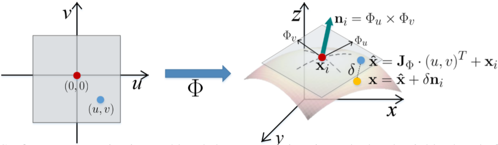
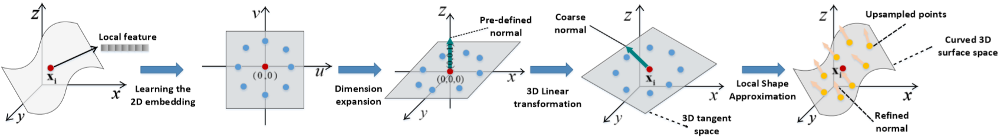
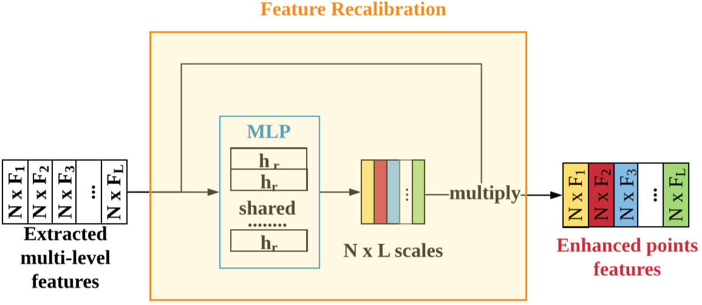

# PUGeo


```shell
docker run --runtime=nvidia --rm -it -w /home -v /home/duan/windows/udata:/home/data/ -v /tmp/.X11-unix:/tmp/.X11-unix -e DISPLAY=unix$DISPLAY -e GDK_SCALE -e GDK_DPI_SCALE tensorflow/tensorflow:1.13.2-gpu

docker commit -p 5550435f968f tensorflow/tensorflow:1.13.2-gpu
```


```
python main.py --phase test --up_ratio 4 --pretrained PUGeo_x4/model/model-final --eval_xyz input-thing10k

python main.py --phase test --up_ratio 4 --pretrained PUGeo_x4/model/model-final --eval_xyz input-thing10k/xyz-fps

```


## error

**cannot find -ltensorflow_framework**

```
In my cae, the tensorflow_framework library file's name was not libtensorflow_framework.so but libtensorflow_framework.so.1. The tensorflow version is 1.14.0.

I just made symbolic link for it and the problem has gone.

$ cd /usr/local/lib/python2.7/dist-packages/tensorflow/
$ ln -s libtensorflow_framework.so.1 libtensorflow_framework.so

```


**编译后，无法load库**

```error
_ZN10tensorflow12OpDefBuilder5InputENSt7__cxx1112basic_stringIcSt11char_traitsIcESaIcEEE
```


将原始sh文件

```sh
#/bin/bash
CUDA=/usr/local/cuda-10.0
TF=$(python -c 'import tensorflow as tf; print(tf.sysconfig.get_lib())')

$CUDA/bin/nvcc -std=c++11 -c -o tf_sampling_g.cu.o tf_sampling_g.cu -O2 -DGOOGLE_CUDA=1 -x cu -Xcompiler -fPIC

g++ -std=c++11 tf_sampling.cpp tf_sampling_g.cu.o -o tf_sampling_so.so -shared -fPIC -I $TF/include -I $CUDA/include -I $TF/include/external/nsync/public -lcudart -L $CUDA/lib64/ -L $TF -ltensorflow_framework -O2 #-D_GLIBCXX_USE_CXX11_ABI=0
```

替换为下列sh文件

```sh
#!/usr/bin/env bash
CUDA=/usr/local/cuda-10.0
TF_INC=$(python -c 'import tensorflow as tf; print(tf.sysconfig.get_include())')
TF_LIB=$(python -c 'import tensorflow as tf; print(tf.sysconfig.get_lib())')

$CUDA/bin/nvcc tf_sampling_g.cu -o tf_sampling_g.cu.o -c -O2 -DGOOGLE_CUDA=1 -x cu -Xcompiler -fPIC

# TF1.13
g++ -std=c++11 tf_sampling.cpp tf_sampling_g.cu.o -o tf_sampling_so.so -shared -fPIC -I $TF_INC -I $CUDA/include -I $TF_INC/external/nsync/public -lcudart -L $CUDA/lib64/ -L$TF_LIB -ltensorflow_framework -O2 -D_GLIBCXX_USE_CXX11_ABI=0
```


将原始sh文件

```sh
#!/bin/bash

CUDA=/usr/local/cuda-10.0
TF=$(python -c 'import tensorflow as tf; print(tf.sysconfig.get_lib())')


$CUDA/bin/nvcc -D_GLIBCXX_USE_CXX11_ABI=0 -std=c++11 -c -o tf_nndistance_g.cu.o tf_nndistance_g.cu -I $TF/include -DGOOGLE_CUDA=1 -x cu -Xcompiler -fPIC -O2

g++ -std=c++11 tf_nndistance.cpp tf_nndistance_g.cu.o -o tf_nndistance_so.so -shared -fPIC -I $TF/include -lcudart -L $CUDA/lib64 -O2 -I $TF/include/external/nsync/public -L $TF -ltensorflow_framework
```

替换为下列sh文件

```sh
#!/usr/bin/env bash
CUDA=/usr/local/cuda-10.0
TF_INC=$(python -c 'import tensorflow as tf; print(tf.sysconfig.get_include())')
TF_LIB=$(python -c 'import tensorflow as tf; print(tf.sysconfig.get_lib())')

$CUDA/bin/nvcc -D_GLIBCXX_USE_CXX11_ABI=0 -std=c++11 -c -o tf_nndistance_g.cu.o tf_nndistance_g.cu -I $TF_INC -DGOOGLE_CUDA=1 -x cu -Xcompiler -fPIC -O2

# TF1.13
g++ -std=c++11 tf_nndistance.cpp tf_nndistance_g.cu.o -o tf_nndistance_so.so -shared -fPIC -I $TF_INC -I $CUDA/include -I $TF_INC/external/nsync/public -lcudart -L $CUDA/lib64/ -L$TF_LIB -ltensorflow_framework -O2 -D_GLIBCXX_USE_CXX11_ABI=0
```


如果还不行

查看tensorflow版本 1.14.0不支持1.13.2支持


# PUGeo-Net

A Geometry-centric Network for 3D Point Cloud Upsampling


## Abstract

This paper addresses the problem of generating uniform dense point clouds to describe the underlying geometric structures from given sparse point clouds. Due to the irregular and unordered nature, point cloud densification as a generative task is challenging. To tackle the challenge, we propose a novel deep neural network based method, called PUGeo-Net, that incorporates **discrete differential geometry** into deep learning elegantly,making it fundamentally different from the existing deep learning methods that are largely motivated by the image super-resolution techniques and generate new points in the abstract feature space.    本文解决了生成均匀的密集点云以描述给定稀疏点云的基本几何结构的问题。由于不规则和无序的性质，将点云致密化作为一项生成任务具有挑战性。为了解决这一挑战，我们提出了一种新颖的基于深度神经网络的方法，称为PUGeo-Net，该方法很好地融合了**离散微分几何学**，完全不同于现有的深度学习方法，而**现有的深度学习方法主要受图像超分辨率技术的启发**，并**在抽象特征空间中生成了新的点**。

Specifically, our method learns the first and second fundamental forms, which are able to fully represent the local geometry unique up to rigid motion. We encode the first fundamental form in a 3×3 linear transformation matrix T for each input point. Such a matrix approximates the augmented Jacobian matrix of a local parameterization that encodes the intrinsic information and builds a one-to-one correspondence between the 2D parametric domain and the 3D tangent plane, so that we can lift the adaptively distributed 2D samples (which are also learned from data) to 3D space. 具体来说，我们的方法学习的是第一和第二基本形式，它们能够完全表示局部几何形状，唯一除刚体运动外。我们为每个输入点在 3×3 线性变换矩阵 T 中编码第一个基本形式。这样的矩阵近似于局部参数化的增强雅可比矩阵，该矩阵对固有信息进行编码，并在 2D 参数域和 3D 切线平面之间建立一一对应的关系，这样我们就可以提起自适应分布的 2D 样本（ 也从数据中学到）到 3D 空间。

After that, we use the learned second fundamental form to compute a normal displacement for each generated sample and project it to the curved surface. As a by-product, PUGeo-Net can compute normals for the original and generated points, which is highly desired the surface reconstruction algorithms. We interpret PUGeo-Net using the **local theory of surfaces** in differential geometry, which is also confirmed by quantitative verification. 之后，我们使用学习到的第二个基本形式为每个生成的样本计算法向位移，并将其投影到曲面上。作为副产品，PUGeo-Net可以计算原始点和生成点的法线，这是曲面重建算法的极高要求。 我们使用微分几何中的**局部表面理论**解释PUGeo-Net，该理论也通过定量验证得到证实。

We evaluate PUGeo-Net on a wide range of 3D models with sharp features and rich geometric details and observe that PUGeo-Net, the first neural network that can jointly generate vertex coordinates and normals, consistently outperforms the state-ofthe-art in terms of accuracy and efficiency for upsampling factor 4 ∼ 16. In addition, PUGeo-Net can handle noisy and non-uniformly distributed inputs well, validating its robustness. 我们在具有清晰特征和丰富几何细节的各种3D模型中对PUGeo-Net进行了评估，并观察到PUGeo-Net是可以共同生成顶点坐标和法线的第一个神经网络，并且在4和16的上采样因子的准确性和效率方面始终优于最新技术。此外，PUGeo-Net可以很好地处理嘈杂和非均匀分布的输入，从而验证了其鲁棒性。


## 1. Introduction

Three-dimensional (3D) point clouds, as the raw representation of 3D data, are used in a wide range of applications, such as 3D immersive telepresence [2], 3D city reconstruction [3], [4], cultural heritage reconstruction [5], [6], geophysical information systems [7], [8], autonomous driving [9], [10], simultaneous localization and mapping [11], [12], and virtual/augmented reality [13], [14], just to name a few. Though recent years have witnessed great progress on the 3D sensing technology [15], [16], **it is still costly and time-consuming to obtain dense and highly detailed point clouds**, which are beneficial to the subsequent applications. Therefore, amendment is required to speed up the deployment of such data modality. In this paper, instead of relying on the development of hardware, we are interested in the problem of computational based point cloud upsampling: given a sparse, low-resolution point cloud, generate a uniform and densepointcloudwithatypicalcomputationalmethodtofaithfullyrepresenttheunderlying surface. Since the problem is the 3D counterpart of image super-resolution [17], [18], a typical idea is to borrow the powerful techniques from the image processing community. However, due to the unordered and irregular nature of point clouds, such an extension is far from trivial, especially when the underlying surface has complex geometry. 

三维（3D）点云作为3D数据的原始表示形式，被广泛用于各种应用中，例如3D沉浸式远程呈现[2]，3D城市重建[3]，[4]，文化遗产重建[5]，[6]，地球物理信息系统[7]，[8]，自动驾驶[9]，[10]，同时定位和地图绘制[11]，[12]和虚拟/增强现实[13]，[14]，仅举几例。尽管近年来见证了3D传感技术的巨大进步[15]，[16]，**但获得密集且高度详细的点云仍然是昂贵且费时的**，这对后续的应用是有利的。 因此，需要进行修改以加快此类数据模式的部署。在本文中，我们不依赖于硬件的发展，而是对基于计算的点云上采样问题感兴趣：给定稀疏，低分辨率的点云，生成具有非典型计算方法的均匀且密集的点云，可以忠实地表示其下表面。 由于问题是图像超分辨率的3D对应物[17]，[18]，因此典型的想法是从图像处理社区借用强大的技术。但是，由于点云的无序和不规则性质，这种扩展绝非易事，尤其是在下表面的曲面具有复杂几何形状的情况下。

​	Theexistingmethodsforpointcloudupsamplingcanberoughlyclassifiedintotwo categories: optimization-based methods and deep learning based methods. The optimization methods [19], [20], [21], [22], [23] usually fit local geometry and work well for smooth surfaces with less features. However, these methods struggle with multiscale structure preservation. 现有的针对点云向上采样的方法可以大致分为两类：基于优化的方法和基于深度学习的方法。优化方法[19]，[20]，[21]，[22]，[23]通常适合局部几何形状，并且对于具有较少特征的光滑表面效果很好。但是，这些方法在多尺度结构保存方面遇到了困难。

​	The deep learning methods can effectively learn structures from data. Representative methods are PU-Net [24], EC-Net [25] and MPU [26]. PUNet extracts multi-scale features using point cloud convolution [27] and then expands the features by replication. With additional edge and surface annotations, EC-Net improves PU-Net by restoring sharp features. Inspired by image super-resolution, MPU upsamples points in a progressive manner, where each step focuses on a different level of detail. PU-Net, EC-Net and MPU operate on patch level, therefore, they can handlehigh-resolutionpointsets.Thoughthedeeplearningmethodsproducebetterresults than the optimization based methods, they are heavily motivated by the techniques in the image domain and takes little consideration of the geometries of the input shape. As a result, various artifacts can be observed in their results. It is also worth noting thatalltheexistingdeeplearningmethodsgeneratepointsonly,noneofthemisable to estimate the normals of the original and generated points. 

​	深度学习方法可以有效地从数据中学习结构。代表性方法是PU-Net[24]，EC-Net[25]和MPU[26]。PUNet使用点云卷积提取多尺度特征[27]，然后通过复制扩展特征。EC-Net通过附加的边缘和表面注释恢复清晰的特征来改进PU-Net。受图像超分辨率的启发，MPU以渐进方式对点进行上采样，其中每个步骤专注于不同级别的细节。PU-Net，EC-Net和MPU在patch程序级别上运行，因此它们可以处理高分辨率点集。尽管深度学习方法比基于优化的方法产生更好的结果，但它们在图像域中的技术具有很大的动力，并且很少考虑输入的几何形状。 结果，可以在其结果中观察到各种伪像。还值得注意的是，所有现有的学习方法都只能生成点，无法估计原始点和生成点的**法线**。


**Fig. 1** 5,000个点的Retheur雕像模型的各种采样因子。由于输入的分辨率较低，因此缺少细节，例如皱纹和面部特征。PUGeo-Net可以有效地生成多达16x(即16倍)个点，以填补缺失的部分。 

In this paper, we propose a novel network, called PUGeo-Net, to overcome the limitations in the existing deep learning methods. Our method learns a local parameterization for each point and its normal direction. In contrast to the existing neural network based methods that generate new points in the abstract feature space and map the samples to the surface using decoder,PUGeo-Net performs the sampling operations in a pure geometric way. 在本文中，我们提出了一种新颖的网络，称为PUGeo-Net，以克服现有深度学习方法的局限性。 我们的方法为每个点及其法线方向学习局部参数化。与现有的基于神经网络的方法不同，该方法在抽象特征空间中生成新点并使用解码器将样本映射到表面，而PUGeo-Net则以**纯几何方式**执行采样操作。

Specifically, it first generates the samples in the 2D parametric domain and then lifts them to 3D space using a linear transformation. Finally, it projects the points on the tangent plane onto the curved surface by computing a normal displacement for each generated point via the learned second fundamental form. Through extensive evaluation on commonly used as well as new metrics, we show that PUGeo-Net consistently outperforms the state-of-the-art in terms of accuracy and efficiency for upsampling factors 4 ∼ 16×. It is also worth noting that PUGeo-Net is the first neural network that can generate dense point clouds with accurate normals, which are highly desired by the existing surface reconstruction algorithms. We demonstratetheefficacyofPUGeo-NetonbothCADmodelswithsharpfeaturesandscanned models with rich geometric details and complex topologies. Fig. 1 demonstrates the effectiveness of PUGeo-Net on the Retheur Statue model. 具体来说，它首先在2D参数域中生成样本，然后使用**线性变换**将其提升到3D空间。 最后，它为每个通过学习到的第二基本形式生成的点计算**法向位移**，从而将切线平面上的点投影到曲面上。 通过对常用和新指标的广泛评估，我们发现PUGeo-Net在4到16倍上采样因子的准确性和效率方面始终优于最新技术。 还值得注意的是，PUGeo-Net是第一个可以生成具有**精确法线**的密集点云的神经网络，这是现有**表面重建算法**所高度期望的。我们演示了具有鲜明特征和扫描模型的PUGeo-NetonCAD模型的有效性，这些模型具有丰富的几何细节和复杂的拓扑结构。 图1展示了PUGeo-Net在Retheur雕像模型上的有效性。


The main contributions of this paper are summarized as follows. 

1. We propose PUGeo-Net, a novel geometric-centric neural network, which carries out a sequence of geometric operations, such as computing **the first-order approximation of local parameterization**, adaptive sampling in the parametric domain, lifting the samples to the **tangent plane**, and projection to the **curved surface**. 
2. PUGeo-Net is the first upsampling network that can jointly generate coordinates and normals for the densified point clouds. The normals benefit many downstream applications, such as surface reconstruction and shape analysis. 
3. WeinterpretPUGeo-Net using the local theory of surfaces in differential geometry. Quantitative verification confirms our interpretation. 
4. We evaluate PUGeo-Net on both synthetic and real-world models and show that PUGeo-Net significantly outperforms the state-of-the-art methods in terms of accuracy and efficiency for all upsampling factors. 
5. PUGeo-Netcanhandlenoisyandnon-uniformlydistributedpointcloudsaswellas the real scanned data by the LiDAR sensor very well, validating its robustness and practicality. 

本文的主要贡献概述如下。

1. 我们提出一种新颖的以几何为中心的神经网络PUGeo-Net，它执行一系列的几何运算，例如计算**局部参数化的一阶近似**，在参数域中进行自适应采样，将样本提升到**切线平面**，并投影到**曲面**。

      2. PUGeo-Net是第一个可以共同为密集的点云生成**坐标和法线**的上采样网络。 法线有益于许多下游应用程序，例如表面重建和形状分析。
      3. 我们使用微分几何中的**局部表面理论**解释PUGeo-Net。 定量验证证实了我们的解释。

      4. 我们在综合模型和真实模型上都对PUGeo-Net进行了评估，结果表明，在所有上采样因素的准确性和效率方面，PUGeo-Net均明显优于最新方法。
      5. PUGeo-Net可以处理激光和非均匀分布的点云以及LiDAR传感器的真实扫描数据，很好地验证了其鲁棒性和实用性。


## Related Work

### Optimization based methods. 

​	Alexaetal.[19]interpolatedpointsofVoronoidiagram, which is computed in the local tangent space. Lipman et al. developed a method based on locally optimal projection operator (LOP) [20]. It is a parametrization-free method for point resampling and surface reconstruction. Subsequently, the improved weighted LOP and continuous LOP were developed by Huang et al. [21] and Preiner et al. [22] respectively. These methods assume that points are sampling from smooth surfaces, which degrades upsampling quality towards sharp edges and corners. Huang et al. [23] presented an edge-aware (EAR) approach which can effectively preserve the sharp features.Withgiven normalinformation, EARalgorithm first resamplespoints away from edges, then progressively upsamples points to approach the edge singularities. However, the performance of EAR heavily depends on the given normal information and parameter tuning. In conclusion, point cloud upsampling methods based on geometric priors either assume insufficient hypotheses or require additional attributes. 脉络图的内插点，是在局部切线空间中计算的。 利普曼（Lipman）等人。 开发了一种基于局部最优投影算子（LOP）的方法[20]。 它是用于点重采样和曲面重建的无参数化方法。 随后，由Huang等人开发了改进的加权LOP和连续LOP[21]和Preiner等。  [22]分别将这些方法假定从平滑表面采样点，这会降低朝锐利边缘和角落的向上采样质量。 黄等[23]提出了一种边缘感知（EAR）方法，该方法可以有效地保留锐利特征。在具有正常信息的情况下，EAR算法首先对远离边缘的点进行重采样，然后逐步对这些点进行上采样以逼近边缘奇异点。 但是，EAR的性能在很大程度上取决于给定的常规信息和参数调整。 总之，基于几何先验的点云上采样方法要么假设假设不充分，要么需要其他属性。


### Deep learning based methods. 

The deep learning based upsampling methods first extract point-wise feature via point clouds CNN. The lack of point order and regular structure impede the extension of powerful CNN to point clouds. Instead of converting point clouds to other data representations like volumetric grids [28], [29], [30] or graphs [31], [32], recently the point-wise 3D CNN [33], [34], [27], [35], [36] successfully achieved state-of-the-art performance for various tasks. 基于深度学习的上采样方法首先通过点云CNN提取点状特征。点顺序和规则结构的缺乏阻碍了强大的CNN向点云的扩展。与其将点云转换为体积网格[28]，[29]，[30]或图形[31]，[32]等其他数据表示，不如将其逐点3D CNN [33]，[34]，[27]  ]，[35]，[36]成功实现了各种任务的最先进性能。  


​	Yu等首创的PU-Net [24]，第一种深度学习算法，用于点云上采样。 它采用PointNet ++ [27]提取点特征，并通过多分支MLP扩展特征。它优化了联合重建和排斥力损失函数，以生成具有均匀密度的点云。PU-Net超越了基于点云上采样的先前优化方法。 但是，由于没有考虑**点之间的空间关系**，因此**不**能保证生成的样本是**均匀**的。 

​	后续工作EC-Net [25]采用了**点到边距离的共同损失**，可以有效保留**锋利的边缘**。EC-Net要求用带注释的边缘和表面信息标记训练数据，这很**繁琐**。 

​	Wang等[26]提出了一种基于补丁的渐进式上采样方法（MPU）。他们的方法可以成功地应用于较大的上采样因子，例如16x。在图像超分辨率技术的启发下，他们训练了一系列的向上采样网络，逐步将其停止采样，直至达到所需的因子，并且仅以2×case的子网进行交易。MPU通过附加1Dcode$ {−1,1}$来复制点方向特征和副测试，而这并**不考虑局部几何结构**。MPU需要仔细的**逐步培训**，这**不**是**灵活**的，并且无法直接获得较大的上采样因子模型。 由于每个子网将模型放大2倍，因此MPU仅适用于2的幂的升采样系数。

​	PUGeoNet以几何为中心的性质将其与其他深度学习方法区分开。有关量化比较和详细讨论，请参见第4节。

​	[51]提出了PU-GAN，它引入了对抗框架来训练升采样发生器。 同样，PU-GAN无法**检查点云的几何特性**。他们的消融研究也证明了性能的提高主要来自鉴别器的引入。


## 3. Proposed Method

### 3.1. Motivation&Overview

给定一个稀疏点云 $\mathcal{X}=\left\{\mathbf{x}_{i} \in \mathbb{R}^{3 \times 1}\right\}_{i=1}^{M}$ 且有 $M$ 个点，并且用户指定了上采样因子 $R$，我们的目标是生成一个密集的，均匀分布的点云 $\mathcal{X}_{R}=\left\{\mathbf{x}_{i}^{r} \in \mathbb{R}^{3 \times 1}\right\}_{i, r=1}^{M, R}$，它包含更多的几何细节，并且可以很好地近似下表面。 与其他基于patch的方法类似，我们首先通过最远点采样算法在顶部的patch中对输入的稀疏点云进行分区，每个patch都有 $N$ 个点，并且PUGeo-Net分别处理patch。

​	如上所述，现有的基于深度学习的方法在很大程度上依赖于2D图像领域的技术，该技术通过**在抽象特征空间中复制特征向量**来生成新样本，从而限制了性能。此外，由于对**形状几何的较少考虑**，它们都无法计算法线，从而无法在表面重建。相反，我们的方法受到基于参数化的表面重采样的激励，包括3个步骤：**首先将3D表面 $S$ 参数化为2D域，然后在参数域中进行采样，最后将2D样本映射到3D表面**。 众所周知，参数化技术在很大程度上取决于表面的拓扑。参数化有两种类型，即**局部参数化和全局参数化**。前者使用拓扑盘（即，具有1个边界的 genus-0 曲面）[38]。 后者通过计算规范的同源性在任意拓扑的表面上工作，通过该基础切入映射到2D域的非拓扑磁盘[39]。为了确保参数在切割过程中是连续的，需要全局约束[37]。

在我们的论文中，输入是从任意几何形状和拓扑结构的3D表面采样的点云。局部表面理论**Local Theory of Surfaces**的基本定理指出，可以由第二个基本的基本形式，规则表面的一个点的局部邻域可以完全被第一和第二基本形式所确定，唯一（unique）不考虑（up to）刚体运动下。因此，避免计算和学习昂贵的全局参数化，我们的关键思想是为每个点学习局部参数化。




**Fig. 2** 表面参数化和局部形状近似。通过可微映射 $\boldsymbol{\Phi}: \mathbb{R}^{2} \rightarrow \mathbb{R}^{3}$ 将 $\mathbf{x_i}$ 的局部邻域参数化为2D矩形域 。雅可比矩阵 $\mathbf{J}_{\Phi}(0,0)$ 提供 $\mathbf{x_i}$ 的最佳线性逼近 $\boldsymbol{\Phi}$，它将 $(u,v)$ 映射到 $\mathbf{x_i}$ 的切平面上的点 $\hat{\mathbf{x}}$。此外，使用 $\mathbf{x_i}$ 的主曲率，我们可以以二阶精度重建 $\mathbf{x_i}$ 的局部几何形状。


让我们通过微分映射 $\boldsymbol{\Phi}: \mathbb{R}^{2} \rightarrow \mathbb{R}^{3}$ 将点 $\mathbf{x_i}$ 的局部邻域参数化为2D域，以使 $\Phi(0,0)=\mathbf{x}_{i}$（见图2）。 雅可比矩阵 $\mathbf{J}_{\Phi}=\left[\Phi_{u}, \Phi_{v}\right]$ 提供映射 $\boldsymbol{\Phi}$ 的最佳一阶近似：$\boldsymbol{\Phi}:(u, v) = \Phi(0,0)+\left[\boldsymbol{\Phi}_{u}, \boldsymbol{\Phi}_{v}\right] \cdot(u, v)^{\top}+O\left(u^{2}+v^{2}\right)$，其中 $\Phi_{u}$ 和 $\Phi_{v}$ 是切线向量，它们定义了**第一基本形式**。点 $\mathbf{x_i}$ 的法线可以通过叉积 $\mathbf{n}_{i}=\Phi_{u}(0,0) \times \Phi_{v}(0,0)$ 来计算。


容易验证点 $\hat{\mathbf{x}} \triangleq \mathbf{x}_{i}+\mathbf{J}_{\Phi} \cdot(u, v)^{\top}$ 在 $\mathbf{x_i}$ 的切平面上，因为 $\left(\hat{\mathbf{x}}-\mathbf{x}_{i}\right) \cdot \mathbf{n}_{i}=0$。在我们的方法中，我们使用增强的雅可比矩阵 $\mathbf{T}=\left[\mathbf{\Phi}_{u}, \mathbf{\Phi}_{v}, \mathbf{\Phi}_{u} \times \mathbf{\Phi}_{v}\right]$ 来计算法线 $\mathbf{n}_{i}=\mathbf{T} \cdot(0,0,1)^{\top}$ 和点$\hat{\mathbf{x}} = \mathbf{x}_{i}+\mathbf{T} \cdot(u, v, 0)^{\top}$。如果表面在 $\mathbf{x_i}$ 处规则，则矩阵 $\mathbf{T}$ 为满秩；且 $\mathbf{x}$ 和 $\hat{\mathbf{x}}$ 的距离是
$$
\|\mathrm{x}-\hat{\mathrm{x}}\|=\frac{\kappa_{1} u^{2}+\kappa_{2} v^{2}}{2}+O\left(u^{3}+v^{3}\right)
$$
其中 $\kappa_{1}$ 和 $\kappa_{2}$ 是$\Phi(0,0)$ 的基本曲率，它们是**第二基本形式的特征值**。

如图3.a所示，给定输入稀疏3D点云，PUGeo-Net进行如下操作：首先在2D参数域中生成新样本$\left\{\left(u_{i}^{r}, v_{i}^{r}\right)\right\}_{r=1}^{R}$ 。 然后计算法线 $\mathbf{n}_{i}=\mathbf{T}_{i} \cdot(0,0,1)^{\top}$。 之后，它将每个生成的2D样本 $\left(u_{i}, v_{i}\right)$ 通过 $\widehat{\mathbf{x}}_{i}^{r}=\mathbf{T}_{i} \cdot\left(u_{i}^{r}, v_{i}^{r}, 0\right)^{\top}+\mathbf{x}_{i}$ 映射到 $\mathbf{x_i}$ 的切平面。 最后，通过计算沿法线方向的位移 $\delta_{i}^{r}$，将 $\widehat{\mathbf{x}}_{i}^{r}$ 投影到弯曲的3D表面。 图3.b 说明了PUGeo-Net的网络架构，它由分层特征提取和重新校准（第3.2节），基于参数化的点扩展（第3.3节）和局部形状近似（第3.4节）组成。我们采用联合损失函数来指导顶点坐标和法线的预测（第3.5节）。




**Fig. 3(a)**  PUGeo-Net的阶段：学习局部参数化，点扩展，顶点坐标和法线修正。


**Fig. 3(b)** 显示了PUGeo-Net的端到端网络结构。输出以红色显示。


### 3.2 Hierarchical Feature Learning and Recalibration 

​	为了处理3D点云的旋转不变性挑战，我们采用类似STN的小型网络[40]，该网络计算适用于所有点的全局3D变换矩阵 $\mathbf{A} \in \mathbb{R}^{3 \times 3}$。之后，我们应用DGCNN点云分类和分割的the-state-of-the-art最新方法来提取点分级特征，能够对输入patch的局部和全局固有几何信息进行编码。

​	分层特征学习模块从低层到高层提取特征。直观地讲，随着感受野的增加，残差连接是2D视觉任务中广泛使用的一种用于提高特征质量和收敛速度的技术，可以帮助保留各个级别的细节。为此，如图3（c）所示，与其直接组合所获得的特征，不如通过 **self-gating** 自控单元对特征进行重新校准以增强它们，这在计算上是有效的。



**Fig. 3(c)**   特征重校准


​	令 $\mathbf{c}_{i}^{l} \in \mathbb{R}^{F_{l} \times 1}$ 成为第 $l$ 层上的点 $\mathbf{x}_i$ 的提取特征 $(l=1, \cdots, L)$，其中 $F_l$ 是特征长度。我们首先串联所有 $L$ 层的特征，即 $\widehat{\mathbf{c}}_{i}=\operatorname{Concat}\left(\mathbf{c}_{i}^{1}, \cdots, \mathbf{c}_{i}^{L}\right) \in \mathbb{R}^{F}$，其中 $F=\sum_{l=1}^{L} F_{l}$ 并且 $Concat(·)$ 代表串联算子。将直接串联特征传递给一个小的MLP $hr(·)$ ，以获得对数 $\mathbf{a}_{i}=\left(a_{i}^{1}, a_{i}^{2}, \ldots, a_{i}^{L}\right)$，即
$$
\mathbf{a}_i = h_r(\hat{\mathbf{c}_i}) \tag{1}
$$
​	将其进一步馈送到softmax层以产生重校准权重 $\mathbf{w}_{i}=\left(w_{i}^{1}, w_{i}^{2}, \ldots, w_{i}^{L}\right)$
$$
w_{i}^{l}=e^{a_{i}^{l}} / \sum_{k=1}^{L} e^{a_{i}^{k}}
$$
​	最后，将经过校正的多尺度特征表示为加权级联：
$$
\mathbf{c}_{i}=\operatorname{Concat}\left(w_{i}^{1} \cdot \mathbf{c}_{i}^{1}, w_{i}^{2} \cdot \mathbf{c}_{i}^{2}, \cdots, \hat{a}_{i}^{L} \cdot \mathbf{c}_{i}^{L}\right) \tag{3}
$$


### 3.3 Parameterization-based Point Expansion 

在此模块中，我们将通过回归获得的多尺度特征 来扩展输入稀疏点云 $R$ 次，以生成粗糙的稠密点云以及相应的粗糙法线。具体而言，扩展过程包括两个步骤，即学习2D参数域中的自适应采样，然后通过学习的**线性变换**将其投影到3D切线空间上。


**Fig. 3(d)**   点扩展

#### 3.3.1. Adaptive sampling in the 2D parametric domain 二维参数域中自适应采样

对于每个点 $\mathbf{x}_i$ ，将MLP $f_1(·)$ 应用于其局部表面特征 $\mathbf{c}_i$，以重构 $R$ 个采样点的二维坐标$\left(u_{i}^{r}, v_{i}^{r}\right)$，即
$$
\left\{\left(u_{i}^{r}, v_{i}^{r}\right) \mid r=1,2, \cdots, R\right\}=f_{1}\left(\mathbf{c}_{i}\right) \tag{4}
$$
​	借助于其以 $\mathbf{c}_i$ 编码的局部表面信息，可以预期，自调整的2D参数域会最大化下表面的均匀性。

**Remark.**   

​	我们的采样策略从根本上不同于现有的深度学习方法。PU-Net通过**复制**特征空间中的**特征**来生成新样本，并将复制的特征馈入独立的多分支MLP中。它采用了额外的斥力损耗来规范生成点的均匀性。MPU还复制**特征空间中的特征**。它按顺序将附加的代码+1和-1附加到重复的特征副本以将它们分开。不论是PU-Net还是MPU都不考虑**生成的点之间的空间相关性**。相比之下，**我们的方法是在2D参数域中扩展点，然后将其提升到切线平面，从而以几何为中心的方式。**通过在网格参数化意义上看问题，我们还可以将在MPU中添加一维代码视为1D参数域。此外，还通过其他基于学习的方法来处理3D点云，例如，FoldingNet [46]，PPF-FoldNet [47]和PCN [48]，也使用了预定义的2D规则网格。尽管预先定义的2D网格规则地分布在2D域中，但这并不意味着转换后的点**均匀地**分布在3D物体下表面上。


#### 3.3.2. Prediction of the linear transformation 线性变换预测

对于每个点 $\mathbf{x}_i$ ，我们还根据局部表面特征 $\mathbf{c}_i$ 预测线性变换矩阵 $\mathbf{T}_{i} \in \mathbb{R}^{3 \times 3}$，即
$$
\mathbf{T}_{i}=f_{2}\left(\mathbf{c}_{i}\right)\tag{5}
$$
其中 $f_2(·)$ 表示MLP。 将 $\mathbf{T}_{i}$ 乘以先前学习的2D样本 $\left\{\left(u_{i}^{r}, v_{i}^{r}\right)\right\}_{r=1}^{R}$可将点提升到 $\mathbf{x}_i$ 的切平面
$$
\widehat{\mathbf{x}}_{i}^{r}=\left(\widehat{x}_{i}^{r}, \widehat{y}_{i}^{r}, \widehat{z}_{i}^{r}\right)^{\top}=\mathbf{T}_{i} \cdot\left(u_{i}^{r}, v_{i}^{r}, 0\right)^{\top}+\mathbf{x}_{i} \tag{6}
$$


#### 3.3.3. Prediction of the coarse normal 粗法线预测

如前所述，点的法线在曲面重建中起关键作用。在这个模块中，我们首先估计一个粗法线，即每个输入点的切平面的法线  $\mathbf{n}_{i} \in \mathbb{R}^{3 \times 1}$，该值由输入点上的所有点共享。 具体来说，我们将线性变换矩阵 $\mathbf{T}_{i}$ 与垂直于2D参数域的预定法线$(0,0,1)$相乘：
$$
\mathbf{n}_{i}=\mathbf{T}_{i} \cdot(0,0,1)^{\top} \tag{7}
$$

---

### 3.4. Updating Samples via Local Shape Approximation 通过局部形状近似更新样本

​	由于样本 $\widehat{\mathcal{X}}_{R}=\left\{\widehat{\mathbf{x}}_{i}^{r}\right\}_{i, r=1}^{M, R}$ 在切平面上，因此我们需要将它们扭曲到曲面上并更新其法线。具体来说，我们将每个样本 $\widehat{\mathbf{x}}_{i}^{r}$ 沿着法线 $\mathbf{n}_i$ 沿 $\delta_{i}^{r}=\frac{\kappa_{1}\left(u_{i}^{r}\right)^{2}+\kappa_{2}\left(v_{i}^{r}\right)^{2}}{2}$ 的距离移动。如节3.1所述，该距离提供了 $\mathbf{x}_i$ 的局部几何的二阶近似值。我们通过对与其粗坐标相连的点状特征进行回归来计算距离$\delta_{i}^{r}$，即
$$
\delta_{i}^{r}=f_{3}\left(\operatorname{Concat}\left(\widehat{\mathbf{x}}_{i}^{r}, \mathbf{c}_{i}\right)\right) \tag{8}
$$
其中 $f_3(·)$ 用于MLP的处理。然后我们将样本坐标计算为
$$
\mathbf{x}_{i}^{r}=\left(x_{i}^{r}, y_{i}^{r}, z_{i}^{r}\right)^{\mathrm{T}}=\widehat{\mathbf{x}}_{i}^{r}+\mathbf{T}_{i} \cdot\left(0,0, \delta_{i}^{r}\right)^{\mathrm{T}}
$$
我们以类似的方式更新法线：将点 $\mathbf{x}_{i}^{r}$ 的法线偏移 $\mathbf{n}_{i}^{r} \in \mathbb{R}^{3\times1}$ 回归为
$$
\Delta \mathbf{n}_{i}^{r}=f_{4}\left(\operatorname{Concat}\left(\widehat{\mathbf{x}}_{i}^{r}, \mathbf{c}_{i}\right)\right)
$$
进一步添加到相应的粗法线中，导致
$$
\mathbf{n}_{i}^{r}=\Delta \mathbf{n}_{i}^{r}+\mathbf{n}_{i}
$$
其中 $f_4(·)$ 用于MLP的处理。


### 3.5 Joint Loss Optimization 

As PUGeo-Net aims to deal with the regression of both coordinates and unoriented normals of points, we design a joint loss to train it end-to-end. Specifically, let YR = {yk}RM k=1 with RM points be the groundtruth of XR. During training, we adopt the Chamfer distance (CD) to measure the coordinate error between theXR andYR, i.e.,

由于PUGeo-Net旨在处理点的坐标和未定向法线的回归，因此我们设计了一个联合损失来端到端对其进行训练。 具体来说，令YR = {yk} RM k = 1且RM点为XR的底线。 在训练过程中，我们采用倒角距离（CD）来测量XR和YR之间的坐标误差，即


$$
L_{C D}=\frac{1}{R M}\left(\sum_{\mathbf{x}_{i}^{r} \in \mathcal{X}_{R}}\left\|\mathbf{x}_{i}^{r}-\phi\left(\mathbf{x}_{i}^{r}\right)\right\|_{2}+\sum_{\mathbf{y}_{k} \in \mathcal{Y}_{R}}\left\|\mathbf{y}_{k}-\psi\left(\mathbf{y}_{k}\right)\right\|_{2}\right)
$$
where φ(xr i) = argminyk∈YR kxr i −ykk2,ψ(yk) = argminxr i∈XR kxr i −ykk2, and k·k2 is the `2 norm of a vector. For the normal part, denote e N = {e ni}M i=1 and NR = {nk}RM k=1 the ground truth of the coarse normalN and the accurate normalNR, respectively. During training, we consider the errors betweenN and e N and betweenNR andNR simultaneously, i.e., 其中φ（xr i）=argminyk∈YRkxr i -ykk2，ψ（yk）= argminxri∈XRkxr i -ykk2，而k·k2是向量的2范数。 对于法线部分，分别表示e N = {e ni} M i = 1和NR = {nk} RM k = 1，分别是粗法线N和精确法线NR的基本事实。 在训练过程中，我们同时考虑了N和e N之间以及NR和NR之间的误差，即
$$
L_{\text {coarse }}(\mathcal{N}, \tilde{\mathcal{N}})=\sum_{i=1}^{M} L\left(\mathbf{n}_{i}, \widetilde{\mathbf{n}}_{i}\right), L_{\text {refined }}\left(\mathcal{N}_{R}, \overline{\mathcal{N}}_{R}\right)=\sum_{i=1}^{M} \sum_{r=1}^{R} L\left(\mathbf{n}_{i}^{r}, \overline{\mathbf{n}}_{\phi\left(\mathbf{x}_{i}^{r}\right)}\right)
$$
whereL(ni, ˜ ni) = maxkni − ˜ nik2 2,kni + ˜ nik2 2	measurestheunorienteddifferencebetween two normals, and φ(·) is used to build the unknown correspondence between NR andNR. Finally, the joint loss function is written as 其中L（ni，〜ni）= max kni-〜nik2 2，kni +〜nik2 2测量两个法线之间的无方向性差异，而φ（·）用于建立NR和NR之间的未知对应关系。 最后，关节损失函数写为
$$
L_{\text {total }}=\alpha L_{C D}+\beta L_{\text {coarse }}+\gamma L_{\text {refined }}
$$
where α, β,and γ arethreepositiveparameters.Itisworthnotingthatourmethoddoes not require repulsion loss which is required by PU-Net and EC-Net, since the module for learning the parametric domain is capable of densifying point clouds with uniform distribution. 


