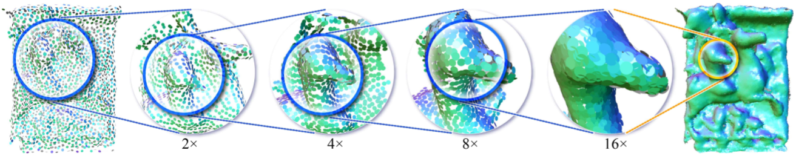
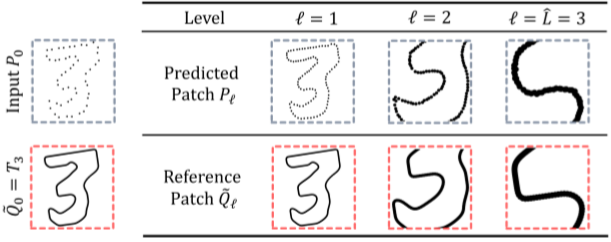

# 3PU复现

https://github.com/yifita/3pu

# 3PU

Patch-based Progressive 3D Point Set Upsampling

## Abstract

​	We present a **detail-driven** deep neural network for point set upsampling. 

​	A high-resolution point set is essential for point-based rendering and surface reconstruction. 

​	Inspired by the recent success of neural **image super-resolution** techniques, we progressively train a cascade of 一连串的 **patch-based** upsampling networks on **different levels of detail** end-to-end. 

​	We propose a series of architectural design contributions that lead to a substantial performance boost. 

​	The effect of each technical contribution is demonstrated in an ablation study 消融实验. 

​	Qualitative and quantitative experiments 定性和定量实验 show that our method significantly outperforms the state-of-theart learning-based 基于学习[58, 59], and optimazation-based 基于优化[23] approaches, both in terms of handling **low-resolution inputs** 低分辨率输入 and **revealing high-fidelity details**.  揭示高保真度细节

​	The data and code are at https://github.com/yifita/3pu.

---

## 1. Introduction

​	The success of neural super-resolution techniques 神经超分辨率技术 in image space encourages the development of upsampling methods for 3D point sets. 

​	A recent plethora of 最近大量 deep learning super-resolution techniques have achieved significant improvement in single image super-resolution performance [9, 27, 32, 47]; in particular, multi-step methods have been shown to excel in their performance [11, 30, 62]. 

​	Dealing with 3D point sets, however, is challenging since, unlike images, the data is **unstructured and irregular** [3,17,19,34,55]. Moreover, point sets are often a result of **customer-level scanning devices** 客户级扫描设备, and they are typically **sparse, noisy and incomplete**. Thus, upsampling techniques are particularly important, and yet the adaption of image-space techniques to point sets is far from straightforward. 但是将图像空间技术应用于点集却远非如此简单。

​	Neural point processing is pioneered by PointNet [41] and PointNet++ [42], where the problem of **irregularity** and **the lack of structure** is addressed by applying **shared multilayer perceptrons** (MLPs) for the feature transformation of individual points, as well as a **symmetric function**, e.g., max pooling, for global feature extraction. 

​	Recently, Yu et al. [59] introduced the first end-to-end point set upsampling network, **PU-Net**, where both the input and the output are the 3D coordinates of a point set. PU-Net extracts **multiscale features** 多尺度特征 based on PointNet++ [42] and **concatenates** 连接 them to obtain **aggregated multi-scale features** 聚合的多尺度特征 on **each** input point. 

​	These features are **expanded by replication **通过复制而扩展, then transformed to an upsampled point set that is located and uniformly distributed on the underlying surface. 

​	Although multiscale features are gathered, the level of detail available in the input patch is **fixed**, and thus both **high-level and low-level geometric structures are ignored** 忽略了高层和低层的几何结构. The method consequently **struggles** with input points representing **large-scale** or **fine-scale** structures 大型或精细结构的输入点, as shown in Figures 11 and 12.

**Fig.1 3PU流程**网络分多个步骤学习不同级别的详细信息，其中每个步骤都集中于**上一步的输出中的局部patch**。 通过**逐步**端到端地培训我们的基于patch的网络，我们成功地将稀疏的输入点集逐步采样到具有丰富几何细节的密集点集。 在这里，我们使用圆板进行点渲染，这些圆盘由点法线进行颜色编码。

​	In this paper, we present a **patch-based progressive** 基于patch的渐进式 upsampling network for point sets. The concept is illustrated in **Figures 1 and 2**. 

​	The multi-step upsampling breaks a, say, 16×-upsampling network, into four 2× subnets, where each subnet focuses on **a different level of detail**. 

​	To avoid exponential growth 指数增长 in points and enable end-to-end training for large upsampling ratios and dense outputs, all subnets are fully patch-based, and the input patch size is adaptive with respect to the present level of detail. 

​	Last but not least, we propose a series of architectural improvements, including novel **dense connections** 密集层 for point-wise **feature extraction**, **code assignment** 代码分配 for **feature expansion**, as well as bilateral **feature interpolation** 双边特征插值 for inter-level **feature propagation **层间特征传播. 

​	These improvements contribute to further performance boost and significantly improved parameter efficiency. 

​	We show that our model is robust under **noise and sparse** inputs. It compares favorably against existing state-of-theart methods in all quantitative measures and, most importantly, restores **fine-grained** 细粒度 geometric details几何细节.

**Fig. 2 multi-step patch-based 的点集采样网络概述** 包含3个详细级别。 给定一个稀疏点集作为输入，我们的网络将预测一个与 G.T. 相符的高分辨率点集。 与其训练8x上采样网络，不如将它分成三个2x步骤。 在每个训练步骤中，我们的网络都会随机选择一个本地补丁作为输入，在 G.T. 的指导下对该补丁进行上采样，然后将预测结果传递到下一步。在测试期间，我们在每个步骤中分别对多个补丁进行上采样，然后将上采样的结果合并到下一步。

---

## 2. Related work

### Optimization-based approaches  

​	Early optimization-based point set upsampling methods resort to shape priors. Alexa et al. [2] insert new points at the vertices of the Voronoi diagram, which is computed on the moving least squares (MLS) surface, assuming the underlying surface is smooth. Aiming to preserve sharp edges, Huang et al. [23] employ an anisotropic locally optimal projection (LOP) operator [22,36] to consolidate and push points away from the edges, followed by a progressive edge-aware upsampling procedure. Wu et al. [53] fill points in large areas of missing data by jointly optimizing both the surface and the inner points, using the extracted meso-skeleton to guide the surface point set resampling. These methods rely on the fitting of local geometry, e.g., normal estimation, and struggle with multiscale structure preservation. 

​	早期基于优化的点集采样方法采用形状先验。Alexa等[2]假设基础表面是光滑的，在Voronoi图的顶点处插入新点，该点是在移动最小二乘（MLS）曲面上计算的。为了保留锋利的边缘，Huang等[23]采用各向异性的局部最优投影（LOP）算子[22，36]来巩固和推动点远离边缘，然后进行渐进的边缘感知上采样程序。Wu等[53]通过使用提取的细观骨架来指导表面点集重采样，共同优化表面和内部点，从而在大范围缺失数据中填充点。这些方法依赖于局部几何的拟合，例如法线估计，并且难以进行多尺度结构的保存。

---

###	Deep learning approaches

​	PointNet [41], along its multiscale variant PointNet++ [41], is one of the most prominent point-based networks. It has been successfully applied in point set segmentation 分割[10, 40], generation 生成[1,13,56], consolidation 合并[14,45,58], deformation变形 [57], completion 补全[15,60] and upsampling [58,59,61]. 

​	Zhang et al. [61] extend a **PointNet-based** point generation model [1] to point set upsampling. Extensive experiments show its generalization to different categories of shapes. However, note that [1] is trained on the **entire object**, which **limits** its application to **low-resolution** input. 

​	PU-Net [59], on the other hand, operates on **patch** level, thus handles high-resolution input, but the upsampling results **lack fine-grained geometry structures**. 

​	Its follow-up work后续工作, the EC-Net [58], improves restoration of sharp features 改善尖锐特征的恢复 by minimizing a point-to-edge distance 最小化点到边的距离, but it requires a rather **expensive edge annotation** for training. 

​	In contrast, we propose a **multi-step**, **patch-based** architecture to channel the attention of the network to both global and local features. 

​	Our method also differs from the PU-Net and EC-Net in **feature extraction, expansion**, and loss computation, as discussed in Section 3.2 and 4. 

---

###	Multiscale skip connections in deep learning.

Modern deep convolutional neural networks (CNN) [29] process multiscale information using **skip-connections** 残差连接 between different layers, e.g. U-Net [44], ResNet [16] and DenseNet [20]. 

​	In image super-resolution, state-of-the-art methods such as LapSRN [30] and ProSR [51] gain substantial 实质性的 improvement by carefully designing **layer connections** 层连接 with **progressive learning schemes** [25, 50], which usually contribute to **faster convergence** 收敛 and **better preservation of all levels of detail** 保留所有细节级别. Intuitively, such multiscale skip-connections are useful for point-based deep learning as well. 

​	A few recent works have exploited the power of multiscale representation [12, 24, 28, 37, 49] and skip-connection [8,43] in 3D learning. In this paper, we focus on point cloud upsampling and propose **intra-level** 层间 and **inter-level** 层内point-based skip-connections.

​	现代深度卷积神经网络（CNN）[29]使用不同层之间的残差连接来处理多尺度信息，例如 U-Net [44]，ResNet [16]和DenseNet [20]。 

​	在图像超分辨率中，诸如LapSRN [30]和ProSR [51]之类的最新方法通过使用渐进式学习方案[25、50]精心设计层连接而获得了实质性的改进，这些方法通常有助于更快地收敛和收敛。 更好地保留所有细节级别。 

​	直观地讲，这种多尺度跳过连接对于基于点的深度学习也很有用。 最近的一些工作在3D学习中利用了多尺度表示[12，24，28，37，49]和残差连接 [8,43]的功能。 

​	在本文中，我们着重于点云上采样，并提出了基于层间和基于层间基于点的残差连接。

---

## 3. Method

​	Given an unordered set of 3D points, our network generates a denser point set that lies on the underlying surface. 

​	This problem is particularly challenging when the point set is relatively **sparse**, or when the underlying surface has **complex geometric and topological structures** 复杂的几何和拓扑结构. 

​	In this paper, we propose an **end-to-end progressive** learning technique for point set upsampling. 

​	Intuitively, we train a multi-step **patch-based** network to learn the information from different levels of detail. 

​	As shown in **Figures 2 and 3**, our model consists of a **sequence** of upsampling network units. 

​	Each unit has the same structure, but we employ it on **different levels of detail**. 

​	The information of all levels is **shared** via our **intra-level and inter-level** 层内和层间 connections inside and between the units. 

​	By **progressively** training all network units end-to-end, we achieve significant improvements over previous works.

---

### 3.1. Multi-step upsampling network

​	Multi-step supervision is common practice in neural image super-resolution [11,30,62]. In this section, we first discuss the difficulties in adapting multi-step learning to point set upsampling, which motivates the design of our multistep patch-based supervision method. Next, we illustrate the end-to-end training procedure for a cascade of upsampling network units for large upsampling ratios and high-resolution outputs.	多步监督是神经图像超分辨率的普遍做法[11,30,62]。在本节中，我们首先讨论将多步学习应用于点集采样的困难，这将促使我们设计多步基于patch的监督方法。接下来，我们说明了针对较大的上采样率和高分辨率输出的一连串的上采样网络单元的端到端训练过程。

---

#### Multi-step patch-based receptive field.

​	Ideally, a point set upsampling network should span the receptive field adaptively 自适应的跨越感受野 for various scales of details 多个尺度的细节 to learn geometric information 几何信息 from multiple scales 多尺度. 

​	However, it is challenging to apply a multi-scope receptive field 多范围感受野 on a dense irregular 密集不规则 point set due to practical constraints 实际限制. 

​	In contrast to images与图像相比, point sets do **not** have the **regular structure,** and the neighborhoods of points are **not fixed sets**. **Neighborhood information** must be collected by, e.g., k-nearest neighbors (**kNN**) search. 

​	This per-layer and per-point **computation** is rather **expensive**, prohibiting 阻止 a naive implementation of a multi-step upsampling network to reach large upsampling ratios and dense outputs. Therefore, it is necessary to optimize the network architecture, such that it is scalable 可调整尺度的 to a high-resolution point set. 

​	理想情况下，点集采样网络应针对各种尺度的细节自适应地跨越感受野，以从多个尺度学习几何信息。 但是，由于实际限制，在密集的不规则点集上应用多范围感受野是一项挑战。 与图像相比，点集没有规则的结构，点的邻域也不是固定集。 邻居信息必须通过例如k近邻（kNN）搜索来收集。 这种每层和每点的计算是相当昂贵的，从而阻止了天真的实现多步上采样网络来达到大的上采样率和密集的输出。 因此，有必要优化网络架构，以使其可扩展至高分辨率点集。

​	Our key idea is to use a **multi-step patch-based** network, and the **patch size** should be adaptive to **the scope of receptive fields** at the present step. 

​	Note that in neural point processing, the scope of a receptive field is usually defined by the **kNN size** used in the feature extraction layers. 

​	Hence, if the neighborhood size is **fixed**, the receptive field becomes **narrower** as the point set grows **denser**. 

​	This observation suggests that it is **unnecessary** for a network to **process** all the points when the receptive field is relatively **narrow**. 

​	As shown in Figure 2, our network recursively upsamples a point set while at the same time **reduces its spatial span**减小其空间跨度. This multi-step patch-based supervision technique allows for a **significant upsampling ratio**.

​	我们的关键思想是使用基于多步patch的网络，patch的大小应在当前步骤适应感受野的范围。 注意，在神经点处理中，感受野的范围通常由特征提取层中使用的kNN大小定义。 因此，如果固定邻域大小，则随着点集变得越来越密集，感受野将变窄。 该观察结果表明，当感受野相对狭窄时，网络不必处理所有点。 如图2所示，我们的网络递归地对一个点集进行上采样，同时减小其空间跨度。 这种基于patch的多步骤监督技术可实现显着的上采样率。

---

####	Multi-step end-to-end training.

​	Our network takes $L$ steps to upsample a set of points by a factor of $2^L$  . For $L$ levels of detail, we train a set of subnet units $ {U_1,U_2,...,U_L}$. We train such a sequence of upsampling units by progressively activating the training of units; it has been used in many multiscale neural image processing works [25,51]. 	我们的网络采取$L$步将一组点升采样$2^L$倍。 对于$L$个级别的细节，我们训练了一组子网单元 $ {U_1,U_2,...,U_L}$。我们通过逐步激活单位的训练来训练这样一系列的上采样单位；它已被用于许多多尺度神经图像处理工作。

​	More specifically, our entire training process has 2L −1 stages, i.e., every upsampling unit has two stages except the first one. We denote the currently targeted level of detail by $\hat{L}$. 	更具体地说，我们的整个训练过程有 $2^{L -1}$ 个阶段，即除了第一个阶段外，每个上采样单元都有两个阶段。我们用 $\hat{L}$ 表示当前目标的详细程度。

​	In the first stage of $U^L$ we fix the network parameters of units  $U_1$ to  $U_{\hat{L}-1}$  and start the training of unit $U_{\hat{L}}$. In the second stage, we unleash the fixed units and train all the units simultaneously. 	在 $U_{\hat{L}}$ 的第一阶段，我们固定单元 $U_1$ 到 $U_{\hat{L}-1}$ 的网络参数，并开始训练 $U_{\hat{L}}$。在第二阶段，我们释放固定的单元并同时训练所有单元。

​	This progressive training method is helpful because an immature 不成熟 unit can impose 施加 destructive gradient turbulence 破坏性的梯度湍流 on the previous units. 	这种渐进式训练方法很有帮助，因为不成熟的单元会在先前的单元上施加破坏性的梯度湍流。

​	We denote the ground truth model, prediction patch and reference patch with T, P and Q respectively and use  $\hat{L}$  and $ℓ$ to denote the targeted level of detail and an intermediate level, as illustrated in Figure 2 and 6. 	我们分别用 $T$，$P$ 和 $Q$ 表示 G.T. 模型，预测块和参考块，并使用 $\hat{L}$ 和 $ℓ$ 表示目标的详细信息级别和中间级别，如图 2 和 6 所示。

​	In practice, we recursively shrink the spatial scope by confining the input patch to a fixed number of points (N). For more technical detail about extracting such input patches on-the-fly and updating the reference patches accurately, please refer to Section 3.3.	在实践中，我们递归地通过限制输入patch为固定点数（N）来缩小空间范围。有关即时提取此类输入补丁并准确更新参考补丁的更多技术细节，请参阅第3.3节。

**Fig. 6** 训练期间针对 $\hat{L} = 3$ 提取块。 在此示例中，由于2D数据中输入点的数量很少，因此第一层包含整个输入形状（$N = | P_0 |$）。

---

### 3.2. Upsampling network unit

​	Let us now take a closer look at an upsampling network unit Uℓ. It takes a patch from Pℓ−1 as input, extracts deep feature, expands the number of features, compresses the feature channels to d-dimensional coordinates Pℓ. In the following, we explain each component in greater detail.

​	现在让我们仔细看一下上采样网络单元 $U_ℓ$。它以 $P_{ℓ-1}$ 的patch为输入，提取深层特征，扩展特征数量，将特征通道压缩为 d 维坐标 $P_ℓ$。 在下文中，我们将更详细地解释每个组件。

---

#### Feature extraction via intra-level dense connections. 通过层内密集连接进行特征提取

​	We strive for extracting structure-aware features (N × C) from an input point set (N ×d). In neural image processing, skip-connection is a powerful tool to leverage（杠杆作用/提取）features extracted across different layers of the network [16,20,21,35].  

​	我们努力从输入点集（N×d）中提取结构感知特征（N×C）。在神经图像处理中，残差连接是利用跨网络不同层提取的特征的强大工具[16,20,21,35]。 

​	Following PointNet++ [42], most existing point-based networks extract **multiple scales** of information by **hierarchically downsampling** the input point sets [33, 59]. Skip-connections have been used to **combine multiple levels** of features. 	继PointNet ++ [42]之后，大多数现有的基于点的网络通过对输入点集进行分层下采样来提取多种信息量[33，59]。 残差连接已用于**组合多个级别**的特征。 

​	However, a costly **point correspondence search** must be applied **prior** to skip-connections, due to the varying point locations caused by the downsampling step.但是，由于下采样步骤会导致点位置变化，因此必须在残差连接之前应用昂贵的**点对应搜索**。

​	We propose an architecture that facilitates 简化 efficient dense connections on point sets. Inspired by the dynamic graph convolution [46, 52], we define our local neighborhood in feature space. The point features are extracted from a local neighborhood that is computed dynamically via kNN search based on feature similarity. As a result, our network obtains long-range and nonlocal information without point set subsampling. 我们提出了一种架构，可简化点集上的有效密集连接。 受动态图卷积的启发[46，52]，我们定义了特征空间中的局部邻域。从局部邻域中提取点特征，该局部邻域是基于**特征相似度**通过kNN搜索动态计算的。结果，我们的网络无需点集二次采样即可获得远程和非局部信息。

​	As shown in Figure 5, our feature extraction unit is composed of a sequence of dense blocks. In each dense block, we convert the input to a fixed number (C′) of features, group the features using feature-based KNN, refine each grouped feature via a chain of densely connected MLPs, and finally compute an order-invariant point feature via maxpooling. 如图5所示，我们的特征提取单元由一系列密集块组成。在每个密集块中，我们将输入转换为特征的固定数量（$C'$），使用基于特征的KNN对特征进行分组，通过一系列紧密连接的MLP精炼每个分组的特征，并通过最大池化最终计算一个序列不变的点特征 。

**Fig. 5** 具有密集连接的特征提取单元

​	We introduce dense connections both within and between the dense blocks. Within the dense blocks, each MLP’s output, i.e., a fixed number (G) of features, is passed to all subsequent MLPs; between the blocks, the point features produced by each block are fed as input to all following blocks.	我们在密集块内部和之间引入残差连接。在密集块内，每个MLP的输出（即固定的特征数量G）将传递到所有后续MLP； 在块之间，由每个块产生的点特征将作为输入馈送给所有后续块。 

​	All these skip-connections enable explicit information re-use, which improves the reconstruction accuracy while significantly reducing the model size, as demonstrated in Section 4. Overall, our 16×-upsampling network with four 2×-upsampling units has much fewer network parameters than a 4×-upsampling PU-Net [59]: 304K vs. 825K.	所有这些残差连接都可以实现显式的信息重用，如第4节中所示，这在提高重建精度的同时显著减小了模型的大小。总体而言，我们的带有四个2x上采样单元的16x上采样网络比4x向上采样的PU-Net[59]的网络参数要少得多：304K vs .825K

---

#### Feature expansion via code assignment. 通过代码分配进行特征扩展。

​	In the feature expansion unit, we aim to transform the extracted features (N × C) to an upsampled set of coordinates (2N × d). 	在特征扩展单元中，我们旨在将提取的特征（N×C）转换为一组上采样的坐标（2N×d）。

​	PU-Net [59] **replicates** the per-point features and then processes each **replicant** independently by an individual set of MLPs. This approach may lead to **clustered** points around the original points positions, which is alleviated by introducing a **repulsion loss**. 	PU-Net [59]**复制**每个点的特征，然后由一组单独的MLP独立地处理每个副本。 这种方法可能导致原始点位置周围的聚簇点，这可以通过引入排斥力得到缓解。 

​	Instead of training the network to **disentangle the replicated features in-place**, we explicitly offer the network the information about the **position variation**. 	我们无需训练网络就地解散复制的特征，而是显式地为网络提供有关位置变化的信息。

​	In conditional image generation models[39], a category variable is usually concatenated to a latent code to generate images of different categories. Similarly, we assign a 1D code, with value −1 and 1, to each of those duplicated features to transform them to different locations, as shown in Figure 4. 	在某一图像生成模型[39]中，通常将类别变量与潜在编码连接起来以生成不同类别的图像。 类似地，我们为每个重复的特征**分配一个值-1和1的一维代码**，**以将它们转换到不同的位置**，如图4所示。

​	Next, we use a set of MLPs to compress the 2N × (C + 1) features to 2N × d residuals, which we add to the input coordinates to generate the output points. 接下来，我们使用一组MLP压缩 $2N×（C +  1）$特征为 $2N×d$ 残差，我们将其添加到输入坐标以生成输出点。

**Fig. 4**  一个上采样网络单元

​	Our experiments show that the proposed feature expansion method results in a well distributed point set without using an additional loss. Also, the number of network parameters is independent of the upsampling ratio, since all expanded features share the consecutive MLPs.	我们的实验表明，所提出的特征扩展方法可在不使用附加损失的情况下得到分布良好的点集。 而且，**网络参数的数量与上采样率无关，因为所有扩展特征都共享连续的MLP**。

​	Our feature expansion method is also related to recent point cloud generative models FoldingNet [56] and AtlasNet [13], where the coordinates of a 2D point are attached to the learned features for point generation. Here, we show that **the choice of an attached variable can be as simple as a 1D variable**.	我们的特征扩展方法还与最近的点云生成模型FoldingNet [56]和AtlasNet [13]有关，其中将2D点的坐标附加到学习的特征上以生成点。 在这里，我们表明**附加变量的选择可以像一维变量一样简单**。

----

#### Inter-level skip connection via bilateral feature interpolation.  通过双边特征插值进行层间残差连接

​	We introduce inter-level skip-connections to enhance the communication between the upsampling units, which serves as bridges for features extracted with different scopes of the receptive fields, as shown in Figure 3.  我们引入了层间残差连接以增强上采样单元之间的通信，这充当了使用不同感受野范围提取的特征的桥梁，如图3所示。

**Fig. 3** 三个上采样网络单元的插图。每个单元具有相同的结构，但适用于不同的级别。

​	To pass features from previous levels the current level, the key is a feature interpolation technique that constructs corresponding features from the previous upsampling unit, as the upsampling and patch extraction operations change the point correspondence. 	为了将先前级别的特征传递到当前级别，关键是一种特征插值技术，该技术可根据先前的上采样单元构造相应的特征，因为上采样和面片提取操作会更改点对应关系。 

​	Specifically, we use bilateral interpolation. For the current level $ℓ$, we denote by $p_{i}$ and $f_{i}$ the coordinates of the i-th point and its features generated by the feature extraction unit respectively, and N′ i denotes the spatial kNN of pi from level ℓ′. the interpolated feature for ˜ fi can be written as:	具体来说，我们使用双边插值。 对于当前级别 $ℓ$，我们分别用 $p_{i}$ 和 $f_{i}$ 表示第i个点的坐标及其特征提取单元生成的特征，而 $\mathcal{N}_{i}^{\prime}$ 表示级别 $ℓ$ 的 $p_{i}$ 的空间kNN。$f_{i}$ 的插值特征可以写成： 

$$
\tilde{f}_{i}=\frac{\sum_{i^{\prime} \in \mathcal{N}_{i}^{\prime}} \theta\left(p_{i}, p_{i^{\prime}}\right) \psi\left(f_{i}, f_{i^{\prime}}\right) f_{i^{\prime}}}{\sum_{i^{\prime} \in \mathcal{N}^{\prime}} \theta\left(p_{i}, p_{i^{\prime}}\right) \psi\left(f_{i}, f_{i^{\prime}}\right)}
$$
​	其中联合加权函数为： $ \theta\left(p_{1}, p_{2}\right)=$ $e^{-\left(\frac{\left\|p_{1}-p_{2}\right\|}{r}\right)^{2}}, \psi\left(f_{1}, f_{2}\right)=e^{-\left(\frac{\left\|f_{1}-f_{2}\right\|}{h}\right)^{2}}$. 宽度参数r和h是使用到最近邻居的平均距离来计算的。

​	One way to implement the inter-level connection is to **interpolate and concatenate** ˜ fi from all previous layers, i.e., use dense links the same as those within the feature extraction units. However, doing so would result in a very wide network, with ℓC features in level ℓ (typically C = 216), causing scalability issues and optimization difficulties [51]. 	实现残差连接的一种方法是从所有先前的层进行插值和级联，即 $\hat{ f_i}$，使用与特征提取单元内的那些相同的密集连接。 但是，这样做将导致网络非常宽泛，并在级别 $ℓ$ 中具有 $ℓC$ 特征（通常为C = 216），从而导致可伸缩性问题和优化难题[51]。

​	Instead, we apply residual skip-connections, i.e., fi = ˜ fi+fi. By applying such residual links per-level, contextual information from coarser scales can be propagated through the entire network and incorporated for the restoration of finer structures. We learn through experiments that both dense links and residual links contribute positively to the upsampling result, but the latter has better performance in terms of memory efficiency, training stability and reconstruction accuracy.	相反，我们应用残留的残差连接，即 $f_i=\hat{ f_i} + f_i$。 通过在每个级别上应用此类残差连接，可以将来自较粗尺度的上下文信息传播到整个网络，并将其合并以恢复精细的结构。 我们通过实验了解到，密集链接和残差连接均对上采样结果有积极贡献，但后者在**记忆效率，训练稳定性和重建精度**方面具有更好的性能。

---

### 3.3. Implementation details

#### Iterative patch extraction. 

​	在每个训练步骤中，目标分辨率 $\hat{L}$ 被固定。$P_{\hat{L}}$和 $Q_{\hat{L}}$ 表示 $\hat{L}$ 中的预测和参考patch，而$T_{\hat{L}}$表示此分辨率下的整个参考形状。 我们根据一系列中间预测和参考迭代地计算$P_{\hat{L}}$和 $Q_{\hat{L}}$ ，记为 $P_{\ell}$ 和 $\tilde{Q}_{\ell}$，其中$\ell=1 \ldots \hat{L}-1$

​	更具体地说，使用kNN（k = N）围绕 $P_{\ell-1}$ 中的随机点 $p_{\ell-1}^{*}$ 来获得 $\ell$ 级的输入。$\tilde{Q}_{\ell}$应该与 $P_{\ell}$ 的空间范围相匹配，但具有更高的分辨率，因此可以使用相同的查询点 $p_{\ell-1}^{*}$ 在 $\tilde{Q}_{\ell-1}$ 中通过kNN搜索来提取它，而$k=2^{\hat{L}-l+1} N$。 请注意，我们将patch规范化为一个单位立方体，以提高计算稳定性。在图6中，我们说明了$\hat{L}=3$时所描述的过程。

**Fig. 6** 训练期间针对$\hat{L}=3$提取补丁。 在此示例中，由于2D数据中输入点的数量很少，因此第一层包含整个输入形状（$N=\left|P_{0}\right|$）。

​	推理阶段，该过程与训练有两个方面不同：1. 在每个级别中，我们提取 $H$ 个重叠的输入 patch 以确保覆盖整个输入点集，并使用 FPS 对查询点进行采样；2. 通过首先合并 $H$ 个重叠的部分输出，然后用最远的采样重采样，使得 $\left|P_{\ell}\right|$ 来获得$\left|P_{\ell}\right|=2\left|P_{\ell-1}\right|$。 尽管区域重叠，重采样仍会导致均匀的点分布。

​	理论上，使用较小的 $N$ 可能会限制上下文信息，而较大的 $N$ 可能会不必要地增加输入的复杂性，从而增加了难度。 在我们的实验中，输入patch大小 $N$ 的选择对于上采样质量不是那么关键。

#### Loss function. 

​	We use Euclidean distance for patch extraction for its speed and flexibility. This implies that the patch pairs Pℓ and Qℓ might have misalignment problems on their borders. We observe that the loss computed on those unmatched points adds noise and outliers in the result. Thus, we propose a modified Chamfer distance: 

我们使用欧几里得距离进行补丁提取，因为它具有快速和灵活的特点。 这意味着面片对Pℓ和Qℓ可能在其边界上有未对准的问题。 我们观察到，在那些不匹配的点上计算出的损耗会在结果中增加噪声和离群值。 因此，我们提出了一个修改后的倒角距离：
$$
\mathcal{L}(P, Q)=\frac{1}{|P|} \sum_{p \in P} \xi\left(\min _{q \in Q}\|p-q\|^{2}\right)+\frac{1}{|Q|} \sum_{q \in Q} \xi\left(\min _{p \in P}\|p-q\|^{2}\right) \tag{2}
$$
where the function ξ filters outliers above a threshold δ: ξ (d) =(d, d ≤ δ 0, otherwise . We set δ to be a multiple of the average nearest neighbor distance so as to dynamically adjust to patches of different scales.

其中，函数ξ在阈值δ之上过滤离群值：ξ（d）=（d，d≤δ0，否则。我们将δ设置为平均最近邻居距离的倍数，以便动态调整以适应不同尺度的面片。

