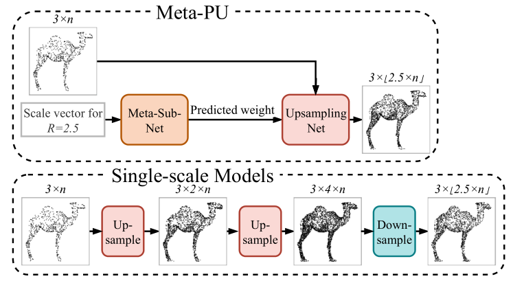
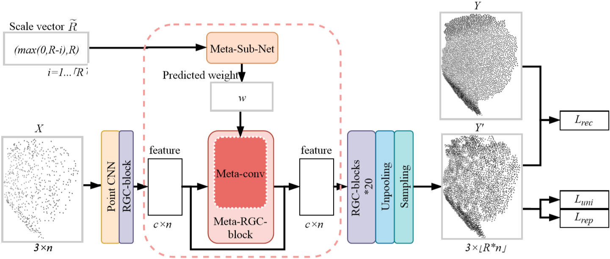
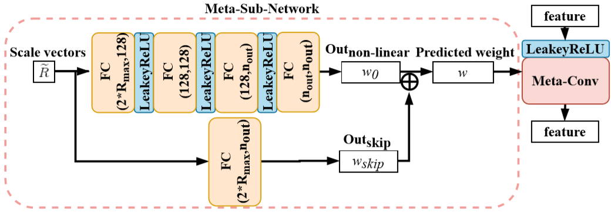
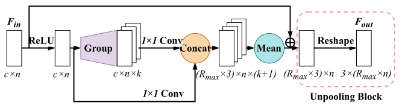

# Meta-PU

Meta-PU: An Arbitrary-Scale Upsampling Network for Point Cloud

Meta-PU：点云的任意规模上采样网络

## Abstract

​	Point cloud upsampling is vital for the quality of the mesh in three-dimensional reconstruction. Recent research on point cloud upsampling has achieved great success due to the development of deep learning. However, the existing methods regard point cloud upsampling of different scale factors as independent tasks. Thus, the methods need to train a specific model for each scale factor, which is both inefficient and impractical for storage and computation in real applications. 点云上采样对于三维重建中的网格质量至关重要。 由于深度学习的发展，最近关于点云上采样的研究取得了巨大的成功。 但是，现有方法将不同比例因子的点云上采样视为独立任务。**因此，这些方法需要针对每个比例因子训练一个特定的模型，这对于实际应用中的存储和计算而言既效率低下又不切实际。**

​	To address this limitation, in this work, we propose a novel method called “Meta-PU” to firstly support point cloud upsampling of arbitrary scale factors with a single model. In the Meta-PU method, besides the backbone network consisting of residual graph convolution (RGC) blocks, a meta-subnetwork is learned to adjust the weights of the RGC blocks dynamically, and a farthest sampling block is adopted to sample different numbers of points. Together, these two blocks enable our Meta-PU to continuously upsample the point cloud with arbitrary scale factors by using only a single model. 

​	为了解决这一局限性，在这项工作中，我们提出了一种称为“Meta-PU”的新颖方法，该方法首先使用单个模型来支持任意比例因子的点云上采样。在Meta-PU方法中，除了由残差图卷积（RGC）块组成的骨干网络之外，还学习了元子网络来动态调整RGC块的权重，并采用最远采样块对不同数量的点进行采样 。这两个模块结合在一起，使我们的Meta-PU仅使用一个模型就可以使用任意比例因子连续对点云进行上采样。

## 1. Introduction

POINT clouds are the most fundamental and popular representation for three-dimensional (3D) environment modeling. When reconstructing the 3D model of an object from the real world, a common technique is to obtain the point cloud and then recover the mesh from it. However, a raw point cloud generated from depth cameras or reconstruction algorithms is usually sparse and noisy due to the restrictions of hardware devices or the limitations of algorithms, which leads to a low-quality mesh. To solve this problem, it is common to apply point cloud upsampling prior to meshing, which takes a set of sparse points as input and generates a denser set of points to reflect the underlying surface better.

点云是三维（3D）环境建模的最基本，最流行的表示形式。 从现实世界重建对象的3D模型时，一种常见的技术是获取点云，然后从中恢复网格。 然而，由于硬件设备的限制或算法的限制，从深度相机或重建算法生成的原始点云通常稀疏且嘈杂，这导致了低质量的网格。 为了解决这个问题，通常在网格划分之前应用点云上采样，即采用一组稀疏点作为输入并生成一组更密集的点以更好地反射下面的曲面。

Conventional point cloud upsampling methods [1], [2], [3] are optimization-based with various shape priors as constraints, such as the local smoothness of the surface and the normal. These works perform well for simple objects but are not able to handle complex and dedicated structures. Due to the success of deep learning, some data-driven methods [4], [5], [6], [7] have emerged recently and achieved state-of-the-art performance by employing powerful deep neural networks to learn the upsampling process in an end-to-end way. However, all existing point cloud upsampling networks only consider certain integer scale factors (e.g., 2x). They regard the upsampling of different scale factors as independent tasks. Thus, a specific model for each scale factor has to be trained, limiting the use of these methods in real-world scenarios where different scale factors are needed to fit different densities of raw point clouds. Some works [6], [7] suggests to achieve larger scales through iterative upsampling (e.g., upsampling 4x by running the 2x model twice). 传统的点云上采样方法[1]，[2]，[3]是基于优化的，具有各种形状先验作为约束，例如表面的局部平滑度和法线。 这些作品对于简单的对象表现良好，但无法处理复杂的专用结构。 由于深度学习的成功，最近出现了一些数据驱动的方法[4]，[5]，[6]，[7]，并通过使用强大的深度神经网络来学习最新的性能。以端到端的方式进行上采样。 但是，所有现有的点云上采样网络仅考虑某些整数比例因子（例如2x）。他们将对不同比例因子的升采样视为独立任务。因此，必须训练每个比例因子的特定模型，从而限制了在需要不同比例因子来拟合不同密度的原始点云的现实世界场景中使用这些方法。一些工作[6]，[7]建议通过迭代上采样（例如，通过运行2x模型两次对4x进行上采样）来实现更大的比例。

**Fig. 1** : 任意比例模型 Meta-PU 与单比例模型比较，其中比例 R = 2.5 。 现有的单比例尺模型首先需要按比例放大到较大的整数比例（例如4x），然后使用**下采样算法**实现2.5x的非整数比例。

To demonstrate the effectiveness and flexibility of our method, we compare it with several strong baseline methods. The comparison shows that our method can even achieve SOTA performances for specific single scale factors while supporting arbitrary-scale upsampling for the first time. In other words, our approach is both stronger and more flexible than the SOTA approaches. To better understand the underlying working principle and broader applications, we further provide a comprehensive analysis from different perspectives. In summary, our contribution is three-fold: 

- We propose the first point cloud upsampling network that supports arbitrary scale factors (including noninteger factors), via a meta-learning approach. 
- Weshowthatjointlytrainingmultiplescalefactorswithone model improves performance. Our arbitrary-scale model even achieves better results at each specific scale than the single-scale counterpart. 
- We evaluate our method on multiple benchmark datasets and demonstrate that Meta-PU advances state-of-the-art performance.

为了证明我们方法的有效性和灵活性，我们将其与几种强大的基线方法进行了比较。 比较表明，我们的方法甚至可以针对特定的单比例因子实现SOTA性能，同时首次支持任意比例的上采样。 换句话说，我们的方法比SOTA方法既强大又灵活。 为了更好地理解基本的工作原理和更广泛的应用，我们从不同的角度进一步提供了全面的分析。 总而言之，我们的贡献是三方面的：

- 我们提出了一种通过元学习方法支持任意规模因子（包括非整数因子）的第一点云上采样网络。  
- 我们证明，使用一个模型联合训练多个比例因子可以提高性能。 我们的任意尺度模型甚至在每个特定尺度上都比单尺度模型获得更好的结果。  
- 我们在多个基准数据集上评估了我们的方法，并证明了Meta-PU可以提高最先进的性能。

## 3. Method

​	在本节中，我们定义了任意尺度点云上采样的任务。 然后，我们详细介绍Meta-PU。

### 3.1 Arbitrary-scale Point Cloud Upsampling 

​	给定 $n$ 个点的稀疏无序点集 $ X=\left\{p_{i}\right\}_{i=1}^{n} $，并使用比例因子 $R$ ，任意尺度点云上采样的任务是生成一个密集点集 $ Y=\left\{p_{i}\right\}_{i=1}^{N} $ 的 $ N=\lfloor R \times n\rfloor $。 值得注意的是，$R$ 不一定是整数，理论上，$N$ 可以是大于 $n$ 的任何正整数。 输出 $Y$ 不一定包含 $X$ 中的点。$X$ 可能是不均匀分布。为了满足实际应用的需要，我们需要上采样的点云来满足以下两个约束。 首先， $Y$ 的每个点位于 $X$ 所描述的基础几何表面上。其次，对于任何比例因子 $R$ 或输入点数 $n$，输出点的分布应平滑且均匀。

### 3.2 Meta-PU 

#### Overview

​	骨干上采样网络包含五个基本模块，它们在图2中以不同的颜色区分。输入点云首先通过点卷积神经网络（CNN）和几个RGC块为每个质心及其邻居提取特征。在这些RGC块中，meta-RGC块是特殊的。 给定的输入 $R$ ，由 meta-sub-network 动态生成meta-RGC块权重。因此，由该meta-RGC块提取的特征将调整为给定的比例因子。在RGC块之后，展开一个非池化层以输出$ \lfloor R_{\max } \times n\rfloor $ 点，其中 $R_{max}$ 表示我们的网络支持的最大比例因子，默认情况下 $R_{max} = 16$。 之后，采用最远采样块从 $ \lfloor R_{\max } \times n\rfloor $ 点中采样 $N$ 个点作为最终输出，并受复合损失函数的约束。在以下部分中，我们将详细介绍 Meta-PU 中每个块的详细结构以及训练损失。

**Fig.2** Meta-PU概述。给定 $n$ 个点的稀疏输入点云 $X$ 和比例因子 $R$，Meta-PU生成具有 $ \lfloor R \times n\rfloor $ 个点的更密集的点云 $Y'$ 。采用复合损失函数来鼓励 $Y'$ 均匀地位于目标 $Y$ 的下表面上。粉色框是Meta-PU的核心部分。元子网将比例因子 $R$ 作为输入，并输出meta-RGC块中卷积核的权重张量 $v_{weight}$，以使特征提取适应不同的规模。

#### Point CNN

PointCNN 是空间域上的一种简单结构，可从输入点云 $X$ 中提取特征。详细地，对于形状为 $1×3$ 的每个点 $p∈X$ ，我们首先将其 $k$ 个最近的邻居与形状为 $k×3$ 进行分组，并 然后将它们馈入一系列点式卷积$（k×c）$，然后是最大池化层以获得 $1×c$ 特征，其中 $c$ 是点云特征的通道数。 因此，输出特征 $F_{out}$ 是形状为 $n×c$ 的张量。 递归应用的卷积达到了较宽的感受野，代表了更多的信息，而最大池化层聚合了前一层中所有点的信息。 在我们的实现中，我们设置 $k = 8$，$c = 128$，卷积层数为3。

#### RGC Block

**Fig. 3a** RGC block

​	如图3a所示，RGC块包含一些图卷积层和残差连接，这是从[7]中得到启发的。 它以特征张量 $F_{in}$ 为输入，输出为 $F_{out}$ 的形状为 $n×c$ 的 $F_{out}$。  

​	RGC块中的图卷积定义在图 $G =（V，ε）$上，其中 $V$ 表示节点集，而 $ε$ 表示对应的邻接矩阵。 图卷积公式如下：
$$
f_{\text {out }}^{p}=\omega_{0} * f_{i n}^{p}+\omega_{1} * \Sigma_{q \in N(p)} f_{i n}^{q}, \forall p \in V \tag{1}
$$
​	其中 $f_{i n}^{p}$ 表示顶点 $p$ 的输入特征，$f_{\text {out }}^{p}$ 表示图卷积后顶点 $p$ 的输出特征，其中 $ω$ 是可学习的参数，而 $∗$ 表示逐点卷积运算。

​	RGC块的核心思想是分别对中心点特征和邻居特征进行卷积运算，如图3a所示。对于邻居特征，它们与输入点云 $x$ 的 $k$ 个最近邻居分组，然后进行 $1×1$ 图卷积。 将中心点特征与相邻特征的通过卷积分开，然后与邻居的特征合并在一起。 此外，引入了残差连接来解决逐渐消失的梯度和缓慢收敛的问题。在我们的实现中，我们设置 $k = 8$，$c = 128$，并且总共使用了22个RGC块。 其中，第二个是特殊的meta-RGC块，下面将对其进行详细描述。

#### Meta-RGC Block

**Fig.3b**  Meta-RGC block

为了用单个模型解决任意尺度的点云上采样问题，我们提出了meta-RGC块，它是Meta-PU的核心部分。meta-RGC块类似于普通的RGC块，但是根据给定的比例因子 $R$ 可以动态地预测图卷积权重。

我们创建了一个比例矢量$ \widetilde{R}=\{\max (0, R- \left.  i)  , R\}_{i=1 \ldots\lceil R\rceil}\right) $作为输入，并用 $\text{{−1，−1}}$ 填充其余部分以达到大小 $2 * R_{max}$，而不是直接将 $R$ 馈入meta-RGC块。 该设计背后的理念受到 meta-SR 的启发[10]。更具体地讲，由于每个输入点本质上都转换成一组输出点，因此 $ \{\max (0, R-i), R\} $ 可以用作位置标识，以引导点处理网络区分新的第 $i$ 个点与同一输入种子点生成的其他点。 

​	元卷积公式如下：
$$
f_{\text {out }}^{p}=\varphi\left(\widetilde{R} ; \theta_{0}\right) * f_{i n}^{p}+\varphi\left(\widetilde{R} ; \theta_{1}\right) * \Sigma_{q \in N(p)} f_{i n}^{q}, \forall p \in V \tag{2}
$$
其中卷积权重是由 meta-subnetwork $ \varphi(.) $以比例矢量 $\widetilde{R}$ 作为输入来预测的。请注意，我们有两个元卷积分支，如图3b所示。一个分支用于提取中心点 $p$ 的特征，另一分支用于提取由邻接矩阵 $ε$ 定义的邻居的特征。由于没有针对点云的预先定义的邻接矩阵 $ε$，我们将其定义为 $N（p）$，即 $p$ 的 $k$ 个最近邻居。 这两个分支的卷积权重分别由两个具有参数 $θ_i$ 的元子网生成。

---

#### Meta-subnetwork

​	每个用于 meta-convolution 的 meta-subnetwork 包括五个全连接（FC）层[27]和几个激活层，如图4所示。在forward pass中，第一个FC层将根据创建的比例矢量 $R$ 作为输入，并获得向量 $c_{hidden}$。通过激活函数后，第二个FC层将生成与输入大小相同的输出。继激活函数后，第三个FC层的输入是 $c_{hidden}-entry$ 编码，其输出的长度为 $c_{in}×c_{out}×l×l$ 。 接下来，第四个FC层输出具有与其输入相同形状的矢量 $w_0$。与前四个串联的层不同，最后一个FC层用作残差连接，可直接从 $2 * R_{max}$ 获得 $c_{in}×c_{out}×l×l$ 形状的输出$w_{skip}$。 将两个输出 $w_0$，$w_{skip}$ 相加，然后重整为$（c_{in}，c_{out}，l，l）$ 作为权重矩阵 $w$ ，以进行元卷积。 我们设置 $c_{out} = c_{in} = 128和c_{hidden} =128$ 。$l$ 表示卷积的内核大小，在我们的实现中设置为1。在backward pass中，我们不直接更新卷积的权重矩阵，而是相对于FC层的权重来计算元子网络的梯度。可以通过链式规则自然计算出元子网的梯度，以进行端到端的训练。

**Fig. 4** Structure of the meta-subnetwork. The meta-subnetwork inside the pink box predicts weights for convolutional layers in the meta-RGC block.粉色框内的元子网可预测meta-RGC块中卷积层的权重。

​	由元子网络预测的具有动态权重的meta-RGC块对于任意规模的上采样任务而言是必要的，因为上采样点云的第$iR$个至第$(i+1)R$个点是直接基于第 $i$ 个输入点及其最近的邻居通过RGC块提取。不同比例因子的输出中的点位置必须不同，以确保上采样点的均匀性可以覆盖下面的表面。因此，必须根据比例因子自适应调整嵌入特征。因此，必须根据比例因子对嵌入特征进行自适应调整。该调整比仅向上采样 $R_{max}$ 次然后执行向下采样要好得多。

---

#### The unpooling block 

​	unpooling 模块将点云 $X$ 和相应的特征 $F_{in}$ 用作输入。它是基于RGC的结构，而卷积层的输出通道设置为 $R_{max}×3$ 。具体来说，对于形状为 $n×c$ 的特征 $F_{in}$ ，将其变换为大小为 $n×(R_{max}×3)$ 的张量，然后将其重整为 $n×R_{max}×3$，表示为 $T_{out}$ 。 作为残差块，类似于RGC块中输入和输出要素的残差连接，我们引入了点之间的跳过连接。 因此，将张量 $T_{out}$ 逐点添加到 $X$，以生成形状为  $n×R_{max}×3$ 的输出 $Y_{max}^{'}$。请注意，“add”操作自然会以广播的方式将 $x$ 扩展为 $R_{max}$ 副本。

**Fig. 3c** Unpooling block

#### The farthest sampling block

最远采样块执行最远的采样策略，以从 $Y_{max}^{'}$ 到 $ \lfloor R \times n\rfloor $ 的 $n×R$ 个点保留 $Y'$ 。优点是双重的。首先，最远采样可以从输入点集中采样任意数量的点，这有助于获得所需数量的点作为输出。其次，由于最远采样从全局角度根据欧几里得距离迭代地构造了具有最远点向距离的点集，因此此步骤进一步提高了点集分布的均匀性。

## 5. CONCLUSION

In this paper, we present Meta-PU, the first point cloud upsampling network that supports arbitrary scale factors (including non-integer factors). This method provides a more efficient and practical tool for 3D reconstruction, than the existing single-scale upsampling networks. The core part of Meta-PU is a novel meta-RGC block, whose weights are dynamically predicted by a meta-subnetwork, thus it can extract features tailored to the upsampling of different scales. 

在这篇文章中，我们提出了Meta-PU，第一个支持任意比例因子(包括非整数因子)的点云上采样网络。与现有的单尺度上采样网络相比，该方法为三维重建提供了更有效和实用的工具。元处理器的核心部分是一个新的元RGC块，它的权值由一个元子网动态预测，因此它可以提取适合不同尺度上采样的特征。

The comprehensive experiments reveal that the joint training of multiple scale factors with one model improves performance. Our arbitrary-scale model even achieves better results at each specific scale than those single-scale state-of-the-art. The application on  mesh reconstruction also demonstrates the superiority of our method in visual quality. 

综合实验表明，多尺度因子与一个模型的联合训练提高了性能。我们的任意尺度模型甚至在每一个特定的尺度上获得了比单尺度模型更好的结果。在网格重建上的应用也证明了我们的方法在视觉质量上的优越性。

Notably, similar to other upsampling methods, our method does not aim to fill holes, such that some large holes or missing parts still exist in the upsampled results.  Another limitation is that the maximum upscale factor supported by our network is not infinity, constrained by the model size and GPU memory. These are all future directions worth exploring.

值得注意的是，类似于其他上采样方法，我们的方法并不旨在填补漏洞，例如一些上采样的结果中仍然存在大孔或缺失零件。另一个限制是，我们的网络支持的最大高档因子不是无穷大，受到型号大小和GPU内存的限制。这些都是未来值得探索的方向。

