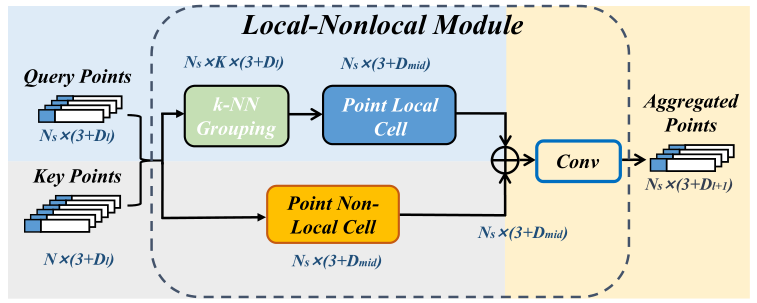
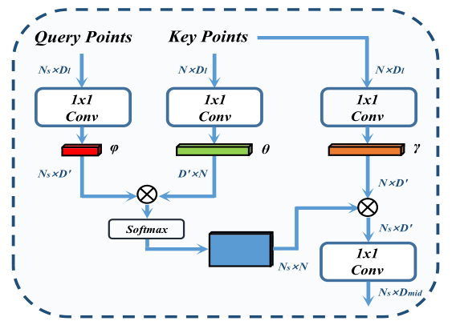
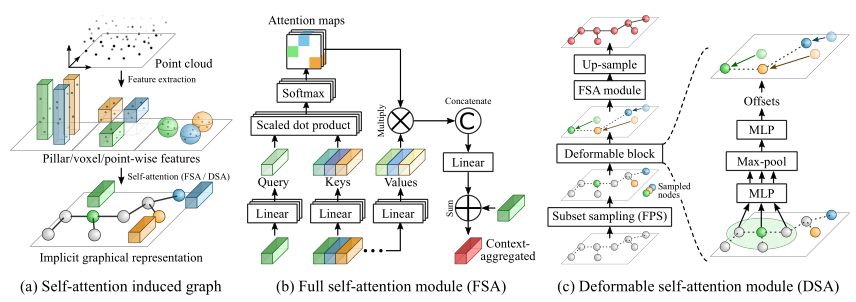
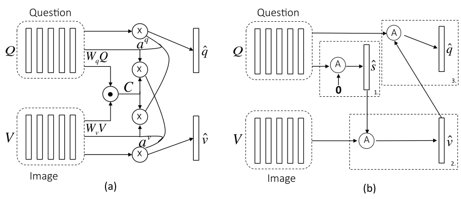
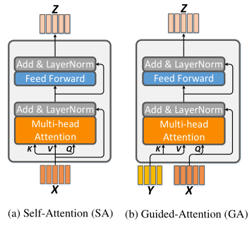

# PointASNL: Robust Point Clouds Processing using Nonlocal Neural Networks with Adaptive Sampling

## Abstract

In this paper, we present a novel end-to-end network for robust point clouds processing, named PointASNL, which can deal with point clouds with noise effectively. The key component in our approach is the adaptive sampling (AS) module. It first re-weights the neighbors around the initial sampled points from farthest point sampling (FPS), and then adaptively adjusts the sampled points beyond the entire point cloud. Our AS module can not only benefit the feature learning of point clouds, but
also ease the biased effect of outliers. To further capture the neighbor and long-range dependencies of the sampled point, we proposed a local-nonlocal (L-NL) module
inspired by the nonlocal operation. Such L-NL module enables the learning process insensitive to noise. 

在本文中，我们提出了一种用于鲁棒点云处理的新型端到端网络，名为 PointASNL，它可以有效地处理带有噪声的点云。 我们方法中的关键组件是自适应采样 (AS) 模块。 它首先对来自最远点采样 (FPS) 的初始采样点周围的邻居重新加权，然后自适应地调整整个点云之外的采样点。 我们的 AS 模块不仅可以有利于点云的特征学习，还可以缓解异常值的偏差影响。

为了进一步捕获采样点的邻居和远程依赖关系，我们提出了一个受非本地操作启发的本地-非本地（L-NL）模块。 这种 L-NL 模块使学习过程对噪声不敏感。 

## 3. Method

在本文中，我们在PointASNL中提出了两个模块，即 Sec 3.1 中的自适应采样（AS）模块和 Sec 3.2 中的本地-非本地 (L-NL) 模块。在第 Sec 3.3 中，我们以分层方式组合 AS 和 L-NL 模块以形成我们提出的 PointASNL 模型。

Fig. 2(b) **Local-NonLocal Module**. 说明了localnonlocal (L-NL) 模块的构建，该模块由点局部单元和点非局部单元组成。$N_s$ 代表采样点数，$N$ 代表整个点云的点数，$D_l$ ，$D_{mid}$ ，$D_{l+1}$ 代表通道数。

### 3.2. Local-Nonlocal (L-NL) Module

在我们的 L-NL 模块中，有两个单元：点局部 (PL) 单元和点非局部 (PNL) 单元。 具体来说，PL单元可以是任何有吸引力的算法（例如，PointNet++ [25]、PointConv [44]），而PNL单元创新地考虑了多尺度采样点与整个点云之间的相关性。因此，**通过结合局部和全局信息来增强点云的上下文学习**（见 Fig. 2(b)）。

#### 3.2.1 Point Local Cell

点云的局部特征挖掘通常采用local-to-global策略[25]，聚合每个组中的局部特征，并通过**分层架构逐渐增加感受野**。 我们在点局部（PL）单元中采用这种方法。 类似于先前对局部采样点 $x_i$ 、对应特征 $f_i$ 和邻域 $N(x_i)$ 的定义，PL 中使用的广义局部聚合函数可以表示为
$$
\begin{equation}
 f_{i}^{l}=\mathcal{A}\left(\mathcal{L}\left(f_{n}\right), \forall x_{n} \in \mathcal{N}\left(x_{i}\right)\right) 
\end{equation}\tag{5}
$$
其中 $f^l_i$ 是局部中心 $x_i$ 的更新特征，由局部特征变换函数 $L$ 和聚合函数 $A$ 更新。对于 PointNet++ [25]，$L$ 是多层感知（MLP），$A$ 是最大池化。 最近，越来越多的作品直接在局部区域上设计卷积算子，主要是将 $L$ 变成一个通过邻居关系获得的可学习的加权乘法。 折中考虑操作的效率和有效性，我们通过自适应地将两点的相对位置投影到卷积权重[40, 44]来实现卷积操作，并聚合局部特征，
$$
\begin{equation}
 \mathcal{L}\left(f_{n}\right):=g\left(x_{n}-x_{i}\right) f_{n} 
\end{equation}
$$
其中 $g$ 被选为 MLP：$ \mathbb{R}^{3} \mapsto \mathbb{R}^{D_{l} \times D_{\text {mid }}} $ ，这将 3 维相对位置转移到 $D_{l} \times D_{\text {mid }}$ 变换矩阵。$D_l$ 表示某层输入特征的通道，$D_{mid}$ 是PL单元更新特征的通道。

#### 3.2.2 Point Nonlocal Cell

Figure 3. Inner structure of point nonlocal (PNL) cell. For the notations $ N_{s}, N, D_{l}, D_{m i d} $please refer to the caption of Fig. 2,  $D^\prime$ is the intermediate中间的 channel numbers.

受二维图像中用于远程依赖学习的非局部神经网z我们的点非局部单元和 [41] 中提出的组件之间有两个主要区别：（1）我们使用我们的采样点作为查询点来计算与某些层中的整个点（例如，关键点 $ \mathcal{P}_{\mathrm{k}} $ ）的相似性。 此外，我们的查询点不受输入点云子集的限制，因为每个采样点都通过 AS 模块自适应更新其坐标和特征（第 3.1 节）。  （2）随着每一层的下采样操作，我们的输出通道逐渐增加，这避免了下采样编码器中的信息丢失。 具体来说，类似于 Eq.1，给定查询点 $x_i$ 和来自 $\mathcal{P}_k$ 的关键点，非局部操作 $\mathcal{NL}$ 定义为：
$$
\begin{equation}
 \mathcal{NL} \left(x_{i}, \mathcal{P}_{\mathrm{k}}\right):=\mathcal{A}\left(\mathcal{R}\left(f_{i}, f_{j}\right) \gamma\left(f_{j}\right), \forall x_{j} \in \mathcal{P}_{\mathrm{k}}\right) 
\end{equation}
$$
其中 $ \mathcal{P}_{k} \in \mathbb{R}^{N \times 3} $ 代表某一层的整个 $N$ 个关键点。最后，单个非线性卷积层 $σ$ 融合全局上下文并将每个点的通道调整为与 $ \mathrm{PL}\quad D_{l+1} $ 的输出相同的维度（Eq. 5）。 因此，对于采样点 $x_i$ ，其更新的特征由具有函数的 $ \mathrm{PNL}$ 计算
$$
\begin{equation}
 f_{i}^{n l}=\sigma\left(\mathcal{N}\left(x_{i}, \mathcal{P}_{k}\right)\right) 
\end{equation}
$$

#### 3.2.3 Local-Nonlocal (L-NL) Fusion

通过结合 PL 和 PNL，我们构建了一个 local-nonlocal 模块来同时编码局部和全局特征。如 Fig. 2(b) 所示，它使用查询点和关键点作为输入，并利用 k-NN 分组来搜索每个查询点的邻域。 然后，通过 PL 发送每个局部区域的组坐标和特征进行局部上下文编码。对于 PNL，它使用整个关键点通过注意力机制整合每个查询点的全局信息。 最后，对于每个更新的点，使用具有非线性卷积 $σ$ 的通道总和来融合局部和全局信息。

---

# **SA-Det3D: Self-Attention Based Context-Aware 3D Object Detection**

**Fig. 2**

在本节中，我们首先介绍一个完整的自我注意（FSA）模块，用于 3D 中的判别特征提取目标检测旨在通过利用全局上下文来产生更强大和更健壮的表示。接下来，受 2D 可变形卷积 [8] 的启发，我们引入了 FSA 的一种变体，称为可变形自我注意 (DSA)。DSA 可以减少 FSA 的二次计算时间并扩展到更大和更密集的点云。 两个提议的模块如 Fig. 2 所示。

## 3.1. Formulation

对于 $n$ 个相关特征的输入集 $ \mathcal{X}=\left\{\mathbf{x}_{1}, \mathbf{x}_{2}, \ldots \mathbf{x}_{n}\right\} $ 和 $ i \in\{1, \ldots n\} $，我们建议使用 Vaswani 等[38]引入的 self-attention。利用第 $i$ 个特征节点与所有特征节点的成对相似性，并将它们堆叠起来以紧凑地表示当前特征节点的全局结构信息。

在数学上，柱/体素/点特征集及其关系由图 G = (V,E) 表示，该图包括节点集 V = {x 1 ,x 2 ,...xn ∈ R d }， 连同边集 E = {ri,j ∈ RN h ,i = 1,...,n and j = 1,...,n}。 自注意力模块采用一组特征节点，并计算边（见图 2（a））。

   边 ri,j 表示第 i 个节点和第 j 个节点之间的关系，N h 表示跨 d 个特征输入通道的注意力机制中的头部数量（图 2（b）中的注意力图数量），如上所述 以下。 我们假设 N h 均分 d。 将处理后的点云特征表示为图中的节点的优势在于，现在聚合全局上下文的任务类似于通过在图上传递消息来捕获节点之间的高阶交互，其中存在许多机制，例如自注意力。

## 3.2. Full Self-Attention Module

我们的完全自注意力 (FSA) 模块通过线性层将特征 $x_i$ 投影到查询向量 $Q$、关键向量 $K$ 和值向量 $V$ 的矩阵中（参见 Fig. 2b）。 查询 $\mathbf{q}_i$ 和所有键 $ \mathbf{k}_{j=1: n} $ 之间的相似性由点积计算，并通过 softmax 函数归一化为注意力权重 $ \mathbf{W}_{i} $。 然后使用注意力权重来计算成对交互项 $ \mathbf{r}_{i j}=w_{i j} \mathbf{v}_{j} $。 每个节点向量 $\mathbf{a}$ 的累积全局上下文是这些成对交互的总和 $ \mathbf{a}_{i}=\sum_{j=1: n} \mathbf{r}_{i j} $ 。 正如我们在公式中提到的，我们还使用了多个并行应用的注意力头，它们可以独立地获取通道依赖性。 然后，节点 $i$ 的最终输出是通过将累积的上下文向量 $ \mathbf{a}_{i}^{h=1: N_{h}} $ 连接到头上，通过线性层，使用组归一化 [45] 对其进行归一化并与 x i （残差连接）相加而产生的。

**优点**：这个模块的重要优点是它收集上下文的分辨率与参数的数量无关，并且操作是置换不变。 这使得在 3D 检测器的最后阶段用自注意力特征替换一部分参数繁重的卷积滤波器具有吸引力，以提高特征质量和参数效率。

**复杂性**：成对相似度计算本质上是 O(n 2 d)。 点云的固有稀疏性和基于高效矩阵乘法的成对计算使 FSA 成为当前 3D 检测架构中可行的特征提取器。 然而，为了扩展到更大的点云，有必要牺牲计算效率的准确性。 在下一节中，我们提出了我们的 Deformable Self-Attention 模块来减少 FSA 的二次计算时间。

## 3.3. Deformable Self-Attention Module

我们的主要想法是关注原始节点向量的代表性子集，以便聚合全局上下文。 然后我们将这个累积的结构信息上采样回所有节点位置。 我们在补充部分描述了上采样过程。 此操作的复杂度为 O(m 2 d)，其中 m << n 是在子集中选择的点数。 为了使子集具有代表性，必须确保所选节点涵盖 3D 几何空间中的信息结构和共同特征。 受视觉中可变形卷积网络 [8] 的启发，我们提出了一种几何引导的顶点细化模块，该模块使节点具有自适应性并在空间上重新组合它们以覆盖对语义识别很重要的位置。 我们的节点偏移预测模块基于为域对齐提出的顶点对齐策略 [28, 11]。最初，m 个节点通过最远点采样 (FPS) 从点云中采样，顶点特征为 x i 和 3D 顶点位置 v i 。 对于第 i 个节点，通过聚合具有不同重要性的局部邻域特征来计算更新位置 v ′ i 如下：

其中 N i 给出点云中第 i 个节点的 k 邻居，W offset 和 W align 是端到端学习的权重。
   最终节点特征通过局部聚合嵌入的非线性处理计算如下：

接下来，m 个自适应聚合的特征 {x ′ 1 ....x ′ m } 然后被传递到一个完整的自我注意 (FSA) 模块以对它们之间的关系进行建模。 然后通过上采样在来自 m 个代表的所有 n 个节点之间共享这个聚合的全局信息。 我们将此模块称为可变形自我注意 (DSA) 模块，如图 2(c) 所示。

优点：DSA 的主要优点是它可以可扩展地聚合支柱/体素/点的全局上下文。
   DSA 的另一个优点是它经过训练可以从点云中信息量最大的区域收集信息，从而改进特征描述符。

---

# Hierarchical Question-Image Co-Attention for Visual Question Answering

## 3. Method

我们首先介绍本文中使用的符号。 为了便于理解，我们的完整模型分部分描述。 首先，我们的分层问题表示在 Sec 中描述。  3.2 和提议的共同注意机制然后在第 3 节中描述。  3.3. 最后，秒。  3.4 展示了如何递归地结合参与问题和图像特征来输出答案。

### 3.1. Notation

给定一个包含 $T$ 个词的问题，其表示由 $ \boldsymbol{Q}=\left\{\boldsymbol{q}_{1}, \ldots \boldsymbol{q}_{T}\right\} $  表示，其中 $\boldsymbol{q}_{T}$ 是第 $t$ 个词的特征向量。 我们将 $ \boldsymbol{q}_{t}^{w} $、$ \boldsymbol{q}_{t}^{p} $ 和 $ \boldsymbol{q}_{t}^{s} $ 分别表示为位置 t 处的词嵌入、短语嵌入和问题嵌入。 图像特征由 $ \boldsymbol{V}=\left\{\boldsymbol{v}_{1}, \ldots, \boldsymbol{v}_{N}\right\} $ 表示，其中 $ v_{n} $ 是空间位置 $n$ 处的特征向量。 层次结构中每个级别的图像和问题的共同注意特征表示为 $ \hat{\boldsymbol{v}}^{r} $ 和 $ \hat{\boldsymbol{q}}^{r} $ 其中 $ r \in\{w, p, s\} $ 。 不同模块/层中的权重用 $W$ 表示，并根据需要使用适当的子/上标。 在接下来的说明中，我们省略了偏差项 $b$ 以避免符号混乱。

### 3.2. Question Hierarchy

给定问题词 $ \boldsymbol{Q}=\left\{\boldsymbol{q}_{1}, \ldots, \boldsymbol{q}_{T}\right\} $ 的 1-hot 编码，我们首先将词嵌入向量空间（端到端学习）以获得 $ \boldsymbol{Q}^{w}=\left\{\boldsymbol{q}_{1}^{w}, \ldots, \boldsymbol{q}_{T}^{w}\right\} $. 为了计算短语特征，我们对词嵌入向量应用一维卷积。 具体来说，在每个单词位置，我们使用三种窗口大小的过滤器计算单词向量的内积：unigram、bigram 和 trigram。 对于第 $t$ 个单词，窗口大小为 $s$ 的卷积输出由下式给出
$$
\begin{equation}
 \hat{\boldsymbol{q}}_{s, t}^{p}=\tanh \left(\boldsymbol{W}_{c}^{s} \boldsymbol{q}_{t: t+s-1}^{w}\right), \quad s \in\{1,2,3\} 
\end{equation}
$$
其中 $\boldsymbol{W}_{c}^{s}$ 是权重参数。 字级特征 $ \boldsymbol{Q}^{w} $ 在输入二元和三元卷积之前适当地填充 0，以保持卷积后序列的长度。给定卷积结果，我们然后在每个单词位置对不同的 n-gram 应用最大池化以获得短语级特征 
$$
\begin{equation}
 \boldsymbol{q}_{t}^{p}=\max \left(\hat{\boldsymbol{q}}_{1, t}^{p}, \hat{\boldsymbol{q}}_{2, t}^{p}, \hat{\boldsymbol{q}}_{3, t}^{p}\right), \quad t \in\{1,2, \ldots, T\} 
\end{equation}
$$

---

### 3.3. Co-Attention

我们提出了两种共同注意机制，它们在生成图像和问题注意图的顺序上有所不同。 第一种机制，我们称之为并行共同注意，同时生成图像和问题注意。 第二种机制，我们称之为交替共同注意，在生成图像和问题注意之间依次交替。见 Fig. 2。这些共同注意机制在问题层次结构的所有三个级别上执行。

**Fig. 2** 

**Parallel Co-Attention**

并行共同注意同时关注图像和问题。与 [24] 类似，我们通过计算所有图像位置和问题位置对的图像和问题特征之间的相似性来连接图像和问题。 具体来说，给定图像特征图 $ \boldsymbol{V} \in \mathcal{R}^{d \times N} $ 和问题表示 $ Q \in \mathcal{R}^{d \times T} $，亲和度affinity 矩阵 $ \boldsymbol{C} \in \mathcal{R}^{T \times N} $ 由下式计算
$$
\begin{equation}
 \boldsymbol{C}=\tanh \left(\boldsymbol{Q}^{T} \boldsymbol{W}_{b} \boldsymbol{V}\right) 
\end{equation}
$$
其中 $ \boldsymbol{W}_{b} \in \mathcal{R}^{d \times d} $ 包含权重。在计算这个亲和度矩阵后，计算图像（或问题）注意力的一种可能方法是简单地最大化其他模态位置的亲和度，即 $ \boldsymbol{a}^{v}[n]=\max _{i}\left(\boldsymbol{C}_{i, n}\right) $ 和 $ \boldsymbol{a}^{q}[t]=\max _{j}\left(\boldsymbol{C}_{t, j}\right) $。 我们发现如果我们将此亲和矩阵视为一个特征并通过以下方式学习预测图像和问题注意力图，而不是选择最大激活，则性能会得到提高
$$
\begin{equation}
 \begin{array}{cl}\boldsymbol{H}^{v}=\tanh \left(\boldsymbol{W}_{v} \boldsymbol{V}+\left(\boldsymbol{W}_{q} \boldsymbol{Q}\right) \boldsymbol{C}\right), & \boldsymbol{H}^{q}=\tanh \left(\boldsymbol{W}_{q} \boldsymbol{Q}+\left(\boldsymbol{W}_{v} \boldsymbol{V}\right) \boldsymbol{C}^{T}\right) \\ \boldsymbol{a}^{v}=\operatorname{softmax}\left(\boldsymbol{w}_{h v}^{T} \boldsymbol{H}^{v}\right), & \boldsymbol{a}^{q}=\operatorname{softmax}\left(\boldsymbol{w}_{h q}^{T} \boldsymbol{H}^{q}\right)\end{array} 
\end{equation}
$$
其中 $ \boldsymbol{W}_{v}, \boldsymbol{W}_{q} \in \mathcal{R}^{k \times d}, \boldsymbol{w}_{h v}, \boldsymbol{w}_{h q} \in \mathcal{R}^{k} $ 是权重参数。$ \boldsymbol{a}^{v} \in \mathcal{R}^{N} $ 和 $ \boldsymbol{a}^{q} \in \mathcal{R}^{T} $ 分别是每个图像区域 $ \boldsymbol{v}_{n} $ 和单词 $ \boldsymbol{q}_{t} $ 的注意力概率。 亲和矩阵 $C$ 将问题注意空间转换为图像注意空间（$C^T$ 反之亦然）。 基于上述注意力权重，图像和问题的注意力向量被计算为图像特征和问题特征的加权和，即，
$$
\begin{equation}
 \hat{\boldsymbol{v}}=\sum_{n=1}^{N} a_{n}^{v} \boldsymbol{v}_{n}, \quad \hat{\boldsymbol{q}}=\sum_{t=1}^{T} a_{t}^{q} \boldsymbol{q}_{t} 
\end{equation}
$$
并行的共同注意在层次结构的每个级别上完成，导致 $ \hat{\boldsymbol{v}}^{r} $ 和 $ \hat{\boldsymbol{q}}^{r} $ 其中 r ∈ {w,p,s}。

**Alternating Co-Attention**

在这种注意力机制中，我们依次交替生成图像和问题注意力。 简而言之，这包括三个步骤（在Fig. 2b 中标记）：1）将问题总结为单个向量 $q$；  2）根据问题摘要 $q$ 关注图像；  3）根据出席的图像特征出席问题。

具体来说，我们定义了一个注意力操作 $ \hat{\boldsymbol{x}}=\mathcal{A}(\boldsymbol{X} ; \boldsymbol{g}) $，它将图像（或问题）特征 $X$ 和从问题（或图像）导出的注意力引导 $g$ 作为输入，并输出出席的图像（或问题）向量。 操作可以用以下步骤表示
$$
\begin{equation}
 \begin{aligned} \boldsymbol{H} &=\tanh \left(\boldsymbol{W}_{x} \boldsymbol{X}+\left(\boldsymbol{W}_{g} \boldsymbol{g}\right) \mathbb{1}^{T}\right) \\ \boldsymbol{a}^{x} &=\operatorname{softmax}\left(\boldsymbol{w}_{h x}^{T} \boldsymbol{H}\right) \\ \hat{\boldsymbol{x}} &=\sum a_{i}^{x} \boldsymbol{x}_{i} \end{aligned} 
\end{equation}
$$
其中 $\mathbb{1}$ 是一个所有元素都为 1 的向量。$ \boldsymbol{W}_{x}, \boldsymbol{W}_{g} \in \mathcal{R}^{k \times d} $ 和 $ \boldsymbol{w}_{h x} \in \mathcal{R}^{k} $ 是参数。$a^x$ 是特征 X 的注意力权重。

交替的共同注意过程如 Fig. 2b 所示。在交替涂布的第一步，$X=Q$，$g$ 为0； 在第二步中，$X = V$ 其中 $V$ 是图像特征，而引导 $g$ 是来自第一步的中间参与问题特征 $\hat{s}$； 最后，我们使用参与图像特征 $\hat{v}$ 作为指导再次参与问题，即 $ X=Q $ 和 $ \boldsymbol{g}=\hat{\boldsymbol{v}} $ 。与并行共同注意类似，交替共同注意也在层次结构的每个级别上进行。

---

### 3.4. Encoding for Predicting Answers

继 [2] 之后，我们将 VQA 视为分类任务。 我们根据所有三个级别的涂层图像和问题特征预测答案。 我们使用多层感知器（MLP）来递归编码注意力特征，如图 3（b）所示。
$$
\begin{equation}
 \begin{aligned} \boldsymbol{h}^{w} &=\tanh \left(\boldsymbol{W}_{w}\left(\hat{\boldsymbol{q}}^{\boldsymbol{w}}+\hat{\boldsymbol{v}}^{w}\right)\right) \\ \boldsymbol{h}^{p} &=\tanh \left(\boldsymbol{W}_{p}\left[\left(\hat{\boldsymbol{q}}^{p}+\hat{\boldsymbol{v}}^{p}\right), \boldsymbol{h}^{w}\right]\right) \\ \boldsymbol{h}^{s} &=\tanh \left(\boldsymbol{W}_{s}\left[\left(\hat{\boldsymbol{q}}^{s}+\hat{\boldsymbol{v}}^{s}\right), \boldsymbol{h}^{p}\right]\right) \\ \boldsymbol{p} &=\operatorname{softmax}\left(\boldsymbol{W}_{h} \boldsymbol{h}^{s}\right) \end{aligned} 
\end{equation}
$$
其中 W w 、W p 、W s 和 W h 是权重参数。  [·] 是对两个向量的连接操作。  p 是最终答案的概率。

---

# Deep Modular Co-Attention Networks for Visual Question Answering

## 3. Modular Co-Attention Layer

在介绍模块化协同注意网络之前，我们首先介绍它的基本组成部分——模块化协同注意(MCA)层。MCA层是两个基本注意单元，即自我注意单元(self -attention, SA)和引导注意单元(guided-attention, GA)的模块化组成，其灵感来自于中提出的尺度点积注意[29]。使用不同的组合，我们得到了三种不同动机的MCA变体

### **3.1. Self-Attention and Guided-Attention Units**

缩放点积注意力的输入由 query 和 key 维度 $ d_{\text {key }} $ 的以及 value 的维度 $ d_{\text {value }} $ 组成。为简单起见， $ d_{\text {key }} $ 和 $ d_{\text {value }} $ 通常设置为相同的数字 $d$。我们使用所有 key 计算 query 的点积，将每个键除以 $ \sqrt{d} $ 并应用 softmax 函数来获取值的关注权重。 给定一个 query $ q \in \mathbb{R}^{1 \times d} $，n 个 key-value 对（打包成一个 key 矩阵 $ K \in \mathbb{R}^{n \times d} $ 和一个 value 矩阵 $ V \in \mathbb{R}^{n \times d} $），得到关注特征 $ f \in \mathbb{R}^{1 \times d} $ 通过关于从 $q$ 和 $K$ 中学习到的注意力的所有 values $V$ 的加权求和：
$$
\begin{equation}
 f=A(q, K, V)=\operatorname{softmax}\left(\frac{q K^{T}}{\sqrt{d}}\right) V 
\end{equation}
$$
为了进一步提高参与特征的表示能力，[29] 中引入了多头注意力，它由 $h$ 个平行的“头”组成。 每个头部对应一个独立的缩放点积注意力函数。 参与输出特征 $f$ 由下式给出：
$$
\begin{equation}
 f=M A(q, K, V)=\left[\right. \text{head}_{1}, \text{head}_{2}, \ldots, \operatorname{head}_{h}] W^{o} 
\end{equation}\tag{2}
$$

$$
\text{head}_{j}=A\left(q W_{j}^{Q}, K W_{j}^{K}, V W_{j}^{V}\right)
$$

其中 $W_{j}^{Q}$, $W_{j}^{K}$, $ W_{j}^{V} \in \mathbb{R}^{d \times d_{h}} $是第 $j$ 个头部的投影矩阵，$ W_{o} \in \mathbb{R}^{h * d_{h} \times d} $ 。 $d_h$ 是每个头部的输出特征的维度。

我们在多头注意之上构建了两个注意单元来处理 VQA 的多模态输入特征，即自注意 (SA) 单元和引导注意 (GA) 单元。

SA 单元（见图 2a）由多头注意力层和逐点前馈层组成。 取一组输入特征 $ X=\left[x_{1} ; \ldots ; x_{m}\right] \in \mathbb{R}^{m \times d_{x}} $，多头注意力学习 $X$ 内配对样本 $ <x_{i}, x_{j}> $ 之间的成对关系并输出参与的输出特征 $ Z \in \mathbb{R}^{m \times d} $ 通过 $X$ 中所有实例的加权求和。前馈层采用多头注意力层的输出特征，并通过两个具有 ReLU 激活和丢弃 (FC(4d)-ReLU-Dropout(0.1)FC(d))。 此外，将残差连接 [12] 和层归一化 [3] 应用于两层的输出以促进优化。  

GA 单元（见图 2b）采用两组输入特征 $ X \in \mathbb{R}^{m \times d_{x}} $ 和 $ Y=\left[y_{1} ; \ldots ; y_{n}\right] \in \mathbb{R}^{n \times d_{y}} $，其中 $Y$ 指导 $X$ 的注意力学习。注意 $X$ 和 $Y$ 的形状是灵活的，因此它们可用于表示不同模态（例如，问题和图像）的特征。GA 单元分别对来自 $X$ 和 $Y$ 的每个配对样本 $ \left\langle x_{i}, y_{j}\right\rangle $ 之间的成对关系建模。

解释：对于具有输入特征 $X$ 的 SA 单元，对于每个 $ x_{i} \in X $，其参与特征 $ f_{i}=\operatorname{MA}\left(x_{i}, X, X\right) $ 可以理解为通过 $X$ 中的所有样本根据它们与 $x_i$ 的归一化相似度重建 $x_i$ 。

类似地，对于具有输入特征 $X$ 和 $Y$ 的 GA 单元，$ x_{i} \in X $ 的参与特征 $ f_{i}=\operatorname{MA}\left(x_{i}, Y, Y\right) $ 是通过用 $Y$ 中的所有样本根据它们与 $x_i$ 的归一化跨模态相似度重建 $x_i$ 来获得的 

For a SA unit with input features $X$, for each $ x_{i} \in X $, its attended feature $ f_{i}=\operatorname{MA}\left(x_{i}, X, X\right) $
can be understood as reconstructing $x_i$ by all the samples in $X$ with respect to their normalized similarities to $x_i$ .

Analogously, for a GA unit with input features $X$ and $Y$ , the attended feature $ f_{i}=\operatorname{MA}\left(x_{i}, Y, Y\right) $ for $ x_{i} \in X $ is obtained by reconstructing $x_i$ by all the samples in $Y$ with respect to their normalized cross-modal similarity to $x_i$ .

### 3.2. Modular Composition for VQA

基于图2中的两个基本注意单元，我们将它们组合起来，得到三个模块化的共注意(MCA)层(见图3)，以处理VQA的多模态特征。三个MCA层都可以深度级联，这样前一个MCA层的输出可以直接馈送到下一个MCA层。这意味着在没有实例减少的情况下，输入特性的数量等于输出特性的数量。

图3a中的ID(Y)-GA(X,Y)层是我们的基线。
在ID(Y)-GA(X,Y)中，输入问题特征通过一个恒等映射直接传递到输出特征，每个区域X i∈X与每个单词Y i∈Y之间的密集模态交互被建模在GA(X,Y)单元中。这些交互作用被进一步利用以获得参与的图像特征。与ID(Y)-GA(X,Y)层相比，图3b中的SA(Y)-GA(X,Y)层增加了一个SA(Y)单元来模拟每个问题词对{Y i,Y j}∈Y之间密集的intra- mode相互作用。
图3c中的SA(Y)-SGA(X,Y)层继续在SA(Y)-GA(X,Y)层中增加一个SA(X)单元，以模拟每个图像区域对{X i, X j}∈X. 1之间的模态相互作用。

注意，上面的三个MCA层并没有涵盖所有可能的组合。我们还研究了其他MCA变体，如对称架构GA(X,Y)GA(Y,X)和SGA(X,Y)-SGA(Y,X)。然而，这些MCA变体没有报告比较性能，因此由于篇幅限制，我们不作进一步讨论。

