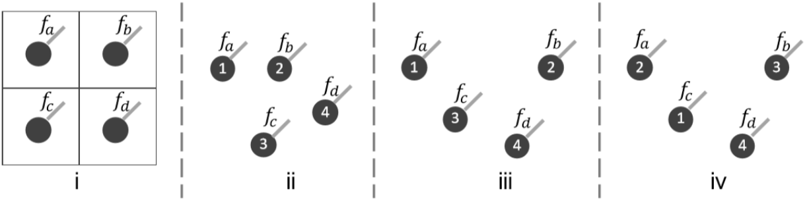
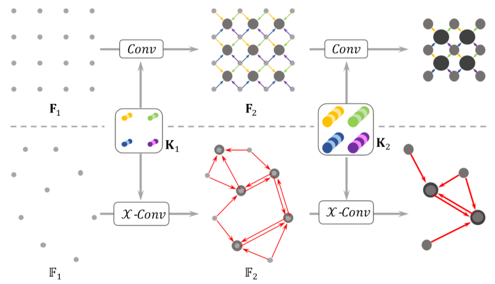

# PointCNN复现


## 参考资料

深度学习在几何空间中的应用（一）：三维可视化

https://www.dazhuanlan.com/2019/12/16/5df6f8d0ca96b/?__cf_chl_jschl_tk__=f6d9963843a503edc4a0159d755b2d441ae8599a-1601360929-0-AfNIA_X3I5szE75ugdMZZQ850ebU8uURPFkvU2rUtbEyMwCm_lp1BKJFQJQxqVnvQkzA-JhMV-PknvjH33kaQczbIVGuKb4hLzhRA9C8k6EaKONxlG9_ndkB-tUB59VP_i90F8tU2UKP0-P4kcx96J4fIhyGvsReRXM5Ki4ByRT4uErc1Tiz-jKvKRbc4o2jRyLnNaOjtCjRsdm5nhpu1aOgHiupaLyrkI7lttPf7eJEEQCyOMThbRI9iLGH8Y3-WHDY93oaCTzlLffhvMhBHT2hBtOCbQEoxgn_13cn_MS1QLW7VHQGbsaOF7XMEMUo1A


h5py快速入门指南 https://segmentfault.com/a/1190000016670881

3D点云深度学习PointNet源码解析——数据预处理 http://www.manongjc.com/article/27424.html

用modelnet40_ply_hdf5_2048数据集制作txt点云数据集（抽取特定类别）https://blog.csdn.net/qq_38139159/article/details/89482857

## 问题及解决方案

1. No module named 'h5py'

```
pip3.6 install h5py
```


2. 要以不安全的方式连接至 shapenet.cs.stanford.edu，使用“--no-check-certificate”

```
https://shapenet.cs.stanford.edu/media/modelnet40_ply_hdf5_2048.zip
```


3. H5pyDeprecationWarning: The default file mode will change to 'r' (read-only) in h5py 3.0. To suppress this warning, pass the mode you need to h5py.File(), or set the global default h5.get_config().default_file_mode, or set the environment variable H5PY_DEFAULT_READONLY=1. Available modes are: 'r', 'r+', 'w', 'w-'/'x', 'a'. See the docs for details.
   f = h5py.File(h5_filename)

```
f = h5py.File(h5_filename)
改为
f = h5py.File(h5_filename,'r')
```


4. invalid index of a 0-dim tensor. Use `tensor.item()` in Python or `tensor.item<T>()` in C++ to convert a 0-dim tensor to a number

```
报错原因分析:
train_loss += loss.data[0] 是pytorch0.3.1版本代码,在0.4-0.5版本的pytorch会出现警告,不会报错,但是0.5版本以上的pytorch就会报错,总的来说是版本更新问题.

解决方法:

#将原语句：
train_loss+=loss.data[0]

#修改为：
train_loss+=loss.item()
```


5. mayavi

```
sudo apt-get install mayavi2
pip3.6 install mayav
```


6. Could not import backend for traitsui.  Make sure youhave a suitable UI toolkit like PyQt/PySide or wxPython installed.

```
sudo apt-get install python3-pyqt5  
sudo apt-get install vtk7			#似乎没有效果
sudo apt-get install python3-traits
pip3.6 install mayavi

解决方案：
pip3.6 install PyQt5
sudo apt-get install libxcb-xinerama0
```


---

# PointCNN: Convolution On X-Transformed Points


## 摘要

​	我们为从点云中学习特征提供了一个简单而通用的框架。CNNs成功的关键是卷积算子，它能够（ is capable of ）利用（leveraging）网格（如图像）中密集表示的数据的空间局部（ spatially-local ）相关性。然而，点云具有不规则性和无序性，直接将核卷积到与点相关的特征上会导致形状信息的丢失（desertion）和点排序的方差变动。为了解决这些问题，我们提出了从输入点学习一种$\mathcal{X}$-变换，以同时（simultaneously）促进两个原因：满足与点相关的输入特征的权重；将点排列成潜在的正则次序。然后将典型卷积算子的元素积(product)和(sum)运算应用于$\mathcal{X}$-变换特征。该方法是对典型 CNN 的一种推广，用于从点云进行特征学习，因此我们称之为 *PointCNN*。实验表明，在多个具有挑战性的基准数据集和任务上，PointCNN 达到了与最新方法相当或更好的性能。


---

## 1. 简介

​	空间局部相关性（Spatially-local correlation）是各种数据的普遍特性（ubiquitous property），它与数据表示无关（ independent ）。对于在常规域中表示的数据（例如图像），卷积算子已经被证明是有效的，它可以有效地利用这种相关性，这是CNNs在各种任务上取得成功的关键因素[25]。然而，对于不规则无序的点云数据，卷积算子不适合利用数据中的空间局部相关性。



**Fig 1. 规则网格(i)和点云(ii-iv)的卷积输入.**  在**(i)**中，每个网格单元都与一个要素相关联。在**(ii-iv)**中，类似于**(i)**中的局部块，这些点被从每个局部邻域中所采样，并且每个点都与一个特征、一个顺序索引和坐标相关联。

​	我们在 **Fig 1** 中说明了在点云上应用卷积的问题和挑战。假设在所有情况 **(i)—(iv)** 中，$C$-维输入特征的无序集是相同的$\mathbb{F}=\{f_a, f_b, f_c, f_d\}$，我们有一个形状为 $4×C$ 的核 $K=[K_α, K_β, K_γ, K_δ]^T$。

​	在 **(i)** 中，通过遵循规则网格结构给出的正则次序，可以将局部2×2块中的特征转换（cast）为形状为 $4×C$ 的 $[f_a, f_b, f_c, f_d]^T$，与 $K$ 卷积，得到$f_i={Conv}(\mathbf{K}, [f_a, f_b, f_c, f_d]^T)$ ，其中${Conv}(.,.)$ 只是一个元素积操作，后面跟一个 $sum^2$。

​	在 **(ii),(iii)**和**(iv)** 中，这些点是从局部邻域采样的，因此它们的顺序可能是任意的。按照图中所示的顺序，输入特征集 $\mathbb{F}$ 可以转换成 **(ii)** 和 **(iii)** 中的$[f_a, f_b, f_c, f_d]^T$，和 **(iv)** 中的$ [f_c, f_a, f_b, f_d]^T$ 。基于此，如果直接应用卷积算子，三种情况下的输出特征可以如 $Eq. 1a$ 所示进行计算。注意，在全部情况下$f_{ii}\equiv f_{i ii}$ 都存在，而 $f_{iii}\neq f_{iv}$ 则只在大多数情况下存在。这个例子说明了直接卷积导致丢弃形状信息（即$f_{ii}\equiv  f_{iii}$ ），同时保留顺序的方差（即$f_{iii}\neq f_{iv}$）。
$$
\begin{aligned}
f_{i i} &=\operatorname{Conv}\left(\mathbf{K},\left[f_{a}, f_{b}, f_{c}, f_{d}\right]^{T}\right) \\
f_{i i i} &=\operatorname{Conv}\left(\mathbf{K},\left[f_{a}, f_{b}, f_{c}, f_{d}\right]^{T}\right) \\
f_{i v} &=\operatorname{Conv}\left(\mathbf{K},\left[f_{c}, f_{a}, f_{b}, f_{d}\right]^{T}\right)
\end{aligned}\tag{1a}
$$

​	本文提出用多层感知器学习 $K$ 个输入点 $(p_1,p_2,…,p_K)$ 坐标的$K×K$ 的 $\mathcal{X}$-变换，即$\mathcal{X}=MLP(p_1,p_2,…,p_K)$。我们的目标是使用它同时加权和置换输入特征，然后对转换后的特征应用典型的卷积。我们将这个过程称为 $\mathcal{X}-Conv$，它是 **PointCNN** 的基本构建块。图1中 **(ii)、(iii)** 和 **(iv)** 的 $\mathcal{X}-Conv$ 可表示为 $Eq. 1b$ ，其中 $\mathcal{X}$ 为 4×4 矩阵，因为图中 $K=4$ 。注意，由于 $\mathcal{X}_{ii}$ 和 $\mathcal{X}_{iii}$ 是从不同形状的点学习的，因此它们可以不同，以便相应地加权输入特征，并实现$f_{ii}\neq f_{i ii}$ 。对于 $\mathcal{X}_{iii}$ 和 $\mathcal{X}_{iv}$ ，如果学习到满足 $\mathcal{X}_{i i i}=\mathcal{X}_{i v} \times \Pi$ ，其中 $\Pi$ 是将 $(c,a,b,d)$ 置换成 $(a,b,c,d)$ 的置换矩阵，则可以得到 $f_{iii}\equiv f_{iv}$ 。

$$
\begin{aligned}
f_{i i} &=\operatorname{Conv}\left(\mathbf{K}, \mathcal{X}_{i i} \times\left[f_{a}, f_{b}, f_{c}, f_{d}\right]^{T}\right) \\
f_{i i i} &=\operatorname{Conv}\left(\mathbf{K}, \mathcal{X}_{i i i} \times\left[f_{a}, f_{b}, f_{c}, f_{d}\right]^{T}\right) \\
f_{i v} &=\operatorname{Conv}\left(\mathbf{K}, \mathcal{X}_{i v} \times\left[f_{c}, f_{a}, f_{b}, f_{d}\right]^{T}\right)
\end{aligned}\tag{1b}
$$

​	从 **Fig 1** 中的示例分析可以清楚地看出，通过完美的 $\mathcal{X}$-变换，$\mathcal{X}-Conv$ 能够考虑点形状，同时对排序保持不变。在实践中，我们发现所学的 $\mathcal{X}$-变换远不是理想的，特别是在置换等价方面。然而，使用 $\mathcal{X}-Conv$ 构建的 **PointCNN** 仍然显著优于在点云上直接应用典型卷积，并且与为点云输入数据设计的最先进的神经网络（如PointNet++[35]）相当或更好。

​	**Section 3** 包含了 $\mathcal{X}-Conv$ 以及 **PointCNN** 架构的详细信息。我们在**Section 4** 用详细的实验展示了我们在多个具有挑战性的基准数据集和任务上的结果，并进行了可视化以更好地理解**PointCNN**。


---

## 2. 近期工作

### 2.1. 规则域的特征学习

Feature Learning from Regular Domains.

​	CNNs 已经非常成功地利用（leveraging）了图像中的空间局部相关性 — 二维规则网格中的像素[26]。已经有工作将 CNNs 扩展到更高维的规则域，例如3D体素[52]。然而，由于输入核和卷积核都是高维的，计算量和内存量都会急剧增加。基于八叉树[37，47]、Kd-Tree[22]和Hash[41]的方法已经被提出，通过在空白空间跳过卷积来节省计算量。在[13]中，激活保持稀疏，以保持卷积层的稀疏性。[17] [4]将点云划分为网格，分别用网格平均点和 Fisher 向量表示每个网格，并用三维核进行卷积。在这些方法中，内核本身仍然是**高密度**和**高维**的。文献[28]提出了稀疏核，但这种方法不能递归地用于学习层次特征。与这些方法相比，**PointCNN** 在输入表示和卷积核上都是稀疏的。


---

### 2.2. 不规则域的特征学习

Feature Learning from Irregular Domains.

​	受三维传感技术的飞速发展和需求的推动，三维点云特征学习的研究取得了一些进展。PointNet[33] 和 Deep Sets[58] 提出通过在输入上使用**对称函数**来实现**输入顺序不变性**。PointNet++[35] 和 sonet[27] 将 PointNet 分层地（ hierarchically ）应用以便更好地捕捉局部结构。在文献[42]中提出了 **Kernel correlation** 和 **graph pooling** 来改进 **PointNet-like** 方法。**RNN** 在[18]中用于处理由有序点云切片聚合而成的特性。[50] 提出在点空间和特征空间中利用邻域结构。虽然这些基于对称池的方法，以及[10，58，36]中的方法在实现**顺序不变性**方面有保证，但它们会带来**丢失信息**的代价。[43，3，44] 建议首先将特征“插值”或“投影”（ “interpolate” or “project” ）到预定义的规则域中，在这些域中可以应用典型的CNN。相反，正则域在我们的方法中是潜在的。在文献 [48,14,53] 中，CNN 核被表示为邻域点位置的参数函数来推广 CNN。在这些方法中，与每个点相关的核都被单独地参数化，而我们的方法中的 $\mathcal{X}$-变换是从每个邻域中学习的，因此可能更适合于局部结构。除了点云之外，不规则域中的稀疏数据也可以表示为图形或网格，并且已经提出了一些从这些表示中进行特征学习的工作 [31,55,30]。我们请感兴趣的读者参考[5]，以全面了解这些方向的工作。在[46]中，用局部图上的图谱卷积来处理点云。


---

### 2.3. 不变与等变

Invariance vs. Equivariance.

​	一系列旨在实现等变，以解决在实现不变性时池化的信息丢失问题[16,40]的开创性工作，已经被提出。理想情况下，我们公式中的 $\mathcal{X}$-变换能够实现等变，并且在实践中被证明是有效的。我们还发现了 **PointCNN** 和空间变换器网络[20] 之间的相似之处，因为它们都提供了一种机制，可以将输入“转换”为潜在的规范形式，以便进一步处理，在执行规范化时没有显式的损失或约束。在实践中，事实证明，网络找到了利用该机制更好地学习的方法。在 **PointCNN** 中，$\mathcal{X}$-变换被假定为同时用于加权和置换，因此被建模为一个通用矩阵。这与文献[8] 不同，其中置换矩阵是期望的输出，并由双随机矩阵近似。


---

## 3. PointCNN

​	卷积的分层（ hierarchical ）应用对于通过 CNNs 学习层次表示是必不可少的。**PointCNN** 共享相同的设计并将其推广到点云。首先，我们在 **PointCNN** 中引入了层次卷积，类似于图像CNN，然后我们详细解释了核心 $\mathcal{X}-Conv$ 算子，最后给出了针对各种任务的 **PointCNN** 体系结构。


---

### 3.1. 层次卷积



**Fig 2. 规则网格（上）和点云（下）上的层次卷积。**在规则网格中，卷积递归地（recursively）应用于局部网格块，这通常会降低网格分辨率 $(4 \times 4 \rightarrow 3 \times 3 \rightarrow 2 \times 2)$，同时增加了通道数（点的厚度）。类似地，在点云中，$\mathcal{X}-Conv$ 递归地应用于“投影”或“聚合”，将来自邻域的信息分成较少的代表点$(9 \rightarrow 5 \rightarrow 2)$，但每个点都具有更丰富的信息。

---

​	在我们介绍 **PointCNN** 中的层次卷积之前，我们将简要介绍一下它对于规则网格的著名版本，如**Fig 2** 所示。基于网格的 CNNs 的输入是形状为 $R_1×R_1×C_1$ 的特征图 $F_1$，其中 $R_1$ 为空间分辨率，$C_1$为特征通道深度。将形状为 $K×K×C_1×C_2$ 的核 $K$ 与 $F_1$ 中 $K×K×C_1$ 的局部块进行卷积，得到 $R_2×R_2×C_2$ 形状的特征映射 $F_2$。注意 **Fig 2** 中，$R_1=4，K=2，R_2=3$。与 $F_1$ 相比，$F_2$ 通常具有较低的分辨率 $(R_2<R_1)$ 和较深的信道 $(C_2>C_1)$，并且编码更高层次的信息。这一过程是递归应用的，生成的特征地图的空间分辨率在下降（ **Fig 2** 中为 $4 \times 4 \rightarrow 3 \times 3 \rightarrow 2 \times 2$），但通道更深（**Fig 2** 中的点越来越厚）。

​	**PointCNN** 的输入是 $F1=\{（p1，i，F1，i）：i=1,2，…，N1\}$，即一组$\{p1，i:p1，i∈R^{Dim}\}$，每个点都与一个特征$\{F1，i:F1，i∈R^{C1}\}$。在基于网格的CNNs的层次结构的基础上，我们用$x-convon$ $f1$来获得更高层次的表示$F2=\{（p2，i，F2，i）：F2，i∈R^{C2}，i=1,2，…，N2\}$，其中${p2，i}$是${p1，i}$的一组代表点，而F2的空间分辨率和特征通道比f1小，即N2<N1，C2>C1。当递归地应用将F1转换为F2的$X-Conv$过程时，具有特征的输入点被“投影”或“聚集”成更少的点（图2中的9→5→2），但每个点的特征都越来越丰富（下图2中的点越来越粗）。


​	我们提出了PointCNN，它是CNN的一种概括，可以利用点云中表示的数据利用空间局部相关性。PointCNN的核心是X-Conv运算符，它在通过典型卷积处理输入点和要素之前对其进行加权和置换。 虽然经验证明X-Conv在实践中是有效的，但是对其进行严格的理解，尤其是在将其组合到深度神经网络中时，仍然是未来工作的未解决问题。 研究如何将PointCNN和图像CNN组合在一起以共同处理成对的点云和图像（可能在早期阶段）也很有趣。 


## 讲座

​	点云无序性 收到采集设备和坐标系的影响

同一个目标物体 不同设备或不同位置扫描，三维点的排列顺序是千差万别的

假设点云中有n个三维点，全排列有n!个结果。


​	点云具有稀疏性，在机器人和自动驾驶环境中，

不像rgb图像那样稠密

如果把点投影到rgb图上 只有3%能对应上


​	点云信息量十分有限，一些三维空间的点坐标构成的点集，本质就是对三维世界几何形状的低分辨率的重采样，只能提供片面的几何信息。


​	导致不能直接使用常规的学习方法来学习特征，比如图像上的滑动窗口卷积操作啊这类的一些。


### Related Work

​	设置很多不同视角的RGB的摄像头，对三维


#### Point

​	输入之后的旋转的模型造成的扰动，再继续后续操作


​	这是pointnet基础架构，在输入点云会进行一次input的转换，将点的信息进行升维。升维嵌套多层MLP，最后到1024维，然后运用对称函数的思想进行max pooling ，解决点云的无序性。 根据最后输出进行分类。

​	每个点本身的信息 和 模型的全局信息，然后进行升维，然后得到每一个点的分类，然后变成分割网络。


​	局限性： 每个点的操作都是独立，MLP都是针对单个点进行，每个点获取不到周围点的信息。

2. 如果模型进行平移，每一个点坐标变换比较大，不能保证平移不变性。


#### PointnNet++

​	每个点的周围进行K近邻的查找，每个点就带上了周围点的contast信息。

​	在查找到K近邻之后，所有点的坐标减去中心点的坐标，来保证平移不变性


逐渐进行降维 ，跟一个全连接，softmax进行分类，


#### PointCNN

​	图像卷积转移到对点云的处理上来。每一个点包含周围点的一些信息。

​	

​	排列顺序一样，但是所含的信息不同。

​	

​	所含信息（形状和特征）一样，但是排列顺序不同


​	做一个运算，将排列顺序相等起来。


​	这个矩阵学到了，如何从点云中提取特征的权重。


​	

​	不同的结构相同的顺序，经过变换后，两个特征不同。

​	相同的结构不同的顺序，经过变换后，两个特征相同。


​	可以变换成二维图像来操作。


​	在中心点得到k近邻之后，用周围点信息减去中心点，得到一个局部坐标系，避免整体变换影响局部的变换.


​	把点云数据可以近似看做图像处理. 带有局部特征的一个点 映射到更高维特征.


​	同样的点的一个k近邻, 可以近似的认为,

​	实际场景中,点云的输入

​	

​	同一个色块，同一个点的k近邻不同的分布。

