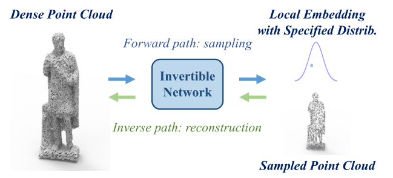
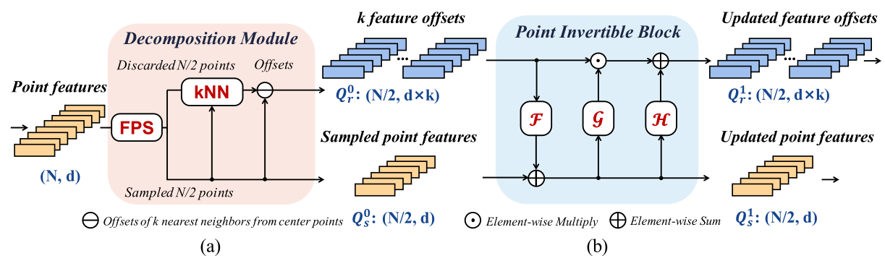
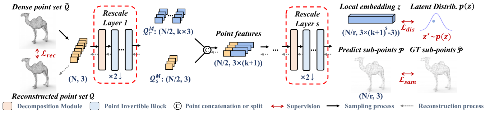
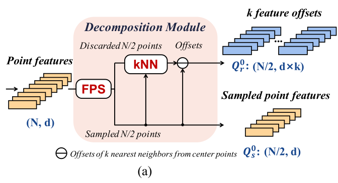
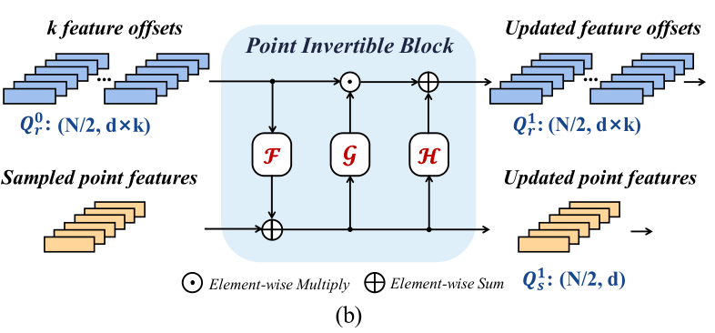
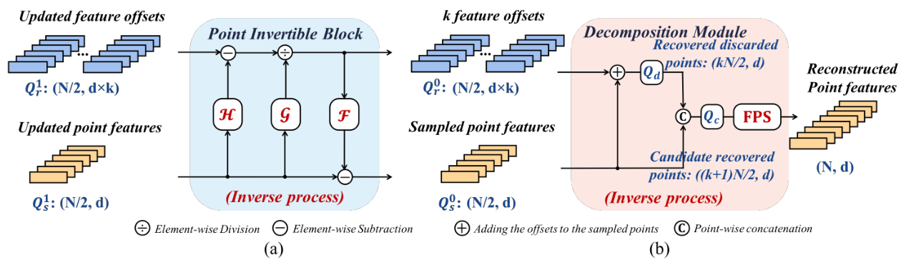

# PointLIE Locally Invertible Embedding for Point Cloud Sampling and Recovery

IJCAI 2021

国际人工智能联合会议

## Abstract

点云采样和恢复（PCSR）对于大规模实时点云收集和处理至关重要，因为原始数据通常需要大量存储和计算。 在本文中，我们解决了 PCSR 中的一个基本问题：如何对任意尺度的密集点云进行下采样，同时以与案例无关的方式（即，无需额外存储点关系）保留丢弃点的局部拓扑？ 

我们提出了一种新颖的局部可逆嵌入，用于点云自适应采样和恢复（PointLIE）。PointLIE 不是以一种看似合理的方式学习和预测底层几何细节，而是通过双向学习(bi-directional learning)将点云采样和上采样统一到一个单一的框架中。

具体来说，PointLIE 在每个尺度上递归地采样和调整相邻点。然后它将采样点的**相邻偏移量**编码到潜在空间，从而将**采样点与相应的局部几何关系解耦**。一旦确定了潜在空间并优化了深度模型，就可以通过可逆操作将恢复令人愉悦的采样点和随机绘制的嵌入传递到同一网络来进行恢复过程。

这样的方案可以保证从采样点恢复密集点的保真度。大量实验表明，所提出的 PointLIE 在数量和质量上都优于最先进的技术。

## 1. Introduction

在点云研究中，单轨任务在更好地压缩或上采样输入点云方面取得了重大进展

然而，由于以下几个原因，双向 PCSR 仍然具有挑战性：（1）传统方法通过逐渐稀疏来压缩点云。**全局几何配置在中间过程中丢失**，使得中间结果对下游应用程序无用且不可见；(2) 数据点之间的关系需要巨大的存储空间。(3) 由于局部结构信息的丢失，简单的上采样方法通常会产生不令人满意的恢复性能。

在降尺度阶段，PointLIE 可以生成具有任意尺度的可视和可恢复的子点云，同时**递归地保留丢弃点的局部偏移**。当需要点云恢复时，这些采样的子点可以用来更精细地重建原始密集点云。 受到两种生成模型中广泛使用的可逆神经网络 (INN) 的启发 [Dinh et al., 2014; 金马和达里瓦尔，2018 年； 贝尔曼等人，2019 年；  Chen et al., 2019] 和分类任务 [Gomez et al., 2017]，我们设计了一个基于 INN 的学习框架来减少点间关系的存储需求。更具体地说，它明确地将上述缺失点的局部拓扑嵌入到一个潜在变量中，**该变量被约束为遵循指定的分布**。因此，它可以简单地通过直接采样随机绘制的潜在变量并与采样的子点一起遍历网络的逆向通道来生成忠实的密集点云。

实际上，PointLIE 包含一个 Decomposition Module 和几个 Point Invertible Blocks 。前者将输入点特征转化为采样点特征和丢弃点的偏移残差。在此之后，点特征的数量减少到一半，而通道的维度通过**高阶偏移**（即，点特征相互减去）进行扩展。通过应用精心设计的交叉连接架构，Point Invertible Blocks 可以进一步表征采样特征与其在每个采样尺度中的残差偏移之间的相互作用。

按照上述递归过程，网络可以将每个下采样尺度中包含的所有偏移信息编码为局部可逆嵌入。在训练阶段，我们通过使用分布拟合损失强制这种可逆嵌入符合预先指定的分布（例如，各向同性高斯）。由于 PointLIE 的完全可逆性质，恢复过程可以通过逆向通过 PointLIE 进行，如图 1 中的绿色箭头所示。

本文的主要贡献是三个方面。  1) 据我们所知，这是第一个采用 INN 在 PCSR 任务的工作。 一个新颖的 PointLIE 方案提出**通过双向学习将采样和上采样流建模到同一个网络中**。  2）我们引入了一个  Decomposition Module 和 Point Invertible Blocks 来解耦采样点表示和每个下采样尺度中相应的局部邻居的偏移量。 同时，提出了递归可逆嵌入将局部邻居的偏移量转换为满足特定分布的潜在变量。  3）大量实验表明，PointLIE 在数量和质量上都优于最先进的点云采样和上采样方法。

## 2. Related Work

## 3. Methods

**Fig. 1** Illustration of our PointLIE. 它将采样和重建过程合并到同一个网络中，其中前向路径将密集点云转换为稀疏点云和与案例无关的潜在变量。 在重建的反向路径中，随机绘制的变量和自适应采样的点云被重建为密集的。

### 3.1. Task Overview

给定一个密集点集 $ \hat{\mathcal{Q}}=\left\{\hat{q}_{i}\right\}_{i=1}^{N} $ ，具有比例因子 $r$ 的点云采样和恢复 (PCSR) 的目标是自适应地将其采样为稀疏子点云 $ \mathcal{P}=\left\{p_{j}\right\}_{j=1}^{N / r} $ 没有任何额外的保存，然后从稀疏的子点云中恢复密集点云 $ \mathcal{Q}=\left\{q_{i}\right\}_{i=1}^{N} $。

为了实现上述目标，提出了 PointLIE，如 Fig. 1 所示。前向路径将密集点云输入分解为采样点 $ \mathcal{P}$ 和包含采样期间丢失的几何信息的局部可逆嵌入 $z$。

由于 PointLIE 的可逆性质，逆路径可以通过向后运行 PointLIE 来无损失的重建忠实的 **faithful** 密集点云。整个过程被表述为， 
$$
\begin{equation}
 f_{\theta}(\hat{\mathcal{Q}})=(\mathcal{P}, z) ,\quad  \text{s.t.} \quad  z \sim p(z) \\
 
 f_{\theta}^{-1}\left(\mathcal{P}, z^{\star}\right)=\mathcal{Q}, z^{\star} \sim p(z) 
\end{equation}
$$
其中 $ f_{\theta}(\cdot) $ 表示我们模型的前向路径，$z$ 是在前向过程中生成的局部可逆嵌入，它遵循特定的分布 $ p(z) $。
   请注意，这里 $ z \sim p(z) $ 是 case-agnostic 条件不可知，而不是 case-specific 条件确定 ($ z \sim p(z \mid \mathcal{P}) $)。因此，采样后不需要存储 $z$，我们可以随机绘制一个嵌入 $ z^{\star} $ 来自反向路径中的分布 $ p(z) $。$ \mathcal{P} $ 和 $ z^{\star} $ 用于通过逆过程 $ f_{\theta}^{-1}(\cdot) $) 重建忠实的 $ \mathcal{Q} $。

---

### 3.2. Invertible Architecture

**Fig. 2** **The internal structure of the Decomposition Module and Point Invertible Block**. (a) illustrates the Decomposition Module, 它将原始点特征解耦为采样点特征并偏移到相邻点特征. (b) shows the Point Invertible(PI) Block, 它将采样点的偏移量和特征更新为新的对应点.

**Fig. 3**  **Illustration of the overall pipeline of PointLIE**. 黑色实线和灰色虚线箭头分别表示采样和重建的流程。 在采样路径中，由相邻特征的偏移量表示的丢失信息通过经过 s 个 Rescale Layers 被编码为遵循分布 p(z) 的潜在变量 z，其中每个 Rescale Layer 由一个 Decomposition Module 和几个 Point Invertible Blocks 组成 并对设置的点进行一半采样。 可以通过逆向操作实现重构。

为了实现可逆操作，我们首先通过堆叠 Decomposition Module 和 $M$ 个 Point Invertible Blocks（PI Blocks）来构建一个 Rescale Layer，如 Fig. 2 所示。当处理具有比例因子 $r$ 的 PCSR 时，我们堆叠 s 个 Rescale 层（ $ \mathrm{s}=\left\lfloor\log _{2} r\right\rfloor $ ) 获得 PointLIE 的整个框架，如图 3 所示。

#### **Decomposition Module**

如图 Fig. 2(a) 所示，在采样过程中，Decomposition Module 旨在将丢弃点中丢失的几何信息与采样点分开。具体来说，对于形状为 $(N,d)$ 的输入点特征，我们首先进行最远点采样（FPS）以选择 $N/2$ 个点，而剩余的 $N/2$ 个点被视为丢弃点。为了使网络保留丢弃点中的信息，对于每个采样点 $ q_{i} \in \mathcal{Q}_{s} $ ，我们在丢弃点中找到它的 $k$ 个最近邻居，并将从 $q_i$ 到其邻居的空间偏移表示为 $ \mathcal{Q}_{r} $。这里我们使用**偏移量而不是其邻居的空间坐标**，**因为深度神经网络更有能力学习残差**，**并且也更容易使残差遵循各向同性高斯分布**。Decomposition Module 输出特征的两个分支，即形状为$ (N / 2, d \times k) $的  $k$ 个特征偏移 $ \mathcal{Q}_{r}^{0} $ 和形状为 $ (N / 2, d) $ 的采样点特征 $ \mathcal{Q}_{s}^{0} $。

#### Point Invertible Block

为了进一步表征前向路径中两个分支的表示，我们设计了一个 PI blocks 来更新特征，其灵感来自生成模型中的耦合层 [Dinh et al., 2014;  Dinh 等人，2016 年]。如 Fig. 2(b) 所示，每个 PI blocks 以两个分支作为输入（即 $1/2$ 采样点特征 $ \mathcal{Q}_{s}^{l} $ 及其kNN偏移量 $ \mathcal{Q}_{r}^{l} $ ）并生成更新的特征 $ \mathcal{Q}_{s}^{l+1} $ 和偏移量 $ \mathcal{Q}_{r}^{l+1} $ 由 Eq. (3) (4),

$$
\begin{equation}
 \mathcal{Q}_{s}^{l+1}=\mathcal{Q}_{s}^{l} \odot \exp \left(\mathcal{Q}_{r}^{l}\right)+\mathcal{F}\left(\mathcal{Q}_{r}^{l}\right) \\
 \mathcal{Q}_{r}^{l+1}=\mathcal{Q}_{r}^{l} \odot \exp \left(\mathcal{G}\left(\mathcal{Q}_{s}^{l+1}\right)\right)+\mathcal{H}\left(\mathcal{Q}_{s}^{l+1}\right) 
\end{equation}
$$
其中 $l$ 表示通过第 $l$ 个PI 块，$F、G、H$ 是三个独立的非线性变换。我们使用几个堆叠的 conv1d 和 $F、G$ 的非线性激活，以及 [Patch-based progressive 3d point set upsampling, 2019] 中的密集特征提取器用于 $H$。请注意，PI 块只会逐渐增强采样特征和相邻偏移的表示，而每个 PI 块的输入和输出**形状保持不变**。

#### Recursive Offset Residue Embedding

**Fig. 3**  **Illustration of the overall pipeline of PointLIE**. 黑色实线和灰色虚线箭头分别表示采样和重建的流程。 在采样路径中，由相邻特征的偏移量表示的丢失信息通过经过 s 个 Rescale Layers 被编码为遵循分布 p(z) 的潜在变量 z，其中每个 Rescale Layer 由一个 Decomposition Module 和几个 Point Invertible Blocks 组成 并对设置的点进行一半采样。 可以通过逆向操作实现重构。

**Fig. 3** 说明了 PointLIE 用于 PCSR 任务的整体双向流水线。 通过堆叠 $s$ 个rescale layers，其中每个层都包含一个 Decomposition Module 模块和 M 个 PI 块，我们为具有任意尺度的 PCSR 构建了一个层次结构。对于每个重缩放层，将形状为 $(N,d)$ 的点特征作为输入，它将生成一个 $(N/2,d)$ 采样特征和 $(N/2,k ×d)$ 个对 $k$ 个邻居的特征偏移。

在此之后，进行**通道维度串联** (channel-dimension concatenation) 以合并采样特征及其相邻偏移以生成新的点特征。这些 “高阶”  **’higher-order’**  点特征将继续用作下一个重新缩放层的输入。因此，最终的嵌入可以**递归地扩展为一系列高阶偏移**。由最后一个 Rescale Layer 生成的 $ \mathcal{Q}_{S}^{M} $ 和 $ \mathcal{Q}_{r}^{M} $ 被视为自适应采样的子点云 $ \mathcal{P} $ 和嵌入 $z$。 为了充分说明递归偏移嵌入的过程，我们进一步提出了 r = 4 和 k = 1 的PCSR 的一个特殊情况（即，包括正向和反向数据流），在补充材料中。

#### Inverse Reconstruction Process

为了重建原始密集点集，我们使用自适应采样点集 $ \mathcal{P} $ 和随机绘制的嵌入 $ z^{\star} \sim p(z) $ 作为 PointLIE 反向路径的两个输入分支（即 rescale layer $s, s−1, ..., 1$），如 **Fig. 3** 中的灰色箭头所示。在每个重新缩放层中，它们也将反向流动（即 PI 块 $M, M − 1, ..., 1,$ 分解模块​）。

**Fig. s2** The reverse flow of the Point Invertible Block and the Decomposition Module.  (a) 说明了 Point Invertible (PI) Block 的逆路径，它从 $ \mathcal{Q}_{r}^{l+1} $ 和 $ \mathcal{Q}_{s}^{l+1} $ 恢复偏移特征 $ \mathcal{Q}_{r}^{l} $ 和采样点特征 $ \mathcal{Q}_{s}^{l} $ ，其中 $l$ 表示第 $l$ 个 PI Block  .  (b) 表示Decomposition Module的逆向路径，将偏移量加到它们对应的采样点上，重构出 $ (k+1) N / 2 $ 个候选点 $ \mathcal{Q}_{c} $，然后通过 FPS 选择其中的 $ N $ 个作为重构的 $×2$ 点 通过这个重新缩放层。

PI Blocks和分解模块的逆运算如 **Fig. s2** 补充图所示。在反向路径中，第 $(l + 1)$ 个 PI 块旨在恢复第 $l$ 个块中的相邻偏移 $ \mathcal{Q}_{r}^{l} $ 和采样特征 $ \mathcal{Q}_{s}^{l} $。 考虑具有形状 $(N,k × d)$ 和 $(N,d)$ 的输入 $ \mathcal{Q}_{r}^{l+1} $ , $ \mathcal{Q}_{s}^{l+1} $，Eq. (3)(4)的逆过程可以表示为，
$$
\begin{equation}
 \begin{aligned} \mathcal{Q}_{r}^{l} &=\left(\mathcal{Q}_{r}^{l+1}-\mathcal{H}\left(\mathcal{Q}_{s}^{l+1}\right)\right) \odot \exp \left(-\mathcal{G}\left(\mathcal{Q}_{s}^{l+1}\right)\right) \\ \mathcal{Q}_{s}^{l} &=\left(\mathcal{Q}_{s}^{l+1}-\mathcal{F}\left(\mathcal{Q}_{r}^{l}\right)\right) \odot \exp \left(-\mathcal{Q}_{r}^{l}\right) \end{aligned} 
\end{equation}
$$
反向通过 M 个PI块后，输出 $ \mathcal{Q}_{r}^{0}, \mathcal{Q}_{s}^{0} $ 将反向流入 decomposition module。详细地说，$ \mathcal{Q}_{r}^{0} $ 将沿通道维度均匀地分裂为 k 个偏移矩阵 $ \left\{Q_{r}^{(i)}\right\}_{i=1}^{k} $，其中形状为 $ (N, d) $ 的 $ Q_{r}^{(i)} $ 表示对中每个点的第 $i$ 个最近邻点的偏移量 $ \mathcal{Q}_{s}^{0} $ 在丢弃的点。 然后将在每个 $ Q_{r}^{(i)} $ 和 $ \mathcal{Q}_{s}^{0} $ 之间分别进行元素相加，获得形状为 $ (k N, d) $ 的回收丢弃点 $ \mathcal{Q}_{d} $ 的特征。$ \mathcal{Q}_{d} $ 将以逐点的方式与 $ \mathcal{Q}_{s}^{0} $ 连接以形成具有形状 $ ((k+1) \times N, d) $的候选恢复点集 $ Q_{c} $，其 $d$ 中的前三个维度记录空间坐标。 为了保证重建点的一致性，我们使用 FPS 根据它们的坐标从 $ Q_{c} $ 中选择 $2N$ 个点特征。

类似地 Analogously，这些 ×2 重建的点特征将被均匀地分成 $(k + 1)$ 部分，其中第一部分和剩余的 $k$ 部分分别作为采样点特征 $ \mathcal{Q}_{s}^{M} $ 和相邻偏移量 $ \mathcal{Q}_{r}^{M} $。 然后，它们将被送入下一个反向重新缩放层以进行另一个×2 重建。 在 **Theorem 1** 的支持下，可以逐步重建忠实的密集点云。 证据在补充材料中提供。

#### Theorem 1.

假设生成的可逆局部嵌入 $z$ 服从潜在分布 $ p(z) $。 在恢复过程中，通过从 $ p(z) $ 随机抽样 $ z^{\star} $ 并通过反向路径，重建的密集点云 $ \mathcal{Q} $ 将必然符合真实点云 $ p(\hat{\mathcal{Q}}) $ 的分布。

---

### 3.3. Training Objectives

为了改善自适应采样点集的重建结果，我们的 PointLIE 对密集点云 $ \hat{\mathcal{Q}} $ 和采样点云 $ \mathcal{P} $ 之间的双向变换进行建模，具有潜在分布 $ p(z) $。 因此，总损失包含以下部分。

#### Sparse Point Sampling Loss

由于生成的采样点云 $ \mathcal{P} $ 不是 $ \hat{\mathcal{Q}} $ 的子集，我们采用 Earth Mover 的距离损失 (EMD) [Fan et al., 2017] $ \mathcal{L}_{\text {sam }} $ 来限制 $ \mathcal{P} $ 接近原始点云。

#### Dense Point Reconstruction Loss

为了重建更精细的结果，除了使用 EMD 损失来限制预测的几何细节外，重建的点集 $ \mathcal{Q} $ 还应该均匀分布在物体表面，因此排斥损失 $ \mathcal{L}_{\text {rep }} $ [Yu et al., 2018] 和均匀损失 $ \mathcal{L}_{\text {uni }} $ 用于均匀分布恢复点 $ \mathcal{Q} $。 所以重建的总损失被公式化为

$$
\begin{equation}
 \mathcal{L}_{\text {rec }}=\lambda_{\text {emd }} \mathcal{L}_{\text {emd }}(\mathcal{Q}, \hat{\mathcal{Q}})+\lambda_{\text {rep }} \mathcal{L}_{\text {rep }}+\lambda_{\text {uni }} \mathcal{L}_{\text {uni }} 
\end{equation}
$$

#### Distribution Fitting Loss

分布拟合损失用于促使生成的局部嵌入 $ f_{\theta}^{z}(\hat{\mathcal{Q}}) $ 的分布接近潜在分布 $ p(z) $，这是重建点集 $ \mathcal{Q} $ 遵循定理 1 中证明的原始密集点集的真实分布 $ \hat{Q} $Q 的充分条件。熵损失 (CE) 用于测量生成的嵌入 $ f_{\theta}^{z}(\hat{\mathcal{Q}}) $ 和 $ p(z) $ 的分布之间的差异。 这里 $ p(z) $ 设置为各向同性高斯分布，

$$
\begin{equation}
 \begin{aligned} \mathcal{L}_{\mathrm{dis}} &=\mathrm{CE}\left[f_{\theta}^{z}[p(\hat{Q})], p(z)\right]=-\mathbb{E}_{f_{\theta}^{z}[p(\hat{Q})]}[\log p(z)] \\ &=-\mathbb{E}_{p(\hat{Q})}\left[\log p\left(z=f_{\theta}^{z}(\hat{Q})\right)\right] \end{aligned} 
\end{equation}
$$

#### Compound Loss

总的来说，我们通过最小化总损失 $\mathcal{L}$ 以端到端的方式训练我们的 PointLIE，

$$
\begin{equation}
 \mathcal{L}=\lambda_{\text {sam }} \mathcal{L}_{\text {sam }}+\lambda_{\text {rec }} \mathcal{L}_{\text {rec }}+\lambda_{\text {dis }} \mathcal{L}_{\text {dis }} 
\end{equation}
$$

## 4. Experiments

### 4.1. Dataset and Metrics

为了全面评估提出的 PointLIE，我们在 PU-147 [Li et al., 2019] 数据集上将我们的方法与最先进的方法进行了比较。 该数据集集成了先前工作中的多个对象（即 PU-Net [Yu et al., 2018] 和 3PU [Yifan et al., 2019] 等），范围从简单平滑的模型（例如，二十面体）到 复杂和高度详细的对象（例如，statute）。 我们按照官方的 120/27 划分来进行训练和测试集。

在实验过程中，我们首先对具有不同比例因子（即 4、8 和 16）和采样模式（即 FPS 和以前可学习的采样方法）的输入点云进行采样。然后，我们将重建结果与地面实况点云进行了比较。 对于这个提议，我们使用**泊松盘采样** (PDS) 方法从每个原始网格中均匀地采样 8192 个点作为我们的基本事实。需要注意的是，在我们的实验中，16x 上采样到 8192 点只需要 512 点作为输入，这比之前工作中 16x 上采样以 5000 点作为输入更具挑战性[Yifan et al., 2019; PUGeo，2020]。

为了定量评估不同方法的性能，我们考虑了三种常用的评估指标，即倒角距离（CD）、豪斯多夫距离（HD）和点到表面距离（P2F）。度量值越低，重建结果越好。

---

### 4.2. Implementation Details

在平衡效率和效果的前提下，我们在 4× 规模任务中设置 PI 块数 $M=8$，其余8×和16×任务中设置 $M=4$。 此外，我们将 $k$ 设置为 3，以确保可以充分保留丢弃点中的信息。该架构的详细信息将在补充材料中显示。

---

### 4.3. Quantitative Results

#### Reconstruct-guaranteed Point Cloud Sampling

在选项卡中。  1 我们将点云重建的结果与最近最先进的方法进行了比较：PU-Net [Yu et al., 2018]、3PU [Yifan et al., 2019] 和 PU-GAN [Li et al., 2019]。  , 2019]。 为了与以前的方法公平比较，我们使用不同的采样模式对输入点云进行采样（即 FPS 和自适应采样方法 [Lang et al.,  Samplenet 2020]）。 所有方法都使用其在 PU-147 上公开发布的代码进行了再培训。

Tab 的上部和下部。 图 1 分别显示了使用 FPS 和可学习采样方法的结果。其中，我们的 PointLIE 在大多数评估指标上取得了最好的结果，尤其是对于大规模 PCSR 任务（×8 和 ×16）。 请注意，PointLIE 实现了比 PCSR 中以前的方法**略高的 P2F 值**，部分原因是我们的采样过程自适应地调整了原始点的坐标，使它们略微偏离表面。 但是，我们可以在大多数情况下获得更令人愉悦的结果，尤其是**对于局部几何细节**。 此外，我们将最吸引人的上采样方法与最先进的自适应采样方法（即 SampleNet）的结果进行了比较。 我们使用了 SampleNet [Lang et al., 2020] 的官方代码，并通过将其与 PU-Net 和 PU-GAN 合并来使用上采样下游任务对其进行训练。

这里我们没有使用 3PU，因为它在训练过程中需要多个 SampleNet。 实验结果表明，SampleNet 无法有效提高重构性能。 因为 PU-147 比他们只有 10 个固定类别的实验数据集 ModelNet10 更难，而且他们的网络倾向于过度记忆有限类别的属性而不是获取局部模式。

#### Point Cloud Upsampling

我们的 PointLIE 还可以用作通用点云上采样框架，通过将稀疏输入馈送到训练模型的逆流中。 为了与之前的上采样方法进行公平比较，我们遵循 [Li et al., 2019] 的实验设置，输入随机采样的 2048/512 点以预测 8192 个密集输出。标签。 图 2 显示了不同吸引方法的定量比较结果。 我们的 PointLIE 在所有评估指标中都取得了可比的结果。 特别是，我们的结果远远超过了之前所有没有对抗性学习的方法（例如，PU-GAN (-)）。PointLIE 在 ×16 任务中甚至优于完整的 PU-GAN。 这个结果证实了 PU-GAN 的性能提升主要来自于鉴别器的引入，而不是模型架构本身，而我们的架构设计对于密集和稀疏输入都可以实现卓越的上采样结果。

### 4.4. Qualitative Results

我们还将我们的定性结果与 PU-Net、3PU 和 PU-GAN 在不同尺度上的点云重建进行了比较。 这里 PU-Net 和 PU-GAN 将 SampleNet 采样的点作为输入。 图 4 显示了 [Kazhdan 和 Hoppe，2013] 的点集恢复和表面重建的视觉结果。 如图 4 所示，其他方法往往会重建更多噪声和不均匀的点集，从而导致重建表面上的更多伪影和模糊性。 具体来说，PointLIE **在重建结果中生成更细粒度的细节，特别是对于局部几何形状**（例如，人手、鸟爪和龙角）。更多的可视化结果显示在补充中。

### 4.5. Ablation Study

为了进一步证明我们提出的框架的有效性，我们为不同的训练模式和数据馈送设计了一个消融研究。 在选项卡中。  3，我们首先在前两行展示没有双向学习（只训练逆过程）产生的结果，这些结果表明在训练过程中只使用逆过程可以不让模型学习重建点云的分布。 然后，我们使用了实验中提到的建议训练策略，在处理随机或均匀采样的点云方面取得了显着的改进。 最后，当我们使用由我们的网络自适应采样的子点集时，实现了进一步的改进。

#### Difference between point cloud upsampling.

虽然我们的 PointLIE 可以在点云上采样上产生令人满意的结果，但我们的主要重点在于如何通过更合适的采样方法为后续任务恢复点云。  PCSR 任务旨在从自适应采样的子点云中恢复点云。

#### Difference between point cloud compression.

我们的任务是点云压缩的一个特殊领域。 以前的点云压缩通过不可见且无意义的潜在代码保留隐藏的结果，这在一定程度上损害了下游过程和检查。 相反，我们的内部保存是一个子点云，它是完全可见的，可用于下游任务。

----

## 5. Conclusion

我们第一次在 PCSR 任务中采用了 INN，并提出了一个全新的框架 PointLIE，它通过双向学习将采样和上采样流建模到同一网络中。 与传统的点云压缩不同，该框架可以在不保留额外点关系的情况下，在采样过程中保留可见的结果。 通过使用一个分解模块和多个点可逆块将采样点与其本地邻居解耦，我们的 PointLIE 可以使用反向操作通过递归可逆嵌入精细地恢复原始点云。 大量实验表明，PointLIE 在数量和质量上都优于最先进的采样和上采样方法。