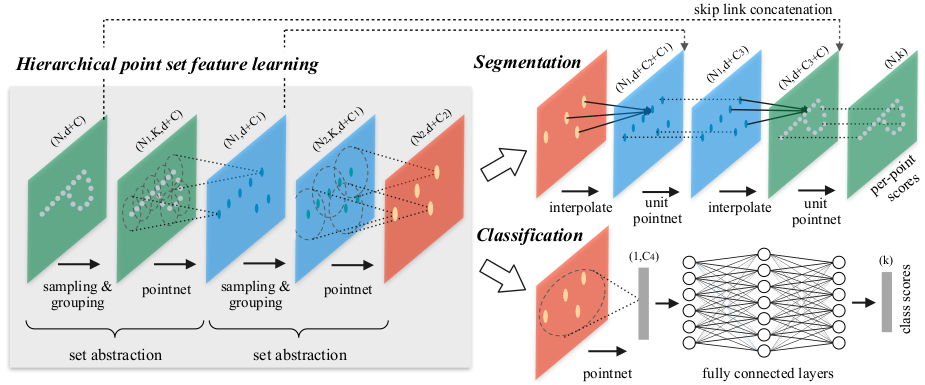
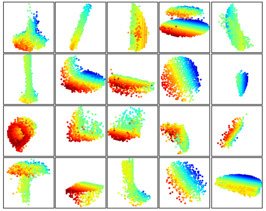

# PointNet++

## Abstract

​	在此之前，很少有研究深度学习在点云上的应用。Qi等人的 **PointNet**，是这个方向的先驱。 但是，根据**PointNet** 的设计，它无法捕获度量空间中的点引起的局部结构，这限制了 **PointNet** 识别细粒度模式（分割）的能力以及对复杂场景的泛化性。 

​	在这项工作中，我们引入了一个阶梯神经网络，该网络递归地将 **PointNet** 应用于输入点集的嵌套分区。 通过利用度量空间距离，我们的网络能够随着上下文尺度的增加而学习局部特征。通过进一步观察，通常采样的点集是不均匀的，这会导致以均匀密度训练的网络的性能大大降低，为此我们提出了新颖的集合学习层，以自适应地组合来自多个尺度的特征。 

​	实验表明，我们称为 **PointNet++** 的网络能够有效而强大地学习深度点集特征。 特别是，在具有挑战性的3D点云基准测试中，获得的结果明显优于最新技术。

## 1. Introduction

​	我们对分析几何点集感兴趣，这些几何点集是欧几里得空间中点的集合。 几何点集的一种特别重要的类型是由3D扫描仪捕获的点云，例如从装备适当的自动驾驶汽车中捕获的点云。 作为一个集合，此类数据必须对其成员的排列保持不变。 另外，距离度量定义了可能表现出不同属性的局部邻域。 例如，在3D扫描中点的密度和其他属性在不同位置之间可能并不均匀，密度变化可能来自透视效果，径向密度变化，运动等。

​	**PointNet** 的基本思想是学习每个点的空间编码（spatial encoding），然后将所有单个点特征聚合到全局点云签名。 根据其设计，**PointNet** 不能捕获度量标准引起的局部结构。 然而，事实证明，分析局部结构对于卷积体系结构的成功至关重要。  **CNN** 会将在常规网格上定义的数据作为输入，并能够沿多分辨率层次结构以越来越大的比例逐步捕获要素。 较低水平的神经元具有较小的感受野，而较高水平的神经元具有较大的感受野。 沿层次结构抽象局部模式的能力可以更好地将其推广到未发现的案例。	

​	我们引入了一个名为PointNet++的分层hierarchical神经网络，以分层方式处理在metric space（度量空间）中采样的一组点。 PointNet++的总体思路很简单。我们首先通过基础空间的距离度量将点集划分为重叠的局部区域。 与CNN相似，我们提取局部特征，以捕获来自小邻域的精细几何结构。 这些局部特征将进一步分组为更大的单元，并进行处理以生成更高级别的特征。 重复此过程，直到获得整个点集的特征为止。

​	PointNet ++的设计必须解决两个问题：如何生成点集的分区划分区域，以及如何通过局部特征学习器抽象点或局部特征集。这两个问题是相关的，因为点集的划分必须产生跨分区的通用结构，以便像卷积设置一样可以共享局部特征学习器的权重。我们选择局部特征学习者为PointNet。如该工作所示，PointNet是一种有效的体系结构，可以处理用于语义特征提取的无序点集。另外，该架构对于输入数据损坏具有鲁棒性。 作为基本构建块，PointNet 将局部点集或特征集抽象为更高级别的表示形式。 在此视图中，PointNet++将PointNet递归地应用于输入集的嵌套分区。

Figure 1: Visualization of a scan captured from a Structure Sensor (left: RGB; right: point cloud).

​	仍然存在的一个问题是如何生成点集的重叠分区。 每个分区都定义为基础欧几里得空间中的邻域球，其参数包括质心位置和scale尺度。为了均匀地覆盖整个集合，通过最远点采样（FPS）算法在输入点集中选择质心。 与以固定步幅扫描空间的体素CNN相比，我们的局部接收场取决于输入数据和scale尺度，因此更加有效。

​	然而，由于特征尺度的纠缠和输入点集的不均匀性，决定合适的局部邻域球尺度是一个更具挑战性但有趣的问题。 我们假设输入点集在不同区域可能具有可变的密度，这在诸如结构传感器扫描[18]（见图1）之类的实际数据中非常普遍。 因此，我们的输入点集与CNN输入有很大不同，CNN输入可以看作是在具有恒定常数的规则网格上定义的数据。 在CNN中，与局部分区规模相对应的是内核大小。  [25]表明使用较小的内核有助于提高CNN的能力。 但是，我们在点集数据上的实验为该规则提供了反证。小邻域可能由于采样不足而由太少的点组成，这可能不足以允许PointNets可靠地捕获其模式。

​	我们论文的一个重要贡献是PointNet++在多个尺度上利用邻域来实现鲁棒性和细节捕获。在训练过程中通过随机输入丢失，帮助网络学会自适应地对在不同尺度上检测到的模式进行加权，并根据输入数据组合多比例尺特征。 实验表明，我们的PointNet++能够高效，可靠地处理点集。 尤其是，在具有挑战性的3D点云基准测试中获得了明显优于最新技术的结果。

---

## 2. Problem Statement

​	假设 $\mathcal{X}=(M, d)$ 是一个离散度量空间，其度量是从欧几里得空间 $\mathbb{R}^{n}$ 继承的，其中 $M \subseteq \mathbb{R}^{n}$ 是点的集合， $d$ 是距离度量。 此外，周围欧几里德空间中 $M$ 的密度可能各处都不均匀。 我们学习集合函数 $f$ ， $f$ 将 $\mathcal{X}$ （每个点都有附加特征）作为输入并产生语义兴趣信息 $\mathcal{X}$。 实际上，这样的 $f$ 可以是将标签分配给 $\mathcal{X}$ 的分类函数，也可以是将每个点标签分配给 $M$ 的每个成员的分割函数。

---

## 3. Method

​	我们的工作可以看作是具有附加的层次结构的PointNet[20]的扩展。 我们首先回顾PointNet（Sec. 3.1），然后介绍具有分层结构的PointNet的基本扩展（Sec. 3.2）。 最后，我们提出了我们的PointNet++，即使在非均匀采样的点集中也能够稳健地学习特征（Sec. 3.3）。

---

### 3.1. Review of PointNet: A Universal Continuous Set Function Approximator

​	通用的连续集合函数逼近器

​	给定具有的无序点集$\left\{x_{1}, x_{2}, \ldots, x_{n}\right\}$，其中 $x_{i} \in \mathbb{R}^{d}$ ，可以定义一个集合函数 $f: \mathcal{X} \rightarrow \mathbb{R}$ 将点集映射到向量：
$$
f\left(x_{1}, x_{2}, \ldots, x_{n}\right)=\gamma\left(\operatorname{MAX}_{i=1, \ldots, n}\left\{h\left(x_{i}\right)\right\}\right) \tag{1}
$$
​	其中 $\gamma$ 和 $h$ 通常是多层感知器（MLP）网络。

​	**Eq. 1** 中的集合函数 $f$  对于输入点排列是不变的，并且可以任意近似所有连续集合函数[20]。 注意，$h$ 的响应可以解释为对点进行空间编码。

​	PointNet在一些基准测试中取得了令人印象深刻的性能。 但是，它缺乏以不同尺度捕获局部上下文的能力。 在下一节中，我们将介绍一个分层的特征学习框架来解决该缺陷。

---

### 3.2. Hierarchical Point Set Feature Learning

**Fig. 2**  以2D欧式空间中的点为例，说明了我们的分层特征学习体系结构及其在集合分割和分类中的应用。 单尺度点分组在此处可视化。 有关密度自适应分组的详细信息，请参见 **Fig. 3**。

​	虽然PointNet使用 a single max pooling operation 来汇总整个点集，但我们的新体系结构会构建点的 hierarchical 分组，并沿层次结构逐渐抽象出越来越大的局部区域。

​	我们的 hierarchical 结构由许多集合抽象级别组成（**Fig. 2**）。 在每个级别上，将一组点处理并抽象化以生成具有更少元素的新集合。 集合抽象级别由三个关键层组成：采样层，分组层和PointNet层。 

- 采样层从输入点中选择一组点，这些点定义了局部区域的质心，
- 分组层通过在质心周围找到“相邻”点来构造局部区域集，
- PointNet层使用微型PointNet将局部区域模式编码为特征向量。

​    集合的抽象级别采用 $N×（d+C）$矩阵作为输入，该矩阵来自具有 $d$-dim 个坐标和 $C$-dim 个特征的 $N$ 个点。 它输出 $N^{'}×（d + C^{'}）$的矩阵，其中包含具有 $d$-dim 个坐标和汇总局部上下文的新 $C^{'}$-dim 个特征的 $N ^{'}$个子采样点。 在以下各段中，我们将介绍集合抽象级别的各个层。

---

#### Sampling layer

​	给定输入点 $\left\{x_{1}, x_{2}, \ldots, x_{n}\right\}$，我们使用迭代最远点采样（FPS）选择点 $\left\{x_{i_1}, x_{i_2}, \ldots, x_{i_n}\right\}$ 的子集，其中 $x_{i_j}$为相对于其余点距集合 $\left\{x_{i_1}, x_{i_2}, \ldots, x_{i_{j-1}}\right\}$ 最远的点（以公制距离）。 与随机采样相比，在给定相同数量的质心的情况下，它对整个点集的覆盖范围更好。 与扫描不可知数据空间的矢量空间的CNN相比，我们的采样策略以依赖数据的方式生成接收场。

---

#### Grouping layer

​	该层的输入是大小为 $N×（d+C）$的点集和大小为 $N^{'}×d$ 的质心集坐标。 输出是大小为 $N^{'}×K×（d + C^{'}）$ 的点集组，其中每个组对应一个局部区域，$K$ 是质心点附近的点数。 请注意，$K$ 在各个组之间变化，但是后续的 **PointNet** 层能够将灵活数量的点转换为固定长度的局部区域特征向量。

​	在卷积神经网络中，像素的局部区域由像素组成，该像素的数组索引在该像素的特定曼哈顿距离（内核大小）内。 在从度量空间采样的点集中，一个点的邻域由度量距离定义。

​	球查询会找到在查询点半径范围内的所有点（在实现中设置了 $K$ 的上限）。 另一种范围查询是**kNN**搜索，它找到固定数量的相邻点。与kNN相比，球查询的局部邻域可确保固定的区域比例，从而使局部区域的功能在整个空间中更具通用性，这对于需要局部模式识别（例如语义点标记）的任务是首选。

---

#### PointNet layer

​	在这一层中，输入是大小为 $N^{'}×K×（d + C^{'}）$ 的 $N^{'}$ 个局部区域。输出中的每个局部区域都通过其质心和对质心邻域进行编码的局部特征来抽象。 输出数据大小为 $N^{'}×（d + C^{'}）$。

​	首先将局部区域中点的坐标转换为相对于重心的局部框架: $x_{i}^{(j)}=x_{i}^{(j)}-\hat{x}^{(j)}$ for $i=1,2, \ldots, K$ and $j=1,2, \ldots, d$ ，其中 $\hat{x}$ 是质心的坐标。 我们使用**Sec 3.1**所述的PointNet，作为局部模式学习的基本构建块。 通过将相对坐标与点要素一起使用，我们可以捕获局部区域中的点对点关系。

---

### 3.3. Robust Feature Learning under Non-Uniform Sampling Density

​	如前所述，通常在不同区域中点集的密度不均匀。这种不均匀性为点集特征学习带来了重大挑战。从密集数据中学到的特征可能无法推广到稀疏采样的区域。因此，为稀疏点云训练的模型可能无法识别细粒度的局部结构。

​	理想情况下，我们希望尽可能地仔细检查一个点集，以捕获密集采样区域中的最佳细节。 但是，在低密度区域禁止这种紧密检查，因为局部模式可能会因采样不足而损坏。 在这种情况下，我们应该在更大的范围内寻找更大尺度的模式。 为了实现这一目标，我们提出了密度自适应PointNet层（**Fig. 3**），当输入采样密度发生变化时，该层将学习合并来自不同尺度区域的特征。 我们将具有密度自适应PointNet层的分层网络称为PointNet++。

**Figure 3.** (a) 多尺度分组; (b)多分辨率分组

multi-scale aggregation、cross-level multi-scale aggregation、cross-level adaptive scale selection

​	在**Sec 3.2**中，每个抽象级别都包含单个尺度的分组和特征提取。在PointNet++中，每个抽象级别都提取多个尺度的局部模式，并根据局部点的密度智能地组合它们。在分组局部区域和组合不同尺度的特征方面，我们提出了以下两种类型的密度自适应层。

#### Multi-scale grouping (MSG)

​	如 **Fig. 3 (a)** 所示，一种简单但有效的捕获多尺度模式的方法是应用具有不同尺度的分组层，然后根据PointNet提取每个尺度的特征。 将不同尺度的特征连接起来以形成多尺度的特征。

​	我们训练网络以学习结合多尺度特征的优化策略。 这是通过为每个实例以随机概率随机丢弃输入点来完成的，我们称之为随机输入丢弃。 具体而言，对于每个训练点集，我们选择从 $[0，p]$ 均匀采样的丢包率 $θ$ ，其中 $p≤1$。对于每个点，我们以概率 $θ$ 随机删除一个点。 在实践中，我们将 $p$ 设置为0.95，以避免生成空点集。为此，我们为网络提供了各种稀疏度（由 $θ$ 引起）和变化的均匀性（由dropout中的随机性引起）的训练集。 在测试期间，我们保留所有可用点。

#### Multi-resolution grouping (MRG)

​	上面的MSG方法的计算量很大，因为它在每个质心点的大型邻域中运行局部PointNet。 特别地，由于质心点的数量通常在最低尺度时相当大，因此时间成本很高。

​	在这里，我们提出了一种替代方法，该方法可避免此类昂贵的计算，但仍保留根据点的分布特性自适应地聚合信息的能力。 在 **Fig. 3 (b)** 中，某个级别 $L_i$上的区域的特征是两个向量的串联。 通过使用设置的抽象级别汇总来自较低级别 $L_{i-1}$ 的每个子区域的特征，可以获得一个矢量（left in figure）。 另一个向量（right in figure）是通过使用单个PointNet直接处理局部区域中的所有原始点而获得的特征。

​	当局部区域的密度低时，第一向量可能不如第二向量可靠，这是因为在计算第一向量时的子区域甚至包含稀疏点，并且遭受采样不足的困扰更大。在这种情况下，第二个向量应加权更高。 另一方面，当局部区域的密度高时，由于第一矢量具有以较低的level递归地以较高的分辨率进行检查的能力，因此它提供了更精细的信息。

   与MSG相比，此方法的计算效率更高，因为我们避免了在最低level的大规模邻域中进行特征提取。

---

### 3.4. Point Feature Propagation for Set Segmentation

​	在集合抽象层中，对原始点集进行二次采样。 但是，在诸如语义点标记之类的集合分割任务中，我们希望获得所有原始点的点特征。 一种解决方案是始终将所有点作为所有设置的抽象级别中的质心进行采样，但这会导致较高的计算成本。 另一种方法是将特征从子采样点传播到原始点

​	我们采用基于距离的插值和跨级别跳过链接的分层传播策略（ **Fig. 2**）。 在特征传播level中，我们将点特征从$N_l×（d + C）$ 个点传播到 $N _{l-1}$个点，其中 $N _{l-1}$ 和 $N _{l}$ （ $N _{l}≤ N _{l-1}$ ）是输入的点集大小并输出集合抽象级别 $l$。 

​	我们通过在 $N_{l-1}$ 个点的坐标处插入 $N_l$ 个点的特征值 $f$ 来实现特征传播。 在许多内插选择中，我们使用基于knn 的距离反比加权平均值（如**Eq. 2**，默认情况下，我们使用p = 2，k = 3）。 然后将 $N_{l-1}$ 个点上的插值特征与集合抽象级别上的跳过链接的点特征进行级联。 然后，连接的特征将通过“unit pointnet”传递，这类似于CNN中的一对一卷积。 应用一些共享的全连接层和ReLU层来更新每个点的特征向量。 重复此过程，直到将特征传播到原始点集为止。
$$
f^{(j)}(x)=\frac{\sum_{i=1}^{k} w_{i}(x) f_{i}^{(j)}}{\sum_{i=1}^{k} w_{i}(x)} \quad \text { where } \quad w_{i}(x)=\frac{1}{d\left(x, x_{i}\right)^{p}}, j=1, \ldots, C \tag{2}
$$

---

## 4. Experiments

### 4.1. Point Set Classification in Euclidean Metric Space

### 4.2. Point Set Segmentation for Semantic Scene Labeling

### 4.3. Point Set Classification in Non-Euclidean Metric Space

### 4.4. Feature Visualization

​	在图8中，我们可视化了分层网络的第一级内核所学的知识。 我们在空间中创建了一个体素网格，并聚合了局部点集，这些点集激活了网格单元中某些神经元（最多使用了100个示例）。 保留具有较高票数的网格单元，并将其转换回3D点云，这表示神经元识别的模式。 由于模型是在主要由家具组成的ModelNet40上训练的，因此我们在可视化中看到了平面，双平面，线，角等的结构。

**Figure 8**: 从第一层内核中学到的3D点云模式。 对模型进行了ModelNet40形状分类训练（从128个内核中随机选择了20个）。 颜色表示点深度（红色在附近，蓝色在远处）。

---

## 5. Related Work

​	分层特征学习的思想非常成功。 在所有学习模型中，卷积神经网络[10，25，8]是最突出的模型之一。 但是，卷积不适用于具有距离度量的无序点集，这是我们工作的重点。

​	一些最近的著作[20，28]研究了如何将深度学习应用于无序集合。 即使点集确实拥有一个，它们也会忽略基础距离度量。 结果，它们无法捕获点的局部上下文，并且对全局集合转换和规范化敏感。 在这项工作中，我们针对从度量空间采样的点，并通过在设计中明确考虑底层距离度量来解决这些问题。

​	从度量空间采样的点通常是嘈杂的，并且采样密度不均匀。 这会影响有效点特征提取，并导致学习困难。 关键问题之一是为点要素设计选择合适的尺度。 以前，在几何处理社区或摄影测量与遥感社区中已经针对此[19、17、2、6、7、30]开发了几种方法。 与所有这些作品相比，我们的方法学会了以点到点的方式提取点要素并平衡多个要素比例。

​	在3D度量空间中，除了点集以外，还有几种流行的深度学习表示形式，包括体积网格[21、22、29]和几何图[3、15、33]。 但是，在所有这些工作中，没有明确考虑采样密度不均匀的问题。

## 6. Conclusion

​	在这项工作中，我们提出了PointNet++，这是一种功能强大的神经网络体系结构，用于处理在度量空间中采样的点集。 PointNet++递归地作用于输入点集的嵌套分区，并且在学习距离度量方面的分层功能方面非常有效。

​	为了解决非均匀点采样问题，我们提出了两个新颖的集合抽象层，它们根据局部点密度智能地聚合多尺度信息。 这些贡献使我们能够在具有挑战性的3D点云基准上达到最先进的性能。		

​	未来，值得思考的是如何通过在每个局部区域共享更多计算来提高我们建议的网络的推理速度，尤其是对于**MSG**和**MRG**层。在较高维度的度量空间中找到应用程序也很有趣，在这些应用程序中，基于CNN的方法在计算上不可行，而我们的方法可以很好地扩展。

