# PointNet Pytorch版复现

```
4/1AY0e-g4UT6ycG4IHtcPwQ_G0zV6S_8iprVfE46m5vXyAIeTktMV4l_gMhvo
4/1AY0e-g4TxjYXC2ZTS71NZxplyebYaIwOpzbf6RozP_WsruJ7Txni71WL8xk
```


## 1. 预备

### Batch

​	深度学习的优化算法，说白了就是梯度下降。每次的参数更新有两种方式。

​	第一种，遍历全部数据集算一次损失函数，然后算函数对各个参数的梯度，更新梯度。这种方法每更新一次参数都要把数据集里的所有样本都看一遍，计算量开销大，计算速度慢，不支持在线学习，这称为Batch gradient descent，批梯度下降。

​	另一种，每看一个数据就算一下损失函数，然后求梯度更新参数，这个称为随机梯度下降，stochastic gradient descent。这个方法速度比较快，但是收敛性能不太好，可能在最优点附近晃来晃去，hit不到最优点。两次参数的更新也有可能互相抵消掉，造成目标函数震荡的比较剧烈。

​	为了克服两种方法的缺点，现在一般采用的是一种折中手段，mini-batch gradient decent，小批的梯度下降，这种方法把数据分为若干个批，按批来更新参数，这样，一个批中的一组数据共同决定了本次梯度的方向，下降起来就不容易跑偏，减少了随机性。另一方面因为批的样本数与整个数据集相比小了很多，计算量也不是很大。

​	基本上现在的梯度下降都是基于mini-batch的，所以深度学习框架的函数中经常会出现batch_size，就是指这个。 关于如何将训练样本转换从batch_size的格式可以参考训练样本的batch_size数据的准备。

### Iterations

​	iterations（迭代）：每一次迭代都是一次权重更新，每一次权重更新需要batch_size个数据进行Forward运算得到损失函数，再BP算法更新参数。1个iteration等于使用batchsize个样本训练一次。

### Epochs

​	epochs被定义为向前和向后传播中所有批次的单次训练迭代。这意味着1个周期是整个输入数据的单次向前和向后传递。简单说，epochs指的就是训练过程中数据将被“轮”多少次，就这样。


**举个例子**

​	训练集有1000个样本，batchsize=10，那么训练完整个样本集需要： 100次iteration，1次epoch。

​	具体的计算公式为： one **epoch** = numbers of **iterations** = N = 训练样本的数量/**batch_size**

**注：**在LSTM中我们还会遇到一个seq_length,其实 batch_size = num_steps * seq_length


------

## 2. 数据集解析

### shapenet

```
Airplane	02691156
Bag	02773838
Cap	02954340
Car	02958343
Chair	03001627
Earphone	03261776
Guitar	03467517
Knife	03624134
Lamp	03636649
Laptop	03642806
Motorbike	03790512
Mug	03797390
Pistol	03948459
Rocket	04099429
Skateboard	04225987
Table	04379243
##
16类样本

文件夹结构如下：
-synsetoffset
	-points
		-从ShapeNetCore模型中均匀采样的点
	-point_labels
		-按点分割的标签
	-seg_img
		-标签的可视化
-train_test_split
	-在所有类别中混排的training/test/validation形状的列表（来自ShapeNet的官方train/test组）

从'shapenetcore_partanno_segmentation_benchmark_v0/synsetoffset2category.txt'读分类并映射id2cat

找出所有类别
找出对应的点云pts及分割seg文件
```


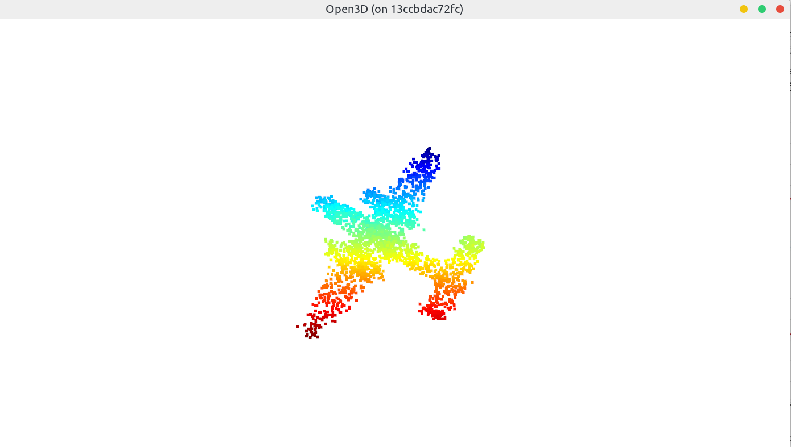


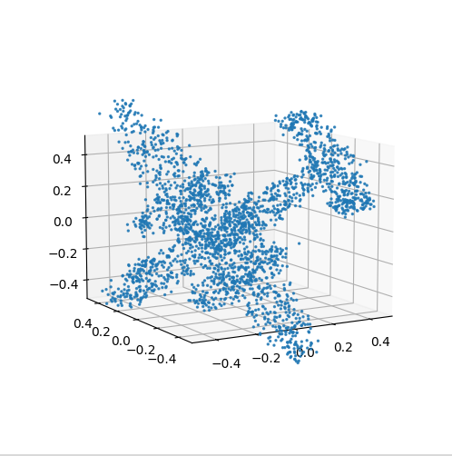

### dataset/dataloader

```python
__init__(self, root,npoints=2500,classification=False,
         class_choice=None,split='train',data_augmentation=True)

	catfile = 'shapenetcore_partanno_segmentation_benchmark_v0/synsetoffset2category.txt'
    self.cat2id = {k: v for k, v in self.cat.items() if k in class_choice}
	self.id2cat = {v: k for k, v in self.cat.items()}
	splitfile = 'shapenetcore_partanno_segmentation_benchmark_v0/train_test_split/shuffled_train_file_list.json'
    self.meta #从splitfile把一对pts和seg文件路径放到其对应的类别下
	self.datapath #把meta分成单个索引全部放到datapath
    self.classes #(0-15共16个分类编号)
    self.seg_classes #分割类别
    
__getitem__(self, index):
	self.datapath[('Airplane', 'shapenetcore_partann...1ff2b4.pts', 'shapenetcore_partann...1ff2b4.seg'),...] # 路径
    self.classes   (0-15共16个分类编号)
    point_set = np.loadtxt(fn[1]) #点云内容
    seg = np.loadtxt(fn[2])	      #分割内容
    point_set = point_set - np.expand_dims(np.mean(point_set, axis = 0), 0)                          #center 中心化
    dist = np.max(np.sqrt(np.sum(point_set ** 2, axis = 1)),0)
    point_set = point_set / dist  #scale 尺度化
	if self.data_augmentation:	  #数据增强
            theta = np.random.uniform(0,np.pi*2)
            rotation_matrix = np.array([[np.cos(theta), -np.sin(theta)],[np.sin(theta), np.cos(theta)]])
            point_set[:,[0,2]] = point_set[:,[0,2]].dot(rotation_matrix) # random rotation随机旋转 只动x、z轴
            point_set += np.random.normal(0, 0.02, size=point_set.shape) # random jitter 随机抖动 
            

```


------

## 3. 代码解析

### 3.1. 分类

#### 3.1.1. STN3D (T-Net)

```python
input:  [-1, 3, 2500] 点云
        [1 0 0 0 1 0 0 0 1] iden
output: [3, 3]        特征转换矩阵
----------------------------------------------------------------
        Layer (type)               Output Shape         Param #
================================================================
            Conv1d-1             [-1, 64, 2500]     (192+64)256
       BatchNorm1d-2             [-1, 64, 2500]      (64+64)128
        	    RELU
            Conv1d-3            [-1, 128, 2500]           8,320
       BatchNorm1d-4            [-1, 128, 2500]             256
        	    RELU
            Conv1d-5           [-1, 1024, 2500]         132,096
       BatchNorm1d-6           [-1, 1024, 2500]           2,048
        	    RELU
                 max			     [-1, 1024]
            Linear-7                  [-1, 512]         524,800
       BatchNorm1d-8                  [-1, 512]           1,024
        	    RELU
            Linear-9                  [-1, 256]         131,328
      BatchNorm1d-10                  [-1, 256]             512
        	    RELU
           Linear-11                    [-1, 9]           2,313
               +iden                    [-1, 9]
                view                 [-1, 3, 3]
================================================================
用于实现网络对于仿射变换、刚体变换等变换的无关性
将所有的输入点集对齐到一个统一的点集空间
	直接预测一个变换矩阵（3*3）来处理输入点的坐标。因为会有数据增强的操作存在，这样做可以在一定程度上保证网络可以学习到变换无关性。
	由于特征空间维度比较高，因此直接生成的alignment matrix会维度特别大，不好优化，因此这里需要加个loss约束一下。
    使得特征空间的变换矩阵A尽可能接近正交矩阵
```

$$
L_{r e g}=\left\|I-A A^{T}\right\|_{F^{\prime}}^{2} \tag{2}
$$

​	分类中常用的交叉熵+alignment network中用于约束生成的alignment matrix的loss


#### 3.1.2. InputTransform

```python
input:  [-1, 3, 2500] 点云
        [3, 3]       特征转换矩阵
output: [-1, 3, 2500] 点云特征空间
----------------------------------------------------------------
trans = stn3d(x)		# 计算转换矩阵
x = x.transpose(2, 1)
x = torch.bmm(x, trans) # 相乘
x = x.transpose(2, 1)
```


#### 3.1.3. FeatureAddDim

```python
input:  [-1, 3, 2500]      点云特征空间
output: [-1, 1024]         点云全局特征向量
----------------------------------------------------------------
        Layer (type)               Output Shape         Param #
================================================================
			 STN3D()              [-1, 3, 2500]
      InputTransform              [-1, 3, 2500]
           Conv1d-12             [-1, 64, 2500]             256
      BatchNorm1d-13             [-1, 64, 2500]             128
        	    RELU
以上为计算局部特征
           Conv1d-14            [-1, 128, 2500]           8,320
      BatchNorm1d-15            [-1, 128, 2500]             256
        	    RELU
           Conv1d-16           [-1, 1024, 2500]         132,096
      BatchNorm1d-17           [-1, 1024, 2500]           2,048
                 max			     [-1, 1024]
以上为计算全局特征
================================================================
max实现排列不变性
```


#### 3.1.4. Cls

```python
input:  [-1, 1024]         点云全局特征向量
output: [-1, 16]           各个分类的概率
----------------------------------------------------------------
        Layer (type)               Output Shape         Param #
================================================================
       FeatureAddDim                 [-1, 1024]
           Linear-18                  [-1, 512]         524,800
      BatchNorm1d-19                  [-1, 512]           1,024
        	    RELU
           Linear-20                  [-1, 256]         131,328
          Dropout-21                  [-1, 256]               0
      BatchNorm1d-22                  [-1, 256]             512
        	    RELU
           Linear-23                   [-1, 16]           4,112
         log_softmax                   [-1, 16] 
================================================================
Total params: 1,607,961
Trainable params: 1,607,961
Non-trainable params: 0
----------------------------------------------------------------
Input size (MB): 0.028610
Forward/backward pass size (MB): 92.799019
Params size (MB): 6.133884
Estimated Total Size (MB): 98.961514
----------------------------------------------------------------
```


### 3.2. 分割

#### 3.2.1. STN3D(T-Net)

```python
input:  [-1, 3, 2500] 点云
        [1 0 0 0 1 0 0 0 1] iden
output: [3, 3]        特征转换矩阵
----------------------------------------------------------------
        Layer (type)               Output Shape         Param #
================================================================
            Conv1d-1             [-1, 64, 2500]     (192+64)256
       BatchNorm1d-2             [-1, 64, 2500]      (64+64)128
        	    RELU
            Conv1d-3            [-1, 128, 2500]           8,320
       BatchNorm1d-4            [-1, 128, 2500]             256
        	    RELU
            Conv1d-5           [-1, 1024, 2500]         132,096
       BatchNorm1d-6           [-1, 1024, 2500]           2,048
        	    RELU
                 max			  [-1, 1024 ,1]
                view				 [-1, 1024]
            Linear-7                  [-1, 512]         524,800
       BatchNorm1d-8                  [-1, 512]           1,024
        	    RELU
            Linear-9                  [-1, 256]         131,328
      BatchNorm1d-10                  [-1, 256]             512
        	    RELU
           Linear-11                    [-1, 9]           2,313
               +iden                    [-1, 9]
                view                 [-1, 3, 3]
================================================================
```


#### 3.2.2. InputTransform

```python
input:  [-1, 3, 2500] 点云
        [3, 3]       特征转换矩阵
output: [-1, 3, 2500] 点云特征空间
----------------------------------------------------------------
trans = stn3d(x)		# 计算转换矩阵
x = x.transpose(2, 1)
x = torch.bmm(x, trans) # 相乘
x = x.transpose(2, 1)
```


#### 3.2.3. FeatureAddDim

```python
input:  [-1, 3, 2500]      点云特征空间
output: [-1, 1088, 2500]   点云局部特征向量 + 全局特征向量 
----------------------------------------------------------------
        Layer (type)               Output Shape         Param #
================================================================
			 STN3D()              [-1, 3, 2500]
      InputTransform              [-1, 3, 2500]
           Conv1d-12             [-1, 64, 2500]             256
      BatchNorm1d-13             [-1, 64, 2500]             128
        	    RELU
以上为计算局部特征
           Conv1d-14            [-1, 128, 2500]           8,320
      BatchNorm1d-15            [-1, 128, 2500]             256
        	    RELU
           Conv1d-16           [-1, 1024, 2500]         132,096
      BatchNorm1d-17           [-1, 1024, 2500]           2,048
                 max			  [-1, 1024 ,1]
                view				 [-1, 1024]
以上为计算全局特征
       view & repeat 		   [-1, 1024, 2500]
    		     cat		   [-1, 1088, 2500]
以上为合并局部和全局特征
================================================================
cat 局部信息和全局信息感知
```


#### 3.2.4. Seg

```python
input:  [-1, 1088, 2500]   点云全局1024+局部特征向量64
output: [-1, 2500, 4]      各个点的分割结果概率
----------------------------------------------------------------
        Layer (type)               Output Shape         Param #
================================================================
       FeatureAddDim           [-1, 1088, 2500]
           Conv1d-18            [-1, 512, 2500]         557,568
      BatchNorm1d-19            [-1, 512, 2500]           1,024
        	    RELU
           Conv1d-20            [-1, 256, 2500]         131,328
      BatchNorm1d-21            [-1, 256, 2500]             512
        	    RELU
           Conv1d-22            [-1, 128, 2500]          32,896
      BatchNorm1d-23            [-1, 128, 2500]             256
         	    RELU
以上为计算各点特征
           Conv1d-24              [-1, 4, 2500]             516
           transpose			  [-1, 2500, 4]
================================================================
Total params: 1,670,285
Trainable params: 1,670,285
Non-trainable params: 0
----------------------------------------------------------------
Input size (MB): 0.028610
Forward/backward pass size (MB): 127.041206
Params size (MB): 6.371632
Estimated Total Size (MB): 133.441448
----------------------------------------------------------------
```


### conv1d

​	首先，在实验中对所有样本进行了2500个点的重新采样，那么每个样本的尺寸就是 `2500*3`，为了进行卷积操作，输入网络前进行了转置
​	假定 `batch _size = 1`，那么最终输入到网络的样本尺寸就是 `1*3*2500`，其中 1 是batch_size，即一个样本，如下图。

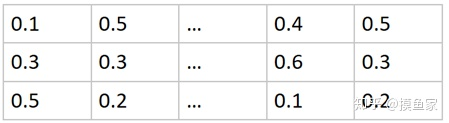

​	假设做的第一步卷积操作是 `conv1 = torch.nn.Conv1d(3, 64, 1)`，即`输入通道=3，输出通道=64`，卷积核大的大小为 `1`，卷积核第二个维度是由  `in_channels`  来决定的，所以实际上卷积大小为 `in_channels*kerner_size​`，这里为`3*1`。

​	进一步理解一下，在第一个卷积层中，使用 conv1 对 x 进行卷积的时候，实际上是使用 64 个`3*1`的卷积核进行卷积，输出尺寸应该是`1*64*2500`，其中 1 还是 batch_size。

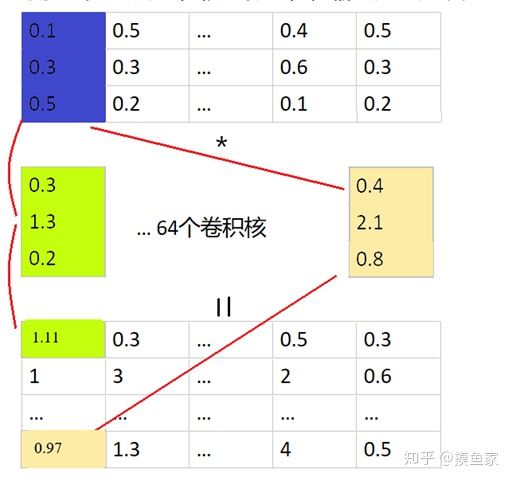

​	后面还会接着进行多层的卷积，可以看到，样本的坐标从刚开始的3维（xyz)，经过多次卷积之后会变为1024维。

​	这里可以稍微联想一下，在卷积神经网络中，因为图像矩阵本身包含了位置信息，每一次卷积都会考虑周边像素的值，所以每一次卷积后提取出的特征一般都是综合了像素值和周围邻近像素的信息从而得到更高维的特征。

​	比如图像第一层卷积后一般都会提取到边缘，纹理等特征。但在这里的卷积，可以看到，它只是对一个点的坐标进行卷积，完全没有考虑其他点的信息（很难做到），所以我们也很难感性的理解一个3维的坐标卷积之后得到的是什么特征。

### 网格细节

​	在了解了一维卷积之后，网络就变得很简单了。对于分类问题，如果把`batch_size`记为n，样本在网络中的变化就是`n*3*2500 → n*64*2500 → n*128*2500 → n*1024*2500 → n*1024*1(after max pooling) → n*512*1 → n*256*1 → n*16*1`  (本次实验样本共有16类)。

​	在整体之外，还有两个分支网络做Transform（T-Net)。第一个 T-Net 是在数据刚输入的时候，结构和上面的过程基本一致，该分支对样本进行一系列卷积及FC后输出是一个 `3*3` 的矩阵，然后先用样本和该矩阵相乘，根据论文的说法是对样本进行旋转对齐。第二个T-Net是加在第一次卷积之后的（ 即`n*64*2500`），得到一个`64*64`的变换矩阵，对`n*64*2500`的样本进行变换。	

​	通过实验发现, 对于所用的16类的ShapeNet数据集，在分类的时候，T-Net并没有太大的作用，是否有T-Net对于网络的最终结果几乎没有影响。具体可以参见结果部分。


## 4. 分类操作

在项目主文件夹下执行

```bash
sudo python utils/train_classification.py --dataset 'shapenetcore_partanno_segmentation_benchmark_v0/' --nepoch='5' --dataset_type 'shapenet'
```


在util文件夹下执行训练分类的代码

```bash
sudo python train_classification.py --dataset '../shapenetcore_partanno_segmentation_benchmark_v0/' --nepoch='5' --dataset_type 'shapenet'
```


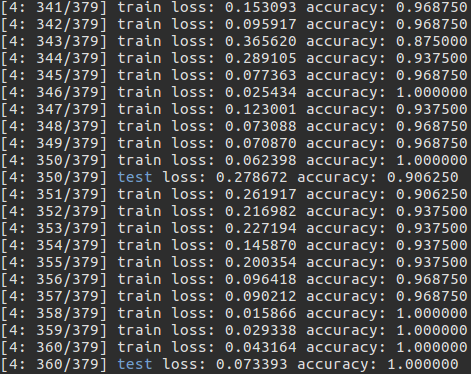


------

## 5. 分割操作

​    在主文件夹下执行

```bash
sudo python utils/train_segmentation.py --dataset 'shapenetcore_partanno_segmentation_benchmark_v0/' --nepoch='5' --batchSize='8'
```


## 6. 可视化

### show3d_balls

在主文件夹下执行

```bash
sudo python utils/show3d_balls.py
需要把show3d_balls.py 22行路径修改
```


### show_cls   

 在主文件夹下执行

```bash
sudo python utils/show_cls.py --model cls/cls_model_0.pth
需要把show_cls.py 16行model默认路径修改
```


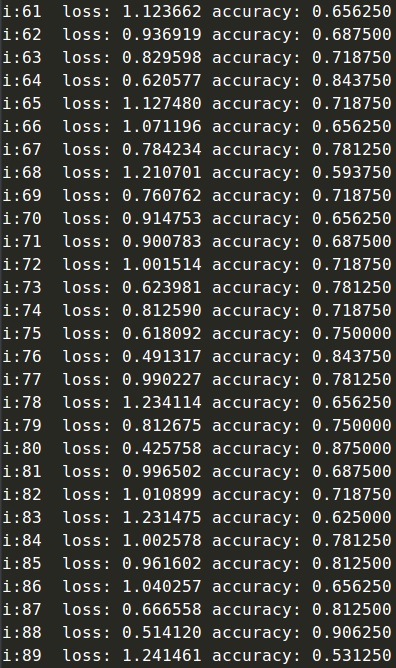


### show_seg

在主文件夹下执行

```bash
sudo python utils/show_seg.py --dataset './shapenetcore_partanno_segmentation_benchmark_v0/' --model seg/seg_model_Chair_3.pth --class_choice Airplane

Airplane	02691156
Bag	02773838
Cap	02954340
Car	02958343
Chair	03001627
Earphone	03261776
Guitar	03467517
Knife	03624134
Lamp	03636649
Laptop	03642806
Motorbike	03790512
Mug	03797390
Pistol	03948459
Rocket	04099429
Skateboard	04225987
Table	04379243

```


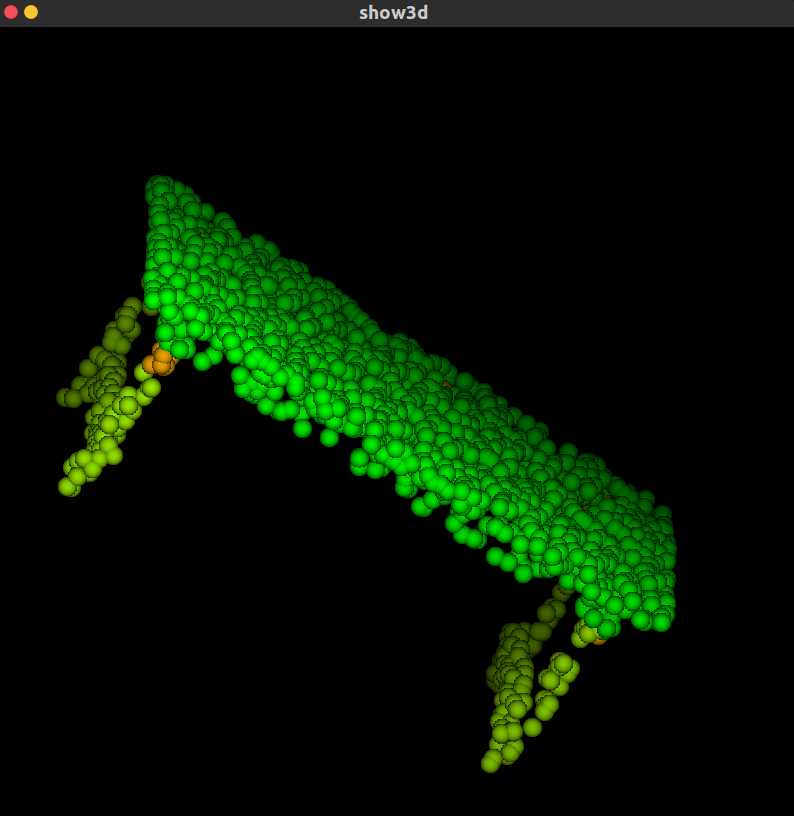


## MODELNET40数据集

```
ModelNet40 中加入自己的数据集
https://blog.csdn.net/SGL_LGS/article/details/101382997

ModelNet40格式的理解(PointNet实现第2步)
https://blog.csdn.net/qq_41895003/article/details/105431335

ModelNet 三维点云数据集
https://hyper.ai/datasets/5222

modelnet40数据集怎么下载？
https://www.zhihu.com/question/385649543

```


## 参考资料

主资料https://blog.csdn.net/DJames23/article/details/103642071#t3


## 问题及解决方案

1. 安装whl文件

```bash
https://download.pytorch.org/whl/torch_stable.html
pip install torch-0.4.1-cp37-cp37m-win_amd64.whl

pip install   -i https://pypi.tuna.tsinghua.edu.cn/simple tensorboard #使用清华源


https://download.pytorch.org/whl/cu101/torch-1.5.1%2Bcu101-cp36-cp36m-linux_x86_64.whl
https://download.pytorch.org/whl/cu101/torchvision-0.6.1%2Bcu101-cp36-cp36m-linux_x86_64.whl

```


2. pip install -e .报错Traceback (most recent call last):

```
执行sudo pip install -e .

```


3. 切换python版本

```
查看替代列表
sudo update-alternatives --list python

切换
sudo update-alternatives --config python

https://www.cnblogs.com/jasonlixuetao/p/9729753.html


配置只输入python3时就默认使用3.6版本：
也可使用上面链接里说明的方法
1、update-alternatives --install /usr/bin/python3 python3 /usr/bin/python3.5 1
2、update-alternatives --install /usr/bin/python3 python3 /usr/bin/python3.6 2
3、update-alternatives --config python3
4、python3 -V

设置pip:
1、apt-get install python3-pip　　　　# Python3
2、apt-get install python-pip　　　　  # Python2

https://www.cnblogs.com/eczhou/p/10245331.html

https://blog.csdn.net/yldmkx/article/details/107217904

```


4. numpy.core.multiarray failed to import

```
执行sudo python

```


5. GUP driver is too old

```
https://www.zhihu.com/question/309583980

https://pytorch.org/get-started/locally/


```


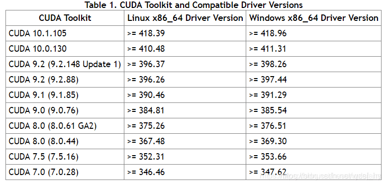

6. 安装matplotlib

```
sudo pip install matplotlib

```

7. ImportError: No module named '_tkinter', please install the python3-tk package

```
sudo apt-get install python3-tk

```


8. import torchvision报错

   resolve_type_from_object(): incompatible function arguments. The following a

```
https://blog.csdn.net/qq_38876313/article/details/106970943

```


---

# PointNet: Deep Learning on Point Sets for 3D Classification and Segmentation


细嚼慢咽读论文：PointNet论文及代码详细解析

https://zhuanlan.zhihu.com/p/264627148


## 摘要

​	点云是一种重要的集合图像数据结构类型。由于其数据格式是不规则的，因此大多数研究者将这数据转换为常规的三维体素（voxel）网格或图像集合（collections of images）。但是，这样做会导致数据量过大从而产生一些问题。本文中，我们设计了一种可以直接消耗（consumes）点云数据的新型（novel）神经网络类型，它很好地遵循了输入点中的排列不变性（permutation invariance）。我们的网络叫*PointNet*，提供了一种从物体分类，零件分割到场景语义分析（parsing）等应用的统一（ unified ）架构。虽然架构看起来简单，但是*PointNet*非常高效且有效（ efficient and effective）。经验来看（Empirically），它展示出了strong的表现，甚至比现有顶尖（art）技术更好。理论来说（Theoretically），我们分析了针对神经网络学习内容，以及网络在对输入扰动方面（ perturbation and corruption）鲁棒性较强的原因。


## 1. 介绍

​	在本文中，我们探索了能够（capable）推理3D几何数据（例如点云或网格）的深度学习架构。典型的（Typical ）卷积架构需要高度规则的输入数据格式，例如图像网格或3D体素，以执行权重共享和其他内核优化。由于点云或网格的格式是不规则的，因此大多数研究人员通常（typically）会将此类数据转换为常规3D体素网格或图像（例如视图）的集合，然后再将其提供给（feeding）深层网络体系结构。但是，这种数据表示形式的转换导致（renders）生成的数据变得不必要地庞大（voluminous），同时还产生了量化伪像（ quantization artifacts ），这些伪像会掩盖数据的自然不变性（ natural invariances ）。

​	因此，我们专注于使用简单的点云来表示3D几何的不同输入表示形式，并将我们得到的深度网络命名为*PointNet*。点云有简单且统一的（ unified ）结构，可以避免网格的组合不规则性（combinatorial irregularities ）和复杂性，因此更易于学习。但是*PointNet*仍然需要承认一个事实，即点云只是一组点，因此其成员的排列（permutations）是不变的，因此在网络计算中需要一定的对称性（symmetrizations）。还需要考虑刚性运动的其它不变性。

​	*PointNet*是一个统一的体系结构，直接将点云作为输入，并输出整个输入的类标签或每个输入的点段/部分标签。我们网络的基本架构非常简单，因为在初始阶段，每个点都被相同且独立（ identically and independently）地处理。在基本设置中，每个点仅由其三个坐标 $(x,y,z)$ 表示。可以通过计算法线和其他局部或全局特征来添加其他维度（ dimensions ）。

​	我们方法的关键是使用单个对称函数，最大池化（pooling）。网络有效地学习了一组优化函数/标准，这些函数/标准选择了点云的兴趣点或信息点，并对选择它们的原因进行了编码。神经网络最后的全连接层将这些学习到的最优值汇总到（ aggregate ）上述整个形状的全局描述符中（形状分类），或用于预测每个点的标签（形状分割）。

​	我们的输入格式易于应用刚性或精细转换，因为每个点都独立转换。 因此，我们可以添加一个依赖数据的空间转换网络 **(spatial transformer network, STN)**，该网络尝试在*PointNet*处理数据之前对数据进行规范化（ canonicalize ），以进一步改善结果。

​	我们提供了我们的方法的理论分析（theoretical analysis）和实验评估。 我们证明了我们的网络可以近似（approximate）任何连续设定函数。 更有趣的是，事实证明，我们的网络学会了通过稀疏的关键点集合来总结输入点云，根据可视化，这些关键点大致（roughly）对应于物体的骨架。 理论分析部分提供了这个下述问题的解释：为什么我们的*PointNet*对输入点的小扰动（ perturbation ）以及通过点插入（异常值）或删除（丢失数据）而造成的损坏具有很高的鲁棒性。

​	在从形状分类，零件分割到场景分割的许多基准（ benchmark ）数据集上，我们通过实验将我们的PointNet与基于多视图和体积表示的最先进的（state-ofthe-art）方法进行了比较。 在统一的架构下，我们的PointNet不仅速度更快，而且表现出同等甚至优于最新技术的强大性能。

​	我们工作的关键贡献如下：

- 我们设计了一种新颖的深层网络架构，适合使用3D环境中的无序点集；
- 我们展示了如何训练这样的网络来执行3D形状分类，形状零件分割和场景语义解析任务；
- 我们对方法的稳定性和效率进行了详尽的经验和理论分析；
- 我们说明了网络中选定神经元计算的3D特征，并对其性能进行了直观的解释。

​	用神经网络处理无序集的问题是一个非常普遍和根本的问题–我们希望我们的思想也可以延伸到其他领域。


## 2. 近期工作

**Point Cloud Features**	大多数已存在的点云特征是都是针对特定任务而手工制作的。点特征通常会编码点的某些统计属性，并被设计为对于某些转换是不变的，这些转换通常分为固有[2、21、3]或非固有[18、17、13、10、5]。 它们也可以分为局部特征和全局特征。对于特定任务，找到最佳特征组合并非易事。

**Deep Learning on 3D Data**	3D数据具有多种（multiple）流行的表示形式，从而导致了各种学习方法。 

​	体素*Volumetric CNNs*：[25、15、16]是在体素化形状（voxelized shapes）上应用3D卷积神经网络的先驱。 但是，由于数据稀疏性和3D卷积的计算成本，体素表示受到其分辨率的限制（ is constrained by ）。  

​	*FPNN* [12]和*Vote3D* [23]提出了处理稀疏性问题的特殊方法。 但是，它们的操作仍处于稀疏状态，因此处理大规模点云是一项挑战。 

​	多视图 *Multiview CNN*s：[20，16]尝试将3D点云或形状渲染为2D图像，然后应用2D卷积网络对其进行分类。 有了精心设计的图像CNNs（With well engineered image CNNs），这一系列方法在形状分类和检索任务上已经取得了主导性的（dominating）表现[19]。 但是，将它们扩展到场景理解或其他3D任务（例如点分类和形状构造）并非易事（nontrivial ）。 

​	光谱*Spectral CNNs*：近期一些研究[4，14]在网格上使用光谱CNN。 但是，这些方法目前仅限于多种网格物体（例如有机（ organic ）物体）上，如何将它们扩展到非等距（non-isometric）形状（例如家具）尚不清楚。 

​	基于特征的*Feature-based DNNs*：文献[6，8]首先通过提取传统的形状特征，然后使用全连接网络对形状进行分类，将3D数据转换为矢量。 我们认为它们受到提取特征的表示能力的限制。


**Deep Learning on Unordered Sets **	从数据结构的角度来看，点云是无序的向量集。 虽然大多数深度学习工作都集中在常规输入表示形式上，例如序列（在语音和语言处理中），图像和体积（视频或3D数据），但在深度学习上对点集的工作却很少。
	Oriol Vinyals等人[22]的最新著作探讨了这个问题。 他们使用具有注意力机制（ mechanism ）的读写过程网络来消耗无序输入集，并表明他们的网络具有对数字进行排序的能力。 但是，由于他们的工作集中在通用集合和NLP应用程序上，因此缺少几何在集合中的作用。


## 3. 问题表述

​	我们设计了一个深度学习框架，该框架直接使用无序点集作为输入。 一个点云表示一组3D点${P_i|i=1,..,n}$，其中每个点$P_i$是其`（x，y，z）`坐标加上额外特征通道（例如颜色，法线等）的向量。为简单起见，除非另有说明，我们仅 使用`（x，y，z）`坐标作为我们点的通道。

​	对于对象分类任务，可以直接从形状中采样输入点云，也可以从场景点云中预先分割输入点云。 我们建议的深度网络针对所有k个候选（candidate）类输出k个分数。 对于语义分割，输入可以是用于部分区域分割的单个对象，也可以是3D场景的子卷用于对象区域分割。我们的模型将为每一个点（n个）和语义子类别（m个），都输出`n×m`分数。

​	


## 4. 关于点集的深度学习

​	我们网络的体系结构（4.2节）受到（4.1节）中点集属性$\R^n$的启发。

### 4.1. 点集属性$\R^n$

​	我们的输入是来自欧式空间（Euclidean space）的点的子集。 它具有三个主要属性：

- 无序。  与图像中的像素阵列或体积网格中的体素阵列不同，点云是一组没有特定顺序的点。 换句话说，采用N个3D点集的网络，需要对输入集的$N!$个排列按数据馈送顺序，才能保持不变。
- 点之间的相互作用（Interaction）。    这些点来自具有距离度量的空间。 这意味着这些点不是孤立的（isolated），并且相邻点形成一个有意义的子集。 因此，模型需要能够从附近的点捕获局部结构，以及局部结构之间的组合相互作用。  
- 变换下的不变性。   作为几何对象，学习到的点集表示形式应该对某些变换是不变的。 例如，一起旋转和平移点都不应修改全局点云类别或点的分割。

---

### 4.2. PointNet体系结构

​	我们的完整网络体系结构如**Fig2**所示，其中分类网络和分割网络共享大部分结构。 

​	我们的网络具有三个关键模块：最大池化层（作为对称函数，用于汇总来自所有点的信息），局部和全局信息组合结构，两个对齐输入点和点特征的联结对齐（ alignment ）网络。 

​	我们将在下面的单独段落中讨论这些设计选择背后的原因。

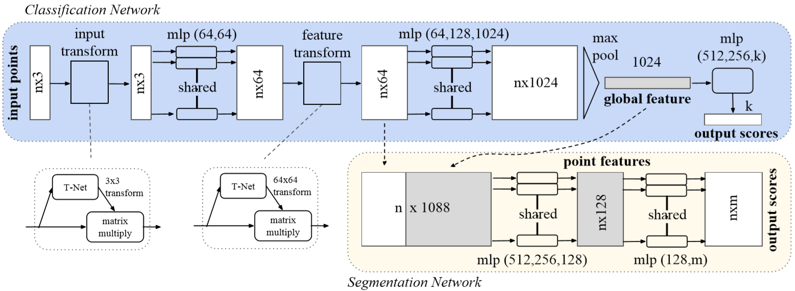

**Fig2. PointNet体系结构**    分类网络将n个点作为输入，应用输入和特征转换，然后通过最大池（max pooling）聚合点特征。 输出是k个类别的分类分数。 分割网络是分类网络的扩展。 它连接了全局和局部特征以及每点分数的输出。mlp代表多层感知器，括号中的数字是层大小。  Batchnorm（加速神经网络训练）用于具有ReLU（线性整流函数）的所有层。 drop层用于分类网中的最后一个mlp。

---

#### 4.2.1. 无序输入的对称函数-Symmetry Function for Unordered Input	

​	为了使模型对输入序列（permutation）不变，存在以下三种策略：1）按规范（ canonical ）顺序对输入进行排序；  2）将输入作为训练RNN的序列，但通过各种排列来扩充（augment）训练数据；  3）使用简单的对称函数汇总来自每个点的信息。 在此，对称函数将n个向量作为输入，并输出一个与输入顺序不变的新向量。 例如，$+$ 和 $∗$ 运算符是对称二进制函数。

​	虽然排序听起来很简单，但关于（w.r.t/with respect to）一般意义上的点扰动，实际上在高维空间中不存在稳定的排序。矛盾（contradiction）很容易说明这一点。 如果存在这种排序策略，则它会定义高维空间和一维实线之间的双向图。 不难发现，要求点扰动拥有稳定排序等效于要求该地图在尺寸减小时保持（preserves）空间接近性（ spatial proximity），这是通常情况下无法实现的任务。因此，排序无法完全解决序列问题，并且随着序列问题的持续存在，网络很难从输入到输出学习一致映射。 如实验所示**Fig 5**，我们发现直接在排序点集上应用MLP效果较差，尽管比直接处理未排序的输入要好。 

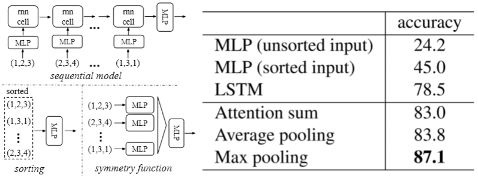

**Fig 5. 实现序列不变的三种方法**	应用于点的多层感知器（MLP）由神经元大小为64、64、64、128、1024的5个隐藏层组成，所有点共享一个MLP。 靠近输出的MLP由大小为512,256的两层组成。

​	使用RNN的idea将点集视为有序的信号，并希望通过使用随机排列的序列训练RNN，使得RNN能对输入顺序不变。 但是，在“ OrderMatters” [22]中，作者表明顺序很重要，不能完全省略（omitted）。 尽管RNN对长度较短（数十个dozens）的序列的输入排序具有相对（ relatively ）较好的鲁棒性，但很难扩展到数千个输入元素，但这是点集的常见大小。 从经验来看，我们展示了，基于RNN的模型的性能不如我们提出的方法好（**Fig 5**）。

​	我们的想法是通过对点集中的变换元素应用对称函数来近似拟合（ approximate ）定义点集上的常规函数：
$$
f\left(\left\{x_{1}, \ldots, x_{n}\right\}\right) \approx g\left(h\left(x_{1}\right), \ldots, h\left(x_{n}\right)\right) \tag{1}
$$
​	其中$$f: 2^{\mathbb{R}^{N}} \rightarrow \mathbb{R}$$，$$h: \mathbb{R}^{N} \rightarrow \mathbb{R}^{K}$$，且$$g \text { : }
\underbrace{\mathbb{R}^{N} \times \cdots \times \mathbb{R}^{K}}_{n} \rightarrow \mathbb{R}$$是一个对称函数。

​	从经验来看，我们的基础模块非常简单：我们用一个多层感知器（perceptron）网络来近似 $h$ ，用一个单变量函数和一个最大池化函数的组合来近似 $g$ 。实验证明这种方法很有效。通过 $h$ 的集合，我们可以学习一些 $f$  来捕捉集合的不同性质。

​	虽然我们的关键模块看起来很简单，但它具有有趣的特性（见5.3节），并且可以在一些不同的应用程序中实现强大的性能（见5.1节）。由于本模块的简单性，我们还在4.3节中提供了理论分析。

#### 4.2.2. 局部与全局信息聚合-Local and Global Information Aggregation

​	上小节的输出形成一个向量$[f_1，…，f_K]$，它是输入集的全局签名。我们可以很容易地训练SVM或多层感知分类器来对全局形状特征进行分类。然而，点分割需要结合局部和全局的信息。我们可以通过一种简单而高效的方式来实现这一点。

​	我们的解决方案如 **Fig 2** 所示（分割网络）。在计算出全局点云特征向量后，通过将全局特征与每个点特征连接起来，将其反馈给每一个点特征。然后，我们将每个基于合并的点特征提取新的点特征-这一次点特征可以同时感知局部和全局信息。

​	通过这种修改（ modification ），我们的网络能够预测依赖局部几何和全局语义的点数量。例如，我们可以准确地预测每个点的法线（图为补充），验证网络是否能够从点的局部邻域中总结（ summarize ）信息。在实验过程中，我们也证明了我们的模型在形状分块分割和场景分割方面达到了最先进的性能。

#### 4.2.3. 联结校准网络-Joint Alignment Network 

​	如果点云经过一定的几何变换，如刚性变换，则点云的语义标注必须是不变的。因此，我们期望由我们的点集学习的表示对这些变换是不变的。

​	一个自然的解决方案是在特征提取之前将所有输入集对齐到（ align ）一个规范（canonical）空间。**Jaderberg et al.**[9] 介绍了空间变换器 **(spatial transformer)** 的思想，通过采样和插值（sampling and interpolation）来对齐2D图像，通过GPU上实现的专门定制（ tailored ）层来实现。

​	与[9]相比，点云的输入形式使我们能够以更简单的方式实现这一目标。我们不需要发明任何新的层，也不需要像图像一样引入别名（ alias ）。我们通过一个小型网络（**Fig 2**中的T网络）预测一个固定的（ affine ）变换矩阵，并将此变换直接应用于输入点的坐标。小网络本身类似于（resembles ）大网络，由点独立特征提取、最大池化和全连通层等基本模块组成。关于T-net的更多细节见补充资料。

​	这种思想还可以进一步扩展到特征空间的对齐。我们可以在点特征上插入另一个对齐网络，并预测一个特征转换矩阵来对齐来自不同输入点云的特征。然而，特征空间中的变换矩阵维数远高于空间变换 **(spatial transform)** 矩阵，这大大增加了优化的难度。因此，我们在softmax训练损失中添加了一个正则化项（regularization term ）。我们将特征变换矩阵进行约束（ constrain ），使其接近正交矩阵：
$$
L_{r e g}=\left\|I-A A^{T}\right\|_{F^{\prime}}^{2} \tag{2}
$$
​	其中 $A$ 是由小型网络预测的特征对齐矩阵。正交（ orthogonal）变换不会丢失输入的信息，因此是需要的。我们发现通过加入正则化项，优化变得更加稳定，我们的模型获得了更好的性能。

---

### 4.3. 理论分析

#### 4.3.1. 通用知识-Universal approximation 

​	我们首先展示了神经网络对连续集合函数的普遍逼近能力。通过集合函数的连续性，直观地说，对输入点集产生一个小扰动，不应使函数值（如分类或分割分数）发生很大变化。

​	正式形式上，让$\mathcal{X}=\left\{S: S \subseteq[0,1]^{m}\right.$ and $\left.|S|=n\right\}$, 

​	$f:\mathcal{X} \rightarrow \mathbb{R}$ 是一个在 $\mathcal{X}$ 上的关于 **Hausdorff** 距离-$d_{H}(\cdot, \cdot)$ 的连续集合函数。

​	$\forall \epsilon>0, \exists \delta>0,$ 对任意的 $S, S^{\prime} \in \mathcal{X}$，如果 $d_{H}\left(S, S^{\prime}\right)<\delta$ ，那么有 $\left|f(S)-f\left(S^{\prime}\right)\right|<\epsilon$ 。

​	我们的理论证明，如果在最大池化层有足够的神经元， $f$ 函数就能够由我们的网络任意近似。也就是说, 1式中的 $K$ 足够大。

##### *定理 1

​	假设$f:\mathcal{X} \rightarrow \mathbb{R}$ 是一个关于 **Hausdorff** 距离 $d_{H}(\cdot, \cdot)$ 的连续集合函数。

​	$\forall \epsilon>0, \exists$ 一个连续的函数 $h$ 和一个对称的函数 $g(x_1,\dots,x_n)=\gamma \circ MAX$, 对任意的$S \in \mathcal{X}$都满足
$$
\left|f(S)-\gamma\left(\underset{x_{i} \in S}{\operatorname{MAX}}\left\{h\left(x_{i}\right)\right\}\right)\right|<\epsilon
$$
​	其中 $x_1,\dots,x_n$ 是一个被任意排序的列表 $S$ 中的元素，$\gamma$ 是一个连续函数，$MAX$ 是一个向量最大操作符，它将n个向量作为输入并且返回一个新的元素最大值的向量。

​	这个定理的证明可以在我们的补充材料中找到。其关键思想是，在最坏的情况下，网络可以学习将点云转换为体积（volumetric）表示，方法是将空间划分为大小相等的体素（voxels）。然而在实践中，网络学习了一种更聪明的策略来探测空间，正如我们将在点函数可视化中看到的那样。

#### 4.3.2. 瓶颈尺寸与稳定性-Bottleneck dimension and stability

​	从理论和实验上我们发现，网络的表达能力受到最大池层的维数的强烈影响，即式1中的 $K$ 。在这里我们提供了一个分析，这也揭示了与我们的模型的稳定性有关的性质。

​	我们定义了 $f$ 的子网络 $\mathbf{u}=\underset{x_{i} \in S}{\operatorname{MAX}}\left\{h\left(x_{i}\right)\right\}$，它将 $[0,1]^m$ 中的点映射到 $K$ 维向量。下面的定理告诉我们，输入集中的小波动或额外的噪声点不太可能改变我们网络的输出：

##### *定理2

​	假设 $\mathbf{u}: \mathcal{X} \rightarrow \mathbb{R}^{K}$ ，使得 $\mathbf{u}=\underset{x_{i} \in S}{\operatorname{MAX}}\left\{h\left(x_{i}\right)\right\}$ 并且 $f=\gamma \circ \mathbf{u} $ 。 则有：
$(a) \quad\forall S, \exists \mathcal{C}_{S}, \mathcal{N}_{S} \subseteq \mathcal{X}, f(T)=f(S) \qquad if \quad \mathcal{C}_{S} \subseteq T \subseteq \mathcal{N}_{S}$

$(b) \quad \left|\mathcal{C}_{S}\right| \leq K$

​	下面解释这个定理的含义。

​	式（a）表示如果 $\mathcal{C}_{S}$ 中的所有点都被保留，则 $f(S)$ 在输入波动前是不变的；如果额外的噪声点达到 $\mathcal{N}_{S}$，则 $f(S)$ 也保持不变。

​	式（b）表示 $\mathcal{C}_{S}$ 只包含有限数量的点，由**式1**中的 $K$ 决定。换句话说， $f(S)$ 实际上完全由小于等于 $K$ 个元素的有限子集 $\mathcal{C}_{S} \subseteq \mathcal{N}_{S}$确定。因此，我们称 $\mathcal{C}_{S}$ 为 $S$ 的临界点集，$K$ 为 $f$ 的瓶颈维数。

​	结合 $h$ 的连续性，这解释了我们模型关于点波动、振荡和额外噪声点的鲁棒性。通过类比机器学习模型中的稀疏性原理，获得了鲁棒性。**直观地说，我们的网络学习通过一组稀疏的关键点来总结形状**。在实验部分，我们可以看到关键点构成了物体的骨架。


## 5. 实验

​	实验分为四个部分。首先，我们展示了`PointNet`可以应用于多个3D识别任务（5.1节）。其次，我们提供详细的实验来验证我们的网络设计（5.2节）。最后，我们将网络学习的内容可视化（5.3节），并分析时间和空间复杂性（5.4节）。

---

### 5.1. 应用

​	在本节中，我们将展示如何训练我们的网络来执行3D物体分类、物体部分分割和语义场景分割。尽管我们正在研究一种全新的数据表示（点集），但我们能够在多个任务的基准测试中获得可比甚至更好的性能。

---

#### 5.1.1. 3D物体分类

​	我们的网络学习可用于物体分类的全局点云功能。我们根据ModelNet40[25]形状分类基准评估模型。共有12311个CAD模型，其中40个人为制造的物体类别，分别为9843个训练数据，2468个测试数据。虽然以前的方法侧重于体积和多视图图像表示，但我们是第一个直接处理原始点云的方法。

​	我们根据面面积对网格面上的1024个点进行均匀采样，并将其规范化为一个单位球体（sphere）。在训练过程中，我们通过沿up轴随机旋转对象，并通过均值为0、标准差为0.02的高斯噪声抖动（jitter）每个点的位置，从而在平面上增强（augment）点云。

​	在**Table 1**中，我们比较了我们的模型与以前的工作，以及我们使用MLP从点云提取的传统特征（点密度，D2，形状轮廓等）的基线方法。我们的模型在基于三维输入（体积和点云）的方法中达到了最先进的性能。由于只有全连接层和最大池化层，我们的网络在推理速度上有了很大的领先优势，并且可以在CPU上方便地并行化处理。我们的方法与基于多视图的方法（MVCNN[20]）之间仍然存在一个小的差距，我们认为这是由于丢失了可由渲染图像捕捉到的细微几何细节。

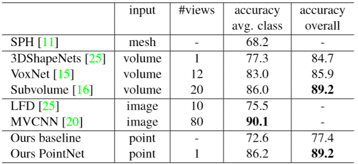

**Table 1. ModelNet40的分类结果**。我们的网络在3D输入方面达到了最先进的深度网络。

---

#### 5.1.2. 3D物体分块分割

​	分块分割是一项具有挑战性的细粒度（fine-grained ）三维识别任务。给定3D扫描或网格模型，任务是为每个点或面指定零件类别标签（例如椅子腿、杯柄）。

​	我们对来自[26]的 *ShapeNet* 分块数据集进行了评估，该数据集包含16个类别的16881个形状，共有50个部分进行了注释。大多数物体类别都用两到五个部分来标记。基本真相注释（ annotations ）标注在图形上的采样点上。

​	我们将分块分割描述为逐点分类问题。评估指标是平均交并比（$mIoU$-Mean Intersection over Union）。对于类别 $C$ 的每个形状 $S$ ，计算形状的 $mIoU$ ：对于类别 $C$ 中的每个部分类型，计算基础真实值和预测值之间的 $IoU$ 。如果基础真实点和预测点的并集为空，则将部分 $IoU$ 计为1。然后我们平均所有 $C$ 类零件类型的 $IOU$，得到该形状的 $mIoU$。为了计算该类别的 $mIoU$ ，我们取该类别中所有形状的 $mIoU$ 的平均值。

​	在本节中，我们将我们的分割版本PointNet（**Fig 2**的修改版本，分割网络）与两种传统方法[24]和[26]进行比较，这两种方法都利用了点几何特征和形状之间的对应关系，以及（as well as）我们自己的3D CNN基线一样。有关3D CNN的详细修改（ modifications）和网络结构，请参阅补充资料（supplementary）。

​	在**Table 2**中，我们报告了每个类别和平均 $IoU$（%）得分。我们观察到平均 $IoU$ 提高了2.3%，并且我们的网络在大多数类别中都优于基线方法。


**Table 2. ShapeNet零件数据集的分割结果.** 单位为点上的mIoU（%）。我们比较了[24]和[26]两种传统方法以及我们提出的三维全卷积网络基线。我们的PointNet方法在mIoU达到了最先进的水平

​	我们还进行了模拟Kinect扫描实验，以测试这些方法的鲁棒性。对于ShapeNet零件数据集中的每个CAD模型，我们使用 **Blensor Kinect Simulator**[7] 从六个随机视点生成不完整点云。我们使用相同的网络架构和训练设置，在完整形状和零件扫描上训练我们的PointNet。结果表明，我们只损失了5.3%的平均 $IoU$。在 **Fig 3** 中，我们给出了完整和部分数据的定性结果。我们可以看到，尽管部分数据仍相当具有挑战性，但我们的预测是合理的。

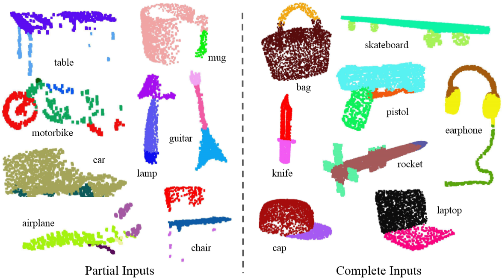

**Figure 3. 零件分割的定性结果.** 我们将所有16个对象类别的CAD零件分割结果可视化。我们展示了部分模拟inect扫描（左块）和完整ShapeNet CAD模型（右块）的结果。

---

#### 5.1.3. 场景语义分割

​	我们的零件分割网络可以很容易地扩展到语义场景分割，其中点标签变成语义对象类，而不是物体零件标签。

​	我们对斯坦福三维语义分析数据集进行了实验[1]。数据集包含马特波特扫描仪在6个区域（包括271个房间）进行的三维扫描。扫描中的每个点都用13个类别（椅子、桌子、地板、墙壁等，加杂物）中的一个语义标签进行注释。

​	为了准备训练数据，我们首先按房间分割点，然后将样本房间分成面积为1m*1m的区块。我们训练我们的PointNet分割版本，来预测每个区块中的每个点类别。每个点都由一个9维向量XYZ、RGB和房间的标准化位置（从0到1）表示。在训练时，我们在每个区块中随机抽取4096点。在测试时，我们测试了所有的点。我们遵循与[1]相同的协议（ protocol ）来使用 **k-fold** 策略进行训练和测试。

​	我们将我们的方法与使用手工制作的点特征的基线进行比较。基线提取相同的九维局部特征和三个附加特征：局部点密度（density）、局部曲率（curvature）和法线（normal）。我们使用标准多层感知器作为分类标准。结果如 **Table 3** 所示，其中我们的*PointNet*方法显著优于基线方法。在 **Fig 4** 中，我们展示了定性分割结果。我们的网络能够输出平滑的预测，并且对缺失点和遮挡具有鲁棒性。

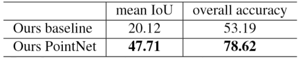

**Table 3. 场景语义分割的结果.** 评价指标是13个类（结构和家具元素加上杂物）的平均IoU，并按点数计算分类精度。

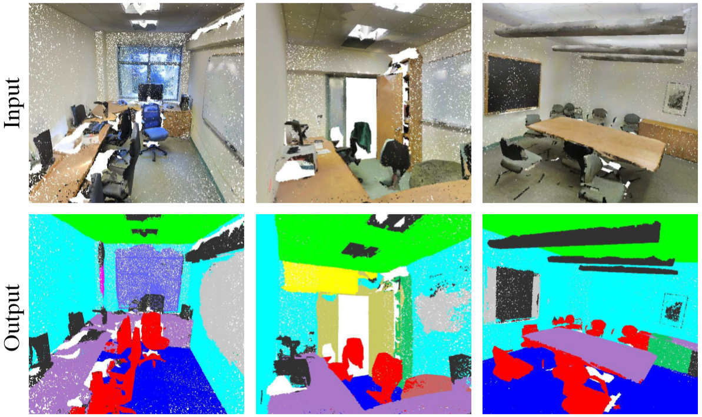

**Figure 4. 语义分割的定性结果. ** 最上面一行是带颜色的输入点云。最下面一行是输出语义分割结果（在点上），显示在与输入相同的相机视点中。

​	基于我们的网络输出的语义分割结果，我们进一步构建了一个基于连通组件（connected component ）的三维目标检测系统（详见补充）。我们将与 **Table 4** 中先前最先进的方法进行比较。前一种方法基于滑动形状法（CRF后处理），支持向量机训练体素网格中的局部几何特征和全局房间上下文特征。在所报告的家具类别中，我们的方法比它有很大的优势。

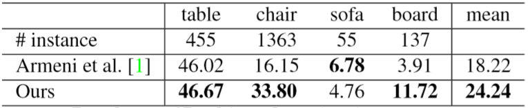

**Table 4. 三维场景目标检测结果. ** 评价标准是平均精度，阈值IoU为0.5，以3D体积计算。

---

### 5.2. 架构设计分析

​	在本节中，我们通过控制实验来验证我们的设计选择。我们还展示了网络超参数（hyperparameters）的影响。

#### 5.2.1. 与交替序不变方法的比较-Comparison with Alternative Order-invariant Methods

​	如4.2节所述，使用无序集合输入至少有三个选项。我们使用 ModelNet40 形状分类问题作为比较这些选项的实验平台，下面的两个对照实验也将使用此任务。

​	我们比较的基线（如 **Fig 5** 所示）包括未排序和排序点上的多层感知器（n×3阵列）、将输入点视为序列的RNN模型和基于对称函数的模型。我们实验的对称（symmetry）操作包括最大池化、平均池化和基于注意力的加权和。注意力方法类似于文献[22]中的方法，从每个点特征预测一个标量（scalar）分数，然后通过计算一个softmax跨点标准化该分数。根据标准化分数和点特征计算加权和。如 **Fig 5** 所示，最大池化操作以较大的差距胜出获得最佳性能，这验证了我们的选择。

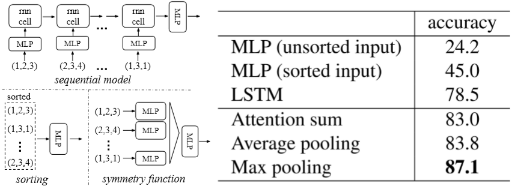

**Figure 5. 实现序不变性的三种方法.**   应用于点的多层感知器（MLP）由5个隐藏层组成，神经元大小分别为64、64、64、128、1024，所有点共享一个MLP副本。靠近输出端的MLP由两层组成，尺寸为512256。

---

#### 5.2.2. 输入和特征转换的有效性-Effectiveness of Input and Feature Transformations 

​	在 **Table 5** 中，我们展示了输入和特性转换（为了对齐）的积极效果。有趣的是，最基本的架构已经获得了相当合理的结果。使用输入转换可以提高0.8%的性能。正则化损失是高维变换工作所必需的。通过结合变换和正则化项，我们获得了最佳的性能。


**Table 5.输入特征变换的效果.**  标准是 ModelNet40 测试集的总体分类精度。

---

#### 5.2.3. 鲁棒性测试

​	We evaluate two models: one trained on points with (x,y,z) coordinates; the other on (x,y,z) plus point density. The net has more than 80% accuracy even when 20% of the points are outliers. Fig 6 right shows the net is robust to point perturbations.

​	我们展示了我们的PointNet，虽然简单有效，但对各种输入波动是鲁健的。我们使用与 **Fig 5** 中最大池化网络相同的架构。输入点被规范化为单位球体。结果如 **Fig 6** 所示。
​	对于遗失点，当有50%的点丢失时，关于最远随机输入抽样的准确率仅下降 2.4% 和 3.8%。我们的网络对异常点也是鲁棒的，如果它在训练中看到了那些异常点。我们评估两个模型：一个是在$（x，y，z）$坐标下训练的；另一个是$（x，y，z）$加上点密度。即使有 20% 的点是离群点，该网络仍有 80% 以上的准确度。**Fig 6** 显示了网络对点扰动的鲁棒性。

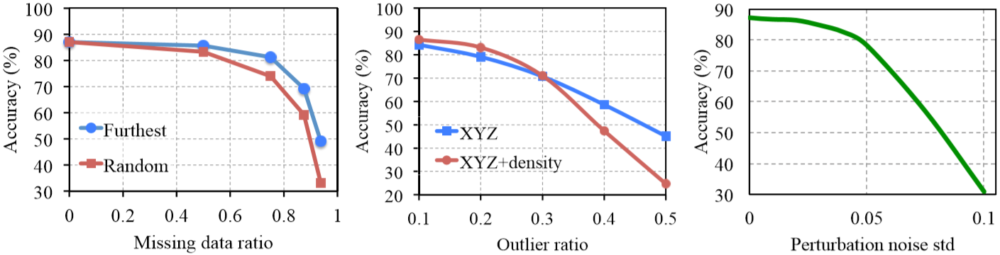

**Fig 6. PointNet鲁棒性测试.**    该指标是在 ModelNet40 测试集上的总体分类精度。左：删除点。Furthest是指原始1024个点用最远采样进行采样。中：插值。离群值均匀散布在单位球面上。右：扰动。对每个点独立地添加高斯噪声。

---

### 5.3. PointNet可视化

​	在 **Fig 7** 中，我们将一些样本形状 $S$ 的临界点集 $\mathcal{C}_{S}$ 和上限形状 $\mathcal{N}_{S}$（如 **Thm 2** 中所讨论）的一些结果可视化。两个形状之间的点集将给出完全相同的全局形状特征 $f(S)$ 。

​	从 **Fig 7** 中我们可以清楚地看到，临界点集 $\mathcal{C}_{S}$ ，促成了最大池化特征，总结了形状的骨架。上界形状 $\mathcal{N}_{S}$ 阐述了最大可能点云，它提供了与输入点云 $S$ 相同的全局形状特征 $f(S)$ 。 $\mathcal{C}_{S}$ 和 $\mathcal{N}_{S}$ 反映了点网的健壮性，这意味着丢失一些非临界点根本不会改变全局形状特征 $f(S)$ 。

​	通过网络转发 edge-length-2 立方体中的所有点，选择点函数值 $(h_1(p),h_2(p),\dots,h_K(p))$ 不大于全局形状描述子的点 $p$ 来构造 $\mathcal{N}_{S}$ 。


**Figure 7. 临界点和上限形状.**   当所有临界点共同决定给定形状的全局形状特征时，位于临界点集和上限形状之间的任何点云都会给出完全相同的特征。我们对所有的图形进行彩色编码以显示深度信息。

---

### 5.4 时间空间复杂度分析

​	**Table 6** 总结了我们分类 PointNet 的空间（网络中参数的数量）和时间（浮点操作/样本）复杂度。我们还将PointNet 与先前工作中一组具有代表性的三维和基于多视图的体系结构进行了比较。

​	虽然 MVCNN[20] 和 Subvolume（3D CNN）[16] 实现了高性能，但 PointNet 的计算成本更为高效（以浮点/样本计算：效率分别提高了 141x 和 8x ）。此外，就网络中的参数而言，PointNet 比 MVCNN 更具空间效率（参数少17x ）。此外，PointNet的可扩展性更高—它的空间和时间复杂性是 $O(N)$— 与输入点的数量上乘线性关系。然而，由于卷积在计算时间上占主导地位（dominates），多视点方法的时间复杂度随图像分辨率的增加而增大，基于体积卷积的方法则随体积的增大而增大。

​	从经验上讲，PointNet 能够在 TensorFlow 上使用 1080X GPU 每秒处理超过一百万个点进行点云分类（大约1K个物体/秒）或语义分割（大约2个房间/秒），显示出巨大的实时应用潜力。

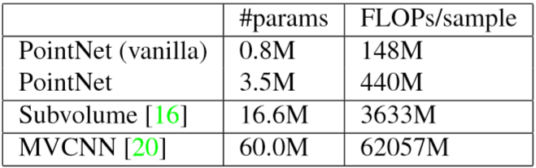

**Table 6. 用于三维数据分类的深层体系结构的时间和空间复杂性.**  PointNet（vanilla）是没有输入和特性转换的分类 PointNet。FLOP 代表浮点操作。“M”代表百万。Subvolume 和 MVCNN 对来自多个旋转或视图的输入数据使用了池化，如果没有使用的话，它们的性能会差得多。

---

## 6. 结论

​	在这项工作中，我们提出了一种新的直接使用点云的深层神经网络 *PointNet* 。我们的网络为许多3D识别任务提供了一种统一的方法，包括物体分类、零件分割和语义分割，同时在标准基准测试中获得同等或更好的结果。我们也提供理论分析和可视化的理解我们的网络。

​	作者感谢Samsung GRO、ONR MURI N0001413-1-0341、NSF的IIS-1528025、Google Focused Research Award、Adobe、NVIDIA的支持。

---


## 补充材料


## 参考文献

[2] The wave kernel signature: A quantum mechanical approach to shape analysis. Wave Kernel Signature：形状分析的量子力学方法

​	我们介绍了Wave Kernel Signature（WKS），用于表征非刚性三维形状上的点。 WKS表示在特定位置测量量子力学粒子的平均概率。 通过改变粒子的能量，WKS对各种不同的拉普拉斯本征频率进行编码和分离。 这种清晰的刻度分离使WKS非常适合于多种应用。 无论是从理论上还是在定量实验中，我们都证明WKS具有更大的判别力，因此与常用的热核签名（HKS）相比，可以更好地匹配特征。 作为WKS在形状分析中的应用，我们显示了形状匹配的结果。


[21] A concise and provably informative multi-scale signature based on heat diffusion. 基于热扩散的简洁且可提供信息的多尺度签名

​	我们基于形状上的热扩散过程的性质，提出了一种新颖的点签名。我们的签名称为“热核签名”（或HKS），是通过将众所周知的热核限制在时域上获得的。值得注意的是，我们表明，在某些温和的假设下，HKS捕获了包含在热核中的所有信息，并描述了等轴测形状。这意味着，对时域的限制，一方面使HKS更加简洁和易于评估，另一方面，它保留了有关形状固有几何形状的所有信息。此外，HKS从热核中继承了许多有用的特性，这尤其意味着在形状扰动下它是稳定的。我们的签名还提供了一种自然而有效的可计算的多尺度方法来捕获有关给定点邻域的信息，这在许多应用中可能非常有用。为了证明我们签名的实际意义，我们提出了几种基于HKS的非刚性多尺度匹配方法，并使用它来检测同一形状内以及整个形状集合中的重复结构。


[3] Scale-invariant heat kernel signatures for non-rigid shape recognition. 尺度不变的热核签名，用于非刚性形状识别

​	非刚性形状检索和比较中的最大挑战之一是形状描述符的设计，该形状描述符将在形状可以经历的各种变换下保持不变。近年来，基于核扩散尺度空间分析，引入了热核特征作为内在局部形状描述子。在本文中，我们开发了热核描述符的尺度不变版本。我们的构造基于对数采样的比例空间，其中形状比例最大对应于乘数，并且对应于平移。使用傅立叶变换的幅度撤消此转换。所提出的尺度不变局部描述符可以在特征包框架中用于在存在等轴测变形，缺失数据，拓扑噪声以及全局和局部尺度变换的情况下进行形状检索。在最近建立的非刚性形状检索基准上，我们通过最先进的算法获得了显着的性能提升。


[18] Aligning Point Cloud Views using Persistent Feature Histograms. 使用持久特征直方图对齐点云视图

​	在本文中，我们研究了将持久性点特征直方图用于将点云数据视图对齐为一致的全局模型的问题。 给定一个嘈杂的点云集合，我们的算法会估算出一组健壮的16D特征，这些特征局部描述了每个点的几何形状。 通过分析不同尺度下的特征的持久性，我们提取了最能描述给定点云的最佳集合。 产生的持久性特征在初始对齐算法中用于估计近似注册输入数据集的刚性变换。 通过将数据集转换为其收敛盆地，该算法为诸如ICP（迭代最近点）之类的迭代配准算法提供了良好的起点。 我们证明了我们的方法在姿态和采样密度方面是不变的，并且可以很好地应对来自室内和室外激光扫描的嘈杂数据。


[17] Fast Point Feature Histograms (FPFH) for 3D Registration. 用于3D配准的快点特征直方图（FPFH）

​	在我们最近的工作中，我们提出了点特征直方图（PFH）作为健壮的多维特征，它描述了3D点云数据集在点p周围的局部几何形状。在本文中，我们修改了它们的数学表达式，并对它们针对重叠点云视图的3D配准问题的鲁棒性和复杂性进行了严格的分析。更具体地说，我们提出了几种优化方法，它们可以通过缓存先前计算的值或通过修改其理论公式来大大减少其计算时间。后者导致了一种新型的局部特征，称为快速点特征直方图（FPFH），它保留了PFH的大部分判别能力。此外，我们提出了一种用于实时应用的FPFH功能在线计算的算法。为了验证我们的结果，我们证明了它们在3D配准中的效率，并提出了一种基于样本共识的新方法，该方法将两个数据集带入本地非线性优化器的收敛盆地：SAC-IA（最小共识初始对准）。


[13] Shape Classification Using the Inner-Distance. 使用内部距离进行形状分类

[10] Using Spin-Images for Efficient Object Recognition in Cluttered 3-D Scenes. 在混乱的3D场景中使用自旋图像进行有效的对象识别

[5] On Visual Similarity Based 3D Model Retrieval. 基于视觉相似度的3D模型检索


**Deep Learning on 3D Data**	3D数据具有多种（multiple）流行的表示形式，从而导致了各种学习方法。 


​	体素*Volumetric CNNs*：[25、15、16]是在体素化形状（voxelized shapes）上应用3D卷积神经网络的先驱。 但是，由于数据稀疏性和3D卷积的计算成本，体素表示受到其分辨率的限制（ is constrained by ）。  


[25] 3d shapenets: A deep representation for volumetric shapes. 3D ShapeNets：体素形状的深层表示

​	在当今的计算机视觉系统中，3D形状是至关重要的但未得到充分利用的线索，主要是由于缺乏良好的通用形状表示。随着最近廉价的2.5D深度传感器（例如Microsoft Kinect）的出现，在循环中具有强大的3D形状表示变得越来越重要。除了类别识别之外，从基于视图的2.5D深度图恢复完整3D形状也是视觉理解的关键部分。为此，我们建议使用卷积深度置信网络将3D几何形状表示为3D体素网格上二进制变量的概率分布。我们的模型3D ShapeNets从原始CAD数据中理解解不同对象类别和任意姿势之间复杂3D形状的分布，并自动发现分层的组成零件表示。它自然支持2.5D深度图的联合对象识别和形状完成，并且可以通过视图计划实现主动对象识别。为了训练我们的3D深度学习模型，我们构建了ModelNet –大型3D CAD模型数据集。广泛的实验表明，在各种任务中，我们的3D深度表示能够使性能比最新技术显着提高。


[15] Voxnet: A 3d convolutional neural network for real-time object recognition. VoxNet：用于实时对象识别的3D卷积神经网络

​	对于在现实环境中自主运行的机器人来说，稳健的物体识别是一项至关重要的技能。 诸如LiDAR和RGBD摄像机之类的距离传感器越来越多地出现在现代机器人系统中，它们提供了丰富的3D信息源，可以帮助完成这项任务。 但是，许多当前系统无法充分利用此信息，并且在有效处理大量点云数据时遇到了麻烦。 在本文中，我们提出了VoxNet，一种通过将体积占用网格表示与受监督的3D卷积神经网络（3D CNN）集成来解决此问题的体系结构。我们使用LiDAR，RGBD和CAD数据在公开基准测试中评估我们的方法。 VoxNet在每秒标记数百个实例的同时，实现了超越现有技术的准确性。


[16] Volumetric and multi-view cnns for object classification on 3d data. 体素和多视图CNN，用于对3D数据补充材料进行对象分类


​	*FPNN* [12]和*Vote3D* [23]提出了处理稀疏性问题的特殊方法。 但是，它们的操作仍处于稀疏状态，因此处理大规模点云是一项挑战。 

​	多视图 *Multiview CNN*s：[20，16]尝试将3D点云或形状渲染为2D图像，然后应用2D卷积网络对其进行分类。 有了精心设计的图像CNNs（With well engineered image CNNs），这一系列方法在形状分类和检索任务上已经取得了主导性的（dominating）表现[19]。 但是，将它们扩展到场景理解或其他3D任务（例如点分类和形状构造）并非易事（nontrivial ）。 

​	光谱*Spectral CNNs*：近期一些研究[4，14]在网格上使用光谱CNN。 但是，这些方法目前仅限于多种网格物体（例如有机（ organic ）物体）上，如何将它们扩展到非等距（non-isometric）形状（例如家具）尚不清楚。 

​	基于特征的*Feature-based DNNs*：文献[6，8]首先通过提取传统的形状特征，然后使用全连接网络对形状进行分类，将3D数据转换为矢量。 我们认为它们受到提取特征的表示能力的限制。


**Deep Learning on Unordered Sets **	从数据结构的角度来看，点云是无序的向量集。 虽然大多数深度学习工作都集中在常规输入表示形式上，例如序列（在语音和语言处理中），图像和体积（视频或3D数据），但在深度学习上对点集的工作却很少。
	Oriol Vinyals等人[22]的最新著作探讨了这个问题。 他们使用具有注意力机制（ mechanism ）的读写过程网络来消耗无序输入集，并表明他们的网络具有对数字进行排序的能力。 但是，由于他们的工作集中在通用集合和NLP应用程序上，因此缺少几何在集合中的作用。


## 课外资料

体素

量化伪像（quantization artifacts）

自然不变性（natural invariances）

组合不规则性（combinatorial irregularities）

Volumetric CNNs

欧式空间（Euclidean space）