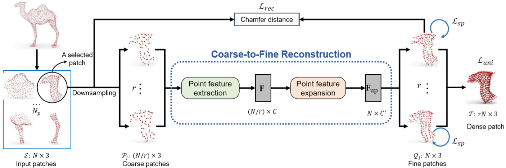
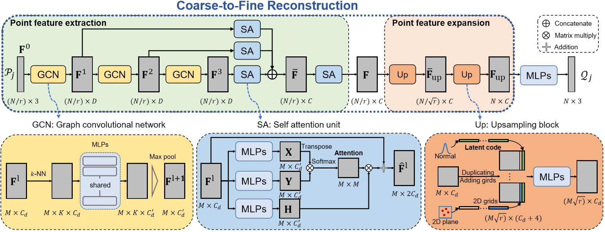

# SPU-Net

Self-Supervised Point Cloud Upsampling by Coarse-to-Fine Reconstruction with Self-Projection Optimization

## Abstract

​	点云的上采样任务旨在从稀疏点和不规则点集中获取密集和均匀点集。尽管深度学习模型已经取得了显着进展，但它们需要 G.T. 密度点集作为监督信息，该信息只能在合成对训练数据上进行训练，不适合在实际扫描的稀疏数据下进行训练。然而，从真实的扫描稀疏数据中获得用于训练的大规模成对的稀疏密集点集既昂贵又乏味。

​	为了解决此问题，我们提出了一个名为SPU-Net的自监督点云上采样网络，以捕获位于物体下表面上的点的固有上采样模式。具体来说，我们提出了一个从粗到细的重构框架，该框架包含两个主要组件：分别为**点特征提取**和**点特征扩展**。

​	在**点特征提取**中，我们将**自注意模块与图卷积网络（GCN）**集成在一起，以同时捕获局部区域内部和区域之间的上下文信息。在**点特征扩展**中，我们引入了一种可分级学习的折叠策略，以生成具有可学习2D网格的上采样点集。 此外，为了进一步优化生成的点集中的噪声点，我们提出了一种与均匀性和重构项相关联的新的自投影优化，以作为联合损失，以促进自我监督的点云上采样。 

## 3. The Architecture of SPU-Net 

### 3.1. Overview

**Fig. 2** The architecture of SPU-Net. 给定一个具有 N 个点的输入patch，我们首先将输入patch降采样为r个粗糙色块 $\mathcal{P}_j$，每个粗糙色块 $\mathcal{P}_j$ 具有 $N/r$ 个点，其中 $r$ 是上采样率。然后，我们在 coarse-to-fine 的重构框架中为每个粗糙的补丁 $\mathcal{P}_j$ 生成一个精细的补丁 $\mathcal{Q}_j$，该框架包括点特征提取和扩展。最后，我们通过汇总所有精细的补丁来获得目标密集补丁 $\mathcal{T}$。 此外，在实现中，$C$ 和 $C'$ 分别是特征通道数480和128； $\mathcal{L}_{rec}$，$\mathcal{L}_{uni}$ 和 $\mathcal{L}_{sp}$ 分别表示重构项，均匀项和自投影项。

​	给定一个3D点云，我们采用与PU-Net[38]和PU-GAN[17]相同的基于patch的方法。我们首先根据3D点云的测地距离构建 $N_p$ 个局部patch，如图2所示。对于每个具有N个点的局部面片 $\mathcal{S} = \left\{\boldsymbol{s}_{i}\right\}_{i = 1}^{N}$，我们的目标是输出一个**密集且均匀**的点在**保持原始数据分布**的同时，将 $ \mathcal{T}=\left\{\boldsymbol{t}_{i}\right\}_{i=1}^{r N} $ 设置为 $rN$ 个点，其中 $s_i$，$t_i$ 是3D 点的坐标，$r$ 是采样率。 在没有G.T. 密集点集的监督的情况下，我们提出了从粗到细的构造框架，以再现每个局部patch内的上采样过程。通过对稀疏样点进行上采样以获得细小patch，能够捕获固有的上样模式以生成均匀分布在物体下表面上的密集patch $\mathcal{T}$。

​	图2说明了我们的SPU-Net的体系结构。 对于输入块 $\mathcal{S}$ ，我们首先将 $\mathcal{S}$ 降采样为 $r$ 个不同的粗糙色块 $ \left\{\mathcal{P}_{1}, \cdots, \mathcal{P}_{j}, \cdots, \mathcal{P}_{r}\right\} $ ，每个都有 $N / r$个点（第3.2节）。 然后，我们引入从粗到细的框架来探索局部patch内部的固有采样模式（第3.3节），该模式包含两个主要组件：点特征提取和点特征扩展。 最后，我们提出了基于patch的训练策略，具有通过重建，均匀，自投影的术语形成的联合损失函数（第3.4节）。

---

### 3.2. Point Set Downsampling

​	在没有密集点集监督的情况下，我们必须构造一些**自我监督信息**来支持深层网络以捕获固有的上采样模式。为了在没有监督信息的情况下利用输入patch，我们提出了一种从粗到细的重构框架来生成上采样的密集补丁。具体来说，如图2所示，我们首先将输入色块 $S$ 降采样为一些粗糙的色块 $\mathcal{P}_j$，从而用输入patch本身来构成自我监督。下采样方法在很大程度上决定了深层网络捕获3D形状的表面分布的能力，这种能力应该保留输入patch的分布信息。这里，我们的方法采用了最远点采样（FPS）算法，该算法保留了patch**分布信息**，并且比其他抽样方法（例如随机抽样）保留了更**均匀**的粗糙patch。 具体来说，我们使用FPS算法重复从输入本地补丁中提取 $N / r$ 个点的过程。 最后，我们将降采样后的粗块表示为  $ \left\{\mathcal{P}_{1}, \cdots, \mathcal{P}_{j}, \cdots, \mathcal{P}_{r}\right\} $ 。 从下采样的粗补丁中，我们可以通过重构输入补丁本身来揭示固有的上采样过程，从而可以推断出更密集的补丁。

---

### 3.3. Coarse-to-Fine Reconstruction

​	在从粗到细的构造框架中，有两个主要组成部分：**点特征提取和点特征扩展**。 在点特征提取中，我们将**自注意力与图卷积网络（GCN）集成**在一起，以同时捕获局部区域内部和局部区域之间的点空间上下文。 在特征扩展方面，我们提出了一种**分层学习的折叠策略**，以方便从特征空间中的稀疏密度传播特征。

#### Point feature extraction

To capture the context information from discrete point sets, it is important to extract the spatial correlation of points inside local regions. The graph convolutional network (GCN) [25, 30, 21, 19] has been widely applied to capture the context information inside local regions in existing methods. However, these methods often ignore to capture the correlation among local regions. To simultaneously extract the context information both inside and among local regions, we propose a point feature extractionmodule,whichintegratesself-attentionunitswith GCNs, as shown in Figure 3.

为了从离散点集中捕获上下文信息，提取局部区域内点的空间相关性很重要。 图卷积网络（GCN）[25、30、21、19]已被广泛应用于在现有方法中捕获局部区域内的上下文信息。 但是，这些方法经常忽略捕获局部区域之间的相关性。 为了同时提取局部区域内部和局部区域之间的上下文信息，我们提出了一种点特征提取模块，该模块将自我注意单元与GCN集成在一起，如图3所示。

**Fig. 3** The coarse-to-fine reconstruction framework. 给定一个具有 $N / r$ 个点的粗糙补丁 $P_j$，我们旨在生成具有 $N$ 个点的相应的精细补丁 $Q_j$。在此框架中，有两个主要组件：点特征提取和点特征扩展。 在此，$D$ 和 $C$ 是实现中的特征通道数，分别为64和480。

​	给定一个大小为 $N / r×3$ 的粗糙patch $P_j$ 作为输入，通过在每个点 $p_j^i$ 周围构建局部图，尝试使用三个GCN捕获局部区域内的局部上下文。 我们介绍了具有多个语义级别的分层特征提取策略。 假设GCN在级别 $$ l \in\{0,1,2,3\} $$ 上的输入特征图为 $ \boldsymbol{F}^{l}=\left\{\boldsymbol{f}_{i}^{l}\right\}_{i=1}^{M} $ 且大小为 $M×C_d$ ，其中 $f_i^l$ 是 $F^l$ 内第 $i$ 个点特征。特别的，级别0的特征图 $F^0$ 是来自 $P_j$ 的原始点。为了计算点特征$f^{l + 1}_ i$，我们首先使用k-NN算法动态构建一个局部区域 $N^l_ i$，在每个点特征 $f_i^l$ 周围具有K个邻居。 然后，将点特征 $ \boldsymbol{f}_{i}^{l}(l \in\{0,1,2\}) $ 的传播计算为
$$
\boldsymbol{f}_{i}^{l+1}=\max _{\boldsymbol{f}_{j}^{l} \in \mathcal{N}_{i}^{l}}\left\{\sigma\left(\boldsymbol{h}_{\boldsymbol{\theta}}\left(\boldsymbol{f}_{j}^{l}-\boldsymbol{f}_{i}^{l}\right)\right\}\right. \tag{1}
$$
​	这里，$ \left(\boldsymbol{f}_{j}^{l}-\boldsymbol{f}_{i}^{l}\right) $ 可以看作是从点 $f^l_ j$ 到中心点 $f^l_ i$ 的边，$h_θ$ 表示多层感知器（MLP）中的可学习参数，$σ$ 是非线性层，例如ReLU, max是一个最大池化的操作符。最大池层被应用于局部区域 $N^l_i$ 中的聚合点特征。

​	根据先前的工作[20，17]，我们集成了自注意力单元来捕获局部区域之间的相关性。如图3所示，自我关注单元与GCN合作，以捕获局部patch内部的详细空间上下文信息。 假设输入特征图是 $\boldsymbol{F}^{l}$，大小为 $M×C_d$。 使用三个MLP将 $\boldsymbol{F}^{l}$ 分别嵌入到不同的特征空间 $X，Y$和 $H$ 中。 特别地，$X$ 和 $Y$ 被应用来通过简单的矩阵乘法来计算关注值，更新的特征图 $\hat{\boldsymbol{F}}^{l}$ 被计算为
$$
\hat{\boldsymbol{F}}^{l}=\boldsymbol{F}^{l}+\operatorname{softmax}\left(\boldsymbol{Y} \boldsymbol{X}^{\top}\right) \boldsymbol{H} \tag{2}
$$
​	在多个自我注意单元之后，局部区域之间的相关性以不同的语义级别被捕获。 然后，我们通过串联将多级点要素聚合为
$$
\overline{\boldsymbol{F}}=M L P\left(\boldsymbol{F}^{1} \oplus \hat{\boldsymbol{F}}^{1} \oplus \hat{\boldsymbol{F}}^{2} \oplus \hat{\boldsymbol{F}}^{3}\right) \tag{3}
$$
​	为了进一步探讨聚集特征 $\overline{\boldsymbol{F}}$ 的相关性，我们添加了另一个自我注意单元以获得最终的点特征 $F$。

----

#### Point feature expansion

​	点特征扩展的目标是构造从当前点到更多点的映射，这种映射在某些点应用中被广泛使用，例如语义分割[25]，点云重构[3]和点云上采样[17]。 通常，当前点特征扩展方法可以大致分为基于插值的方法[25]，基于折叠的方法[35]和基于重塑的方法[3]。 现有的基于点插值的方法通常使用点插值关系来指导点特征的扩展。但是，在许多情况下，点集之间的插值关系通常是未知的。此外，基于重塑的方法通常首先使用诸如MLP或完全连接（FC）层之类的深层网络扩展特征尺寸，然后通过简单的重塑操作生成目标点特征。近年来，已经开发出了基于折叠的方法，该方法首先复制点特征，然后连接2D网格以指导点特征扩展。

​	与其他特征扩展方法相比，基于折叠的方法更加灵活，并且在各种应用中均取得了令人满意的性能[35，33]。 但是，先前固定的2个栅格无法适应多种特征分布。 为解决此问题，我们提出了新颖的可学习2D网格作为潜在代码，以与固定2D网格配合使用，以指导点要素扩展。 如图3所示，给定一个大小为 $M×C_d$ 的输入特征图，我们首先复制点特征，然后将两种网格连接起来。特别是，潜在代码是从标准正态分布初始化的，并且可以在网络训练过程中进行优化。此外，为了平滑点特征扩展过程，我们引入了分层折叠策略。 通过使用两个上采样块，我们获得了上采样的点特征 $F_{up}$ 和具有上采样率 $√r$ 的 $F_{up}$ 。 对于后续的MLP，将应用特征点 $F_up$ 来重建精细补丁。

