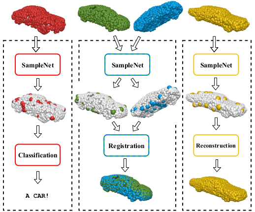
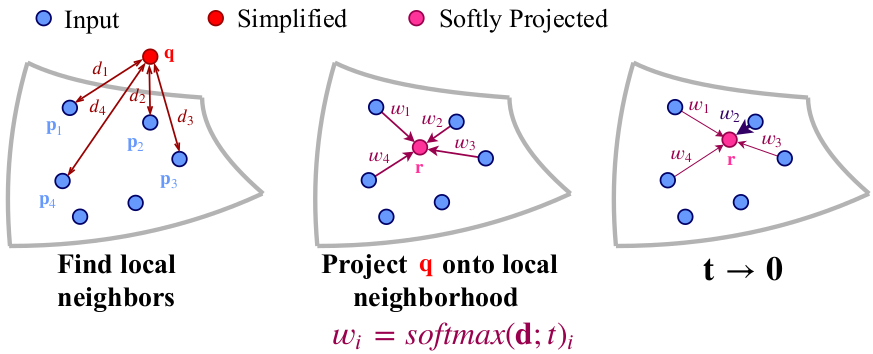
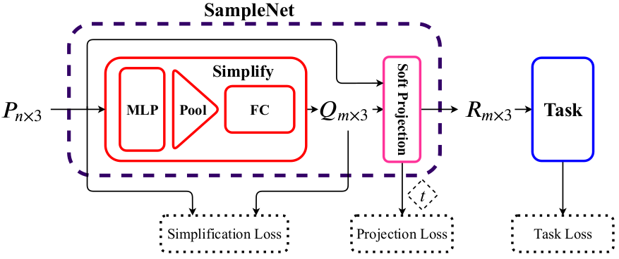
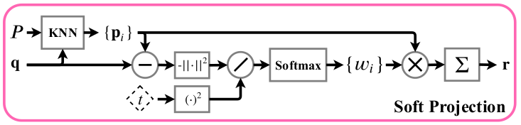

# SampleNet复现


## 配置环境docker

​	**registration**

```bash
docker pull asafmanor/pytorch:samplenetreg_torch1.4
docker run --runtime nvidia -v $(pwd):/workspace/ -it --name samplenetreg asafmanor/pytorch:samplenetreg_torch1.4


docker run --runtime=nvidia --rm -it -v $(pwd):/workspace/ -v /tmp/.X11-unix:/tmp/.X11-unix -e DISPLAY=unix$DISPLAY -e GDK_SCALE -e GDK_DPI_SCALE --name samplenetreg asafmanor/pytorch:samplenetreg_torch1.4
```


​	**reconstruction**

```bash
docker pull tensorflow/tensorflow:1.13.2-gpu-py3

docker run --runtime=nvidia --rm -it -v /tmp/.X11-unix:/tmp/.X11-unix -e DISPLAY=unix$DISPLAY -e GDK_SCALE -e GDK_DPI_SCALE --name samplenetreg tensorflow/tensorflow:1.13.2-gpu-py3

docker cp ./ 61992b15273d:/home/

docker commit -a "duan" -m "xxxx" -p f3c9beddda91 tensorflow/tensorflow:1.13.2-gpu-py3
```


```bash
# 更换软件源
rm -r /etc/apt/sources.list.d
mv /etc/apt/sources.list /etc/apt/sources.list.bak

echo "deb http://mirrors.aliyun.com/ubuntu/ bionic main restricted universe multiverse
deb-src http://mirrors.aliyun.com/ubuntu/ bionic main restricted universe multiverse

deb http://mirrors.aliyun.com/ubuntu/ bionic-security main restricted universe multiverse
deb-src http://mirrors.aliyun.com/ubuntu/ bionic-security main restricted universe multiverse

deb http://mirrors.aliyun.com/ubuntu/ bionic-updates main restricted universe multiverse
deb-src http://mirrors.aliyun.com/ubuntu/ bionic-updates main restricted universe multiverse

deb http://mirrors.aliyun.com/ubuntu/ bionic-proposed main restricted universe multiverse
deb-src http://mirrors.aliyun.com/ubuntu/ bionic-proposed main restricted universe multiverse

deb http://mirrors.aliyun.com/ubuntu/ bionic-backports main restricted universe multiverse
deb-src http://mirrors.aliyun.com/ubuntu/ bionic-backports main restricted universe multiverse" > /etc/apt/sources.list

cat /etc/apt/sources.list
apt clean
apt update
```


```bash
# 安装sudo vi git
apt install -y sudo vim git xarclock wget

本地 xhost+
```


## Sample_Name

```python
# Building Encoder
('encoder_conv_layer_0', 'conv params w = ', 192, ';b = ', 64)
('bnorm params beta = ', 64, ';gamma = ', 64)
Tensor("sampler_2/Relu:0", shape=(50, 2048, 64), dtype=float32)
('output size:', 131072, '\n')

('encoder_conv_layer_1', 'conv params w = ', 8192, ';b = ', 128)
('bnorm params beta = ', 128, ';gamma = ', 128)
Tensor("sampler_2/Relu_1:0", shape=(50, 2048, 128), dtype=float32)
('output size:', 262144, '\n')

('encoder_conv_layer_2', 'conv params w = ', 16384, ';b = ', 128)
('bnorm params beta = ', 128, ';gamma = ', 128)
Tensor("sampler_2/Relu_2:0", shape=(50, 2048, 128), dtype=float32)
('output size:', 262144, '\n')

('encoder_conv_layer_3', 'conv params w = ', 32768, ';b = ', 256)
('bnorm params beta = ', 256, ';gamma = ', 256)
Tensor("sampler_2/Relu_3:0", shape=(50, 2048, 256), dtype=float32)
('output size:', 524288, '\n')

('encoder_conv_layer_4', 'conv params w = ', 32768, ';b = ', 128)
('bnorm params beta = ', 128, ';gamma = ', 128)
Tensor("sampler_2/Relu_4:0", shape=(50, 2048, 128), dtype=float32)
('output size:', 262144, '\n')
Tensor("sampler_2/Max:0", shape=(50, 128), dtype=float32)
```


```python
# Building Decoder
('decoder_fc_0', 'FC params W = ', 32768, ';b = ', 256)
Tensor("sampler_2/Relu_5:0", shape=(50, 256), dtype=float32)
('output size:', 256, '\n')

('decoder_fc_1', 'FC params W = ', 65536, ';b = ', 256)
Tensor("sampler_2/Relu_6:0", shape=(50, 256), dtype=float32)
('output size:', 256, '\n')

('decoder_fc_2', 'FC params W = ', 49152, ';b = ', 192)
Tensor("sampler_2/decoder_fc_2/BiasAdd:0", shape=(50, 192), dtype=float32)
('output size:', 192, '\n')
```


## AE_Name

```python
# Building Encoder
('encoder_conv_layer_0', 'conv params w = ', 192, ';b = ', 64)
('bnorm params beta = ', 64, ';gamma = ', 64)
Tensor("autoencoder/Relu:0", shape=(50, 64, 64), dtype=float32)
('output size:', 4096, '\n')

('encoder_conv_layer_1', 'conv params w = ', 8192, ';b = ', 128)
('bnorm params beta = ', 128, ';gamma = ', 128)
Tensor("autoencoder/Relu_1:0", shape=(50, 64, 128), dtype=float32)
('output size:', 8192, '\n')

('encoder_conv_layer_2', 'conv params w = ', 16384, ';b = ', 128)
('bnorm params beta = ', 128, ';gamma = ', 128)
Tensor("autoencoder/Relu_2:0", shape=(50, 64, 128), dtype=float32)
('output size:', 8192, '\n')

('encoder_conv_layer_3', 'conv params w = ', 32768, ';b = ', 256)
('bnorm params beta = ', 256, ';gamma = ', 256)
Tensor("autoencoder/Relu_3:0", shape=(50, 64, 256), dtype=float32)
('output size:', 16384, '\n')

('encoder_conv_layer_4', 'conv params w = ', 32768, ';b = ', 128)
('bnorm params beta = ', 128, ';gamma = ', 128)
Tensor("autoencoder/Relu_4:0", shape=(50, 64, 128), dtype=float32)
('output size:', 8192, '\n')
Tensor("autoencoder/Max:0", shape=(50, 128), dtype=float32)

```


```python
# Building Decoder
('decoder_fc_0', 'FC params W = ', 32768, ';b = ', 256)
Tensor("autoencoder/Relu_5:0", shape=(50, 256), dtype=float32)
('output size:', 256, '\n')

('decoder_fc_1', 'FC params W = ', 65536, ';b = ', 256)
Tensor("autoencoder/Relu_6:0", shape=(50, 256), dtype=float32)
('output size:', 256, '\n')

('decoder_fc_2', 'FC params W = ', 1572864, ';b = ', 6144)
Tensor("autoencoder/decoder_fc_2/BiasAdd:0", shape=(50, 6144), dtype=float32)
('output size:', 6144, '\n')
```


# SampleNet: Differentiable Point Cloud Sampling

微分点云采样


## Abstarct

​	直接在点云上运行的任务越来越多。 随着点云大小的增加，这些任务的计算需求也随之增加。 一种可能的解决方案是先对点云进行采样。 经典采样方法，例如，**FPS** (farthest point sampling)，但它并不考虑 **downstream-task**。 最近的一项工作表明，学习 **task-specific**  的采样可以显着改善结果。 但是，这个所提出的技术并没有处理采样操作的不可微性，而是提供了一种解决方法。

​	我们为点云采样引入了一种新颖的可微松弛变量，它将采样点近似地作为输入点云中点的混合。本文中的近似方案在分类和几何重建应用中产生良好的结果。 我们还表明，所提出的采样方法可以用作点云配准网络的前端。点云配准是一项具有挑战性的任务，因为采样必须在两个不同的点云上保持一致。 


> **Downstream tasks** is what the field calls those supervised-learning tasks that utilize(利用) a pre-trained model or component. such as 分类 分割


## 1. Introduction

​	

**Fig 1.  SampleNet的应用.** 我们的方法为后续任务学习采样点云。 它采用了从输入点云中选择点的可微方法。SampleNet使各种任务（例如分类，配准和重建）在输入点的一小部分上运行，而性能下降最小。

---

​	近年来，三维传感设备的流行度不断提高，这些设备通常以点云的形式捕捉数据。但当面对大的点云数据时，点云分类、配准、重建等任务为了提高计算效率，需要对点云进行下采样操作。常用的下采样算法是 FPS (farthest point sampling)，它的目标是实现输入的最大覆盖。FPS 是与 **downstream-task** 无关的，它最大限度的减少了几何误差，实现最大的输入覆盖率，但不考虑采样后点云的后续处理。

​	最近的一个工作 Learning to Sample 提出了一种基于学习的面向任务的下采样方法，相比于非学习的下采样方法(FPS, 随机采样等)，显着提升了分类、配准等应用的性能。 但此方法中的匹配操作时不可微分的，不能通过神经网络传播梯度，从而导致网络在训练阶段和测试阶段的性能具有差异。

​	我们扩展了 Learning to Sample 等人的工作。通过在训练过程中将微分松弛引入matching step, 即最近邻（Fig 2）。我们称其为 soft projection，其将简化集中的每个点 替换为 其输入的最近邻点的加权平均值。

​	soft projection 操作会改变 representation。 投影点的表示形式是以初始点云中局部邻域的权重坐标，而不是自由空间中的绝对坐标。该操作由温度参数控制，在训练过程中将其最小化以创建退火计划。表示形式的更改将优化目标呈现为多个局部分类问题，其中应将每个简化点分配给后续任务的最佳输入点。

​	本文提出了SampleNet，它实现了一种可微分的方法来近似点云采样；相比于非学习和基于学习的采样方案，SampleNet提升了分类和重建任务的性能；此外，作者还研究了一种新的基于采样点云的配准方法，优于其它的采样方法。关键贡献为：

• 新颖的可微近似的点云采样 ;

• 与非学习和学习的采样方案相比，通过采样点云进行分类和重建任务的性能得到改善;

• 点云配准方法.



**Fig 2. Illustration of the sampling approximation.** 采样近似演示图。我们为点云提出了一种可学习的采样方法，该方法对最近邻选择采用了可微分的松弛。 查询点 $q$（红色）从输入点云（蓝色）投影到其局部邻域上。 邻居的加权平均值形成一个 softly投影点 $r$（洋红色）。 在训练期间，近似最近邻采样来优化权重（在此示例中为 $p_2$），在 inference 推理时发生的。


---

## 2. Related Work

### 2.1. Deep learning on point clouds

​	PointNet [28]开创了直接处理原始点云的先河。

#### 2.1.1. application

​	point cloud classification [PointNet++, PointCNN, KPConv, PointConv]

​	part segmentation [SO-Net, SPLATNet, RSCNN, DGCNN], 

​	instance segmentation [SGPN, GSPN, **Associatively Segmenting Instances and Semantics in Point Clouds**], 

​	semantic segmentation [**Large-scale Point Cloud Semantic Segmentation with Superpoint Graphs**, JSIS3D, GAC],

​	object detection in point clouds [**Deep Hough Voting for 3D Object Detection in Point Clouds**, PointRCNN]. 

#### 2.1.2. additional applications 

​	include point cloud autoencoders [**Learning Representations and Generative Models For 3D Point Clouds**, **FoldingNet**, **3D Point-Capsule Networks**, **Multi-Angle Point Cloud-VAE** ],

​	point set completion [53, 5, 31] 

​	point set registration [PointNetLK, 22, 32]

​	adversarial point cloud generation [PUGAN, PointFlow]

​	adversarial attacks [20, 45]

​	point cloud consolidation [52, 51, 16, 49]. 


---

### 2.2. Nearst neighbor selection

​	最近邻（NN）方法已在文献中广泛用于信息融合。 在神经网络的背景下，使用最近邻的一个显着缺点是选择规则是不可微的。  

​	Goldberger等[9]提出了最近邻居规则的随机松弛。他们定义了候选邻居集合的分类分布，其中1-NN规则是分布的极限情况。后来，Plötz和Roth [26]通过提出k最近邻（KNN）选择规则的确定性松弛，概括了Goldberger等人的工作。他们提出了一个神经网络层，称为神经最近邻居块，利用了他们的KNN松弛。 在这一层中，特征空间中邻居的加权平均值用于信息传播。 邻居权重使用控制权重分布均匀性的温度系数进行缩放。 

​	在我们的工作中，我们采用松弛最近邻选择作为近似点云采样的方法。尽管温度系数在Plötz和Roth的工作中不受限制，但我们在训练过程中会提倡较小的温度值，以近似最接近的邻居选择。


---

### 2.3. Sampling methods for points clouds in neural networks

​	最远点采样（Farthest point sampling, FPS）已被广泛用作点云神经处理系统中的合并操作[30、27、50]。 但是，FPS没有考虑对采样点的进一步处理，可能会导致性能欠佳。 最近，已经提出了替代的子采样方法[17、24、47]。
   Nezhadarya等[24]引入了一个关键点层，它将具有最活跃特征的点传递到下一个网络层。 杨等[47]在训练分类网络而不是FPS时使用了Gumbel子集抽样，以提高其准确性。 但是，我们问题的设置有所不同。 给定一个应用程序，我们对输入点云进行采样，然后将任务应用于采样数据。Dovrat等[6]提出了一种学习型的面向任务的点云简化方法，这导致了训练和推理阶段之间的性能差距。 

​	我们通过可微的最近邻近似，通过训练过程中近似采样操作来缓解此问题。

---


## 3. Method



**Fig 3. Training of the proposed sampling method.** 在完整的输入点云 $P$ 上训练任务网络，并在我们的采样网络 SampleNet 的训练过程中保持固定。用神经网络将 $P$ 简化为一个较小的集合 $Q$。然后，将 $Q$ 软投影到 $P$ 上以获得 $R$，并将 $R$ 送到到任务网络。在表示损失的情况下，对 **SampleNet** 进行了训练，以从 $P$ 中采样最适合当前任务的点。


​	图3概述了我们的采样方法SampleNet。首先，在 n 个点的完整点云上预先训练任务网络并冻结。 然后，SampleNet获取一个完整的输入P，并通过神经网络将其简化为较小集合$Q$ ，其具有 $m$ 个点[6]。 通过最近邻选择的可微松弛，将 $Q$ 软投影到 $P$上。 最后，SampleNet的输出 $R$ 将输入到任务当中。SampleNet经过三个损失条件的训练:

$$
\begin{aligned}
\mathcal{L}_{\text {total}}^{s a m p}=\mathcal{L}_{\text {task}}(R) &+\alpha \mathcal{L}_{\text {simplify}}(Q, P) \\
&+\lambda \mathcal{L}_{\text {project}}
\end{aligned}
$$
​	第一项 $\mathcal{L}_{\text {task}}(R)$ 优化近似采样集 $R$。 它旨在通过采样点云来保留任务性能。

​	$\mathcal{L}_{\text {simplify}}(Q, P)$ 鼓励简化集合接近输入。 也就是说，$Q$ 中的每个点都应该在 $P$ 中有一个闭合点，反之亦然。

​	最后一项， $\mathcal{L}_{\text {project}}$ 用于通过软投影操作来近似来自输入点云的点采样。

​	我们的方法建立在Dovrat等人提出的抽样方法的基础上并加以扩展[6]。 为了清楚起见，我们在第3.1节中简要回顾了它们的方法。 然后，我们在3.2节中描述我们的扩展。


---

### 3.1. Simplify

​	给定 $n$ 个 3D 坐标 $P \in \mathbb{R}^{n \times 3}$ 的点云，目标是找到 $m$ 个点 $R^* \in \mathbb{R}^{m \times 3}$的子集，以便将采样点云 $R^*$ 最佳化为任务 $T$。将 $T$ 的目标函数表示为 $F$，$R^∗$由下式给出：
$$
R^{*}=\underset{R}{\operatorname{argmin}} \mathcal{F}(T(R)), \quad R \subseteq P, \quad|R|=m \leq n
$$
​	由于采样操作的不可微性，该优化问题提出了挑战。Dovrat[6]提出了一个简化网络，该网络从 $P$ 生成 $Q$ ，其中 $Q$ 对于任务 $T$ 是最佳的，并且其点与 $P$ 的点接近。为了鼓励第二性质，利用了简化损失。将平均最近邻损失记为:

$$
\mathcal{L}_{a}(X, Y)=\frac{1}{|X|} \sum_{\mathbf{x} \in X} \min _{\mathbf{y} \in Y}\|\mathbf{x}-\mathbf{y}\|_{2}^{2}
$$
​	最大最近邻损失为:
$$
\mathcal{L}_{m}(X, Y)=\max _{\mathbf{x} \in X} \min _{\mathbf{y} \in Y}\|\mathbf{x}-\mathbf{y}\|_{2}^{2}
$$
​	简化损失为:
$$
\begin{array}{r}
\mathcal{L}_{\text {simplify}}(Q, P)=\mathcal{L}_{a}(Q, P)+\beta \mathcal{L}_{m}(Q, P) \\
+(\gamma+\delta|Q|) \mathcal{L}_{a}(P, Q)
\end{array}
$$
​	为了优化任务的点集 $Q$，将任务损失添加到优化目标中。简化网络的总损失为：
$$
\mathcal{L}_{s}(Q, P)=\mathcal{L}_{\text {task}}(Q)+\alpha \mathcal{L}_{\text {simplify}}(Q, P)
$$
​	针对特定样本大小 $m$ 训练了上述简化网络。Dovrat等[6]也提出了一个渐进式采样网络。该网络根据简化点对任务的重要性排序，并可以输出任何样本大小。它输出n个点，并对其输出的嵌套子集进行简化损失训练:
$$
\mathcal{L}_{\text {prog}}(Q, P)=\sum_{c \in C_{s}} \mathcal{L}_{s}\left(Q_{c}, P\right)\tag{7}
$$
​	其中 $C_s$ 是控制大小。	


---

### 3.2. Project



**Figure 4. The soft projection operation.** 该运算以点云 $P$ 和简化点云 $Q$ 作为输入。每个点 $\mathbf{q}∈Q$ 投影到 $P$ 中的k个最近邻上，表示为 $\left\{\mathbf{p}_{i}\right\}$ 。 $\left\{w_{i}\right\}$ 由 $\left\{\mathbf{p}_{i}\right\}$ 与 $\mathbf{q}$ 的距离和温度系数 $t$ 计算得出，并用 $\left\{w_{i}\right\}$ 对 $\left\{\mathbf{p}_{i}\right\}$ 进行加权，进一步在软投影点集合 $R$ 中获得点 $\mathbf{r}$ 。


​	代替优化任务的简化点云，我们添加了 soft projection 操作, 如**Fig 4.**所示。将每个点 $\mathbf{q}∈Q$ 软投影到其邻域（由其在完整点云 $P$ 中的 $k$ 个最近邻定义），以获得投影点 $\mathbf{r}∈R$。点 $\mathbf{r}$ 是原始点形式 $P$ 的加权平均值:
$$
\mathbf{r}=\sum_{i \in \mathcal{N}_{P}(\mathbf{q})} w_{i} \mathbf{p}_{i}\tag{8}
$$
​	其中 $\mathcal{N}_{P}(\mathbf{q})$ 包含 $P$ 中 $q$ 的 $k$ 个最近邻的索引。权重 $\left\{w_{i}\right\}$ 根据 $\mathbf{q}$ 与邻居之间的距离确定，并以可学习的温度系数 $t$ 进行缩放:
$$
w_{i}=\frac{e^{-d_{i}^{2} / t^{2}}}{\sum_{j \in \mathcal{N}_{P}(\mathbf{q})} e^{-d_{j}^{2} / t^{2}}}\tag{9}
$$
​	距离由 $d_{i}=\left\|\mathbf{q}-\mathbf{p}_{i}\right\|_{2}$ 给出 。

​	邻域大小 $k = |\mathcal{N}_{P}(\mathbf{q})|$ 在选择采样点方面发挥作用。 通过距离项，网络可以调整简化点的位置，使其接近其局部区域中的其他输入点。 虽然较小的邻域会减弱探索的效果，但选择过大的邻域可能会导致失去局部 context。

​	权重 $\text{{w_i}}$ 可以看作是点 $\left\{\mathbf{p}_{i}\right\}$ 上的概率分布函数，其中 $\mathbf{r}$ 是期望值。温度系数控制该分布的形状。 当 $t \rightarrow 0$ 时，分布收敛到位于最邻近点的Kronecker delta函数。

​	鉴于这些观察，我们希望点 $\mathbf{r}$ 近似于 $P$ 中局部邻域的最近邻采样。为了实现这一点，我们增加了投影损失，计算公式为：
$$
\mathcal{L}_{\text {project}}=t^{2}
$$
​	该 loss 促进了小的温度值。
​	在我们的抽样方法中，任务网络被输入了投影点集 $R$ 而不是简化集 $Q$。由于 $R$ 中的每个点都估计了从 $P$ 中选择的点，因此我们的网络经过训练，可以对输入点云进行采样而不是对其进行简化。  

​	我们的采样方法可以轻松扩展到渐进采样设置（**Equation 7**）。 在这种情况下，损失函数采用以下形式：
$$
\begin{aligned}
\mathcal{L}_{\text {total}}^{\text {prog}}=\sum_{c \in C_{s}}\left(\mathcal{L}_{\text {task}}\left(R_{c}\right)\right.&\left.+\alpha \mathcal{L}_{\text {simplify}}\left(Q_{c}, P\right)\right) \\
&+\lambda \mathcal{L}_{\text {project}}
\end{aligned}
$$
​	其中 $R_c$ 是通过对 $Q_c$ 进行软投影操作而获得的点集（**Equation 8**）。	

​	在推断时，我们用采样替换软投影，以获得采样点云 $R^∗$。 像分类问题一样，对于每个点 $r^∗∈R^∗$，我们选择投影权重最高的点  $\mathbf{p}_{i}$ ：

$$
\mathbf{r}^{*}=\mathbf{p}_{i^{*}}, \quad i^{*}=\underset{i \in \mathcal{N}_{P}(\mathbf{q})}{\operatorname{argmax}} w_{i}
$$
​	与Dovrat类似，如果多于一个点 $r^∗$ 对应相同的点 $\mathbf{p}_{i^*}$，我们采用唯一的采样点集，使用 FPS 最多完成 $m$ 个点，并评估性能。	

#### Soft projection as an idempotent operation

​	严格来说，软投影运算（**Equation 8**）不是幂等的[37]，因此不构成数学投影。 但是，当 **Equation 9** 中的温度系数变为零时，将获得幂等采样操作（**Equation 12**）。 此外，最近邻选择可以看作是Bregman散度下的投影变化[4]。 推导在补充中给出。


---

### 4. Results

​	在本节中，我们介绍了针对各种应用的抽样方法的结果：点云分类，匹配和重构。

​	分类和匹配以`ModelNet40`为基准。 我们使用从数据集模型中统一采样的1024个点的点云。官方的培训测试部分用于培训和评估。
   从`ShapeNet Core55`数据库中采样的2048个点集评估重建任务。我们使用四个形状类别，其中包含最多的示例：桌子，汽车，椅子和飞机。 对于训练/验证/测试集，每个类别分为85％/ 5％/ 10％。

​	我们的网络SampleNet基于PointNet架构。 它直接在点云上运行，并且不变于点的排列。SampleNet将MLP应用于输入点，然后进行全局最大池化。 然后，根据合并的特征向量计算简化点云，并将其投影到输入点云上。 完整的实验设置在补充中有详细说明。


#### 4.3. Reconstruction

​	SampleNet应用于从采样点重建点云。 在这种情况下，任务网络是Achlioptas等人的自动编码器。  [1]在点数为2048的点云上进行了训练。 采样率定义为2048 / m，其中m是样本大小。

​	我们通过归一化重建误差（NRE）评估重建性能[6]。 重构误差是重构点云与完整输入集之间的Chamfer distance [1]。  NRE是从采样集进行重构时的误差除以来自完整输入的重构误差


