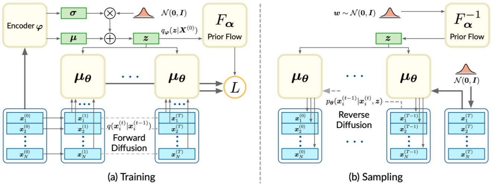
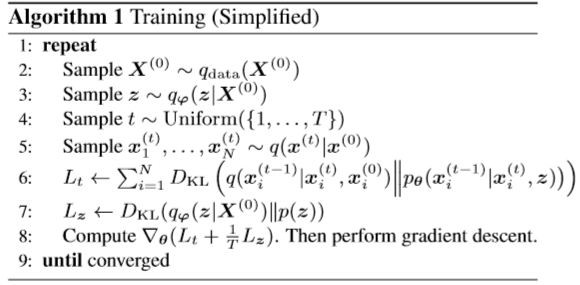

# Diffusion Probabilistic Models for 3D Point Cloud Generation

CVPR2021 3D点云生成的扩散概率模型

## Abstract

We present a probabilistic model for point cloud generation, which is critical for various 3D vision tasks such as shape completion,upsampling, synthesis and data augmentation. Inspired by the diffusion process in non-equilibrium thermodynamics, we view points in point clouds as particles in a thermodynamic system in contact with a heat bath, which diffuse from the original distribution to a noise distribution. Point cloud generation thus amounts to learning the reverse diffusion process that transforms the noise distribution to the distribution of a desired shape. Specifically, we propose to model the reverse diffusion process for point clouds as a Markov chain conditioned on certain shape latent. We derive the variational bound in closed form for training and provide implementations of the model. Experimental results demonstrate that our model achieves the state-of-the-art performance in point cloud generation and auto-encoding. 

​	我们提出了一种用于点云生成的概率模型，该模型对于各种3D视觉任务（例如形状补全，上采样，合成和数据增强）至关重要。 受**非平衡热力学扩散过程**的启发，我们将点云中的点视为与热浴接触的热力学系统中的粒子，这些粒子从原始分布扩散到噪声分布。 因此，点云的生成相当于学习**反向扩散过程**，该过程将噪声分布转换为所需形状的分布。 具体来说，我们建议将点云的逆扩散过程建模为以某些形状潜伏为条件的**马尔可夫链**。 我们导出了封闭形式的变分边界进行训练，并提供了模型的实现。 实验结果表明，我们的模型在点云生成和自动编码方面达到了最先进的性能。

## 1. Introduction

With recent advances in depth sensing and laser scanning, point clouds have attracted increasing attention as a popular representation for modeling 3D shapes. Significant progress has been made in developing methods for point cloud analysis, such as classification and segmentation [16, 17, 23]. On the other hand, learning generative models for point clouds is powerful in unsupervised representation learning to characterize the data distribution, which lays the foundation for various tasks such as shape completion, upsampling, synthesis, etc. 随着深度感测和激光扫描的最新进展，点云作为用于3D形状建模的流行表示形式已引起越来越多的关注。 在开发点云分析方法方面已经取得了重大进展，例如分类和分割[16、17、23]。 另一方面，学习点云的生成模型在无监督表示学习中很强大，可以表征数据分布，这为完成形状，上采样，合成等各种任务奠定了基础。

Generative models such as variational auto-encoders (VAEs), generative adversarial networks (GANs), normalizing flows, etc., have shown great success in image generation [13, 8, 5, 6]. However, these powerful tools cannot be directly generalized to point clouds, due to the irregular sampling patterns of points in the 3D space in contrast to regular grid structures underlying images. Hence, learning generative models for point clouds is quite challenging. Prior research has explored point cloud generation via GANs [1, 22, 19], auto-regressive models [21], flow-based models [25] and so on. While remarkable progress has been made, these methods have some inherent limitations for modeling point clouds. For instance, the training procedure could be unstable for GANs due to the adversarial losses. Auto-regressive models depend on the generation order, and thus lack flexibility. In flow-based models, the constraint of invertibility might limit the expressive power of the model, and the training and inference are slow especially when the flow is continuous. 

生成模型，例如变分自动编码器（VAE），生成对抗网络（GAN），归一化流等，在图像生成中已显示出巨大的成功[13、8、5、6]。 但是，由于3D空间中点的不规则采样模式与图像下面的规则网格结构相比，这些强大的工具无法直接推广到点云。 因此，学习点云的生成模型非常具有挑战性。 先前的研究已经探索了通过GAN [1、22、19]，自回归模型[21]，基于流量的模型[25]等生成点云的方法。尽管已经取得了显着进展，但是这些方法在建模点云方面存在一些固有的局限性。例如，由于对抗性损失，对于GAN而言，训练过程可能是不稳定的。自回归模型取决于生成顺序，因此缺乏灵活性。**在基于流的模型中，可逆性的约束可能会限制模型的表达能力，并且训练和推理很慢，尤其是在连续的流中**。

In this paper, we propose a probabilistic generative model for point clouds in spired by **non-equilibrium thermodynamics**, exploiting the **reverse diffusion** process to learn the **point distribution**. As a point cloud is composed of discrete points in the 3D space,we regard these points as particles in a non-equilibrium thermodynamic system in contact with a heat bath. Under the effect of the heat bath, the position of particles evolves stochastically in the way that they diffuse and eventually spread over the space. This process is termed the diffusion process that converts the initial distribution of the particles to a simple noise distribution by adding noise at each time step [12, 20]. 在本文中，我们提出了一种由**非平衡热力学**激发的点云的概率生成模型，并利用**反向扩散**过程学习了**点分布**。由于点云由3D空间中的离散点组成，因此我们将这些点视为与**热浴**接触的非平衡热力学系统中的粒子。在热浴的作用下，粒子的位置以它们**扩散并最终散布**在整个空间中的方式随机演化。此过程称为扩散过程，该过程通过在每个时间步长[12，20]上添加噪声，将粒子的初始分布转换为简单的噪声分布。 

Analogously, we connect the point distribution of point clouds to a noise distribution via the **diffusion process**. Naturally, in order to model the point distribution for point cloud generation, we consider the reverse diffusion process, which recovers the target point distribution from the noise distribution.  类似地，我们通过**扩散过程**将点云的点分布连接到噪声分布。自然地，为了建模用于点云生成的点分布，我们考虑了反向扩散过程，该过程从噪声分布中恢复了目标点分布。

In particular, we model this **reverse diffusion process** as a Markov chain that converts the **noise distribution** into the **target distribution**. Our goal is to learn its transition kernel such that the Markov chain can reconstruct the desired shape. Further, as the purpose of the Markov chain is modeling the **point distribution**, the Markov chain alone is incapable to generate point clouds of various shapes. 特别地，我们将此逆扩散过程建模为将**噪声分布转换为目标分布**的马尔可夫链。 我们的目标是学习其**过渡核**，以便马尔可夫链可以重构所需的形状。此外，由于马尔可夫链的目的是对**点分布进行建模**，因此仅马尔可夫链无法生成各种形状的点云。

To this end, we introduce a **shape latent** as the condition for the transition kernel. In the setting of generation, the shape latent follows a prior distribution which we parameterize via normalizing flows [5, 6] for strong model expressiveness. In the setting of auto-encoding, the shape latent is learned end-to-end. 为此，我们介绍了形状潜伏作为过渡内核的条件。在生成的设置中，形状潜伏遵循先验分布，我们通过归一化流[5，6]进行参数化以实现强大的模型表达能力。在自动编码的设置中，形状潜伏是端到端学习的。

Finally, we formulate the training objective as maximizing the variational lower bound of the likelihood of the point cloud conditional on the shape latent, which is further formulated into tractable expressions in **closed form**. 最后，我们将训练目标表述为最大化**形状潜伏条件下的点云**的**似然变化下限**，并进一步将其表达为**封闭形式**的易处理表达式。

Our main contributions include: 

- We propose a novel probabilistic generative model for point clouds, inspired by the diffusion process in nonequilibrium thermodynamics. 
- We derive a tractable training objective from the variational lower bound of the likelihood of point clouds conditioned on some shape latent. 
- Extensive experiments show that our model achieves the state-of-the-art performance in point cloud generation and auto-encoding. 

我们的主要贡献包括：

- 我们提出了一种新的针对点云的概率生成模型，该模型受非平衡热力学扩散过程的启发。
- 我们从以某种shape latent为条件的点云的似然变化下界导出了一个易于处理的训练目标。
- 大量实验表明，我们的模型在点云生成和自动编码方面达到了最先进的性能。

---

## 2. Related Works

### Point Cloud Generation 

Early point cloud generation methods [1, 7] treat point clouds as N ×3 matrices, where N is the fixed number of points, converting the point cloud generation problem to a matrix generation problem, so that existing generative models are readily applicable. For example, [7] apply variational auto-encoders [13] to point cloud generation. [1] employ generative adversarial networks [8] based on a pre-trained auto-encoder. The main defect of these methods is that they are restricted to generating point clouds with a fixed number of points, and lack the property of permutation invariance. FoldingNet and AtlasNet [26, 10] mitigate this issue by learning a mapping from 2D patches to the 3D space, which deforms the 2D patches into the shape of point clouds. These two methods allow generating arbitrary number of points by first sampling some points on the patches and then applying the mapping on them. In addition, the points on the patches are inherently invariant to permutation. 早期的点云生成方法[1，7]将点云视为N×3矩阵，其中N是点的固定数目，将点云生成问题转换为矩阵生成问题，因此易于使用现有的生成模型。 例如，[7]将变分自动编码器[13]应用于点云生成。  [1]采用基于预先训练的自动编码器的生成对抗网络[8]。 这些方法的主要缺点是它们仅限于生成具有固定点数的点云，并且缺乏置换不变性的特性。  FoldingNet和AtlasNet [26，10]通过学习从2D补丁到3D空间的映射来缓解此问题，该映射将2D补丁变形为点云的形状。 这两种方法允许通过首先对 patch 上的一些点进行采样，然后对它们应用映射来生成任意数量的点。 另外，补丁上的点固有地对于排列是不变的。

​	The above methods rely on heuristic set distances such as the Chamfer distance (CD) and the Earth Mover’s distance (EMD). As pointed out in [25], CD has been shown to incorrectly favor point clouds that are overly concentrated in the mode of the marginal point distribution, and EMD is slow to compute while approximations could lead to biased gradients. 上述方法依赖于启发式设定距离，例如倒角距离（CD）和推土机距离（EMD）。 正如在[25]中指出的那样，已证明CD不正确地偏爱了边缘点分布模式下过于集中的点云，并且EMD的计算速度较慢，而近似值可能会导致倾斜的梯度。

Alternatively, point clouds can be regarded as **samples from a point distribution**. This viewpoint inspires exploration on applying likelihood-based methods to point cloud modeling and generation. PointFlow [25] employs continous normalizing flows [4, 9] to model the distribution of points. DPF-Net[14]uses affine coupling layers as the normalizing flow to model the distribution. PointGrow [21] is an auto-regressive model with exact likelihoods. More recently, [2] proposed a score-matching energy-based model ShapeGF to model the distribution of points. 或者，点云可以视为来自**点分布的样本**。 该观点激发了探索将**基于似然**的方法应用于点云建模和生成的探索。PointFlow [25]使用连续归一化流量[4，9]来建模点的分布。DPF-Net [14]使用适当的耦合层作为归一化流来对分布进行建模。  PointGrow [21]是具有精确似然的自回归模型。最近，[2]提出了一种基于得分匹配能量的模型ShapeGF来建模点的分布。

Our method also regards point clouds as samples from a distribution,but differs in the probabilistic model compared to prior works. We leverage the reverse diffusion Markov chain to model the distribution of points, achieving both simplicity and flexibility. Specifically, the training process of our model involves learning the Markov transition kernel, whose training objective has a simple function form. By contrast, GAN-based models involve complex adversarial losses,flow-based methods involve expensive ODE integration and score-matching-based methods involve second-order gradients. In addition, our model is flexible, because it does not require invertibility in contrast to flow-based models, and does not assume ordering compared to autoregressive models. **我们的方法也将点云视为来自分布的样本**，但与先前的工作相比，其概率模型有所不同。我们利用反向扩散马尔可夫链对点的分布进行建模，从而实现了简单性和灵活性。具体来说，我们模型的训练过程包括学习马尔可夫过渡核，其训练目标具有简单的函数形式。相比之下，基于GAN的模型涉及复杂的对抗损失，**基于流的方法涉及昂贵的ODE集成**，而基于得分匹配的方法则涉及二阶梯度。 此外，我们的模型是灵活的，**因为与基于流的模型相比，它不需要可逆性**，并且与自回归模型相比，它不假设有序。

---

### Diffusion Probabilistic Models 

The diffusion process considered in this work is related to the diffusion probabilistic model [20, 11]. Diffusion probabilistic models are a class of latent variable models, which also use a Markov chain to convert the noise distribution to the data distribution. Prior research on diffusion probabilistic models focuses on the unconditional generation problem for toy data and images. In this work, we focus on point cloud generation,whichisaconditionalgenerationproblem,becausethe Markov chain considered in our work generates points of a point cloud conditioned on some shape latent. This conditionaladaptationleadstosignificantlydifferenttrainingand sampling schemes compared to prior research on diffusion probabilistic models.

在这项工作中考虑的扩散过程与扩散概率模型有关[20，11]。扩散概率模型是一类潜在变量模型，它们也使用马尔可夫链将噪声分布转换为数据分布。 先前对扩散概率模型的研究集中在玩具数据和图像的无条件生成问题上。 在这项工作中，我们专注于点云的生成，这是有条件的生成问题，因为在我们的工作中考虑的马尔可夫链会生成以某种形状潜伏为条件的点云的点。 与先前对扩散概率模型的研究相比，这种条件适应导致显着不同的训练和采样方案。

## 3. Diffusion Probabilistic Models for Point Clouds 

Inthissection,wefirstformulatetheprobabilisticmodel of both the forward and the reverse diffusion processes for point clouds. Then, we formulate the objective for training the model. The implementation of the model will be provided in the next section.

在本节中，我们将为点云建立**正向**和**反向**扩散过程的**概率模型**。 然后，我们制定了训练模型的目标。下一部分将提供该模型的实现。

---

### 3.1. Formulation

我们将点云记为 $ \boldsymbol{X}^{(0)}=\left\{\boldsymbol{x}_{i}^{(0)}\right\}_{i=1}^{N} $，由N个点组成，该点是在一个热力学系统中形成的。 如第1节所述，可以将点云中的每个点 $x_i$ 视为独立于点分布进行采样，我们将其表示为 $q(x^{(0)}_i | z)$。 在这里，$z$ 是确定点分布的 shape latent。 

从物理上讲，随着时间的流逝，这些点逐渐扩散成混乱的点集。此过程被称为扩散过程，该过程将原始的**有意义的点分布**转换为**噪声分布**。 正向扩散过程建模为马尔可夫链[12]：
$$
\begin{equation}
 q\left(\boldsymbol{x}_{i}^{(1: T)} \mid \boldsymbol{x}_{i}^{(0)}\right)=\prod_{t=1} q\left(\boldsymbol{x}_{i}^{(t)} \mid \boldsymbol{x}_{i}^{(t-1)}\right) 
\end{equation} \tag{1}
$$
其中 $ q\left(\boldsymbol{x}_{i}^{(t)} \mid \boldsymbol{x}_{i}^{(t-1)}\right) $ 是马尔可夫扩散核。核在上一个时刻向点添加噪声，并在下一个时刻对点的分布进行建模。按照[20]的约定，我们将扩散核定义为：
$$
\begin{equation}
 q\left(\boldsymbol{x}^{(t)} \mid \boldsymbol{x}^{(t-1)}\right)=\mathcal{N}\left(\boldsymbol{x}^{(t)} \mid \sqrt{1-\beta_{t}} \boldsymbol{x}^{(t-1)}, \beta_{t} \boldsymbol{I}\right), t=1, \ldots, T 
\end{equation} \tag{2}
$$
其中 $ \beta_{1} \ldots \beta_{T} $ 是**控制过程扩散率**的方差调度超参数。

​	我们的目标是由潜在表示形式编码 $z$ 来生成的有意义形状的点云。我们将生成过程视为扩散过程的**逆过程**，即从简单噪声分布 $ p\left(\boldsymbol{x}_{i}^{(T)}\right) $ 采样的点近似于输入 $ q\left(\boldsymbol{x}_{i}^{(T)}\right) $ 。 然后，这些点穿过**反向马尔可夫链**，最终形成所需的形状。与仅将噪声添加到点的正向扩散过程不同，反向过程的目的是**从输入噪声中恢复所需的形状**，这需要从数据中进行训练。 我们将生成的逆扩散过程表述为：
$$
\begin{equation}
 p_{\boldsymbol{\theta}}\left(\boldsymbol{x}^{(0: T)} \mid \boldsymbol{z}\right)=p\left(\boldsymbol{x}^{(T)}\right) \prod_{t=1}^{T} p_{\boldsymbol{\theta}}\left(\boldsymbol{x}^{(t-1)} \mid \boldsymbol{x}^{(t)}, \boldsymbol{z}\right) 
\end{equation} \tag{3}
$$

$$
p_{\boldsymbol{\theta}}\left(\boldsymbol{x}^{(t-1)} \mid \boldsymbol{x}^{(t)}, \boldsymbol{z}\right)=\mathcal{N}\left(\boldsymbol{x}^{(t-1)} \mid \boldsymbol{\mu}_{\boldsymbol{\theta}}\left(\boldsymbol{x}^{(t)}, t, \boldsymbol{z}\right), \beta_{t} \boldsymbol{I}\right) \tag{4}
$$

其中 $μ_θ$ 是由通过 $θ$ 的神经网络参数化实现的估计均值。$z$ 是对点云目标形状进行潜在编码的编码。 起始分布 $ p\left(\boldsymbol{x}_{i}^{(T)}\right) $ 设置为标准正态分布 $ \mathcal{N}(\mathbf{0}, \boldsymbol{I}) $ 。给定一个形状潜伏 $z$，我们通过将一组从 $ p\left(\boldsymbol{x}_{i}^{(T)}\right) $  采样的点通过反向马尔可夫链来获得具有目标形状的点云。 

为了简洁起见，在以下各节中，我们将使用相对于整个点云 $\boldsymbol{X}^{(0)}$ 的分布。 由于点云上的点是从分配中独立采样的，因此，**整个点云的概率仅是每个点的概率的乘积**：
$$
\begin{aligned} q\left(\boldsymbol{X}^{(1: T)} \mid \boldsymbol{X}^{0}\right) &=\prod_{i=1}^{N} q\left(\boldsymbol{x}_{i}^{(1: T)} \mid \boldsymbol{x}_{i}^{(0)}\right)\end{aligned} \tag{5}
$$

$$
\begin{aligned}p_{\boldsymbol{\theta}}\left(\boldsymbol{X}^{(0: T)} \mid \boldsymbol{z}\right) &=\prod_{i=1}^{N} p_{\boldsymbol{\theta}}\left(\boldsymbol{x}_{i}^{(0: T)} \mid \boldsymbol{z}\right)\end{aligned} \tag{6}
$$

在制定了点云的正向和反向扩散过程之后，我们将正式确定点云的反向扩散过程的训练目标，如下所示。

### 3.2. Training Objective

训练逆扩散过程的目的是使点云的**对数似然**最大化：$\mathbb{E}\left[\log p_{\boldsymbol{\theta}}\left(\boldsymbol{X}^{(0)}\right)\right]$ 。 但是，由于直接优化精确的对数似然性是很棘手的，因此我们将其变分下限 **variational lower bound** 最大化：
$$
\begin{equation}
 \begin{aligned} \mathbb{E}\left[\log p_{\boldsymbol{\theta}}\left(\boldsymbol{X}^{(0)}\right)\right] \geq \mathbb{E}_{q} &\left[\log \frac{p_{\boldsymbol{\theta}}\left(\boldsymbol{X}^{(0: T)}, \boldsymbol{z}\right)}{q\left(\boldsymbol{X}^{(1: T)}, \boldsymbol{z} \mid \boldsymbol{X}^{(0)}\right)}\right] \\=\mathbb{E}_{q} &\left[\log p\left(\boldsymbol{X}^{(T)}\right)\right.\\ &+\sum_{t=1}^{T} \log \frac{p_{\boldsymbol{\theta}}\left(\boldsymbol{X}^{(t-1)} \mid \boldsymbol{X}^{(t)}, \boldsymbol{z}\right)}{q\left(\boldsymbol{X}^{(t)} \mid \boldsymbol{X}^{(t-1)}\right)} \\ &\left.-\log \frac{q_{\boldsymbol{\varphi}}\left(\boldsymbol{z} \mid \boldsymbol{X}^{(0)}\right)}{p(\boldsymbol{z})}\right] \end{aligned} 
\end{equation}
$$
可以将上述变分范围调整到训练目标 $L$ 中以使其最小化（详细推导在补充材料中提供）：
$$
\begin{equation}
 \begin{aligned} L(\boldsymbol{\theta}, \boldsymbol{\varphi})=\mathbb{E}_{q} &\left[\sum_{t=2}^{T} D_{\mathrm{KL}}\left(q\left(\boldsymbol{X}^{(t-1)} \mid \boldsymbol{X}^{(t)}, \boldsymbol{X}^{(0)}\right) \|\right.\right.\\ &-\log p_{\boldsymbol{\theta}}\left(\boldsymbol{X}^{(0)} \mid \boldsymbol{X}^{(1)}, \boldsymbol{z}\right) \\ &\left.+D_{\mathrm{KL}}\left(q_{\boldsymbol{\varphi}}\left(\boldsymbol{z} \mid \boldsymbol{X}^{(0)}\right) \| p(\boldsymbol{z})\right)\right] \end{aligned} 
\end{equation}
$$
由于点的分布相互独立，如等式（5）中所述，因此我们进一步扩展了训练目标：
$$
\begin{equation}
 L(\boldsymbol{\theta}, \boldsymbol{\varphi})=\mathbb{E}_{q}\left[\sum_{t=2} \sum_{i=1}^{N} D_{\mathrm{KL}}(\underbrace{q\left(\boldsymbol{x}_{i}^{(t-1)} \mid \boldsymbol{x}_{i}^{(t)}, \boldsymbol{x}_{i}^{(0)}\right)}_{\mathbb{(1)}} \|\right. \underbrace{\left.p_{\boldsymbol{\theta}}\left(\boldsymbol{x}_{i}^{(t-1)} \mid \boldsymbol{x}_{i}^{(t)}, \boldsymbol{z}\right)\right)}_{(2)}
\end{equation}
$$

$$
\begin{equation}
 -\sum_{i=1}^{N} \underbrace{\log p_{\boldsymbol{\theta}}\left(\boldsymbol{x}_{i}^{(0)} \mid \boldsymbol{x}_{i}^{(1)}, \boldsymbol{z}\right)}_{(3)}  \left.+D_{\mathrm{KL}}(\underbrace{q_{\boldsymbol{\varphi}}\left(\boldsymbol{z} \mid \boldsymbol{X}^{(0)}\right)}_{(4)} \| \underbrace{p(\boldsymbol{z})}_{(5)})\right] . 
\end{equation}
$$

可以有效地优化训练目标，因为右侧的每个项都易于处理，并且 $q$ 很容易从前向扩散过程中采样。 接下来，我们详细阐述这些术语以揭示如何计算目标。

①$ q\left(\boldsymbol{x}_{i}^{(t-1)} \mid \boldsymbol{x}_{i}^{(t)}, \boldsymbol{x}_{i}^{(0)}\right) $ 可以根据[11]用以下封闭形式的高斯计算：
$$
\begin{equation}
 q\left(\boldsymbol{x}_{i}^{(t-1)} \mid \boldsymbol{x}_{i}^{(t)}, \boldsymbol{x}_{i}^{(0)}\right)=\mathcal{N}\left(\boldsymbol{x}_{i}^{(t-1)} \mid \boldsymbol{\mu}_{t}\left(\boldsymbol{x}^{(t)}, \boldsymbol{x}^{(0)}\right), \gamma_{t} \boldsymbol{I}\right) 
\end{equation} \tag{10}
$$
其中，使用符号 $ \alpha_{t}=1-\beta_{t} $ 且 $ \bar{\alpha}_{t}=\prod_{s=1}^{t} \alpha_{s} $：
$$
\begin{equation}
 \begin{aligned} \boldsymbol{\mu}_{t}\left(\boldsymbol{x}^{(t)}, \boldsymbol{x}^{(0)}\right) &=\frac{\sqrt{\bar{\alpha}_{t-1}} \beta_{t}}{1-\bar{\alpha}_{t}} \boldsymbol{x}^{(0)}+\frac{\sqrt{\alpha_{t}}\left(1-\bar{\alpha}_{t-1}\right)}{1-\bar{\alpha}_{t}} \boldsymbol{x}^{(t)} \\ \gamma_{t} &=\frac{1-\bar{\alpha}_{t-1}}{1-\bar{\alpha}_{t}} \beta_{t} \end{aligned} 
\end{equation}\tag{11}
$$
②③ $ p_{\boldsymbol{\theta}}\left(\boldsymbol{x}_{i}^{(t-1)} \mid \boldsymbol{x}_{i}^{(t)}, \boldsymbol{z}\right)(t=1, \ldots, T) $ 是可训练的高斯方程，如公式4中所述。

④ $ q_{\varphi}\left(z \mid X^{(0)}\right)  $ 是近似后验分布。用变分自动编码器的话来说，$ q_{\varphi}\left(z \mid X^{(0)}\right)  $ 是将输入点云 $X^{(0)}$ 编码为潜码 $z$ 的分布的编码器。我们按照惯例将其假定为高斯：
$$
\begin{equation}
 q\left(z \mid \boldsymbol{X}^{(0)}\right)=\mathcal{N}\left(\boldsymbol{z} \mid \boldsymbol{\mu}_{\boldsymbol{\varphi}}\left(\boldsymbol{X}^{(0)}\right), \boldsymbol{\Sigma}_{\varphi}\left(\boldsymbol{X}^{(0)}\right)\right) 
\end{equation}\tag{12}
$$
⑤最后一项 $ p(\boldsymbol{z}) $ 是先验分布。 $ p(\boldsymbol{z}) $ 的最常见选择是各向同性的高斯 $ \mathcal{N}(\mathbf{0}, \boldsymbol{I}) $ 。除固定分布外，先验还可以是可训练的参数分布，它更灵活。 例如，可以使用归一化流[5，6]来参数化先验分布。在以下部分中，我们将展示如何优化式9中的目标并训练模型。

---

### 3.3. Training Algorithm

**Fig.3**  (a) illustrates how the objective is computed during the training process. (b) illustrates the generation process.   在训练过程中如何计算目标/生成过程

原则上，训练模型等于最小化公式中的目标。但是，评估 式9 要求对所有时间步长中的 KL 项的期望求和，这涉及从前向扩散过程中采样完整轨迹 $ \boldsymbol{x}_{i}^{(1)}, \ldots, \boldsymbol{x}_{i}^{(T)} $ 以便计算期望。

为了使训练更简单，更有效，遵循[11]中的近似，而不是对 式9 中所有时间步长评估总和的期望。我们从总和中随机选择一项，以在每个训练步骤中进行优化。

具体来说，这种简化的训练算法如下：

该算法中的第五条语句涉及从$ q\left(\boldsymbol{x}^{(t)} \mid \boldsymbol{x}^{(0)}\right) $提取样本。 据推测，这是通过从 式2 中的前向扩散过程中迭代采样来完成的。幸运的是，[11]证明 $ q\left(\boldsymbol{x}^{(t)} \mid \boldsymbol{x}^{(0)}\right) $ 是高斯的，从而避免了耗时的迭代采样过程：
$$
\begin{equation}
 q\left(\boldsymbol{x}^{(t)} \mid \boldsymbol{x}^{(0)}\right)=\mathcal{N}\left(\boldsymbol{x}^{(t)} \mid \sqrt{\bar{\alpha}_{t}} \boldsymbol{x}^{(0)},\left(1-\bar{\alpha}_{t}\right) \boldsymbol{I}\right) 
\end{equation} \tag{13}
$$
由于$ q\left(\boldsymbol{x}^{(t)} \mid \boldsymbol{x}^{(0)}\right) $是高斯型的，因此第6条语句中的 $L_t$ 可以通过重新参数化技巧来进一步简化[13]。 我们将这种简化的细节放在补充材料上。

## 4.Model Implementations 

​	上一节中的一般训练目标和算法为制定特定点云任务奠定了基础。 接下来，我们将分别针对点云生成和点云自动编码的训练目标进行调整。

### 4.1.Point Cloud Generator 

​	基于第3节中的模型，我们通过使用归一化流来参数化先验分布 $p(z)$，提出了一个用于点云生成的概率模型，这使该模型更加灵活[18，5]。具体来说，我们使用一堆细微的耦合层[6]作为归一化流。毫无疑问，适当的耦合层提供了一个可训练的双射器 $F_α$，它把各向同性的高斯映射到一个复杂的分布。由于映射是双射的，因此可以通过变量变化公式计算目标分布的确切概率：
$$
\begin{equation}
 p(z)=p_{\boldsymbol{w}}(\boldsymbol{w}) \cdot\left|\operatorname{det} \frac{\partial F_{\boldsymbol{\alpha}}}{\partial \boldsymbol{w}}\right|^{-1} \quad  其中 \boldsymbol{w}=F_{\boldsymbol{\alpha}}^{-1}(\boldsymbol{z}) 
\end{equation}
$$

## 6. Conclusions

We propose a novel probabilistic generative model for point clouds, taking inspiration from the diffusion process in non-equilibrium thermodynamics. We model the reverse diffusion process for point cloud generation as a Markov chain conditioned on certain shape latent, and derive a tractable training objective from the variational bound of thelikelihoodofpointclouds. Experimentalresultsdemonstrate that the proposed model achieves the state-of-the-art performance in point cloud generation and auto-encoding.

我们从非平衡热力学的扩散过程中得到启发，为点云提出了一种新的概率生成模型。 我们将点云生成的逆扩散过程建模为以一定形状潜伏为条件的马尔可夫链，并从点云似然度的变分界线得出可控的训练目标。 实验结果表明，所提出的模型在点云生成和自动编码方面达到了最先进的性能。

