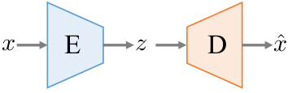
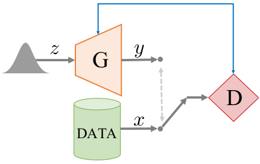

# 改写Pytorch

## start

```bash
docker run --runtime=nvidia --rm -it -v /tmp/.X11-unix:/tmp/.X11-unix -e DISPLAY=unix$DISPLAY -e GDK_SCALE -e GDK_DPI_SCALE nvidia/cuda:10.2-devel-ubuntu18.04

docker commit -a "duan" -m "xxxx" -p da14aa48af20 nvidia/cuda:10.2-devel-ubuntu18.04

docker cp 19eee7e5a43b:/home/latent_3d_points_Pytorch ./
```


------

## 环境调研

VAE: Auto-Encoding Variational Bayes-ICLR2014

NICE: NON-LINEAR INDEPENDENT COMPONENTS ESTIMATION-ICLR2015

RealNVP: DENSITY ESTIMATION USING REALNVP-ICLR2017

GLOW: Generative Flow with Invertible 1×1 Convolutions-NeurIPS2018

Learning Representations and Generative Models for 3D Point Clouds -ICLRW2018

DGCNN: `PyTorch 1.2 CUDA 10.0`

FoldingNet: `PyTorch 1.2 CUDA 10.0`

PU-Net: `TF1.3`

PU-GAN `TF1.11`

3D Point-Capsule Networks `PyTorch 1.0.0  CUDA 9.2`

PointFlow: `CUDA 10.0 PyTorch 1.0.1`

C-FLOW: `torch==1.2  torchvision`

SR-FLOW: `torch==1.7.0  torchvision==0.8.1`


## 制作镜像

```bash
# 确定cuda版本10.2 & 操作系统ubuntu18.04
docker pull nvidia/cuda:10.2-devel-ubuntu18.04
```


```bash
# 更换软件源
rm -r /etc/apt/sources.list.d
mv /etc/apt/sources.list /etc/apt/sources.list.bak

echo "deb http://mirrors.aliyun.com/ubuntu/ bionic main restricted universe multiverse
deb-src http://mirrors.aliyun.com/ubuntu/ bionic main restricted universe multiverse

deb http://mirrors.aliyun.com/ubuntu/ bionic-security main restricted universe multiverse
deb-src http://mirrors.aliyun.com/ubuntu/ bionic-security main restricted universe multiverse

deb http://mirrors.aliyun.com/ubuntu/ bionic-updates main restricted universe multiverse
deb-src http://mirrors.aliyun.com/ubuntu/ bionic-updates main restricted universe multiverse

deb http://mirrors.aliyun.com/ubuntu/ bionic-proposed main restricted universe multiverse
deb-src http://mirrors.aliyun.com/ubuntu/ bionic-proposed main restricted universe multiverse

deb http://mirrors.aliyun.com/ubuntu/ bionic-backports main restricted universe multiverse
deb-src http://mirrors.aliyun.com/ubuntu/ bionic-backports main restricted universe multiverse" > /etc/apt/sources.list

cat /etc/apt/sources.list
apt clean
apt update
```


```bash
# 安装sudo vi git
apt install -y sudo vim git xarclock wget cmake

本地 xhost+
```


```bash
# 安装python
apt install -y python python3 python3-pip python3-tk
ln -sf /usr/bin/python3 /usr/bin/python
ln -sf /usr/bin/pip3 /usr/bin/pip
rm -r /var/lib/apt/lists/*
```


```bash
# 安装pip
pip install --upgrade pip

# 换源1
mkdir ~/.pip
cd ~/.pip/
vi pip.conf

[global]
index-url = http://mirrors.aliyun.com/pypi/simple/
[install]
trusted-host=mirrors.aliyun.com

# 换源2
pip install --no-cache-dir --user pqi
pqi use aliyun 
```


```bash
# pytorch torchvision
# https://pytorch.org/get-started/locally/
# torch 1.7.0 & CUDA 10.2
pip install --no-cache-dir torch torchvision pytorch_lightning==0.10.0
```


## metric/cd

```bash
https://github.com/chrdiller/pyTorchChamferDistance

pip install --user --upgrade https://github.com/unlimblue/KNN_CUDA/releases/download/0.2/KNN_CUDA-0.2-py3-none-any.whl

sudo wget -P /usr/bin https://github.com/unlimblue/KNN_CUDA/raw/master/ninja && sudo chmod +x /usr/bin/ninja
```


## problem

```
如果把类当成了对象直接调用，就会是这样：
TypeError: __init__() takes 1 positional argument but 2 were given python
```


## tensorflow

```sh
1.3.0版本编译tf_nndistance_complie.sh
TF_INC=$(python -c 'import tensorflow as tf; print(tf.sysconfig.get_include())')
TF_LIB=$(python -c 'import tensorflow as tf; print(tf.sysconfig.get_lib())')

/usr/local/cuda-10.0/bin/nvcc -std=c++11 -c -o tf_nndistance_g.cu.o tf_nndistance_g.cu -I $TF_INC -DGOOGLE_CUDA=1 -x cu -Xcompiler -fPIC -O2 


g++ -std=c++11 tf_nndistance.cpp tf_nndistance_g.cu.o -o tf_nndistance_so.so -shared -fPIC -I $TF_INC -L $TF_LIB -O2


1.13.0版本编译tf_nndistance_complie.sh
#!/usr/bin/env bash

TF_INC=$(python -c 'import tensorflow as tf; print(tf.sysconfig.get_include())')
TF_LIB=$(python -c 'import tensorflow as tf; print(tf.sysconfig.get_lib())')

/usr/local/cuda-10.0/bin/nvcc -D_GLIBCXX_USE_CXX11_ABI=0 -std=c++11 -c -o tf_nndistance_g.cu.o tf_nndistance_g.cu -I $TF_INC -DGOOGLE_CUDA=1 -x cu -Xcompiler -fPIC -O2

# TF1.13
g++ -std=c++11 tf_nndistance.cpp tf_nndistance_g.cu.o -o tf_nndistance_so.so -shared -fPIC -I $TF_INC -I /usr/local/cuda-10.0/include -I $TF_INC/external/nsync/public -lcudart -L /usr/local/cuda-10.0/lib64/ -L$TF_LIB -ltensorflow_framework -O2 -D_GLIBCXX_USE_CXX11_ABI=0

```


# 复现

## start

```bash
docker run --runtime=nvidia --rm -it -v /tmp/.X11-unix:/tmp/.X11-unix -e DISPLAY=unix$DISPLAY -e GDK_SCALE -e GDK_DPI_SCALE -p 8866:8888 tensorflow/tensorflow:1.3.0-devel-gpu

docker run --runtime=nvidia --rm -it -v /tmp/.X11-unix:/tmp/.X11-unix -e DISPLAY=unix$DISPLAY -e GDK_SCALE -e GDK_DPI_SCALE tensorflow/tensorflow:1.3.0-devel-gpu

jupyter notebook --allow-root --port 8888

xarclock
```


```bash
docker commit -a "duan" -m "xxxx" -p da14aa48af20 tensorflow/tensorflow:1.3.0-devel-gpu

docker cp ./ beb9cb3564cf:/home/
```


## 结构

```python
# Building Encoder
-------------------------------------------------------------------
encoder_conv_layer_0 
conv params  W =  192 conv params  b =  64 
bnorm params beta =  64 bnorm params gamma =  64
Tensor("single_class_ae_2/Relu:0", shape=(?, 2048, 64), dtype=float32)
output size: 131072 

-------------------------------------------------------------------
encoder_conv_layer_1 
conv params  W =  8192 conv params  b =  128 
bnorm params beta =  128 bnorm params gamma =  128
Tensor("single_class_ae_2/Relu_1:0", shape=(?, 2048, 128), dtype=float32)
output size: 262144 

-------------------------------------------------------------------
encoder_conv_layer_2 
conv params  W =  16384 conv params  b =  128 
bnorm params beta =  128 bnorm params gamma =  128
Tensor("single_class_ae_2/Relu_2:0", shape=(?, 2048, 128), dtype=float32)
output size: 262144 

-------------------------------------------------------------------
encoder_conv_layer_3 
conv params  W =  32768 conv params  b =  256 
bnorm params beta =  256 bnorm params gamma =  256
Tensor("single_class_ae_2/Relu_3:0", shape=(?, 2048, 256), dtype=float32)
output size: 524288 

-------------------------------------------------------------------
encoder_conv_layer_4 
conv params  W =  32768 conv params  b =  128 
bnorm params beta =  128 bnorm params gamma =  128
Tensor("single_class_ae_2/Relu_4:0", shape=(?, 2048, 128), dtype=float32)
output size: 262144 

Tensor("single_class_ae_2/Max:0", shape=(?, 128), dtype=float32)
```


```python
# Building Decoder
-------------------------------------------------------------------
decoder_fc_0 FC params W =  32768 ; FC params b =  256 
Tensor("single_class_ae_2/Relu_5:0", shape=(?, 256), dtype=float32)
output size: 256 
-------------------------------------------------------------------
decoder_fc_1 FC params W =  65536 ; FC params b =  256 
Tensor("single_class_ae_2/Relu_6:0", shape=(?, 256), dtype=float32)
output size: 256 
-------------------------------------------------------------------
decoder_fc_2 FC params W =  1572864 FC params b =  6144 
Tensor("single_class_ae_2/decoder_fc_2/BiasAdd:0", shape=(?, 6144), dtype=float32)
output size: 6144
```


## 编译.cu

```makefile
nvcc = /usr/local/cuda-8.0/bin/nvcc
cudalib =  /usr/local/cuda-8.0/lib64
tensorflow = /usr/local/lib/python2.7/dist-packages/tensorflow/include
```


## jupyter

```bash
# 无缓存安装
pip --no-cache-dir install jupyter_contrib_nbextensions
pip --no-cache-dir install jupyter_nbextensions_configurator 
jupyter contrib nbextension install --user
```


## pip换源

```bash
mkdir -r .pip
cd .pip/
vi pip.conf

[global]
index-url = http://mirrors.aliyun.com/pypi/simple/
[install]
trusted-host=mirrors.aliyun.com
```


## python加路径

```python
import sys
sys.path.append(osp.abspath('../../')) # 绝对路径
sys.path.append(osp.abspath('/home')) # 绝对路径
```


# Learning Representations and Generative Models For 3D Point Clouds

学习3D点云的表示形式和生成模型


## Abstract

​	三维几何数据为研究表示学习和生成建模提供了一个很好的领域。在本文中，我们研究用点云表示的几何数据。

​	介绍了一种具有最先进的重构质量和泛化能力的deep AutoEncoder (AE) 网络。学习表示在三维识别任务上优于现有方法，通过简单的代数操作实现了形状编辑，如语义部分编辑、形状类比和形状插值以及形状补全。我们对不同的生成模型进行了深入的研究，包括在原始点云上运行的GANs、在我们AEs的固定潜空间中训练的具有显著提升的GANs以及高斯混合模型(GMMs)。

​	为了定量地评估生成模型，我们引入了基于点云组间匹配的样本保真度和多样性度量。有趣的是，我们对泛化、保真度和多样性的评估表明，在我们的AEs的潜在空间中训练过的GMMs总体效果最好。


---

## 1. Introduction

​	现实生活对象的三维（3D）表示形式是视觉，机器人，医学，增强现实和虚拟现实应用程序的核心工具。对用于深度学习的3D几何进行编码的最新尝试包括基于视图的投影，体积网格和图形。在这项工作中，我们专注于3D点云的表示。

   点云作为基于表面的几何结构的均匀，表达和紧凑的表示正变得越来越流行，它能够在不占用空间的情况下表示几何细节。点云特别适合简单的几何运算，并且是范围扫描设备（如LiDAR，Kinect或iPhone的人脸ID功能）使用的标准3D采集格式。


​	所有上述编码虽然在其目标任务（例如渲染或获取）中均有效，但很难直接以其原始形式进行操作。 例如，以任何一种表示形式在两辆汽车之间进行简单内插不会产生“中级”汽车的表示。

   此外，这些表示不太适合通过经典统计方法设计生成模型。 使用它们来编辑和设计新对象涉及到定制和特定于对象的参数模型的构建和操作，这些模型将语义与表示联系在一起。 此过程需要大量的专业知识和精力。


​	深度学习带来了数据驱动方法的希望。

​	在数据丰富的领域，深度学习工具消除了对手工功能和模型的需求。诸如自动编码器（AE）（Rumelhart，1988; Kingma＆Welling，2013）和生成对抗网络（GANs）（Goodfellow，2014; Radford，2016; Che，2016）之类的架构在 学习数据表示并根据复杂的基础分布生成逼真的样本。然而，基于GAN的生成管道的一个问题是训练它们非常困难且不稳定（Salimans，2016）。 另外，也许更重要的是，目前还没有普遍接受的评估生成模型的方法。


​	在本文中，我们探索了使用深度架构来学习表示形式，并介绍了第一个针对点云的深度生成模型。 文献中仅存在少数针对3D点云量身定制的深度架构，它们的重点在其他地方：它们要么针对分类和分割（Qi，2016a; 2017），要么仅将点云用作中间件或输出代表（Kalogerakis，2016; Fan，2016）。 我们的具体贡献是：

- 一种新的点云AE架构（受最近用于分类的架构的启发Qi，2016a），可以学习紧凑的表示形式：

  - （i）在看不见的样本上具有良好的重建质量；  
  - （ii）通过简单的SVM获得良好的分类质量，优于最新技术（Wu等人，2016）;  
  - （iii）有意义的语义运算，插值和形状补全的能力。

- 第一套用于点云的深度生成模型，能够以

  - （i）相当高的保真度

  - （ii）训练和保留数据的良好覆盖范围 

​	来合成点云。我们建议的一个工作流程是，首先训练AE以学习潜在表示，然后在该固定潜在空间中训练生成模型。 在潜在空间中训练的GAN（在这里称为l-GAN）比原始GAN更易于训练，并且可以实现出色的重构并更好地覆盖数据分布。 在潜在空间中训练时，多类GAN的性能几乎与特定于类的GAN相当。

​    

- 就各种新旧点云度量的适用性进行研究

  - （i）作为学习良好表示的物体； 
  - （ii）用于评估生成的样本。 我们发现常用的量度（Chamfer距离）无法识别某些病理情况。

- 基于两个不同点云集合之间的最佳匹配，生成模型的保真度和覆盖率度量。 我们的覆盖率指标可以识别生成模型完全遗漏的部分数据分布，基于基数的多样性指标可能无法捕获（Arora＆Zhang，2017）。


​	本文的其余部分安排如下：第2节概述了我们工作的基本组成部分的一些背景。 第三部分介绍了用于评估生成点云管道的指标。 第4节讨论了用于潜在表示学习和生成的体系结构。 在第5节中，我们进行了全面的实验，从数量和质量上评估了我们的所有模型。 进一步的结果可以在附录中找到。 最后，我们所有模型的代码都可以公开获得1。


## 2. Background

​	在本节中，我们提供了点云的必要背景，它们的度量标准以及我们将在本文其余部分中使用的基本构建块。

### 2.1. Point clouds

#### Definition

​	点云将几何形状（通常是其表面）表示为欧氏坐标系中的一组3D位置。 在3D中，这些位置由其x，y，z坐标定义。 因此，对象或场景的点云表示是N×3矩阵，其中N是点数，称为点云分辨率。

​	在构建网络体系结构时，点云作为一种输入方式提出了一系列独特的挑战。例如，卷积运算符-现在在图像处理管道中无处不在-需要在底层网格状结构的顶部定义输入信号。 这种结构在原始点云中不可用，这使它们比图像或体素网格更加难以编码。最近对点云的分类工作（PointNet）通过避免涉及点组的卷积来绕过此问题。用点云表示的另一个相关问题是它们是置换不变的：对点云矩阵的行进行任何重新排序都会产生表示相同形状的点云。此属性使定义重建损失所需的两个点集之间的比较复杂化。 还产生了使编码特征置换不变的需求。


https://www.zhihu.com/people/liu-xin-chen-64/posts

https://zhuanlan.zhihu.com/p/148896017

https://www.zhihu.com/question/20542936

---

#### Metrics

​	Fan 提出了两种用于比较无序点集的置换不变度量。一方面，EMD（Earth Mover’s distance）是一种运输问题的解决方案，它试图将一套转换为另一套。 对于两个相等大小的子集 $S_1⊆R_3$，$S_2⊆R_3$，它们的EMD定义为
$$
d_{E M D}\left(S_{1}, S_{2}\right)=\min _{\phi: S_{1} \rightarrow S_{2}} \sum_{x \in S_{1}}\|x-\phi(x)\|_{2}
$$
​	其中 $φ$ 是双射。 作为一种损失，EMD几乎处处可微。

​	另一方面，Chamfer (pseudo) distance（CD）测量一个集合中的每个点到另一集合中最近的邻居之间的平方距离：	
$$
d_{C H}\left(S_{1}, S_{2}\right)=\sum_{x \in S_{1}} \min _{y \in S_{2}}\|x-y\|_{2}^{2}+\sum_{y \in S_{2}} \min _{x \in S_{1}}\|x-y\|_{2}^{2}
$$
​	CD是可微的，与EMD相比，其计算效率更高。


---

### 2.2. Fundamental building blocks

#### Autoencoders

​	我们在本文中使用的主要深度学习组件之一是AutoEncoder（AE，inset），它是一种学习再现输入内容的体系结构。 当在输入和输出之间包含 narrow 的 **bottleneck layer** 时，AE特别有用。 成功训练后，该层将为每个数据点提供一个低维表示或代码。
   编码器（E）学习将数据点x压缩为其潜在表示z。 解码器（D）然后可以从其编码版本 z 产生 x 的重建 $\hat{\boldsymbol{x}}$。



#### Generative Adversarial Networks

​	在本文中，我们还使用最先进的生成模型“生成对抗网络（GAN）”。 基本架构基于生成器（G）与鉴别器（D）之间的对抗博弈。
   生成器旨在通过将随机分布的样本从简单分布 $\boldsymbol{z} \sim p_{\boldsymbol{z}}$ 中传递给生成器函数，来合成看起来与真实数据（从 $\boldsymbol{x} \sim p_{\text {data }}$ 中得出）没有区别的样本。 鉴别器的任务是区分合成样本与真实样本。




#### Gaussian Mixture Model

​	GMM是一种概率模型，用于表示假设其分布为多峰高斯分布（即由多个子种群组成）的总体，其中每个子种群都遵循高斯分布。

​	假设子种群的数量已知，则可以使用期望最大化（Expectation-Maximization, EM）算法从随机样本中学习GMM参数（高斯的均值和方差）。 安装后，GMM可用于对新型合成样品进行采样。	


## 3. Evaluation Metrics for Generative Models

​	这项工作的重要组成部分是引入可比较两组点云A和B的度量。这些度量标准对于评估合成或重建的点云代表与被保留群体相同人口的程度非常有用测试集。 我们的三种措施描述如下。


### JSD

​	欧几里得三维空间中定义的边界分布之间的简森-香农散度 **Jensen-Shannon Divergence**。 假设点云数据是轴向对齐的，并且在环境空间中具有规范的体素网格； 可以测量 A 点云倾向于占据与 B 相似的位置的程度。

​	为此，我们计算了 A 的所有点云中每个体素内的点数，对 B 同样操作，并报告 JSD 在获得的经验分布 $(PA,PB)$ 之间：
$$
J S D\left(P_{A} \| P_{B}\right)=\frac{1}{2} D\left(P_{A} \| M\right)+\frac{1}{2} D\left(P_{B} \| M\right)
$$
​	其中$M=\frac{1}{2}\left(P_{A}+P_{B}\right)$  ，且 $D(\cdot \| \cdot)$  表示两种分布之间的 KL 散度。


### Coverage

​	对于 A 中的每个点云，我们首先在 B 中找到它最接近的邻居。覆盖率的度量方式是 B 中的点云与 A 中的点云匹配的比例。

​	可以使用第2节中 CD 或 EMD 点集距离来计算紧密度的，因此得出了两个不同的指标 COV-CD 和 COV-EMD。 较高的覆盖率表示 B 的大部分在 A 中被表示。


### Minimum Matching Distance (MMD)

​	覆盖率并不能准确表明所覆盖的示例（点云）在集合A中的表现程度如何； 匹配的示例不必很接近。 我们需要一种方法来测量A相对于B的保真度。为此，我们将B的每个点云与A中具有最小距离（MMD）的点云进行匹配，并报告匹配中距离的平均值。 可以使用任何一个点集距离，从而产生 MMD-CD 和 MMDEMD。 由于 MMD 直接依赖于匹配的距离，因此它与A元素的真实性（相对于B）良好相关。


### Discussion

​	MMD和Coverage的互补性质直接来自它们的定义。 当MMD小且Coverage大时，点云A的集合保真地捕获B的所有模式。  JSD根本不同。 首先，它通过边际统计以较粗略的方式评估A和B之间的相似性。 其次，与其他两个指标相反，它需要预先对齐的数据，但在计算上也更友好。 我们已经发现并通过实验证明了它与MMD有很好的相关性，这使其成为例如MMD的有效替代方案。 模型选择，其中需要在点云集之间执行多个比较。

 

---

## 4. Models for Representation and Generation

​	在本节中，我们将从自动编码器开始描述神经网络的体系结构。 接下来，我们将介绍可直接与3D点云数据配合使用的GAN，以及首先在AE的潜在空间中训练AE，然后再训练最小GAN的解耦方法。 我们以依赖于经典高斯混合模型的类似但更简单的解决方案作为结束。


### 4.1. Learning representations of 3D point clouds

​	AE网络的输入是具有2048个点（2048×3矩阵）的点云，表示3D形状。

​	编码器架构遵循（Qi，2016）的设计原则：内核大小为1且特征数量不断增加的一维卷积层； 这种方法对每个点进行独立编码。在卷积之后放置“对称”，置换不变函数（例如max pooling）以产生联合表示。 

​	在我们的实现中，我们使用5个一维 conv 层，每个层后面是ReLU和batch-normalization层。最后一个 conv 层的输出被传递到特征量最大值，以产生k维向量，这是我们潜在空间的基础。我们的解码器使用3个 fully connected 层（前两个具有ReLU）来转换潜在向量，以产生2048×3的输出。对于置换不变目标，我们将EMD近似和CD作为结构 loss 进行了研究； 这将产生两个不同的AE模型，称为 AE-EMD 和 AE-CD 。

​	为了规范化 AE，我们考虑了各种瓶颈大小，通过随机旋转点云来使用 drop-out 和 on-the-fly。 这些选择的效果以及详细的培训/体系结构参数在附录（A节）中进行了展示。 在本文的其余部分，除非另有说明，否则我们使用具有128维 bottleneck 层的AE。


### 4.2. Generative models for Point Clouds

#### Raw point cloud GAN (r-GAN)

​	我们的第一个GAN以原始 2048×3 点集输入上运行。 鉴别器的架构与AE（过滤器大小和神经元数量的模数）相同，没有任何batch-norm，不使用ReLU，而使用leaky ReLUs。 最后一个fully connected的输出被馈送到sigmod神经元。发生器将高斯噪声矢量作为输入，并通过5个FC-ReLU层将其映射到2048×3输出。


#### Latent-space GAN (l-GAN)

​	对于我们的l-GAN，我们不对原始点云输入进行操作，而是通过预训练的自动编码器传递数据，该自动编码器针对具有EMD（或CD）损失函数的每个对象类分别进行了训练。 然后，l-GAN的生成器和判别器都对AE的 bottleneck 变量进行操作。
​	GAN的训练结束后，我们将使用AE的解码器将生成器学习到的代码转换为点云。 我们为整个实验选择的l-GAN架构比r-GAN架构简单得多。具体而言，单个隐藏层的MLP生成器与两个隐藏层的MLP鉴别符耦合足以产生可测量的良好且逼真的结果。

#### Gaussian mixture model

​	除了l-GAN外，我们还在我们的AE所学到的潜在空间上拟合了一系列高斯混合模型（GMM）。 我们尝试了各种高斯分量和对角或全协方差矩阵。 通过首先对拟合分布进行采样，然后使用AE的解码器（类似于l-GAN），可以将GMM转变为点云生成器。


## 5.  Experimental Evaluation

​	在本节中，我们通过实验确定了我们提出的评估指标的有效性，并强调了AE表示（第5.1节）和生成模型（第5.2节）的优点。 在论文的所有实验中，我们使用ShapeNet存储库中的形状（Chang等人，2015），这些形状是轴对齐并居中于单位球体中的。

   为了将这些形状（网格）转换为点云，我们按其面积成比例地均匀采样它们的面。 除非另有说明，否则我们使用来自单个对象类的点云训练模型，并使用分割率为85％-5％-10％的训练/验证/测试集。 在报告JSD测量值时，我们使用28 3常规体素网格来计算统计数据。


### 5.1. Representational power of the AE

​	我们首先展示 AE 的优点。 首先，我们报告其使用MMD-CD和MMD-EMD指标测量的泛化能力。 接下来，我们利用其潜在代码进行语义上有意义的操作。 最后，我们使用潜在表示来训练SVM分类器并报告获得的分类分数。


#### Generalization ability

​	我们的AE能够重建质量几乎与用于训练的形状一样好的看不见的形状。 在图1中，我们使用AE对测试分割中看不见的样本进行编码（每对图像的左侧），然后对其进行解码，然后将其可视化地与输入进行比较（右侧图像）。 为了定量地支持我们的视觉效果，在表1中，我们报告了椅子对象类的训练和测试数据集中的重构点云及其对应的地面真相之间的MMDCD和MMD-EMD。 

​	我们的指标下的概括差距很小； 为了使我们的报告数字有一定的规模意义，请注意，两个版本的测试集之间CD和EMD下的MMD分别为0.0003和0.033，这仅因点云采样中引入的随机性而不同。 可以基于附录图9中所示的每个数据集（训练或测试）获得的重建损失，得出有关AE泛化能力的类似结论。


####  Latent space and linearity

​	可以通过证明学习的表示适合直观且语义丰富的操作来提出反对过度拟合/过度拟合的另一种说法。 正如最近的几篇著作所显示的那样，训练有素的神经网络学习了潜在的表示形式，其中加法线性代数为此目的而工作（Mikolov等，2013； Tasse＆Dodgson，2016）。

​	 首先，在图2中，我们显示了在最左侧和最右侧几何之间的潜在空间中的线性插值。 类似地，在图3中，我们通过在潜在空间中添加具有特定特征的几何平均矢量（例如，无把手的敞篷汽车或杯子）来更改输入几何（左侧）。 附加操作（例如    形状类比）也是可行的，但由于篇幅所限，我们在附录（B节）中进行了说明并提供了详细信息，这些结果证明了所学空间的平滑性，同时也突出了点云被平滑变形的内在能力。

  

#### Shape completions

​	我们提出的AE架构可用于以最小的适应性解决形状完成问题。 具体而言，我们可以使用不完整版本的预期输出为网络供电，而不是供给和重建相同的点云。 给定适当的训练数据，我们的网络将学习完成严重的局部点云。 由于篇幅所限，我们在附录（D部分）中给出了该方法的确切细节，并在主文件的图4中演示了一些已完成的工作。


#### Classification

​	我们通过使用学习到的潜在代码作为分类功能，对AE的设计和效能进行了最终评估。 为了使该实验有意义，我们针对所有不同形状类别训练了AE：使用来自55种人造物体的57,000个模型。 仅在此实验中，我们使用512维的瓶颈，并沿重力轴对输入点云进行随机旋转。 为了获得输入3D形状的特征，我们将其点云输入到AE中并提取瓶颈激活向量。 然后，通过在ModelNet的实际3D分类基准上训练的线性SVM对向量进行分类（Wu等，2015）。 表2显示了比较结果。 值得注意的是，在ModelNet10数据集中，其中包括ShapeNet中人口众多的类（椅子，床等），我们的简单AE明显优于现有技术（Wu等，2016），而在图16的

​	图16中使用了 附录中，我们包含了在ModelNet40上根据我们的潜在代码评估的分类器的混淆矩阵–混淆发生在特别相似的几何形状之间：梳妆台与床头柜或花盆与床头柜,植物。 如果没有更严格的监督，可能很难了解区分这些对象的细微差别。


## A. AE Details

​	我们的AE的编码层实现为带有ReLU的1D卷积，内核大小为1，步幅为1，即独立对待每个3D点。 它们的解码层是使用FC-ReLU构建的MLP。 我们使用Adam（Kingma＆Ba，2014），初始学习率为0.0005，β1为0.9，批次大小为50来训练所有AE。


### A.1. AE used for SVM-based experiments

​	对于主要论文第5.1节与SVM相关的实验中提到的AE，我们在其每一层中使用了分别具有128、128、256和512个滤波器的编码器，以及分别具有1024、2048、2048×3个神经元的解码器。  。
   在每个层之间使用批处理归一化。 我们还通过将沿重力（z）轴的随机旋转应用于每个批次的输入点云来使用在线数据增强。 我们用CD损失训练了AE 1000个周期，使用EMD训练了1100个AE。


### A.2. All other AEs
​	对于所有其他AE，编码器每层具有64、128、128、256和k个滤波器，其中k是瓶颈大小。
​	解码器由3个FC-ReLU层组成，每个FC-ReLU层具有256、256、2048×3个神经元。 当使用单类数据时，我们将这些AE训练了最多500个历元，并在涉及5个形状类别的实验中训练了1000个历元（主要论文5.2节）。


### A.3. AE regularization

​	为了确定潜在空间的合适大小，我们构造了8个（否则在结构上相同）AE，其瓶颈大小为k∈{4，8。  。  。  512}，并在两个损失下用椅子对象类的点云训练它们（图9）。 我们对伪随机权重初始化重复了此过程3次，发现k = 128在测试数据上具有最佳的泛化误差，同时在火车分割上实现了最小的重构误差。


**Remark**

与我们的主要架构相比，不同的AE设置没有带来明显的优势。 具体来说，添加缺失层会导致重建效果变差，并且仅在编码器上使用批处理范数，从而加快了训练速度，并且当使用单类数据训练AE时，给我们带来了更好的泛化误差。 排他性地，对于主文件第5.1节的SVM实验，我们随机旋转输入椅子以促进旋转不变的潜在特征。


## B. Applications of the Latent Space Representation
​	对于形状编辑应用程序，我们使用在AE-EMD中学习的嵌入技术，该AE-EMD在所有55个对象类别中进行了训练，而不是按类别分别进行。 这展示了其对不同形状的特征进行编码的能力，并使涉及不同形状的有趣应用成为可能。


### Editing shape parts

​	我们使用Yi等人的形状注释（Yi等人，2016a）作为修改形状的指导。
   例如，假设给定的对象类别（例如  椅子）可以进一步细分为两个子类别A和B：每个对象A∈A都具有一定的结构特性（例如具有扶手，四腿等），而对象B∈B则没有。 使用我们的潜在表示，我们可以通过两个子类别之间的平均P表示之间的差异P x B-x A来建模此结构差异，其中x A = x A，x B = x B。 然后，给定对象A∈A的A∈AB∈B，我们可以通过变换其潜在表示来改变其属性：x A 0 = x A + x B -x A，并对x A 0进行解码以获得A 0∈B。 该过程在主纸的图3中显示。


